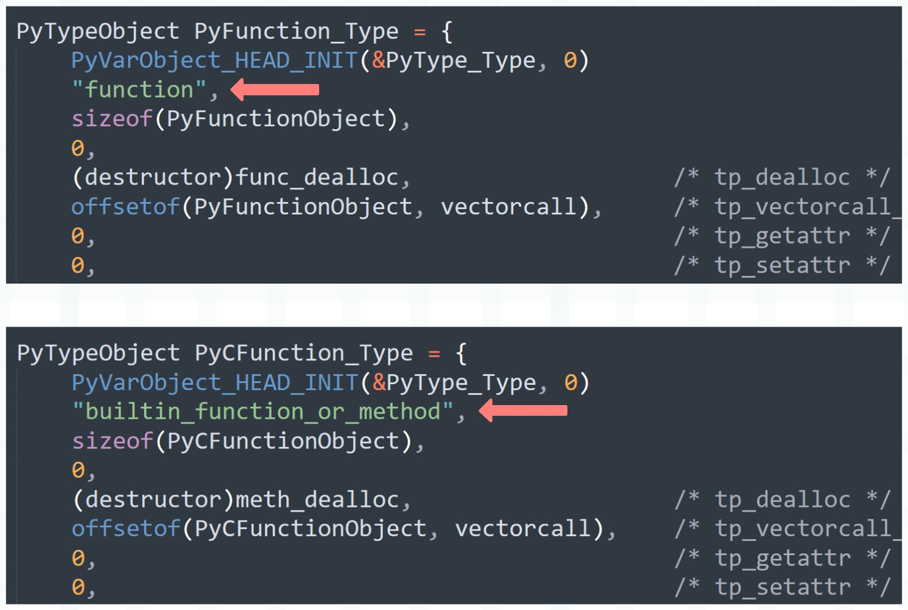
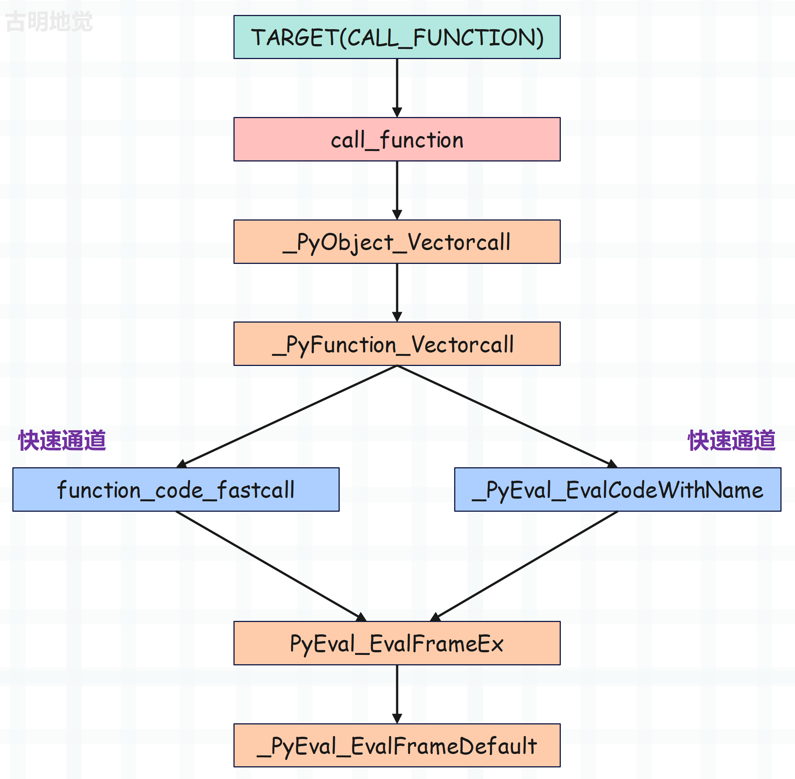

## 楔子

上一篇文章我们说了 Python 函数的底层实现，并且还演示了如何通过函数的类型对象自定义一个函数，以及如何获取函数的参数。虽然这在工作中没有太大意义，但是可以让我们深刻理解函数的行为。

那么接下来看看函数是如何调用的。

## PyCFunctionObject

在介绍调用之前，我们需要补充一个知识点。

```Python
def foo():
    pass

class A:

    def foo(self):
        pass

print(type(foo))  # <class 'function'>
print(type(A().foo))  # <class 'method'>
print(type(sum))  # <class 'builtin_function_or_method'>
print(type("".join))  # <class 'builtin_function_or_method'>
```

如果采用 Python 实现，那么函数的类型是 function，方法的类型是 method。而如果采用原生的 C 实现，那么函数和方法的类型都是 builtin_function_or_method。

关于方法，等我们介绍类的时候再说，先来看看函数。



所以函数分为两种：

- Python 实现的函数，在底层由 PyFunctionObject 结构体实例表示，其类型对象 <font color="blue">\<class 'function'\></font> 在底层由 PyFunction_Type 表示。
- C 实现的函数（还有方法），在底层由 PyCFunctionObject 结构体实例表示，其类型对象 <font color="blue">\<class 'builtin_function_or_method'\></font> 在底层由 PyCFunction_Type 表示。

像我们使用 def 关键字定义的就是 Python 实现的函数，而内置函数则是 C 实现的函数，它们在底层对应不同的结构，因为 C 实现的函数可以有更快的执行方式。

## 函数的调用

我们来调用一个函数，看看它的字节码是怎样的。

```python
import dis 

code_string = """
def foo(a, b):
    return a + b

foo(1, 2)
"""
dis.dis(compile(code_string, "<file>", "exec"))
```

字节码指令如下：

~~~C
  // 加载 PyCodeObject 对象，压入运行时栈
  0 LOAD_CONST               0 (<code object foo at 0x7f69...>)
  // 加载函数名 foo，压入运行时栈
  2 LOAD_CONST               1 ('foo')
  // 从栈顶弹出函数名和 PyCodeObject 对象，构建函数
  4 MAKE_FUNCTION            0
  // 将符号 foo 和函数对象绑定起来，存储在名字空间中
  6 STORE_NAME               0 (foo)
  // 加载全局变量 foo，压入运行时栈
  8 LOAD_NAME                0 (foo)
  // 加载常量 1，压入运行时栈
 10 LOAD_CONST               2 (1)
  // 加载常量 2，压入运行时栈
 12 LOAD_CONST               3 (2)
  // 弹出 foo 和参数，进行调用，指令参数 2，表示给调用的函数传递了两个参数
  // 函数调用结束后，将返回值压入栈中
 14 CALL_FUNCTION            2
  // 因为没有用变量保存，所以从栈顶弹出返回值并丢弃
 16 POP_TOP
  // 隐式的 return None
 18 LOAD_CONST               4 (None)
 20 RETURN_VALUE
  
  // 函数内部逻辑对应的字节码，比较简单，就不说了
Disassembly of <code object foo at 0x7f69...>:
  0 LOAD_FAST                0 (a)
  2 LOAD_FAST                1 (b)
  4 BINARY_ADD
  6 RETURN_VALUE
~~~

我们看到函数调用使用的是 CALL_FUNCTION 指令，那么这个指令都做了哪些事情呢？

~~~C
case TARGET(CALL_FUNCTION): {
    PREDICTED(CALL_FUNCTION);
    PyObject **sp, *res;
    // 指向运行时栈的栈顶
    sp = stack_pointer;
    // 调用函数，将返回值赋值给 res
    // tstate 表示线程状态对象，&sp 是一个三级指针，oparg 表示指令参数
    res = call_function(tstate, &sp, oparg, NULL);
    // 函数执行完毕之后，sp 会指向运行时栈的栈顶
    // 所以再将修改之后的 sp 赋值给 stack_pointer
    stack_pointer = sp;
    // 将 res 压入栈中：*stack_pointer++ = res
    PUSH(res);
    if (res == NULL) {
        goto error;
    }
    DISPATCH();
}
~~~

所以函数调用会执行 CALL_FUNCTION 指令，但是函数的核心执行流程是在 call_function 里面，它位于 ceval.c 中，我们来看一下。

~~~C
Py_LOCAL_INLINE(PyObject *) _Py_HOT_FUNCTION
call_function(PyThreadState *tstate, PyObject ***pp_stack, Py_ssize_t oparg, PyObject *kwnames)
{
    // pp_stack 参数是在 CALL_FUNCTION 指令中传入的栈顶指针的指针
    // 由于栈里面的元素都是 PyObject *，所以栈顶指针 stack_pointer 是 PyObject **
    // 而 pp_stack 是栈顶指针的指针，所以它的类型是 PyObject ***
    // 对于当前运行时栈来说，从栈底到栈顶的元素依次是：函数、参数1、参数2、...、参数n
    // 而 *pp_stack 指向栈顶元素，所以通过 (*pp_stack) - oparg - 1 即可拿到函数指针
    PyObject **pfunc = (*pp_stack) - oparg - 1;
    // 我们在 Python 中定义的 foo 就对应这里的 func 
    // 可能有人好奇，为什么要搞一个三级指针出来，直接传 stack_pointer 不好吗
    // 原因很简单，因为函数执行完毕之后，运行时栈的元素会发生改变
    // 这也意味着 stack_pointer 会发生改变，因为必须把它的指针传进去
    PyObject *func = *pfunc;
    // 两个 PyObject *
    PyObject *x, *w;
    // 通过关键字参数传递的参数个数，对于当前函数来说是 0
    Py_ssize_t nkwargs = (kwnames == NULL) ? 0 : PyTuple_GET_SIZE(kwnames);
    // 通过位置参数参数传递的参数个数，对于当前函数来说是 2
    Py_ssize_t nargs = oparg - nkwargs;
    // 移动栈指针，这里相当于 stack_pointer - oparg
    // 所以在移动之后，stack 会指向第一个参数
    PyObject **stack = (*pp_stack) - nargs - nkwargs;
    
    // 到此函数和参数都已经获取完毕，那么开始调用了，通过调用 C 函数来实现 Python 函数的调用
    // 如果通过 threading.settrace 或 sys.settrace 绑定了追踪函数，那么调用 trace_call_function
    if (tstate->use_tracing) {
        x = trace_call_function(tstate, func, stack, nargs, kwnames);
    }
    // 而我们这里没有绑定追踪函数，所以会调用 _PyObject_Vectorcall
    // 当然啦，trace_call_function 只是一个包装器，它内部依旧调用了 _PyObject_Vectorcall
    // 所谓的追踪函数只是为了在执行时收集一些堆栈信息，用于调试和性能分析
    else {
        x = _PyObject_Vectorcall(func, stack, nargs | PY_VECTORCALL_ARGUMENTS_OFFSET, kwnames);
    }
    // 执行完毕之后，将返回值赋值给 x，而在 CALL_FUNCTION 指令中，有下面一行代码：
    // res = call_function(tstate, &sp, oparg, NULL);
    // 里面的 res 就是这里返回的 x，后续会将 res 压入运行时栈
    // 如果没有接收返回值，那么再执行 POP_TOP 将其从栈顶弹出、丢弃
    // 如果接收了返回值，那么执行 STORE_FAST 将其保存起来
    assert((x != NULL) ^ (_PyErr_Occurred(tstate) != NULL));

    // 在后续将返回值 res 压入运行时栈之前，要先将栈里的函数参数清空
    while ((*pp_stack) > pfunc) {
        w = EXT_POP(*pp_stack);
        Py_DECREF(w);
    }
    // 循环结束之后，栈顶也发生了改变，因此在 CALL_FUNCTION 指令中，还要将 *pp_stack 赋值给 stack_pointer
    // 所以会有一行 stack_pointer = sp，而 sp 就是这里的 *pp_stack
    // 相信你明白在调用 call_function 时为什么要传递三级指针了，因为需要在调用完毕后，外部的 sp 能够被影响
    // 所以必须传递 &sp，即三级指针，当 *pp_stack 在变化时，外部的 sp 也在变化
    // 而 call_function 执行完毕后，sp 会指向新的栈顶，因此再将它赋值给 stack_pointer
    // 然后执行 PUSH(res)，也就是 *stack_pointer++ = res，将返回值压入运行时栈
    return x;
}
~~~

因此接下来重点就在 _PyObject_Vectorcall 函数上面，它都做了哪些事情呢？

~~~C
// Include/cpython/abstract.h

static inline PyObject *
_PyObject_Vectorcall(PyObject *callable, PyObject *const *args,
                     size_t nargsf, PyObject *kwnames)
{
    PyObject *res;
    vectorcallfunc func;
    assert(kwnames == NULL || PyTuple_Check(kwnames));
    assert(args != NULL || PyVectorcall_NARGS(nargsf) == 0);
    // 获取对象的 vectorcallfunc
    func = _PyVectorcall_Function(callable);
    // 如果 func 为空，说明对象不支持矢量调用
    if (func == NULL) {
        // 那么执行 tp_call，也就是退化为常规调用
        Py_ssize_t nargs = PyVectorcall_NARGS(nargsf);
        return _PyObject_MakeTpCall(callable, args, nargs, kwnames);
    }
    // 否则执行矢量调用函数
    res = func(callable, args, nargsf, kwnames);
    // 检查返回值的有效性，是否符合 Python 协议
    return _Py_CheckFunctionResult(callable, res, NULL);
}

// 获取对象内部的矢量调用函数
static inline vectorcallfunc
_PyVectorcall_Function(PyObject *callable)
{
    // 获取对象的类型对象
    PyTypeObject *tp = Py_TYPE(callable);
    // 类型对象的 tp_vectorcall_offset
    // 它记录了对象的矢量调用函数相对于对象首地址的偏移量
    Py_ssize_t offset = tp->tp_vectorcall_offset;
    vectorcallfunc ptr;
    // 先判断对象是否支持矢量调用，如果类型对象没有设置 _Py_TPFLAGS_HAVE_VECTORCALL 标志位
    // 即 tp->tp_flags & _Py_TPFLAGS_HAVE_VECTORCALL == 0
    // 说明变量 callable 指向的对象不支持矢量调用，因此返回 NULL，然后退化为常规调用
    if (!PyType_HasFeature(tp, _Py_TPFLAGS_HAVE_VECTORCALL)) {
        return NULL;
    }
    assert(PyCallable_Check(callable));
    assert(offset > 0);
    // 否则说明对象支持矢量调用，从对象的首地址向后偏移 offset 个字节，会得到一个函数指针
    // 这个函数指针符合矢量调用协议，由于我们调用的是 Python 函数，所以它肯定是支持的
    memcpy(&ptr, (char *) callable + offset, sizeof(ptr));
    return ptr;
}
~~~

Python 函数在底层对应的结构体是 PyFunctionObject，所以它内部一定有一个字段指向了符合矢量调用协议的函数，该字段便是 vectorcall。在介绍 Python 函数的创建时，我们看到它被赋值为 _PyFunction_Vectorcall。

~~~C
// Objects/funcobject.c

PyTypeObject PyFunction_Type = {
    PyVarObject_HEAD_INIT(&PyType_Type, 0)
    "function",                                 /* tp_name */
    sizeof(PyFunctionObject),                   /* tp_basicsize */
    0,                                          /* tp_itemsize */
    (destructor)func_dealloc,                   /* tp_dealloc */
    // PyFunctionObject 内部的 vectorcall 字段便是矢量函数指针
    // 而在类型对象 PyFunction_Type 中记录了它相对于 PyFunctionObject 的偏移量
    offsetof(PyFunctionObject, vectorcall),     /* tp_vectorcall_offset */
    0,                                          /* tp_getattr */
    // ...
}

PyObject *
PyFunction_NewWithQualName(PyObject *code, PyObject *globals, PyObject *qualname)
{
    PyFunctionObject *op;
    PyObject *doc, *consts, *module;
    static PyObject *__name__ = NULL;
    // ...
    // 被赋值为 _PyFunction_Vectorcall
    op->vectorcall = _PyFunction_Vectorcall;
    // ...
    _PyObject_GC_TRACK(op);
    return (PyObject *)op;
}
~~~

所以最终 _PyObject_Vectorcall 内部会通过 _PyFunction_Vectorcall 来执行 Python 函数，显然执行的关键就落在了 _PyFunction_Vectorcall 上面，看一下它的逻辑。

~~~C
// Objects/call.c

PyObject *
_PyFunction_Vectorcall(PyObject *func, PyObject* const* stack,
                       size_t nargsf, PyObject *kwnames)
{
    // 获取函数的 PyCodeObject 对象
    PyCodeObject *co = (PyCodeObject *)PyFunction_GET_CODE(func);
    // 获取函数的 global 名字空间
    PyObject *globals = PyFunction_GET_GLOBALS(func);
    // 获取函数的默认值参数
    PyObject *argdefs = PyFunction_GET_DEFAULTS(func);
    PyObject *kwdefs, *closure, *name, *qualname;
    PyObject **d;
    Py_ssize_t nkwargs = (kwnames == NULL) ? 0 : PyTuple_GET_SIZE(kwnames);
    Py_ssize_t nd;

    assert(PyFunction_Check(func));
    // 获取实际的参数个数
    Py_ssize_t nargs = PyVectorcall_NARGS(nargsf);
    assert(nargs >= 0);
    assert(kwnames == NULL || PyTuple_CheckExact(kwnames));
    assert((nargs == 0 && nkwargs == 0) || stack != NULL);
    
    // 如果没有仅限位置参数、没有关键字参数、没有闭包，那么走快速通道
    if (co->co_kwonlyargcount == 0 && nkwargs == 0 &&
        (co->co_flags & ~PyCF_MASK) == (CO_OPTIMIZED | CO_NEWLOCALS | CO_NOFREE))
    {   
        // 如果参数没有默认值，co_argcount 和传递的位置参数相等
        // 那么执行 function_code_fastcall
        if (argdefs == NULL && co->co_argcount == nargs) {
            return function_code_fastcall(co, stack, nargs, globals);
        }
        // 如果参数有默认值，但当参数和个数和默认值个数相等时（此时外界一个参数都不传）
        // 那么也会执行 function_code_fastcall
        else if (nargs == 0 && argdefs != NULL
                 && co->co_argcount == PyTuple_GET_SIZE(argdefs)) {
            stack = _PyTuple_ITEMS(argdefs);
            return function_code_fastcall(co, stack, PyTuple_GET_SIZE(argdefs),
                                          globals);
        }
        // 所以 function_code_fastcall 对应的便是快速通道，既然是快速通道，那么自然是要求的
        // 首先定义函数时，不可以出现 / 和 *，比如像 def foo(a, b, /, c, *, d) 这种
        // 也就是要这么定义：def foo(a, b, c, d)，不能有任何多余的东西
        // 然后传参的时候，也必须都通过位置参数传递，比如 foo(1, 2, 3, 4)，这种情况下会走快速通道
        // 第二种走快速通道的方式是，所有参数都有默认值，比如 def foo(a=1, b=2, c=3, d=4)
        // 然后调用时不额外传值，也就是让所有参数都使用默认值
        
        // 以上两种情况都会执行快速通道，而在 function_code_fastcall
    }
    
    // 否则执行通用逻辑
    // 获取仅限默认值参数、闭包、函数名等
    kwdefs = PyFunction_GET_KW_DEFAULTS(func);
    closure = PyFunction_GET_CLOSURE(func);
    name = ((PyFunctionObject *)func) -> func_name;
    qualname = ((PyFunctionObject *)func) -> func_qualname;

    if (argdefs != NULL) {
        d = _PyTuple_ITEMS(argdefs);
        nd = PyTuple_GET_SIZE(argdefs);
    }
    else {
        d = NULL;
        nd = 0;
    }
    // 执行通用逻辑 _PyEval_EvalCodeWithName
    return _PyEval_EvalCodeWithName((PyObject*)co, globals, (PyObject *)NULL,
                                    stack, nargs,
                                    nkwargs ? _PyTuple_ITEMS(kwnames) : NULL,
                                    stack + nargs,
                                    nkwargs, 1,
                                    d, (int)nd, kwdefs,
                                    closure, name, qualname);
}
~~~

无论是快速通道 function_code_fastcall，还是通用通道 _PyEval_EvalCodeWithName，它们内部做的事情都是一样的。

+ 调用 _PyFrame_New_NoTrack 函数创建栈帧，并初始化内部字段。
+ 栈帧创建完毕之后，里面的字段都是初始值，所以还要基于函数的参数信息修改栈帧字段。
+ 栈帧字段设置完毕之后，调用 PyEval_EvalFrameEx 函数，在栈帧中执行字节码。

而这两者的区别就在于第二步，如果走快速通道，那么它的参数处理会非常简单，我们看一下 function_code_fastcall 的逻辑。

~~~C
// Objects/call.c

static PyObject* _Py_HOT_FUNCTION
function_code_fastcall(PyCodeObject *co, PyObject *const *args, Py_ssize_t nargs,
                       PyObject *globals)
{
    PyFrameObject *f;
    PyThreadState *tstate = _PyThreadState_GET();
    PyObject **fastlocals;
    Py_ssize_t i;
    PyObject *result;

    assert(globals != NULL);
    assert(tstate != NULL);
    // 基于 PyCodeObject 对象、全局名字空间创建栈桢
    f = _PyFrame_New_NoTrack(tstate, co, globals, NULL);
    if (f == NULL) {
        return NULL;
    }
    // 获取 f_localsplus，它用于局部变量、cell 变量、free 变量、运行时栈
    // 不过这里不会存在 cell 变量和 free 变量，否则无法进入快速通道
    fastlocals = f->f_localsplus;
    // 将传递的位置参数拷贝到 f_localsplus 的第一段内存（局部变量）
    for (i = 0; i < nargs; i++) {
        Py_INCREF(*args);
        fastlocals[i] = *args++;
    }
    // 调用 PyEval_EvalFrameEx，然后执行帧评估函数 _PyEval_EvalFrameDefault
    result = PyEval_EvalFrameEx(f,0);

    if (Py_REFCNT(f) > 1) {
        Py_DECREF(f);
        _PyObject_GC_TRACK(f);
    }
    else {
        ++tstate->recursion_depth;
        Py_DECREF(f);
        --tstate->recursion_depth;
    }
    return result;
}
~~~

所以快速通道的整个过程非常简单，如果是走通用通道 _PyEval_EvalCodeWithName，它的逻辑也是一样的，只是在处理参数处理方面要复杂很多。比如要考虑位置参数、关键字参数、\*args、\*\*kwargs、哪些参数使用默认值、哪些参数不使用默认值等等。但快速通道和通用通道做的事情是一样的，都是先为调用的函数创建栈桢、然后设置栈桢字段、最后调用帧评估函数。

所以当调用一个 Python 函数时，底层 C 函数的调用链路就很清晰了。



因此我们看到，总共有两条途径，这两条途径的区别就在于一个参数复杂、一个参数不复杂。但最终两者是殊途同归的，都会走到 PyEval_EvalFrameEx 那里，然后在新的栈帧中执行字节码。

## 小结

以上就是整个函数的调用逻辑，还是非常清晰的，至于这两条执行途径的具体细节，以及参数是如何解析的，我们下一篇文章再说。

另外再补充一点，我们说 PyFrameObject 是根据 PyCodeObject 创建的，而 PyFunctionObject 也是根据 PyCodeObject 创建的，那么 PyFrameObject 和 PyFunctionObject 之间有啥关系呢？

很简单，如果把 PyCodeObject 比喻成妹子的话，那么 PyFunctionObject 就是妹子的备胎，PyFrameObject 就是妹子的心上人。其实在栈帧中执行指令的时候，PyFunctionObject 的影响就已经消失了。

也就是说，最终是 PyFrameObject 和 PyCodeObject 两者如胶似漆，跟 PyFunctionObject 没有关系。所以 PyFunctionObject 辛苦一场，实际上是为别人做了嫁衣，PyFunctionObject 主要是对 PyCodeObject 和 global 名字空间的一种打包和运输方式。

-------------

&nbsp;

**欢迎大家关注我的公众号：古明地觉的编程教室。**


**如果觉得文章对你有所帮助，也可以请作者吃个馒头，Thanks♪(･ω･)ﾉ。**

