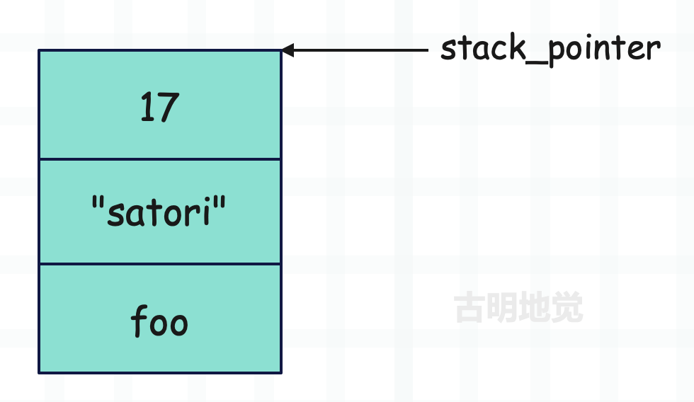
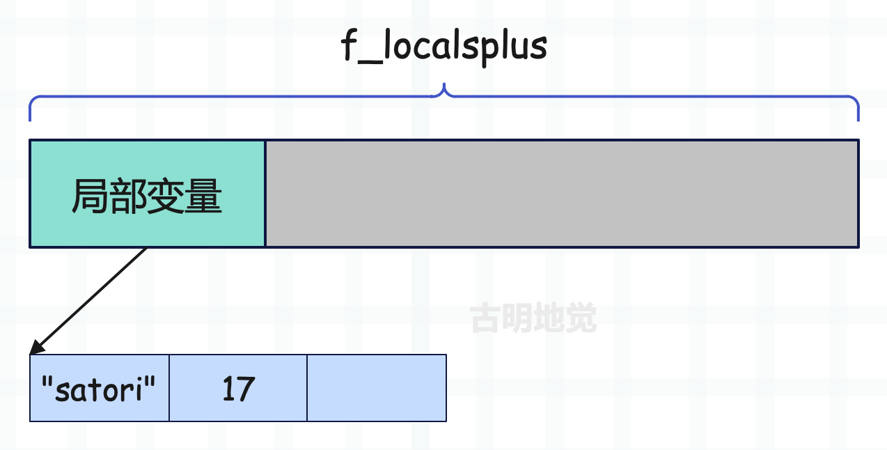

## 楔子

函数最大的特点就是可以接收参数，如果只是单纯的封装，未免太无趣了。对于函数来说，参数会传什么，事先是不知道的，函数体内部只是利用参数做一些事情，比如调用参数的 get 方法。但是到底能不能调用 get 方法，就取决于给参数传的值是什么了。

因此可以把参数看成是一个占位符，调用的时候，将值传进去赋给相应的参数，然后将函数内部的逻辑走一遍即可。

## 参数的类别

调用函数时传递的参数，根据形式的不同可以分为四种类别：

- 位置参数（positional argument）；
- 关键字参数（keyword argument）；
- 扩展位置参数（excess positional argument）；
- 扩展关键字参数（excess keyword argument）；

> 参数分为形参和实参，在英文中形参叫做 parameter，实参叫做 argument。但在中文里区分的不是那么明显，我们一般统一称为参数。

然后我们看一下 call_function。

~~~C
Py_LOCAL_INLINE(PyObject *) _Py_HOT_FUNCTION
call_function(PyThreadState *tstate, PyObject ***pp_stack, Py_ssize_t oparg, PyObject *kwnames)
{
    PyObject **pfunc = (*pp_stack) - oparg - 1;
    PyObject *func = *pfunc;
    PyObject *x, *w;
    Py_ssize_t nkwargs = (kwnames == NULL) ? 0 : PyTuple_GET_SIZE(kwnames);
    Py_ssize_t nargs = oparg - nkwargs;
    PyObject **stack = (*pp_stack) - nargs - nkwargs;
    // ...
}
~~~

CALL_FUNCTION 指令的 oparg 记录了函数的参数个数，包括位置参数和关键字参数。虽然扩展位置参数和扩展关键字参数是更高级的用法，但本质上也是由多个位置参数、多个关键字参数组成的。这就意味着，虽然函数中存在四种参数，但是只要记录位置参数和关键字参数的个数，就能知道一共有多少个参数，进而知道一共需要多大的内存来维护。

因此 call_function 里面的 nkwargs 就是调用函数时传递的关键字参数的个数，nargs 就是传递的位置参数的个数，两者加起来等于 oparg。然后是函数内部的局部变量的个数，可以通过 co_nlocals 来获取。

注意：局部变量包括了参数，因为函数参数也是局部变量，它们在内存中是连续放置的，局部变量的名称都存储在符号表 co_varnames 中。当虚拟机为函数申请局部变量的内存空间时，就需要通过 co_nlocals 知道局部变量的总数。

> 可能会有人将 co_nlocals 和 co_argcount 搞混，前者表示局部变量的个数，后者表示可以通过位置参数或关键字参数传递的参数个数。

~~~python
def foo(a, b, c, d=1):
    pass

print(foo.__code__.co_argcount)  # 4
print(foo.__code__.co_nlocals)  # 4

def foo(a, b, c, d=1):
    a = 1
    b = 1

print(foo.__code__.co_argcount)  # 4
print(foo.__code__.co_nlocals)  # 4

def foo(a, b, c, d=1):
    e = 1

print(foo.__code__.co_argcount)  # 4
print(foo.__code__.co_nlocals)  # 5
~~~

co_nlocals 等于参数的个数加上函数体中新创建的局部变量的个数，注意：函数参数也是局部变量，比如有一个参数 a，但函数体里面新建了一个变量也叫 a，这是重新赋值，因此还是相当于一个参数。

但是 co_argcount 只记录参数的个数，因此一个很明显的结论：对于任意一个函数，co_nlocals 一定大于等于 co_argcount。

~~~python
def foo(a, b, c, d=1, *args, **kwargs):
    pass

print(foo.__code__.co_argcount)  # 4
print(foo.__code__.co_nlocals)  # 6
~~~

我们看到，对于扩展位置参数和扩展关键字参数来说，co_argcount 是不算在内的，因为完全可以不传递，所以直接当成 0 来算。但我们在函数体内部肯定能拿到 args 和 kwargs，这也是两个局部变量，因此 co_argcount 是 4，co_nlocals 是 6。

> 所有的扩展位置参数都存储在一个 PyTupleObject 对象中，所有的扩展关键字参数都存储在一个 PyDictObject 对象中。

co_argcount 和 co_nlocals 的值在编译的时候就已经确定。

## 位置参数的传递

下面来看看位置参数是如何传递的：

~~~python
import dis

code = """
def foo(name, age):
    gender = "female"
    print(name, age)
    
foo("satori", 17)    
"""

dis.dis(compile(code, "<func>", "exec"))
~~~

相信对于现在的我们来说，下面的字节码已经没有任何难度了。

~~~C
  0 LOAD_CONST               0 (<code object foo at 0x7f3>)
  2 LOAD_CONST               1 ('foo')
  4 MAKE_FUNCTION            0
  6 STORE_NAME               0 (foo)

  8 LOAD_NAME                0 (foo)
 10 LOAD_CONST               2 ('satori')
 12 LOAD_CONST               3 (17)
 14 CALL_FUNCTION            2
 16 POP_TOP
 18 LOAD_CONST               4 (None)
 20 RETURN_VALUE

Disassembly of <code object foo at 0x7f3...>:
  0 LOAD_CONST               1 ('female')
  2 STORE_FAST               2 (gender)

  4 LOAD_GLOBAL              0 (print)
  6 LOAD_FAST                0 (name)
  8 LOAD_FAST                1 (age)
 10 CALL_FUNCTION            2
 12 POP_TOP
 14 LOAD_CONST               0 (None)
 16 RETURN_VALUE
~~~

这里我们先看 foo("satori", 17) 的字节码：

~~~C
  8 LOAD_NAME                0 (foo)
 10 LOAD_CONST               2 ('satori')
 12 LOAD_CONST               3 (17)
 14 CALL_FUNCTION            2
 16 POP_TOP
~~~

首先将函数以及相关参数压入运行时栈：

然后执行 CALL_FUNCTION 指令，由于在调用时全部都是位置参数，那么根据之前介绍的函数调用链路，我们知道它最终会执行 function_code_fastcall，即快速通道。这个函数之前介绍过了，这里再拿出来解释一遍。

~~~C
static PyObject* _Py_HOT_FUNCTION
function_code_fastcall(PyCodeObject *co, PyObject *const *args, Py_ssize_t nargs,
                       PyObject *globals)
{
    // 栈帧对象
    PyFrameObject *f;
    // 线程状态对象
    PyThreadState *tstate = _PyThreadState_GET();
    // f->localsplus
    PyObject **fastlocals;
    Py_ssize_t i;
    PyObject *result;

    assert(globals != NULL);
    assert(tstate != NULL);
    // 为调用的函数创建 PyFrameObject，参数是 PyCodeObject 和 global 空间
    // 因此最后执行的时候其实没有 PyFunctionObject 什么事，它只是起到一个打包和输送的作用
    f = _PyFrame_New_NoTrack(tstate, co, globals, NULL);
    if (f == NULL) {
        return NULL;
    }
    // 获取函数栈帧的 f_localsplus
    fastlocals = f->f_localsplus;
    // 调用函数时传递的参数会被提前压入运行时栈，注意：此时的运行时栈是模块的运行时栈
    // 因为加载参数入栈时，函数还没调用呢。所以对于当前来说，参数被压入了模块的运行时栈
    // 其中 nargs 表示参数个数，args 指向运行时栈的第一个参数
    // 然后将运行时栈中的参数拷贝到局部变量对应的内存中
    for (i = 0; i < nargs; i++) {
        Py_INCREF(*args);
        fastlocals[i] = *args++;
    }
    // 调用 PyEval_EvalFrameEx、进而调用 _PyEval_EvalFrameDefault
    // 以新创建的栈帧为执行环境，执行内部的字节码，执行完毕后将返回值赋给 result
    result = PyEval_EvalFrameEx(f,0);
    
    // 如果 f 的引用计数大于 1，说明栈帧被保存起来了
    // 引用计数减一之后，由于不会被销毁，所以还要被 GC 跟踪
    if (Py_REFCNT(f) > 1) {
        Py_DECREF(f);
        _PyObject_GC_TRACK(f);
    }
    else {
        ++tstate->recursion_depth;
        Py_DECREF(f);
        --tstate->recursion_depth;
    }
    // 返回 result
    return result;
}
~~~

从源码中可以看到，虚拟机首先通过 _PyFrame_New_NoTrack 创建了函数 foo 对应的栈帧对象。随后将参数逐个拷贝到新创建的栈帧对象的 f_localsplus 中，f_localsplus 是一个数组，在概念上被分成了四部分，而源码中的索引是从 0 开始的，所以运行时栈中的参数被拷贝到了局部变量对应的内存中。

再次强调：上面说的运行时栈指的是模块栈帧的运行时栈，因为加载参数的时候还没有涉及函数的调用。

~~~c
  // 函数、以及参数都位于模块栈帧的运行时栈里面
  8 LOAD_NAME                0 (foo)
 10 LOAD_CONST               2 ('satori')
 12 LOAD_CONST               3 (17)
  // 加载完毕之后，在模块的栈帧中调用函数
 14 CALL_FUNCTION            2
 16 POP_TOP
~~~

调用函数 foo 时，为其创建新的栈帧，并将参数从模块栈帧的运行时栈拷贝到函数栈帧的 f_localsplus（局部变量对应的内存）里面。而在拷贝之后，函数 foo 栈帧的 f_localsplus 布局如下：

栈帧 f_localsplus 的第一段内存用于存储局部变量，不管是函数参数，还是函数内部新创建的局部变量，它们都是局部变量，都保存在 f_localsplus 的第一段内存中。其中 name 和 age 是参数，它们在创建栈帧之后、执行帧评估函数之前，就已经被设置在函数栈帧的 f_localsplus 中了。

至于图中的第三个位置，显然它用于存储局部变量 gender 的值，只不过 gender 是函数内部创建的局部变量，它需要等到函数执行时才会设置。当执行到 `gender = "female"` 时，通过 `f->f_localsplus[2] = "female"` 进行设置。

**总结：在调用函数时，要提前确定参数，而参数会被压入运行时栈，由于此时函数还没有调用，所以这里的运行时栈是模块栈帧的 f_localsplus 的运行时栈。当参数确定完毕后，开始执行 CALL_FUNCTION 指令，经过一系列操作之后，最终会为调用的函数创建一个新的栈帧。**

**然后是参数拷贝，因为参数还位于模块栈帧的 f_localsplus 的运行时栈里面，所以要将它们拷贝到函数栈帧的 f_localsplus 的局部变量对应的内存里面。这样的话，函数在执行时就可以通过 f_localsplus[0] 和  f_localsplus[1] 获取变量 name 和 age 的值了，我们看一下函数对应的字节码。**

~~~C
  // 此时开启了函数 foo 内部代码的执行
  // 将字符串常量压入运行时栈
  0 LOAD_CONST               1 ('female')
  // 将元素从栈顶弹出，并和变量 gender 进行绑定
  // 由于 "gender" 位于符号表中索引为 2 的位置
  // 所以执行 f_localsplus[2] = "female"
  2 STORE_FAST               2 (gender)

  4 LOAD_GLOBAL              0 (print)
  // 将局部变量 name 和 age 压入运行时栈
  // 或者说将 f_localsplus[0] 和 f_localsplus[1] 压入运行时栈
  // 那么问题来了，这两个变量是什么时候创建的呢？
  // 很明显，在执行帧评估函数之前，name 和 age 的值就已经被设置在函数栈帧的 f_localsplus 中了
  6 LOAD_FAST                0 (name)
  8 LOAD_FAST                1 (age)
 10 CALL_FUNCTION            2
 12 POP_TOP
 14 LOAD_CONST               0 (None)
 16 RETURN_VALUE
~~~

**所以函数的参数在执行帧评估函数之前就确定了，它们的值位于函数栈帧的 f_localsplus 里面。**

## 位置参数的访问

当参数拷贝的动作完成之后，就会进入 PyEval_EvalFrameEx，然后进入 _PyEval_EvalFrameDefault 真正开始 foo 的调用动作。会抽出栈帧里的 f_code，对指令逐条执行，而这个过程会涉及参数的访问。当然这就很简单了，我们之前介绍过局部变量是如何创建和访问的，而参数也是局部变量，这里我们再来复习一下。

~~~C
case TARGET(LOAD_FAST): {
    // oparg 表示变量名在符号表中的索引
    // 同时也是变量值在 f_localsplus 中的索引，这两者是对应的
    // 所以这行代码等价于 PyObject *value = f_localsplus[oparg]
    PyObject *value = GETLOCAL(oparg);
    // f_localsplus 里面的元素初始为 NULL，当创建局部变量时，会修改 f_localsplus
    // 所以如果获取到的 value 为 NULL，这就说明在访问变量时，它还没有完成赋值
    // 此时会抛出 UnboundLocalError
    if (value == NULL) {
        format_exc_check_arg(tstate, PyExc_UnboundLocalError,
                             UNBOUNDLOCAL_ERROR_MSG,
                             PyTuple_GetItem(co->co_varnames, oparg));
        goto error;
    }
    Py_INCREF(value);
    // 将局部变量的值压入运行时栈
    PUSH(value);
    FAST_DISPATCH();
}

case TARGET(STORE_FAST): {
    PREDICTED(STORE_FAST);
    // STORE_FAST 用于变量赋值，但在赋值之前，它的值一定已经被压入了运行时栈
    // 所以要将值从栈顶弹出
    PyObject *value = POP();
    // oparg 表示变量名在符号表中的索引，那么它也是变量值在 f_localsplus 中的索引
    // 所以这行代码等价于 f_localsplus[oparg] = value
    SETLOCAL(oparg, value);
    FAST_DISPATCH();
}

// 然后我们看一下 GETLOCAL 和 SETLOCAL 这两个宏
// 在帧评估函数中，会创建变量 fastlocals，并将其赋值为 f->f_localsplus
#define GETLOCAL(i)     (fastlocals[i])
#define SETLOCAL(i, value)      do { PyObject *tmp = GETLOCAL(i); \
                                     GETLOCAL(i) = value; \
                                     Py_XDECREF(tmp); } while (0)
~~~

非常简单，都是之前说过的内容。我们再总结一下变量的创建和访问：

+ 全局变量是通过字典存储的，这个字典也叫 global 名字空间，变量名就是里面的 key，变量值就是里面的 value。创建一个全局变量，本质上就是往 global 空间中添加一个键值对；访问一个全局变量，本质上就是将变量名作为 key、从 global 空间中查询 value。
+ 局部变量是通过数组静态存储的，函数内部的局部变量有哪些在编译时就确定了，变量的名称都保存在符号表中，变量的值都保存在 f_localsplus 中，并且变量名在符号表中的索引，和变量值在 f_localsplus 中的索引是一致的。创建一个局部变量，本质上就是基于变量名在符号表中的索引去修改 f_localsplus；访问一个局部变量，本质上就是基于变量名在符号表中的索引去查询 f_localsplus，如果查询到的结果为 NULL，说明该局部变量在赋值之前就被访问了，于是会抛出 UnboundLocalError。

前面说了，函数参数和函数内部新创建的变量都属于局部变量，它们的访问逻辑是完全一致的，没有任何区别。只是创建的时候，函数参数在执行帧评估函数之前就已经创建了，被设置在了 f_localsplus 中，执行的时候直接访问即可。

## 小结

关于位置参数在函数调用时是如何传递的、在函数执行时又是如何被访问的，现在已经真相大白了。

在调用函数时，虚拟机将函数和参数依次压入调用者栈帧的运行时栈中，而在 function_code_fastcall 里面会为函数创建新的栈帧，也就是被调用者栈帧。然后将调用者栈帧的运行时栈中的参数依次拷贝到被调用者栈帧的 f_localsplus 中。

所以在访问函数参数时（或者说局部变量），虚拟机并没有按照通常访问符号的做法，去查什么名字空间，而是根据索引访问 f_localsplus 中和符号绑定的值（指针）。而这种基于索引（偏移位置）来访问参数的方式也正是位置参数的由来，并且这种访问方式的速度也是最快的。

> 调用函数 foo 时会创建新的栈帧，而等函数 foo 执行完之后，也会回退到模块的栈帧中，并拿到函数 foo 的返回值。然后再将运行时栈里的函数参数清空，回到 CALL_FUNCTION 指令，通过 PUSH(res) 将函数的返回值入栈，接着在模块栈帧中继续执行下一条指令。

------

&nbsp;

**欢迎大家关注我的公众号：古明地觉的编程教室。**

**如果觉得文章对你有所帮助，也可以请作者吃个馒头，Thanks♪(･ω･)ﾉ。**

