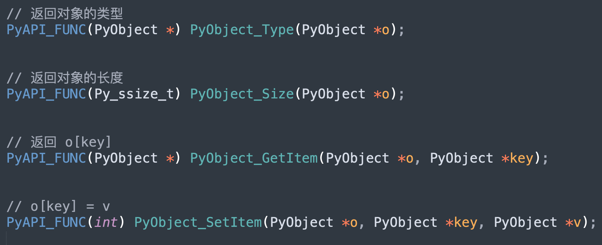

## 楔子

本篇文章来聊一聊对象的创建，一个对象是如何从无到有产生的呢？

~~~python
>>> n = 123
>>> n
123
~~~

比如在终端中执行 n = 123，一个整数对象就创建好了，但它的背后都发生了什么呢？带着这些疑问，开始今天的内容。

## Python 为什么这么慢

前面我们介绍了 Python 对象在底层的数据结构，知道了 Python 底层是通过 PyObject 实现了对象的多态。所以我们先来分析一下 Python 为什么慢？

在 Python 中创建一个对象，会分配内存并进行初始化，然后用一个 PyObject \* 指针来维护这个对象，当然所有对象都是如此。因为指针是可以相互转化的，所以变量在保存一个对象的指针时，会将指针转成 PyObject \* 之后再交给变量保存。

因此在 Python 中，变量的传递（包括函数的参数传递）实际上传递的都是泛型指针 PyObject \*。这个指针具体指向什么类型的对象我们并不知道，只能通过其内部的 ob_type 字段进行动态判断，而正是因为这个 ob_type，Python 实现了多态机制。

比如 a.pop()，我们不知道 a 指向的对象是什么类型，它可能是列表、也可能是字典，或者是我们实现了 pop 方法的自定义类的实例对象。至于它到底是什么类型，只能通过 ob_type 动态判断。

如果 a 的 ob_type 为 &PyList_Type，那么 a 指向的对象就是列表，于是会调用 list 类型中定义的 pop 操作。如果 a 的 ob_type 为 &PyDict_Type，那么 a 指向的对象就是字典，于是会调用 dict 类型中定义的 pop 操作。所以变量 a 在不同的情况下，会表现出不同的行为，这正是 Python 多态的核心所在。

再比如列表，它内部的元素也都是 PyObject \*，因为类型要保持一致，所以对象的指针不能直接存（因为类型不同），而是需要统一转成泛型指针 PyObject \* 之后才可以存储。当我们通过索引获取到该指针进行操作的时候，也会先通过 ob_type 判断它的类型，看它是否支持指定的操作。所以操作容器内的某个元素，和操作一个变量并无本质上的区别，它们都是 PyObject \*。

**从这里我们也能看出 Python 为什么慢了，因为有一部分时间浪费在类型和属性的查找上面。**

以变量 a + b 为例，这个 a 和 b 指向的对象可以是整数、浮点数、字符串、列表、元组、以及实现了 \_\_add\_\_ 方法的类的实例对象。因为 Python 的变量都是 PyObject \*，所以它可以指向任意的对象，这就意味着 Python 无法做基于类型的优化。

底层在执行 a + b 时，首先要通过 ob_type 判断变量指向的对象是什么类型，这在 C 的层面需要一次属性查找。然后 Python 将每一个算术操作都抽象成了一个魔法方法，所以实例相加时要在类型对象中找到该方法对应的函数指针，这又是一次属性查找。找到了之后将 a、b 作为参数传递进去，这会产生一次函数调用，将对象维护的值拿出来进行运算，然后根据相加的结果创建一个新的对象，再将新的对象的指针转成 PyObject \* 之后返回。

所以一个简单的加法运算，Python 内部居然做了这么多的工作，要是再放到循环里面，那么上面的步骤要重复 N 次。而对于 C 来讲，由于已经规定好了类型，所以 a + b 在编译之后就是一条简单的机器指令，因此两者在效率上差别很大。

当然我们不是来吐槽 Python 效率的问题，因为任何语言都有擅长的一面和不擅长的一面，这里只是通过回顾前面的知识来解释为什么 Python 效率低。因此当别人问你 Python 为什么效率低的时候，希望你能从这个角度来回答它，主要就两点：

- Python 无法基于类型做优化；
- Python 对象基本都存储在堆上；

建议不要一上来就谈 GIL，那是在多线程情况下才需要考虑的问题。而且我相信大部分觉得 Python 慢的人，都不是因为 Python 无法利用多核才觉得慢的。

## Python 的 C API

然后来说一说 Python 的 C API，这个非常关键。首先 Python 解释器听起来很高大上，但按照陈儒老师的说法，它不过就是用 C 语言写出的一个开源软件，从形式上和其它软件并没有本质上的不同。

比如你在 Windows 系统中打开 Python 的安装目录，会发现里面有一个二进制文件 python.exe 和一个动态库文件 python38.dll。二进制文件负责执行，动态库文件则包含了相应的依赖，当然编译的时候也可以把动态库里的内容统一打包到二进制文件中，不过大部分软件在开发时都会选择前者。

既然解释器是用 C 写的，那么在执行时肯定会将 Python 代码翻译成 C 代码，这是毫无疑问的。比如创建一个列表，底层就会创建一个 PyListObject 实例，比如调用某个内置函数，底层会调用对应的 C 函数。

所以如果你想搞懂 Python 代码的执行逻辑或者编写 Python 扩展，那么就必须要清楚解释器提供的 API 函数。而按照通用性来划分的话，这些 API 可以分为两种。

- 泛型 API；
- 特定类型 API；

**泛型 API**

顾名思义，泛型 API 和参数类型无关，属于抽象对象层。这类 API 的第一个参数是 PyObject \*，可以处理任意类型的对象，API 内部会根据对象的类型进行区别处理。

而且泛型 API 的名称也是有规律的，格式为 PyObject_###，我们举例说明。

所以泛型 API 一般以 PyObject\_ 开头，第一个参数是 PyObject \*，表示可以处理任意类型的对象。

**特定类型 API**

顾名思义，特定类型 API 和对象的类型是相关的，属于具体对象层，只能作用在指定类型的对象上面。因此不难发现，每种类型的对象，都有属于自己的一组特定类型 API。

~~~C
// 通过 C 的 double 创建 PyFloatObject
PyObject* PyFloat_FromDouble(double v);

// 通过 C 的 long 创建 PyLongObject
PyObject* PyLong_FromLong(long v);
// 通过 C 的 char * 创建 PyLongObject
PyObject* PyLong_FromString(const char *str, char **pend, int base)
~~~

以上就是解释器提供的两种 C API，了解完之后我们再来看看对象是如何创建的。

## 对象是如何创建的

创建对象可以使用泛型 API，也可以使用特定类型 API，比如创建一个浮点数。

**使用泛型 API 创建**

~~~c
PyObject* pi = PyObject_New(PyObject, &PyFloat_Type);
~~~

通过泛型 API 可以创建任意类型的对象，因为该类 API 和类型无关。那么问题来了，解释器怎么知道要给对象分配多大的内存呢？

在介绍类型对象的时候我们提到，对象的内存大小、支持哪些操作等等，都属于元信息，而元信息会存在对应的类型对象中。其中 tp_basicsize 和 tp_itemsize 负责指定实例对象所需的内存空间。

~~~c
// Include/objimpl.h

// 创建定长对象
#define PyObject_New(type, typeobj) \
                ( (type *) _PyObject_New(typeobj) )
// 创建变长对象
#define PyObject_NewVar(type, typeobj, n) \
                ( (type *) _PyObject_NewVar((typeobj), (n)) )
/* 所以 PyObject* pi = PyObject_New(PyObject, &PyFloat_Type) 等价于如下
 * PyObject* pi = (PyObject *)_PyObject_New(&PyFloat_Type)
 */
~~~

所以实际申请内存的动作由 \_PyObject\_New 和 \_PyObject\_NewVar 负责，看看它的逻辑。

~~~C
// Objects/object.c
PyObject *
_PyObject_New(PyTypeObject *tp)
{
    PyObject *op;
    // 通过 PyObject_Malloc 为对象申请内存，大小为 _PyObject_SIZE(tp)
    op = (PyObject *) PyObject_MALLOC(_PyObject_SIZE(tp));
    if (op == NULL)
        return PyErr_NoMemory();
    // 设置对象的类型和引用计数
    return PyObject_INIT(op, tp);
}

PyVarObject *
_PyObject_NewVar(PyTypeObject *tp, Py_ssize_t nitems)
{
    PyVarObject *op;
    const size_t size = _PyObject_VAR_SIZE(tp, nitems);
    // 通过 PyObject_Malloc 为对象申请内存，大小为 _PyObject_VAR_SIZE(tp, nitems)
    op = (PyVarObject *) PyObject_MALLOC(size);
    if (op == NULL)
        return (PyVarObject *)PyErr_NoMemory();
    // 设置对象的类型、引用计数和 ob_size
    return PyObject_INIT_VAR(op, tp, nitems);
}

// Include/objimpl.h
#define _PyObject_SIZE(typeobj) ( (typeobj)->tp_basicsize )

#define _PyObject_VAR_SIZE(typeobj, nitems)     \
    _Py_SIZE_ROUND_UP((typeobj)->tp_basicsize + \
        (nitems)*(typeobj)->tp_itemsize,        \
        SIZEOF_VOID_P)
/* 类型对象的 tp_basicsize 字段表示它的实例对象的基础大小，即底层结构体的大小
 * 对于像浮点数这种不可变的定长对象来说，显然大小就等于 PyFloat_Type 的 tp_basicsize
 *
 * 如果对象内部可以容纳指定数量的元素，比如元组，那么 tp_itemsize 便是每个元素的大小
 * 对于元组来说，它的大小等于 tp_basicsize + 元素个数 * tp_itemsize，并且按照 8 字节对齐
 */
~~~

以上便是泛型 API 创建对象的流程，但泛型 API 属于通用逻辑，而内置类型的实例对象一般会采用特定类型 API 创建。

**使用特定类型 API 创建**

~~~C
// 创建浮点数，值为 2.71
PyObject* e = PyFloat_FromDouble(2.71);
// 创建一个可以容纳 5 个元素的元组
PyObject* tpl = PyTuple_New(5);
// 创建一个可以容纳 5 个元素的列表
// 当然这是初始容量，列表还可以扩容
PyObject* lst = PyList_New(5); 
~~~

和泛型 API 不同，使用特定类型 API 只能创建指定类型的对象，因为这种 API 是和类型绑定的。比如我们可以用 PyDict_New 创建一个字典，但不可能创建一个集合出来。

如果使用特定类型 API，那么可以直接分配内存。因为内置类型的实例对象，它们的定义在底层都是写死的，解释器对它们了如指掌，因此可以直接分配内存并初始化。

比如通过 e = 2.71 创建一个浮点数，解释器看到 2.71 就知道要创建 PyFloatObject 结构体实例，那么申请多大内存呢？显然是 sizeof(PyFloatObject)，直接计算一下结构体实例的大小即可。

~~~C
// Include/floatobject.h
typedef struct {
    // ob_refcnt 占 8 字节，ob_type 也占 8 字节
    PyObject_HEAD
    // 占 8 字节
    double ob_fval;
} PyFloatObject;
~~~

由于 PyFloatObject 只是在 PyObject 的基础上引入了一个 double 字段，用于维护浮点数的值，所以一个 PyFloatObject 实例的大小为 24 字节。既然内存大小知道，那么直接分配就可以了，分配之后再将 ob_refcnt 初始化为 1、将 ob_type 设置为 &PyFloat_Type、将 ob_fval 设置为 2.71 即可。

同理可变对象也是一样，因为字段都是固定的，容纳的元素个数也可以根据赋的值得到，所以内部的所有字段占用了多少内存可以算出来，因此也是可以直接分配内存的。

还是那句话，解释器对内置的数据结构了如指掌，因为这些结构在底层都是定义好的，源码直接写死了。所以解释器根本不需要借助类型对象去创建实例对象，它只需要在实例对象创建完毕之后，再将 ob_type 设置为指定的类型即可（让实例对象和类型对象建立联系）。

所以采用特定类型 API 创建实例的速度会更快，但这只适用于内置的数据结构，而我们自定义类的实例对象显然没有这个待遇。假设通过 class Person: 定义了一个类，那么在实例化的时候，显然不可能通过 PyPerson_New 去创建，因为底层压根就没有这个 API。这种情况下创建 Person 的实例对象就需要 Person 这个类型对象了，因此自定义类的实例对象如何分配内存、如何进行初始化，需要借助对应的类型对象。

**总的来说，Python 内部创建一个对象有两种方式：**

+ 通过特定类型 API，适用于内置数据结构，即内置类型的实例对象。
+ 通过调用类型对象去创建（底层会调用泛型 API），多用于自定义类型。

## [] 和 list()，应该使用哪种方式

lst = [] 和 lst = list() 都会创建一个空列表，但这两种方式有什么区别呢？

我们说创建实例对象可以通过解释器提供的特定类型 API，用于内置类型；也可以通过实例化类型对象去创建，既可用于自定义类型，也可用于内置类型。

~~~Python
# 通过特定类型 API 创建
>>> lst = [] 
>>> lst
[]
# 通过调用类型对象创建
>>> lst = list()  
>>> lst
[]
~~~

还是那句话，解释器对内置数据结构了如指掌，并且做足了优化。

- 看到 123，就知道创建 PyLongObject 实例；
- 看到 2.71，就知道创建 PyFloatObject 实例；
- 看到 ( )，就知道创建 PyTupleObject 实例；
- 看到 [ ]，就知道创建 PyListObject 实例；
- ······

这些都会使用特定类型 API 去创建，直接为结构体申请内存，然后设置引用计数和类型，所以使用 [ ] 创建列表是最快的。但如果使用 list() 创建列表，那么就产生了一个调用，要进行参数解析、类型检测、创建栈帧、销毁栈帧等等，所以开销会大一些。

~~~Python
import time

start = time.perf_counter()
for _ in range(10000000):
    lst = []
end = time.perf_counter()
print(end - start) 
"""
0.2144167000001289
"""

start = time.perf_counter()
for _ in range(10000000):
    lst = list()
end = time.perf_counter()
print(end - start) 
"""
0.4079916000000594
"""
~~~

通过 [ ] 的方式创建一千万次空列表需要 0.21 秒，但通过 list() 的方式创建一千万次空列表需要 0.40 秒，主要就在于 list() 是一个调用，而 [ ] 会直接被解析成 PyListObject，因此 [ ] 的速度会更快一些。

所以对于内置类型的实例对象而言，使用特定类型 API 创建要更快一些。而且事实上通过类型对象去创建的话，会先调用 tp_new，然后在 tp_new 内部还是调用了特定类型 API。

比如：

- 创建列表：可以是 list()、也可以是 [ ]；
- 创建元组：可以是 tuple()、也可以是 ( )；
- 创建字典：可以是 dict()、也可以是 { }；

前者是通过类型对象创建的，后者是通过特定类型 API 创建的。对于内置类型的实例对象而言，我们推荐使用特定类型 API 创建，会直接解析为对应的 C 一级数据结构，因为这些结构在底层都是已经实现好了的，可以直接用。而无需通过诸如 list() 这种调用类型对象的方式来创建，因为它们内部最终还是使用了特定类型 API，相当于多绕了一圈。

不过以上都是针对内置类型，而自定义的类型就没有这个待遇了，它的实例对象只能通过调用它自己创建。比如 Person 这个类，解释器不可能事先定义一个 PyPersonObject 然后将 API 提供给我们，所以我们只能通过调用 Person 来创建它的实例对象。

另外内置类型被称为静态类，它和它的实例对象在底层已经定义好了，无法动态修改。我们自定义的类型被称为动态类，它是在解释器运行的过程中动态构建的，所以我们可以对其进行动态修改。

事实上 Python 的动态性、GIL 等特性，都是解释器在将字节码翻译成 C 代码时动态赋予的，而内置类型在编译之后已经是指向 C 一级的数据结构，因此也就丧失了相应的动态性。不过与之对应的就是效率上的提升，因为运行效率和动态性本身就是鱼与熊掌的关系。

## 小结

以上我们就简单分析了 Python 对象的创建过程，当然这只是一个开头，其背后还隐藏了大量的细节，我们后续会慢慢说。

下一篇文章来聊一聊，对象是如何被调用的。

------

&nbsp;

**欢迎大家关注我的公众号：古明地觉的编程教室。**

**如果觉得文章对你有所帮助，也可以请作者吃个馒头，Thanks♪(･ω･)ﾉ。**

