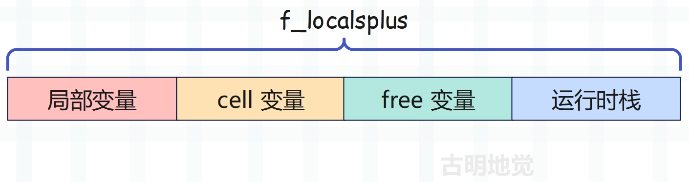
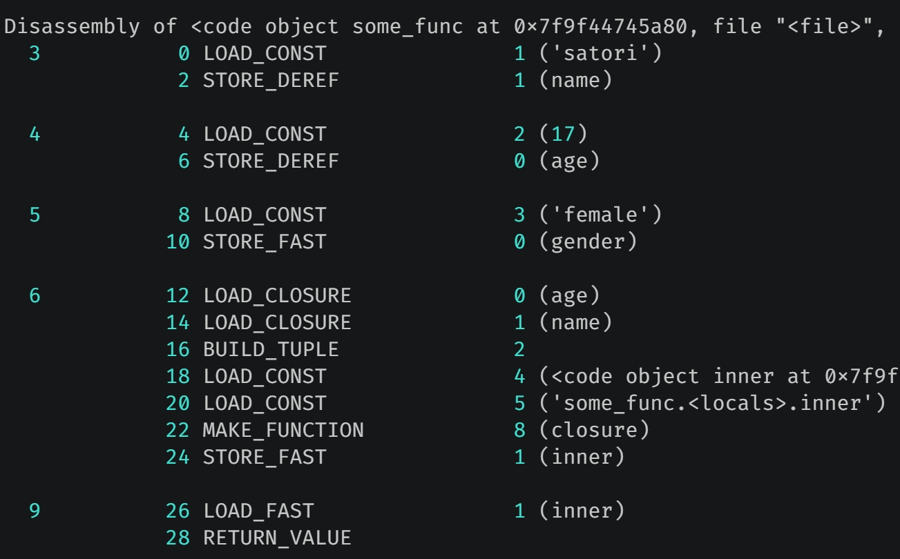
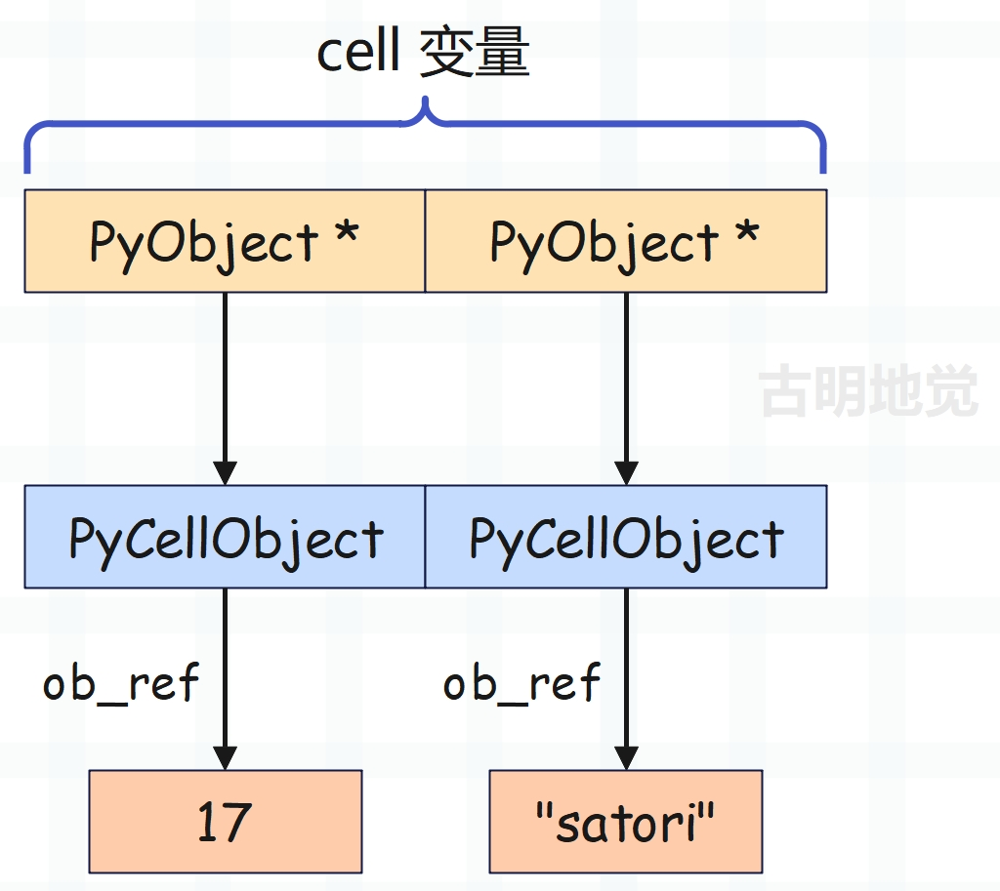
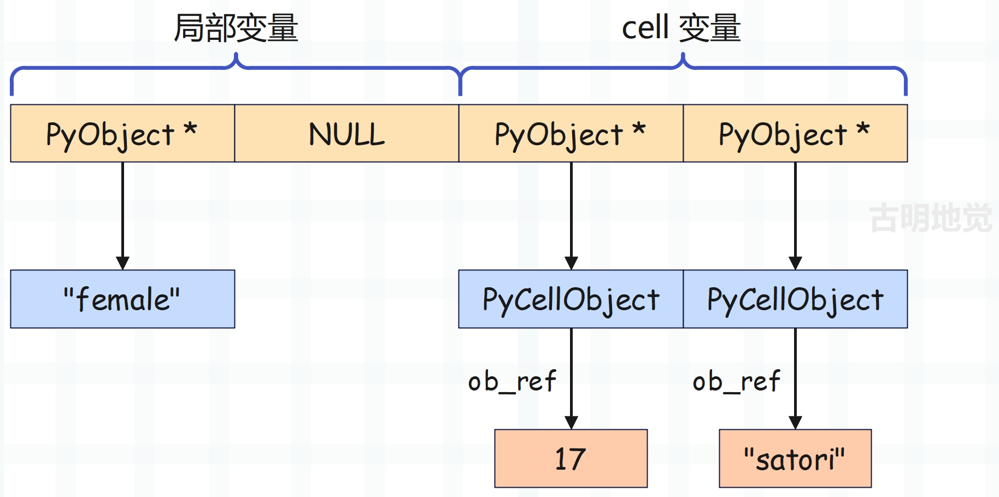
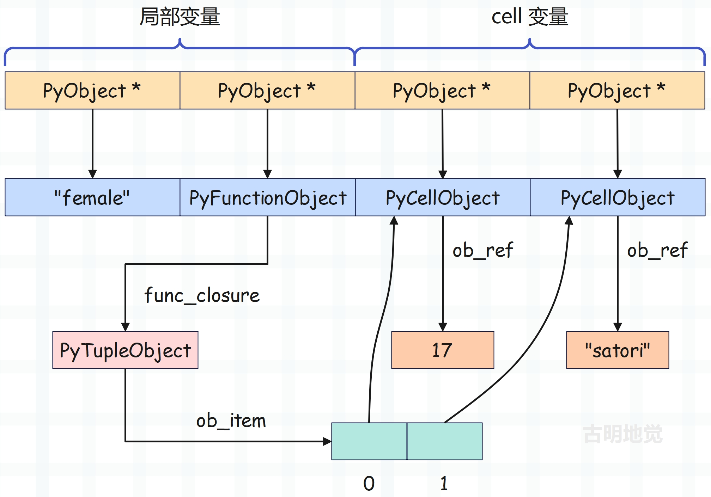
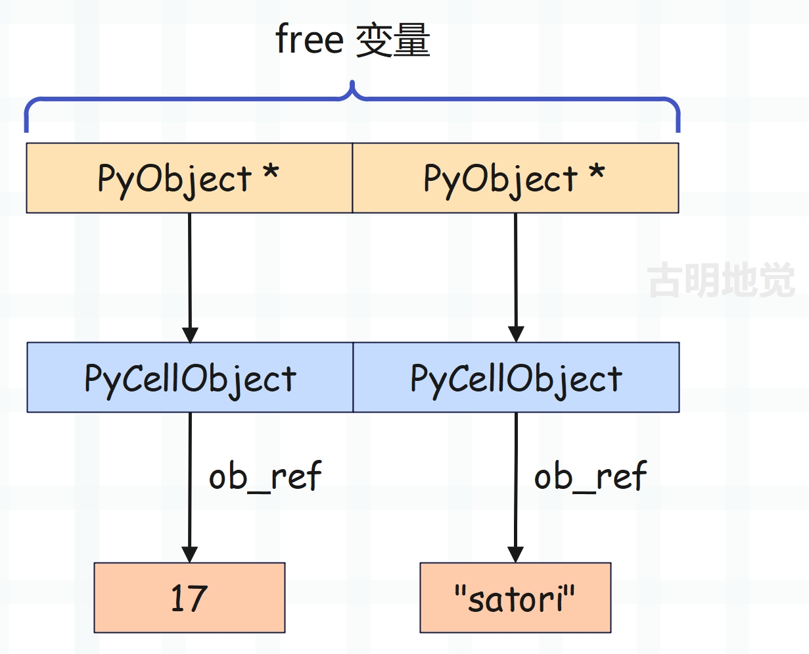
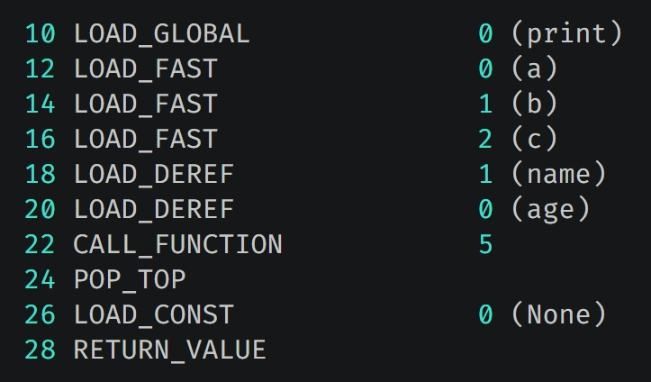
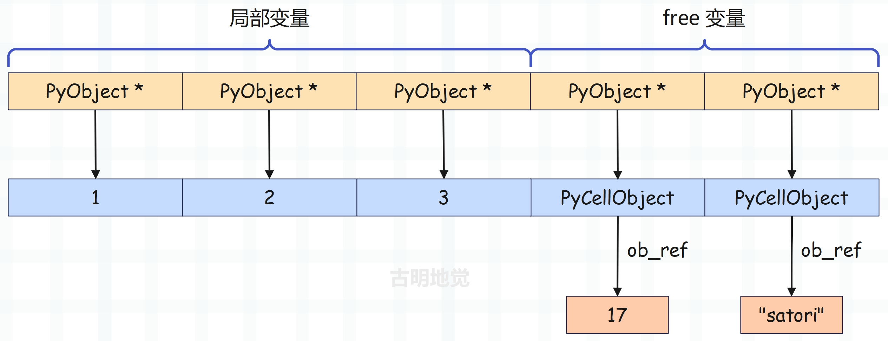

## 楔子

在之前的文章中一直反复提到四个字：名字空间。一段代码的执行结果不光取决于代码中的符号，更多的是取决于代码中符号的语义，而这个运行时的语义正是由名字空间决定的。

名字空间由虚拟机在运行时动态维护，但有时我们希望将名字空间静态化。换句话说，我们希望有的代码不受名字空间变化带来的影响，始终保持一致的功能该怎么办呢？随便举个例子：

~~~Python
def login(user_name, password, user):
    if not (user_name == "satori" and password == "123"):
        return "用户名密码不正确"
    else:
        return f"欢迎: {user}"

print(login("satori", "123", "古明地觉"))  # 欢迎: 古明地觉
print(login("satori", "123", "古明地恋"))  # 欢迎: 古明地恋
~~~

我们注意到每次都需要输入 username 和 password，因此可以通过嵌套函数来设置一个基准值。

~~~Python
def deco(user_name, password):
    def login(user):
        if not (user_name == "satori" and password == "123"):
            return "用户名密码不正确"
        else:
            return f"欢迎: {user}"
    return login

login = deco("satori", "123")
print(login("古明地觉"))  # 欢迎: 古明地觉
print(login("古明地恋"))  # 欢迎: 古明地恋
~~~

尽管函数 login 里面没有 user_name 和 password 这两个局部变量，但是不妨碍我们使用它，因为外层函数 deco 里面有。

也就是说，函数 login 作为函数 deco 的返回值被返回的时候，有一个名字空间就已经和 login 紧紧地绑定在一起了。执行内层函数 login 的时候，对于自身 local 空间中不存在的变量，会从和自己绑定的 local 空间里面去找，这就是一种将名字空间静态化的方法。这个名字空间和内层函数捆绑之后的结果我们称之为闭包（closure）。

> 为了描述方便，上面说的是 local 空间，但我们知道，局部变量不是从那里查找的，而是从 f_localsplus 里面。只是我们可以按照 LEGB 的规则去理解，这一点心理清楚就行。

也就是说：<font color="blue">闭包=外部作用域+内层函数</font>。并且在介绍函数的时候提到，PyFunctionObject 是虚拟机专门为字节码指令的传输而准备的大包袱，global 名字空间、默认参数等都和字节码指令捆绑在一起，同样的，也包括闭包。

## 实现闭包的基石

闭包的创建通常是利用嵌套函数来完成的，我们说过局部变量是通过数组静态存储的，而闭包也是如此。前面说过，栈桢的 f_localsplus 字段是一个柔性数组，既然是数组，那么就是一段连续的内存，只是这段内存在概念上分成了四个部分，分别用于：局部变量、cell 变量、free 变量、运行时栈。



怎么证明这一点呢？我们看一下栈桢创建函数 _PyFrame_New_NoTrack 就好了，里面有几行代码泄漏了天机。

~~~C
Py_ssize_t extras, ncells, nfrees;
// cell 变量的个数
ncells = PyTuple_GET_SIZE(code->co_cellvars);
// free 变量的个数
nfrees = PyTuple_GET_SIZE(code->co_freevars);
// code->co_nlocals 表示局部变量的个数
// code->co_stacksize 表示运行时栈的长度
// 这几个加起来便是 f_localsplus 数组的长度，再乘以 8 就是应该为 f_localsplus 申请的内存大小
extras = code->co_stacksize + code->co_nlocals + ncells + nfrees;
~~~

局部变量和运行时栈对应的内存我们已经剖析过了，本次来聊一聊 cell 变量和 free 变量，它们是和闭包相关的。老规矩，先来看一段代码：

~~~python
def foo():
    name = "古明地觉"
    age = 17
    gender = "female"

    def bar():
        nonlocal name
        nonlocal age
        print(gender)

    return bar

print(foo.__code__.co_cellvars)  # ('age', 'gender', 'name')
print(foo().__code__.co_freevars)  # ('age', 'gender', 'name')
print(foo.__code__.co_freevars)  # ()
print(foo().__code__.co_cellvars)  # ()
~~~

和闭包相关的两个字段是 co_cellvars 和 co_freevars，其中 co_cellvars 保存了外层作用域中被内层作用域引用的变量的名字，co_freevars 保存了内层作用域中引用的外层作用域的变量的名字。

所以对于外层函数来说，应该使用 co_cellvars，对于内层函数来说，应该使用 co_freevars。当然无论是外层函数还是内层函数都有 co_cellvars 和 co_freevars，这是肯定的，因为都是函数。只不过外层函数需要使用 co_cellvars 获取，因为它包含的是外层函数中被内层函数引用的变量的名称；内层函数需要使用 co_freevars 获取，它包含的是内层函数中引用的外层函数的变量的名称。

如果使用外层函数 foo 获取 co_freevars 的话，那么得到的结果显然就是个空元组了，除非 foo 也作为某个函数的内层函数，并且内部引用了外层函数的变量。同理内层函数 bar 也是一样的道理，它获取 co_cellvars 得到的也是空元组，因为对于 bar 而言不存在内层函数。

我们再看个例子：

```python
def foo():
    name = "古明地觉"
    age = 17

    def bar():
        nonlocal name
        nonlocal age
        gender = "female"

        def inner():
            nonlocal gender

        return inner

    return bar

print(foo().__code__.co_cellvars)  # ('gender',)
print(foo().__code__.co_freevars)  # ('age', 'name')
```

对于函数 bar 而言，它是函数 inner 的外层函数，同时也是函数 foo 的内层函数。所以它在获取 co_cellvars 和 co_freevars 属性时，得到的元组都不为空。因为内层函数 inner 引用了函数 bar 里面的变量 gender，同时函数 bar 也作为内层函数引用了函数 foo 里的 name 和 age。

那么问题来了，闭包变量所需要的空间申请在哪个地方呢？没错，显然是 f_localsplus，它是一个柔性数组，在概念上被分成了四份，分别用于：局部变量、cell 变量、free 变量、运行时栈。所以闭包变量同样是以静态的方式实现的。

## 闭包的实现过程

介绍完实现闭包的基石之后，我们可以开始追踪闭包的具体实现过程了，当然还是要先看一下闭包对应的字节码。

~~~Python
import dis

code_string = """
def some_func():
    name = "satori"
    age = 17
    gender = "female"
    def inner():
        print(name, age)

    return inner

func = some_func()
func()
"""

dis.dis(compile(code_string, "<file>", "exec"))
~~~

字节码指令如下，为了阅读方便，我们省略了源代码行号。

~~~C
   // 加载函数 some_func 对应的 PyCodeObject，压入运行时栈
   0 LOAD_CONST               0 (<code object some_func at 0x7f9...>)
   // 加载函数的名称 "some_func"，压入运行时栈
   2 LOAD_CONST               1 ('some_func')
   // 从栈顶弹出函数名和 PyCodeObject，构造 PyFunctionObject，并压入运行时栈
   4 MAKE_FUNCTION            0
   // 从栈顶弹出 PyFunctionObject，然后使用变量 some_func 保存
   6 STORE_NAME               0 (some_func)
   // 加载全局变量 some_func
   8 LOAD_NAME                0 (some_func)
   // 调用
  10 CALL_FUNCTION            0
   // 弹出栈顶的返回值，并使用变量 func 保存
  12 STORE_NAME               1 (func)
   // 加载全局变量 func
  14 LOAD_NAME                1 (func)
   // 调用
  16 CALL_FUNCTION            0
   // 从栈顶弹出返回值，丢弃
  18 POP_TOP
   // 隐式地 return None
  20 LOAD_CONST               2 (None)
  22 RETURN_VALUE

   // ********** 外层函数 some_func 对应的字节码 **********
Disassembly of <code object some_func at 0x7f9...>:
   // 加载字符串常量 "satori"
   0 LOAD_CONST               1 ('satori')
   // 注意这里不是 STORE_FAST，而是 STORE_DEREF
   // 它的作用肯定是将符号 "name" 和字符串常量绑定起来
   // STORE_NAME、STORE_FAST、STORE_DEREF 做的事情是一样的
   // 都是将符号和值绑定起来，只是绑定的方式不一样
   // 比如 STORE_NAME 是通过字典完成绑定，STORE_FAST 是通过数组完成绑定
   // 那么 STORE_DEREF 是怎么绑定的呢？稍后分析  
   2 STORE_DEREF              1 (name)
   // 加载常量 17
   4 LOAD_CONST               2 (17)
   // 使用变量 age 保存
   6 STORE_DEREF              0 (age)
   // name 和 age 被内层函数引用了，所以是 STORE_DEREF
   // 但 gender 没有，所以它对应的是 STORE_FAST
   8 LOAD_CONST               3 ('female')
  10 STORE_FAST               0 (gender)
   // 加载 cell 变量，压入运行时栈
  12 LOAD_CLOSURE             0 (age)
  14 LOAD_CLOSURE             1 (name)
   // 弹出 cell 变量，构建元组并入栈
  16 BUILD_TUPLE              2
   // 加载函数 inner 对应的 PyCodeObject
  18 LOAD_CONST               4 (<code object inner at 0x7f9...>)
   // 加载函数名
  20 LOAD_CONST               5 ('some_func.<locals>.inner')
   // 构造函数
  22 MAKE_FUNCTION            8 (closure)
   // 将函数使用变量 inner 保存
  24 STORE_FAST               1 (inner)
   // return inner
  26 LOAD_FAST                1 (inner)
  28 RETURN_VALUE
   
   // ********** 内层函数 inner 对应的字节码 **********
Disassembly of <code object inner at 0x7f9...>:
   // 加载内置变量 print
   0 LOAD_GLOBAL              0 (print)
   // 显然它和 LOAD_NAME、LOAD_FAST 的关系也是类似的
   // 也是负责加载变量，然后压入运行时栈  
   2 LOAD_DEREF               1 (name)
   4 LOAD_DEREF               0 (age)
   // 调用 print 函数
   6 CALL_FUNCTION            2
   // 从栈顶弹出返回值，丢弃
   8 POP_TOP
  10 LOAD_CONST               0 (None)
  12 RETURN_VALUE
~~~

字节码的内容并不难，里面的大部分指令都见过了，但是有三个例外，分别是 STORE_DEREF、LOAD_CLOSURE、LOAD_DEREF。

首先 STORE_DEREF 和 LOAD_DEREF 也是用来创建和加载变量，对于当前这个例子来说，变量就是 name 和 age。因此很容易得出结论，如果一个局部变量被内层函数所引用，那么指令将不再是 LOAD_FAST 和 STORE_FAST，而是 LOAD_DEREF 和 STORE_DEREF。至于 LOAD_CLOSURE 是做什么用的，稍后会解释。

我们先来分析一下外层函数 some_func 对应的字节码。



函数 some_func 里面有三个局部变量，但只有 name 和 age 被内层函数引用了，所以创建时使用的指令是 STORE_DEREF，我们看一下该指令都做了什么。

~~~C
// 所以 freevars 指向了 f_localsplus 的第二段内存的起始位置
freevars = f->f_localsplus + co->co_nlocals;

case TARGET(STORE_DEREF): {
    // 从栈顶弹出元素
    PyObject *v = POP();
    // 获取 cell 变量，它指向了 PyCellObject 结构体实例
    PyObject *cell = freevars[oparg];
    // 获取 PyCellObject 实例内部维护的值（初始为 NULL）
    PyObject *oldobj = PyCell_GET(cell);
    // 将 PyCellObject 实例内部维护的值设置成 v
    PyCell_SET(cell, v);
    Py_XDECREF(oldobj);
    DISPATCH();
}
~~~

再来看一下 PyCellObject 的定义。

~~~C
// Include/cellobject.h

typedef struct {
    PyObject_HEAD
    PyObject *ob_ref;
} PyCellObject;

#define PyCell_GET(op) (((PyCellObject *)(op))->ob_ref)
#define PyCell_SET(op, v) (((PyCellObject *)(op))->ob_ref = v)
~~~

因此在两个 STORE_DEREF 执行完之后，f_localsplus 会变成下面这样：



相信你明白 STORE_FAST 和 STORE_DEREF 之间的区别了，如果是 STORE_FAST，那么中间就没有 PyCellObject 这一层，f_localsplus 保存的 PyObject \* 指向的就是具体的对象。

> 另外创建变量 name 时，STORE_DEREF 的指令参数为 1，创建变量 age 时，STORE_DEREF 的指令参数为 0，所以 name 的值会设置在 cell 变量的内存区域中索引为 1 的位置，age 的值则是设置在索引为 0 的位置。

然后是 gender = "female"，它就很简单了，由于符号 "gender" 对应局部变量，在符号表中的索引为 0，那么直接让 f_localsplus[0] 指向字符串 "female" 即可。



f_localsplus 保存了局部变量的值，而符号在符号表中的索引，和对应的值在 f_localsplus 中的索引是一致的，所以正常情况下，局部变量赋值就是 `f_localsplus[i] = v`。但对于 cell 变量来说，它指向的是 PyCellObject，所以赋值是 `f_localsplus[i]->ob_ref = v`。

到此变量 name、age、gender 均已赋值完毕，f_localsplus[0]、f_localsplus[2]、f_localsplus[3] 分别对应变量 gender、age、name。可能有人觉得这个索引好奇怪啊，我们实际测试一下。

~~~Python
def some_func():
    name = "satori"
    age = 17
    gender = "female"
    def inner():
        print(name, age)

    return inner

print(
    some_func.__code__.co_varnames
)  # ('gender', 'inner')
~~~

我们看到 some_func 的符号表里面只有 gender 和 inner，因此 f_localsplus[0] 表示变量 gender。至于 f_localsplus[1] 则表示变量 inner，只不过此时它指向的对象还没有创建，所以暂时为 NULL。

至于变量 name 和 age，由于它们被内层函数引用了，所以它们是 cell 变量，并且位置是相对于 `f_localsplus + co_nlocals` 开始的，而 co_nlocals 表示局部变量的个数。所以在 f_localsplus 中，cell 变量的位置是在局部变量之后的，这完全符合我们之前说的 f_localsplus 的内存布局。并且我们看到无论是局部变量还是 cell 变量，都是通过数组索引访问的，并且索引在编译时就确定了，以指令参数的形式保存在字节码指令集中。

接下来执行偏移量为 12 和 14 的两条指令，它们都是 LOAD_CLOSURE。

~~~C
case TARGET(LOAD_CLOSURE): {
    // 加载 PyCellObject *，即 cell 变量
    PyObject *cell = freevars[oparg];
    // 增加引用计数，然后压入运行时栈
    Py_INCREF(cell);
    PUSH(cell);
    DISPATCH();
}
~~~

LOAD_CLOSURE 执行完毕后，接着执行 <font color="blue">16 BUILD_TUPLE</font>，将 cell 变量从栈中弹出，构建元组并入栈。然后继续执行 <font color="blue">18 LOAD_CONST</font> 和 <font color="blue">20 LOAD_CONST</font>，将内层函数 inner 对应的 PyCodeObject 和函数名压入运行时栈。

接着执行 <font color="blue">22 MAKE_FUNCTION</font>，开始构建函数，我们看一下 MAKE_FUNCTION 指令，它的指令参数为 8。

~~~C
case TARGET(MAKE_FUNCTION): {
    // 弹出函数名
    PyObject *qualname = POP();
    // 弹出 PyCodeObject 对象
    PyObject *codeobj = POP();
    // 构建函数
    PyFunctionObject *func = (PyFunctionObject *)
        PyFunction_NewWithQualName(codeobj, f->f_globals, qualname);

    Py_DECREF(codeobj);
    Py_DECREF(qualname);
    if (func == NULL) {
        goto error;
    }
    // 由于指令参数为 8，所以 oparg & 0x08 为真
    // 那么在加载函数名和 PyCodeObject 对象入栈之前，一定先加载了一个元组入栈
    // 元组里面包含了内层函数 inner 使用的外层函数的变量
    // 当然这里的变量已经不再是普通的变量了，而是 cell 变量，它内部的 ob_ref 字段才是我们需要的
    if (oparg & 0x08) {
        assert(PyTuple_CheckExact(TOP()));
        func ->func_closure = POP();
    }
    if (oparg & 0x04) {
        assert(PyDict_CheckExact(TOP()));
        func->func_annotations = POP();
    }
    if (oparg & 0x02) {
        assert(PyDict_CheckExact(TOP()));
        func->func_kwdefaults = POP();
    }
    if (oparg & 0x01) {
        assert(PyTuple_CheckExact(TOP()));
        func->func_defaults = POP();
    }

    PUSH((PyObject *)func);
    DISPATCH();
}
~~~

所以 PyFunctionObject 再一次承担了工具人的角色，创建内层函数 inner 时，会将包含 cell 变量的元组赋值给 func_closure 字段。此时便将内层函数需要使用的变量和内层函数绑定在了一起，而这个绑定的结果我们就称之为闭包。

但是从结构上来看，闭包仍是一个函数，所谓绑定，其实只是修改了它的 func_closure 字段。当内层函数创建完毕后，当前栈桢的 f_localsplus 布局如下。



函数即变量，对于函数 some_func 而言，内层函数 inner 也是一个局部变量，由于符号 inner 位于符号表中索引为 1 的位置。因此当函数对象创建完毕时，会修改 f_localsplus[1]，让它保存函数对象的地址。不难发现，对于局部变量来说，如何访问内存在编译阶段就确定了。

然后是内层函数 inner，它内部的 func_closure 字段指向一个元组，元组里面的每个元素会指向 PyCellObject。

## 调用闭包

闭包的创建过程我们已经了解了，下面用 Python 代码再解释一下。

```Python
def some_func():
    name = "satori"
    age = 17
    gender = "female"
    def inner():
        print(name, age)
        
    return inner

func = some_func()
# some_func 调用之后会返回内层函数 inner
# 只不过 inner 的 func_closure 字段保存了 cell 变量
# 而 cell 变量指向的 PyCellObject 对外层作用域的局部变量进行了冻结
# 所以我们也会称呼 inner 函数为闭包，但要知道闭包仍然是个函数
print(func.__name__)  # inner
print(func.__class__)  # <class 'function'>

print(
    func.__closure__[0]
)  # <cell at 0x7f9f445b2c70: int object at 0x7f9f44e693c0>
print(
    func.__closure__[1]
)  # <cell at 0x7f9f446d4f10: str object at 0x7f9f445a20b0>

print(func.__closure__[0].cell_contents)  # 17
print(func.__closure__[1].cell_contents)  # satori

# 同理我们也可以修改
func.__closure__[0].cell_contents = 16
func.__closure__[1].cell_contents = "koishi"
print(func.__closure__[0].cell_contents)  # 16
print(func.__closure__[1].cell_contents)  # koishi
```

调用 inner 函数时，外层函数 some_func 已经执行结束，但它的局部变量 name 和 age 仍可被内层函数 inner 访问，背后的原因我们算是彻底明白了。因为 name 和 age 被内层函数引用了，所以虚拟机将它们封装成了 PyCellObject \*，即 cell 变量，而 cell 变量指向的 cell 对象内部的 ob_ref 字段对应原来的变量。当创建内层函数时，会将引用的 cell 变量组成元组，保存在内层函数的 func_closure 字段中。

所以当内层函数在访问 name 和 age 时，访问的其实是 PyCellObject 的 ob_ref 字段，至于变量 name 和 age 分别对应哪一个 PyCellObject，这些在编译阶段便确定了，同样是基于索引访问的。

由于 inner 函数属于内层函数，所以调用时会走通用通道（当然外层函数也是如此），在里面会对闭包做一些处理。

~~~C
PyObject *
_PyEval_EvalCodeWithName(PyObject *_co, PyObject *globals, PyObject *locals,
           PyObject *const *args, Py_ssize_t argcount,
           PyObject *const *kwnames, PyObject *const *kwargs,
           Py_ssize_t kwcount, int kwstep,
           PyObject *const *defs, Py_ssize_t defcount,
           PyObject *kwdefs, PyObject *closure,
           PyObject *name, PyObject *qualname)
{
    // ...
    
    // 在执行外层函数 some_func 时，创建变量 name 和 age 使用的是 STORE_DEREF 指令
    // 该指令内部会操作 PyCellObject，那么问题来了，PyCellObject 所需的内存是什么时候申请的呢
    // 显然就是在这里，由于编译时已经知道了 cell 变量的个数，所以会提前申请内存
    for (i = 0; i < PyTuple_GET_SIZE(co->co_cellvars); ++i) {
        PyObject *c;
        Py_ssize_t arg;
        if (co->co_cell2arg != NULL &&
            (arg = co->co_cell2arg[i]) != CO_CELL_NOT_AN_ARG) {
            c = PyCell_New(GETLOCAL(arg));
            SETLOCAL(arg, NULL);
        }
        else {
            // 创建一个 PyCellObject，内部 ob_ref 字段的值为 NULL
            // 所以如果是局部变量在未完成赋值时，它在 f_localsplus 中的值就是 NULL
            // 而如果是 cell 变量，不管有没有完成赋值，它在 f_localsplus 中的值都是 PyCellObject *
            // 只不过在没完成赋值时，PyCellObject 的 ob_ref 字段会是 NULL
            // 而等到完成赋值时，PyCellObject 的 ob_ref 字段会指向具体的值
            c = PyCell_New(NULL);
        }
        if (c == NULL)
            goto fail;
        // 原本 f_localsplus 中的值全部为 NULL，但那些被内层函数引用的变量，成为了 cell 变量
        // 所以要将它在 f_localsplus 中的值，从 NULL 替换成 PyCellObject *
        // 而 cell 变量位于局部变量之后，所以从 co_nlocals 开始设置
        SETLOCAL(co->co_nlocals + i, c);
    }
    
    // co_cellvars 针对的是外层函数，co_freevars 针对的是内层函数
    // 所以外层函数 some_func 的 co_cellvars 为 2，co_freevars 为 0
    // 内层函数 inner 的 co_cellvars 为 0，co_freevars 为 2
    // 因此在调用外层函数 some_func 时，会进入上面的 for 循环，而下面的 for 循环则不会进入
    // 在调用内层函数 inner 时，会进入下面的 for 循环，而上面的 for 循环则不会进入
    for (i = 0; i < PyTuple_GET_SIZE(co->co_freevars); ++i) {
        // 而针对内层函数的这层 for 循环所做的事情也很简单
        // 首先获取元组 closure 里面的 cell 变量
        PyObject *o = PyTuple_GET_ITEM(closure, i);
        Py_INCREF(o);
        // 拷贝到 f_localsplus 的第三段内存，即位于 cell 变量之后的内存
        freevars[PyTuple_GET_SIZE(co->co_cellvars) + i] = o;
    }
}    
~~~

总结：外层函数在执行时，会将那些被内层函数引用的变量变成 cell 变量，然后放在 f_localsplus 的第二段内存中，注意：此时的 f_localsplus 是外层函数的 f_localsplus。然后在构建内层函数时，会将 cell 变量打包成一个元组，交给内层函数的 func_closure 字段。

等执行内层函数创建栈帧的时候，再将 func_closure 字段中的 cell 变量拷贝到 f_localsplus 的第三段内存中，成为 free 变量。当然不管是 cell 变量还是 free 变量，它指向的都是 PyCellObject。只不过对于外层函数而言，它位于 f_localsplus 的第二段内存，所以叫 cell 变量；对于内层函数而言，它位于 f_localsplus 的第三段内存，所以叫 free 变量。

处理完之后，内层函数 inner 的 f_localsplus 的布局如下：



我们看一下内层函数 inner 的字节码指令。


对于内层函数 inner 来说，显然关键就在于 LOAD_DEREF，它和 LOAD_NAME、LOAD_FAST、LOAD_GLOBAL 一样，都是加载变量的值，只是加载方式不同，我们看一下该指令。

~~~C
case TARGET(LOAD_DEREF): {
    // 加载 PyCellObject *
    PyObject *cell = freevars[oparg];
    // 获取 PyCellObject 对象的 ob_ref 字段的值
    PyObject *value = PyCell_GET(cell);
    if (value == NULL) {
        format_exc_unbound(tstate, co, oparg);
        goto error;
    }
    Py_INCREF(value);
    PUSH(value);
    DISPATCH();
}
~~~

STORE_DEREF 是设置 PyCellObject 的 ob_ref，那么 LOAD_DEREF 自然就是获取 PyCellObject 的 ob_ref。

另外再补充一点，我们说 f_localsplus 是一个连续的数组，只是按照用途被划分成了四个区域：保存局部变量的内存空间、保存 cell 变量的内存空间、保存 free 变量的内存空间、运行时栈。但对于当前的内层函数 inner 来说，它是没有局部变量和 cell 变量的，所以 f_localsplus 开始的位置便是 free 区域。

当然不管是局部变量、cell 变量，还是 free 变量，它们都按照顺序保存在 f_localsplus 中，并且在编译阶段便知道它们在 f_localsplus 中的位置。比如我们将内层函数 inner 的逻辑修改一下。

~~~Python
def some_func():
    name = "satori"
    age = 17
    gender = "female"
    def inner():
        a, b, c = 1, 2, 3
        print(a, b, c, name, age)
    return inner
~~~

在 inner 里面创建了三个局部变量，那么它的字节码会变成什么样子呢？这里我们直接看 print 函数执行时的字节码即可。



因为 inner 里面没有函数了，所以它不存在 cell 变量，里面只有局部变量和 free 变量。



所以虽然我们说 f_localsplus 被分成了四份，但是 cell 区域和 free 区域很少会同时存在。对于外层函数 some_func 来说，它没有 free 变量，所以 free 区域长度为 0。而对于内层函数 inner 来说，它没有 cell 变量，所以 cell 区域长度为 0。只有函数的里面存在内层函数，并且外面存在外层函数，那么它才有可能同时包含 cell 变量和 free 变量。

但为了方便描述，我们仍然认为 f_localsplus 被分成了四个区域，只不过对于外层函数 some_func 而言，它的 free 区域长度为 0；对于内层函数 inner 而言，它的 cell 区域长度为 0。

当然这些都是概念上的东西，大家理解就好。但不管在概念上 f_localsplus  怎么划分，它本质上就是一个 C 数组，是一段连续的内存，用于存储局部变量、cell 变量、free 变量（这三种变量不一定同时存在），以及作为运行时栈。最重要的是，这三种变量都是基于数组实现的静态访问，并且怎么访问在编译阶段就已经确定，因为访问数组的索引会作为指令参数存储在字节码指令集中。

- 比如访问变量 a，底层会访问 `f_localsplus[0]`；
- 比如访问变量 age，底层会访问 `f_localsplus[3]->ob_ref`；

这便是静态访问。

## 装饰器

装饰器是 Python 的一个亮点，但并不神秘，因为它本质上就是高阶函数加上闭包，只不过给我们提供了一个优雅的语法糖。至于为什么要有装饰器，我觉得有句话说的非常好，装饰器存在的最大意义就是可以在不改动原函数的代码和调用方式的情况下，为函数增加一些新的功能。

~~~Python
def deco(func):
    print("都闪开，我要开始装饰了")

    def inner(*args, **kwargs):
        print("开始了")
        ret = func(*args, **kwargs)
        print("结束")
        return ret

    return inner

# 这一步等价于 foo = deco(foo)
# 因此上来就会打印 deco 里面的 print
@deco
def foo(a, b):
    print(f"a = {a}，b = {b}")
print("---------")
"""
都闪开，我要开始装饰了
---------
"""

# 此时再调用 foo，已经不再是原来的 foo 了
# 而是 deco 里面的闭包 inner
foo(1, 2)
"""
开始了
a = 1，b = 2
结束
"""
~~~

如果不使用装饰器的话：

```Python
def deco(func):
    print("都闪开，我要开始装饰了")

    def inner(*args, **kwargs):
        print("开始了")
        ret = func(*args, **kwargs)
        print("结束")
        return ret

    return inner

def foo(a, b):
    print(f"a = {a}，b = {b}")

foo = deco(foo)
"""
都闪开，我要开始装饰了
"""
foo(1, 2)
"""
开始了
a = 1，b = 2
结束
"""
```

打印结果告诉我们，装饰器只是类似于 foo=deco(foo) 的一个语法糖罢了。

至于字节码这里就不看了，还是那句话，**@** 只是个语法糖，它和我们直接调用 foo=deco(foo) 是等价的，所以理解装饰器（decorator）的关键就在于理解闭包（closure）。

另外函数在被装饰器装饰之后，整个函数其实就已经变了，而为了保留原始信息我们一般会从 functools 模块中导入一个 wraps 函数。当然装饰器还可以写的更复杂，比如带参数的装饰器、类装饰器等等，不过这些都属于 Python 层级的东西了，我们就不说了。

另外装饰器还可以不止一个，如果一个函数被多个装饰器装饰，会有什么表现呢？

~~~Python
def deco1(func):
    def inner():
        return f"<deco1>{func()}</deco1>"
    return inner

def deco2(func):
    def inner():
        return f"<deco2>{func()}</deco2>"
    return inner

def deco3(func):
    def inner():
        return f"<deco3>{func()}</deco3>"
    return inner

@deco1
@deco2
@deco3
def foo():
    return "古明地觉"

print(foo())
~~~

解释器还是从上到下解释，当执行到 @deco1 的时候，肯定要装饰了，但它下面不是函数，也是一个装饰器，于是表示：要不哥们，你先装饰。然后执行 @deco2，但它下面还是一个装饰器，于是重复了刚才的话，把皮球踢给 @deco3。当执行 @deco3 的时候，发现下面终于是一个普通的函数了，于是装饰了。

deco3 装饰完毕之后，<font color="blue">foo = deco3(foo)</font>。然后 deco2 发现 deco3 已经装饰完毕，那么会对 deco3 装饰的结果再进行装饰，此时 <font color="blue">foo = deco2(deco3(foo))</font>；同理，再经过 deco1 的装饰，最终得到了 <font color="blue">foo = deco1(deco2(deco3(foo)))</font>。

于是最终输出：

> \<deco1\>\<deco2\>\<deco3\>古明地觉\</deco3\>\</deco2\>\</deco1\>

所以当有多个装饰器的时候，会从下往上装饰；然后执行的时候，会从上往下执行。

## 小结

本篇文章我们就介绍了闭包，比想象中的要更加简单。因为闭包仍是一个函数，只是将外层作用域的局部变量变成了 cell 变量，然后保存在内部的 func_closure 字段中。

然后执行内层函数的时候，再将 func_closure 里的 PyCellObject \* 拷贝到 f_localsplus 的 free 区域，此时我们叫它 free 变量。但不管什么变量，虚拟机在编译时便知道应该如何访问指定的内存。

当然还有装饰器，它本质上就是一个语法糖，理解装饰器的关键就在于理解闭包。

-------------------

&nbsp;

**欢迎大家关注我的公众号：古明地觉的编程教室。**


**如果觉得文章对你有所帮助，也可以请作者吃个馒头，Thanks♪(･ω･)ﾉ。**

