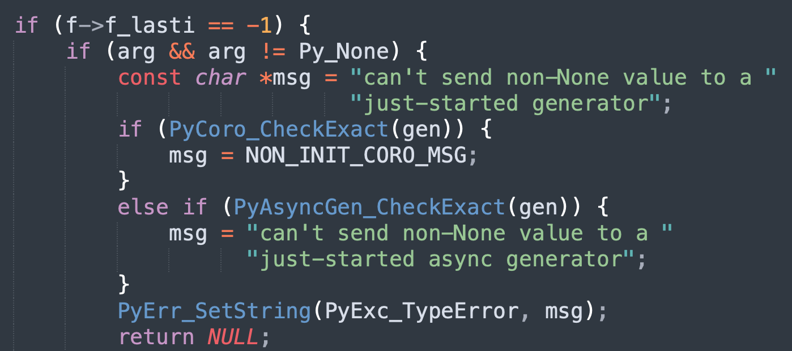

## 楔子

下面来聊一聊 Python 的生成器，它是我们后续理解协程的基础。生成器的话，估计大部分人在写程序的时候都不怎么用，但其实生成器一旦用好了，确实能给程序带来性能上的提升，那么下面就来看一看吧。

## 生成器的基础知识

我们知道，如果函数的内部出现了 yield 关键字，那么它就不再是普通的函数了，而是一个生成器函数，调用之后会返回一个生成器对象。生成器对象一般用于处理循环结构，应用得当的话可以极大优化内存使用率。比如：我们读取一个大文件。

```python
def read_file(file):
    return open(file, encoding="utf-8").readlines()

print(read_file("假装是大文件.txt"))
"""
['人生是什么?\n', '大概是闪闪发光的同时\n', '又让人感到痛苦的东西吧']
"""
```

这个版本的函数，直接将里面的内容全部读取出来了，返回了一个列表。如果文件非常大，那么内存的开销可想而知。于是我们可以通过 yield 关键字，将普通函数变成一个生成器函数。

~~~python
from typing import Iterator, Generator

def read_file(file):
    with open(file, encoding="utf-8") as f:
        for line in f:
            yield line

data = read_file("假装是大文件.txt")
# 返回一个生成器对象
print(data)
"""
<generator object read_file at 0x0000019B4FA8BAC0>
"""

# 使用 for 循环遍历
for line in data:
    # 文件每一行自带换行符，所以这里的 print 就不用换行符了
    print(line, end="")
"""
人生是什么?
大概是闪闪发光的同时
又让人感到痛苦的东西吧
"""
~~~

由于生成器是一种特殊的迭代器，所以也可以使用它的 \_\_next\_\_ 方法。

~~~python
def gen():
    yield 123
    yield 456
    yield 789
    return "result"

# 调用生成器函数时，会创建一个生成器
# 生成器虽然创建了，但是里面的代码并没有执行
g = gen()

# 调用 __next__ 方法时才会执行
# 当遇到 yield，会将生成器暂停、并返回 yield 后面的值
print(g.__next__())  # 123

# 此时生成器处于暂停状态，如果我们不驱动它的话，它是不会前进的
# 再次执行 __next__，生成器恢复执行，并在下一个 yield 处暂停
print(g.__next__())  # 456

# 生成器会记住自己的执行进度，它总是在遇到 yield 时暂停
# 调用 __next__ 时恢复执行，直到遇见下一个 yield
print(g.__next__())  # 789

# 显然再调用 __next__ 时，已经找不到下一个 yield 了
# 那么生成器会抛出 StopIteration，并将返回值设置在里面
try:
    g.__next__()
except StopIteration as e:
    print(f"返回值：{e.value}")  # 返回值：result
~~~

可以看到，基于生成器，我们能够实现惰性求值。当然啦，生成器不仅仅有 \_\_next\_\_ 方法，它还有 send 和 throw 方法，我们先来说一说 send。

~~~python
def gen():
    res1 = yield "yield 1"
    print(f"***** {res1} *****")
    res2 = yield "yield 2"
    return res2

g = gen()
# 此时程序在第一个 yield 处暂停
print(g.__next__())
"""
yield 1
"""

# 调用 g.send(val) 依旧可以驱动生成器执行
# 同时还可以传递一个值，交给第一个 yield 左边的 res1
# 然后寻找第二个 yield
print(g.send("嘿嘿"))
"""
***** 嘿嘿 *****
yield 2
"""
# 上面输出了两行，第一行是生成器里面的 print 打印的

try:
    # 此时生成器在第二个 yield 处暂停，调用 g.send 驱动执行
    # 同时传递一个值交给第二个 yield 左边的 res2，然后寻找第三个 yield
    # 但是生成器里面没有第三个 yield 了，于是抛出 StopIteration
    g.send("蛤蛤")
except StopIteration as e:
    print(f"返回值：{e.value}")
"""
返回值：蛤蛤
"""
~~~

生成器永远在 yield 处暂停，并将 yield 后面的值返回。如果想驱动生成器继续执行，可以调用 \_\_next\_\_ 或 send，会去寻找下一个 yield，然后在下一个 yield 处暂停。依次往复，直到找不到 yield 时，抛出 StopIteration，并将返回值包在里面。

但是这两者的不同之处在于，send 可以接收参数，假设生成器在 <font color="blue">res = yield 123</font> 这里停下来了。当调用 \_\_next\_\_ 和 send 的时候，都可以驱动执行，但调用 send 时可以传递一个 value，并将 value 赋值给变量 res。而 \_\_next\_\_ 没有这个功能，如果是调用 \_\_next\_\_ 的话，那么 res 得到的就是一个 None。

所以 res = yield 123 这一行语句需要两次驱动生成器才能完成，第一次驱动会让生成器执行到 yield 123，然后暂停执行，将 123 返回。第二次驱动才会给变量 res 赋值，此时会寻找下一个 yield 然后暂停。

### 生成器的预激

刚创建生成器的时候，里面的代码还没有执行，它的 f_lasti 是 -1。还记得这个 f_lasti 吗？它表示最近一条执行完毕的字节码指令的偏移量。

~~~python
def gen():
    res1 = yield 123
    res2 = yield 456
    return "result"

g = gen()
# 生成器函数和普通函数一样，执行时也会创建栈帧
# 通过 g.gi_frame 可以很方便的获取
print(g.gi_frame.f_lasti)  # -1
~~~

f_lasti 是 -1，表示生成器刚被创建，还没有执行任何指令。而第一次驱动生成器执行，叫做生成器的预激。但在生成器还没有被预激时，我们调用 send，里面只能传递一个 None，否则报错。

~~~python
def gen():
    res1 = yield 123
    res2 = yield 456
    return "result"

g = gen()
try:
    g.send("小云同学")
except TypeError as e:
    print(e)
"""
can't send non-None value to a just-started generator
"""
~~~

对于尚未被预激的生成器，我们只能传递一个 None，也就是 g.send(None)。或者调用 g.\_\_next\_\_()，因为不管何时它传递的都是 None。其实也很好理解，我们之所以传值是为了赋给 yield 左边的变量，这就意味着生成器必须至少被驱动一次、在某个 yield 处停下来才可以。而未被预激的生成器，它里面的代码压根就没有执行，所以第一次驱动的时候只能传递一个 None 进去。

如果查看生成器的源代码的话，也能证明这一点：



源码中的 arg 就是驱动生成器执行时传递的值，如果它不为 None，那么报错。

### 生成器的 throw 方法

除了 \_\_next\_\_ 和 send 方法之外，生成器还有一个 throw 方法，该方法的作用和前两者类似，也是驱动生成器执行，并在下一个 yield 处暂停。但它在调用的时候，需要传递一个异常进去。

~~~python
def gen():
    try:
        yield 123
    except ValueError as e:
        print(f"异常：{e}")
    yield 456
    return "result"

g = gen()
# 生成器在 yield 123 处暂停
g.__next__()
# 向生成器传递一个异常
# 如果当前生成器的暂停位置处无法捕获传递的异常，那么会将异常抛出来
# 如果能够捕获，那么会驱动生成器执行，并在下一个 yield 处暂停
# 当前生成器位于 yield 123 处，而它所在的位置能够捕获异常
# 所以不会报错，结果就是 456 会赋值给 val
val = g.throw(ValueError("一个 ValueError"))
"""
异常：一个 ValueError
"""
print(val)
"""
456
"""
~~~

关于生成器的 \_\_next\_\_、send、throw 三个方法的用法我们就说完了，还是比较简单的。

### 关闭生成器

生成器也是可以关闭的，我们来看一下。

~~~python
def gen():
    yield 123
    yield 456
    return "result"

g = gen()
# 生成器在 yield 123 处停止
print(g.__next__())  # 123
# 关闭生成器
g.close()
# 生成器一旦关闭，就代表执行完毕了，它的栈帧会被重置为 None
print(g.gi_frame)  # None
try:
    # 再次调用 __next__，会抛出 StopIteration
    g.__next__()
except StopIteration as e:
    # 此时 e.value 为 None
    print(e.value)  # None
~~~

无论是显式地关闭生成器，还是正常情况下生成器执行完毕，内部的栈帧都会被重置为 None。而驱动一个已经执行结束的生成器，会抛出 StopIteration 异常，并且异常的 value 属性为 None。

### GeneratorExit 异常

这里再来说一说 GeneratorExit 异常，如果我们关闭一个生成器（或者生成器被删除时），那么会往里面扔一个 GeneratorExit 进去。

~~~python
def gen():
    try:
        yield 123
    except GeneratorExit as e:
        print("生成器被删除了")

g = gen()
# 生成器在 yield 123 处暂停
g.__next__()
# 关闭生成器，会往里面扔一个 GeneratorExit
g.close()
"""
生成器被删除了
"""
~~~

这里我们捕获了传递的 GeneratorExit，所以 print 语句执行了，但如果没有捕获呢？

~~~python
def gen():
    yield 123

g = gen()
g.__next__()
g.close()
~~~

此时无事发生，但是注意：如果是手动调用 throw 方法扔一个 GeneratorExit 进去，异常还是会抛出来的。

那么问题来了，生成器为什么要提供这样一种机制呢？直接删就完了，干嘛还要往生成器内部丢一个异常呢？答案是为了资源的清理和释放。在 Python 还未提供原生协程，以及 asyncio 还尚未流行起来的时候，很多开源的协程框架都是基于生成器实现的协程。而创建连接的逻辑，一般都会写在 yield 后面。

```python
def _create_connection():
    # 一些逻辑
    yield conn
    # 一些逻辑
```

但是这些连接在不用的时候，要不要进行释放呢？答案是肯定的，所以便可以这么做。

```python
def _create_connection():
    # 一些逻辑
    try: 
        yield conn
    except GeneratorExit:
        conn.close()
    # 一些逻辑
```

这样当我们关闭或删除生成器的时候，就能够自动对连接进行释放了。

不过还有一个需要注意的点，就是在捕获 GeneratorExit 之后，不可以再执行 yield，否则会抛出 RuntimeError。

~~~python
def gen():
    try:
        yield 123
    except GeneratorExit:
        print("生成器被删除")
        yield

g = gen()
g.__next__()
g.close()
"""
生成器被删除
Traceback (most recent call last):
  File "...", line 10, in <module>
    g.close()
RuntimeError: generator ignored GeneratorExit
"""
~~~

调用 close 方法时，如果没有成功捕获 GeneratorExit，那么生成器会直接关闭，不会有任何事情发生。但如果捕获了 GeneratorExit，那么可以在对应的语句块里做一些资源清理逻辑，但不应该再出现 yield。

而上面的例子中出现了 yield，所以解释器会抛出 RuntimeError，因为没捕获 GeneratorExit 还好，解释器不会有什么抱怨。但如果捕获了 GeneratorExit，说明我们知道生成器是被关闭了，既然知道，那里面还出现 yield 的意义何在呢？

当然啦，如果出现了 yield，但没有执行到，则不会抛 RuntimeError。

```python
def gen():
    try:
        yield 123
    except GeneratorExit:
        print("生成器被删除")
        return
        yield

g = gen()
g.__next__()
g.close()
print("------------")
"""
生成器被删除
------------
"""
```

遇见 yield 之前就返回了，所以此时不会出现 RuntimeError。

> 注意：GeneratorExit 继承自 BaseException，它无法被 Exception 捕获。

## yield from 的用法

当函数内部出现了 yield 关键字，那么它就是一个生成器函数，对于 yield from 而言亦是如此。那么问题来了，这两者之间有什么区别呢？

~~~python
from typing import Generator

def gen1():
    yield [1, 2, 3]

def gen2():
    yield from [1, 2, 3]

g1 = gen1()
g2 = gen2()
# 两者都是生成器
print(isinstance(g1, Generator))  # True
print(isinstance(g2, Generator))  # True

print(g1.__next__())  # [1, 2, 3]
print(g2.__next__())  # 1
~~~

结论很清晰，yield 对后面的值没有要求，会直接将其返回。而 yield from 后面必须跟一个可迭代对象（否则报错），然后每次返回可迭代对象的一个值。

```python
def gen():
    yield from [1, 2, 3]
    return "result"

g = gen()
print(g.__next__())  # 1
print(g.__next__())  # 2
print(g.__next__())  # 3
try:
    g.__next__()
except StopIteration as e:
    print(e.value)  # result
```

除了要求必须跟一个可迭代对象，然后每次只返回一个值之外，其它表现和 yield 是类似的。而对于当前这个例子来说，<font color="blue">yield from [1, 2, 3]</font> 等价于 <font color="blue">for item in [1, 2, 3]: yield item</font>。

所以有人觉得 yield from 貌似没啥用啊，它完全可以用 for 循环加 yield 进行代替。很明显不是这样的，yield from 背后做了非常多的事情，我们稍后说。这里先出一道思考题：


这时候便可以通过 yield 和 yield from 来实现这一点。

```python
def flatten(data):
    for item in data:
        if isinstance(item, list):
            yield from flatten(item)
        else:
            yield item


data = [1, [[[[[3, 3], 5]]], [[[[[[[[[[[[6]]]]], 8]]], "aaa"]]]], 250]]
print(list(flatten(data)))  # [1, 3, 3, 5, 6, 8, 'aaa', 250]
```

怎么样，是不是很简单呢？

## 委托生成器

如果单从语法上来看的话，会发现 yield from 貌似没什么特殊的地方，但其实 yield from 还可以作为委托生成器。委托生成器会在调用方和子生成器之间建立一个双向通道，什么意思呢？我们举例说明。

~~~python
def gen():
    yield 123
    yield 456
    return "result"

def middle():
    res = yield from gen()
    print(f"接收到子生成器的返回值: {res}")

# middle 里面出现了 yield from gen()
# 此时 middle() 便是委托生成器，gen() 是子生成器
g = middle()

# 而 yield from 会在调用方和子生成器之间建立一个双向通道
# 两者是可以互通的，调用 g.send、g.throw 都会直接传递给子生成器
print(g.__next__())  # 123
print(g.__next__())  # 456

# 问题来了，如果再调用一次 __next__ 会有什么后果呢？
# 按照之前的理解，应该会抛出 StopIteration
print(g.__next__())
"""
接收到子生成器的返回值: result
Traceback (most recent call last):
  File "...", line 21, in <module>
    print(g.__next__())
StopIteration
"""
~~~

在第三次调用 \_\_next\_\_ 的时候，确实抛了异常，但是委托生成器收到了子生成器的返回值。也就是说，委托生成器在调用方和子生成器之间建立了双向通道，两者是直接通信的，并且当子生成器出现 StopIteration 时，委托生成器还要负责兜底。

委托生成器会将子生成器抛出的 StopIteration 里面的 value 取出来，然后赋值给左侧的变量 res，并在自己内部继续寻找 yield。换句话说，当子生成器 return 之后，委托生成器会拿到返回值，并将子生成器抛出的异常给捕获掉。但是还没完，因为还要找到下一个 yield，那么从哪里找呢？显然是从委托生成器的内部寻找，于是接下来就变成了调用方和委托生成器之间的通信。

如果在委托生成器内部能找到下一个 yield，那么会将值返回给调用方。如果找不到，那么就重新构造一个 StopIteration，将异常抛出去。此时异常的 value 属性，就是委托生成器的返回值。

~~~python
def gen():
    yield 123
    return "result"

def middle():
    res = yield from gen()
    return f"委托生成器返回了子生成器的返回值：{res}"

g = middle()
print(g.__next__())  # 123
try:
    g.__next__()
except StopIteration as e:
    print(e.value)  # 委托生成器返回了子生成器的返回值：result
~~~

大部分情况下，我们并不关注委托生成器的返回值，我们更关注的是子生成器。于是可以换种写法：

~~~python
def gen():
    yield 123
    yield 456
    yield 789
    return "result"

def middle():
    yield (yield from gen())

g = middle()
for v in g:
    print(v)
"""
123
456
789
result
"""
~~~

所以委托生成器负责在调用方和子生成器之间建立一个双向通道，通道一旦建立，调用方可以和子生成器直接通信。虽然调用的是委托生成器的 \_\_next\_\_、send、throw 等方法，但影响的都是子生成器。

并且委托生成器还可以对子生成器抛出的 StopIteration 异常进行兜底，会捕获掉该异常，然后拿到返回值，这样就无需手动捕获子生成器的异常了。但问题是委托生成器还要找到下一个 yield，并将值返回给调用方，此时这个重担就落在了它自己头上。

如果找不到，还是要将异常抛出来的，只不过抛出的 StopIteration 是委托生成器构建的。而子生成器抛出的 StopIteration，早就被委托生成器捕获掉了。于是我们可以考虑在 yield from 的前面再加上一个 yield，这样就不会抛异常了。

## 为什么要有委托生成器

我们上面已经了解了委托生成器的用法，不过问题来了，这玩意为啥会存在呢？上面的逻辑，即便不使用 yield from 也可以完成啊。

其实是因为我们上面的示例代码比较简单（为了演示用法），当需求比较复杂时，将生成器内部的部分操作委托给另一个生成器是有必要的，这也是委托生成器的由来。而委托生成器不仅要能保证调用方和子生成器之间直接通信，还要能够以一种优雅的方式获取子生成器的返回值，于是新的语法 yield from 就诞生了。

但其实 yield from 背后为我们做得事情还不止这么简单，它不单单是建立双向通道、获取子生成器的返回值，它还会处理子生成器内部出现的异常，详细内容可以查看 PEP380。

> https://peps.python.org/pep-0380/

这里我们直接给出结论，并通过代码演示一下。

<font color="darkblue">**1）子生成器 yield 后面的值，会直接返回给调用方；调用方 send 发送的值，也会直接传给子生成器。**</font>

~~~python
def gen():
    res = yield 123
    yield [res]
    return "result"

def middle():
    yield (yield from gen())

g = middle()
# 子生成器 yield 后面的值，会直接返回给调用方
print(g.__next__())  # 123
# 调用方 send 发送的值，也会直接传给子生成器
print(g.send("小云同学"))  # ['小云同学']
~~~

另外还要补充一个细节，如果 yield from 一个已经消耗完毕的生成器，会直接返回 None。

~~~python
def gen():
    yield 123
    return "result"

def middle():
    sub = gen()
    res = yield from sub
    yield res + " from gen()"
    # 到这里的话，sub = gen() 这个生成器已经被消耗完毕了
    # 如果我们继续 yield from 的话，会直接返回 None
    res = yield from sub
    yield f"res: {res}"

g = middle()
print(g.__next__())  # 123
print(g.__next__())  # result from gen()
# 此处执行 g.__next__() 时
# 委托生成器内部会执行第二个 res = yield from sub
# 但问题是 sub 之前就已经被消耗完了，所以会直接返回 None，然后寻找下一个 yield
print(g.__next__())  # res: None
~~~

所以不要对生成器做二次消费。

<font color="darkblue">**2）子生成器结束时，最后的 return value 等价于 raise StopIteration(value)。然后该异常会被 yield from 捕获，并将 value 赋值给 yield from 左侧的变量。并且在拿到子生成器的返回值时，委托生成器会继续运行，寻找下一个 yield。**</font>

~~~python
def gen():
    yield 123
    return "result"

def middle():
    res = yield from gen()
    yield res + " from middle()"

g = middle()
print(g.__next__())  # 123
# 子生成器 gen() 在 return 时会抛出 StopIteration
# 然后在委托生成器内部被捕获，并将返回值赋给 res
# 接着继续寻找下一个 yield
print(g.__next__())  # result from middle()
~~~

另外补充一点，生成器在 return 时，等价于抛出一个 StopIteration。但异常必须在 return 的时候隐式抛出，如果是在生成器内部 raise StopIteration 则是不合法的。

```python
def gen():
    yield 123
    raise StopIteration("result")

g = gen()
print(g.__next__())  # 123
print(g.__next__())
"""
Traceback (most recent call last):
  File "......", line 3, in gen
    raise StopIteration("result")
StopIteration: result

The above exception was the direct cause of the following exception:

Traceback (most recent call last):
  File "......", line 7, in <module>
    print(g.__next__())
RuntimeError: generator raised StopIteration
"""
```

此时会引发一个 RuntimeError。

<font color="darkblue">**3）如果子生成器在执行的过程中，内部出现了异常，那么会将异常丢给委托生成器。委托生成器会尝试处理该异常，如果处理不了，那么再调用子生成器的 throw 方法将异常扔回去。**</font>

```python
def gen():
    yield 123
    raise ValueError("出了个错")
    return "result"

def middle():
    yield from gen()

g = middle()
print(g.__next__())  # 123
# 此时子生成器会抛出 ValueError，而委托生成器没有异常捕获逻辑，无法处理
# 于是会调用子生成器的 throw 方法，将异常重新扔回去，最终由调用方来处理
try:
    print(g.__next__())  # 123
except ValueError as e:
    print(e)  # 出了个错
```

那如果委托生成器可以处理子生成器抛出的异常呢？

```python
def gen():
    yield 123
    raise ValueError("出了个错")
    return "result"

def middle():
    try:
        yield from gen()
    except ValueError as e:
        yield f"异常：{e}"
    # 当子生成器抛出异常时，它就已经结束了
    yield "result from middle()"

g = middle()
print(g.__next__())  # 123
print(g.__next__())  # 异常：出了个错
print(g.__next__())  # result from middle()
```

如果委托生成器可以处理子生成器抛出的异常，那么接下来就是调用方和委托生成器之间的事情了。再比如我们将生成器 close 掉，看看结果会怎样，我们知道它会 throw 一个 GeneratorExit。

```python
def gen():
    yield 123
    return "result"

def middle():
    try:
        yield from gen()
    except GeneratorExit as e:
        print(f"子生成器结束了")

g = middle()
print(g.__next__())  # 123
# 关闭子生成器，会 throw 一个 GeneratorExit
# 然后这个 GeneratorExit 会向上透传给委托生成器
g.close()
"""
子生成器结束了
"""
# 注意：委托生成器也是同理
# 一旦捕获了 GeneratorExit，后续不应该再出现 yield
```

yield from 算是 Python 里面特别难懂的一个语法了，但如果理解了 yield from，后续理解 await 就会简单很多。

## 生成器表达式

Python 里面还有一个生成器表达式，我们来看一下。

```python
from typing import Generator

g = (x for x in range(10))
print(isinstance(g, Generator))  # True
print(g)  # <generator object <genexpr> at 0x...>

print(g.__next__())  # 0
print(g.__next__())  # 1
```

如果表达式是在一个函数里面，那么生成器表达式周围的小括号可以省略掉。

```python
import random

d = [random.randint(1, 10) for _ in range(100)]
# 我们想统计里面大于 5 的元素的总和
# 下面两种做法都是可以的
print(
    sum((x for x in d if x > 5)),
    sum(x for x in d if x > 5)
)  # 397 397
```

这两种做法是等价的，字节码完全一样。

但要注意，生成器表达式还存在一些陷阱，一不小心就可能踩进去。至于是什么陷阱呢？很简单，一句话：使用生成器表达式创建生成器的时候，in 后面的变量就已经确定了，但其它的变量则不会。举个栗子：

~~~python
g = (巭孬嫑夯烎 for x in [1, 2, 3])
~~~

执行这段代码不会报错，尽管 for 前面那一坨没有定义，但不要紧，因为生成器是惰性执行的。可如果我们又调用了 g.\_\_next\_\_()，那么很明显就会报错了，会抛出 NameError。

```
g = (x for x in lst)
```

但是这段代码会报错：NameError: name 'lst' is not defined，因为 in 后面的变量在创建生成器的时候就已经确定好了。而在创建生成器的时候，发现 lst 没有定义，于是抛出 NameError。

所以，陷阱就来了：

```python
i = 1
g = (x + i for x in [1, 2, 3])
i = 10
# 输出的不是 (2, 3, 4)
print(tuple(g))  # (11, 12, 13)
```

因为生成器只有在执行的时候，才会去确定变量 i 究竟指向谁，而调用 tuple(g) 的时候 i 已经被修改了。

```python
lst = [1, 2, 3]
g = (x for x in lst)
lst = [4, 5, 6]
print(tuple(g))  # (1, 2, 3)
```

但这里输出的又是 (1, 2, 3)，因为在创建生成器的时候，in 后面的变量就已经确定了，这里会和 lst 指向同一个列表。而第三行改变的只是变量 lst 的指向，和生成器无关。

```python
g = (x for x in [1, 2, 3, 4])
for i in [1, 10]:
    g = (x + i for x in g)

print(tuple(g))
```

思考一下，上面这段代码会打印啥？来分析一下。

- 初始的 g，可以看成是 (1, 2, 3, 4)，因为 in 后面是啥，在创建生成器的时候就确定了；
- 第一次循环之后，g 就相当于 (1+i, 2+i, 3+i, 4+i)；
- 第二次循环之后，g 就相当于 (1+i+i, 2+i+i, 3+i+i, 4+i+i)；

而循环结束后，变量 i 会指向 10，所以打印结果就是 (21, 22, 23, 24)。

## 生成器与协程

在 Python 还没有引入原生协程的时候，很多开源框架都是基于生成器模拟的协程，最经典的莫过于 Tornado。然而事实上，即便是原生协程，在底层也是基于生成器实现的。

```python
async def native_coroutine():
    return "古明地觉"

try:
    native_coroutine().__await__().__next__()
except StopIteration as e:
    print(e.value)  # 古明地觉
```

这里没有创建事件循环，而是直接驱动协程执行。我们再演示一段代码，看看让生成器协程和原生协程混合使用会是什么效果。

```python
import asyncio
import time
import types

async def some_task():
    """
    某个耗时较长的任务
    """
    await asyncio.sleep(3)
    return "task result"

async def native_coroutine():
    """
    原生协程
    """
    result = await some_task()
    return f"{result} from native coroutine"

@types.coroutine  # 或者使用 @asyncio.coroutine
def generator_coroutine():
    """
    生成器模拟的协程
    """
    result = yield from some_task()
    return f"{result} from generator coroutine"

async def main():
    start = time.time()
    result = await asyncio.gather(
        native_coroutine(), generator_coroutine()
    )
    end = time.time()
    print(result)
    print(f"耗时：{end - start}")

asyncio.run(main())
"""
['task result from native coroutine', 'task result from generator coroutine']
耗时：3.0016210079193115
"""
```

从效果上来看，两种方式是等价的。yield from 会驱动协程对象执行，当协程执行 return 的时候，会抛出一个 StopIteration 异常。然后 yield from 再将异常捕获掉，并取出里面的返回值。

但使用装饰器 + yield from 这种方式不够优雅，并且 yield from 即用于生成器，又用于协程，容易给人造成困惑。为此 Python 从 3.5 开始引入了原生协程，使用 async def 定义协程，使用 await 驱动协程执行。

关于协程的更多细节，后续在介绍协程的时候再说，总之我们现在应该使用原生协程，至于 yield from 就让它留在历史的尘埃中吧，我们只需要知道整个演进过程即可。

## 小结

以上我们就从 Python 的角度梳理了一遍生成器相关的知识，下一篇文章我们将从源码的角度来分析生成器的具体实现。

------

&nbsp;

**欢迎大家关注我的公众号：古明地觉的编程教室。**


**如果觉得文章对你有所帮助，也可以请作者吃个馒头，Thanks♪(･ω･)ﾉ。**

