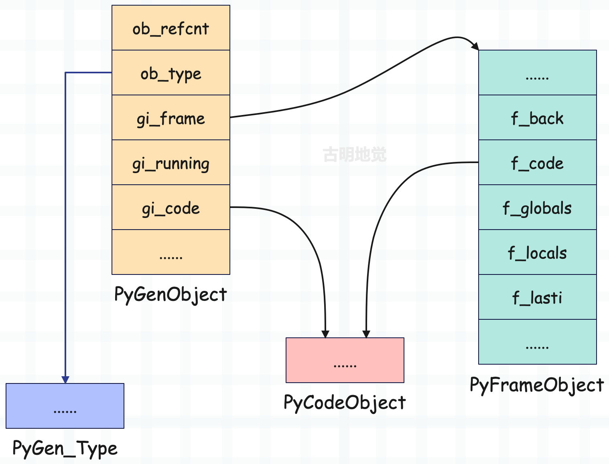
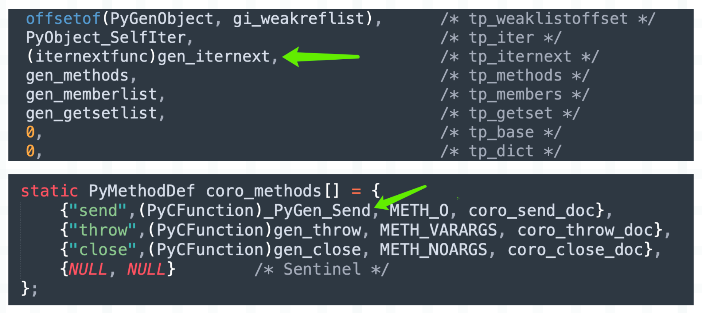
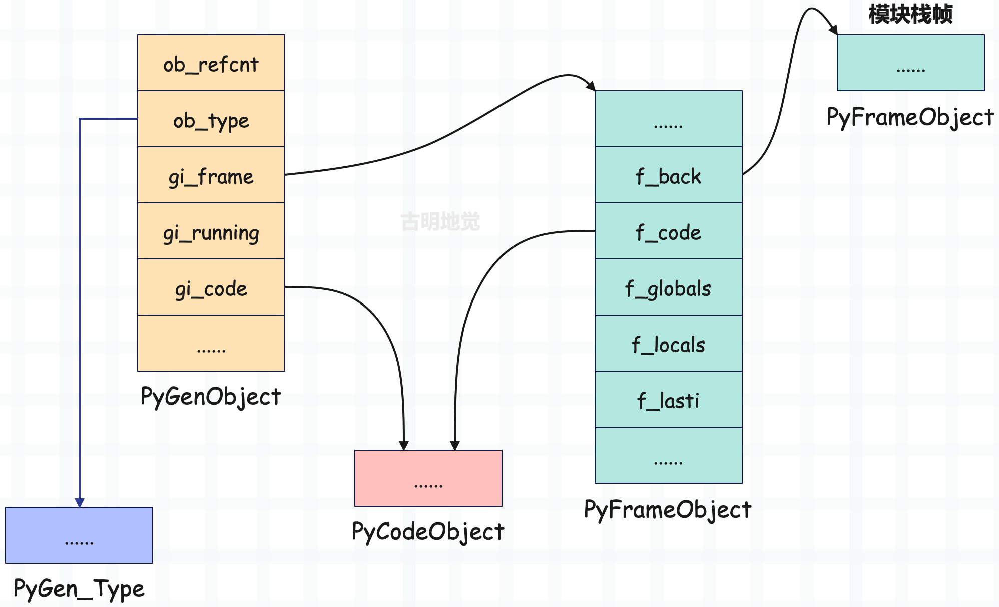
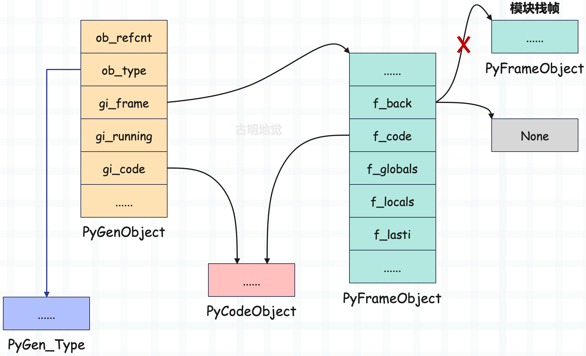
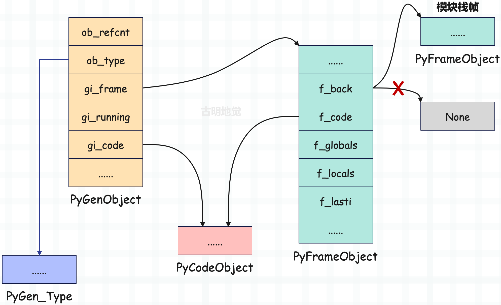

## 楔子

上一篇文章我们介绍了生成器的基本概念和相关用法，如果一个函数内部出现了 yield 关键字，那么它就是生成器函数，调用之后会返回生成器。生成器可以通过 yield 关键字暂停执行，并且还可以通过 \_\_next\_\_ 方法从上一次暂停的位置重新恢复执行。

关于普通函数和生成器函数，我们举一个生动的例子。

普通函数可以想象成一匹马，只要调用了，那么不把里面的代码执行完毕誓不罢休，而函数内部的 return xxx，就是调用之后的返回值。

生成器函数则好比一头驴，调用的时候并没有动，只是返回一个生成器对象，然后需要每次拿鞭子抽一下（调用一次 \_\_next\_\_），才往前走一步。通过不断地驱动生成器，最终将里面的代码执行完毕，然后将设置了返回值的 StopIteration 抛出来。

另外我们也可以把生成器看成是可以暂停的函数，其中 yield 就类似于 return，只不过可以有多个 yield。当执行到一个 yield 时，将值返回、同时暂停在此处。然后当调用 \_\_next\_\_ 驱动时，从暂停的地方继续执行，直到找到下一个 yield。如果找不到下一个 yield，就会抛出 StopIteration 异常。

~~~python
def gen():
    print("生成器开始执行了")

    name = "古明地觉"
    print("创建了一个局部变量 name")
    yield name
    
    age = 16
    print("创建了一个局部变量age")
    yield age

    gender = "female"
    print("创建了一个局部变量gender")
    yield gender

# 生成器函数也是一个函数
print(gen)  # <function gen at 0x7f31171ac550>
print(type(gen))  # <class 'function'>

# 调用生成器函数并不会立刻执行，而是会返回一个生成器对象
g = gen()
print(g)  # <generator object gen at 0x7f31170b0740>
print(g.__class__)  # <class 'generator'>
~~~

那么本次就来看看生成器底层是怎么实现的？

## 生成器函数的创建

调用生成器函数会返回生成器，那么我们就要先看看生成器函数是如何构建的，它和普通函数有什么区别？

~~~python
import dis

code_string = """
def gen():
    yield 123
"""

dis.dis(compile(code_string, "<file>", "exec"))
~~~

看一下字节码指令：

~~~c
  0 LOAD_CONST               0 (<code object gen at 0x7f3...>)
  2 LOAD_CONST               1 ('gen')
  4 MAKE_FUNCTION            0
  6 STORE_NAME               0 (gen)
  8 LOAD_CONST               2 (None)
 10 RETURN_VALUE

Disassembly of <code object gen at 0x7f3...>:
 0 LOAD_CONST               1 (123)
 2 YIELD_VALUE
 4 POP_TOP
 6 LOAD_CONST               0 (None)
 8 RETURN_VALUE
>>> 
~~~

字节码指令依旧分为两部分，这里我们只看模块对应的字节码指令。可以发现，构建生成器函数时的指令和构建普通函数是一模一样的，原因也很好解释，因为生成器函数也是函数。当然啦，还有协程函数、异步生成器函数，它们在构建时的字节码指令都是一样的，因为它们都是函数，类型都是 \<class 'function'\>。

然后调用生成器函数，返回生成器对象；调用协程函数，返回协程对象；调用异步生成器函数，返回异步生成器对象；调用普通函数，会立刻执行内部代码，返回的就是函数的返回值。

那么问题来了，既然它们都是函数，那虚拟机在调用时是如何区分彼此的呢？毕竟返回的对象不同。还记得 PyCodeObject 的 co_flags 吗？它除了可以判断一个函数是否定义了 \*args、\*\*kwargs，更重要的是它还可以判断函数的类型。

~~~python
def gen():
    yield

# 生成器函数，co_flags & 0x20 为真
# 调用会得到生成器，而生成器的类型是 <class 'generator'>
print(gen.__code__.co_flags & 0x20)  # 32

async def coro():
    return
  
# 协程函数，co_flags & 0x80 为真
# 调用会得到协程，而协程的类型是 <class 'coroutine'>
print(coro.__code__.co_flags & 0x80)  # 128

async def async_gen():
    yield
    
# 异步生成器函数，co_flags & 0x200 为真
# 调用会得到异步生成器，而异步生成器的类型是 <class 'async_generator'>
print(async_gen.__code__.co_flags & 0x200)  # 512
~~~

这些都是在语法解析的时候确定的，当编译器看到一个函数里面出现了 yield，那么它就知道这是生成器函数。于是创建 PyCodeObject 的时候，会设置 co_flags，让它 & 0x20 为真。

~~~C
//Include/code.h

#define CO_OPTIMIZED    0x0001
#define CO_NEWLOCALS    0x0002
#define CO_VARARGS      0x0004
#define CO_VARKEYWORDS  0x0008
#define CO_NESTED       0x0010
#define CO_GENERATOR    0x0020
~~~

我们看到 CO_GENERATOR 的值为 0x20，如果想判断一个函数是否是生成器函数，那么就可以通过 co_flags & 0x20 是否为真来判断。

当生成器函数创建完毕之后就要调用了，来创建一个生成器。还记得函数的调用流程吗？

由于这是一个生成器函数，因此调用时不会进入快速通道，而是会进入通用通道。

~~~C
PyObject *
_PyEval_EvalCodeWithName(PyObject *_co, PyObject *globals, PyObject *locals,
           PyObject *const *args, Py_ssize_t argcount,
           PyObject *const *kwnames, PyObject *const *kwargs,
           Py_ssize_t kwcount, int kwstep,
           PyObject *const *defs, Py_ssize_t defcount,
           PyObject *kwdefs, PyObject *closure,
           PyObject *name, PyObject *qualname)
{
    // ...
    // 根据 co_flags 检测函数的种类，如果是生成器函数、协程函数、异步生成器函数三者之一
    if (co->co_flags & (CO_GENERATOR | CO_COROUTINE | CO_ASYNC_GENERATOR)) {
        PyObject *gen;
        int is_coro = co->co_flags & CO_COROUTINE;
        Py_CLEAR(f->f_back);
        if (is_coro) {
            // 如果是协程函数，创建协程
            gen = PyCoro_New(f, name, qualname);
        } else if (co->co_flags & CO_ASYNC_GENERATOR) {
            // 如果是异步生成器函数，创建异步生成器
            gen = PyAsyncGen_New(f, name, qualname);
        } else {
            // 否则说明是生成器函数，那么创建生成器
            gen = PyGen_NewWithQualName(f, name, qualname);
        }
        if (gen == NULL) {
            return NULL;
        }
        // 被 GC 跟踪
        _PyObject_GC_TRACK(f);
        // 返回
        return gen;
    }
    // ...
}
~~~

在编译时将函数种类体现在 co_flags 中，调用时再根据 co_flags 创建不同的对象。

## 生成器的底层结构

通过源码我们得知，生成器对象是通过调用 PyGen_NewWithQualName 创建的，不过在看这个函数之前，我们先看一下生成器的底层结构。

~~~C
// Include/genobject.h

#define _PyGenObject_HEAD(prefix)                                           \
    PyObject_HEAD                                                           \
    struct _frame *prefix##_frame;                                          \
    char prefix##_running;                                                  \
    PyObject *prefix##_code;                                                \
    PyObject *prefix##_weakreflist;                                         \
    PyObject *prefix##_name;                                                \
    PyObject *prefix##_qualname;                                            \
    _PyErr_StackItem prefix##_exc_state;

typedef struct {
    _PyGenObject_HEAD(gi)
} PyGenObject;
~~~

如果我们将其整理一下，等价于如下：

~~~c
typedef struct {
    // 头部信息
    PyObject_HEAD
    // 生成器执行时对应的栈帧对象，用于保存执行上下文信息
    struct _frame *gi_frame; 
    // 标识生成器是否在运行当中
    char gi_running;  
    // 生成器函数的 PyCodeObject 对象
    PyObject *gi_code; 
    // 弱引用相关，不深入讨论
    PyObject *gi_weakreflist; 
    // 生成器的名字
    PyObject *gi_name; 
    // 生成器的全限定名
    PyObject *gi_qualname; 
    // 生成器执行出现异常时的异常栈，更准确的说，其实是异常栈的一个 entry
    // 里面包含了 exc_type、exc_value、exc_traceback
    // 以及通过 previous_item 指针指向上一个 entry
    _PyErr_StackItem *gi_exc_state; 
} PyGenObject;
~~~

所以生成器在底层对应 PyGenObject，它的类型则是 PyGen_Type。至此，生成器的结构就非常清晰了，我们来画一张图：

无论是普通函数还是生成器函数，在调用时，虚拟机都会为其创建栈帧，因为栈帧是函数执行的上下文。只是对于生成器函数来说，由于它的 co_flags 带有 CO_GENERATOR 标识，所以知道这是一个生成器函数。在调用时不会立刻执行里面的字节码，而是创建了一个生成器对象，并将栈帧交由 gi_frame 字段保存，然后将生成器返回了。

我们可以从 Python 层面来验证得到的结论。

~~~python
def gen():
    yield

# 在内部会创建栈帧，但是和普通函数不同
# 虚拟机不会立即执行字节码，而是创建一个生成器
# 然后让 "生成器 -> gi_frame = 栈帧"
g = gen()

# 通过 gi_frame 即可拿到栈帧
print(g.gi_frame)  # <frame at 0x7f3...>

# 由于生成器还没有运行，所以栈帧的 f_back 是 None
# 如果是普通函数的栈帧，那么它的 f_back 应该是模块对应的栈帧
# 因为对于普通函数而言，能拿到它的栈帧，说明一定执行了
# 而生成器则不同，它还没有运行，所以 f_back 是 None
print(g.gi_frame.f_back)  # None

# f_lasti 表示上一条已执行完毕的字节码指令的偏移量
# -1 代表尚未执行
print(g.gi_frame.f_lasti)  # -1

# 所以 gi_running 也是 False
print(g.gi_running)  # False

# 还可以获取 PyCodeObject，有三种方式
print(
    g.gi_code is g.gi_frame.f_code is gen.__code__
)  # True
~~~

所以生成器相当于对栈帧进行了一个封装，当我们驱动它执行时，会将内部的栈帧插入到栈帧链中执行。一旦遇到 yield，停止运行，将栈帧从栈帧链中移除。

然后再次驱动执行，那么再将内部的栈帧插入到栈帧链中执行字节码指令，由于 f_lasti 记录了上一条已执行完毕的指令的偏移量，所以是从上次中断的位置开始执行的。如果又遇到了 yield，那么依旧停止运行，将栈帧从栈帧链中移除。

就这样不断重复，直到执行完毕。而生成器一旦执行完毕了（return 之后），那么会将栈帧设置为 None。

~~~python
def gen():
    yield

g = gen()

print(g.gi_frame is None)  # False

for _ in g:
    pass

print(g.gi_frame is None)  # True
~~~

所以生成器只能顺序遍历一次，从这里我们也可以看出原因，因为遍历完之后栈帧都没了。

~~~python
g = (x for x in [1, 2, 3])

print(tuple(g))  # (1, 2, 3)
print(tuple(g))  # ()
~~~

还是很好理解的。

## 生成器的创建

然后再来看看生成器的创建过程，我们上面提到，生成器是在通用通道里面调用 PyGen_NewWithQualName 创建的，来看看这个函数长什么样子。

~~~C
// Objects/genobject.c

PyObject *
PyGen_NewWithQualName(PyFrameObject *f, PyObject *name, PyObject *qualname)
{
    return gen_new_with_qualname(&PyGen_Type, f, name, qualname);
}
~~~

该函数接收三个参数，分别是栈帧对象、\_\_name\_\_、\_\_qualname\_\_。注意这个栈帧对象，它是在通用通道里面创建好的，然后将其作为参数传递到 PyGen_NewWithQualName 里面进行调用。

而该函数又调用了 gen_new_with_qualname，所以具体逻辑在这个函数里面，来看一下。

~~~C
// Objects/genobject.c

static PyObject *
gen_new_with_qualname(PyTypeObject *type, PyFrameObject *f,
                      PyObject *name, PyObject *qualname)
{
    // 为生成器对象申请内存
    PyGenObject *gen = PyObject_GC_New(PyGenObject, type);
    if (gen == NULL) {
        Py_DECREF(f);
        return NULL;
    }
    // 将通用通道里面的栈帧交给 gi_frame 保存，所以普通函数和生成器函数调用时都会创建栈帧
    // 但普通函数调用时，会在栈帧里面将字节码全部执行完毕
    // 而生成器函数调用时，会返回生成器对象，并将栈帧保存在里面
    gen->gi_frame = f;
    // 注意这里，又让栈帧的 f_gen 成员保存生成器对象
    // 如果是普通函数，那么 f_gen 显然为空
    f->f_gen = (PyObject *) gen;
    Py_INCREF(f->f_code);
    // 让生成器的 gi_code 也保存 PyCodeObject
    gen->gi_code = (PyObject *)(f->f_code);
    // 初始时，gi_running 为 0
    gen->gi_running = 0;
    // 弱引用列表为空
    gen->gi_weakreflist = NULL;
    // gi_exc_state 和异常栈相关，内部字段初始为 NULL
    gen->gi_exc_state.exc_type = NULL;
    gen->gi_exc_state.exc_value = NULL;
    gen->gi_exc_state.exc_traceback = NULL;
    gen->gi_exc_state.previous_item = NULL;
    // 设置 gi_name
    if (name != NULL)
        gen->gi_name = name;
    else
        gen->gi_name = ((PyCodeObject *)gen->gi_code)->co_name;
    Py_INCREF(gen->gi_name);
    // 设置 gi_qualname 
    if (qualname != NULL)
        gen->gi_qualname = qualname;
    else
        gen->gi_qualname = gen->gi_name;
    Py_INCREF(gen->gi_qualname);
    // 让生成器对象被 GC 跟踪
    _PyObject_GC_TRACK(gen);
    // 返回
    return (PyObject *)gen;
}
~~~

所以生成器就是对栈帧进行了一个封装，通过 yield 和 \_\_next\_\_、send，我们可以操控栈帧的执行。但普通函数没有给我们这个机会，它在创建完栈帧之后，不将字节码全执行完是不会罢休的。

## 生成器的执行

由于调用 \_\_next\_\_、send 方法可以驱动生成器执行，因此相关细节就隐藏在这两个函数当中。

\_\_next\_\_ 对应类型对象 PyGen_Type 的 tp_iternext，而 send 是一个普通的方法，所以它位于 tp_methods 中。所以如果调用 \_\_next\_\_，底层会执行 gen_iternext，如果调用 send，底层会执行 \_PyGen_Send。

~~~C
// Objects/genobject.c

static PyObject *
gen_iternext(PyGenObject *gen)
{
    return gen_send_ex(gen, NULL, 0, 0);
}

PyObject *
_PyGen_Send(PyGenObject *gen, PyObject *arg)
{
    return gen_send_ex(gen, arg, 0, 0);
}
~~~

无论哪种方式，在底层最终都是通过 gen_send_ex 函数完成的，只是 \_\_next\_\_ 不接收参数，因此 gen_iternext 在调用时传递了一个空。而 send 接收一个参数，因此 _PyGen_Send 在调用时传了一个 arg。

所以核心逻辑显然在 gen_send_ex 函数里面。

~~~C
static PyObject *
gen_send_ex(PyGenObject *gen, PyObject *arg, int exc, int closing)
{
    // 获取线程状态对象
    PyThreadState *tstate = _PyThreadState_GET();
    // 拿到生成器内部保存的栈帧对象
    PyFrameObject *f = gen->gi_frame;
    // 返回值
    PyObject *result;
    // 重点来了，f 就是生成器内部的栈帧，f->f_back 表示生成器内部栈帧的上一级栈帧
    // 而 tstate->frame 表示当前栈帧，也就是调用 __next__ 或者 send 时所在的栈帧
    // 假设我们是在模块作用域调用了生成器的 __next__ 方法，那么 tstate->frame 就是模块对应的栈帧
    // 而当下面这行代码执行完毕后，tstate->frame 就变成了生成器内部栈帧的上一级栈帧
    // 生成器内部的栈帧则变成了当前栈帧，所以这是不是就相当于将生成器内部的栈帧插入到栈帧链当中了呢？
    f->f_back = tstate->frame;
    // 生成器正在运行
    gen->gi_running = 1;
    gen->gi_exc_state.previous_item = tstate->exc_info;
    tstate->exc_info = &gen->gi_exc_state;
    // 而插入到栈帧链之后要干啥？显然是执行栈帧内的字节码
    // 栈帧对象保存着生成器的执行上下文，f_lasti 字段则跟踪生成器内部代码的执行进度
    // 当遇到 yield 之后，将后面的值返回给 result
    result = PyEval_EvalFrameEx(f, exc);
    tstate->exc_info = gen->gi_exc_state.previous_item;
    gen->gi_exc_state.previous_item = NULL;
    gen->gi_running = 0;
}  
~~~

至于剩下的逻辑我们显然再清楚不过了，最终会调用帧评估函数在栈帧对象中执行字节码。每执行完一条指令就自增 f_lasti 字段、next_instr 字段，直到字节码全部执行完毕、或者中间出现异常时结束循环。当然啦，遇到 yield 也会结束循环。

举例说明：

~~~python
def gen():
    yield 1
    yield 2
    yield 3
   
g = gen()
print(g.gi_frame.f_back)  # None
g.__next__()
~~~

g = gen() 之后会创建一个生成器，但此时生成器的代码还没有执行，所以生成器内部栈帧的上一级栈帧为空。等到调用生成器的 \_\_next\_\_ 方法时，会接入到栈帧链并开始执行。另外，由于我们是在模块作用域中调用的 \_\_next\_\_，所以当前栈帧链里面其实只包含了一个栈帧，就是模块的栈帧。

所以接入栈帧链，其实就是让生成器内部栈帧的 f_back 字段，指向调用 \_\_next\_\_ 或 send 时所在的栈帧。比如当前是在模块作用域中调用的 \_\_next\_\_，那么就让 f_back 字段指向模块栈帧。就好像在模块的栈帧之上，创建了一个新的栈帧一样，开始执行，直到遇见个 yield。

## 生成器的暂停

先看看生成器内部的字节码长什么样子？

~~~python
def gen():
    name = "古明地觉"
    yield name
    
    age = 16
    res = yield age
    
    gender = "female"
    yield gender
~~~

字节码如下：

~~~C
  // 加载字符串常量 "古明地觉"
  0 LOAD_CONST               1 ('古明地觉')
  // 使用局部变量 name 保存
  2 STORE_FAST               0 (name)
  // 对应 yield name
  // 加载局部变量 name，然后将值 yield 出去
  // 注意：执行完 YIELD_VALUE 之后，生成器会暂停
  4 LOAD_FAST                0 (name)
  6 YIELD_VALUE
  // 这里为啥会出现 POP_TOP 呢？
  // 因为驱动生成器执行时，我们是可以传值的
  // 但是 yield name 左边没有变量接收，所以是 POP_TOP
  8 POP_TOP

  // 加载整数常量 16
 10 LOAD_CONST               2 (16)
  // 使用局部变量 age 保存
 12 STORE_FAST               1 (age)
  // 加载局部变量 age，然后将值 yield 出去
 14 LOAD_FAST                1 (age)
 16 YIELD_VALUE
  // 但这里需要注意，因为是 res = yield age
  // 所以这里是 STORE_FAST，会将调用方传递的值使用 res 变量保存
 18 STORE_FAST               2 (res)
  
  // 加载字符串常量 "female"
 20 LOAD_CONST               3 ('female')
  // 使用局部变量 gender 保存
 22 STORE_FAST               3 (gender)
  // 加载局部变量 gender，然后将值 yield 出去
 24 LOAD_FAST                3 (gender)
 26 YIELD_VALUE
  // 弹出调用方传递的值
 28 POP_TOP
  
  // return None
 30 LOAD_CONST               0 (None)
 32 RETURN_VALUE
~~~

指令很好理解，显然重点是在 YIELD_VALUE 上面，我们看一下这个指令：

~~~C
case TARGET(YIELD_VALUE): {
    // 执行 yield value 之前，会先将 value 压入运行时栈
    // 然后这里再将 value 从栈里面弹出
    retval = POP();
    // 异步生成器逻辑，当前不用关注
    if (co->co_flags & CO_ASYNC_GENERATOR) {
        PyObject *w = _PyAsyncGenValueWrapperNew(retval);
        Py_DECREF(retval);
        if (w == NULL) {
            retval = NULL;
            goto error;
        }
        retval = w;
    }
    // stack_pointer 指向运行时栈的栈顶
    // 因为要跳出循环了，所以赋值给f->f_stacktop
    f->f_stacktop = stack_pointer;
    // 直接通过 goto 语句跳出 for 循环，来到 exit_yielding 标签
    goto exit_yielding;
}
~~~

紧接着，帧评估函数会将当前栈帧（也就是生成器内部的栈帧）从栈帧链中移除，至于移除方式也很简单，只需要将它的 f_back 设置为 None 即可，然后回退到上一级栈帧。

同理，当再次调用 \_\_next\_\_ 或者 send 方法时，生成器将恢复执行，底层会调用 gen_send_ex 函数。然后虚拟机会把生成器的栈帧对象挂到栈帧链中，并最终调用帧评估函数逐条执行字节码。

通过不断调用 \_\_next\_\_，最终将整个生成器内的代码执行完毕，我们用 Python 代码演示一下这个过程。

~~~Python
def gen():
    name = "古明地觉"
    yield name
    
    age = 16
    res = yield age
    
    gender = "female"
    yield gender
  
  
g = gen()

# 生成器尚未执行，f_lasti 初始为 -1
print(g.gi_frame.f_lasti)  # -1    

# 调用 __next__，会将生成器内部栈帧插入到栈帧链中，开始执行
# 那什么时候暂停呢？如果站在 Python 的角度，肯定是在 yield 处暂停
# 但如果从虚拟机的角度，应该是在 YIELD_VALUE 的结束位置暂停
g.__next__()
# f_lasti 表示上一条已执行的指令的偏移量，而上一条执行的指令是 YIELD_VALUE，因此是 6
print(g.gi_frame.f_lasti)  # 6
print(g.gi_frame.f_locals)  # {'name': '古明地觉'}

# 第二个 YIELD_VALUE 的偏移量是 16
g.__next__()
print(g.gi_frame.f_lasti)  # 16
print(g.gi_frame.f_locals)  # {'name': '古明地觉', 'age': 16}

# 第三个 YIELD_VALUE 的偏移量是 26
g.__next__()
print(g.gi_frame.f_lasti)  # 26
print(g.gi_frame.f_locals)  # {'name': '古明地觉', 'age': 16, 'res': None, 'gender': 'female'}

# 再次调用 g.__next__()，生成器执行完毕
try:
    g.__next__()
except StopIteration:
    pass
  
# 一旦执行完毕，gi_frame 会设置为 None，因此生成器只能顺序遍历一次
print(g.gi_frame)  # None
~~~

遇见 yield 产生中断，调用 \_\_next\_\_、send 恢复执行，并且在这个过程中，f_lasti 也在不断变化，始终维护着生成器的执行进度。而基于 f_lasti，生成器就可以记住自己的中断位置，并在下一次被驱动的时候，能够从中断的位置恢复执行。

而以上也正是协程能够实现的理论基础，虽然 Python 在 3.5 提供了基于 async def 的原生协程，但它底层依旧是使用了生成器。

## 小结

以上我们从源码的角度剖析了生成器的实现原理，下面总结一下。

1）Python 具有词法作用域，当函数内部出现 yield 关键字时，会给对应的 PyCodeObject 增加一个 CO_GENERATOR 标识。这个标识让虚拟机在调用时能够分辨出是普通函数、还是生成器函数。

2）和普通函数一样，生成器函数在调用时，也会由虚拟机创建栈帧，作为执行上下文。但和普通函数不同的是，调用生成器函数时创建的栈帧不会立即进入帧评估函数执行字节码。而是以栈帧为参数，创建生成器对象。

3）可以调用 \_\_next\_\_、send 方法驱动生成器执行，虚拟机会将生成器的栈帧插入栈帧链，也就是将它的 f_back 设置为调用 \_\_next\_\_、send 时所在的栈帧。然后生成器的栈帧就变成了当前栈帧，于是开始执行字节码。

4）执行到 YIELD_VALUE 指令时，说明生成器该暂停了。于是修改 f_stacktop，通过一个 goto 语句跳出执行指令的 for 循环，退回到上一级栈帧，然后将 yield 右边的值压入运行时栈的栈顶，供调用方使用。并且还会将生成器内部栈帧的 f_back 设置为空，以及设置 f_lasti 等字段。

5）当再次调用 \_\_next\_\_或者 send 方法时，虚拟机仍会修改 f_back，将生成器的栈帧重新插入到栈帧链中，然后继续执行生成器内部的字节码。但是从什么地方开始执行呢？显然是上一次中断的位置，那么上一次中断的位置虚拟机如何得知呢？没错，显然是通过 f_lasti，直接从偏移量为 f_lasti + 2 的指令开始执行即可。所以执行时，会从上一个 YIELD_VALUE 的下一条指令开始执行，另外由于要获取调用者传递的值，因此 YIELD_VALUE 的下一条指令一般是 POP_TOP 或者 STORE_FAST。

6）随着不断驱动生成器执行，总有执行完毕的那一刻。而当生成器执行完毕后，gi_frame 会被设置为 None，因此生成器只能顺序遍历一次。

------

&nbsp;

**欢迎大家关注我的公众号：古明地觉的编程教室。**

**如果觉得文章对你有所帮助，也可以请作者吃个馒头，Thanks♪(･ω･)ﾉ。**

