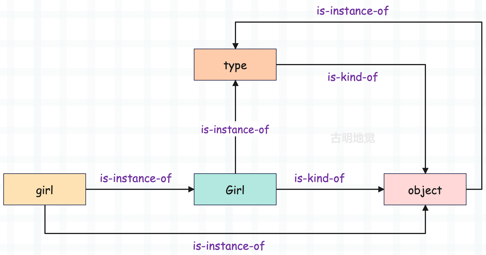

从现在开始，我们将进入新的篇章，来分析 Python 的类是怎么实现的？我们知道 Python 是一个面向对象的语言，而 C 不是，那么在 Python 的底层，是如何使用 C 来支持面向对象功能的呢？带着这些疑问，我们下面开始剖析类的实现机制。

另外，在 Python2 中存在着经典类（classic class）和新式类（new style class），但是到 Python3，经典类已经消失了，因此我们只介绍新式类。

下面先来重温一下对象的关系模型。

在面向对象的理论中，有两个核心概念：类和实例。类可以看成是一个模板，那么实例就是根据这个模板创建出来的对象，可以想象成 Docker 的镜像和容器。但是在 Python 里面，类和实例都是对象，类叫做类对象、或者类型对象，实例叫做实例对象。

而对象之间存在以下两种关系：

- is-kind-of：对应面向对象理论中父类和子类之间的关系；
- is-instance-of：对应面向对象理论中类和实例之间的关系；

~~~Python
class Girl(object):
    def say(self):
        return "古明地觉"

girl = Girl()
print(girl.say())  # 古明地觉
~~~

显然 Girl 和 object 之间是 is-kind-of 关系，即 object 是 Girl 的父类。另外 Python3 里面所有的类（除了 object）都是默认继承 object，即便这里不显式继承 object，也会默认继承，为了说明我们就写上了。

除了 object 是 Girl 的父类，我们还能看出 girl 和 Girl 之间存在 is-instance-of 关系，即 girl 是 Girl 的实例。当然如果再进一步的话，girl 和 object 之间也存在 is-instance-of 关系，girl 也是 object 的实例。

~~~Python
class Girl(object):
    pass

girl = Girl()
print(issubclass(Girl, object))  # True
print(type(girl))  # <class '__main__.Girl'>
print(isinstance(girl, Girl))  # True
print(isinstance(girl, object))  # True
~~~

girl 是 Girl 这个类实例化得到的，所以 type(girl) 得到的是类对象 Girl。但 girl 也是 object 的实例对象，因为 Girl 继承了 object。至于这其中的原理，后面会慢慢介绍到。

Python 也提供了一些手段可以探测这些关系，除了上面的 type 之外，还可以使用对象的 \_\_class\_\_ 属性探测一个对象和其它的哪些对象之间存在 is-instance-of 关系。而通过对象的 \_\_bases\_\_ 属性则可以探测一个对象和其它的哪些对象之间存在着 is-kind-of 关系。

当然 Python 还提供了两个内置函数 issubclass 和 isinstance 来验证两个对象之间是否存在着我们期望的关系。

~~~Python
class Girl(object):
    pass

girl = Girl()
print(girl.__class__)  # <class '__main__.Girl'>
print(Girl.__class__)  # <class 'type'>

# __base__ 只显示直接继承的第一个类
print(Girl.__base__)  # <class 'object'>
# __bases__ 会显示直接继承的所有类
print(Girl.__bases__)  # (<class 'object'>,)
~~~

我们画一张图：

关于 type 和 object 的关系，我们在最开始介绍对象模型的时候已经说过了。

type 在底层的结构体是 PyType_Type、object 在底层的结构体是 PyBaseObject_Type。在创建 object 的时候，将内部的 ob_type 设置成了 &PyType_Type；在创建 type 的时候，将内部的 tp_base 设置成了 &PyBaseObject_Type。

因此这两者的定义是彼此依赖的，两者是同时出现的，我们后面还会看到。

紧接着我们考察一下类对象 Girl 的行为，我们看到它支持属性设置：

~~~Python
class Girl(object):
    pass

print(hasattr(Girl, "name"))  # False
Girl.name = "古明地觉"
print(hasattr(Girl, "name"))  # True
print(Girl.name)  # 古明地觉
~~~

类都已经定义完了，我们后续还可以进行属性添加，这在其它的静态语言中是不可能做到的。那 Python 是如何做到的呢？我们说能够对属性进行动态添加，你会想到什么？是不是字典呢？正如 global 名字空间一样，我们猜测类应该也有自己的属性字典，往类里面设置属性的时候，等价于向字典中添加键值对，同理其它操作也与之类似。

~~~Python
class Girl(object):
    pass

print(Girl.__dict__.get("name", "不存在"))  # 不存在
Girl.name = "古明地觉"
print(Girl.__dict__.get("name"))  # 古明地觉
~~~

和操作全局变量是类似的，但是有一点需要注意：我们不能直接通过类的属性字典来设置属性。

~~~python
try:
    Girl.__dict__["name"] = "古明地觉"
except Exception as e:
    print(e)  # 'mappingproxy' object does not support item assignment
~~~

虽然叫做属性字典，但其实是 mappingproxy 对象，该对象本质上是对字典进行了封装，在字典的基础上移除了增删改操作，也就是只保留了查询功能。如果我们想给类增加属性，可以采用直接赋值的方式，或者调用 setattr 函数也是可以的。

+ Girl.age = 17
+ setattr(Girl, "age", 17)

这两种做法都可以，但是 Girl.\_\_dict\_\_["age"] = 17 这种做法不行，因为 Girl.\_\_dict\_\_ 返回的不是字典，而是封装了字典的 mappingproxy 对象。不过 Python 的标准库提供了一个 gc 模块，可以拿到 mappingproxy 内部的字典。

~~~Python
import gc

class Girl(object):
    pass

# gc.get_referents(obj)：返回 obj 引用的对象
# 对于 mappingproxy 来说，它引用的显然就是内部的字典
gc.get_referents(Girl.__dict__)[0]["name"] = "古明地觉"
print(Girl.name)  # 古明地觉
~~~

并且这种做法除了适用于自定义类对象，还适用于内置类对象，但是工作中不要这么做，知道有这么个操作就行。除了设置属性之外，我们还可以设置函数。

~~~Python
class Girl(object):
    pass

Girl.info = lambda name: f"我是{name}"
print(Girl.info("古明地觉"))  # 我是古明地觉

# 如果是实例调用的话，会和我们想象的不太一样
# 因为实例调用的时候会将函数包装成方法
try:
    Girl().info("古明地觉")
except TypeError as e:
    print(e)
    """
    <lambda>() takes 1 positional argument but 2 were given
    """

# 实例在调用的时候会将自身也作为参数传进去
# 所以第一个参数 name 实际上接收的是 Girl 的实例对象
# 只不过第一个参数按照规范来讲应该叫做 self
# 但即便你起别的名字也是无所谓的
print(Girl().info())
"""
我是<__main__.Girl object at 0x000001920BB88760>
"""
~~~

所以我们可以有两种做法：

~~~Python
class Girl(object):
    pass

# 将其包装成一个静态方法，这样类和实例都可以调用
Girl.info = staticmethod(lambda name: f"我是{name}")
print(Girl.info("古明地觉"))  # 我是古明地觉
print(Girl().info("古明地觉"))  # 我是古明地觉

# 如果是给实例用的，那么带上一个 self 参数即可
Girl.info = lambda self, name: f"我是{name}"
print(Girl().info("古明地觉"))  # 我是古明地觉
~~~

此外还可以通过 type 来动态地往类里面进行属性的增加、修改和删除。

~~~Python
class Girl(object):
    def say(self):
        pass

print(hasattr(Girl, "say"))  # True

# delattr(Girl, "say") 与之等价
type.__delattr__(Girl, "say")

print(hasattr(Girl, "say"))  # False

# 我们设置一个属性吧，以下等价于 Girl.name = "古明地觉"
setattr(Girl, "name", "古明地觉")
print(Girl.name)  # 古明地觉
~~~

事实上调用 getattr、setattr、delattr 等价于调用其类型对象的 \_\_getattr\_\_、\_\_setattr\_\_、\_\_delattr\_\_。

所以，一个对象支持哪些行为，取决于其类型对象定义了哪些操作。并且通过对象的类型对象，可以动态地给该对象进行属性的设置。Python 所有类型对象的类型对象都是 type，通过 type 我们便可以控制类的生成过程，即便类已经创建完毕了，也依旧可以进行属性设置。

但是注意：上面说的仅仅针对我们自定义的类，内置的类是不行的。

~~~python
try:
    int.name = "古明地觉"
except Exception as e:
    print(e)
    """
    can't set attributes of built-in/extension type 'int'
    """

try:
    int.__add__ = "xxx"
except Exception as e:
    print(e)
    """
    can't set attributes of built-in/extension type 'int'
    """
~~~

通过报错信息可以看到，不可以设置内置类和扩展类的属性。因为内置类对象在解释器启动之后，就已经初始化好了。至于扩展类就是我们使用 Python/C API 编写的扩展模块中的类，它和内置类是等价的。

因此内置的类和使用 class 定义的类本质上是一样的，都是 PyTypeObject 对象，它们的类型在 Python 里面都是 type。但区别就是内置的类在底层是静态初始化的，我们不能进行属性的动态设置。

但是为什么不可以对内置类和扩展类进行属性设置呢？首先我们要知道 Python 的动态特性是虚拟机赐予的，而虚拟机的工作是将 PyCodeObject 对象翻译成 C 的代码进行执行，所以 Python 的动态特性就是在这一步发生的。

而内置的类（int、str、list 等等）在解释器启动之后就已经静态初始化好了，直接指向 C 一级的数据结构，同理扩展类也是如此。它们相当于绕过了解释执行这一步，所以它们的属性不可以动态添加。

不光内置的类本身，还有它的实例对象也是如此。

~~~Python
a = 123
print(hasattr(a, "__dict__"))  # False
~~~

我们看到它连自己的属性字典都没有，因为内置类对象的实例对象，其内部有哪些属性，解释器记得清清楚楚。它们在底层都已经写死了，并且不允许修改，因此虚拟机完全没有必要为其实现属性字典（节省了内存占用）。

-----

&nbsp;

**欢迎大家关注我的公众号：古明地觉的编程教室。**

**如果觉得文章对你有所帮助，也可以请作者吃个馒头，Thanks♪(･ω･)ﾉ。**

