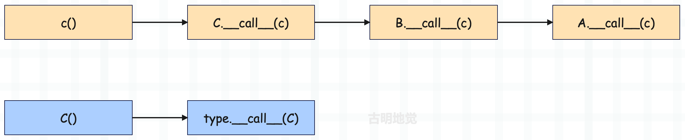

Python 的类里面有很多以双下划线开头、双下划线结尾的函数，我们称之为魔法函数。Python 的每一个操作符，都被抽象成了一个魔法函数。

比如整数可以相减，这就代表 int 这个类里面肯定定义了 \_\_sub\_\_ 函数；字符串不能相减，代表 str 这个类里面没有 \_\_sub\_\_ 函数；而整数和字符串都可以执行加法操作，显然 int、str 内部都定义了\_\_add\_\_ 函数。

~~~Python
class MyInt(int):
    def __sub__(self, other):
        return int.__sub__(self, other) * 3

a = MyInt(4)
b = MyInt(1)
print(a - b)  # 9
~~~

我们自己实现了一个类，继承自 int。当执行 a - b 的时候，肯定执行 MyInt 的 \_\_sub\_\_，然后调用 int 的 \_\_sub\_\_，得到结果之后再乘上3，逻辑上完全正确。

但是问题来了，首先调用 int.\_\_sub\_\_ 的时候，我们知道底层肯定是调用 long_as_number 中的 long_sub 函数。而 int.\_\_sub\_\_(self, other) 里面的参数类型显然都应该是 int，但我们传递的是 MyInt，那么虚拟机是怎么做的呢？

目前带着这些疑问，先来看一张草图，后面会一点一点揭开：

图中的 "\_\_sub\_\_" 对应的 value 并不是一个直接指向 long_sub 函数的指针，而是指向一个结构体，至于指向 long_sub 函数的指针则在该结构体内部。而这个结构体是谁，以及具体细节，我们后面会详细说。

另外我们知道，一个对象能否被调用，取决于它的类对象（或者说类型对象）中是否定义了\_\_call\_\_ 函数。因此：所谓调用，就是执行类型对象的 tp_call 指向的函数。

~~~python
class Girl:
    def __call__(self, *args, **kwargs):
        return "古明地觉的编程教室"

girl = Girl()
print(girl())  # 古明地觉的编程教室
~~~

而整数对象是不可调用的，这意味着 int 这个类里面没有 \_\_call\_\_ 函数，换言之 PyLong_Type 里面的 tp_call 为 NULL。

~~~Python
# 但我们通过反射，发现 int 是有 __call__ 函数的啊
print(hasattr(int, "__call__"))  # True

# 其实这个 __call__ 不是 int 里面的，而是 type 的
print("__call__" in dir(int))  # False
print("__call__" in dir(type))  # True
~~~

如果一个对象不存在某个属性，那么会自动到对应的类型对象里面去找。int 的类型是 type，而 type 里面有 \_\_call\_\_，因此 hasattr(int, "\_\_call\_\_") 结果为 True。

~~~python
a1 = int("123") 
a2 = type.__call__(int, "123") 
a3 = int.__call__("123") 

print(a1, a2, a3)  # 123 123 123
~~~

里面的 a1 和 a2 是等价的，因为调用某个对象等价于调用其类型对象的 \_\_call\_\_ 函数；而 a3 和 a2 也是等价的，因为 type 是 int 的类型对象，而 int 没有 \_\_call\_\_，所以会去类型对象 type 里面查找。

观察 a3 和 a2，我们发现这是不是就类似于类型对象和实例对象之间的关系呢？所以我们说 class 具有二象性，站在实例对象的角度上，它就是类型对象；站在元类 type 的角度上，它就是实例对象。

而实例对象在调用方法时，会将自身作为第一个参数传进去，所以 int.\_\_call\_\_("123") 等价于 type.\_\_call\_\_(int, "123")。

那么问题来了，为啥整数在调用的时候会报错呢？首先整数在调用的时候，会执行 int 里面的 \_\_call\_\_，而 int 里面没有 \_\_call\_\_，所以报错了。可能这里有人好奇，难道不会到 type 里面找吗？答案是不会的，因为 type 是元类，是用来生成类的。

类对象在调用时，会执行 type.\_\_call\_\_。实例对象在调用时，会执行类对象.\_\_call\_\_，但如果类对象没有 \_\_call\_\_，就不会再去元类里面找了，而是会去父类里面找。

~~~Python
class A:

    def __call__(self, *args, **kwargs):
        print(self)
        return "古明地觉的编程教室"

class B(A):
    pass

class C(B):
    pass

c = C()
print(c())
"""
<__main__.C object at 0x104d7e7a0>
古明地觉的编程教室
"""
~~~

可以看到，给 C 的实例对象加括号的时候，会调用 C 里面的 \_\_call\_\_ 函数。但是 C 里面没有 \_\_call\_\_，那么这个时候会从父类里面找，而不是元类。因此最终执行 A 的 \_\_call\_\_，但 self 仍是 C 的实例对象，关于这个 self 是我们后续的重点，会详细剖析。

**结论：在属性查找时，首先从对象本身进行查找，没有的话会从该对象的类型对象中进行查找，还没有的话就从类型对象所继承的父类中进行查找。**

~~~python
class A:

    def __call__(self, *args, **kwargs):
        print(self)
        return "古明地觉的编程教室"

class B(A):
    pass

class C(B):
    pass

c = C()
print(c())
~~~

还是以这段代码为例：当调用类型对象 C 的时候，本质上是执行 C.\_\_class\_\_（也就是 type）里面的 \_\_call\_\_ 函数。

当调用实例对象 c 的时候，本质上是执行 c.\_\_class\_\_（也就是类型对象 C）里面的 \_\_call\_\_ 函数，但是 C 里面没有，这个时候怎么做呢？显然是沿着继承链进行属性查找，去找 C 继承的类里面的 \_\_call\_\_ 函数。

可能有人好奇，为什么没有 object？答案是 object 内部没有 \_\_call\_\_，object 和 int 一样，都是调用了 type.\_\_call\_\_。

~~~python
# 因为 object 的类型是 type
# 所以 object.__call__() 会执行 type.__call__(object)
print(object.__call__)
# <method-wrapper '__call__' of type object 0x1034641a0>
~~~

所以，所有的类对象都是可以调用的，因为 type 是类对象的类对象，而 type 内部有 \_\_call\_\_ 函数。至于实例对象能否调用，就看其类对象、以及类对象所继承的父类是否定义了 \_\_call\_\_ 函数。

比如 str("xxx") 是合法的，因为 str 的类对象 type 里面定义了 \_\_call\_\_。但 "xxx"() 则不合法、会报错，因为字符串的类对象 str、以及 str 所继承的父类里面没有 \_\_call\_\_。但是注意，虽然 "xxx"() 会报错，但这不是一个在编译时就能够检测出来的错误，而是在运行时才能检测出来。至于原因，下面解释一下。

我们知道类对象都会有 tp_dict，这个字段指向一个 PyDictObject，表示该对象支持哪些操作，而这个 PyDictObject 必须要在运行时动态构建。所以都说 Python 效率慢，一个原因是所有对象都分配在堆上；还有一个原因就是类型无法在编译期间确定，导致大量操作都需要在运行时动态化处理，从而也就造成了 Python 运行时效率不高。

而且我们发现，像 int、str、dict 等内置类对象可以直接使用，这是因为解释器在启动时，会对这些内置类对象进行初始化的动作。这个初始化的动作会动态地在这些类对象对应的 PyTypeObject 中填充一些重要的东西，其中就包括 tp_dict，从而让这些类对象具备生成实例对象的能力。

而初始化的动作就从函数 PyType_Ready 拉开序幕，虚拟机会调用 PyType_Ready 对内置类对象进行初始化。实际上 PyType_Ready 不仅仅会处理内置类对象，还会处理自定义类对象，并且 PyType_Ready 对内置类对象和自定义类对象的作用还不同。

内置类对象在底层是已经被静态定义好了的，所以在解释器启动的时候会直接创建。只不过我们说它还不够完善，因为有一部分属性需要在运行时设置，比如 tp_base，所以还需要再打磨一下，而这一步就交给了 PyType_Ready。

但是对于我们自定义的类就不同了，PyType_Ready 做的工作只是很小的一部分，因为使用 class 自定义的类（假设是 class A），解释器一开始是不知道的。解释器在启动的时候，不可能直接就创建一个 PyA_Type 出来，因此对于自定义的类来说，需要在解释执行的时候进行内存申请、创建、初始化等等一系列步骤。

下一篇文章我们来分析类型对象是如何初始化的。

-----

&nbsp;

**欢迎大家关注我的公众号：古明地觉的编程教室。**

**如果觉得文章对你有所帮助，也可以请作者吃个馒头，Thanks♪(･ω･)ﾉ。**

