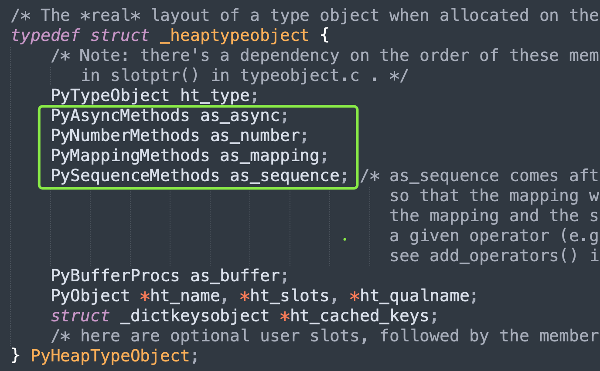
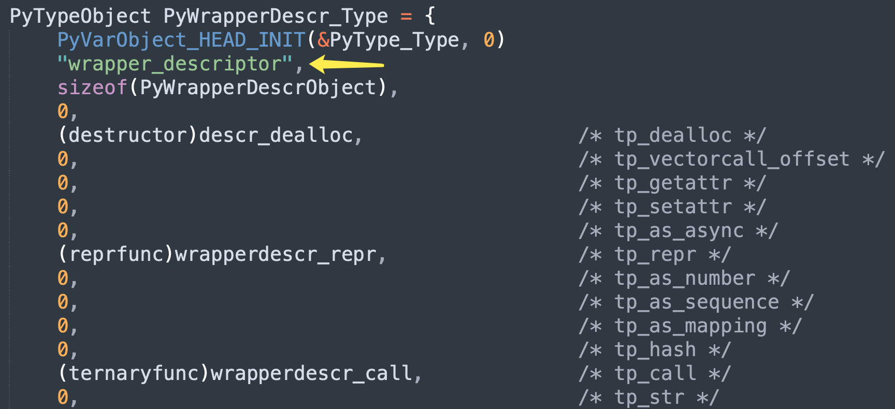
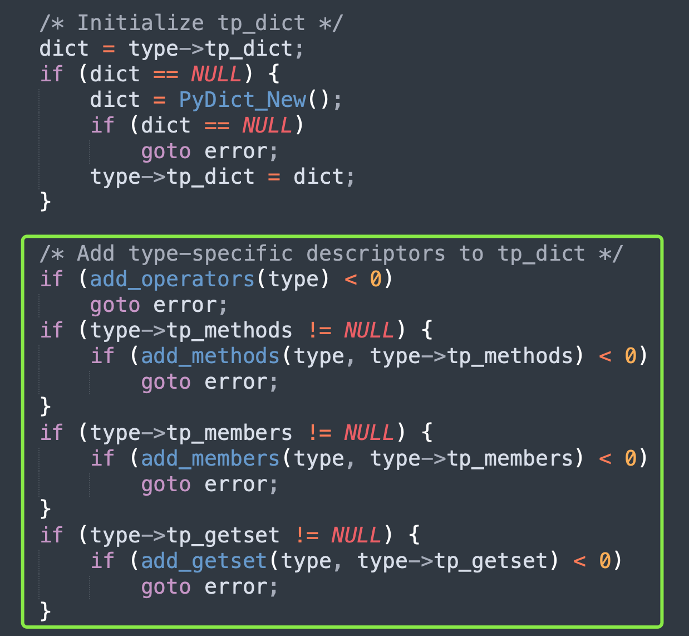
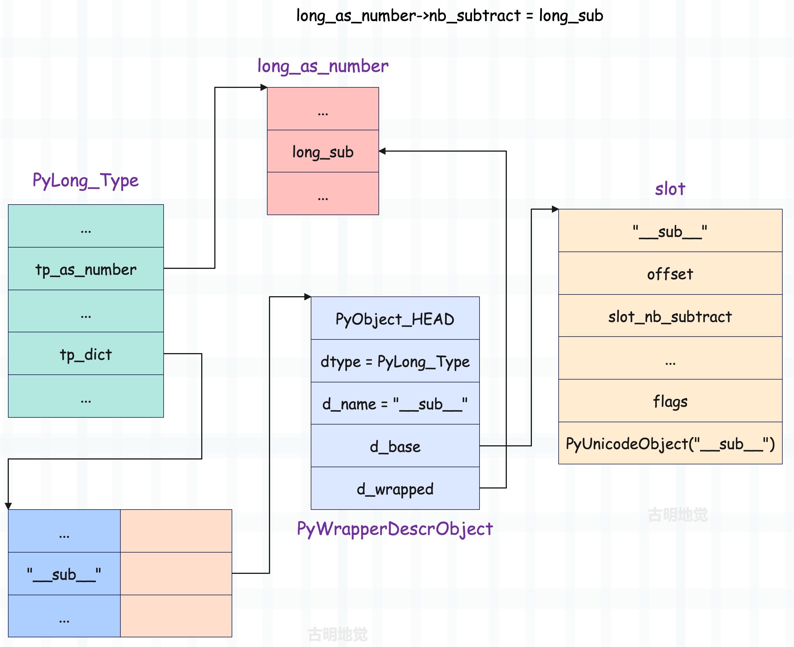
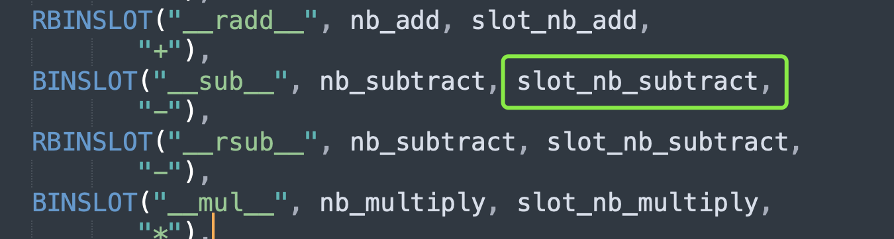
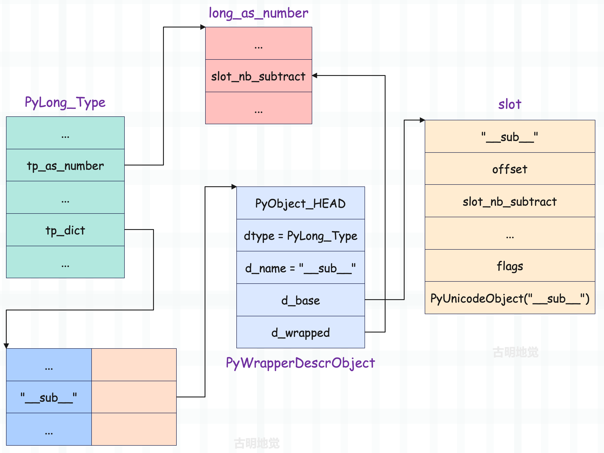

## 楔子

在上一篇文章中我们说道，内置类对象虽然在底层静态定义好了，但还不够完善。解释器在启动之后还要再打磨一下，然后才能得到我们平时使用的类型对象，而这个过程被称为类型对象的初始化。

类型对象的初始化，是通过 Objects/typeobject.c 中的 PyType_Ready 函数实现的，它主要完成以下三个工作：

+ 给类型对象设置类型和基类信息；
+ 类对象属性字典的填充；
+ 类对象 MRO 的设置与属性继承；

我们来逐一解释。

## 给类型对象设置类型和基类信息

介绍 type 和 object 之间的恩怨纠葛时，我们说类对象的基类是在初始化的时候设置的，现在可以将谜底揭开了。

~~~C
int
PyType_Ready(PyTypeObject *type)
{
    // 注意：参数 type 就是一个普通的 C 变量，和 Python 的 <class 'type'> 无关
    // dict：属性字典，即 __dict__，bases：继承的所有基类，即 __bases__
    PyObject *dict, *bases;
    // 继承的第一个基类，即 __base__
    PyTypeObject *base;
    Py_ssize_t i, n;

    // ...
    // 获取类型对象中 tp_base 字段指定的基类
    base = type->tp_base;
    // 如果基类为空、并且该类本身不是 <class 'object'>
    if (base == NULL && type != &PyBaseObject_Type) {
        // 那么将该类的基类设置为 <class 'object'>、即 &PyBaseObject_Type
        base = type->tp_base = &PyBaseObject_Type;
        Py_INCREF(base);
    }

    // 如果基类不是 NULL，也就是指定了基类，但是基类的属性字典是 NULL
    // 说明该类的基类尚未初始化，那么会先对基类进行初始化
    // 注意这里的 tp_dict，它表示每个类都会有的属性字典
    // 而属性字典是否为 NULL，是类型对象是否初始化完成的重要标志
    if (base != NULL && base->tp_dict == NULL) {
        if (PyType_Ready(base) < 0)
            goto error;
    }
    // Py_TYPE 是一个宏，会返回对象的 ob_type
    // 如果该类型对象的 ob_type 为空，但是基类不为空（显然这里是针对于自定义类型对象）
    // 那么将该类型对象的 ob_type 设置为基类的 ob_type
    // 为什么要做这一步，我们后面会详细说
    if (Py_TYPE(type) == NULL && base != NULL)
        Py_TYPE(type) = Py_TYPE(base);
    // 获取 __bases__，检测是否为空
    bases = type->tp_bases;
    // 如果为空，则根据 __base__ 进行设置
    if (bases == NULL) {
        // 如果 base 也为空，说明当前的类对象一定是 <class 'object'>
        // 那么 bases 就是空元祖
        if (base == NULL)
            bases = PyTuple_New(0);
        // 如果 base 不为空，那么 bases 就是 (base,)
        else
            bases = PyTuple_Pack(1, base);
        if (bases == NULL)
            goto error;
        // 设置 tp_bases
        type->tp_bases = bases;
    }
    // 设置属性字典，后续再聊
    dict = type->tp_dict;
    if (dict == NULL) {
        dict = PyDict_New();
        if (dict == NULL)
            goto error;
        type->tp_dict = dict;
    }
    // ...
}
~~~

对于指定了 tb_base 的类对象，当然就使用指定的基类，而对于没有指定 tp_base 的类对象，虚拟机将为其指定一个默认的基类：&PyBaseObject_Type ，也就是 Python 的 object。

所以对于 PyType_Type 而言，它的 tp_base 会指向 PyBaseObject_Type，这在 Python 中体现的就是 type 继承 object、或者说 object 是 type 的父类。但是所有的类的 ob_type 又都指向了 PyType_Type，包括 object，因此我们又说 type 是包括 object 在内的所有类对象的类对象（元类）。

而在获得了基类之后，会判断基类是否被初始化，如果没有，则需要先对基类进行初始化，而判断初始化是否完成的条件是 tp_dict 是否为 NULL。对于内置类对象来说，在解释器启动的时候，就已经作为全局对象存在了，所以它们的初始化不需要做太多工作，只需小小的完善一下即可，比如设置基类、类型、以及对 tp_dict 进行填充。

在基类设置完毕后，会继续设置 ob_type，而源码是这么设置的：Py_TYPE(type) = Py_TYPE(base)，也就是将基类的 ob_type 设置成了当前类的 ob_type，那么这一步的意义何在呢？直接设置成 \<class 'type'\> 不就完了吗？

~~~Python
class MyType(type):
    pass

class A(metaclass=MyType):
    pass

class B(A):
    pass

print(type(A))  # <class '__main__.MyType'>
print(type(B))  # <class '__main__.MyType'>
~~~

我们看到 B 继承了 A，而 A 的类型是 MyType，那么 B 的类型也成了 MyType。也就是说 A 是由 XX 生成的，那么 B 在继承 A 之后，B 也会由 XX 生成，所以源码中的那一步就是用来做这件事情的。另外，这里之所以用 XX 代替，是因为 Python 里面不仅仅只有 type 是元类，那些继承了 type 的子类也可以是元类。

而且如果你熟悉 flask 的话，你会发现 flask 源码里面就有类似于这样的操作：

~~~Python
class MyType(type):
    def __new__(mcs, name, bases, attrs):
        # 关于第一个参数我们需要说一下，对于一般的类来说这里应该是 cls
        # 但这里是元类，所以应该用 mcs，意思就是 metaclass
        # 我们额外设置一些属性吧，关于元类我们后续会介绍
        # 虽然目前还没有看底层实现，但至少使用方法应该知道
        attrs.update({"name": "古明地觉"})
        return super().__new__(mcs, name, bases, attrs)

def with_metaclass(meta, bases=(object,)):
    return meta("", bases, {})

class Girl(with_metaclass(MyType, (int,))):
    pass

print(type(Girl))  # <class '__main__.MyType'>
print(getattr(Girl, "name"))  # 古明地觉
print(Girl("123"))  # 123
~~~

所以逻辑很清晰了，虚拟机就是将基类的 metaclass 设置为子类的 metaclass。对于当前的 PyType_Type 来说，其 metaclass 就是 object 的 metaclass，也是它自己。而在源码的 PyBaseObject_Type 中也可以看到，其 ob_type 被设置成了 &PyType_Type。

tb_base 和 ob_type 设置完毕之后，会设置 tb_bases。tb_base 对应 \_\_base\_\_，tb_bases 对应 \_\_bases\_\_，我们用 Python 演示一下，这两者的区别。

~~~Python
class A:
    pass

class B(A):
    pass

class C:
    pass

class D(B, C):
    pass

  
print(D.__base__)  # <class '__main__.B'>
print(D.__bases__)  # (<class '__main__.B'>, <class '__main__.C'>)
print(C.__base__)  # <class 'object'>
print(C.__bases__)  # (<class 'object'>,)
print(B.__base__)  # <class '__main__.A'>
print(B.__bases__)  # (<class '__main__.A'>,)
~~~

我们看到 D 同时继承多个类，那么 tp_base 就是先出现的那个基类。而 tp_bases 则是继承的所有基类，但是基类的基类是不会出现的，比如 object。对于 B 而言也是一样的。

然后我们看看 C，因为 C 没有显式地继承任何类，那么 tp_bases 就是NULL。但是 Python3 里面所有的类都默认继承了object，所以 tp_base 就是object。而 tp_bases，显然是 (object,)。

以上就是 tp_base、ob_type、tp_bases 的设置，还是比较简单的，它们在设置完毕之后，就要对 tp_dict 进行填充了。而填充 tp_dict 是一个极其繁复的过程，我们继续往下看。

## 类对象属性字典（tp_dict）的填充

在给类对象设置完基类、以及类型信息之后，就开始填充属性字典了，这是一个非常复杂的过程。

~~~C
int
PyType_Ready(PyTypeObject *type)
{
    PyObject *dict, *bases;
    PyTypeObject *base;
    Py_ssize_t i, n;
    // ...
    // 初始化 tp_dict
    dict = type->tp_dict;
    if (dict == NULL) {
        dict = PyDict_New();
        if (dict == NULL)
            goto error;
        type->tp_dict = dict;
    }
    // 将与 type 相关的操作加入到 tp_dict 中
    // 注意：这里的 type 是 PyType_Ready 的参数中的 type
    // 它可以是 Python 的 <class 'type'>、也可以是 <class 'int'>
    if (add_operators(type) < 0)
        goto error;
    if (type->tp_methods != NULL) {  // 类的成员函数
        if (add_methods(type, type->tp_methods) < 0)
            goto error;
    }
    if (type->tp_members != NULL) {  // 实例对象可以绑定额属性
        if (add_members(type, type->tp_members) < 0)
            goto error;
    }
    if (type->tp_getset != NULL) {  // 类似于 @property
        if (add_getset(type, type->tp_getset) < 0)
            goto error;
    }  
    // ...
}  
~~~

在这个阶段，完成了将魔法函数的函数名和函数体加入 tp_dict 的过程，里面的 add_operators 、 add_methods 、 add_members 、 add_getset 都是完成填充 tp_dict 的动作。

那么这时候一个问题就出现了，以整数的 \_\_sub\_\_ 为例，我们知道它会对应底层的 C 函数 long_sub，可虚拟机是如何知道 \_\_sub\_\_ 和 long_sub 之间存在关联的呢？其实这种关联显然是一开始就已经定好了的，存放在一个名为 slotdefs 的数组中。

### slot 与操作排序

在进入填充 tp_dict 的复杂操作之前，我们先来看一个概念：slot。slot 可以视为表示 PyTypeObject 中定义的操作，一个魔法函数对应一个 slot，比如 \_\_add\_\_、\_\_sub\_\_ 等等，都会对应一个 slot。我们看看 slot 的底层结构，它是由 slotdef 这个结构体来实现的，内部除了函数指针之外，它还包含了其它信息。

~~~C
// Objects/typeobject.c
typedef struct wrapperbase slotdef;

//Include/descrobject.h
struct wrapperbase {
    const char *name;
    int offset;
    void *function;
    wrapperfunc wrapper;
    const char *doc;
    int flags;
    PyObject *name_strobj;
};
// 从定义上看，slot 不是一个 PyObject
~~~

slot 中存储着 PyTypeObject 的操作对应的各种信息，并且 PyTypeObject 对象中的每一个操作都会有一个 slot 与之对应。然后是里面每个字段的含义：

+ name：暴露给 Python 的名称，比如 "\_\_sub\_\_"、"\_\_str\_\_" 等等。
+ offset：承载具体实现的 C 函数在 XXX 中的偏移量，至于这个 XXX 是什么，一会儿说。
+ function：承载具体实现的 C 函数。

这里又整出来一个 PyHeapTypeObject，它是做什么的，别着急，我们先来看看如何创建一个 slot。Python 在底层提供了多个宏，其中最基本的是 TPSLOT 和 ETSLOT。

~~~C
// Objects/typeobject.c
#define TPSLOT(NAME, SLOT, FUNCTION, WRAPPER, DOC) \
    {NAME, offsetof(PyTypeObject, SLOT), (void *)(FUNCTION), WRAPPER, \
     PyDoc_STR(DOC)}

#define ETSLOT(NAME, SLOT, FUNCTION, WRAPPER, DOC) \
    {NAME, offsetof(PyHeapTypeObject, SLOT), (void *)(FUNCTION), WRAPPER, \
     PyDoc_STR(DOC)}
~~~

所以 slot 里面的 offset 字段表示承载具体实现的 C 函数在 PyTypeObject 或 PyHeapTypeObject 中的偏移量。

~~~C
// Include/cpython/object.h
typedef struct _heaptypeobject {
    PyTypeObject ht_type;
    PyAsyncMethods as_async;
    PyNumberMethods as_number;
    PyMappingMethods as_mapping;
    PySequenceMethods as_sequence; 
    PyBufferProcs as_buffer;
    PyObject *ht_name, *ht_slots, *ht_qualname;
    struct _dictkeysobject *ht_cached_keys;
} PyHeapTypeObject;
~~~

这个 PyHeapTypeObject 是为自定义类对象准备的，它的第一个字段就是 PyTypeObject，至于其它的则是操作簇。至于为什么要有这么一个对象，原因是自定义类对象和相关的操作簇在内存中是连续的，必须在运行时动态分配内存，所以它是为自定义类准备的（具体细节后续剖析）。

那么这里就产生了一个问题，假设我们定义了一个类继承自 int，根据继承关系，显然自定义的类是具有 PyNumberMethods 这个操作簇的，它可以使用 \_\_add\_\_、\_\_sub\_\_ 之类的魔法函数。

但操作簇是定义在 PyTypeObject 里面的，而此时的 offset 却是基于 PyHeapTypeObject 得到的偏移量，那么通过这个 offset 显然无法准确找到操作簇里面的函数指针，比如 long_add、long_sub 等等。那我们要这个 offset 还有何用呢？答案非常诡异，这个 offset 是用来对操作进行排序的。排序？我整个人都不好了。

不过在理解为什么需要对操作进行排序之前，需要先看看底层预先定义的 slot 集合 slotdefs。

~~~C
// Objects/typeobject.c
#define BINSLOT(NAME, SLOT, FUNCTION, DOC) \
    ETSLOT(NAME, as_number.SLOT, FUNCTION, wrap_binaryfunc_l, \
           NAME "($self, value, /)\n--\n\nReturn self" DOC "value.")

#define RBINSLOT(NAME, SLOT, FUNCTION, DOC) \
    ETSLOT(NAME, as_number.SLOT, FUNCTION, wrap_binaryfunc_r, \
           NAME "($self, value, /)\n--\n\nReturn value" DOC "self.")

#define SQSLOT(NAME, SLOT, FUNCTION, WRAPPER, DOC) \
    ETSLOT(NAME, as_sequence.SLOT, FUNCTION, WRAPPER, DOC)

#define MPSLOT(NAME, SLOT, FUNCTION, WRAPPER, DOC) \
    ETSLOT(NAME, as_mapping.SLOT, FUNCTION, WRAPPER, DOC)

static slotdef slotdefs[] = {
    // ...
  
    /* name = "__repr__"
     * offset = offsetof(PyTypeObject, tp_repr)
     * function = slot_tp_repr
     * wrapper = wrap_unaryfunc
     */
    TPSLOT("__repr__", tp_repr, slot_tp_repr, wrap_unaryfunc,
           "__repr__($self, /)\n--\n\nReturn repr(self)."),
  
    /* name = "__hash__"
     * offset = offsetof(PyTypeObject, tp_hash)
     * function = slot_tp_hash
     * wrapper = wrap_hashfunc
     */
    TPSLOT("__hash__", tp_hash, slot_tp_hash, wrap_hashfunc,
           "__hash__($self, /)\n--\n\nReturn hash(self)."),
    FLSLOT("__call__", tp_call, slot_tp_call, (wrapperfunc)(void(*)(void))wrap_call,
           "__call__($self, /, *args, **kwargs)\n--\n\nCall self as a function.",
           PyWrapperFlag_KEYWORDS),
    TPSLOT("__str__", tp_str, slot_tp_str, wrap_unaryfunc,
           "__str__($self, /)\n--\n\nReturn str(self)."),
    TPSLOT("__getattribute__", tp_getattro, slot_tp_getattr_hook,
           wrap_binaryfunc,
           "__getattribute__($self, name, /)\n--\n\nReturn getattr(self, name)."),
    // ...
  
    /* name = "__new__"
     * offset = offsetof(PyTypeObject, tp_new)
     * function = slot_tp_new
     * wrapper = NULL
     */
    TPSLOT("__new__", tp_new, slot_tp_new, NULL,
           "__new__(type, /, *args, **kwargs)\n--\n\n"
           "Create and return new object.  See help(type) for accurate signature."),
  
    /* name = "__del__"
     * offset = offsetof(PyTypeObject, tp_finalize)
     * function = slot_tp_finalize
     * wrapper = wrap_del
     */
    TPSLOT("__del__", tp_finalize, slot_tp_finalize, (wrapperfunc)wrap_del, ""),
  
    // ...
  
    /* name = "__add__"
     * offset = offsetof(PyHeapTypeObject, as_number.nb_add)
     * function = slot_nb_add
     * wrapper = wrap_binaryfunc_l
     */  
    BINSLOT("__add__", nb_add, slot_nb_add,
           "+"),
    /* name = "__radd__"
     * offset = offsetof(PyHeapTypeObject, as_number.nb_add)
     * function = slot_nb_add
     * wrapper = wrap_binaryfunc_r
     */  
    RBINSLOT("__radd__", nb_add, slot_nb_add,
           "+"),
    BINSLOT("__sub__", nb_subtract, slot_nb_subtract,
           "-"),
    RBINSLOT("__rsub__", nb_subtract, slot_nb_subtract,
           "-"),
    BINSLOT("__mul__", nb_multiply, slot_nb_multiply,
           "*"),
    RBINSLOT("__rmul__", nb_multiply, slot_nb_multiply,
           "*"),
    BINSLOT("__mod__", nb_remainder, slot_nb_remainder,
           "%"),
    RBINSLOT("__rmod__", nb_remainder, slot_nb_remainder,
           "%"),
    // ...
    /* name = "__getitem__"
     * offset = offsetof(PyHeapTypeObject, as_mapping.mp_subscript)
     * function = slot_mp_subscript
     * wrapper = wrap_binaryfunc
     */ 
    MPSLOT("__getitem__", mp_subscript, slot_mp_subscript,
           wrap_binaryfunc,
           "__getitem__($self, key, /)\n--\n\nReturn self[key]."),
    
    // ...
    /* name = "__getitem__"
     * offset = offsetof(PyHeapTypeObject, as_sequence.sq_item)
     * function = slot_sq_item
     * wrapper = wrap_sq_item
     */ 
    SQSLOT("__getitem__", sq_item, slot_sq_item, wrap_sq_item,
           "__getitem__($self, key, /)\n--\n\nReturn self[key]."),
}
~~~

在 slotdefs 中可以发现，操作名和操作并不是一一对应的，存在多个操作对应同一个操作名、或者多个操作名对应同一个操作的情况。那么在填充 tp_dict 时，就会出现问题。比如对于 \_\_getitem\_\_，在 tp_dict 中与其对应的是 mp_subscript 还是 sq_item 呢？这两者都是通过 [] 进行操作的，比如字典根据 key 获取 value、列表基于索引获取元素，对应的都是 \_\_getitem\_\_。

为了解决这个问题，就需要利用 slot 中的 offset 信息对 slot（也就是操作）进行排序。回顾一下前面列出的 PyHeapTypeObject 的定义，与一般的 struct 定义不同，它的各个成员的顺序是非常关键的，在顺序中隐含着操作优先级的问题。

在PyHeapTypeObject中，PyMappingMethods 的位置在 PySequenceMethods 之前，mp_subscript 是 PyMappingMethods 中的一个函数指针，而 sq_item 又是 PySequenceMethods 中的一个函数指针。那么最终计算出来的偏移量就存在如下关系：

~~~C
offset(mp_subscript) < offset(sq_item)
~~~

因此如果在一个 PyTypeObject 中，既定义了 mp_subscript，又定义了 sq_item，那么虚拟机将选择 mp_subscript 与 \_\_getitem\_\_ 建立联系。我们举个栗子：

~~~Python
class A(list):

    def __getitem__(self, item):
        return item

a = A([])
print(a)  # []
print(a[0])  # 0
print(a["xxx"])  # xxx
~~~

我们自定义的类实现了 \_\_getitem\_\_，所以会对应 mp_subscript 或 sq_item，那么到底是哪一种呢？显然根据偏移量的关系，虚拟机最终选择了让 mp_subscript 和 \_\_getitem\_\_ 建立联系。

事实上不看偏移量我们也知道答案，因为 sq_item 表示基于索引取值，如果 [] 里面的值是字符串，那么铁定报错。但这里没有报错，说明和 \_\_getitem\_\_ 建立联系的不是 sq_item。

> 注：如果是针对内置类对象，则没有这么复杂，因为它们的操作在底层是静态写死的。但对于自定义类对象来说，需要有一个基于偏移量排序、查找的过程。

### slot 变成 descriptor

看一下之前的一张图：

当时说 "\_\_sub\_\_" 对应的 value 并不是一个直接指向 long_sub 函数的指针，而是指向一个结构体，至于指向 long_sub 函数的指针则在该结构体内部。那么问题来了，这个结构体是不是上面的 slot 呢？

我们知道在 slot 中，包含了很多关于一个操作的信息。但是很可惜，在tp_dict中，与 "\_\_sub\_\_" 关联在一起的，一定不会是 slot，因为它不是一个 PyObject，无法将其指针放在字典中。如果再深入思考一下，会发现 slot 也无法被调用。因为它不是一个 PyObject，那么它就没有 ob_type 这个字段，也就无从谈起什么 tp_call 了，所以 slot 是无论如也无法满足 Python 中的可调用（callable）这一条件的。

前面我们说过，虚拟机在 tp_dict 中找到对应的操作后，会调用该操作，所以 tp_dict 中与 "\_\_sub\_\_" 对应的只能是包装了 slot 的 PyObject（的指针），我们称之为 wrapper descriptor。在 Python 内部存在多种 wrapper descriptor，它在底层对应的结构体为 PyWrapperDescrObject。

~~~c
// Include/descrobject.h
typedef struct {
    PyObject_HEAD
    PyTypeObject *d_type;
    PyObject *d_name;
    PyObject *d_qualname;
} PyDescrObject;

#define PyDescr_COMMON PyDescrObject d_common

typedef struct {
    // 相当于 PyDescrObject d_common
    PyDescr_COMMON;
    // slot
    struct wrapperbase *d_base;
    // 函数指针
    void *d_wrapped;
} PyWrapperDescrObject;
~~~

以上就是 wrapper descriptor 在底层的定义，一个 wrapper descriptor 包含一个 slot，其创建是通过 PyDescr_NewWrapper 完成的。

~~~C
// Objects/descrobject.c
PyObject *
PyDescr_NewWrapper(PyTypeObject *type, struct wrapperbase *base, void *wrapped)
{
    // 声明 wrapper descriptor 指针
    PyWrapperDescrObject *descr;
    // 调用 descr_new 申请内存
    descr = (PyWrapperDescrObject *)descr_new(&PyWrapperDescr_Type,
                                             type, base->name);
    // 设置字段属性
    if (descr != NULL) {
        descr->d_base = base;
        descr->d_wrapped = wrapped;
    }
    return (PyObject *)descr;
}

static PyDescrObject *
descr_new(PyTypeObject *descrtype, PyTypeObject *type, const char *name)
{
    PyDescrObject *descr;
    // 为 PyDescrObject 申请内存
    descr = (PyDescrObject *)PyType_GenericAlloc(descrtype, 0);
    // 设置字段属性
    if (descr != NULL) {
        Py_XINCREF(type);
        descr->d_type = type;
        descr->d_name = PyUnicode_InternFromString(name);
        if (descr->d_name == NULL) {
            Py_DECREF(descr);
            descr = NULL;
        }
        else {
            descr->d_qualname = NULL;
        }
    }
    return descr;
}
~~~

Python 内部的各种 wrapper descriptor 都会包含 PyDescrObject，也就是类型对象相关的一些信息；d_base 对应 slot；而 d_wrapped 则存放着最重要的东西：操作对应的函数指针，比如 PyLong_Type，其 tp_dict["\_\_sub\_\_"].d_wrapped 就是 &long_sub。

~~~python
print(int.__sub__)
print(str.__add__)
print(str.__getitem__)
print(tuple.__hash__)
"""
<slot wrapper '__sub__' of 'int' objects>
<slot wrapper '__add__' of 'str' objects>
<slot wrapper '__getitem__' of 'str' objects>
<slot wrapper '__hash__' of 'tuple' objects>
"""
~~~

我们看到这些魔法函数都是一个 wrapper descriptor 对象，也就是对 slot 包装之后的描述符。wrapper descriptor 对象在底层对应 PyWrapperDescrObject，其类型是 PyWrapperDescr_Type，tp_call 为 wrapperdescr_call。

~~~Python
print(int.__sub__.__class__)
print(str.__add__.__class__)
print(str.__getitem__.__class__)
print(tuple.__hash__.__class__)
"""
<class 'wrapper_descriptor'>
<class 'wrapper_descriptor'>
<class 'wrapper_descriptor'>
<class 'wrapper_descriptor'>
"""
# int.__sub__ 等价于 int.__dict__["__sub__"]
print(int.__dict__["__sub__"].__class__)
"""
<class 'wrapper_descriptor'>
"""
~~~

打印的结果是 \<class 'wrapper_descriptor'\>，说明类型对象 wrapper_descriptor 在底层对应 PyWrapperDescr_Type。

所以内置类对象的属性字典中存储的是字符串到 wrapper descriptor 的映射。

### 建立联系

slotdefs 里面包含了一堆 slot，每个 slot 对应类型对象定义的一个操作，比如 \_\_getattr\_\_、\_\_new\_\_、\_\_add\_\_、\_\_getitem\_\_ 等等。当然啦，虚拟机还会对 slotdefs 进行排序，排序之后再从头到尾遍历 slotdefs，基于每个 slot 创建一个 wrapper descriptor。然后在 tp_dict 中再建立从操作名到 wrapper descriptor 的映射，这个过程是在 add_operators 中完成的。

我们看一下 add_operators 的逻辑。

~~~C
static int slotdefs_initialized = 0;

static void
init_slotdefs(void)
{
    slotdef *p;
    if (slotdefs_initialized)
        return;
    for (p = slotdefs; p->name; p++) {
        assert(!p[1].name || p->offset <= p[1].offset);
        // slot 有一个 name 字段和一个 name_strobj 字段
        // 它们都是暴露给 Python 的操作名，只不过一个是 C 字符串，一个是 Python 字符串
        // 基于 C 字符串创建 Python 字符串
        p->name_strobj = PyUnicode_InternFromString(p->name);
        if (!p->name_strobj || !PyUnicode_CHECK_INTERNED(p->name_strobj))
            Py_FatalError("Out of memory interning slotdef names");
    }
    // 该操作只会执行一次
    slotdefs_initialized = 1;
}

static int
add_operators(PyTypeObject *type)
{
    // 属性字典
    PyObject *dict = type->tp_dict;
    // slot，在底层是一个 slotdef 结构体
    slotdef *p;
    // wrapper descriptor
    PyObject *descr;
    void **ptr;
    // 而 init_slotdefs 就是基于 C 字符串创建 Python 字符串
    // p->name_strobj = PyUnicode_InternFromString(p->name);
    init_slotdefs();
    for (p = slotdefs; p->name; p++) {
        // 如果 slot 中没有指定 wrapper，则无需处理
        if (p->wrapper == NULL)
            continue;
        // 获取 slot 对应的操作在 PyTypeObject 中的函数指针
        ptr = slotptr(type, p->offset);
        if (!ptr || !*ptr)
            continue;
        // 如果 tp_dict 中已经存在操作名，则放弃
        if (PyDict_GetItemWithError(dict, p->name_strobj))
            continue;
        if (PyErr_Occurred()) {
            return -1;
        }
        if (*ptr == (void *)PyObject_HashNotImplemented) {
            if (PyDict_SetItem(dict, p->name_strobj, Py_None) < 0)
                return -1;
        }
        else {
            // 创建 wrapper descriptor
            descr = PyDescr_NewWrapper(type, p, *ptr);
            if (descr == NULL)
                return -1;
            // 将 "操作名": wapper descriptor 放入 tp_dict 中
            if (PyDict_SetItem(dict, p->name_strobj, descr) < 0) {
                Py_DECREF(descr);
                return -1;
            }
            Py_DECREF(descr);
        }
    }
    if (type->tp_new != NULL) {
        if (add_tp_new_wrapper(type) < 0)
            return -1;
    }
    return 0;
}
~~~

在 add_operators 中，首先调用 init_slotdefs，然后遍历 slotdefs 数组，通过 slotptr 获得该 slot 对应的操作在 PyTypeObject 中的函数指针。紧接着创建 wrapper descriptor，然后在 tp_dict 中建立从操作名（slotdef.name_strobj）到操作（wrapper descriptor）的映射。

但需要注意的是，在创建 wrapper descriptor 之前，虚拟机会检查在 tp_dict 中是否存在同名操作，如果存在了，则不会再次建立从操作名到操作的关联。也正是这种检查机制与排序机制相结合，虚拟机才能在拥有相同操作名的多个操作中选择优先级最高的操作。

add_operators 里面的大部分动作都很简单、直观，而最难的动作隐藏在 slotptr 这个函数当中，它的功能是完成从 slot 到 slot 对应操作的真实函数指针的转换。我们知道在 slot 中存放着用来操作的 offset，但不幸的是，对于自定义类的操作簇来说，这个 offset 是相对于 PyHeapTypeObject 的偏移，而操作的真实函数指针却是在 PyTypeObject 中指定的。

此外 PyTypeObject 和 PyHeapTypeObject 也不是同构的，因为 PyHeapTypeObject 中包含了 PyNumberMethods 结构体，但 PyTypeObject 只包含了 PyNumberMethods * 指针。所以 slot 中存储的关于操作的 offset 对 PyTypeObject 来说，不能直接用，必须先转换。

举个栗子，假如说有如下调用（slotptr 一会说）：

~~~C
slotptr(&PyLong_Type, offset(PyHeapTypeObject, long_sub))
~~~

首先会判断这个偏移量是否大于 offset(PyHeapTypeObject, as_number)，所以会从 PyHeapTypeObject 对象中获取 as_number 字段的指针 p，然后在 p 的基础上进行偏移就可以得到实际的函数地址。所以偏移量 delta 为：

~~~C
offset(PyHeapTypeObject, long_sub) - offset(PyHeapTypeObject, as_number)
~~~

而这个复杂的过程就在 slotptr 中完成：

~~~c
static void **
slotptr(PyTypeObject *type, int ioffset)
{
    char *ptr;
    long offset = ioffset;

    /* Note: this depends on the order of the members of PyHeapTypeObject! */
    assert(offset >= 0);
    assert((size_t)offset < offsetof(PyHeapTypeObject, as_buffer));
    // 从 PyHeapTypeObject 中排在后面的 PySequenceMethods 开始判断
    // 然后向前，依次判断 PyMappingMethods 和 PyNumberMethods
    /*
     * 为什么要这么做呢？假设我们首先从 PyNumberMethods 开始判断
     * 如果一个操作的 offset 大于 as_numbers 在 PyHeapTypeObject 中的偏移量
     * 那么我们还是没办法确认这个操作到底是属于谁的
     * 只有从后往前进行判断，才能解决这个问题。
     */ 
    if ((size_t)offset >= offsetof(PyHeapTypeObject, as_sequence)) {
        ptr = (char *)type->tp_as_sequence;
        offset -= offsetof(PyHeapTypeObject, as_sequence);
    }
    else if ((size_t)offset >= offsetof(PyHeapTypeObject, as_mapping)) {
        ptr = (char *)type->tp_as_mapping;
        offset -= offsetof(PyHeapTypeObject, as_mapping);
    }
    else if ((size_t)offset >= offsetof(PyHeapTypeObject, as_number)) {
        ptr = (char *)type->tp_as_number;
        offset -= offsetof(PyHeapTypeObject, as_number);
    }
    else if ((size_t)offset >= offsetof(PyHeapTypeObject, as_async)) {
        ptr = (char *)type->tp_as_async;
        offset -= offsetof(PyHeapTypeObject, as_async);
    }
    else {
        ptr = (char *)type;
    }
    if (ptr != NULL)
        ptr += offset;
    return (void **)ptr;
}
~~~

好了，我想到现在我们应该能够摸清楚虚拟机在改造 PyTypeObject 对象时，对 tp_dict 做了什么了，我们以 PyLong_Type 举例说明：

在 add_operators 完成之后，PyLong_Type 如图所示。

从 PyLong_Type.tp_as_number 中延伸出去的部分是在编译时就已经确定好了的，而从 tp_dict 中延伸出去的部分则是在Python 运行时环境初始化的时候才建立的。这个运行时环境初始化后面会单独说，现在就把它理解为解释器启动时做的准备工作即可。

另外， PyType_Ready 在通过 add_operators 添加了 PyTypeObject 中定义的一些 operator 后，还会通过 add_methods、add_numbers 和 add_getsets 添加 PyTypeObject 中定义的 tp_methods、tp_members 和 tp_getset 函数集。

这些过程和 add_operators 类似，不过最后添加到 tp_dict 中的就不再是 PyWrapperDescrObject ，而分别是 PyMethodDescrObject、PyMemberDescrObject、PyGetSetDescrObject 。

~~~Python
print(int.__add__)
print((123).__add__)
"""
<slot wrapper '__add__' of 'int' objects>
<method-wrapper '__add__' of int object at 0x100be5030>
"""

print(int.__add__.__class__)
print((123).__add__.__class__)
"""
<class 'wrapper_descriptor'>
<class 'method-wrapper'>
"""
~~~

实例在调用函数的时候，会将函数包装成方法，它是一个 wrapper method。所以 \_\_add\_\_ 对于 int 类型对象而言，叫魔法函数，对于整数对象而言，叫魔法方法。

~~~c
// 像 str.__add__、int.__sub__，它们都是 wrapper descriptor
// 在底层对应 PyWrapperDescrObject 结构体实例

// 而像 "hello".__add__、(123).__sub__，它们都是 wrapper method
// 在底层对应 wrapperobject 结构体实例
// 但是我们看到 wrapperobject 只是多了一个 self 而已
// 所以 str.upper("hello") 等价于 "hello".upper()
typedef struct {
    PyObject_HEAD
    PyWrapperDescrObject *descr;
    PyObject *self;
} wrapperobject;
// 关于函数和方法的区别后续还会细说
~~~

从目前来看，基本上算是解析完了，但是还有一点：

~~~Python
class A(int):
    def __sub__(self, other):
        return self, other

a = A(123)
print(a - 456)  # (123, 456)
~~~

从结果上很容易看出，进行减法操作时，调用的是我们重写的 \_\_sub\_\_。这意味着虚拟机在初始化 A 的时候，对 tp_as_number 中的 nb_subtract 进行了特殊处理。那么为什么虚拟机会知道要对 nb_subtract 进行特殊处理呢？当然肯定有小伙伴会说：这是因为我们重写了 \_\_sub\_\_ 啊，确实如此，但这是 Python 层面上的，如果站在虚拟机层面的话，答案还是在 slot 身上。

虚拟机在初始化类对象 A 时，会检查 A 的 tp_dict 中是否存在 \_\_sub\_\_。在后面剖析自定义类对象的创建时会看到，因为在定义 class A 的时候，重写了 \_\_sub\_\_ 这个操作，所以在 A 的 tp_dict 中，\_\_sub\_\_ 一开始就会存在，虚拟机会检测到。

然后再根据 \_\_sub\_\_ 对应的 slot 顺藤摸瓜，找到 nb_substract，并且将这个函数指针替换为 slot 中指定的 &slot_nb_subtract。所以当后来虚拟机找 A 的 nb_substract 的时候，实际上找的是 slot_nb_subtract。而在 slot_nb_subtract 中，会寻找 \_\_sub\_\_ 对应的描述符，然后找到在 A 中重写的函数（一个 PyFunctionObject \*）。这样一来，就完成了对 int 的 \_\_sub\_\_ 行为的替换。

所以对于 A 来说，内存布局就是下面这样。

当然这仅仅是针对于 \_\_sub\_\_，至于其它操作还是会指向 PyLong_Type 中指定的函数。所以如果某个函数在 A 里面没有重写的话，那么会从 PyLong_Type 中寻找。

以上就是属性字典的填充，这个过程还是稍微有点复杂的。

