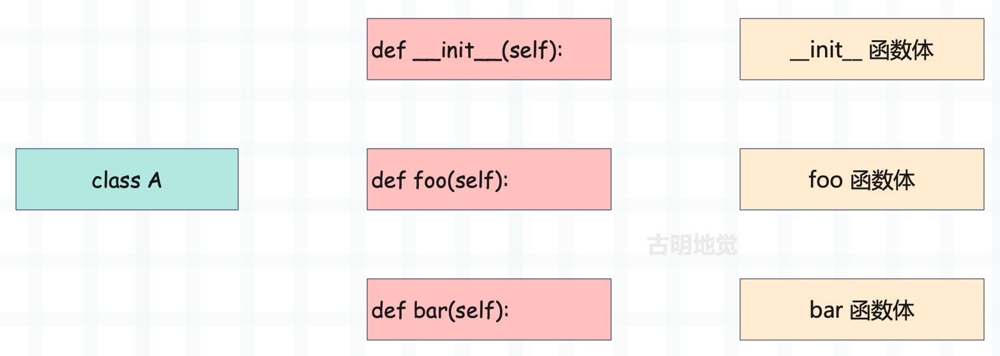
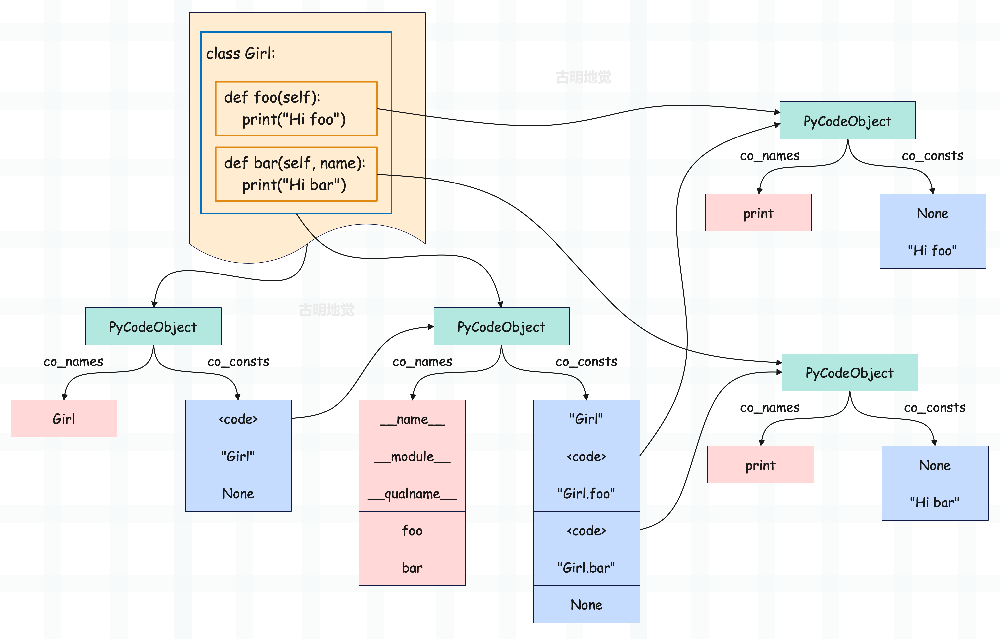
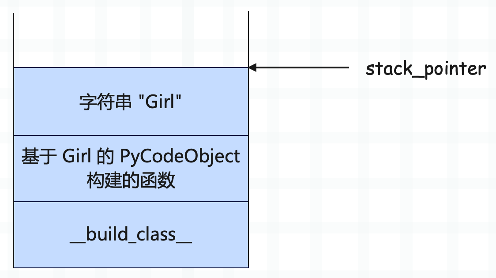
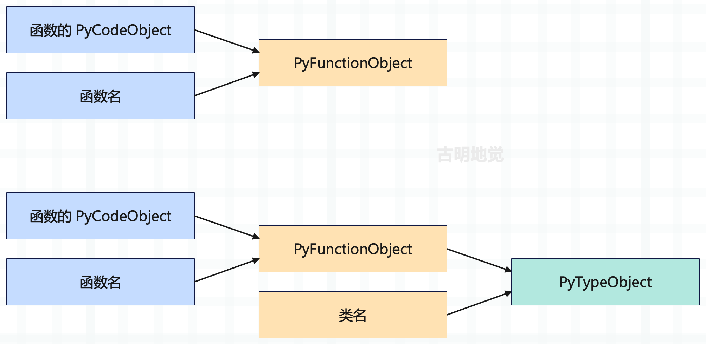
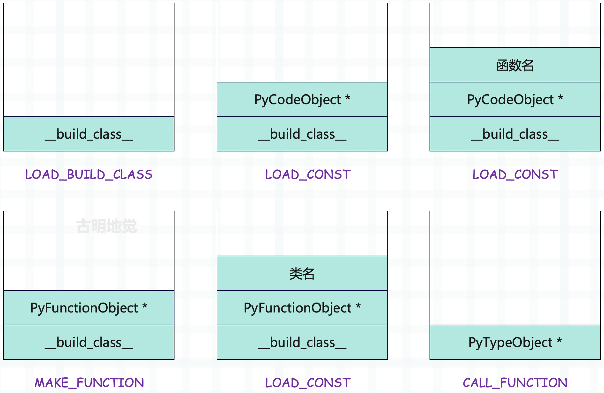
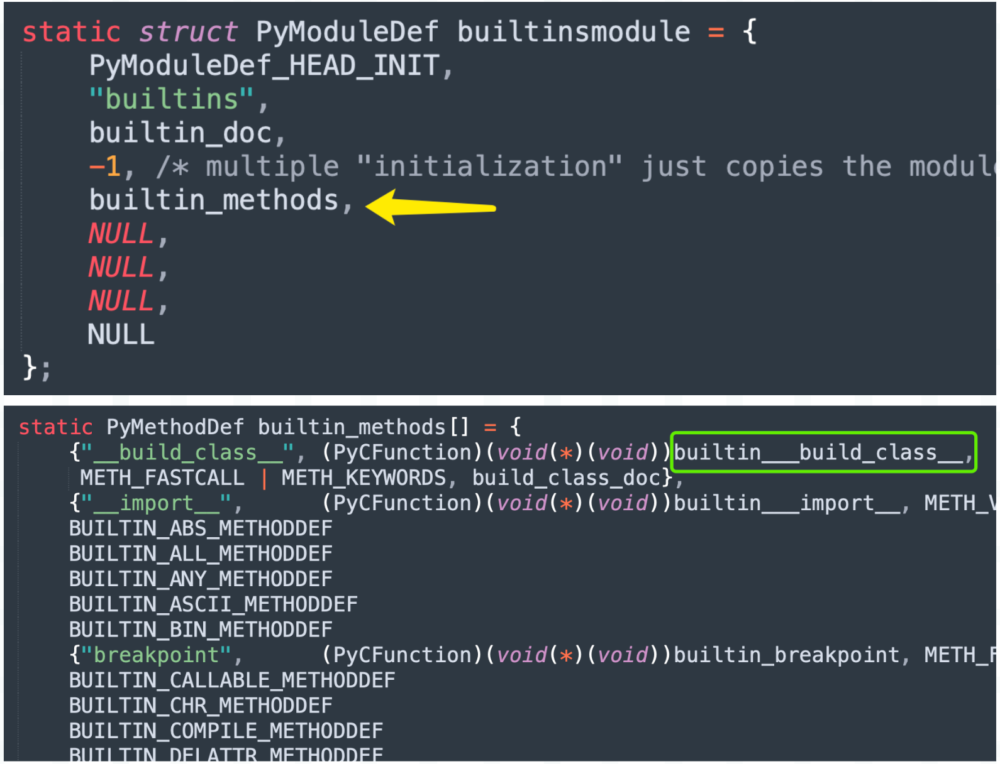
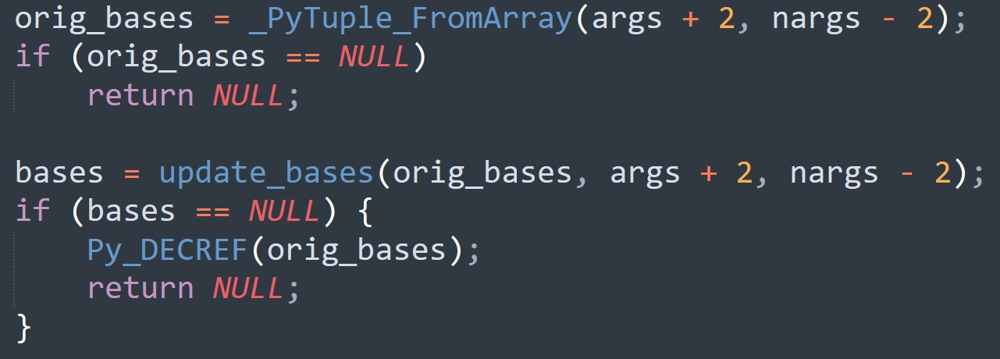

## 楔子

Python 除了提供很多内置的类之外，还支持我们定义属于自己的类，那么底层是如何做的呢？下面就来看看。

老规矩，如果想知道底层是怎么做的，那么就必须要通过观察字节码来实现。这里我们随便定义一个类，然后反编译一下：

~~~Python
class Girl:
    name = "古明地觉"

    def __init__(self):
        print(f"__init__: {self.name}")

    def foo(self):
        print("foo")

    def bar(self, name):
        self.name = name
        print(self.name)

girl = Girl()
girl.foo()
girl.bar("古明地恋")
"""
__init__: 古明地觉
foo
古明地恋
"""
~~~

通过之前对函数机制的分析，我们知道对于一个包含函数定义的 Python 源文件，在编译之后会得到一个和源文件对应的 PyCodeObject 对象，其内部的常量池中存储了和函数对应的 PyCodeObject 对象。那么对于包含类的 Python 源文件，编译之后的结果又是怎么样的呢？

显然可以照葫芦画瓢，根据以前的经验我们可以猜测模块对应的 PyCodeObject 对象的常量池中肯定存储了类对应的 PyCodeObject 对象，类对应的 PyCodeObject 对象的常量池中则存储了 \_\_init\_\_、foo、bar 三个函数对应的 PyCodeObject 对象。然而事实也确实如此。

在介绍函数的时候，我们看到函数的声明（def 语句）和函数的实现虽然在逻辑上是一个整体，但它们的字节码指令却是分离在两个 PyCodeObject 对象中的。

在类中，同样存在这样的分离现象。声明类的 class 语句，编译后的字节码指令存储在模块对应的 PyCodeObject 中；而类的实现、也就是类里面的逻辑，编译后的字节码指令则存储在类对应的 PyCodeObject 中。所以我们在模块级别中只能找到类，无法直接找到类里面的属性。

另外还可以看到，类的成员函数和一般的函数相同，也会有这种声明和实现分离的现象。正所谓函数即变量，类也是如此，def、class 本质上都是定义一个变量，该变量指向具体的 PyFunctionObject 或者 PyTypeObject。

~~~python
code_string = """
class Girl:
    name = "古明地觉"

    def __init__(self):
        print(f"__init__: {self.name}")

    def foo(self):
        print("foo")

    def bar(self, name):
        self.name = name
        print(self.name)
"""
# 模块对应的 PyCodeObject 对象
code = compile(code_string, "<file>", "exec")

# 常量池里面存储了 Girl 对应的 PyCodeObject 对象
print(code.co_consts[0])  # <code object Girl at 0x1029d80e0, ...>

# Girl 对应的 PyCodeObject 对象的常量池里面存储了几个函数对应的 PyCodeObject 对象
print(code.co_consts[0].co_consts[2])  # <code object __init__ at 0x102905580, ...>
print(code.co_consts[0].co_consts[4])  # <code object foo at 0x102906290, ...>
print(code.co_consts[0].co_consts[6])  # <code object bar at 0x1029d8030, ...>
~~~

相信这些内容已经没有什么难度了，总之函数、类在编译之后都会对应一个 PyCodeObject。由于函数、类可以嵌套，那么 PyCodeObject 也是可以嵌套的，并且也会作为一个常量被收集起来，存储在外层的 PyCodeObject 的常量池当中。

## 自定义类对象的动态元信息

自定义类对象的元信息指的就是关于这个类的信息描述，比如名称、所拥有的属性、方法，该类实例化时要为实例对象申请的内存空间大小等。有了这些元信息，才能创建自定义类对象，否则我们是没办法创建的。

注意：元信息是一个非常重要的概念，在很多框架中都会出现。比如说 Hive，数据的元信息就是存储在 MySQL 里面。而在编程语言中，也正是通过元信息才实现了反射等动态特性，尤其是 Python，将元信息的概念发挥地淋漓尽致，因此 Python 也提供了其它编程语言所不具备的高度灵活的动态特征。

我们将类简化一下，看看它的字节码长什么样子。

~~~Python
code_string = """
class Girl:

    def foo(self):
        print("Hi foo")

    def bar(self):
        print("Hi bar")
"""
code = compile(code_string, "<file>", "exec")

for const in code.co_consts:
    print(const)
"""
<code object Girl at 0x10643e290, ...>
Girl
None
"""
for const in code.co_consts[0].co_consts:
    print(const)
"""
Girl
<code object foo at 0x1033d23f0, ...>
Girl.foo
<code object bar at 0x1033d1580, ...>
Girl.bar
None
"""
~~~

观察一下类的常量池，第一个元素显然是类名，一个字符串；第二和第三个元素则是函数 foo 对应的 PyCodeObject 以及全限定名；第四和第五个元素则是函数 bar 对应的 PyCodeObject 以及全限定名；最后一个是 None，而 None 是一定会有的。

然后是字节码如下：

~~~C
  // 模块对应的字节码
  0 LOAD_BUILD_CLASS
  2 LOAD_CONST               0 (<code object Girl at 0x7f1...>)
  4 LOAD_CONST               1 ('Girl')
  6 MAKE_FUNCTION            0
  8 LOAD_CONST               1 ('Girl')
 10 CALL_FUNCTION            2
 12 STORE_NAME               0 (Girl)
 14 LOAD_CONST               2 (None)
 16 RETURN_VALUE

  // class Girl 对应的字节码
Disassembly of <code object Girl at 0x7f1...>:
  0 LOAD_NAME                0 (__name__)
  2 STORE_NAME               1 (__module__)
  4 LOAD_CONST               0 ('Girl')
  6 STORE_NAME               2 (__qualname__)

  8 LOAD_CONST               1 (<code object foo at 0x7f1...>)
 10 LOAD_CONST               2 ('Girl.foo')
 12 MAKE_FUNCTION            0
 14 STORE_NAME               3 (foo)

 16 LOAD_CONST               3 (<code object bar at 0x7f1...>)
 18 LOAD_CONST               4 ('Girl.bar')
 20 MAKE_FUNCTION            0
 22 STORE_NAME               4 (bar)
 24 LOAD_CONST               5 (None)
 26 RETURN_VALUE

  // Girl.foo 对应的字节码
Disassembly of <code object foo at 0x7f1...>:
  0 LOAD_GLOBAL              0 (print)
  2 LOAD_CONST               1 ('Hi foo')
  4 CALL_FUNCTION            1
  6 POP_TOP
  8 LOAD_CONST               0 (None)
 10 RETURN_VALUE
  
  // Girl.bar 对应的字节码
Disassembly of <code object bar at 0x7f1...>:
  0 LOAD_GLOBAL              0 (print)
  2 LOAD_CONST               1 ('Hi bar')
  4 CALL_FUNCTION            1
  6 POP_TOP
  8 LOAD_CONST               0 (None)
 10 RETURN_VALUE
~~~

结构很清晰，总共 4 个 PyCodeObject，分别对应模块、类 Girl、函数 Girl.foo、函数 Girl.bar。

下面我们来对字节码逐一分析，首先是模块的字节码：

~~~C
  // 一条新指令，会将内置函数 __build_class__ 压入栈中
  // 至于这个 __build_class__ 是干啥的，一会说
  0 LOAD_BUILD_CLASS
  // 加载 Girl 对应的 PyCodeObject 对象
  2 LOAD_CONST               0 (<code object Girl at 0x7f1...>)
  // 加载字符串 "Girl"
  4 LOAD_CONST               1 ('Girl')
  // 问题来了，我们看到是 MAKE_FUNCTION
  // 不是说要构建类吗？为什么是 MAKE_FUNCTION 呢？
  6 MAKE_FUNCTION            0
  // 再次加载字符串 "Girl"
  8 LOAD_CONST               1 ('Girl')
  // 以构建的 PyFunctionObject 和字符串 "Girl" 为参数
  // 调用 __build_class__，创建一个类
 10 CALL_FUNCTION            2
  // 将创建的类使用变量 Girl 进行保存
 12 STORE_NAME               0 (Girl)
  // 隐式地 return None
 14 LOAD_CONST               2 (None)
 16 RETURN_VALUE
~~~

关键指令是 LOAD_BUILD_CLASS，它的逻辑很简单，就是将内置函数 \_\_build_class\_\_ 压入运行时栈。紧接着通过两个 LOAD_CONST 将 Girl 对应的 PyCodeObject 对象和字符串 "Girl" 压入栈中，再用 MAKE_FUNCTION 将其弹出，构造一个 PyFunctionObject 并入栈。

所以此时栈里面还剩下两个元素，也就是刚入栈的函数和内置函数 \_\_build_class\_\_。而这个刚入栈的函数指针，就是基于 Girl 的 PyCodeObject 构建的。不过还是那个问题，Girl 明明是个类，为啥要 MAKE_FUNCTION 呢？接下来的两条指令会告诉你答案。

构建完函数之后又通过 LOAD_CONST 将字符串 "Girl" 压入栈中，显然它代表类名。而此时栈里面有三个元素：

然后接着执行 CALL_FUNCTION，指令参数是 2。不用想，肯定是以构建的函数和字符串"Girl" 为参数，调用 \_\_build_class\_\_。而 \_\_build_class\_\_ 会创建一个类并返回，然后压入运行时栈，最后再通过 STORE_NAME 将创建的类对象使用变量 Girl 保存。

所以类不是上来就构建的，根据 PyCodeObject 和名称构造出来的实际上是一个 PyFunctionObject，尽管使用的是类的 PyCodeObject。当 PyFunctionObject 构造完毕时，再在其之上构造 PyTypeObject，而这一步由 \_\_build_class\_\_ 负责。

所以，可以得出如下结论：

~~~Python
class A:
    pass

# 在底层将会被翻译成
A = __build_class__(<PyFunctionObject A>, "A")

# 如果是
class A(int):
    pass
  
# 在底层将会被翻译成
A = __build_class__(<PyFunctionObject A>, "A", int)
~~~

我们实际操作一下：

~~~python
MyInt = __build_class__(lambda: None, "MyInt", int)

print(MyInt)  # <class '__main__.MyInt'>
print(MyInt.__base__)  # <class 'int'>
print(MyInt(3) + 5)  # 8
~~~

有点意思。

如果参数类型不正确的话，会报出如下错误：

~~~python
try:
    __build_class__()
except TypeError as e:
    print(e)
"""
__build_class__: not enough arguments
"""

try:
    # 第一个参数 func 必须是函数
    __build_class__("", "")
except TypeError as e:
    print(e)    
"""
__build_class__: func must be a function
"""

try:
    # 第二个参数 name 必须是字符串
    __build_class__(lambda: None, 123)
except TypeError as e:
    print(e)

"""
__build_class__: name is not a string
"""
~~~

记住这几个报错信息，后面会看到。此外我们也能看出，\_\_build_class\_\_ 的第一个参数叫 func、第二个参数叫 name。总之 \_\_build_class\_\_ 的作用就是将一个函数对象变成一个类对象。

再来看看类对象的字节码：

~~~c
Disassembly of <code object Girl at 0x7f1...>:
  // 将 __name__、即模块的名字压入栈中
  0 LOAD_NAME                0 (__name__)
  // 使用类的 __module__ 进行保存
  // 所以通过类的 __module__，能找到该类属于哪一个模块
  2 STORE_NAME               1 (__module__)
  // 加载字符串 "Girl"
  4 LOAD_CONST               0 ('Girl')
  // 作为类的全限定名
  6 STORE_NAME               2 (__qualname__)
  
  // 加载 Girl.foo 函数的 PyCodeObject 和字符串 "Girl.foo"
  8 LOAD_CONST               1 (<code object foo at 0x7f1...>)
 10 LOAD_CONST               2 ('Girl.foo')
  // 构造函数
 12 MAKE_FUNCTION            0
  // 使用变量 foo 保存
 14 STORE_NAME               3 (foo)
  
  // 和上面构造 foo 类似
 16 LOAD_CONST               3 (<code object bar at 0x7f1...>)
 18 LOAD_CONST               4 ('Girl.bar')
 20 MAKE_FUNCTION            0
 22 STORE_NAME               4 (bar)
 24 LOAD_CONST               5 (None)
 26 RETURN_VALUE
~~~

我们在介绍函数的时候提过："函数的局部变量是不可变的，在编译的时候就已经确定了，以一种静态的方式存放在 f_localsplus 中。而 f_locals 初始为 NULL，函数里面的局部变量是通过静态的方式来访问的"。

但是类则不一样，类是可以动态修改的，可以随时增加属性、方法，这就意味着类是不可能通过静态方式来查找属性的。事实上也确实如此，类有一个属性字典，而对于类来说，变量是从属性字典中查找的。

~~~python
class Girl:

    def foo(self):
        print("Hi foo")

    def bar(self):
        print("Hi bar")

print(__name__)  # __main__
print(Girl.__module__)  # __main__
print(Girl.__qualname__)  # Girl
print(Girl.foo is Girl.__dict__["foo"])  # True
~~~

所以整体过程就是：先将 PyCodeObject 构建成函数，再通过 \_\_build_class\_\_ 将函数变成一个类，当 \_\_build_class\_\_ 结束之后我们的自定义类就破茧而出了。

因此剩下的问题就是 \_\_build_class\_\_ 是如何将一个函数变成类的，想要知道答案，那么只能去源码中一探究竟了。不过在看源码之前，我们还需要了解一样东西：metaclass。

## metaclass

元类，被誉为是深度的魔法，但是个人觉得有点夸张了。首先元类是做什么的，它是用来控制我们自定义类的生成过程的，默认情况下，自定义的类都是由 type 创建的。但是我们可以手动指定某个类的元类，不过在介绍元类之前，我们还需要看一下 Python 的两个特殊的魔法方法：\_\_new\_\_ 和 \_\_init\_\_。

### \_\_new\_\_ 和 \_\_init\_\_

类在实例化的时候会自动调用 \_\_init\_\_，但其实在调用 \_\_init\_\_ 之前会先调用 \_\_new\_\_。

+ \_\_new\_\_：为实例对象申请一片内存；
+ \_\_init\_\_：为实例对象设置属性；

~~~Python
class A:

    def __new__(cls, *args, **kwargs):
        print("__new__")

    def __init__(self):
        print("__init__")

A()
"""
__new__
"""
~~~

然而我们看到只有 \_\_new\_\_ 被调用了，\_\_init\_\_ 则没有。原因就在于 \_\_new\_\_ 里面必须将 A 的实例对象返回，才会执行 \_\_init\_\_，并且执行的时候会自动将 \_\_new\_\_ 的返回值作为参数传给 \_\_init\_\_ 当中的 self。

~~~Python
class A:

    def __new__(cls, *args, **kwargs):
        print("__new__")
        # 这里的参数 cls 就表示 A 这个类本身
        # object.__new__(cls) 便是根据 cls 创建 cls 的实例对象
        return object.__new__(cls)

    def __init__(self):
        # 然后执行 __init__，里面的 self 指的就是实例对象
        # 执行 __init__ 时，__new__ 的返回值会自动作为参数传递给 self
        print("__init__")

A()
"""
__new__
__init__
"""
~~~

所以一个对象是什么，取决于其类型对象的 \_\_new\_\_ 返回了什么。

~~~Python
class A:

    def __new__(cls, *args, **kwargs):
        print("__new__")
        # 这里必须返回 A 的实例对象，否则 __init__ 函数是不会执行的
        return 123

    def __init__(self):
        print("__init__")

a = A()
print(a + 1)
"""
__new__
124
"""
~~~

我们看到 A 在实例化之后得到的是一个整数，原因就是 \_\_new\_\_ 返回了 123。

### 创建类的另一种方式

创建类的时候除了通过 class 关键字之外，我们还可以使用 type 这个古老却又强大的类来创建。

~~~python
# type 这个类里面可以接收一个参数或者三个参数
# 如果接收一个参数，那么表示查看类型
# 如果接收三个参数，那么表示创建一个类
try:
    A = type("A", "")
except Exception as e:
    print(e)  # type() takes 1 or 3 arguments
~~~

查看类型就不说了，下面看看如何用 type 创建一个类：

~~~Python
# type 接收三个参数：类名、继承的基类、属性
class A(list):
    name = "古明地觉"

# 上面这个类翻译过来就是
A = type("A", (list,), {"name": "古明地觉"})
print(A)  # <class '__main__.A'>
print(A.__name__)  # A
print(A.__base__)  # <class 'list'>
print(A.name)  # 古明地觉
~~~

所以还是很简单的，我们还可以自定义一个类继承 type。

~~~Python
class MyType(type):
    def __new__(mcs, name, bases, attr):
        print(name)
        print(bases)
        print(attr)

# 指定 metaclass，表示 A 这个类由 MyType 创建
# 我们说 __new__ 是为实例对象开辟内存的
# 那么 MyType 的实例对象是谁呢？显然就是这里的 A
# 因为 A 指定了 metaclass 为 MyType，所以 A 的类型就是 MyType
class A(int, object, metaclass=MyType):
    name = "古明地觉"
"""
A
(<class 'int'>, <class 'object'>)
{'__module__': '__main__', '__qualname__': 'A', 'name': '古明地觉'}
"""
# 我们看到一个类在创建的时候会向元类的 __new__ 中传递三个值
# 分别是类名、继承的基类、类的属性
# 但此时 A 并没有被创建出来
print(A)  # None
~~~

我们说 \_\_new\_\_ 一定要将创建的实例对象返回才可以，这里的 MyType 是元类，所以类对象 A 就是 MyType 的实例对象，MyType 的 \_\_new\_\_ 就负责为类对象 A 分配空间。但是显然这里并没有分配，而且返回的还是一个 None，如果我们返回的是 123，那么 print(A) 就是 123。

~~~python
class MyType(type):
    def __new__(mcs, name, bases, attr):
        return []

class A(metaclass=MyType):
    pass

# A 是由 MyType 生成的，MyType 返回的是 []
# 因此 A 就是 []
print(A)  # []
~~~

所以元类和类的关系与类和实例对象的关系，之间是很相似的，因为完全可以把类对象看成是元类的实例对象。因此 A 既然指定了 metaclass 为 MyType，就表示 A 这个类由 MyType 创建，那么 MyType 的 \_\_new\_\_ 函数返回了什么，A 就是什么。

~~~Python
class MyType(type):

    def __new__(mcs, name, bases, attr):
        return "嘿嘿嘿"

class A(metaclass=MyType):
    pass

print(A + "哟哟哟")  # 嘿嘿嘿哟哟哟
~~~

这便是 Python 语言具备的高度动态特性，那么问题来了，如果我想把 A 创建出来、像普通的类一样使用的话，该咋办呢？因为默认情况下类由 type 创建，底层帮你做好了，但现在则需要我们来手动指定。

显然，这里创建还是要依赖于 type，只不过需要我们手动指定，而且在手动指定的同时还可以增加一些我们自己的操作。

~~~python
class MyType(type):

    def __new__(mcs, name, bases, attr):
        name = name * 2
        bases = (list,)
        attr.update({"name": "古明地觉", "nickname": "小五萝莉"})

        # 这里直接交给 type 即可，然后 type 来负责创建
        # 所以 super().__new__ 实际上会调用 type.__new__
        return super().__new__(mcs, name, bases, attr)
        # 但是我们将第一个参数换成了 mcs，就是这里的 MyType
        # 等价于 type.__new__(mcs, name, bases, attr)，表示将元类指定为 MyType
        # 注意：不能写 type(name, bases, attr)，因为这样的话类还是由 type 创建的
        # type(name, bases, attr) 等价于 type.__new__(type, name, bases, attr)

class Girl(metaclass=MyType):
    pass

# 我们看到类的名字变了，默认情况下是 "Girl"
# 但创建的时候将 name 乘了个 2
print(Girl.__name__)  # GirlGirl

# 显然 Girl 也继承 list
print(Girl("你好呀"))  # ['你', '好', '呀']

# 同理 Girl 还有两个属性
print(Girl.name, Girl.nickname)  # 古明地觉 小五萝莉
~~~

记得前面说过，一个类在没有指定 metaclass 的时候，如果它的父类指定了，那么这个类的 metaclass 等于父类的 metaclass。

~~~python
class MyType(type):

    def __new__(mcs, name, bases, attr):
        name = name * 2
        bases = (list,)
        attr.update({"name": "古明地觉", "nickname": "小五萝莉"})
        return super().__new__(mcs, name, bases, attr)

class Girl(metaclass=MyType):
    pass

class A(Girl):
    pass
 
print(A.__class__)  # <class '__main__.MyType'>
print(A.__name__)  # AA
~~~

并且当时还举了个 flask 的例子，提到了一种更加优雅的写法。

~~~Python
class MyType(type):

    def __new__(mcs, name, bases, attr):
        return super().__new__(mcs, name, bases, attr)

def with_metaclass(meta, bases):
    return meta("tmp", bases, {"gender": "female"})

# with_metaclass(MyType, (list,)) 会返回一个类
# 这个类由 MyType 创建，并且继承自 list
# 那么 Girl 再继承这个类，等价于 Girl 也由 MyType 创建
class Girl(with_metaclass(MyType, (list,))):
    pass

print(Girl.__class__)  # <class '__main__.MyType'>
# 所以 with_metaclass(meta, bases) 本身没有太大意义，只是为了帮助我们找到元类和继承的类
# 但毕竟继承它了，就意味着也可以找到它的属性
print(Girl.gender)  # female
~~~

注意：我们说负责创建类对象的是元类，而元类要么是 type、要么是继承自 type 的子类。

~~~Python
class MyType(type):

    def __new__(mcs, name, bases, attr):
        return super().__new__(mcs, name, bases, attr)

# type 直接加括号表示由 type 创建，所以需要通过 __new__ 手动指定
# 并且将 __new__ 的第一个参数换成 MyType
Girl = type.__new__(MyType,
                    "GirlGirlGirl",
                    (list,),
                    {"add": lambda self, value: value + 123})

print(Girl.__name__)  # GirlGirlGirl

g = Girl()
print(g.add(123))  # 246

try:
    type.__new__(int, "A", (object,), {})
except TypeError as e:
    # 指定为 int 则报错，告诉我们 int 不是 type 的子类
    # 因为只有两种情况：要么是 type、要么是 type 的子类
    print(e)  # type.__new__(int): int is not a subtype of type
~~~

怎么样，是不是觉得元类很简单呢？其实元类没有什么复杂的，只需要把元类和类对象之间的关系，想象成类对象和实例对象即可。类对象的 \_\_new\_\_ 里面返回了啥，实例就是啥。那么同理，元类的 \_\_new\_\_ 里面返回了啥，类对象就是啥。

为了更好地理解这一点，我们再举个栗子：

~~~Python
class MyType(type):
    def __new__(mcs, name, bases, attr):
        if "foo" in attr:
            attr.pop("foo")
        return super().__new__(mcs, name, bases, attr)

class Girl(metaclass=MyType):

    def foo(self):
        return "foo"

    def bar(self):
        return "bar"

print(Girl().bar())  # bar

try:
    print(Girl().foo())
except AttributeError as e:
    print(e)  # 'Girl' object has no attribute 'foo'
~~~

惊了，我们看到居然没有 foo 这个属性，我们明显定义了啊，显然原因就是我们在创建类的时候将其 pop 掉了。首先创建一个类需要三个元素：类名、继承的基类、类的一些属性（以字典的形式），然后会将这三个元素交给元类进行创建。但是我们在创建的时候偷偷地将 foo 从 attr 里面给 pop 掉了，因此创建出来的类是没有 foo 这个成员函数的。

元类确实蛮有趣的，而且也没有想象中的那么难，可以多了解一下。基于元类，我们可以实现很多高级操作，可以让代码逻辑变得更加优雅。

### 特殊的魔法函数

此外我们再来看两个和元类有关的魔法函数，分别是 \_\_prepared\_\_ 和 \_\_init_sublcass\_\_，先来看第一个。

~~~Python
class MyType(type):

    @classmethod
    def __prepare__(mcs, name, bases):
        print("__prepared__")
        # 必须返回一个 mapping，至于它是干什么的我们后面说
        return {}

    def __new__(mcs, name, bases, attr):
        print("__new__")
        return super().__new__(mcs, name, bases, attr)

class Girl(metaclass=MyType):
    pass

"""
__prepared__
__new__
"""
~~~

我们看到 \_\_prepare\_\_ 会在 \_\_new\_\_ 之前被调用，那么它是做什么的呢？答案是添加属性，我们解释一下。

~~~Python
class MyType(type):

    @classmethod
    def __prepare__(mcs, name, bases):
        return {"name": "古明地觉"}

    def __new__(mcs, name, bases, attr):
        return super().__new__(mcs, name, bases, attr)

class Girl(metaclass=MyType):
    pass

print(Girl.name)  # 古明地觉
~~~

现在应该知道 \_\_prepare\_\_ 是干什么的了，它接收一个 name、一个 bases，返回一个 mapping。我们知道 name、bases、attr 会传递给 \_\_new\_\_，但是在 \_\_new\_\_ 之前会先经过 \_\_prepared\_\_。而 \_\_prepared\_\_ 会返回一个映射，假设叫 m，那么会将 attr 和 m 合并，相当于执行了 attr.update(m)，然后再将 name、bases、attr 交给 \_\_new\_\_。

此外 \_\_prepared\_\_ 这个方法是被 @classmethod 装饰的，并且里面一定要返回一个 mapping，否则报错：TypeError: MyType.\_\_prepared\_\_() must return a mapping, not xxx。

说完了 \_\_prepare\_\_ 之后，再来看看 \_\_init_sublcass\_\_，它类似于一个钩子函数，在一些简单的场景下可以代替元类。

~~~Python
class Base:

    def __init_subclass__(cls, **kwargs):
        print(cls)
        print(kwargs)

# 当类被创建的时候，会触发其父类的__init_subclass__
class A(Base):
    pass
"""
<class '__main__.A'> 
{}
"""

class B(Base, name="古明地觉", age=16):
    pass

"""
<class '__main__.B'> 
{'name': '古明地觉', 'age': 16}
"""
~~~

所以父类的 \_\_init_sublcass\_\_ 里面的 cls 并不是父类本身，而是继承它的类。kwargs 就是额外设置的一些属性，因此我们可以实现一个属性添加器。

~~~Python
class Base:

    def __init_subclass__(cls, **kwargs):
        for k, v in kwargs.items():
            setattr(cls, k, v)

class A(Base, name="古明地觉", age=16,
        __str__=lambda self: "hello world"):
    pass

print(A.name, A.age)  # 古明地觉 16
print(A())  # hello world
~~~

当然除了属性添加器，我们还可以实现一个属性拦截器。

~~~Python
class Base:

    def __init_subclass__(cls, **kwargs):
        if hasattr(cls, "shit") and hasattr(cls.shit, "__code__"):
            raise Exception(f"{cls.__name__} 不允许定义 'shit' 函数")

class A(Base):
    def shit(self):
        pass
"""
Traceback (most recent call last):
  File "...", line 9, in <module>
    class A(Base):
  File "...", line 5, in __init_subclass__
    raise Exception(f"{cls.__name__} 不允许定义 'shit' 函数")
Exception: A 不允许定义 'shit' 函数
"""
~~~

以上就是元类相关的知识，记得在前面的文章中已经说过了，这里再啰嗦一遍，这样一会儿看源码的时候会轻松一些。

## 源码解密类的创建过程

回顾一下类是怎么创建的，首先会通过指令 LOAD_BUILD_CLASS 将内置函数 \_\_build_class\_\_ 压入运行时栈，然后将类对应的 PyCodeObject 包装成一个 PyFunctionObject，最后再调用 \_\_build_class\_\_ 将 PyFunctionObject 变成 PyTypeObject，也就是我们使用的类对象。

~~~python
class A: pass
class B: pass
class C: pass
class D: pass
class E: pass
class F: pass

MyClass = __build_class__(lambda: None, "MyClass", A, B, C, D, E, F)
print(MyClass)  # <class '__main__.MyClass'>

for cls in MyClass.__mro__:
    print(cls)
    """
    <class '__main__.MyClass'>
    <class '__main__.A'>
    <class '__main__.B'>
    <class '__main__.C'>
    <class '__main__.D'>
    <class '__main__.E'>
    <class '__main__.F'>
    <class 'object'>
    """
~~~

我们以运行时栈的变化，来描述一下上述过程：

那么接下来的重点就是 \_\_build_class\_\_，它是如何将一个函数变成类的，我们来看一下。内置函数的相关实现，位于 Python/bitinmodule.c 中。

builtins 是一个模块，\_\_build_class\_\_ 是该模块里的一个函数，所以它位于 PyModuleDef 的 m_methods 字段中。关于模块的相关细节后续聊，总之我们看到 \_\_build_class\_\_ 在底层对应 builtin\_\_build_class\_\_。

~~~C
static PyObject *
builtin___build_class__(PyObject *self, PyObject *const *args, Py_ssize_t nargs,
                        PyObject *kwnames)
{
    PyObject *func, *name, *bases, *mkw, *meta, *winner, *prep, *ns, *orig_bases;
    PyObject *cls = NULL, *cell = NULL;
    int isclass = 0;   /* initialize to prevent gcc warning */
    // class A: 会被翻译成 builtin.__build_class__(PyFunctionObject, "A")
    // 所以这个函数至少需要两个参数
    if (nargs < 2) {
        // 参数不足，报错，还记得这个报错信息吗？之前测试过的
        PyErr_SetString(PyExc_TypeError,
                        "__build_class__: not enough arguments");
        return NULL;
    }
    // 类对应的 PyFunctionObject
    func = args[0];   /* Better be callable */
    if (!PyFunction_Check(func)) {
        // 如果不是 PyFunctionObject，报错
        PyErr_SetString(PyExc_TypeError,
                        "__build_class__: func must be a function");
        return NULL;
    }
    // 类对应的名字，__build_class__ 的时候，类肯定要有名字
    name = args[1];
    if (!PyUnicode_Check(name)) {
        // 必须是一个 PyUnicodeObject，否则报错
        PyErr_SetString(PyExc_TypeError,
                        "__build_class__: name is not a string");
        return NULL;
    }
    // args[0]表示 PyFunctionObject *，args[1] 表示 class name
    // 从 args + 2 开始是继承的基类，至于个数显然是 nargs - 2，所以这里是拿到所有的基类
    orig_bases = _PyTuple_FromArray(args + 2, nargs - 2);
    if (orig_bases == NULL)
        return NULL;
    // 这个 update_bases 比较有趣，我们一会儿单独说
    bases = update_bases(orig_bases, args + 2, nargs - 2);
    if (bases == NULL) {
        Py_DECREF(orig_bases);
        return NULL;
    }
    // 获取 metaclass
    if (kwnames == NULL) {
        meta = NULL;
        mkw = NULL;
    }
    else {
        mkw = _PyStack_AsDict(args + nargs, kwnames);
        if (mkw == NULL) {
            Py_DECREF(bases);
            return NULL;
        }

        meta = _PyDict_GetItemIdWithError(mkw, &PyId_metaclass);
        if (meta != NULL) {
            Py_INCREF(meta);
            if (_PyDict_DelItemId(mkw, &PyId_metaclass) < 0) {
                Py_DECREF(meta);
                Py_DECREF(mkw);
                Py_DECREF(bases);
                return NULL;
            }
            /* metaclass is explicitly given, check if it's indeed a class */
            isclass = PyType_Check(meta);
        }
        else if (PyErr_Occurred()) {
            Py_DECREF(mkw);
            Py_DECREF(bases);
            return NULL;
        }
    }
    // 如果 meta 为 NULL，这意味着没有指定 metaclass
    if (meta == NULL) {
        // 然后尝试获取基类，如果没有基类，那么元类就是 &PyType_Type
        if (PyTuple_GET_SIZE(bases) == 0) {
            meta = (PyObject *) (&PyType_Type);
        }
        // 否则获取第一个继承的基类的 metaclass
        else {
            // 拿到第一个基类
            PyObject *base0 = PyTuple_GET_ITEM(bases, 0);
            // 拿到第一个基类的 __class__
            meta = (PyObject *) (base0->ob_type);
        }
        // meta 也是一个类
        Py_INCREF(meta);
        isclass = 1;
    }
  
    // 如果设置了元类，那么 isclass 为 1，if 为真
    if (isclass) {
        // 选择出了元类，下面这一步就要解决元类冲突
        // 假设有两个继承 type 的元类 MyType1 和 MyType2
        // 然后 Base1 的元类是 MyType1，而 Base2 的元类是 MyType2
        // 那么如果 class A(Base1, Base2) 的话，就会报错
        // 因为在 Python 中有一个要求，假设 class A(Base1, Base2, ..., BaseN)
        // Base1 的元类叫 MyType1、...、BaseN 的元类叫 MyTypeN
        // 那么必须满足：
        /*
        MyType1 是 MyType2 的子类或者父类;
        MyType1 是 MyType3 的子类或者父类;
        MyType1 是 MyType4 的子类或者父类;
        ....
        MyType1 是 MyTypeN 的子类或者父类;
        */
        // 而之所以存在这一限制，原因是为了避免属性冲突
        winner = (PyObject *)_PyType_CalculateMetaclass((PyTypeObject *)meta,
                                                        bases);
        if (winner == NULL) {
            Py_DECREF(meta);
            Py_XDECREF(mkw);
            Py_DECREF(bases);
            return NULL;
        }
        if (winner != meta) {
            Py_DECREF(meta);
            meta = winner;
            Py_INCREF(meta);
        }
    }
    // 寻找 __prepare__
    if (_PyObject_LookupAttrId(meta, &PyId___prepare__, &prep) < 0) {
        ns = NULL;
    }
    // 如果 __prepare__ 为 NULL，那么等价于返回一个空字典
    else if (prep == NULL) {
        ns = PyDict_New();
    }
    else {
        // 否则调用 __prepare__，将字典返回
        PyObject *pargs[2] = {name, bases};
        ns = _PyObject_FastCallDict(prep, pargs, 2, mkw);
        Py_DECREF(prep);
    }
    if (ns == NULL) {
        Py_DECREF(meta);
        Py_XDECREF(mkw);
        Py_DECREF(bases);
        return NULL;
    }
    // 如果 __prepare__ 返回的不是一个字典，那么报错，这个错误信息我们也见过了
    if (!PyMapping_Check(ns)) {
        PyErr_Format(PyExc_TypeError,
                     "%.200s.__prepare__() must return a mapping, not %.200s",
                     isclass ? ((PyTypeObject *)meta)->tp_name : "<metaclass>",
                     Py_TYPE(ns)->tp_name);
        goto error;
    }
    // ...
    return cls;
}
~~~

可以看到，一个简单的类定义，虚拟机究竟做了多少事情啊，不过显然这还没完。自定义类对象的元信息分为两部分，分别是动态元信息和静态元信息。虚拟机在获得了属性表（动态元信息）之后，就知道了所有的属性。

但对于自定义类对象的类型是什么，应该如何创建、要分配多少内存，却没有任何的头绪，因为这部分隐藏在 metaclass 里面。

而在 builtin_\_\_build_class\_\_中，metaclass 正是关于自定义类对象的另一部分元信息，我们称之为静态元信息。在静态元信息中，隐藏着所有的类对象应该如何创建的信息，注意：是所有的类对象。从源码中我们可以看到，如果指定了 metaclass，那么会选择指定的 metaclass；如果没有指定，那么会使用第一个继承的基类的 metaclass 作为该 class 的 metaclass。

对于实例对象，所有的元信息都存储在对应的类对象中。但是对于类对象来说，其元信息的静态元信息存储在对应的元类中，动态元信息则存储在本身的 local 名字空间中。

可为什么这么做呢？为什么对于类对象来说，其元信息要游离成两部分呢？都存在 metaclass 里面不香吗？这是因为用户在 .py 文件中可以定义不同的 class，这个元信息必须、且只能是动态的，所以它不适合保存在 metaclass 中。而存储在 metaclass 里面的，一定是诸如类对象的创建策略等所有 class 都会共用的元信息。

注意：我们说元信息游离成两部分指的是自定义类对象，内置类对象的元信息都存储在 metaclass 中。

因为内置类对象是静态提供的，它们都具备相同的接口集合（底层都是 PyTypeObject 结构体实例），支持什么操作一开始就定义好了。只不过有的可以用，有的不能用。比如 PyLongObject 可以使用 nb_add，但是 PyDictObject 不能，而 PyDictObject 可以使用 mp_subscript，但是 PyLongObject 不可以。

尽管如此，但这不影响它们的所有元信息都存储在元类中。而用户自定义的类对象，接口是动态的，不可能在 metaclass 中静态指定。

### update_bases

然后再来说一说源码中的 update_bases，它比较有意思。

~~~Python
class Foo:
    name = "古明地觉"

class Bar:
    def __mro_entries__(self, bases):
        return Foo, tuple

class MyClass(Bar()):
    pass

print(MyClass("123"))  # ('1', '2', '3')
print(MyClass.name)  # 古明地觉
~~~

我们在继承的时候，都是继承一个类，但是这里的 MyClass 居然继承了一个实例对象。相信结果你已经猜出来了，如果继承的是实例，那么会去调用实例的 `__mro_entries__`。因此 MyClass 继承的其实是 Foo、tuple，并且 `__mro_entries__` 必须返回一个元组，否则报错。

另外，如果一个类继承了一个拥有 `__mro_entries__` 的实例，那么该类会多出一个属性叫 `__orig_bases__`。我们回顾一下 builtin_\_\_build_class\_\_ 里面的几行关键代码：

里面有两个变量 orig_bases 和 bases，我们知道 Python 的类都有 \_\_bases\_\_ 属性，对应这里的 bases；但鲜为人知的是，它还有一个属性叫 \_\_orig_bases\_\_，对应这里的 orig_bases。

~~~Python
class Foo:
    name = "古明地觉"

class Bar:

    def __mro_entries__(self, bases):
        return Foo, tuple

class MyClass(Bar()):
    pass

print(MyClass.__orig_bases__)
print(MyClass.__bases__)
"""
(<__main__.Bar object at 0x0000014FCC387E80>,)
(<class '__main__.Foo'>, <class 'tuple'>)
"""
~~~

\_\_orig_bases\_\_ 和 \_\_bases\_\_ 的区别显而易见，\_\_orig_bases\_\_ 在经过 update_bases 函数处理之后，得到的就是 \_\_bases\_\_。

\_\_orig_bases\_\_ 表示继承的对象，该对象可以是一个类对象，也可以是一个实例对象；如果是实例对象，那么在 update_bases 函数中，会调用它的 `__mro_entries__` 方法，该方法返回一个包含类对象的元组，然后设置到 \_\_bases\_\_ 中。

以上就是函数 update_bases 的作用，但有两点需要注意。

- 1）只有继承了拥有 `__mro_entries__` 方法的实例的类，才有 \_\_orig_bases\_\_ 属性；
- 2）这样的类，在 Python 里面不能手动调用 type 来创建；

我们来解释一下，首先是第一点：

~~~python
print(hasattr(MyClass, "__orig_bases__"))
print(hasattr(Foo, "__orig_bases__"))
print(hasattr(Bar, "__orig_bases__"))
"""
True
False
False
"""
~~~

我们看到只有 MyClass 有 \_\_orig_bases\_\_ 属性，因为它继承了拥有 `__mro_entries__` 方法的实例，而 Foo 和 Bar 则没有。

然后是第二点，这样的类不可以手动调用 type 来创建。

~~~Python
class Foo:
    name = "古明地觉"

class Bar:
    def __mro_entries__(self, bases):
        return Foo, tuple

try:
    MyClass = type("MyClass", (Bar(),), {})
except TypeError as e:
    print(e)  # type() doesn't support MRO entry resolution; use types.new_class()

# 所以这样的类应该通过 class 关键字创建
# 如果必须手动创建的话，那么可以使用 types.new_class
import types
MyClass = types.new_class("MyClass", (Bar(),), {})
print(MyClass.name)  # 古明地觉
print(MyClass("123"))  # ('1', '2', '3')
~~~

以上就是 update_bases 函数所干的事情，但是问题来了，如果继承的实例对象没有 `__mro_entries__` 方法怎么办？

~~~Python
class Base:

    def __init__(self, *args):
        if len(args) == 0:
            return
        elif len(args) == 3:
            name, bases, attrs = args
        else:
            raise ValueError("args 的长度必须是 0 或 3")
        self.name = name
        self.bases = bases
        self.attrs = attrs

base = Base()

class MyClass(base):
    pass

print(type(MyClass) is Base)  # True
print(MyClass.name)  # MyClass
print(MyClass.bases == (base,))  # True
print(MyClass.attrs)  # {'__module__': '__main__', '__qualname__': 'MyClass'}
~~~

显然 MyClass 继承的是 Base 的实例对象，并且 Base 里面也没有定义 `__mro_entries__`，那么虚拟机就不会再使用 type 来创建 MyClass 了。而是会使用 Base 来创建，所以得到的 MyClass 就是一个 Base 的实例对象。

现在算是彻底理解 update_bases 的作用了，因为不能保证继承的都是类，所以还需要进行检测，如果不是类，那么就执行上面的逻辑。但是说实话，这个特性几乎不用，因为既然要继承，那么就应该继承类。虽然通过 `__mro_entries__` 可以整一些花活，甚至也能简化逻辑，但最好还是不要用，因为它会让代码变得难以理解。

### type_call

builtin_\_\_build_class\_\_ 的逻辑我们上面省略了一部分，至于省略部分的逻辑也很简单，既然元类以及相关参数都准备好了，那么接下来就是对类进行创建了。

我们知道调用一个对象，本质上会执行其类对象的 \_\_call\_\_。所以调用类对象创建实例对象，会执行 type.\_\_call\_\_(cls, ...)。调用元类创建类对象，会执行 type.\_\_call\_\_(type, ...)，因为元类的类对象还是它本身。所以不管调用的是元类、还是类对象，都会执行元类的 \_\_call\_\_，在底层对应 &PyType_Type 的 tp_call 字段，它指向了 type_call 函数。

~~~C
// Objects/typeobject.c
static PyObject *
type_call(PyTypeObject *type, PyObject *args, PyObject *kwds)
{
    PyObject *obj;
    // tp_new 负责创建实例，所以它不能为空
    if (type->tp_new == NULL) {
        PyErr_Format(PyExc_TypeError,
                     "cannot create '%.100s' instances",
                     type->tp_name);
        return NULL;
    }
    // 调用 tp_new 为实例对象申请内存
    obj = type->tp_new(type, args, kwds);
    // 确保返回值符合 Python 的调用约定
    obj = _Py_CheckFunctionResult((PyObject*)type, obj, NULL);
    if (obj == NULL)
        return NULL;
    // 如果调用的是 &PyType_Type，并且只接收了一个位置参数
    // 那么显然是查看对象类型，执行完 __new__ 之后直接返回
    if (type == &PyType_Type &&
        PyTuple_Check(args) && PyTuple_GET_SIZE(args) == 1 &&
        (kwds == NULL ||
         (PyDict_Check(kwds) && PyDict_GET_SIZE(kwds) == 0)))
        return obj;

    // 记得我们之前说过，__new__ 里面一定要返回类的实例对象
    // 否则是不会执行 __init__ 函数的，从这里我们也看到了
    // 如果 obj 的类型不是对应的类、或者其子类，那么直接返回
    if (!PyType_IsSubtype(Py_TYPE(obj), type))
        return obj;
    //然后获取 obj 的类型
    type = Py_TYPE(obj);
    // 如果内部存在 __init__ 函数，那么执行
    if (type->tp_init != NULL) {
        int res = type->tp_init(obj, args, kwds);
        if (res < 0) {
            assert(PyErr_Occurred());
            Py_DECREF(obj);
            obj = NULL;
        }
        else {
            assert(!PyErr_Occurred());
        }
    }
    // 执行完构造函数之后，再将对象返回
    // 返回的 obj 可以是类对象、也可以是实例对象
    return obj;
}
~~~

type_call 里面的逻辑非常简单，就是先调用对象的 tp_new 创建实例，然后执行 tp_init（如果有）。至于返回的是类对象还是实例对象，则取决于 type_call 的第一个参数，如果第一个参数是元类，那么返回的就是类对象，否则是实例对象。因此创建的核心逻辑就隐藏在对象的 tp_new 中，不同对象的 tp_new 指向的函数不同。但对于创建类对象而言，显然执行的是 &PyType_Type 的 tp_new，它指向的是 type_new 函数。

这个 type_new 就是我们创建自定义类对象的第一案发现场，源码位于 typeobject.c 中。这个函数的代码比较长，我们会有删减，像那些检测的代码就省略掉了。

~~~C
static PyObject *
type_new(PyTypeObject *metatype, PyObject *args, PyObject *kwds)
{
    // 都是类的一些动态元信息
    PyObject *name, *bases = NULL, *orig_dict, *dict = NULL;
    PyObject *qualname, *slots = NULL, *tmp, *newslots, *cell;
    PyTypeObject *type = NULL, *base, *tmptype, *winner;
    PyHeapTypeObject *et;
    PyMemberDef *mp;
    Py_ssize_t i, nbases, nslots, slotoffset, name_size;
    int j, may_add_dict, may_add_weak, add_dict, add_weak;
    _Py_IDENTIFIER(__qualname__);
    _Py_IDENTIFIER(__slots__);
    _Py_IDENTIFIER(__classcell__);

    //如果 metatype 是 <class 'type'> 的话
    if (metatype == &PyType_Type) {
        // 获取位置参数和关键字参数个数
        const Py_ssize_t nargs = PyTuple_GET_SIZE(args);
        const Py_ssize_t nkwds = kwds == NULL ? 0 : PyDict_GET_SIZE(kwds);
        // 位置参数的个数为 1，关键字参数的个数为 0，你想到了什么？是不是 type(xxx) 呢
        if (nargs == 1 && nkwds == 0) {
            PyObject *x = PyTuple_GET_ITEM(args, 0);
            Py_INCREF(Py_TYPE(x));
            // 这显然是初学 Python 时就知道的，查看一个变量指向的对象的类型
            return (PyObject *) Py_TYPE(x);
        }

        // 如果上面的 if 不满足，会走这里，表示现在不再是查看类型了，而是创建类
        // 那么要求位置参数必须是 3 个，否则报错
        if (nargs != 3) {
            PyErr_SetString(PyExc_TypeError,
                            "type() takes 1 or 3 arguments");
            return NULL;
        }
    }

    // 确定参数类型，因为传递的三个参数是有类型要求的
    // 必须是 PyUnicodeObject、PyTupleObject、PyDictObject
    if (!PyArg_ParseTuple(args, "UO!O!:type.__new__", &name, &PyTuple_Type,
                          &bases, &PyDict_Type, &orig_dict))
        return NULL;

    // 处理基类
    nbases = PyTuple_GET_SIZE(bases);
    // 如果没有继承基类，那么会默认继承 object
    // 所以将 __base__ 设置为 object，将 __bases__ 设置为 (object,)
    if (nbases == 0) {
        base = &PyBaseObject_Type;
        bases = PyTuple_Pack(1, base);
        if (bases == NULL)
            return NULL;
        nbases = 1;
    }
    else {
        _Py_IDENTIFIER(__mro_entries__);
        // 如果继承了基类，那么循环遍历 bases
        for (i = 0; i < nbases; i++) {
            // 拿到每一个基类
            tmp = PyTuple_GET_ITEM(bases, i);
            // 如果基类的类型为 &PyType_Type，进行下一次循环
            if (PyType_Check(tmp)) {
                continue;
            }
            // 如果基类的类型不是 &PyType_Type，说明继承的不是类
            // 于是寻找 __mro_entries__
            if (_PyObject_LookupAttrId(tmp, &PyId___mro_entries__, &tmp) < 0) {
                return NULL;
            }
            if (tmp != NULL) {
                PyErr_SetString(PyExc_TypeError,
                                "type() doesn't support MRO entry resolution; "
                                "use types.new_class()");
                Py_DECREF(tmp);
                return NULL;
            }
        }
        // 计算应该使用的元类，该函数会查看当前类使用的元类（metatype）和所有基类使用的元类
        // 根据元类继承规则选择最"具体"的元类作为 winner
        // 例如基类使用了自定义元类，而当前类使用默认的 type，那么自定义元类会胜出
        winner = _PyType_CalculateMetaclass(metatype, bases);
        if (winner == NULL) {
            return NULL;
        }
        // 胜出的元类（winner）和原始元类（metatype）比较
        // 如果胜出的元类和原始元类不同，并且胜出的元类有自己的 tp_new（不是默认的 type_new）
        if (winner != metatype) {
            if (winner->tp_new != type_new) /* Pass it to the winner */
                // 那么就调用胜出的元类的 tp_new 方法来创建类
                return winner->tp_new(winner, args, kwds);
            // 否则就用胜出的元类替换原始元类继续执行
            metatype = winner;
        }

        // 每个类都有 __base__ 和 __bases__，前者表示直接继承的第一个类，后者表示直接继承的所有类
        // 那么下面这行代码是做什么呢？直接 base = bases[0] 就好了
        // 其实这个 best_base 所做的事情没有这么简单，它还负责检测基类之间是否发生了冲突
        base = best_base(bases);
        if (base == NULL) {
            return NULL;
        }

        Py_INCREF(bases);
    }

    dict = PyDict_Copy(orig_dict);
    if (dict == NULL)
        goto error;

    // 处理定义了 __slots__ 的逻辑，一旦定义了__slots__，那么类的实例对象就没有属性字典了
    slots = _PyDict_GetItemIdWithError(dict, &PyId___slots__);
    nslots = 0;
    add_dict = 0;
    add_weak = 0;
    may_add_dict = base->tp_dictoffset == 0;
    may_add_weak = base->tp_weaklistoffset == 0 && base->tp_itemsize == 0;
    if (slots == NULL) {
        // ...
    }
    else {
        // ...
    }

    // 为自定义类对象申请内存
    type = (PyTypeObject *)metatype->tp_alloc(metatype, nslots);
    if (type == NULL)
        goto error;

    /* Keep name and slots alive in the extended type object */
    et = (PyHeapTypeObject *)type;
    Py_INCREF(name);
    et->ht_name = name;
    et->ht_slots = slots;
    slots = NULL;

    /* 初始化 tp_flags */
    type->tp_flags = Py_TPFLAGS_DEFAULT | Py_TPFLAGS_HEAPTYPE |
        Py_TPFLAGS_BASETYPE | Py_TPFLAGS_HAVE_GC;

    // 设置 PyTypeObject 的各个字段
    type->tp_as_async = &et->as_async;
    type->tp_as_number = &et->as_number;
    type->tp_as_sequence = &et->as_sequence;
    type->tp_as_mapping = &et->as_mapping;
    type->tp_as_buffer = &et->as_buffer;
    type->tp_name = PyUnicode_AsUTF8AndSize(name, &name_size);
    if (!type->tp_name)
        goto error;
    if (strlen(type->tp_name) != (size_t)name_size) {
        PyErr_SetString(PyExc_ValueError,
                        "type name must not contain null characters");
        goto error;
    }

    /* 设置基类和基类列表 */
    type->tp_bases = bases;
    bases = NULL;
    Py_INCREF(base);
    type->tp_base = base;

    /* 设置属性字典 */
    Py_INCREF(dict);
    type->tp_dict = dict;

    // 设置 __module__
    if (_PyDict_GetItemIdWithError(dict, &PyId___module__) == NULL) {
        // ...
    }

    // 设置 __qualname__，即 "全限定名"
    qualname = _PyDict_GetItemIdWithError(dict, &PyId___qualname__);
    if (qualname != NULL) {
        if (!PyUnicode_Check(qualname)) {
            PyErr_Format(PyExc_TypeError,
                         "type __qualname__ must be a str, not %s",
                         Py_TYPE(qualname)->tp_name);
            goto error;
        }
    }
    else if (PyErr_Occurred()) {
        goto error;
    }
    // ...

    // 如果自定义的 class 中重写了 __new__
    // 将 __new__ 对应的函数改造为静态方法，并替换掉默认的 __new__
    tmp = _PyDict_GetItemIdWithError(dict, &PyId___new__);
    if (tmp != NULL && PyFunction_Check(tmp)) {
        tmp = PyStaticMethod_New(tmp);
        if (tmp == NULL)
            goto error;
        if (_PyDict_SetItemId(dict, &PyId___new__, tmp) < 0) {
            Py_DECREF(tmp);
            goto error;
        }
        Py_DECREF(tmp);
    }
    else if (tmp == NULL && PyErr_Occurred()) {
        goto error;
    }

    // 获取 __init_subclass__，如果子类继承了父类，那么会触发父类的__init_subclass__
    tmp = _PyDict_GetItemIdWithError(dict, &PyId___init_subclass__);
    if (tmp != NULL && PyFunction_Check(tmp)) {
        tmp = PyClassMethod_New(tmp);
        if (tmp == NULL)
            goto error;
        if (_PyDict_SetItemId(dict, &PyId___init_subclass__, tmp) < 0) {
            Py_DECREF(tmp);
            goto error;
        }
        Py_DECREF(tmp);
    }
    else if (tmp == NULL && PyErr_Occurred()) {
        goto error;
    }
    
    // 设置 __class_getitem__，这个类似于 __getitem__
    // __class_getitem__ 支持类通过 cls["xxx"] 的方式访问
    tmp = _PyDict_GetItemIdWithError(dict, &PyId___class_getitem__);
    if (tmp != NULL && PyFunction_Check(tmp)) {
        tmp = PyClassMethod_New(tmp);
        if (tmp == NULL)
            goto error;
        if (_PyDict_SetItemId(dict, &PyId___class_getitem__, tmp) < 0) {
            Py_DECREF(tmp);
            goto error;
        }
        Py_DECREF(tmp);
    }
    else if (tmp == NULL && PyErr_Occurred()) {
        goto error;
    }
    
    // ...
    // 为自定义类对象的实例对象设置内存大小信息 
    type->tp_basicsize = slotoffset;
    type->tp_itemsize = base->tp_itemsize;
    type->tp_members = PyHeapType_GET_MEMBERS(et);

    // ...
    // 调用 PyType_Ready 对自定义类对象进行初始化
    if (PyType_Ready(type) < 0)
        goto error;

    /* Put the proper slots in place */
    fixup_slot_dispatchers(type);

    if (type->tp_dictoffset) {
        et->ht_cached_keys = _PyDict_NewKeysForClass();
    }

    if (set_names(type) < 0)
        goto error;

    if (init_subclass(type, kwds) < 0)
        goto error;

    Py_DECREF(dict);
    return (PyObject *)type;

error:
    Py_XDECREF(dict);
    Py_XDECREF(bases);
    Py_XDECREF(slots);
    Py_XDECREF(type);
    return NULL;
}
~~~

我们看到，如果是内置的类对象，那么不会走当前的 type_new，因为它们本身就已经定义好了，只需调用 PyType_Ready 初始化一下即可。但是对于自定义类对象来说，在初始化之前要先做很多工作。

虚拟机首先会解析出类名、基类列表和属性字典，然后根据基类列表以及传入的 metaclass 确定最佳的 metaclass 和 base。

随后，虚拟机会调用 `metatype->tp_alloc`  为要创建的类对象分配内存，需要注意的是，在 &PyType_Type 中，我们会发现 tp_alloc 是一个 NULL，这显然不正常。但是不要忘记，虚拟机会通过 PyType_Ready 对所有的类对象进行初始化，在这个初始化过程中，有一项动作是从基类继承各种操作。由于 type.\_\_bases\_\_中的第一个基类是 object，所以 type 会继承 object 的 tp_alloc 操作，即 PyType_GenericAlloc。

对于所有继承 object 的类对象来说， PyType_GenericAlloc 将申请 `metatype->tp_basicsize + metatype->tp_itemsize` 大小的内存空间，而这个大小实际就是 `sizeof(PyHeapTypeObject) + sizeof(PyMemerDef)`。因此到这里应该明白 PyHeapTypeObject 这个老铁到底是干嘛用的了，之前因为偏移量的问题，折腾了不少功夫，甚至让人觉得这有啥用啊，但是现在意识到了，这个老铁是为自定义类对象准备的。

接下来就是设置自定义类对象的各个字段，其中包括了在 tp_dict 上设置属性字典，也就是 \_\_dict\_\_。另外要注意的是，这里还计算了类对象对应的实例对象所需要的内存大小信息，换言之，自定义类在创建实例对象时，需要为这个实例对象申请多大的内存空间呢？对于任意一个继承了 object 的自定义类对象来说，这个大小为 `PyBaseObject_Type->tp_basicsize + 16`，其中的 16 是 2 \* sizeof(PyObject \*)。

而之所以后面要跟着两个 PyObject \* 的大小，是因为这些空间的地址被设置给了 tp_dictoffset 以及 tp_weaklistoffset。这一点将在介绍实例对象时进行解析，它是和实例对象的属性字典密切相关的。

最后，虚拟机还会调用 PyType_Ready 对自定义类对象进行和内置类对象一样的初始化动作，到此自定义类对象才算正式创建完毕。因此内置类对象是底层静态定义好的，启动之后再调用 PyType_Ready 完善一下即可；但自定义类对象则不同，它需要运行时动态创建，这是一个复杂的过程。但最后，两者都会调用 PyType_Ready。

那么内置类对象和自定义类对象在内存布局上有什么区别呢？毕竟都是类对象。

本质上，无论是自定义类对象还是内置类对象，在虚拟机内部，都可以用一个 PyTypeObject 来表示。

但不同的是，内置类对象对应的 PyTypeObject 以及关联的操作簇的内存位置都是在编译时确定的，它们在内存中的位置是分离的。而自定义类对象对应的 PyTypeObject 以及关联的操作簇的内存位置是连续的，必须在运行时动态分配内存。

另外，自定义类对象对应的 PyTypeObject 和相关操作簇组合起来，被称为 PyHeapTypeObject。

~~~C
typedef struct _heaptypeobject {
    PyTypeObject ht_type;
    PyAsyncMethods as_async;
    PyNumberMethods as_number;
    PyMappingMethods as_mapping;
    PySequenceMethods as_sequence; 
    PyBufferProcs as_buffer;
    PyObject *ht_name, *ht_slots, *ht_qualname;
    struct _dictkeysobject *ht_cached_keys;
} PyHeapTypeObject;
~~~

内置类对象有哪些操作是静态定义好的，所以相关操作是分离的。但自定义类对象的相关操作簇必须紧随其后，且顺序也有讲究，只有这样才能通过偏移量 offset 准确找到指定的操作。

现在我们也对 Python 的可调用（callable）这个概念有一个感性认识了，可调用这个概念是一个相当通用的概念，不拘泥于对象、大小，只要类型对象定义了 tp_call，就能进行调用操作。我们已经看到，调用 metaclass 得到类对象，调用类对象得到实例对象，如果类对象也定义了 tp_call，那么还可以继续对实例对象进行调用。

## 小结

以上我们就聊了聊自定义类对象的底层实现与 metaclass，还是有点复杂的，有兴趣可以多读一读源码。

------

&nbsp;

**欢迎大家关注我的公众号：古明地觉的编程教室。**

**如果觉得文章对你有所帮助，也可以请作者吃个馒头，Thanks♪(･ω･)ﾉ。**

