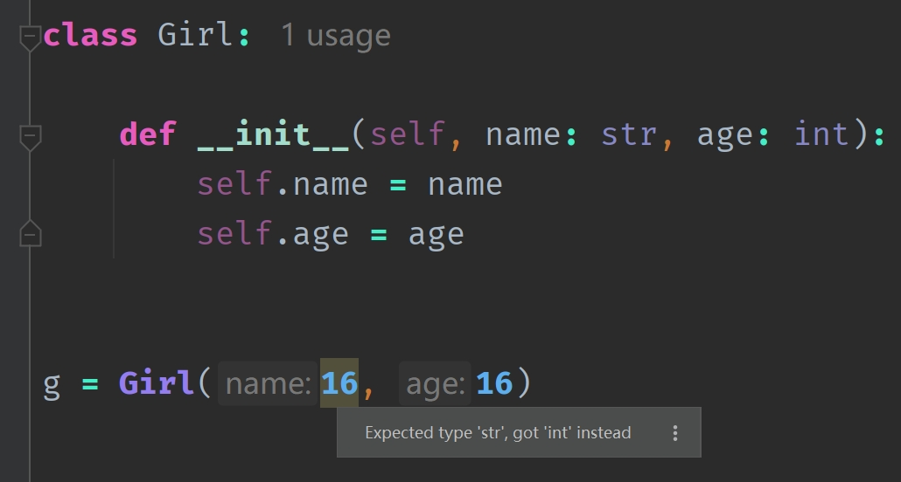

## 楔子

介绍完类对象之后，我们来介绍实例对象。之前费了老鼻子劲将类对象剖析了一遍，但这仅仅是万里长征的第一步，因为虚拟机执行时，在内存中兴风作浪的是一个个的实例对象，而类对象只是幕后英雄。

但是在源码分析实例对象之前，我们需要先补充一些描述符相关的知识，因为后续会涉及到。所以这一篇文章暂时不涉及任何的 CPython 源码，先从 Python 的层面理解它，然后再看底层实现会轻松很多。

## 问世间描述符为何物？

什么是描述符呢？很简单，一个类中，只要出现了 \_\_get\_\_、\_\_set\_\_、\_\_delete\_\_ 三者中的任意一个，那么它的实例就被称之为描述符。

~~~Python
class Descriptor:

    def __get__(self, instance, owner):
        print("__get__")
        print(instance)
        print(owner)

    def __set__(self, instance, value):
        print("__set__")
        print(instance)
        print(value)

class Girl:
    # 此时的 name 属性就被描述符代理了
    name = Descriptor()

    def __init__(self, name, age):
        self.name = name
        self.age = age

g = Girl("satori", 16)
"""
__set__
<__main__.Girl object at 0x0000021D8D225E40>
satori
"""
~~~

当程序执行 self.name = name 的时候，并没有把值设置到 self 的属性字典里面，而是执行了描述符的 \_\_set\_\_ 方法。参数 instance 是调用时的实例对象，也就是这里的 g，至于 value 显然就是给 self.name 赋的值。

~~~Python
print(g.age)  # 16
~~~

对于 self.age，由于它没有被代理，所以会正常设置到属性字典里面去，因此打印 16。但如果是 g.name 呢？

~~~Python
g.name
"""
__get__
<__main__.Girl object at 0x0000016C4C565E40>
<class '__main__.Girl'>
"""
~~~

由于实例的 name 属性被代理了，那么获取的时候，会触发描述符的 \_\_get\_\_ 方法。参数 instance 就是调用时的实例对象，也就是这里的 g，至于 owner 则是 g 的类型，也就是 Girl。

现在我们可以得到如下结论，如果实例的属性被具有 \_\_get\_\_ 和 \_\_set\_\_ 方法的描述符代理了。那么给被代理的属性赋值的时候，会执行描述符的 \_\_set\_\_ 方法，获取属性则会执行描述符的 \_\_get\_\_ 方法。

## 属性字典

我们给实例添加属性的时候，本质上都是添加到了实例的属性字典 \_\_dict\_\_ 中。

~~~Python
class Descriptor:

    def __get__(self, instance, owner):
        print("__get__")
        print(instance)
        print(owner)

    def __set__(self, instance, value):
        print("__set__")
        print(instance)
        print(value)

class Girl:
    name = Descriptor()

    def __init__(self, name, age):
        self.name = name
        self.age = age

g = Girl("satori", 16)
"""
__set__
<__main__.Girl object at 0x000001D07DA35E40>
satori
"""

print(g.__dict__)
"""
{'age': 16}
"""
~~~

可以看到，由于实例的 name 属性被代理了，所以它没有设置在属性字典中。如果没有被代理，按照 Python 的逻辑，会自动设置到实例的属性字典里面，但是现在被代理了，因此走的是描述符的 \_\_set\_\_ 方法，所以没有设置到字典里面去。

~~~Python
g.__dict__["name"] = "satori"
# 其实，不光实例对象，类也是，属性都在对应的属性字典里面
# self.name = "xxx" 就等价于 self.__dict__["name"] = "xxx"
# self.__dict__ 里面的属性，都可以通过 self. 的方式来获取
print(g.__dict__)  # {'age': 16, 'name': 'satori'}
~~~

因此可以通过获取属性字典的方式，来给实例对象设置值。所以虽然实例对象的 name 属性被代理了，但我们通过属性字典的方式绕过去了，让它没有走描述符的 \_\_set\_\_ 方法。如果是获取属性呢？

~~~Python
name = g.name
"""
__get__
<__main__.Girl object at 0x00000155235E5E40>
<class '__main__.Girl'>
"""
print(name)  # None
~~~

可以看到还是跟之前一样，因为被代理了，无法通过 self. 的方式来获取。而 name 打印的是 None，因为 \_\_get\_\_ 返回的是 None。那怎么办呢？还是使用字典的方式。

~~~python
print(g.__dict__["name"])  # satori
~~~

因此对于类和实例对象来说，都有各自的属性字典，操作属性本质上就是操作属性字典。

~~~Python
class A:

    def add(self, a, b):
        return a + b

a = A()
print(A.add(a, 10, 20))  # 30
# A.add 等价于 A.__dict__["add"]
print(A.__dict__["add"](a, 10, 20))  # 30

print(a.add(10, 20))  # 30
~~~

那么问题来了，a.\_\_dict\_\_["add"] 可不可以呢？答案是不可以的，因为这只能表示从自身的属性字典中查找，但 a 的属性字典里面没有 "add"，所以会报错的。而 a.add 虽然也是操作自身的属性字典，但它还隐含了当自身的属性字典中没有 "add" 时，会去类里面查找这一逻辑。

~~~Python
try:
    a.__dict__["add"]
except KeyError as e:
    print(f"没有 {e} 这个属性")  # 没有 'add' 这个属性   

# 我们可以手动添加，注意这个 add 是实例里面的，不是类里面的
# 所以调用时不会将自身作为第一个参数传递过去
a.__dict__["add"] = lambda a, b, c: a + b + c
print(a.add(10, 20, 30))  # 60
~~~

所以当实例对象里面已经有了，就不会再到类里面找了。当然啦，函数也有自己的属性字典，只不过一般都是空的。

再来补充一个点：

~~~Python
class Seq:

    def __len__(self):
        return 123

s = Seq()

# 之前说过，如果 cls 是 obj 的类对象，那么 obj.xxx() 本质上是 cls.xxx(obj)
# 前者是后者的语法糖，之后介绍实例对象的时候还会说
# 因此这里的 s.__len__()，本质上是 Seq.__len__(s)
print(Seq.__len__(s))  # 123
print(s.__len__())  # 123

# 而对于 len(s) 而言，本质上也是 Seq.__len__(s)
print(len(s))  # 123

# 但是 len(s) 和 s.__len__() 之间没有任何关系
# len(s) 执行的是 Seq.len(s)，不是 s.__len__()
s.__len__ = lambda: 456
print(s.__len__())  # 456
print(len(s))  # 123
~~~

所以即便 s 有 \_\_len\_\_，但如果 Seq 没有 \_\_len\_\_ 的话，那么 len(s) 也是会报错的。当然啦，不光是这里的 len 和 \_\_len\_\_，像 getattr 和 \_\_getattr\_\_、setattr 和 \_\_setattr\_\_、iter 和 \_\_iter\_\_、next 和 \_\_next\_\_，它们之间都是类似的。

## 描述符的优先级

描述符也是有优先级的，我们说当一个类里面出现了 \_\_get\_\_、\_\_set\_\_、\_\_delete\_\_ 任意一种，就被称为描述符。

~~~Python
class Descriptor:

    def __get__(self, instance, owner):
        print("__get__")
        print(instance)
        print(owner)

    # def __set__(self, instance, value):
    #     print("__set__")
    #     print(instance)
    #     print(value)

class Girl:
    name = Descriptor()

    def __init__(self, name, age):
        self.name = name
        self.age = age
~~~

这里将描述符的 \_\_set\_\_ 去掉了，如果描述符内部有 \_\_set\_\_，那么称这个描述符为数据描述符。如果只出现了 \_\_get\_\_ 或 \_\_delete\_\_，而没有 \_\_set\_\_，那么称之为非数据描述符。

~~~Python
g = Girl("satori", 16)
print(g.name, g.age)  # satori 16
~~~

由于没有 \_\_set\_\_，显然属性和值会被正常设置到属性字典里面去，这没有问题。但是我们发现，在获取属性的时候居然没有走 \_\_get\_\_，它明明定义了啊。其实原因很简单，这里代理属性的描述符是非数据描述符，所以没有执行 \_\_get\_\_。

也就是说，当一个实例对象去访问被代理的某个属性的时候（通过 **.** 的方式），如果是数据描述符，那么会走描述符的 \_\_get\_\_ 方法；如果是非数据描述符，那么会优先从属性字典里面获取，所以 self.name 打印的结果是字符串 "satori"。

因此我们得出了一个结论，优先级：**非数据描述符 < 实例属性 < 数据描述符**。

现在我们知道了，描述符和实例属性之间的关系。但如果是类属性呢？

~~~Python
class Descriptor:

    def __get__(self, instance, owner):
        print("__get__")
        print(instance)
        print(owner)

    def __set__(self, instance, value):
        print("__set__")
        print(instance)
        print(value)

class Girl:
    name = Descriptor()

    def __init__(self, name, age):
        self.name = name
        self.age = age

name = Girl.name
"""
__get__
None
<class '__main__.Girl'>
"""
Girl.name = "satori"
print(Girl.name)  # satori
~~~

我们注意到，类去访问的话，由于 name 被代理了，访问依旧会触发 \_\_get\_\_ 方法。但是，我们通过类来设置的时候却没有触发 \_\_set\_\_ 方法，所以类的优先级大于数据描述符。

并且，由于类已经将 name 给替换掉了，所以它变成了一个普通的类属性，不再被描述符所代理。因此，此时实例也不会受到描述符的影响，因为 Girl 这个类已经将描述符替换成普通的字符串了。

~~~Python
g = Girl("koishi", 15)
print(g.name, g.age)  # koishi 15
~~~

因此结论如下：非数据描述符 < 实例属性 < 数据描述符 < 类属性 < 未设置。

咦，这个未设置是什么鬼？首先类是可以更改被代理的属性的，类有权利将这个属性替换成别的，并且在替换的过程中不会触发描述符的 \_\_set\_\_，所以我们说优先级：**类属性 > 数据描述符**。但如果类没有将被代理的属性替换成别的，还是让它等于一个描述符，那么类调用的时候就会触发描述符的 \_\_get\_\_，所以优先级：**类属性 < 未设置**。

对于实例而言，如果是数据描述符，设置属性会走 \_\_set\_\_，获取属性会走 \_\_get\_\_。即使我们通过手动获取属性字典的方式，绕过了 \_\_set\_\_，但通过 **.** 的方式获取属性的时候依旧会触发 \_\_get\_\_。所以优先级：**实例属性 < 数据描述符**。

如果是非数据描述符，由于没有 \_\_set\_\_，那么实例属性会被设置到属性字典里面。而一旦设置到属性字典里面，那么访问的时候发现在属性字典中能找到该属性，就不会再走描述符的 \_\_get\_\_ 了。所以优先级：**非数据描述符 < 实例属性**。

不过还遗漏了一点，如果实例属性没有被设置到属性字典里面，会是什么情况呢？举个栗子：

~~~Python
class Descriptor:

    def __get__(self, instance, owner):
        print("__get__")
        print(instance)
        print(owner)

class Girl:
    name = Descriptor()

    def __init__(self, name, age):
        # self.name = name
        self.age = age

g = Girl("koishi", 15)
g.name
"""
__get__
<__main__.Girl object at 0x00000164BF366410>
<class '__main__.Girl'>
"""

g.name = "satori"
print(g.name)  # satori

# 添加一个 __set__
Descriptor.__set__ = lambda *args: None
g.name
"""
__get__
<__main__.Girl object at 0x00000164BF366410>
<class '__main__.Girl'>
"""
~~~

由于是非数据描述符，所以实例优先去自身的属性字典里面查找 name，但是没有，因为 name 这个属性我们并没有将它设置到属性字典中，所以在访问的时候还是走描述符的 \_\_get\_\_。

但是当设置完 g.name 之后，属性字典里面有 name 了，那么就不会再走 \_\_get\_\_ 了。而后面又手动给 Descriptor 增加了一个 \_\_set\_\_，那么描述符就从非数据描述符变成了数据描述符，这时候再执行 g.name，就又走 \_\_get\_\_ 方法了。所以不愧是动态语言，但也是导致性能问题的根源之一。

到目前为止可能有一些绕，再总结一下（一会还会啰嗦一遍）。

首先这里的优先级指的是能否正常修改被描述符代理的属性，由于类在修改的时候不会触发描述符的 \_\_set\_\_，但是实例修改时会触发，所以优先级：实例属性 < 数据描述符 < 类属性。而如果是非数据描述符，实例在修改的时候则不会触发 \_\_set\_\_，因为非数据描述符压根没有 \_\_set\_\_，所以优先级：非数据描述符 < 实例属性。

因此这个优先级是这么来的，最后还有一个未设置。

以实例对象为例，虽然它的优先级高于非数据描述符，但如果没有将属性设置到属性字典里面去的话，那么由于自身找不到，会去类里面找，结果发现这个属性被描述符代理了，那么依旧会触发描述符的 \_\_get\_\_。

再以类为例：

~~~python
class Descriptor:

    def __get__(self, instance, owner):
        print("__get__")
        print(instance)
        print(owner)

class Girl:
    name = Descriptor()

    def __init__(self, name, age):
        # self.name = name
        self.age = age

Girl.name

"""
__get__
None
<class '__main__.Girl'>
"""
~~~

类的优先级肯定高于非数据描述符，但这个优先级指的是能否正常修改被描述符代理的属性，虽然类可以修改，但是它没有修改。因此在获取 Girl.name 时，发现它被代理了，那么依旧会触发描述符的 \_\_get\_\_。

## 被代理的属性

可能有人好奇 name = Descriptor() 里的 name，到底是实例的 name，还是类的 name。

首先既然是 name = Descriptor()，那么这肯定是一个类属性。但我们无论是使用类还是使用实例，貌似都可以触发描述符的方法啊。那么从描述符的角度来说，这个 name 到底是针对谁的呢？其实，答案可以说两者都是吧，我们举例说明。

~~~Python
class Descriptor:

    def __get__(self, instance, owner):
        print("__get__")
        print(instance)
        print(owner)

    def __set__(self, instance, value):
        print("__set__")
        print(instance)
        print(value)

class Girl:
    name = Descriptor()

    def __init__(self, name, age):
        self.name = name
        self.age = age

Girl.name
"""
__get__
None
<class '__main__.Girl'>
"""

print(Girl.__dict__["name"])
"""
<__main__.Descriptor object at 0x000002885D16F670>
"""
~~~

可以看到，直接访问的话会触发 \_\_get\_\_，但是通过属性字典获取的话，拿到的就是一个 Descriptor 对象，这是毫无疑问的。然后再看实例：

~~~Python
g = Girl("satori", 16)
"""
__set__
<__main__.Girl object at 0x0000020A57C75E40>
satori
"""
~~~

用大白话解释就是，实例去访问自身的 name 属性，但是发现类里面有一个和自己同名、而且被数据描述符代理的属性，所以实例自身的这个属性也相当于被描述符代理了。

~~~Python
Girl.name = "satori"
g = Girl("satori", 16)
~~~

此时设置属性、访问属性没有再触发描述符的方法，这是因为类属性的优先级比两种描述符的优先级都要高，从而把 name 给修改了。那么此时再去设置实例属性的话，类里面已经没有和自己同名并且被描述符代理的 name 了，所以会直接设置到属性字典里面。

我们再进一步验证上面的结论。

~~~Python
class Descriptor:

    def __get__(self, instance, owner):
        print("__get__")
        print(instance)
        print(owner)

    def __set__(self, instance, value):
        print("__set__")
        print(instance)
        print(value)

class Girl:
    name = Descriptor()

    def __init__(self, age):
        self.age = age

# 此时实例已经没有 name 属性了
g = Girl(16)
print(g.age)  # 16
g.name
"""
__get__
<__main__.Girl object at 0x00000274FBA45E40>
<class '__main__.Girl'>
"""
# 但依旧触发描述符的 __get__ 方法，这是肯定的
# 因为实例根本没有 name 这个属性，于是会到类里面找
# 但是被代理了，那么走描述符的 __get__ 方法

# 通过属性字典的方式，向实例里面设置一个 name 属性
g.__dict__["name"] = "satori"
g.name
"""
__get__
<__main__.Girl object at 0x00000274FBA45E40>
<class '__main__.Girl'>
"""

# 此时获取属性又触发了描述符的方法，显然不需要解释了
# 因为类里面有一个和自己同名、且被描述符代理的属性
~~~

但上面的是数据描述符，如果是非数据描述符就另当别论了。

~~~Python
class Descriptor:

    def __get__(self, instance, owner):
        print("__get__")
        print(instance)
        print(owner)

class Girl:
    name = Descriptor()

    def __init__(self, name, age):
        self.name = name
        self.age = age

g = Girl("satori", 16)
print(g.name)  # satori
~~~

因为是非数据描述符，所以实例的优先级更高。虽然在获取属性时发现类中有一个和自己同名，并且被描述符代理的属性（这里是 name），但是这个描述符是非数据描述符，所以会先到自己的属性字典里面找，如果找到了直接返回。

> 如果是数据描述符，那么无论实例的属性字典里有没有 name，都会无条件走描述符的 \_\_get\_\_，因为实例的优先级低于数据描述符。

~~~Python
Girl.name
"""
__get__
None
<class '__main__.Girl'>
"""
~~~

但是类在调用的时候，依旧触发了 \_\_get\_\_，因为类的优先级小于**未设置**。或者说 Girl.name 拿到的依旧是一个描述符，那么当然会触发 \_\_get\_\_，可如果将 Girl.name 改成别的，就不会触发了。

## 类和实例获取被代理属性的区别？

首先 name = Descriptor()，类和实例都可以访问，如果访问 name 时发现它是一个描述符，那么就会触发 \_\_get\_\_ 方法。但是这两者有什么区别呢？

~~~Python
class Descriptor:

    def __get__(self, instance, owner):
        print("__get__")
        print(instance)
        print(owner)

class Girl:
    name = Descriptor()

Girl.name
"""
__get__
None
<class '__main__.Girl'>
"""

Girl().name
"""
__get__
<__main__.Girl object at 0x000001B4D7F95DB0>
<class '__main__.Girl'>
"""
~~~

不难发现 \_\_get\_\_ 里面的 instance 就是实例，owner 就是类。如果实例获取，那么 instance 就是实例，如果类去获取 instance 就是 None。对于 \_\_set\_\_ 来说，instance 依旧是实例，value 就是我们给实例被代理的属性设置的值。

## 如何获取被代理属性的名称？

相信到这里，描述符的原理已经清楚了，但还有一些内容没有说。

我们知道，如果是数据描述符，只能使用属性字典的方式，但那是在描述符不做逻辑处理的情况下。现在我们来看看如何让描述符支持实例对象通过 **.** 的方式访问自身被代理的属性。

~~~Python
class Descriptor:

    def __get__(self, instance, owner):
        print("获取值")
        return instance.__dict__["name"]

    def __set__(self, instance, value):
        print("设置值")
        instance.__dict__["name"] = value

class Girl:
    name = Descriptor()

g = Girl()
g.name = "satori"
"""
设置值
"""

print(g.name)
"""
获取值
satori
"""
~~~

如果我们不加那两个 print，那么表现出来的结果和不使用描述符是一样的。

但是这里有一个问题，那就是描述符中的 instance.\_\_dict\_\_["name"]，这里我们把 key 写死了，如果我们想对 age 进行代理呢？举个栗子：

~~~Python
class Descriptor:

    def __get__(self, instance, owner):
        return instance.__dict__["name"]

    def __set__(self, instance, value):
        instance.__dict__["name"] = value

class Girl:
    age = Descriptor()

g = Girl()
g.age = 16
print(g.__dict__)  # {'name': 16}
print(g.name)  # 16
~~~

我们明明是给 age 设置属性，但影响的却是 name，原因是描述符中已经将 key 写死了。所以我们需要让描述符获取到它代理的属性的名称，此时 \_\_set_name\_\_ 的作用就来了。

~~~Python
class Descriptor:

    def __get__(self, instance, owner):
        return instance.__dict__["name"]

    def __set__(self, instance, value):
        instance.__dict__["name"] = value

    def __set_name__(self, owner, name):
        print(owner)
        print(name)

class Girl:
    age = Descriptor()

"""
<class '__main__.Girl'>
age
"""
~~~

当 Girl 这个类被创建时，\_\_set_name\_\_ 就执行了，所以它是在 \_\_get\_\_ 和 \_\_set\_\_ 之前执行的。参数 owner 依旧是类本身，参数 name 指的就是被代理的属性的名称。

~~~Python
class Descriptor:

    def __get__(self, instance, owner):
        return instance.__dict__[self.name]

    def __set__(self, instance, value):
        instance.__dict__[self.name] = value

    def __set_name__(self, owner, name):
        # 此时的 name 就是字符串 "gender"
        # 因为被代理的属性是 gender
        self.name = name

class Girl:
    gender = Descriptor()

g = Girl()
g.gender = "female"
print(g.__dict__)  # {'gender': 'female'}
~~~

此时的实例属性就被正确地设置进去了，但就我个人而言，更喜欢 \_\_init\_\_ 的方式。

~~~Python
class Descriptor:

    def __init__(self, name):
        self.name = name

    def __get__(self, instance, owner):
        return instance.__dict__[self.name]

    def __set__(self, instance, value):
        instance.__dict__[self.name] = value

class Girl:
    name = Descriptor("name")
    age = Descriptor("age")

    def __init__(self, name, age):
        self.name = name
        self.age = age

g = Girl("satori", 16)
print(g.name, g.age)  # satori 16
~~~

到此描述符的内容就全部介绍完毕了。

## 描述符的作用

虽然上面花了很大的笔墨介绍了描述符的原理以及使用方式，但是这个描述符有啥用呢？我们用描述符能够实现什么功能呢？

其实描述符能够做的事情非常多，比如做 web 开发时的表单验证。当然啦，描述符和字典一样，不光我们在用，底层也在大量使用描述符，比如 property、staticmethod、classmethod 等等。至于这些内容后续再说，下面我们就简单举个小例子，演示一下描述符的用法。

众所周知，Python 创建变量的时候，不需要指定类型，原因就是类型是和对象绑定的，而不是和变量。虽然现在有了类型注解，但这只是一个规范，并没有实际的约束力，比如：

这里要求 name 是 str 类型，然而我们传入的值却是 int 类型，PyCharm 也很智能地提示我们类型不对。但我们就传入 int 类型的值，解释器能拿我们怎么样吗？显然不能，这个程序是可以正常执行的，因此类型注解并没有在语法层面上限制你。

但由于类型不对，导致的 bug 数不胜数。比如判断两个字符串是否相等，但其中一个是 bytes 类型，我们忘记 decode 了，那么显然就永远不会相等了。而在 Python 里面，这种做法又是合法的，因此就很容易产生意想不到的效果。比如 Instagram 公司在从 Python2 切换到 Python3 时就遇到过这个问题，这是该公司的工程师在 PyCon 2017 大会上分享的，有兴趣可以去看一看。

而对于静态语言来说，比如 Golang，就不会出现这个问题。因为在 Golang 里面 []byte 和 string 是不能比较的，编译时就不会通过。当然啦，这是由于语言的特性不同导致的，并没有说谁好谁坏。那么下面我们就来改造一下，让 Python 的类在实例化的时候也能像静态语言一样进行类型检查。

~~~Python
class TypeChecker:

    def __init__(self, name, excepted_type):
        self.name = name
        self.excepted_type = excepted_type

    def __get__(self, instance, owner):
        return instance.__dict__[self.name]

    def __set__(self, instance, value):
        # 在赋值的时候，对 value 进行判断
        # 如果 value 的类型是 self.excepted_type，那么合法，否则类型错误
        if not isinstance(value, self.excepted_type):
            tp = type(value).__name__
            excepted_tp = self.excepted_type.__name__
            raise TypeError(f"{self.name} 接收的值应该是 {excepted_tp} 类型，而不是 {tp} 类型")

        instance.__dict__[self.name] = value

class Girl:
    name = TypeChecker("name", str)
    age = TypeChecker("age", int)

    def __init__(self, name: str, age: int):
        self.name = name
        self.age = age

try:
    g = Girl(16, 16)
except TypeError as e:
    print(e)  # name 接收的值应该是 str 类型, 而不是 int 类型
~~~

但是这么做还不够优雅，如果我们有大量的类都需要进行类型检测，那么每一个类里面都要提前声明好被描述符代理的属性。这会比较麻烦，于是可以考虑使用装饰器。

~~~Python
class TypeChecker:

    def __init__(self, name, excepted_type):
        self.name = name
        self.excepted_type = excepted_type

    def __get__(self, instance, owner):
        return instance.__dict__[self.name]

    def __set__(self, instance, value):
        if not isinstance(value, self.excepted_type):
            tp = type(value).__name__
            excepted_tp = self.excepted_type.__name__
            raise TypeError(f"{self.name} 接收的值应该是 {excepted_tp} 类型，而不是 {tp} 类型")

        instance.__dict__[self.name] = value

def type_checker(cls):
    # cls 就是要被 type_checker 装饰的类
    # 拿到 __init__ 函数
    __init__ = getattr(cls, "__init__", None)
    # 如果 __init__ 为空，或者它不是一个函数，那么直接将类返回
    if __init__ is None or not hasattr(__init__, "__code__"):
        return cls

    # 拿到 __init__ 函数的 __annotations__
    annotations = cls.__init__.__annotations__
    # 进行遍历，给类设置被描述符代理的属性
    for name, excepted_type in annotations.items():
        setattr(cls, name, TypeChecker(name, excepted_type))
    return cls

# 以后在创建类的时候，直接打上这个装饰器就行了
# 但是显然这个装饰器依赖类型注解
# 如果没有类型注解的话，那么该属性是不会被代理的
@type_checker
class Girl:

    def __init__(self, name: str, age: int):
        self.name = name
        self.age = age

try:
    g = Girl(16, 16)
except TypeError as e:
    print(e)  # name 接收的值应该是 str 类型, 而不是 int 类型
~~~

怎么样，现在实现起来是不是更优雅一点了呢？

对了，我们上面一直在说 \_\_get\_\_、\_\_set\_\_，而把 \_\_delete\_\_ 忽略了。

~~~Python
class Descriptor:

    def __get__(self, instance, owner):
        print("__get__")

    def __set__(self, instance, value):
        print("__set__")

    def __delete__(self, instance):
        print("__delete__")

class Girl:
    name = Descriptor()

g = Girl()
g.name = "satori"
"""
__set__
"""

g.name
"""
__get__
"""

del g.name
"""
__delete__
"""
~~~

显然在删除一个属性时，会执行 \_\_delete\_\_，比较简单，就不多说了。\_\_delete\_\_ 一般不会单独出现，而且事实上 \_\_delete\_\_ 用的也不多。

## 小结

以上就是描述符的全部内容了，这个功能总是容易被遗忘，但通过描述符我们可以实现很多炫酷的功能。所以 Python 里面的花活还是很多的，深入起来会发现不是那么简单，而像 Golang 虽然是静态语言，但它真的要比 Python 简单很多。

-----

&nbsp;

**欢迎大家关注我的公众号：古明地觉的编程教室。**

**如果觉得文章对你有所帮助，也可以请作者吃个馒头，Thanks♪(･ω･)ﾉ。**

