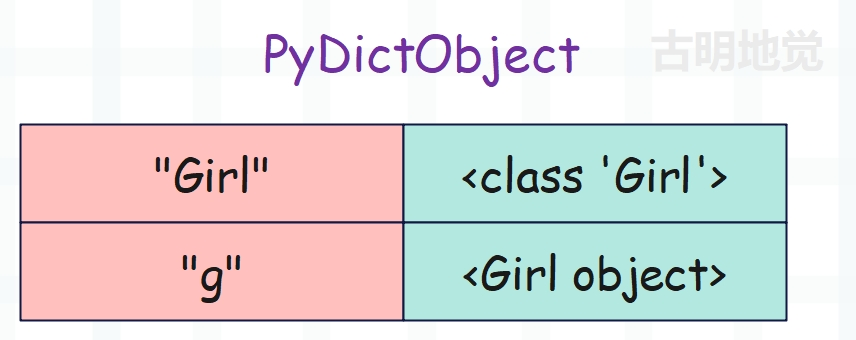

本篇文章来聊一聊实例对象是如何创建的，这部分内容其实在最开始介绍对象关系模型的时候说过了，这里再来回顾一遍。我们知道创建实例对象有两种方式：

- 通过 Python / C API 创建，只适用于内置类对象的实例对象；
- 通过调用类型对象创建，适用于所有的实例对象；

以创建列表为例：

~~~Python
lst1 = []
lst2 = list()
~~~

这两种都是合法的，但 lst1 指向的列表是通过 Python / C API 创建的，lst2 指向的列表是通过调用类型对象创建的。

在工作中，更推荐使用 Python / C API 创建。因为内置类对象的实例对象，在底层是预先定义好的，结构体内部有哪些字段已经写死了，直接创建就行了，所以它的速度比调用类型对象要快。而解释器也能区分出实例对象的种类，比如看到 **[]** 时，就知道是列表；看到 **()** 时，就知道是元组；看到 **{}** 时，就知道是字典。

而通过 Python / C API 创建虽然更快，但这是内置类对象的实例对象才享有的特权。对于自定义类而言，想创建其实例对象，只能通过调用类型对象的方式。这是显而易见的，因为解释器不可能把我们自定义类的实例对象在底层预先定义好。

相信实例对象的创建应该大致了解了，下面我们就来看一下具体的实现细节，这里针对的是第二种创建方式。因为通过 Python / C API 创建没什么复杂的，调用类型对象创建才是我们的重点，而这种方式也是所有的实例对象都支持的。

下面就以自定义类对象为例，看看实例对象是如何创建的。

~~~python
class Girl:

    def __init__(self, name, age):
        self.name = name
        self.age = age

g = Girl("satori", 16)
~~~

编译之后的字节码如下，这里只看模块的字节码。

~~~C
  // 加载内置函数 __build_class__ 
  0 LOAD_BUILD_CLASS
  // 加载 Girl 的 PyCodeObject
  2 LOAD_CONST               0 (<code object Girl at 0x7f9...>)
  // 加载名称 "Girl"
  4 LOAD_CONST               1 ('Girl')
  // 构建函数
  6 MAKE_FUNCTION            0
  // 再次加载名称 "Girl"
  8 LOAD_CONST               1 ('Girl')
  // 以 PyFunctionObject 和 "Girl" 为参数
  // 调用 __build_class__ 构建 PyTypeObject
 10 CALL_FUNCTION            2
  // 将构建的类使用变量 Girl 保存
 12 STORE_NAME               0 (Girl)
  
  // 这里对应 g = Girl("satori", 16)
  // 加载变量 Girl，指向一个类对象
 14 LOAD_NAME                0 (Girl)
  // 加载参数 "satori" 和 16
 16 LOAD_CONST               2 ('satori')
 18 LOAD_CONST               3 (16)
  // 调用，即便调用的是类，指令也是 CALL_FUNCTION
 20 CALL_FUNCTION            2
  // 将返回值（实例）交给变量 g 保存
 22 STORE_NAME               1 (g)
  // return None
 24 LOAD_CONST               4 (None)
 26 RETURN_VALUE
~~~

字节码非常简单，而且调用一个类和调用一个函数，字节码是类似的。都是将自身和参数依次 LOAD 进来，然后 CALL_FUNCTION。执行完毕之后，模块的名字空间如下：

调用对象，本质上是执行对应类对象的 \_\_call\_\_。因此，在 Python 里面调用类对象会执行 type.\_\_call\_\_，而在 \_\_call\_\_ 里面会执行类对象的 \_\_new\_\_ 创建实例对象，然后执行 \_\_init\_\_（如果存在）给实例绑定属性，最后返回。

而对应虚拟机的层面，在 CALL_FUNCTION 中，显然会执行 &PyType_Type 的 tp_call，而在 tp_call 中会执行类对象的 tp_new 创建实例对象，然后执行 tp_init（如果存在）给实例绑定属性，最后返回。

但需要注意的是，Girl 这个类本身是没有 \_\_new\_\_ 的。在创建它时，虚拟机会调用 PyType_Ready 进行初始化，而其中一项动作就是继承基类，所以 Girl.\_\_new\_\_ 实际上就是 object.\_\_new\_\_。

~~~Python
class Girl:

    def __init__(self, name, age):
        self.name = name
        self.age = age

print(Girl.__new__ is object.__new__)  # True
~~~

而当我们重写 \_\_new\_\_ 时，最后也需要调用 **object.\_\_new\_\_(cls)** 来为实例开辟内存。

> object 在底层对应 &PyBaseObject_Type，object.\_\_new\_\_ 对应 object_new。

因此创建类对象和创建实例对象的不同之处就在于 tp_new 不同。创建类对象，虚拟机调用的是 type_new；创建实例对象，虚拟机则调用 object_new。至于字节码指令，两者是一致的。下面我们看一下源码，由于调用类对象会执行元类的 tp_call（对应 type_call），我们就从这看起。话说这部分源码记得之前看过了，这里再简单回顾一下。

~~~C
static PyObject *
type_call(PyTypeObject *type, PyObject *args, PyObject *kwds)
{
    // ...
    // 调用类型对象的 __new__ 为实例申请内存
    obj = type->tp_new(type, args, kwds);
    // ...
    // 判断是否定义了初始化函数 __init__
    type = Py_TYPE(obj);
    if (type->tp_init != NULL) {
        // 如果有 __init__，则执行
        int res = type->tp_init(obj, args, kwds);
        if (res < 0) {
            assert(PyErr_Occurred());
            Py_DECREF(obj);
            obj = NULL;
        }
        else {
            assert(!PyErr_Occurred());
        }
    }
    // 返回实例
    return obj;
}
~~~

注意里面的 tp_init，因为新式类都继承 object，所以在执行 PyType_Ready 时也会继承 &PyBaseObject_Type 的 object_init 操作。

但正如我们之前说的那样，因为类重写了 \_\_init\_\_，所以会调用 fixup_slot_dispatchers ，让 tp_init 指向 slotdef 中与 \_\_init\_\_ 对应的 slot_tp_init。并且还会设置tp_alloc，这与内存分配有关，而这些都是在 type_new 中发生的，来看一下。 

~~~c
static PyObject *
type_new(PyTypeObject *metatype, PyObject *args, PyObject *kwds)
{
    // ........

    // 调用 type_new 创建类对象，这里的变量 type 便指向创建的类
    // 然后注意 tp_alloc 字段，它维护一个内存分配函数
    // 当为实例对象分配内存时，使用的就是 tp_alloc
    // 调用类对象会执行 object_new，在里面会执行内存分配函数 tp_alloc
    // 而在代码中，它被设置为 PyType_GenericAlloc，接收一个类型作为参数
    // 调用时会根据传入的类型为其实例分配内存，因为类型包含了实例的元信息
    // 另外创建完实例之后，还会将实例的 ob_type 设置为传入的类型
    type->tp_alloc = PyType_GenericAlloc;
    type->tp_free = PyObject_GC_Del;
    type->tp_traverse = subtype_traverse;
    type->tp_clear = subtype_clear;
    // ...
    // 将 object 的 tp_init 改成 slot_tp_init
    fixup_slot_dispatchers(type);
    // ...
}
~~~

经过 fixup_slot_dispatchers 改造之后，自定义类的 tp_init 会指向 slot_tp_init，而在 slot_tp_init 中会去寻找我们自定义的 \_\_init\_\_。

~~~C
static int
slot_tp_init(PyObject *self, PyObject *args, PyObject *kwds)
{
    _Py_IDENTIFIER(__init__);
    int unbound;
    // 虚拟机会调用 lookup_method 函数，从自定义类对象的 MRO 中搜索属性 __init__
    PyObject *meth = lookup_method(self, &PyId___init__, &unbound);
    PyObject *res;

    if (meth == NULL)
        return -1;
    // 调用
    if (unbound) {
        res = _PyObject_Call_Prepend(meth, self, args, kwds);
    }
    else {
        res = PyObject_Call(meth, args, kwds);
    }
    Py_DECREF(meth);
    if (res == NULL)
        return -1;
    // 如果返回的不是 None，那么报错，这个信息熟悉不
    if (res != Py_None) {
        PyErr_Format(PyExc_TypeError,
                     "__init__() should return None, not '%.200s'",
                     Py_TYPE(res)->tp_name);
        Py_DECREF(res);
        return -1;
    }
    Py_DECREF(res);
    return 0;
}
~~~

所以在定义类时，如果重写了 \_\_init\_\_ 函数，那么创建实例对象时搜索的结果就是重写后的函数；如果没有重写那么执行 object 的 \_\_init\_\_ 操作，而在 object 的 \_\_init\_\_ 中，虚拟机则什么也不做，会直接返回。

到了这里可以小结一下，类对象创建实例对象的两个步骤：

- instance = cls.\_\_new\_\_(cls, \*args, \**kwargs)
- cls.\_\_init\_\_(instance, \*args, \**kwargs)，如果一个类没有 \_\_init\_\_，那么就没有这一步，比如 tuple

需要注意的是，对于 metaclass（元类）创建类对象，这两个步骤同样是适用的。因为 metaclass 创建类对象的过程和类对象创建实例对象是一样的，我们说 class 具有二象性。

------

&nbsp;

**欢迎大家关注我的公众号：古明地觉的编程教室。**

**如果觉得文章对你有所帮助，也可以请作者吃个馒头，Thanks♪(･ω･)ﾉ。**

