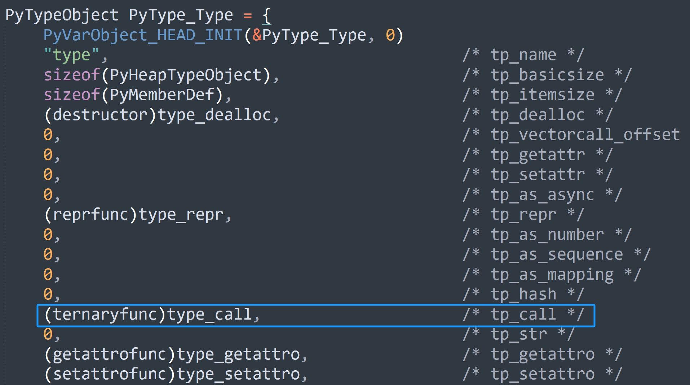
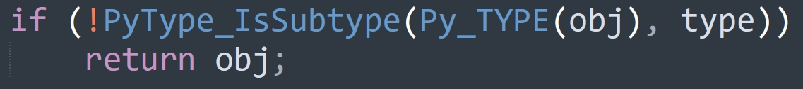

## 楔子

在上一篇文章中，我们分析了对象是如何创建的，主要有两种方式，一种是通过特定类型 API，另一种是通过调用类型对象。

对于内置类型的实例对象而言，这两种方式都是支持的，比如列表，我们既可以通过 [ ] 创建，也可以通过 list() 创建，前者是列表的特定类型 API，后者是调用类型对象。但对于自定义类的实例对象而言，我们只能通过调用类型对象的方式来创建。

而一个对象如果可以被调用，那么这个对象就是 callable，否则就不是 callable。那么问题来了，如果一个对象是 callable，那么它都具有哪些特征呢？

- 从 Python 的角度看，如果对象是 callable，那么它的类型对象一定实现了 \_\_call\_\_ 函数；
- 从解释器的角度看，如果对象是 callable，那么它的类型对象的 tp_call 字段一定不为空。

## 从 Python 的角度看对象的调用

调用 int 可以创建一个整数，调用 str 可以创建一个字符串，调用 tuple 可以创建一个元组，调用自定义的类也可以创建出相应的实例对象，这就说明类型对象是可调用的，也就是 callable。既然类型对象可调用，那么类型对象的类型对象（type）内部一定实现了 \_\_call\_\_ 函数。

~~~python
# int 可以调用，那么它的类型对象、也就是元类（type）一定实现了 __call__ 函数
print(hasattr(type, "__call__"))  # True

# 而调用一个对象，等价于调用其类型对象的 __call__ 函数
# 所以 int(2.71) 实际上就等价于如下
print(type.__call__(int, 2.71))  # 2
~~~

我们说 int、str、float 这些都是类型对象（简单来说就是类），而 123、"你好"、2.71 是其对应的实例对象，这些都没问题。但如果相对 type 而言，int、str、float 是不是又成了实例对象呢？因为它们的类型都是 type。

所以 class 具有二象性：

- 如果站在实例对象（如：123、"你好"、2.71）的角度上，它是类型对象；
- 如果站在 type 的角度上，它是实例对象；

同理，由于 type 的类型还是 type，那么 type 既是 type 的类型对象，type 也是 type 的实例对象。虽然这里描述的有一些绕，但应该不难理解，而为了避免后续的描述出现歧义，这里我们做一个申明：

- 整数、浮点数、字符串、列表等等，我们称之为实例对象
- int、float、str、dict，以及自定义的类，我们称之为类型对象
- type 虽然也是类型对象，但我们称它为元类

由于 type 的内部定义了 \_\_call\_\_ 函数，那么说明类型对象都是可调用的，因为调用类型对象就是调用元类 type 的 \_\_call\_\_ 函数。而实例对象能否调用就不一定了，这取决于它的类型对象是否定义了 \_\_call\_\_ 函数，因为调用一个对象，本质上是调用其类型对象内部的 \_\_call\_\_ 函数。

~~~python
class A:
    pass

a = A()
# 因为自定义的类 A 里面没有 __call__
# 所以 a 是不可以被调用的
try:
    a()
except Exception as e:
    # 告诉我们 A 的实例对象无法被调用
    print(e)  # 'A' object is not callable

# 如果我们给 A 设置了一个 __call__
type.__setattr__(A, "__call__", lambda self: "这是__call__")
# 发现可以调用了
print(a())  # 这是__call__
~~~

这就是动态语言的特性，即便在类创建完毕之后，依旧可以通过 type 进行动态设置，而这在静态语言中是不支持的。所以 type 是所有类的元类，它控制了自定义类的生成过程，因此 type 这个古老而又强大的类可以让我们玩出很多新花样。

但对于内置的类，type 是不可以对其动态增加、删除或者修改属性的，因为内置的类在底层是静态定义好的。从源码中我们看到，这些内置的类、包括元类，它们都是 PyTypeObject 对象，在底层已经被声明为全局变量了，或者说它们已经作为静态类存在了。所以 type 虽然是所有类型对象的类型，但只有面对自定义的动态类，type 才具有对属性进行增删改的能力。

而且在上一篇文章中我们也解释过，Python 的动态性是解释器将字节码翻译成 C 代码的时候赋予的，因此给类对象动态设置属性只适用于动态类，也就是在 py 文件中使用 class 关键字定义的类。而对于静态类，它们在编译之后已经是指向 C 一级的数据结构了，不需要再被解释器解释了，因此解释器自然也就无法在它们身上动手脚，毕竟彪悍的人生不需要解释。

~~~python
try:
    type.__setattr__(dict, "ping", "pong")
except Exception as e:
    print(e) 
    """
    can't set attributes of built-in/extension type 'dict'
    """

try:
    type.__setattr__(list, "ping", "pong")
except Exception as e:
    print(e) 
    """
    can't set attributes of built-in/extension type 'list'
    """
~~~

同理其实例对象亦是如此，静态类的实例对象也不可以动态设置属性：

~~~Python
lst = list()
try:
    lst.name = "古明地觉"
except Exception as e:
    print(e)  # 'list' object has no attribute 'name'
~~~

在介绍 PyTypeObject 结构体的时候我们说过，静态类的实例对象可以绑定哪些属性，已经写死在 tp_members 字段里面了。

## 从解释器的角度看对象的调用

如果一个对象可以被调用，那么它的类型对象中一定要有 tp_call，更准确的说是 tp_call 字段的值是一个具体的函数指针，而不是 0。由于 PyList_Type 是可以调用的，这就说明 PyType_Type 内部的 tp_call 是一个函数指针，这在 Python 的层面我们已经验证过了，下面再来通过源码看一下。

在创建 PyType_Type 的时候，PyTypeObject 内部的 tp_call 字段被设置成了 type_call。所以当我们调用 PyList_Type 的时候，会执行 type_call 函数。

因此 list() 在 C 的层面上等价于：

~~~C
(&PyList_Type)->ob_type->tp_call(&PyList_Type, args, kwargs);
// 即：
(&PyType_Type)->tp_call(&PyList_Type, args, kwargs);
// 而在创建 PyType_Type 的时候，给 tp_call 字段传递的是 type_call
// 因此最终等价于
type_call(&PyList_Type, args, kwargs)
~~~

如果用 Python 来演示这一过程的话：

~~~python
# 以 list("abcd") 为例，它等价于
lst1 = list.__class__.__call__(list, "abcd")
# 等价于
lst2 = type.__call__(list, "abcd")
print(lst1)  # ['a', 'b', 'c', 'd']
print(lst2)  # ['a', 'b', 'c', 'd']
~~~

这就是 list() 的秘密，相信其它类型在实例化的时候是怎么做的，你已经知道了，做法是相同的。

~~~Python
# dct = dict([("name", "古明地觉"), ("age", 17)])
dct = dict.__class__.__call__(
    dict, [("name", "古明地觉"), ("age", 17)]
)
print(dct)  # {'name': '古明地觉', 'age': 17}

# buf = bytes("hello world", encoding="utf-8")
buf = bytes.__class__.__call__(
    bytes, "hello world", encoding="utf-8"
)
print(buf)  # b'hello world'
~~~

当然，目前还没有结束，我们还需要看一下 type_call 的源码实现。

## type_call 源码解析

调用类型对象，本质上会调用 type.\_\_call\_\_，在底层对应 type_call 函数，因为 PyType_Type 的 tp_call 字段被设置成了 type_call。当然调用 type 也是如此，因为 type 的类型还是 type。

那么这个 type_call 都做了哪些事情呢？

~~~C
// Objects/typeobject.c

static PyObject *
type_call(PyTypeObject *type, PyObject *args, PyObject *kwds)
{
	// 参数 type 表示类型对象或者元类，假设调用的是 list，那么它就是 &PyList_Type
    // 参数 args 和 kwds 表示位置参数和关键字参数，args 是元组，kwds 是字典

    // 指向创建的实例对象，当然也可能是类型对象，取决于参数 type
    // 如果参数 type 表示元类，那么 obj 会指向类型对象，并且是自定义的动态类
    // 如果参数 type 表示类型对象，那么 obj 会指向实例对象
    PyObject *obj;
    
    // 执行类型对象（也可能是元类）的 tp_new，也就是 __new__
    // 如果不存在，那么会报错，而在 Python 中见到的报错信息就是这里指定的
    if (type->tp_new == NULL) {
        PyErr_Format(PyExc_TypeError,
                     "cannot create '%.100s' instances",
                     type->tp_name);
        return NULL;
    }
    obj = type->tp_new(type, args, kwds);
    // 检测调用是否正常，如果调用正常，那么 obj 一定指向一个合法的 PyObject
    // 而如果 obj 为 NULL，则表示执行出错，此时解释器会抛出异常
    obj = _Py_CheckFunctionResult((PyObject*)type, obj, NULL);
    if (obj == NULL)
        return NULL;

    // 这里要做一个额外判断：
    // 如果参数 type 是 &PyType_Type，也就是 Python 中的元类
    // 那么它可以接收一个位置参数（查看对象类型），也可以接收三个位置参数（创建自定义类）
    // 所以当 type 是 &PyType_Type，位置参数的个数为 1，并且没有传递关键字参数时
    // 那么表示查看对象的类型，此时直接返回 obj 即可
    if (type == &PyType_Type &&
        PyTuple_Check(args) && PyTuple_GET_SIZE(args) == 1 &&
        (kwds == NULL ||
         (PyDict_Check(kwds) && PyDict_GET_SIZE(kwds) == 0)))
        return obj;

    // 到这里说明不是查看对象类型，而是创建类或者实例
    // 如果参数 type 是元类，那么表示创建类，此时 args 的长度必须为 3
    // 如果参数 type 是类型对象，那么表示创建实例对象
    // 所以为了描述方便，我们就假设参数 type 是类型对象，但我们知道它也可以是元类

    // 总之到这里 __new__ 已经执行完了，那么之后该干啥了？显然是执行 __init__，但需要先做一个检测
    // 如果 __new__ 返回的实例对象的类型不是当前类型，那么直接返回，不再执行 __init__
    // 比如自定义 class A，那么在 __new__ 里面应该返回 A 的实例对象，但我们故意返回个 123
    // 由于返回值的类型不是当前类型，那么不再执行初始化函数 __init__
    if (!PyType_IsSubtype(Py_TYPE(obj), type))
        return obj;

    // 走到这里说明类型一致，那么执行 __init__，将 obj、args、kwds 一起传过去
    type = Py_TYPE(obj);
    if (type->tp_init != NULL) {
        int res = type->tp_init(obj, args, kwds);
        if (res < 0) {
            assert(PyErr_Occurred());
            Py_DECREF(obj);
            obj = NULL;
        }
        else {
            assert(!PyErr_Occurred());
        }
    }
    // 返回创建的对象 obj，当然准确来说是对象的泛型指针
    // 因为 Python 虽然一切皆对象，但我们拿到的都是对象的泛型指针
    // 只是有时为了描述方便，我们会说成是对象，这一点我们心里清楚就好
    return obj;
}
~~~

所以整个过程就三步：

- 如果传递的是元类，并且只有一个参数，那么直接返回对象的类型；
- 否则先调用 tp_new 为实例对象申请内存；
- 再调用 tp_init（如果有）进行初始化，设置对象属性；

所以这对应了 Python 中的 \_\_new\_\_ 和 \_\_init\_\_，其中 \_\_new\_\_ 负责为实例对象开辟一份内存，然后返回指向对象的指针，并且该指针会自动传递给 \_\_init\_\_ 中的 self。

~~~python
class Girl:

    def __new__(cls, name, age):
        print("__new__ 方法执行啦")
        # 调用 object.__new__(cls) 创建 Girl 的实例对象
        # 然后该对象的指针会自动传递给 __init__ 中的 self
        return object.__new__(cls)

    def __init__(self, name, age):
        print("__init__ 方法执行啦")
        self.name = name
        self.age = age

g = Girl("古明地觉", 16)
print(g.name, g.age)
"""
__new__ 方法执行啦
__init__ 方法执行啦
古明地觉 16
"""
~~~

\_\_new\_\_ 里面的参数要和 \_\_init\_\_ 里面的参数保持一致，因为会先执行 \_\_new\_\_ ，然后解释器再将 \_\_new\_\_  的返回值和传递的参数组合起来一起传给 \_\_init\_\_。因此从这个角度上讲，设置属性完全可以在 \_\_new\_\_  里面完成。

~~~python
class Girl:

    def __new__(cls, name, age):
        self = object.__new__(cls)
        self.name = name
        self.age = age
        return self

g = Girl("古明地觉", 16)
print(g.name, g.age)
"""
古明地觉 16
"""
~~~

这样也是没问题的，不过 \_\_new\_\_ 一般只负责创建实例，设置属性应该交给 \_\_init\_\_ 来做，毕竟一个是构造函数、一个是初始化函数，各司其职。另外由于 \_\_new\_\_ 里面不负责初始化，那么它的参数除了 cls 之外，一般都会写成 *args 和 **kwargs。

然后再回过头来看一下 type_call 中的这两行代码：

tp_new 应该返回该类型对象的实例对象，而且一般情况下我们是不重写 \_\_new\_\_ 的，会默认执行 object 的 \_\_new\_\_。但如果我们重写了，那么必须要手动返回 object.\_\_new\_\_(cls)。可如果我们不返回，或者返回其它的话，会怎么样呢？

~~~Python
class Girl:

    def __new__(cls, *args, **kwargs):
        print("__new__ 方法执行啦")
        instance = object.__new__(cls)
        # 打印看看 instance 到底是个啥
        print("instance:", instance)
        print("type(instance):", type(instance))

        # 正确做法是将 instance 返回
        # 但是我们不返回，而是返回一个整数 123
        return 123

    def __init__(self, name, age):
        print("__init__ 方法执行啦")

g = Girl()
"""
__new__ 方法执行啦
instance: <__main__.Girl object at 0x0000019A2B7270A0>
type(instance): <class '__main__.Girl'>
"""
~~~

这里面有很多可以说的点，首先就是 \_\_init\_\_ 里面需要两个参数，但是我们没有传，却还不报错。原因就在于这个 \_\_init\_\_ 压根就没有执行，因为 \_\_new\_\_ 返回的不是 Girl 的实例对象。

通过打印 instance，我们知道了 object.\_\_new\_\_(cls) 返回的就是 cls 的实例对象，而这里的 cls 就是 Girl 这个类本身。所以我们必须要返回 instance，才会自动执行相应的 \_\_init\_\_。

我们在外部来打印一下创建的实例对象吧，看看结果：

~~~python
class Girl:

    def __new__(cls, *args, **kwargs):
        return 123

    def __init__(self, name, age):
        print("__init__ 方法执行啦")

g = Girl()
print(g)
"""
123
"""
~~~

我们看到打印的结果是 123，所以再次总结一下 tp_new 和 tp_init 之间的区别，当然也对应 \_\_new\_\_ 和 \_\_init\_\_ 的区别：

- tp_new：为实例对象申请内存，底层会调用 tp_alloc，至于对象的大小则记录在 tp_basicsize 字段中，而在 Python 里面则是调用 object.\_\_new\_\_(cls)，然后一定要将实例对象返回；
- tp_init：tp_new 的返回值会自动传递给 self，然后为 self 绑定相应的属性，也就是进行实例对象的初始化；

但如果 tp_new 返回的对象的类型不对，比如 type_call 的第一个参数接收的是 &PyList_Type，但 tp_new 返回的却是 PyTupleObject \*，那么此时就不会执行 tp_init。对应上面的 Python 代码就是，Girl 的 \_\_new\_\_ 应该返回 Girl 的实例对象（指针）才对，但却返回了整数，因此类型不一致，不会执行 \_\_init\_\_。

所以都说类在实例化的时候会先调用 \_\_new\_\_，再调用 \_\_init\_\_，相信你应该知道原因了，因为在源码中先调用 tp_new，再调用 tp_init。所以源码层面表现出来的，和我们在 Python 层面看到的是一样的。

## 小结

到此，我们就从 Python 和解释器两个层面剖析了对象是如何调用的，更准确的说，我们是从解释器的角度对 Python 层面的知识进行了验证，通过 tp_new 和 tp_init 的关系，来了解 \_\_new\_\_ 和 \_\_init\_\_ 的关系。

当然对象调用还不止目前说的这么简单，更多的细节隐藏在了幕后。后续我们会循序渐进，一点点地揭开它的面纱，并且在这个过程中还会不断地学习到新的东西。比如说，实例对象在调用方法的时候会自动将实例本身作为参数传递给 self，那么它为什么会传递呢？解释器在背后又做了什么工作呢？这些在之后的文章中都会详细说明。

------

&nbsp;

**欢迎大家关注我的公众号：古明地觉的编程教室。**

**如果觉得文章对你有所帮助，也可以请作者吃个馒头，Thanks♪(･ω･)ﾉ。**

