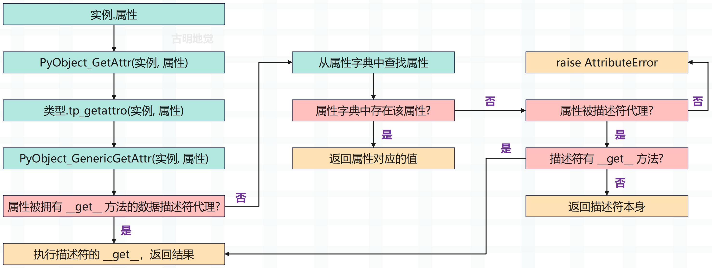

## 楔子

之前在讨论名字空间的时候提到，在 Python 中，形如 **x.y** 样式的表达式被称之为**属性引用**，其中 x 指向某个对象，y 为对象的某个属性。

那么下面来看看虚拟机是怎么实现属性引用的？

## 属性引用

还是看一个简单的类，然后观察它的字节码。

~~~Python
class Girl:
    
    def __init__(self):
        self.name = "satori"
        self.age = 16
        
    def get_info(self):
        return f"name: {self.name}, age: {self.age}"
    
g = Girl()
# 获取 name 属性
name = g.name
# 获取 get_info 方法并调用
g.get_info()
~~~

想要了解背后都发生了什么，最直接的途径就是查看字节码，这里只看模块对应的字节码。

~~~C
  // class Girl: 对应的字节码，这里就不赘述了
  0 LOAD_BUILD_CLASS
  2 LOAD_CONST               0 (<code object Girl at 0x7f9562476240, file "", line 2>)
  4 LOAD_CONST               1 ('Girl')
  6 MAKE_FUNCTION            0
  8 LOAD_CONST               1 ('Girl')
 10 CALL_FUNCTION            2
 12 STORE_NAME               0 (Girl)
      
  // g = Girl() 对应的字节码，不再赘述
 14 LOAD_NAME                0 (Girl)
 16 CALL_FUNCTION            0
 18 STORE_NAME               1 (g)

  // name = g.name 对应的字节码
  // 加载变量 g
 20 LOAD_NAME                1 (g)
  // 获取 g.name，加载属性用的是 LOAD_ATTR
 22 LOAD_ATTR                2 (name)
  // 将结果交给变量 name 保存
 24 STORE_NAME               2 (name)
  
  // g.get_info() 对应的字节码
  // 加载变量 g
 26 LOAD_NAME                1 (g)
  // 获取方法 g.get_info，加载方法用的是 LOAD_METHOD
 28 LOAD_METHOD              3 (get_info)
  // 调用方法，注意指令是 CALL_METHOD，不是 CALL_FUNCTION
  // 但显然 CALL_METHOD 内部也是调用了 CALL_FUNCTION
 30 CALL_METHOD              0
  // 从栈顶弹出返回值
 32 POP_TOP
 34 LOAD_CONST               2 (None)
 36 RETURN_VALUE
~~~

除了 LOAD_METHOD 和 LOAD_ATTR，其它的指令我们都见过了，因此下面重点分析这两条指令。

~~~C
case TARGET(LOAD_METHOD): {
    // 从符号表中获取符号，因为是 g.get_info
    // 那么这个 name 就指向字符串对象 "get_info"
    PyObject *name = GETITEM(names, oparg);
    // 获取栈顶元素 obj，显然这个 obj 就是代码中的实例对象 g
    PyObject *obj = TOP();
    // meth 是一个 PyObject * 指针，显然它要指向一个方法
    PyObject *meth = NULL;
    
    // 这里是获取和 "get_info" 绑定的方法，然后让 meth 指向它
    // 具体做法是调用 _PyObject_GetMethod，传入二级指针 &meth
    // 然后让 meth 存储的地址变成指向具体方法的地址
    int meth_found = _PyObject_GetMethod(obj, name, &meth);
    
    //如果 meth == NULL，raise AttributeError
    if (meth == NULL) {
        /* Most likely attribute wasn't found. */
        goto error;
    }
    
    // 注意：无论是 Girl.get_info、还是 g.get_info，对应的指令都是 LOAD_METHOD
    // 类去调用的话，说明得到的是一个未绑定的方法，说白了就等价于函数
    // 实例去调用的话，会得到一个绑定的方法，相当于对函数进行了封装
    // 关于绑定和未绑定我们后面会详细介绍
    if (meth_found) {
        // 如果 meth_found 为 1，说明 meth 是一个绑定的方法，obj 就是 self
        // 将 meth 设置为栈顶元素，然后再将 obj 压入栈中
        SET_TOP(meth);
        PUSH(obj);  // self
    }
    else {
        // 否则说明 meth 是一个未绑定的方法
        // 那么将栈顶元素设置为 NULL，然后将 meth 压入栈中
        SET_TOP(NULL);
        Py_DECREF(obj);
        PUSH(meth);
    }
    DISPATCH();
}
~~~

获取方法是 LOAD_METHOD 指令 ，获取属性则是 LOAD_ATTR 指令，来看一下。

~~~C
case TARGET(LOAD_ATTR): {
    // 可以看到和 LOAD_METHOD 本质上是类似的，但更简单一些
    // name 依旧是符号，这里指向字符串对象 "name"
    PyObject *name = GETITEM(names, oparg);
    // 从栈顶获取变量 g
    PyObject *owner = TOP();
    // res 显然就是属性的值了，即 g.name
    // 通过 PyObject_GetAttr 进行获取
    PyObject *res = PyObject_GetAttr(owner, name);
    Py_DECREF(owner);
    // 设置为栈顶元素
    SET_TOP(res);
    if (res == NULL)
        goto error;
    DISPATCH();
}
~~~

所以这两个指令本身是很简单的，而核心在 PyObject_GetAttr 和 _PyObject_GetMethod 上面，前者用于获取属性、后者用于获取方法。先来看一下 PyObject_GetAttr 具体都做了什么事情。

~~~C
// Objects/object.c
PyObject *
PyObject_GetAttr(PyObject *v, PyObject *name)
{
    // v: 对象，name: 属性名
    
    // 获取实例对象 v 的类型对象
    PyTypeObject *tp = Py_TYPE(v);
    // name 必须是一个字符串
    if (!PyUnicode_Check(name)) {
        PyErr_Format(PyExc_TypeError,
                     "attribute name must be string, not '%.200s'",
                     name->ob_type->tp_name);
        return NULL;
    }
    // 通过类型对象的 tp_getattro 字段获取实例对应的属性
    if (tp->tp_getattro != NULL)
        return (*tp->tp_getattro)(v, name);
    // tp_getattr 和 tp_getattro 功能一样，但后者可以支持中文
    if (tp->tp_getattr != NULL) {
        const char *name_str = PyUnicode_AsUTF8(name);
        if (name_str == NULL)
            return NULL;
        return (*tp->tp_getattr)(v, (char *)name_str);
    }
    // 属性不存在，抛出异常
    PyErr_Format(PyExc_AttributeError,
                 "'%.50s' object has no attribute '%U'",
                 tp->tp_name, name);
    return NULL;
}
~~~

PyTypeObject 里面定义了两个与属性访问相关的操作：tp_getattro 和 tp_getattr。其中前者是优先选择的属性访问动作，而后者已不推荐使用。这两者的区别在 PyObject_GetAttr 中已经显示得很清楚了，主要在属性名的使用上。

- tp_getattro 所使用的属性名是一个 PyUnicodeObject \*；
- 而 tp_getattr 所使用的属性名是一个 char \*。

如果这两个字段同时被定义，那么优先使用 tp_getattro。问题来了，自定义类对象的 tp_getattro 对应哪一个 C 函数呢？显然我们要去找 object。

object 在底层对应 PyBaseObject_Type，它的 tp_getattro 为 PyObject_GenericGetAttr，因此虚拟机在创建 Girl 这个类时，也会将此操作继承下来。

~~~C
// Objects/object.c
PyObject *
PyObject_GenericGetAttr(PyObject *obj, PyObject *name)
{
    return _PyObject_GenericGetAttrWithDict(obj, name, NULL, 0);
}

PyObject *
_PyObject_GenericGetAttrWithDict(PyObject *obj, PyObject *name,
                                 PyObject *dict, int suppress)
{
    // 拿到 obj 的类型对象，对于当前的例子来说，显然是 class Girl
    PyTypeObject *tp = Py_TYPE(obj);
    // 描述符
    PyObject *descr = NULL;
    // 返回值
    PyObject *res = NULL;
    // 描述符的 __get__ 
    descrgetfunc f;
    Py_ssize_t dictoffset;
    PyObject **dictptr;
    // name 必须是字符串
    if (!PyUnicode_Check(name)){
        PyErr_Format(PyExc_TypeError,
                     "attribute name must be string, not '%.200s'",
                     name->ob_type->tp_name);
        return NULL;
    }
    Py_INCREF(name);
    // 属性字典不为空，是初始化是否完成的重要标志
    // 如果为空，说明还没有初始化，那么需要先初始化
    if (tp->tp_dict == NULL) {
        if (PyType_Ready(tp) < 0)
            goto done;
    }
    // 从 mro 顺序列表中获取属性对应的值，并检测是否为描述符
    // 如果属性不存在、或者存在但对应的值不是描述符，则返回 NULL
    descr = _PyType_Lookup(tp, name);

    f = NULL;
    if (descr != NULL) {
        Py_INCREF(descr);
        // 如果 descr 不为 NULL，说明该属性被代理了
        // descr 是描述符，f 就是它的 __get__ 方法
        // f = descr.__class__.__get__ 
        f = descr->ob_type->tp_descr_get;
        // __get__ 对应 PyTypeObject 的 tp_descr_get
        // __set__ 对应 PyTypeObject 的 tp_descr_set  
        // 如果 f 不为 NULL，并且 descr 是数据描述符
        if (f != NULL && PyDescr_IsData(descr)) {
            // 那么直接调用描述符的 __get__ 方法，返回结果
            res = f(descr, obj, (PyObject *)obj->ob_type);
            if (res == NULL && suppress &&
                    PyErr_ExceptionMatches(PyExc_AttributeError)) {
                PyErr_Clear();
            }
            goto done;
        }
    }
    // 走到这里说明要获取的属性没有被代理，或者说代理它的是非数据描述符
    // 当然还有一种情况，这种情况上一篇文章貌似没提到
    // 就是属性被数据描述符代理，但是该数据描述符没有 __get__
    // 那么仍会优先从实例对象自身的 __dict__ 中寻找属性
    if (dict == NULL) {
        /* Inline _PyObject_GetDictPtr */
        dictoffset = tp->tp_dictoffset;
        // 如果 dict 为 NULL，并且 dictoffset 不为 0
        // 说明继承自变长对象，那么要调整 tp_dictoffset
        if (dictoffset != 0) {
            if (dictoffset < 0) {
                Py_ssize_t tsize;
                size_t size;

                tsize = ((PyVarObject *)obj)->ob_size;
                if (tsize < 0)
                    tsize = -tsize;
                size = _PyObject_VAR_SIZE(tp, tsize);
                _PyObject_ASSERT(obj, size <= PY_SSIZE_T_MAX);

                dictoffset += (Py_ssize_t)size;
                _PyObject_ASSERT(obj, dictoffset > 0);
                _PyObject_ASSERT(obj, dictoffset % SIZEOF_VOID_P == 0);
            }
            dictptr = (PyObject **) ((char *)obj + dictoffset);
            dict = *dictptr;
        }
    }
    // dict 不为 NULL，从属性字典中获取
    if (dict != NULL) {
        Py_INCREF(dict);
        res = PyDict_GetItemWithError(dict, name);
        if (res != NULL) {
            Py_INCREF(res);
            Py_DECREF(dict);
            goto done;
        }
        else {
            Py_DECREF(dict);
            if (PyErr_Occurred()) {
                if (suppress && PyErr_ExceptionMatches(PyExc_AttributeError)) {
                    PyErr_Clear();
                }
                else {
                    goto done;
                }
            }
        }
    }
    // 程序走到这里，说明什么呢？显然意味着实例的属性字典里面没有要获取的属性
    // 但如果下面的 f != NULL 成立，说明属性被代理了
    // 并且代理属性的描述符是非数据描述符，它的优先级低于实例
    // 所以实例会先到自身的属性字典中查找，找不到再去执行描述符的 __get__
    if (f != NULL) {
        // 第一个参数是描述符本身，也就是 __get__ 里面的 self
        // 第二个参数是实例对象，也就是 __get__ 里面的 instance
        // 第三个参数是类对象，也就是 __get__ 里面的 owner
        res = f(descr, obj, (PyObject *)Py_TYPE(obj));
        if (res == NULL && suppress &&
                PyErr_ExceptionMatches(PyExc_AttributeError)) {
            PyErr_Clear();
        }
        goto done;
    }
    // 程序能走到这里，说明属性字典里面没有要找的属性，并且也没有执行描述符的 __get__
    // 但如果 describe 还不为 NULL，这说明什么呢？
    // 显然该属性仍被描述符代理了，只是这个描述符没有 __get__，如果是这种情况，那么会返回描述符本身
    if (descr != NULL) {
        res = descr;
        descr = NULL;
        goto done;
    }
    // 找不到，就报错
    if (!suppress) {
        PyErr_Format(PyExc_AttributeError,
                     "'%.50s' object has no attribute '%U'",
                     tp->tp_name, name);
    }
  done:
    Py_XDECREF(descr);
    Py_DECREF(name);
    return res;
}
~~~

这里面有两个我们上一篇文章没有提到的地方，下面补充一下：

~~~Python
class Descriptor:

    def __set__(self, instance, value):
        print("__set__")

class B:
    name = Descriptor()

b = B()
# b 的属性字典没有 name，描述符也没有 __get__
# 那么这个时候会返回描述符本身
print(b.name)  # <__main__.Descriptor object at 0x0...>

# 此时属性字典里面有 name 了
b.__dict__["name"] = "古明地觉"
# 由于 name 是被数据描述符代理的，按理说获取属性时会执行数据描述符的 __get__
# 但是这个数据描述符压根没有 __get__，因此还是会从属性字典中查找
print(b.name)  # 古明地觉
~~~

以上就是获取属性的逻辑，很好理解，用一张流程图总结一下。

获取方法也与之类似，调用的是 \_PyObject\_GetMethod，这里就不再看了。

## 再论描述符

前面我们看到，在 PyType_Ready 中，虚拟机会填充 tp_dict，其中与操作名对应的是一个个的描述符。那时我们看到的是描述符这个概念在 Python 内部是如何实现的，现在我们将要剖析的是描述符在 Python 的类机制中究竟会起到怎样的作用。

虚拟机对自定义类对象或实例对象进行属性访问时，描述符将对属性访问的行为产生重大影响。一般而言，如果一个类存在 \_\_get\_\_、\_\_set\_\_、\_\_delete\_\_ 操作（不要求三者同时存在），那么它的实例便可以称之为描述符。在 slotdefs 中，我们会看到这三种魔法方法对应的操作。

~~~C
TPSLOT("__get__", tp_descr_get, slot_tp_descr_get, wrap_descr_get,
           "__get__($self, instance, owner, /)\n--\n\nReturn an attribute of instance, which is of type owner."),
TPSLOT("__set__", tp_descr_set, slot_tp_descr_set, wrap_descr_set,
       "__set__($self, instance, value, /)\n--\n\nSet an attribute of instance to value."),
TPSLOT("__delete__", tp_descr_set, slot_tp_descr_set,
       wrap_descr_delete,
       "__delete__($self, instance, /)\n--\n\nDelete an attribute of instance."),
~~~

而在虚拟机访问实例对象的属性时，描述符的一个作用就是影响虚拟机对属性的选择。从 PyObject_GenericGetAttr 源码中可以看到，虚拟机会先在实例对象自身的 \_\_dict\_\_ 中寻找属性，也会在实例对象的类型对象的 mro 顺序列表中寻找属性，我们将前一种属性称之为**实例属性**，后一种属性称之为**类属性**。所以在属性的选择上，有如下规律：

- 虚拟机优先按照实例属性、类属性的顺序选择属性，即实例属性优先于类属性；
- 如果发现有一个同名、并且被数据描述符代理的类属性，那么该描述符会优先于实例属性被虚拟机选择；

这两条规则在对属性进行设置时仍然会被严格遵守，换句话说，如果执行 ins.xxx = yyy 时，在 type(ins) 中也出现了 xxx 属性、并且还被数据描述符代理了。那么不好意思，此时虚拟机会选择描述符，并执行它的 \_\_set\_\_ 方法；如果是非数据描述符，那么就不再走 \_\_set\_\_ 了，而是设置属性（因为压根没有 \_\_set\_\_），也就是 a.\_\_dict\_\_['xxx'] = yyy。

## 小结

以上就是实例对象的属性访问，但是还没结束，我们下一篇文章来重点讨论一下 self。

----

&nbsp;

**欢迎大家关注我的公众号：古明地觉的编程教室。**

**如果觉得文章对你有所帮助，也可以请作者吃个馒头，Thanks♪(･ω･)ﾉ。**

