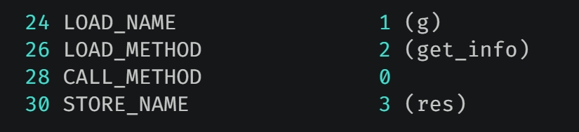
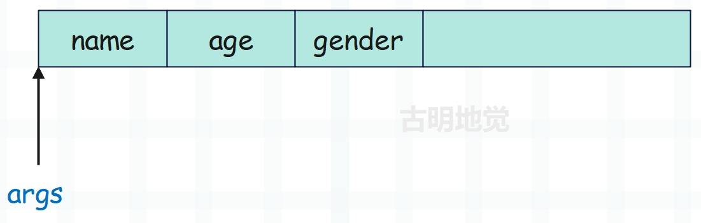
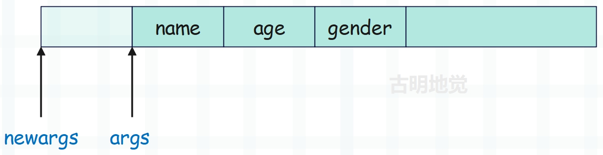
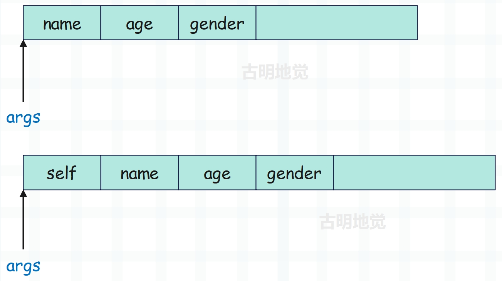

## 楔子

上一篇文章介绍了实例对象的属性访问，那么本篇文章来讨论一下 self。我们知道实例在调用方法时，会自动将自身传给 self 参数，那么你有没有想过这背后的原理呢？下面就来详细分析一下。

## 函数变身

还是以之前的代码为例：

~~~Python
class Girl:

    def __init__(self, name, age):
        self.name = name
        self.age = age

    def get_info(self):
        return f"name = {self.name}, age = {self.age}"

g = Girl("satori", 16)
res = g.get_info()
print(res)  # name = satori, age = 16
~~~

我们在调用 g.get_info 的时候，并没有给 self 传递参数，那么 self 到底是不是真正有效的参数呢？还是说它仅仅只是一个语法意义上的占位符而已？

不用想，self 肯定是货真价实的参数，只不过自动帮你传递了。根据使用 Python 的经验，我们知道第一个参数就是实例本身，那么这是怎么实现的呢？想要弄清这一点，还是要从字节码入手。而调用方法的字节码是 CALL_METHOD，那么玄机就隐藏在这里面。

调用时的指令参数是 0，表示不需要传递参数。注意：这里说的不需要传递参数，指的是不需要我们手动传递。

~~~C
case TARGET(CALL_METHOD): {
    PyObject **sp, *res, *meth;
    // 栈指针，指向运行时栈的栈顶
    sp = stack_pointer;    
    meth = PEEK(oparg + 2);
    // 如果 meth 为 NULL，说明是函数
    if (meth == NULL) {
        // 运行时栈从栈底到栈顶：NULL、callable、arg1、arg2、...、argN
        res = call_function(tstate, &sp, oparg, NULL);
        stack_pointer = sp;
        (void)POP(); /* POP the NULL. */
    }
    // 否则说明是方法
    else {
        // 运行时栈从栈底到栈顶：method、self、arg1、arg2、...、argN
        res = call_function(tstate, &sp, oparg + 1, NULL);
        stack_pointer = sp;
    }

    PUSH(res);
    if (res == NULL)
        goto error;
    DISPATCH();
}

~~~

为了对比，我们再把 CALL_FUNCTION 指令的源码贴出来。

~~~C
case TARGET(CALL_FUNCTION): {
    PREDICTED(CALL_FUNCTION);
    PyObject **sp, *res;
    sp = stack_pointer;
    res = call_function(tstate, &sp, oparg, NULL);
    stack_pointer = sp;
    PUSH(res);
    if (res == NULL) {
        goto error;
    }
    DISPATCH();
}
~~~

通过对比发现了端倪，这两者都调用了 call_function，但是传递的参数不一样。如果是类调用，那么这两个指令是等价的；但如果是实例调用，CALL_METHOD 的第三个参数是 oparg + 1，而 CALL_FUNCTION 是 oparg。

背后的原因不需要多说，因为实例在调用时会将自身传给 self，所以参数个数应该是 oparg + 1。但是这还不足以支持我们找出问题所在，如果你仔细看一下函数的类型对象 PyFunction_Type，会发现里面隐藏着一个秘密。

~~~C
PyTypeObject PyFunction_Type = {
    PyVarObject_HEAD_INIT(&PyType_Type, 0)
    "function",
    sizeof(PyFunctionObject),
    //...
    //...
    
    //注意注意注意，看下面这行
    func_descr_get,                          /* tp_descr_get */
    0,                                       /* tp_descr_set */
    offsetof(PyFunctionObject, func_dict),   /* tp_dictoffset */
    0,                                       /* tp_init */
    0,                                       /* tp_alloc */
    func_new,                                /* tp_new */
};
~~~

我们说 tp_descr_get 对应 \_\_get\_\_，而它被设置成了 func_descr_get，这意味着函数是一个描述符，因为它的类型对象实现了 \_\_get\_\_。

~~~python
def func():
    pass

print(func.__get__)
"""
<method-wrapper '__get__' of function object at 0x...>
"""
~~~

同理，实例对象 g 在调用 get_info 之前，肯定要先获取 get_info。而在获取的时候，显然会执行 get_info 的 \_\_get\_\_。也就是说，g.get_info 会得到什么，取决于 get_info 的 \_\_get\_\_ 会返回什么。那么函数的 \_\_get\_\_ 会返回什么呢？显然这要去 func_descr_get 函数中一探究竟。

~~~C
// Objects/funcobject.c
static PyObject *
func_descr_get(PyObject *func, PyObject *obj, PyObject *type)
{  
    // 如果是类获取函数：那么 obj 为 NULL，type 为类对象本身
    // 如果是实例获取函数：那么 obj 为实例，type 仍是类对象本身
    
    // 如果 obj 为空，说明是类获取
    // 那么直接返回 func 本身, 也就是原来的函数
    if (obj == Py_None || obj == NULL) {
        Py_INCREF(func);
        return func;
    }
    // 如果是实例对象，那么调用 PyMethod_New 
    // 将函数和实例绑定在一起，得到一个 PyMethodObject 对象 
    return PyMethod_New(func, obj);
}
~~~

函数对应的结构体是 PyFunctionObject，那么 PyMethodObject 是啥应该不需要我说了，显然就是方法对应的结构体。所以类里面定义的就是单纯的函数，通过类去调用的话，和调用一个普通函数并无区别。

但是实例调用就不一样了，实例在拿到类的成员函数时，会先调用 PyMethod_New 将函数包装成方法，然后再对方法进行调用。

~~~Python
class Girl:

    def __init__(self, name, age):
        self.name = name
        self.age = age

    def get_info(self):
        return f"name = {self.name}, age = {self.age}"

g = Girl("satori", 16)
print(Girl.get_info.__class__)
print(g.get_info.__class__)
"""
<class 'function'>
<class 'method'>
"""
~~~

在获取 get_info 时，会发现它被描述符代理了，而描述符就是成员函数本身。因为类型对象 PyFunction_Type 实现了 tp_descr_get，即 \_\_get\_\_，所以它的实例对象（函数）本质上就是个描述符。

因此无论是类还是实例，在调用时都会执行 func_descr_get。如果是类调用，那么实例 obj 为空，于是会将成员函数直接返回，因此类调用的就是函数本身。如果是实例调用，则执行 PyMethod_New，将 PyFunctionObject 包装成 PyMethodObject，然后调用，因此实例调用的是方法。

那么问题来了，方法在底层长什么样呢？可以肯定的是，方法也是一个对象，一个 PyObject。

~~~C
// Include/classobject.h
typedef struct {
    PyObject_HEAD
    // 可调用的 PyFunctionObject 对象
    PyObject *im_func;  
    // self 参数，即实例对象
    PyObject *im_self;   
    // 弱引用列表，不做深入讨论
    PyObject *im_weakreflist;
    // 速度更快的矢量调用，因为方法和函数一样，肯定是要被调用的
    // 所以它们都自己实现了一套调用方式：vectorcallfunc
    // 而没有走类型对象的 tp_call
    vectorcallfunc vectorcall;
} PyMethodObject;
~~~

所以方法就是对函数的一个封装，我们用 Python 举例说明：

~~~Python
class Girl:

    def __init__(self, name, age):
        self.name = name
        self.age = age

    def get_info(self):
        return f"name = {self.name}, age = {self.age}"

g = Girl("satori", 16)

# 方法是对函数的封装
# 只不过里面不仅仅有函数，还有实例
method = g.get_info
# 拿到的是实例本身
print(method.__self__ is g)  # True
# 拿到的是成员函数，也就是 Girl.get_info
print(method.__func__ is Girl.get_info)  # True

print(
    method()
    == 
    Girl.get_info(g)
    ==
    method.__func__(method.__self__)
)  # True
~~~

而方法是在 PyMethod_New 中创建的，再来看看这个函数。

~~~C
// Objects/classobjet.c
PyObject *
PyMethod_New(PyObject *func, PyObject *self)
{
    PyMethodObject *im;
    if (self == NULL) {
        PyErr_BadInternalCall();
        return NULL;
    }
    // 缓存池
    im = free_list;
    if (im != NULL) {
        free_list = (PyMethodObject *)(im->im_self);
        (void)PyObject_INIT(im, &PyMethod_Type);
        numfree--;
    }
    // 缓冲池如果空了，直接创建 PyMethodObject 对象
    else {
        // 可以看到方法的类型在底层是 &PyMethod_Type
        im = PyObject_GC_New(PyMethodObject, &PyMethod_Type);
        if (im == NULL)
            return NULL;
    }
    im->im_weakreflist = NULL;
    Py_INCREF(func);
    // im_func 指向 PyFunctionObject 对象
    im->im_func = func;
    Py_XINCREF(self);
    // im_self 指向实例对象
    im->im_self = self;
    // 会通过 method_vectorcall 来对方法进行调用
    im->vectorcall = method_vectorcall;
    // 被 GC 跟踪
    _PyObject_GC_TRACK(im);
    return (PyObject *)im;
}
~~~

在 PyMethod_New 中，分别将 im_func，im_self 设置为函数、实例。因此通过 PyMethod_New 将函数、实例结合在一起，得到的 PyMethodObject 就是方法。并且我们还看到了 free_list，说明方法也使用了缓存池。

所以不管是类还是实例，获取成员函数时都会走描述符的 func_descr_get，然后在里面会判断是类获取还是实例获取。如果是类获取，直接返回函数本身；如果是实例获取，则通过 PyMethod_New 将函数和实例绑定起来得到方法，这个过程称为成员函数的绑定。

当然啦，调用方法本质上还是调用方法里面的 im_func，也就是函数。只不过会处理自动传参的逻辑，将内部的 im_self（实例）和我们传递的参数组合起来（如果没有传参，那么只有一个 im_self），然后整体传递给 im_func。

所以为什么实例调用方法的时候会自动传递第一个参数，此刻算是真相大白了。当然啦，以上只能说从概念上理解了，但是源码还没有看，下面就来看看具体的实现细节。

## 方法调用

通过字节码，我们知道 LOAD_METHOD 指令结束之后，便开始执行 CALL_METHOD。它和 CALL_FUNCTION 之间最大的区别就是：

- CALL_METHOD 针对的是 PyMethodObject 对象；
- CALL_FUNCTION 针对的是 PyFunctionObject 对象。

但是这两个指令调用的都是 call_function 函数，然后内部执行的也都是 Girl.get_info。因为执行方法，本质上还是执行方法里面的 im_func，只不过会自动将 im_self 和我们传递的参数组合起来，一起传给 im_func。

> **假设 obj 是 cls 的实例对象，那么 obj.xxx() 在底层会被翻译成 cls.xxx(obj)，前者只是后者的语法糖。**

然后在 PyMethod_New 中，我们看到虚拟机给 `im->vectorcall` 赋值为 method_vectorcall，而方法调用的秘密就隐藏在里面。

~~~C
// Objects/classobject.c
static PyObject *
method_vectorcall(PyObject *method, PyObject *const *args,
                  size_t nargsf, PyObject *kwnames)
{
    assert(Py_TYPE(method) == &PyMethod_Type);
    PyObject *self, *func, *result;
    // 实例对象 self
    self = PyMethod_GET_SELF(method);
    // 方法里的成员函数
    func = PyMethod_GET_FUNCTION(method);
    // 参数个数
    Py_ssize_t nargs = PyVectorcall_NARGS(nargsf);

    //...   
        // 这里的代码比较有趣，一会单独说
        // 总之它的逻辑就是将 self 和我们传递的参数组合起来
        // 通过 _PyObject_Vectorcall 对 func 进行调用
        // 所以 method_vectorcall 只是负责组装参数
        // 真正执行的依旧是 PyFunctionObjec 的 _PyObject_Vectorcall 
        PyObject **newargs = (PyObject**)args - 1;
        nargs += 1;
        PyObject *tmp = newargs[0];
        newargs[0] = self;
        result = _PyObject_Vectorcall(func, newargs, nargs, kwnames);
        newargs[0] = tmp;
    //...
    return result;
}
~~~

再来说说里面的具体细节，假设我们调用的不是方法，而是一个普通的函数，并且依次传入了 name、age、gender 三个参数，那么此时的运行时栈如下：

_PyObject_Vectorcall 的第一个参数就是要调用的函数 func；第二个参数是 args，指向给函数 func 传递的首个参数，至于到底给 func 传了多少个，则由第三个参数 nargs 指定。

但如果调用的不是函数，而是方法呢？我们仍以传入 name、age、gender 三个参数为例，解释一下源码的具体细节。

首先是 PyObject \*\*newargs = (PyObject \*\*)args - 1; ，这意味着什么呢？

然后 nargs += 1; 表示参数个数加 1，这很好理解，因为多了一个 self。

PyObject \*tmp = newargs[0]; 做的事情也很简单，相当于将 name 的前一个元素保存了起来，赋值为 tmp。

关键来了，newargs[0] = self; 会将 name 的前一个元素设置为实例 self，此时运行时栈如下：

然后调用 _PyObject_Vectorcall，显然第二个参数就变成了 newargs，因为 name 前面多了一个 self，所以现在是 newargs 指向函数 func 的首个参数。而从 Python 的角度来说，就是将**实例**和**我们给 func 传入的参数**组装了起来。

调用完之后拿到返回值，非常 Happy。但需要注意的是，从内存布局上来讲，**参数 name** 的前面是没有 self 的容身之处的。而 self 之所以能挤进去，是因为它把**参数 name** 的前一个元素给顶掉了，至于被顶掉的元素到底是啥我们不得而知，也无需关注，它有可能是 free 区域里面的某个元素。总之关键的是，函数 func 调用完之后，还要再换回来，否则在逻辑上就相当于越界了。

所以通过 newargs[0] = tmp; 将 name 的前一个元素再替换回来。

但相比上面这种做法， 其实还有一个更通用的办法。

将我们传递的参数都向后移动一个位置，然后空出来的第一个位置留给 self，这样也是可以的。但很明显，此做法的效率不高，因为这是一个 O(N) 操作，而源码中的做法是 O(1)。所以底层实现一定要讲究效率，采用各种手段极限优化。因为 Python 语言的设计模式就决定了它的运行效率注定不高，如果虚拟机源码再写的不好的话，那么运行速度就真的不能忍了。

总结一下上面的内容，函数调用和方法调用本质上是一样的。方法里面的 im_func 字段指向一个函数，调用方法的时候底层还是会调用函数，只不过在调用的时候会自动把方法里面的 im_self 作为第一个参数传到函数里面去。而类在调用的时候，所有的参数都需要手动传递。

> 还是那句话：obj.xxx() 本质上就是 cls.xxx(obj)；而 cls.xxx() 仍是 cls.xxx()。

**因此到了这里，我们可以在更高的层次俯视一下 Python 的运行模型了，最核心的模型非常简单，可以简化为两条规则：**

- 1）在某个名字空间中寻找符号对应的对象
- 2）对得到的对象进行某些操作

抛开面向对象这些花里胡哨的外表，其实我们发现自定义类对象就是一个名字空间，实例对象也是一个名字空间。只不过这些名字空间通过一些特殊的规则连接在一起，使得符号的搜索过程变得复杂，从而实现了面向对象这种编程模式。

## bound method 和 unbound method

当对成员函数进行引用时，会有两种形式：bound method 和 unbound method。

- bound method：被绑定的方法，说白了就是方法，PyMethodObject。比如实例获取成员函数，拿到的就是方法。
- unbound method：未被绑定的方法，说白了就是成员函数本身。比如类获取成员函数，拿到的还是成员函数本身，只不过对应的指令也是 LOAD_METHOD，所以叫未被绑定的方法。

因此 bound method 和 unbound method 的本质区别就在于成员函数有没有和实例绑定在一起，成为方法。前者完成了绑定动作，而后者没有完成绑定动作。

~~~C
// Objects/funcobject.c
static PyObject *
func_descr_get(PyObject *func, PyObject *obj, PyObject *type)
{  
    // obj：相当于 __get__ 里面的 instance
    // type：相当于 __get__ 里面的 owner
    
    // 类获取成员函数，obj 为空，直接返回成员函数
    // 所以它也被称为是 "未被绑定的方法"
    if (obj == Py_None || obj == NULL) {
        Py_INCREF(func);
        return func;
    }
    // 实例获取，则会先通过 PyMethod_New 将成员函数 func 和实例 obj 绑定在一起 
    // 返回的结果被称为 "被绑定的方法"，简称方法 
    // 而 func 会交给方法的 im_func 字段保存，obj 则会交给方法的 im_self 字段保存 
    // im_func 和 im_self 对应 Python 里面的 __func__ 和 __self__ 
    return PyMethod_New(func, obj);
}
~~~

我们用 Python 演示一下：

~~~Python
class Girl(object):

    def get_info(self):
        print(self)

g = Girl()
Girl.get_info(123)  # 123
# 我们看到即便传入一个 123 也是可以的
# 这是我们自己传递的，传递什么就是什么

g.get_info()  # <__main__.A object at 0x00...>
# 但 g.get_info() 就不一样了，它是 Girl.get_info(g) 的语法糖

# 被绑定的方法，说白了就是方法
# 方法的类型为 <class 'method'>，在底层对应 &PyMethod_Type
print(g.get_info)  # <bound method Girl.get_info of ...>
print(g.get_info.__class__)  # <class 'method'>

# 未被绑定的方法，这个叫法只是为了和"被绑定的方法"形成呼应
# 说白了它就是个成员函数，类型为 <class 'function'>
print(Girl.get_info)  # <function Girl.get_info at 0x00...>
print(Girl.get_info.__class__)  # <class 'function'>
~~~

我们说成员函数和实例绑定，会得到方法，这是没错的。但是成员函数不仅仅可以和实例绑定，和类绑定也是可以的。

~~~Python
class Girl(object):

    @classmethod
    def get_info(cls):
        print(cls)

print(Girl.get_info)  
print(Girl().get_info)
"""
<bound method Girl.get_info of <class '__main__.Girl'>>
<bound method Girl.get_info of <class '__main__.Girl'>>
"""

# 无论是实例调用还是类调用，第一个参数传进去的都是类
Girl.get_info()  
Girl().get_info()
"""
<class '__main__.Girl'>
<class '__main__.Girl'>
"""
~~~

此时通过类去调用得到的不再是一个函数，而是一个方法，这是因为我们加上了 classmethod 装饰器。加上装饰器之后，get_info 就不再是原来的函数了，而是 **classmethod(get_info)**，也就是 classmethod 的实例对象。

然后 classmethod 在 Python 里面是一个类，它在底层对应的是 &PyClassMethod_Type，而 classmethod 的实例对象在底层对应的结构体也叫 classmethod。

~~~C
// Objects/funcobject.c
typedef struct {
    PyObject_HEAD
    PyObject *cm_callable;
    PyObject *cm_dict;
} classmethod;
~~~

由于 &PyClassMethod_Type 内部实现了 tp_descr_get，所以它的实例对象是一个描述符。

此时调用 get_info 会执行 \<class 'classmethod'\> 的 \_\_get\_\_，看一下 cm_descr_get 的具体实现：

~~~C
// Objects/funcobject.c
static PyObject *
cm_descr_get(PyObject *self, PyObject *obj, PyObject *type)
{
    // 这里的 self 就是 Python 里面的类 classmethod 的实例
    // 只不过在虚拟机中，它的实例对应的结构体也叫 classmethod
    classmethod *cm = (classmethod *)self;

    if (cm->cm_callable == NULL) {
        PyErr_SetString(PyExc_RuntimeError,
                        "uninitialized classmethod object");
        return NULL;
    }
    // 如果 type 为空，让 type = Py_TYPE(obj)
    // 所以不管是类调用还是实例调用，第一个参数都是类
    if (type == NULL)
        type = (PyObject *)(Py_TYPE(obj));
    return PyMethod_New(cm->cm_callable, type);
}
~~~

所以当类在调用的时候，类也和函数绑定起来了，因此也会得到一个方法。不过被 classmethod 装饰之后，即使是实例调用，第一个参数传递的还是类本身，因为和函数绑定的是类、而不是实例。

但不管和函数绑定的是类还是实例，绑定之后的结果都叫**方法**。所以得到的究竟是函数还是方法，就看这个函数有没有和某个对象进行绑定，只要绑定了，那么它就会变成方法。至于调用我们就不赘述了，上面已经说过了。不管和函数绑定的是类还是实例，调用方式不变，唯一的区别就是第一个参数不同。

## 千变万化的描述符

当我们通过对象调用成员函数时，最关键的一个动作就是从 PyFunctionObject 对象到 PyMethodObject 对象的转变，而这个关键的转变就取决于描述符。当我们访问对象的被代理属性时，由于描述符的存在，这种转变自然而然地就发生了。

事实上，Python 的描述符很强大，我们可以使用它做很多事情。而在虚拟机层面，也存在各种各样的描述符，比如 property 实例、staticmethod 实例、classmethod 实例等等。这些描述符给 Python 的类机制赋予了强大的力量，具体源码就不分析了，可以参照上面介绍的 classmethod，我们直接在 Python 的层面，演示一下这三种描述符的具体用法。

### property

property 可以让我们像访问属性一样去调用一个方法，举个栗子：

~~~Python
class Girl:

    def __init__(self):
        self.name = "satori"
        self.age = 16

    @property
    def get_info(self):
        return f"name: {self.name}, age: {self.age}"

g = Girl()
print(g.get_info)  # name: satori, age: 16
print(Girl.get_info)  # <property object at 0x00...>
~~~

我们并没有调用 get_info，结果它自动就调用了，就像访问属性一样。并且 property 是为实例对象准备的，如果是类调用，返回的就是描述符本身。那么这是怎么实现的呢？我们来演示一下。

~~~Python
class MyProperty:

    def __init__(self, func):
        self.func = func

    def __get__(self, instance, owner):
        # 当实例访问 get_info 的时候，本来应该被包装成方法的
        # 但是现在被新的描述符代理了，所以会执行此处的 __get__
        if instance is None:
            # 如果 instance 为 None，证明是类调用，直接返回描述符本身
            return self
        # 否则调用 self.func，也就是 Girl 里面的 get_info
        # 等价于 Girl.get_info(g)
        self.func(instance)

class Girl:

    def __init__(self):
        self.name = "satori"
        self.age = 16

    # 等价于 get_info = MyProperty(get_info)
    # 所以此时的 get_info 就被描述符代理了
    @MyProperty
    def get_info(self):
        return f"name: {self.name}, age: {self.age}"

g = Girl()
print(g.get_info)  # name: satori, age: 16
print(Girl.get_info)  # <__main__.MyProperty object at 0x00...>
~~~

但是内置的 property 功能远不止这么简单。

~~~Python
class Girl:

    def __init__(self):
        self.__name = None

    def fget(self):
        return self.__name

    def fset(self, value):
        self.__name = value

    def fdelete(self):
        print("属性被删了")
        del self.__name

    user_name = property(fget, fset, fdelete, doc="这是 property")

    
g = Girl()
# 执行 fget
print(g.user_name)  # None
# 执行 fset
g.user_name = "satori"
print(g.user_name)  # satori
# 执行 fdelete
del g.user_name  # 属性被删了
~~~

如果我们也想实现这个功能，该怎么做呢？

~~~Python
class MyProperty:

    def __init__(self, fget=None, fset=None,
                 fdelete=None, doc=None):
        self.fget = fget
        self.fset = fset
        self.fdelete = fdelete
        self.doc = doc

    def __get__(self, instance, owner):
        # Girl.fget(g)
        if isinstance is None:
            return self
        return self.fget(instance)

    def __set__(self, instance, value):
        # Girl.fset(g, value)
        return self.fset(instance, value)

    def __delete__(self, instance):
        # Girl.fdelete(g)
        return self.fdelete(instance)

class Girl:

    def __init__(self):
        self.__name = None

    def fget(self):
        return self.__name

    def fset(self, value):
        self.__name = value

    def fdelete(self):
        print("属性被删了")
        del self.__name

    user_name = MyProperty(fget, fset, fdelete, doc="这是property")

g = Girl()
# 执行 fget
print(g.user_name)  # None
# 执行 fset
g.user_name = "satori"
print(g.user_name)  # satori
# 执行 fdelete
del g.user_name  # 属性被删了
~~~

可以看到，自定义的 MyProperty 和内置的 property 的表现是一致的。但是 property 还支持使用装饰器的方式。

~~~Python
class Girl:

    def __init__(self):
        self.__name = None

    @property
    def user_name(self):
        return self.__name

    @user_name.setter
    def user_name(self, value):
        self.__name = value

    @user_name.deleter
    def user_name(self):
        print("属性被删了")
        del self.__name

g = Girl()
print(g.user_name)  # None
g.user_name = "satori"
print(g.user_name)  # satori
del g.user_name  # 属性被删了
~~~

如果我们想实现这一点也很简单。

~~~Python
class MyProperty:

    def __init__(self, fget=None, fset=None,
                 fdelete=None, doc=None):
        self.fget = fget
        self.fset = fset
        self.fdelete = fdelete
        self.doc = doc

    def __get__(self, instance, owner):
        # 执行 @MyProperty 的时候
        # 被 MyProperty 装饰的 user_name 会赋值给 self.fget
        # 然后返回的 MyProperty(user_name) 会重新赋值给 user_name
        if instance is None:
            return self
        return self.fget(instance)

    def __set__(self, instance, value):
        return self.fset(instance, value)

    def __delete__(self, instance):
        return self.fdelete(instance)

    def setter(self, func):
        # 调用 @user_name.setter，创建一个新的描述符
        # 其它参数不变，但是第二个参数 fset 变为接收的 func
        return type(self)(self.fget, func, self.fdelete, self.doc)

    def deleter(self, func):
        # 调用 @user_name.deleter，创建一个新的描述符
        # 其它参数不变，但是第三个参数 fdelete 变为接收的 func
        return type(self)(self.fget, self.fset, func, self.doc)

class Girl:

    def __init__(self):
        self.__name = None

    # user_name = MyProperty(user_name)
    # 调用时会触发描述符的 __get__
    @MyProperty
    def user_name(self):
        return self.__name

    # 被一个新的描述符所代理，这个描述符实现了__set__
    # 给 g.user_name 赋值时，会触发 __set__
    @user_name.setter
    def user_name(self, value):
        self.__name = value

    # 被一个新的描述符所代理，这个描述符实现了 __delete__
    # 删除 g.user_name 时，会触发 __delete__
    @user_name.deleter
    def user_name(self):
        print("属性被删了")
        del self.__name

g = Girl()
print(g.user_name)  # None
g.user_name = "satori"
print(g.user_name)  # satori
del g.user_name  # 属性被删了

# 当然啦，user = MyProperty(...) 这种方式也是支持的
~~~

以上我们就手动实现了 property，虽然都知道怎么用，但当让你手动实现的时候，一瞬间是不是有点懵呢？

### staticmethod

实例在获取成员函数时，会将其包装成方法，并在调用时将自身作为第一个参数传进去。但如果函数被 staticmethod 装饰，那么实例和类一样，在获取的时候拿到的就是函数本身。

~~~Python
class Girl:

    def __init__(self):
        self.name = "satori"
        self.age = 16

    # 被装饰之后，就是一个普通的函数
    @staticmethod
    def get_info():
        return "info"

g = Girl()
print(g.get_info is Girl.get_info)  # True
print(g.get_info)  # <function Girl.get_info at 0x00...>
print(g.get_info())  # info
~~~

并且实例在调用的时候也不会将自身传进去了。然后我们来看看如何手动实现 staticmethod。

~~~Python
class StaticMethod:

    def __init__(self, func):
        self.func = func

    def __get__(self, instance, owner):
        # 静态方法的话，类和实例都可以用
        # 因此不管是实例还是类，调用时直接返回 self.func 即可
        # 这里的 self.func 就是 Girl.get_info
        return self.func

class Girl:

    def __init__(self):
        self.name = "satori"
        self.age = 16

    @StaticMethod
    def get_info():
        return "info"

g = Girl()
print(g.get_info is Girl.get_info)  # True
print(g.get_info)  # <function Girl.get_info at 0x00...>
print(g.get_info())  # info
~~~

如果不是静态方法的话，那么 g.get_info() 本质上就是 Girl.get_info(g)。但现在我们不希望实例调用时将自身传过去，那么就让 g 在获取 get_info 时，返回 Girl.get_info 即可。

由于静态方法在调用时不会自动传参，那么也就意味着不需要使用 self 内部的属性。换言之，如果一个方法里面没有使用 self，那么它应该被声明为静态的。

在 get_info 里面直接返回了一个字符串，没有用到 self，那么第一个参数就是个摆设。所以 PyCharm 提示你，这个方法可以考虑声明为静态的。当然啦，此时是否静态都不影响，都能够正常调用。

### classmethod

这个之前已经介绍过了，直接看代码吧。

~~~Python
class Girl:
    name = "koishi"
    age = 15

    def __init__(self):
        self.name = "satori"
        self.age = 16

    @classmethod
    def get_info(cls):
        # 此时拿到的是类属性
        return f"name: {cls.name}, age: {cls.age}"

g = Girl()
print(g.get_info())  # name: koishi, age: 15
print(Girl.get_info())  # name: koishi, age: 15
~~~

一旦被 classmethod 装饰，那么就变成了类方法，此时无论是实例调用还是类调用，都会将类作为第一个参数传进去。由于传递的第一个参数是类，所以第一个参数的名称不再叫 self，而是叫 cls。当然，名字啥的都无所谓，没有影响，只是按照规范应该这么做。

然后我们用 Python 来模拟一下。

~~~Python
from functools import wraps

class ClassMethod:

    def __init__(self, func):
        self.func = func

    def __get__(self, instance, owner):
        # 返回一个闭包，然后当调用的时候，接收参数
        @wraps(self.func)
        def inner(*args, **kwargs):
            # 调用的时候，手动将类、也就是 owner 传递进去
            # 所以我们看到，函数被 classmethod 装饰之后
            # 即使是实例调用，第一个参数传递的还是类本身
            return self.func(owner, *args, **kwargs)
        return inner

class Girl:
    name = "koishi"
    age = 15

    def __init__(self):
        self.name = "satori"
        self.age = 16

    @ClassMethod
    def get_info(cls):
        return f"name: {cls.name}, age: {cls.age}"

g = Girl()
print(g.get_info())  # name: koishi, age: 15
print(Girl.get_info())  # name: koishi, age: 15
~~~

类方法是为类准备的，但是实例也可以调用。

另外，类方法一般都用在初始化上面，举个栗子：

~~~Python
class Girl:

    def __init__(self, name, age):
        self.name = name
        self.age = age

    @classmethod
    def create_girl(cls, name, age):
        return cls(name, age)

    def get_info(self):
        return f"name: {self.name}, age: {self.age}"

g1 = Girl("satori", 16)
g2 = Girl.create_girl("koishi", 15)
print(g1.get_info())  # name: satori, age: 16
print(g2.get_info())  # name: koishi, age: 15
~~~

然后静态方法和类方法在继承的时候，也会直接继承过来。比如在调用父类的方法时，发现这是一个静态方法，那么得到的也是静态方法；同理，类方法和 property 亦是如此。

## 小结

以上我们就探讨了为什么实例调用方法时，会自动将自身传给 self，说白了就是因为描述符机制。像 property、staticmethod、classmethod 等等都是通过描述符来实现的，描述符在 Python 里面是一个很强大的机制，但使用的频率却不高，更多的是在一些框架的源码中出现。

到此，类相关的内容就算全部介绍完了，算是历经九九八十一难吧。当然啦，由于虚拟机是一个非常庞大的工程，这里无法涉及到边边角角的每一处细节。有兴趣的话，可以进入源码中自己探索一番，加深一遍印象。

-----

&nbsp;

**欢迎大家关注我的公众号：古明地觉的编程教室。**

**如果觉得文章对你有所帮助，也可以请作者吃个馒头，Thanks♪(･ω･)ﾉ。**

