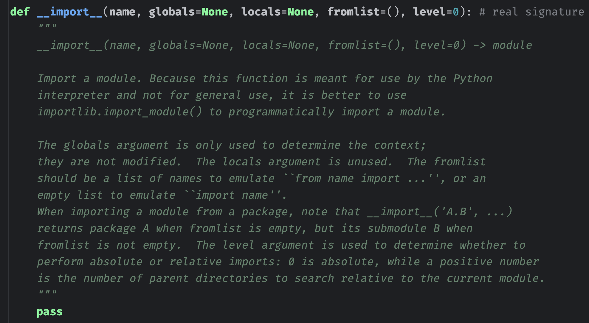

## 楔子

下面来聊一聊模块的导入机制，我们之前考察的所有内容都具有一个相同的特征，那就是它们都局限在一个 .py 文件中。然而现实中不可能只有一个 .py 文件，而是存在多个，而多个 .py 文件之间又存在引用和交互，这些也是程序的一个重要组成部分。那么这里我们就来分析一下，Python 中模块的导入机制。

首先在这里我们必须强调一点，一个单独的 .py 文件、或者 .pyc 文件、.pyd 文件，我们称之为一个**模块** ；而多个模块组合起来放在一个目录中，这个目录我们称之为**包**。但不管是模块，还是包，在虚拟机的眼中，它们都是 PyModuleObject 结构体实例，类型为 PyModule_Type，而在 Python 中则都是一个 **\<class 'module'\>** 对象。

~~~C
// Objects/moduleobject.c
PyTypeObject PyModule_Type = {
    PyVarObject_HEAD_INIT(&PyType_Type, 0)
    "module",                                   /* tp_name */
    sizeof(PyModuleObject),                     /* tp_basicsize */
    0,                                          /* tp_itemsize */
    (destructor)module_dealloc,                 /* tp_dealloc */
    0,                                          /* tp_vectorcall_offset */
    0,                                          /* tp_getattr */
    0,                                          /* tp_setattr */
    0,                                          /* tp_as_async */
    (reprfunc)module_repr,                      /* tp_repr */
    0,                                          /* tp_as_number */
    0,                                          /* tp_as_sequence */
    0,                                          /* tp_as_mapping */
    0,                                          /* tp_hash */
    0,                                          /* tp_call */
    0,                                          /* tp_str */
    (getattrofunc)module_getattro,              /* tp_getattro */
    PyObject_GenericSetAttr,                    /* tp_setattro */
    0,                                          /* tp_as_buffer */
    Py_TPFLAGS_DEFAULT | Py_TPFLAGS_HAVE_GC |
        Py_TPFLAGS_BASETYPE,                    /* tp_flags */
    module___init____doc__,                     /* tp_doc */
    (traverseproc)module_traverse,              /* tp_traverse */
    (inquiry)module_clear,                      /* tp_clear */
    0,                                          /* tp_richcompare */
    offsetof(PyModuleObject, md_weaklist),      /* tp_weaklistoffset */
    0,                                          /* tp_iter */
    0,                                          /* tp_iternext */
    module_methods,                             /* tp_methods */
    module_members,                             /* tp_members */
    0,                                          /* tp_getset */
    0,                                          /* tp_base */
    0,                                          /* tp_dict */
    0,                                          /* tp_descr_get */
    0,                                          /* tp_descr_set */
    offsetof(PyModuleObject, md_dict),          /* tp_dictoffset */
    module___init__,                            /* tp_init */
    PyType_GenericAlloc,                        /* tp_alloc */
    PyType_GenericNew,                          /* tp_new */
    PyObject_GC_Del,                            /* tp_free */
};
// Python 的 <class 'module'> 对应底层的 PyModule_Type
// 而导入进来的模块对象则对应底层的 PyModuleObject
~~~

所以模块和包导入进来之后也是一个对象，下面我们通过 Python 来演示一下。

~~~python
import os
import pandas

print(os)  
print(pandas)  
"""
<module 'os' from 'C:\\python38\\lib\\os.py'>
<module 'pandas' from 'C:\\python38\\lib\\site-packages\\pandas\\__init__.py'>
"""

print(type(os))  # <class 'module'>
print(type(pandas))  # <class 'module'>
~~~

因此不管是模块还是包，在 Python 中都是一样的，我们后面会详细说。总之它们都是一个 PyModuleObject，只不过为了区分，我们把单独的文件叫做模块，把包含文件的目录叫做包。但是在底层则并没有区分那么明显，它们都是一样的。

所以为了后续不产生歧义，我们这里做一个约定，从现在开始本系列中出现的**模块**，指的是单独的可导入文件；出现的**包**，指的是目录。而模块和包，我们都可以称之为 module 对象，因为这两者本来就是 **\<class 'module'\>** 的实例对象。

## import 前奏曲

我们以一个简单的 import 为序幕，看看相应的字节码。

~~~Python
import dis

code_string = "import sys"
dis.dis(compile(code_string, "<file>", "exec"))
"""
  1           0 LOAD_CONST               0 (0)
              2 LOAD_CONST               1 (None)
              4 IMPORT_NAME              0 (sys)
              6 STORE_NAME               0 (sys)
              8 LOAD_CONST               1 (None)
             10 RETURN_VALUE
"""
~~~

字节码非常简单，import sys 这行代码对应指令 IMPORT_NAME，可以类比之前的 LOAD_NAME，表示将名字为 "sys"  的 module 对象加载进来，然后用变量 sys 保存。

当我们访问 sys.path 的时候，虚拟机就能很轻松地通过 sys 来获取 path 这个属性对应的值了。因此就像我们之前说的那样，创建函数、类、导入模块等等，它们本质上和通过赋值语句创建一个变量是没有什么区别的。

关键就是这个 IMPORT_NAME，我们看看它的实现，还记得从哪里看吗？我们说所有指令的实现都在 ceval.c 的那个无限 for 循环的巨型 switch 中。

~~~C
case TARGET(IMPORT_NAME): {
    // PyUnicodeObject 对象，比如 import sys，那么这个 name 就是字符串 "sys"
    PyObject *name = GETITEM(names, oparg);
    // 再看一下上面的字节码
    // 在 IMPORT_NAME 之前有两个 LOAD_CONST，将 0 和 None 压入了运行时栈
    // 因此这里会从运行时栈中获取到 None 和 0，然后分别赋值给 fromlist 和 level
    // 至于这两个是干啥的，我们后面说
    PyObject *fromlist = POP();
    PyObject *level = TOP();
    // 一个 PyModuleObject *，指向模块对象
    PyObject *res;
    // 调用 import_name，将该函数的返回值赋值给 res
    res = import_name(tstate, f, name, fromlist, level);
    Py_DECREF(level);
    Py_DECREF(fromlist);
    // 设置为栈顶元素，后续通过 STORE_NAME 将其弹出，交给变量 sys 保存
    SET_TOP(res);
    if (res == NULL)
        goto error;
    DISPATCH();
}
~~~

因此重点在 import_name 这个函数中，但是在此之前我们需要先关注一下 fromlist 和 level，而这一点可以从 Python 的层面来介绍。我们知道在 Python 里面导入一个模块直接通过 import 关键字即可， 但是除了 import，还可以使用内置函数 \_\_import\_\_ 来进行导入。这个 \_\_import\_\_ 是解释器使用的一个函数，不推荐我们直接使用，但 import os 在虚拟机看来就是 os = \__import\_\_("os")。

~~~python
os = __import__("os")
SYS = __import__("sys")

print(os)  # <module 'os' from 'C:\\python38\\lib\\os.py'>
print(SYS.prefix)  # C:\python38
~~~

但是问题来了：

~~~python
m1 = __import__("os.path")
print(m1)  # <module 'os' from 'C:\\python38\\lib\\os.py'>
# 我们惊奇地发现，返回的居然还是 os 模块
# 按理说应该是 os.path（windows 系统对应 ntpath）才对啊

m2 = __import__("os.path", fromlist=[""])
print(m2)  # <module 'ntpath' from 'C:\\python38\\lib\\ntpath.py'>
# 你看到了什么，我们加上一个 fromlist，就能导入子模块
~~~

为什么会这样呢？我们来看看 \_\_import\_\_ 这个函数的解释，这个是 PyCharm 给抽象出来的。

大意就是，此函数会由 import 语句调用，当执行 import 的时候，解释器底层会调用 \_\_import\_\_。比如 import os 表示将 "os" 这个字符串传入 \_\_import\_\_ 函数中，从指定目录加载 os.py，当然也可能是 os.pyd、或者一个名为 os 的目录，然后得到一个 module 对象，并将返回值赋值给变量 os，也就是 os = \_\_import\_\_("os")。虽然可以通过这种方式来导入模块，但是 Python 不建议我们这么做。

然后 globals 参数则是确定 import 语句包的上下文，一般直接传 globals() 即可，而 locals 参数基本不用，不过一般情况下 globals 和 locals 我们都不用管。

总之 \_\_import\_\_("os.path") 导入的不是 os.path，而还是 os 这个外层模块。如果想导入 os.path，那么只需要给 fromlist 传入一个非空列表即可，当然不仅仅是非空列表，只要是一个非空的可迭代对象就行。然后是 level 参数，如果 level 是 0，那么表示仅执行绝对导入；如果是一个正整数，表示要搜索的父目录的数量，也就是相对导入。

因此当包名是一个动态字符串的时候，我们就没办法使用 import 关键字了，这时就可以使用 \_\_import\_\_ 手动导入。但是官方不推荐这么做，因为这是给解释器用的，官方推荐我们用 importlib。

~~~python
import importlib

a = "pandas"
pd = importlib.import_module(a)
# 很方便地就导入了，直接通过字符串的方式导入一个 module 对象
print(pd)  
"""
<module 'pandas' from 'C:\\python38\\lib\\site-packages\\pandas\\__init__.py'>
"""

# 如果想导入 "模块中导入的模块"
# 比如: 模块 a 中导入了模块 b，我们希望导入 a.b
# 或者导入一个包下面的子模块，比如 pandas.core.frame
sub_mod = importlib.import_module("pandas.core.frame")
# 我们看到可以自动导入 pandas.core.frame
print(sub_mod)  
"""
<module 'pandas.core.frame' from 'C:\\python38\\lib\\site-packages\\pandas\\core\\frame.py'>
"""

# 但如果是 __import__，默认的话是不行的，导入的依旧是最外层的 pandas
print(__import__("pandas.core.frame"))
"""
<module 'pandas' from 'C:\\python38\\lib\\site-packages\\pandas\\__init__.py'>
"""
# 可以通过给 fromlist 指定一个非空列表来实现
print(__import__("pandas.core.frame", fromlist=[""]))
"""
<module 'pandas.core.frame' from 'C:\\python38\\lib\\site-packages\\pandas\\core\\frame.py'>
"""
~~~

上面的导入方式虽然很方便，但有一个要求，就是导入的模块必须位于搜索路径之下。举个栗子，假设我们的项目在 D 盘，但是有一个 test.py 模块位于 F 盘，这时候该怎么做呢？

~~~Python
# 有一个文件 F:\mashiro\test.py，我们如何才能将它导入进来呢？
from importlib.machinery import SourceFileLoader

# 第一个参数是模块名，第二个参数是模块的路径
# 这样就可以实现导入了，所以这是基于文件路径进行加载的
# 这个做法能够保证无论文件在什么地方，都可以进行导入
test = SourceFileLoader("test", r"F:\mashiro\test.py").load_module()

# 但有一点需要注意，如果是导入包的话，那么要导入包里面的 __init__.py 文件
pd = SourceFileLoader(
    "我是 pandas 模块",
    r"C:\python38\lib\site-packages\pandas\__init__.py"
).load_module()
print(pd.DataFrame({"a": [1, 2, 3], "b": [4, 5, 6]}))
"""
   a  b
0  1  4
1  2  5
2  3  6
"""
# 如果只写到 pandas，那么会抛出 PermissionError，因为我们不能把目录当成文件来读取
# 至于 import 一个包，本质上也是加载包内部的 __init__.py 

# 但上面这个类只能加载 py 文件，如果想加载 pyc、pyd 文件，需要用下面两个类
# 但需要注意的是，加载普通文件和 pyc 文件时，我们可以随便起名字，也就是第一个参数任意
# 但对于 pyd 文件，第一个参数必须和 pyd 文件的名字保持一致。
from importlib.machinery import SourcelessFileLoader  # pyc
from importlib.machinery import ExtensionFileLoader   # pyd
~~~

或者我们还可以通过 exec 的方式创建。

~~~Python
# ModuleType = type(sys)
from types import ModuleType

print(ModuleType)  # <class 'module'>

# 类对象有了，下面就可以创建了，module 类接收两个参数
# 参数一：模块的名字，必须传递
# 参数二：模块的 doc，不传默认为 None
os = ModuleType("我是 os 模块")  # 此时的 os 里面啥也没有

with open(r"C:\python38\Lib\os.py", encoding="utf-8") as f:
    source = f.read()

# 通过 exec 执行读取出来的字符串，然后将名字空间换成 os 的属性字典
exec(source, os.__dict__)
print(os.__name__)  # 我是 os 模块
print(os.path.join("x", "y", "z"))  # x\y\z

print(hasattr(os, "嘿"))  # False
exec("嘿 = '蛤'", os.__dict__)
print(os.嘿)  # 蛤
~~~

当然啦，也可以把一个自定义的类的实例变成模块，举个栗子：

~~~Python
import sys
from types import ModuleType

class MyModule(ModuleType):

    def __init__(self, module_name):
        super().__init__(module_name)

    def __getattr__(self, item):
        return f"不存在的属性: {item}"

    def __setattr__(self, key, value):
        self.__dict__[key] = value

    def __str__(self):
        return f"<module '{self.__name__}' from '我来自于虚无'>"

m = MyModule("MyModule")
print(m)  # <module 'MyModule' from '我来自于虚无'>
print(m.__name__)  # MyModule
print(m.hello)  # 不存在的属性: hello
m.hello = "world"
print(m.hello)  # world

# 加入到 sys.modules 中
sys.modules["嘿嘿"] = m
import 嘿嘿
print(嘿嘿.hello)  # world
print(嘿嘿.xxx)  # 不存在的属性: xxx

from 嘿嘿 import hello, a, b, c
print(hello)  # world
print(a)  # 不存在的属性: a
print(b)  # 不存在的属性: b
print(c)  # 不存在的属性: c
~~~

是不是很好玩呢？关于里面的一些细节，比如 sys.modules 是什么，后续会详细说。好了，扯了这么多，我们回到 IMPORT_NAME 这个指令，它是加载模块时对应的指令。在里面确定完参数之后，会调用 import_name，我们看看这个函数长什么样子。

~~~C
// Python/ceval.c
static PyObject *
import_name(PyThreadState *tstate, PyFrameObject *f,
            PyObject *name, PyObject *fromlist, PyObject *level)
{
    _Py_IDENTIFIER(__import__);
    PyObject *import_func, *res;
    PyObject* stack[5];
    // 获取内置函数 __import__
    import_func = _PyDict_GetItemIdWithError(f->f_builtins, &PyId___import__);
    // 为 NULL 表示获取失败，显然这些都是 Python 底层做的检测
    // 我们使用时不会出现，如果出现，只能说明解释器出问题了
    if (import_func == NULL) {
        if (!_PyErr_Occurred(tstate)) {
            _PyErr_SetString(tstate, PyExc_ImportError, "__import__ not found");
        }
        return NULL;
    }

    // 判断 __import__ 是否被重载了
    if (import_func == tstate->interp->import_func) {
        int ilevel = _PyLong_AsInt(level);
        if (ilevel == -1 && _PyErr_Occurred(tstate)) {
            return NULL;
        }
        // 未重载的话，调用 PyImport_ImportModuleLevelObject
        res = PyImport_ImportModuleLevelObject(
                        name,
                        f->f_globals,
                        f->f_locals == NULL ? Py_None : f->f_locals,
                        fromlist,
                        ilevel);
        return res;
    }

    Py_INCREF(import_func);
    // 否则调用重载后的 __import__
    stack[0] = name;
    stack[1] = f->f_globals;
    stack[2] = f->f_locals == NULL ? Py_None : f->f_locals;
    stack[3] = fromlist;
    stack[4] = level;
    res = _PyObject_FastCall(import_func, stack, 5);
    Py_DECREF(import_func);
    return res;
}
~~~

然后我们看到底层又调用了 PyImport_ImportModuleLevelObject ，显然核心隐藏在这里面，来看一下它的实现。

~~~C
//Python/import.c
PyObject *
PyImport_ImportModuleLevelObject(PyObject *name, PyObject *globals,
                                 PyObject *locals, PyObject *fromlist,
                                 int level)
{
    _Py_IDENTIFIER(_handle_fromlist);
    PyObject *abs_name = NULL;
    PyObject *final_mod = NULL;
    PyObject *mod = NULL;
    PyObject *package = NULL;
    PyInterpreterState *interp = _PyInterpreterState_GET_UNSAFE();
    int has_from;
    // 名字不可以为空
    if (name == NULL) {
        PyErr_SetString(PyExc_ValueError, "Empty module name");
        goto error;
    }
    // 名字必须是 PyUnicodeObject
    if (!PyUnicode_Check(name)) {
        PyErr_SetString(PyExc_TypeError, "module name must be a string");
        goto error;
    }
    if (PyUnicode_READY(name) < 0) {
        goto error;
    }
    // level 不可以小于 0
    if (level < 0) {
        PyErr_SetString(PyExc_ValueError, "level must be >= 0");
        goto error;
    }
    // level 大于 0，在相应的父目录中寻找，得到 abs_name
    if (level > 0) {
        abs_name = resolve_name(name, globals, level);
        if (abs_name == NULL)
            goto error;
    }
    else {
        // 否则的话，说明 level == 0，因为 level 要求是一个大于等于 0 的整数
        if (PyUnicode_GET_LENGTH(name) == 0) {
            PyErr_SetString(PyExc_ValueError, "Empty module name");
            goto error;
        }
        // 直接将 name 赋值给 abs_name，说明此时是绝对导入
        abs_name = name;
        Py_INCREF(abs_name);
    }
    // 优先从 sys.modules 中获取
    mod = PyImport_GetModule(abs_name);
    if (mod == NULL && PyErr_Occurred()) {
        goto error;
    }
    // ...
    // ...
    // ...
    else {
        _Py_IDENTIFIER(__path__);
        PyObject *path;
        if (_PyObject_LookupAttrId(mod, &PyId___path__, &path) < 0) {
            goto error;
        }
        if (path) {
            Py_DECREF(path);
            // 调用函数，导入模块
            final_mod = _PyObject_CallMethodIdObjArgs(
                        interp->importlib, &PyId__handle_fromlist,
                        mod, fromlist, interp->import_func, NULL);
        }
        else {
            final_mod = mod;
            Py_INCREF(mod);
        }
    }

  error:
    Py_XDECREF(abs_name);
    Py_XDECREF(mod);
    Py_XDECREF(package);
    if (final_mod == NULL) {
        remove_importlib_frames(interp);
    }
    return final_mod;
}
~~~

还是很好理解的，关于 module 对象的导入，Python 也提供了非常丰富的写法。

~~~python
import numpy
import numpy as np
import numpy.random as _random

from numpy import random
from numpy import random as _random
from numpy import *
~~~

从 import 的目标来说，可以是**包**，也可以是**模块**。而模块可以通过 .py 文件作为载体，也可以通过 .pyc 或者 .pyd 等二进制文件作为载体。

----

&nbsp;

**欢迎大家关注我的公众号：古明地觉的编程教室。**

**如果觉得文章对你有所帮助，也可以请作者吃个馒头，Thanks♪(･ω･)ﾉ。**

