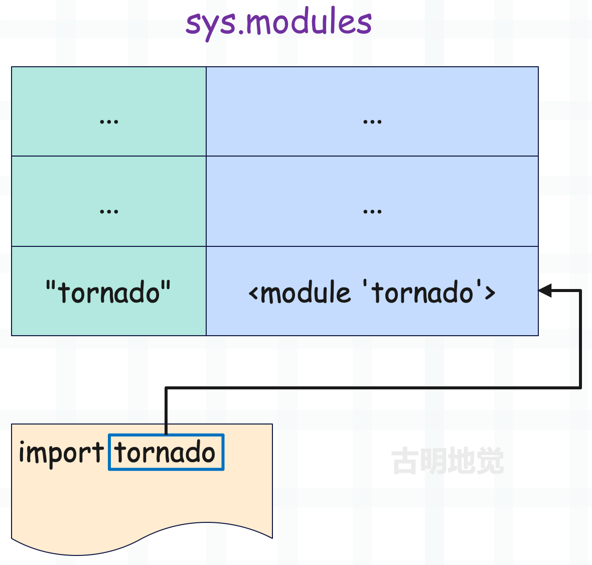
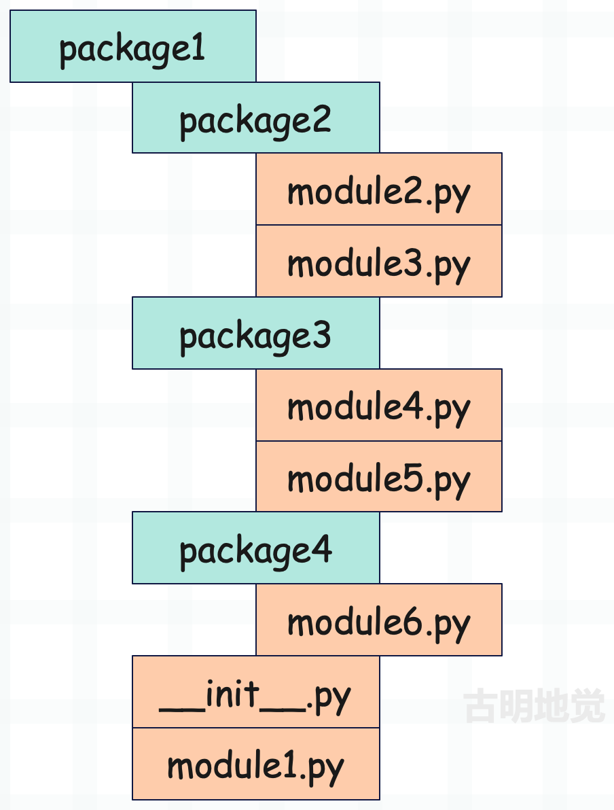
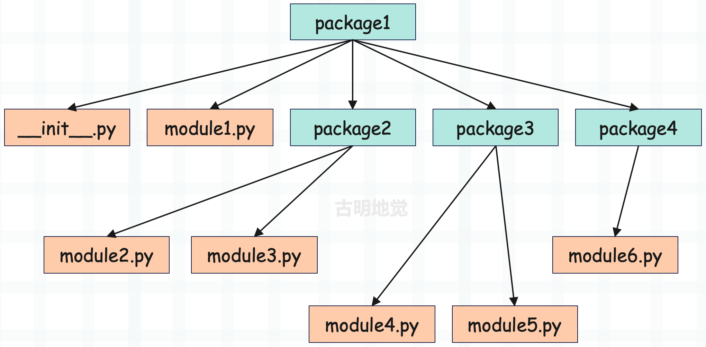

## 楔子

同 C++ 的 namespace，Python 通过模块和包来实现对系统复杂度的分解，以及保护名字空间不受污染。通过模块和包，我们可以将某个功能、某种抽象进行独立的实现和维护，在 module 对象的基础之上构建软件。这样不仅使得软件的架构清晰，而且也能很好地实现代码复用。

## 标准 import

sys 这个模块恐怕是使用最频繁的 module 对象之一了，我们就从这位老铁入手。Python 有一个内置函数 dir，这个小工具是我们探测 import 的杀手锏。如果你在交互式环境下输入 dir()，那么会打印当前 local 名字空间里的所有符号，如果有参数，比如 dir(xx)，则输出 xx 指向对象的所有属性。我们先来看看 import 动作对当前名字空间的影响：

~~~Python
>>> dir()
['__annotations__', '__builtins__', '__doc__', '__loader__', '__name__', '__package__', '__spec__']
>>> 
>>> import sys
>>> 
>>> dir()
['__annotations__', '__builtins__', '__doc__', '__loader__', '__name__', '__package__', '__spec__', 'sys']
~~~

我们看到进行了 import 动作之后，当前的 local 名字空间增加了一个 sys 符号。

~~~python
>>> type(sys)
<class 'module'>
~~~

而且通过 type 操作，我们看到这个 sys 符号指向一个 module对象，在底层它是一个 PyModuleObject。当然啦，虽然写着类型是 \<class 'module'\>，但是这个类无法直接使用，因为解释器没有将它暴露出来。不过它既然是一个 class，那么就一定继承 object，并且元类为 type。

~~~python
>>> sys.__class__.__class__
<class 'type'>
>>> sys.__class__.__base__
<class 'object'>
~~~

这与我们的分析是一致的。言归正传，我们看到 import 机制影响了当前的 local 名字空间，使得加载的 module 对象在 local 空间成为可见的。而引用该 module 的方法正是通过 module 的名字，即这里的 sys。

实际上，这和我们创建一个变量是等价的，比如 a = 123，会先创建一个 PyLongObject，然后让变量 a 指向它。而上面的 import sys 也是同理，先创建一个 PyModuleObject，然后让变量 sys 指向它。

不过这里还有一个问题，来看一下：

~~~Python
>>> sys
<module 'sys' (built-in)>
~~~

我们看到 sys 是内置的，说明模块除了可以是真实存在的文件之外，还可以内嵌在解释器里面。但既然如此，那为什么不能直接使用，还需要导入呢？其实不光是 sys，在 Python 初始化的时候，就已经将一大批的 module 对象加载到了内存中。这些 module 对象都是使用 C 编写，并内嵌在解释器里面的，因为它们对性能的要求比较严苛，比如 \_random、gc、\_pickle 等等。

但是为了让当前 local 名字空间能够达到最干净的效果，Python 并没有将这些符号暴露在 local 名字空间中。而是需要开发者显式地通过 import 机制将符号引入到 local 名字空间之后，才能让程序使用符号背后的对象。

<font color="blue">凡是加载进内存的 module 对象都会保存在 sys.modules 里面，尽管当前的 local 空间里面没有，但 sys.modules 里面是跑不掉的。</font>

~~~Python
import sys

# sys.modules 是一个字典，里面保存了 "module 对象的名字" 到 "module 对象" 的映射
# 里面有很多模块，这里就不打印了，但令我感到意外的是，居然把 numpy 也加载进来了
modules = sys.modules

np = modules["numpy"]
arr = np.array([1, 2, 3, 4, 5])
print(np.sum(arr))  # 15


# os 模块我们没有导入，但是它已经在内存中了
# 虽然当前 local 空间没有，但它在 sys.modules 里面
os_ = modules["os"]

# 手动导入，会从 sys.modules 里面加载
import os   
print(id(os) == id(os_))  # True
~~~

一开始这些 module 对象是不在 local 空间里面的，除非显式导入，但即便我们导入，这些 module 对象也不会被二次加载。因为在解释器启动后，它们就已经被加载到内存里面了，存放在 sys.modules 中。

因此对于已经在 sys.modules 里面的 module 对象来说，导入的时候只是将符号暴露到 local 空间里面去，所以代码中的 os 和 os_ 指向同一个 module对象。如果我们在 Python 启动之后，导入一个 sys.modules 中不存在的 module 对象，那么才会进行加载、然后同时进入 sys.modules 和 local 空间。

### 自定义 module

对于那些内嵌在解释器里面的 module 对象，如果 import，只是将符号暴露在了 local 名字空间中。下面我们看看对那些在初始化的时候没有加载到内存的 module 对象进行 import 的时候，会出现什么样的动作。

这里就以模块为例，当然正如我们之前说的，一个模块的载体可以是 py 文件或者二进制文件，而 py 文件可以是自己编写的、也可以是标准库中的、或者第三方库中的。那么下面我们就自己编写一个 py 文件作为例子，探探路。

~~~Python
# a.py
a = 1
b = 2
~~~

以上是 a.py，里面定义了两个变量，然后导入它。

~~~Python
import sys

print("a" in sys.modules)  # False

import a
print("a" in sys.modules)  # True
print(dir())  # [..., 'a', 'sys']

print(id(a))  # 2653299804976
print(id(sys.modules["a"]))  # 2653299804976

print(type(a))  # <class 'module'>
~~~

type(a) 的结果表明 import 机制确实创建了一个新的 module对象，而且也正如我们之前所说，解释器对 a 指向的 module 对象进行导入时，会同时将其引入到 sys.modules 和当前的 local 名字空间中，它们指向的是同一个 PyModuleObject。然后我们再来看看这个 module对象：

~~~Python
import a

# 查看 a 里面的属性
print(dir(a))  
"""

['__builtins__', '__cached__', '__doc__', '__file__', '__loader__',
 '__name__', '__package__', '__spec__', 'a', 'b']
"""

print(a.__name__)  # a
print(a.__file__)  # D:\satori\a.py
~~~

可以看到，module 对象内部实际上是通过一个字典来维护所有的属性，里面有 module 的元信息（名字、文件路径）、以及 module 对象的内容。因为 module 对象本身就是 \<class 'module'\> 的实例对象，它有自己的属性字典，用来维护内部的属性。

> 另外，如果此时你查看 a.py 所在目录的 \_\_pycache\_\_ 目录，会发现里面有一个 a.pyc，说明解释器在导入的时候先生成了 pyc，然后再导入 pyc。

并且我们通过 dir(a) 查看的时候，发现里面有一个 \_\_builtins\_\_ 符号，那么这个 \_\_builtins\_\_ 和我们之前说的那个 \_\_builtins\_\_ 是一样的吗？

~~~Python
# 获取 builtins 可以通过 import builtins 的方式导入
# 但其实也可以通过 __builtins__ 获取
print(
    id(__builtins__), type(__builtins__)
)  # 140265846506256 <class 'module'>

print(
    id(a.__dict__["__builtins__"]), type(a.__dict__["__builtins__"])
)  # 140265846500608 <class 'dict'>
~~~

尽管它们都叫 \_\_builtins\_\_，但一个是 module对象，一个是字典。直接访问 \_\_builtins\_\_ 获取的是一个 module 对象，int、str、globals 和 \_\_builtins\_\_.int，\_\_builtins\_\_.str，\_\_builtins\_\_.globals 是等价的。

但 a.\_\_dict_\_["\_\_builtins\_\_"] 是一个字典，这就说明两者从性质上就是不同的东西，但即便如此，就真的一点关系也没有吗？

~~~Python
import a

print(id(__builtins__.__dict__))  # 2791398177216
print(id(a.__dict__["__builtins__"]))  # 2791398177216
~~~

我们看到还是有一点关系的，和类、类的实例对象一样，每一个 module 对象也有自己的属性字典 \_\_dict\_\_，记录了自身的元信息、里面存放的内容等等。对于 <font color="blue">a.\_\_dict\_\_["\_\_builtins\_\_"]</font> 来说，拿到的就是 <font color="blue">\_\_builtins\_\_.\_\_dict\_\_</font>。所以说 \_\_builtins\_\_ 是一个模块，但这个模块有一个属性字典，而这个字典可以通过 <font color="blue">module对象.\_\_dict\_\_["\_\_builtins\_\_"]</font> 来获取。

因为任何一个模块都可以使用 \_\_builtins\_\_ 里面的内容，并且所有模块对应的 \_\_builtins\_\_ 都是一样的。所以当你直接打印 a.\_\_dict\_\_ 的时候会输出一大堆内容，因为输出的内容里面不仅有当前模块的内容，还有 \_\_builtins\_\_.\_\_dict\_\_。

~~~python
import a

# a.__dict__["__builtins__"] 就是 __builtins__.__dict__ 这个属性字典
# 而 __builtins__.__dict__["list"] 又是 __builtins__.list
# 说白了，就是我们直接输入的 list
print(a.__dict__["__builtins__"]["list"] is list)  # True
print(
    # 等价于 __builtins__.__dict__["list"]("abcd")
    # 等价于 __builtins__.list("abcd")
    # 等价于 list("abcd")
    a.__dict__["__builtins__"]["list"]("abcd"),
)  # ['a', 'b', 'c', 'd']

# 回顾之前的内容
# 我们说，模块名是在模块的属性字典里面
print(a.__dict__["__name__"] == a.__name__ == "a")  # True

# __builtins__ 里面的 __name__ 就是 builtins
print(__builtins__.__dict__["__name__"])  # builtins

# 对于当前文件来说也是一个模块，它的 local 空间也有 __name__
# 并且如果它做为启动文件，那么 __name__ 会等于 "__main__"
# 如果是被导入的，那么它的 __name__ 会等于文件名
print(__name__)   # __main__

# __main__ 也是一个模块
# 注意：如果这么做的话，那么该文件必须是启动文件
name = "古明地觉"
from __main__ import name as NAME
print(NAME)  # 古明地觉
~~~

所以可以把模块的属性字典，看成是 local 空间（也是 global空间）、内置空间的组合。

## 嵌套 import

我们下面来看一下 import 的嵌套，所谓 import 的嵌套就是指 import a、但是在 a 中又 import b，我们来看看这个时候会发生什么有趣的动作。

~~~python
# a.py
import tornado
~~~

在 a.py 中我们导入了 tornado 模块，然后再来导入 a。

~~~python
import a
import sys
import tornado

print(
    a.tornado is tornado is sys.modules["tornado"] is a.__dict__["tornado"]
)  # True
~~~

首先 import a 之后，我们通过 a 这个符号是可以直接拿到其对应的模块的。但是在 a 中我们又 import tornado，那么通过 a.tornado 可以拿到 tornado 模块。

但第二次导入 tornado 的时候，会怎么样呢？首先在 a 中已经导入了 tornado，那么 tornado 就已经在 sys.modules 里面了。因此当再次导入 tornado 的时候，会直接从 sys.modules 里面查找，而不会二次加载。为了更直观的验证，我们再举一个例子：

~~~python
# a.py
print(123)

# b.py
import a

# c.py
import a
~~~

以上是三个文件，每个文件只有一行代码，我们来导入 a、b、c。

~~~Python
import a
import b
import c
"""
123
"""
~~~

当导入一个不在 sys.modules 里面的模块时，会先从硬盘中加载相应的文件，然后逐行解释执行里面的内容，构建 PyModuleObject 对象，最后加入到 sys.modules 和 local 空间中。当第二次导入的时候，对应的模块已经存在 sys.modules 当中了，因此直接将符号暴露到当前的 local 空间里面即可，不会再执行里面的内容。

所以我们可以把 sys.modules 看成是一个大仓库，里面保存了**模块名**到**模块对象**的映射，任何导入的模块都在这里面。如果导入时，发现 sys.modules 里面已存在，那么直接通过字典获取即可，这样可以避免重复加载。



## 导入包

我们写的多个逻辑或者功能上相关的函数、类可以放在一个模块里面，那么多个模块是不是也可以组成一个包呢？如果说模块是管理 class、函数、变量的机制，那么包就是管理模块的机制。当然啦，多个小的包又可以聚合成一个更大的包。

因此在 Python 中，模块是由一个单独的文件来实现的，可以是 .py 文件、或者二进制文件。而对于包来说，则是一个目录，里面容纳了模块对应的文件，这种方式就是把多个模块聚合成一个包的具体实现。但不管是模块还是包，它们都是一个 module 对象，在虚拟机看来则都是 PyModuleObject 对象。关于这一点，一会儿会看的更加明显。

假设现在有一个名为 test_import 的包，里面有一个 a.py，内容如下。

~~~Python
a = 123
b = 456
print(">>>")
~~~

现在我们来导入它。

~~~Python
import test_import
print(test_import)  # <module 'test_import' (namespace)>
~~~

在 Python2 中，这样是没办法导入的，因为如果一个目录要成为 Python 的包，那么里面必须要有一个 \_\_init\_\_.py 文件，但是在 Python3 中则没有此要求。而且我们发现 print 之后，显示的也是一个 module 对象，因此 Python 对模块和包的底层定义其实是很灵活的，并没有那么僵硬。

```Python
import test_import

print(test_import.a)
"""
AttributeError: module 'test_import' has no attribute 'a'
"""
```

然而此时神奇的地方出现了，调用 test_import.a 的时候，告诉我们没有 a 这个属性。很奇怪，test_import 里面不是有 a.py 吗？

原因是 Python 导入一个包，等价于导入包里的 \_\_init\_\_.py，只有属性在 \_\_init\_\_.py 文件中被导入了，我们才可以通过包名来访问。如果这个包里面没有 \_\_init\_\_.py 文件，那么你导入这个包，是什么属性也用不了的。

光说可能比较难理解，我们来演示一下。我们在 test_import 里面创建一个 \_\_init\_\_.py 文件，但是文件里面什么也不写。

~~~python
import test_import

print(test_import)
"""
<module 'test_import' from 'D:\\satori\\test_import\\__init__.py'>
"""
~~~

此时又看到了神奇的地方，我们在 test_import 目录里面创建了 \_\_init\_\_.py 之后，再打印 test_import，得到的结果又变了，告诉我们这个包来自于包里面的 \_\_init\_\_.py 文件。所以就像之前说的，Python 对包和模块的概念区分的不是很明显，我们就把包当做该包下面的  \_\_init\_\_.py 文件即可，\_\_init\_\_.py 中定义了什么，那么这个包里面就有什么。

我们往 \_\_init\_\_.py 里面写点内容：

~~~python
# test_import/__init__.py

import sys
from . import a

name = "satori"
~~~

from . import a 表示在 \_\_init\_\_.py 的同级目录中导入 a.py，但是问题来了，直接像 import sys 那样 import a 不行吗？答案是不行的，至于为什么我们后面说。

总之我们在 \_\_init\_\_.py 中导入了 sys 模块、a 模块，定义了 name 变量，那么就等于将 sys、a、name 加入到 test_import 这个包的 local 空间里面了。因为 Python 的包等价于它里面的 \_\_init\_\_.py 文件，这个文件有什么，那么这个包就有什么。

既然在 \_\_init\_\_.py 中导入了 sys、a，定义了 name，那么这个文件的属性字典里面、或者也可以说 local 空间里面就多了三个 entry，key 分别为 "sys"、"a"、"name"。而 \_\_init\_\_.py 里面有什么，那么通过包名就能够获取什么。

~~~python
# 导入一个包会执行内部的 __init__.py
# 而在 __init__.py 里面导入了 a
# a 里面有一个 print，所以会直接执行
import test_import
"""
>>>
"""

print(test_import.a)
"""
<module 'test_import.a' from 'D:\\satori\\test_import\\a.py'>
"""
print(test_import.a.a)  # 123  
print(test_import.a.b)  # 456

print(test_import.sys)  # <module 'sys' (built-in)>
print(test_import.name)  # satori


# 二次导入
import test_import
# 我们看到 a 里面的 print 没有打印，证明模块、包不管以怎样的方式被导入
# 对应的文件只会被加载一遍，第二次导入只是从 sys.modules 里面进行了一次键值对查找
~~~

### 相对导入与绝对导入

我们刚才使用了 from . import a 的方式导入模块 a，这个 **.** 表示当前文件所在的目录。因此这行代码的含义就是，我要导入 a 这个模块，不是从别的地方导入，而是从该文件所在的目录里面导入。如果是 **..** 就表示当前文件所在目录的上一层目录，**...** 和 **....** 依次类推。

另外模块 a 里面还有一个变量 a，那如果我想在 \_\_init\_\_.py 中导入这个变量该怎么办呢？很简单，直接 <font color="blue">from .a import a</font> 即可，表示导入当前目录里面的模块 a 里面的变量 a。

但如果我们导入的时候没有 **.** 的话，则表示绝对导入，虚拟机就会按照 sys.path 定义的路径进行查找。那么问题来了，假设我们在 \_\_init\_\_.py 中写的不是 <font color="blue">from . import a</font>，而是 <font color="blue">import a</font>，那么会发生什么后果呢？

~~~Python
import test_import

"""
    import a
ModuleNotFoundError: No module named 'a'
"""
~~~

我们发现报错了，提示没有 a 这个模块，可是我们明明在包里面定义了呀。还记得之前说的导入一个模块、导入一个包会做哪些事情吗？导入一个模块，会将该模块里面的内容 "拿过来" 执行一遍，导入包会将该包里面的 \_\_init\_\_.py 文件 "拿过来" 执行一遍。注意：这里把 "拿过来" 三个字加上了引号。

我们在和 test_import 目录同级的 py 文件中导入了 test_import，那么就相当于把里面的 \_\_init\_\_ 拿过来执行一遍（当然只有第一次导入的时候才会这么做）。但是它们具有单独的空间，是被隔离的，访问时需要使用符号 test_import 来访问。

但是正如之前所说，是 "拿过来" 执行，所以这个 \_\_init\_\_.py 里面的内容是"拿过来"，在当前的 .py 文件（在哪里导入的就是哪里）中执行的。所以由于 import a 这行代码表示绝对导入，就相当于在当前模块里面导入，会从 sys.path 里面搜索，但模块 a 是在 test_import 包里面，那么此时还能找到这个 a 吗？显然是不能的，除非我们将 test_import 所在路径加入到 sys.path 中。

那 <font color="blue">from . import a</font> 为什么就好使呢？因为这种导入方式是相对导入，表示要在 \_\_init\_\_.py 所在目录里面找，那么不管在什么地方导入这个包，由于 \_\_init\_\_.py 的位置是不变的，所以 <font color="blue">from . import a</font> 这种相对导入的方式总能找到对应的 a。

至于标准库、第三方模块、第三方包，因为它们在 sys.path 里面，在哪儿都能找得到，所以直接绝对导入即可。并且我们知道每一个模块都有一个 \_\_file\_\_ 属性（除了内嵌在解释器里面的模块），当然包也是。如果你在一个模块里面 print(\_\_file\_\_)，那么不管在哪里导入这个模块，打印的永远是这个模块的路径；包的话，则是指向内部的 \_\_init\_\_.py 文件。

另外关于相对导入，一个很重要的一点，一旦一个模块出现了相对导入，那么这个模块就不能被执行了，它只可以被导入。

~~~python
import sys
from . import a

name = "satori"
"""
    from . import a
ImportError: attempted relative import with no known parent package
"""
~~~

此时如果试图执行 \_\_init\_\_.py，那么就会报出这个错误，所以出现相对导入的模块不能被执行，只能被导入。此外，导入一个内部具有"相对导入"的模块，还要求<font color="blue">当前模块</font>和<font color="blue">被导入模块</font>不能在同一个包内，我们要执行的当前模块至少在<font color="blue">被导入模块</font>的上一级，否则执行当前模块也会报出这种错误。

因此出现相对导入的模块要在一个包里面，然后在包外面使用，所以<font color="blue">当前模块</font>和<font color="blue">出现相对导入的被导入模块</font>绝对不能在同一个包里面。

### import 的另一种方式

我们要导入 test_import 包里面的 a 模块，除了可以 import test_import（前提是 \_\_init\_\_.py 里面导入了 a）之外，还可以直接 <font color="blue">import test_import.a</font>。

另外如果是这种导入方式，那么包里面可以没有 \_\_init\_\_.py 文件。因为之前导入 test_import 包的时候，是通过 test_import 来获取 a，所以必须要有 \_\_init\_\_.py、并且里面导入 a。但是在导入 test_import.a 的时候，就是找 test_import.a，所以此时是可以没有 \_\_init\_\_.py文件的。

~~~Python
# test_import/__init__.py
__version__ = "1.0"

# test_import/a.py
name = "古明地觉"
print("古明地恋")
~~~

此时 test_import 包的 \_\_init\_\_.py 里面只定义了一个变量，下面我们来通过 test_import.a 的形式导入。

~~~Python
import test_import.a

print(test_import.a.name) 
"""
古明地恋
古明地觉
"""

# 当 import test_import.a 的时候，会执行里面的 print
# 然后可以通过 test_import.a 获取 a.py 里面的属性，这很好理解

# 但是，没错，我要说但是了
print(test_import.__version__)  # 1.0
~~~

惊了，我们在导入 test_import.a 的时候，也把 test_import 导入进来了，为了更直观地看到现象，我们在 \_\_init\_\_.py 里面打印一句话。

~~~python
import test_import.a
"""
我是 test_import 下面的 __init__
古明地恋
"""
~~~

导入一个包等价于导入包里面的 \_\_init\_\_.py，而 \_\_init\_\_.py 里面的内容都可以通过包来获取。而打印结果显示在导入 test_import.a 时，会先把 test_import 导入进来。如果我们在 \_\_init\_\_.py 中也导入了 a 会怎么样？

~~~python
# test_import/__init__.py
print("我是 test_import 下面的 __init__")
from . import a

# test_import/a.py
print("我是 test_import 下面的 a")
~~~

导入一下看看：

~~~python
import test_import.a
"""
我是 test_import 下面的 __init__
我是 test_import 下面的 a
"""
~~~

我们看到 a.py 里面的内容只被打印了一次，说明没有进行二次加载，在 \_\_init\_\_.py 中将 a 导入进来之后，就加入到 sys.modules 里面了。再看一下 sys.modules：

~~~python
import sys
import test_import.a
"""
我是 test_import 下面的 __init__
我是 test_import 下面的 a
"""

print(sys.modules["test_import"])
print(sys.modules["test_import.a"])
"""
<module 'test_import' from 'D:\\satori\\test_import\\__init__.py'>
<module 'test_import.a' from 'D:\\satori\\test_import\\a.py'>
"""
~~~

通过 test_import.a 的方式来导入，即使 test_import 里面没有 \_\_init\_\_.py 文件依旧可以访问。

不过问题来了，为什么在导入 test_import.a 的时候，会将 test_import 也导入进来呢？并且还可以直接使用 test_import，毕竟这不是我们期望的结果。因为导入 test_import.a 的话，那么我们只是想使用 test_import.a，不打算使用 test_import，那 Python 为什么要这么做呢？

事实上，这对 Python 而言是必须的，根据我们对虚拟机执行原理的了解，要想获取 test_import.a，那么肯定要先从 local 空间中找到 test_import，然后才能找到 a。如果不找到 test_import 的话，那么对 a 的查找也就无从谈起。

虽然 sys.modules 里面有一个 test_import.a，但并不是说有一个模块叫 test_import.a。准确的说 <font color="blue">import test_import.a</font> 表示先导入 test_import，然后再将 test_import 下面的 a 加入到 test_import 的属性字典里面。

我们说当包里面没有 \_\_init\_\_.py 的时候，那这个包是无法使用的，因为属性字典里面啥也没有。但是当 <font color="blue">import test_import.a</font> 的时候，虚拟机会先导入 test_import 这个包，然后再把 a 这个模块加入到包的属性字典里面。而 sys.modules 里面之所以会有 "test_import.a" 这个 key，显然也是为了解决重复导入的问题。

假设 test_import 里面有 a 和 b 两个 .py 文件，那么执行 <font color="blue">import test_import.a</font> 和 <font color="blue">import test_import.b</font> 会进行什么样的动作应该了如指掌了。

执行 <font color="blue">import test_import.a</font>，会先导入 test_import，然后把 a 加入到 test_import 的属性字典里面。执行 <font color="blue">import test_import.b</font>，还是会先导入包 test_import，但是 test_import 在上一步已经被导入了，所以此时会直接从 sys.modules 里面获取，然后再把 b 加入到 test_import 的属性字典里面。

所以如果 \_\_init\_\_.py 里面有一个 print 的话，那么两次导入显然只会 print 一次，这种现象是由 Python 对包内模块的动态加载机制决定的。还是那句话，一个包你就看成是里面的 \_\_init\_\_.py 文件即可，Python 对于包和模块的区分不是特别明显。

~~~python
# test_import 目录下有 __init__.py 文件
import test_import

print(test_import.__file__) 
print(test_import) 
"""
D:\satori\test_import\__init__.py
<module 'test_import' from 'D:\\satori\\test_import\\__init__.py'>
"""

# test_import 目录下没有 __init__.py 文件
import test_import

print(test_import.__file__)  
print(test_import)  
"""
None
<module 'test_import' (namespace)>
"""
~~~

如果包里面有 \_\_init\_\_.py 文件，那么这个包的 \_\_file\_\_ 属性就是其内部的 \_\_init\_\_.py 文件的完整路径。如果没有 \_\_init\_\_.py 文件，那么这个包的 \_\_file\_\_ 就是 None。

一个模块（即使里面什么也不写）的属性字典里面肯定是有 \_\_builtins\_\_ 属性的，因此可以直接使用内置函数等等。而 \_\_init\_\_.py 也属于一个模块，所以它也有 \_\_builtins\_\_ 属性，由于一个包指向了内部的 \_\_init\_\_.py，所以这个包的属性字典也是有 \_\_builtins\_\_ 属性的。但如果这个包没有 \_\_init\_\_.py 文件，那么就没有 \_\_builtins\_\_ 属性了。

~~~python
# 没有 __init__.py 文件
import test_import
print(
    test_import.__dict__.get("__builtins__")
)  # None


# 有 __init__.py 文件
import test_import
print(
    test_import.__dict__.get("__builtins__")["int"]
)  # <class 'int'>
~~~

### 路径搜索树

假设有这样一个目录结构：



那么 Python 会将这个结构进行分解，得到一个类似于树状的节点集合：



然后从左到右依次去 sys.modules 中查找每一个符号所对应的 module 对象是否已经被加载，如果一个包被加载了，比如说包 test_import 被加载了，那么在包 test_import 对应的 PyModuleObject 中会维护一个元信息 \_\_path\_\_，表示这个包的路径。比如搜索 A.a，当 A 加载进来之后，对 a 的搜索只会在 A.\_\_path\_\_ 中进行，而不会在 Python 的所有搜索路径中进行了。

~~~Python
import test_import

print(test_import.__path__)  # ['D:\\satori\\test_import']

# 导入 sys 模块
try:
    import test_import.sys
except ImportError as e:
    print(e)  # No module named 'test_import.sys'
~~~

显然这样是错的，因为导入的是 test_import.sys，那么就将搜索范围只限定在 test_import 的 \_\_path\_\_ 下面了，而它下面没有 sys 模块，因此报错。

## from 与 import

在 Python 的 import 中，有一种方法可以精确控制所加载的对象，通过 from 和 import 的结合，可以只将我们期望的 module 对象、甚至是 module 对象中的某个符号，动态地加载到内存中。这种机制使得虚拟机在当前名字空间中引入的符号可以尽可能地少，从而更好地避免名字空间遭到污染。

按照我们之前所说，导入 test_import 下面的模块 a，可以使用 import test_import.a 的方式，但此时 a 是在 test_import 的名字空间中，不是在我们当前模块的名字空间中。也就是说我们希望能直接通过符号 a 来调用，而不是 test_import.a，此时通过 <font color="blue">from ... import ...</font> 联手就能完美解决。

~~~python
import sys
# test_import 是一个目录，里面有一个 __init__.py 和一个 a.py
# 在 __init__.py 中导入了 a.py
from test_import import a

print(sys.modules.get("test_import") is not None)  # True
print(sys.modules.get("test_import.a") is not None)  # True
print(sys.modules.get("a") is not None)  # False
~~~

我们看到，确确实实将 a 这个符号加载到当前的名字空间里面了，但是在 sys.modules 里面却没有 a。还是之前说的，a 这个模块在 test_import 这个包里面，我们不可能不通过包就直接拿到包里面的模块，因此在 sys.modules 里面的形式其实还是 test_import.a。

只不过在当前模块的名字空间中是 a，并且 a 被映射到 sys.modules["test_import.a"]。另外除了 test_import.a，test_import 也导入了，这个原因之前也说过了，不再赘述。所以我们发现即便是 <font color="blue">from ... import ...</font>，还是会触发整个包的导入，只不过包在导入之后，没有暴露在当前的 local 空间中。

所以我们导入谁，就把谁加入到了当前模块的 local 空间里面，假设从 a 导入 b，那么会把 b 加入到当前的 local 空间中。但是在 sys.modules 里面是没有 "b" 这个 key 的，key 应该是 "a.b"，这么做的原因就是为了防止模块重复加载。当然，此时名字空间中的符号 b，和 sys.modules["a.b"] 都会指向同一个 module 对象。

此外我们 from test_import import a，导入的这个 a 是一个模块，但是模块 a 里面还有一个变量也叫 a。如果不加 from，只通过 import 的话，那么最深也只能 import 到一个模块，不可能说直接 import 模块里面的某个变量、函数什么的。但是 <font color="blue">from ... import ...</font> 的话，却是可以的，比如我们  <font color="blue">from test_import.a import a</font>，这就表示要导入 test_import.a 模块里面的变量 a。

~~~Python
import sys
from test_import.a import a

modules = sys.modules
print("a" in modules)  # False
print("test_import.a" in modules)  # True
print("test_import" in modules)  # True
~~~

此时导入的 a 是一个变量，并不是模块，所以 sys.modules 里面不会有 test_import.a.a 这样的东西存在。但是这个 a 毕竟是从 test_import.a 里面导入的，所以 test_import.a 会在 sys.modules 里面，同理 test_import.a 表示从 test_import 的属性字典里面查找 a，所以 test_import 也会进入 sys.modules 里面。

最后还可以使用 <font color="blue">from test_import.a import \*</font> 这样的机制把一个模块里面所有的内容全部导入进来。但是在 Python 中还有一个特殊的机制，如果模块里面定义了 \_\_all\_\_，那么只会导入 \_\_all\_\_ 里面指定的属性。

~~~Python
# test_import/a.py

a = 123
b = 456
c = 789
__all__ = ["a", "b"]
~~~

我们注意到在 \_\_all\_\_ 里面只指定了 a 和 b，那么后续通过 <font color="blue">from test_import.a import \*</font> 的时候，只会导入 a 和 b，而不会导入 c。

~~~python
from test_import.a import *

print("a" in locals() and "b" in locals())  # True
print("c" in locals())  # False

from test_import.a import c
print("c" in locals())  # True
~~~

通过 <font color="blue">from ... import \*</font> 导入的时候，是无法导入 c 的，因为 c 没有在 \_\_all\_\_ 中。但即便如此，我们也可以通过单独导入的方式，把 c 导入进来。只是不推荐这么做，像 PyCharm 也会提示：'c' is not declared in \_\_all\_\_。因为既然没有在 \_\_all\_\_ 里面，就证明这个变量是不希望被导入的，但是一般导入了也没关系。

## 符号重命名

导入模块的时候一般为了解决符号冲突，往往会起别名，或者说符号重命名。比如包 a 和包 b 下面都有一个模块叫做 m，如果是 <font color="blue">from a import m</font> 和 <font color="blue">from b import m</font> 的话，那么两者就冲突了，后面的 m 会把前面的 m 覆盖掉，不然 Python 怎么知道要找哪一个 m 呢。

所以这个时候我们会起别名，比如 <font color="blue">from a import m as m1</font>、<font color="blue">from b import m as m2</font>。所以符号重命名是一种通过 as 关键字控制包、模块、变量暴露给 local 空间的方式，但是 <font color="blue">from a import \*</font> 是不支持 as 的。

~~~python
import sys
import test_import.a as a

print(a)  # <module 'test_import.a' from 'D:\\satori\\test_import\\a.py'> 
print("test_import.a" in sys.modules)  # True
print("test_import" in sys.modules)  # True
print("test_import" in locals())  # False
~~~

到这里我相信就应该心里有数了，不管我们有没有 as，既然 import test_import.a，那么 sys.modules 里面就一定有 test_import.a 和 test_import。其实理论上有 test_import 就够了，但 a 是一个模块，为了避免多次导入所以也要加到 sys.modules 里面，由于 a 在 test_import 下面，因此 sys.modules 里面还会有一个 key 叫 "test_import.a"。

而 import test_import.a 后面还有个 as a，那么 a 这个符号就暴露在了当前模块的 local 空间里面，而且这个 a 跟之前的 test_import.a 一样，都指向了 test_import 包下面的 a 模块，无非是名字不同罢了。

当然这不是重点，之前 import test_import.a 的时候，会自动把 test_import 也加入到当前模块的 local 空间里面，也就是说通过 <font color="blue">import test_import.a</font> 是可以直接使用 test_import 的。但是当我们加上了 as 之后，发现 test_import 已经不能访问了。尽管都在 sys.modules 里面，但是对于加了 as 来说，此时的 test_import 已经不在 local 空间里面了。

## 符号的销毁和重载

为了使用一个模块，无论是内置的还是自己写的，都需要先通过 import 动态加载。使用之后，我们也可能会删除，删除的原因一般是释放内存啊等等。而在 Python 中，删除一个变量可以使用 del 关键字，遇事不决 del。

~~~python
l = [1, 2, 3]
d = {"a": 1, "b": 2}

del l[0]
del d["a"]

print(l)  # [2, 3]
print(d)  # {'b': 2}


class A:

    def foo(self):
        pass

print("foo" in dir(A))  # True
del A.foo
print("foo" in dir(A))  # False
~~~

不光是列表、字典，好多东西 del 都能删除，当然这里的删除不是直接删掉了，而是将对象的引用计数减一。或者说<font color="blue">符号的销毁</font>和<font color="blue">符号关联的对象的销毁</font>不是一个概念，del 只能删除某个符号，无法删除一个具体的对象，比如 <font color="blue">del 123</font> 就是非法的。而 import 本质上也是创建一个变量，所以它同样可以被删除，至于变量指向的模块对象是否被删除，则看它的引用计数是否为 0。

因此 Python 向我们隐藏了太多的动作，也采取了太多的缓存策略，当然对于使用者来说是好事情，因为把复杂的特性隐藏起来了。但是当我们想彻底地了解 Python 的行为时，则必须要把这些隐藏的东西挖掘出来。

~~~python
import sys
import test_import.a as a

# 对于模块来说，dir()、locals()、globals() 的 keys 是一致的
print("a" in dir())  # True
del a
print("a" in locals())  # False

print(id(sys.modules["test_import.a"]))  # 1576944838432
import test_import.a as 我不叫a了
print(id(我不叫a了))  # 1576944838432
~~~

在 del 之后，a 这个符号确实从 local 空间消失了，或者说 dir 已经看不到了。但是我们发现，消失的仅仅是 a 这个符号，至于指向的 PyModuleObject 依旧在 sys.modules 里面岿然不动。然而，尽管它还存在于 Python 系统中，但程序再也无法感知到。所以此时 Python 就成功地隐藏了这一切，我们的程序认为： test_import.a 已经不存在了。

不过为什么 Python 要采用这种看上去类似**模块池**的缓存机制呢？答案很简单，因为组成一个完整系统的多个 .py 文件可能都要对某个 module 对象进行 import 动作。所以要是从 sys.modules 里面删除了，那么就意味着需要重新从文件里面读取，如果不删除，那么只需要将其从 sys.modules 里面暴露给当前的 local 空间即可。

所以 import 实际上并不等同于我们所说的动态加载，它的真实含义是希望某个模块被感知，也就是<font color="blue">将这个模块以某个符号的形式引入到某个名字空间</font>。这些都是同一个模块，如果 import 等同于动态加载，那么就等于 Python 对同一个模块执行多次导入，并且内存中保存一个模块的多个镜像，这显然是非常愚蠢的。

为此 Python 引入了全局的 module 对象集合 sys.modules 作为**模块池**，保存了模块的唯一值。当通过 import 声明希望感知到某个 module 对象时，虚拟机将在这个池子里面查找，如果被导入的模块已经存在于池子中，那么就引入一个符号到当前模块的名字空间中，并将其关联到导入的模块，使得被导入的模块可以透过这个符号被当前模块感知到。而如果被导入的模块不在池子里，Python 这才执行动态加载的动作。

不过这就产生了一个问题，这不等于说一个模块在被加载之后，就不能改变了吗？假如在加载了模块 a 之后，我们修改了模块 a，难道 Python 程序只能先暂停再重启，然后才能使用修改之后的模块 a 吗？显然不是这样的，Python 的动态特性不止于此，它提供了一种重新加载的机制，使用 importlib 模块，通过 <font color="blue">importlib.reload(module)</font>，可以实现重新加载。并且这个函数是有返回值的，会返回加载之后的模块。

~~~python
>>> import sys
>>> sys.path.append(r"D:\satori")
>>>
>>> from test_import import a
>>> a.name  # 不存在 name 属性
Traceback (most recent call last):
  File "<stdin>", line 1, in <module>
AttributeError: module 'test_import.a' has no attribute 'name'
>>>
>>>
>>> import importlib
# 增加一个赋值语句 name = "古明地觉"
>>> a = importlib.reload(a)  
>>> a.name
'古明地觉'
>>>
# 将 name = "古明地觉" 语句删除
>>> a = importlib.reload(a)  
>>> a.name
'古明地觉'
>>>
~~~

首先模块 test_import.a 里面没有 name 变量，但之后在 a.py 里面增加了 name，然后重新加载模块，发现 a.name 正常打印。接着在 a.py 里面再删除 name，然后重新加载，但我们看到 name 还在里面，还可以被访问。

那么根据这个现象我们是不是可以大胆猜测，Python 在 reload 一个模块的时候，只是将模块里面新的符号加载进来，而删除的则不管了。那么这个猜测到底正不正确呢，别急我们下一篇文章就来揭晓，并通过源码来剖析 import 的实现机制。

------

&nbsp;

**欢迎大家关注我的公众号：古明地觉的编程教室。**


**如果觉得文章对你有所帮助，也可以请作者吃个馒头，Thanks♪(･ω･)ﾉ。**


