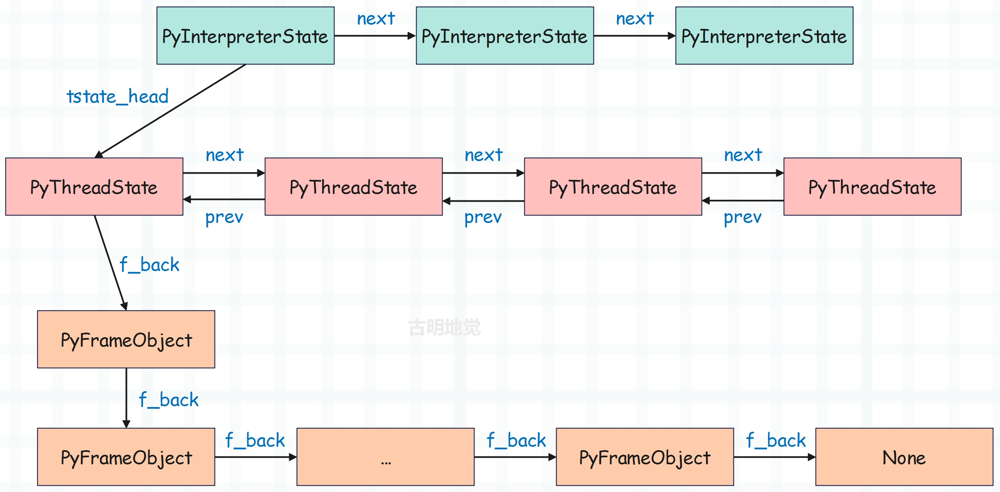

## 楔子

我们之前完成了 Python 的字节码、以及虚拟机的剖析工作，但这仅仅只是一部分，而其余的部分则被遮在了幕后。记得在分析虚拟机的时候，曾这么说过：

> 解释器启动时，首先会进行 "运行时环境" 的初始化，关于 "运行时环境" 的初始化是一个非常复杂的过程。并且 "运行时环境" 和 "执行环境" 是不同的， "运行时环境" 是一个全局的概念，而 "执行环境" 是一个栈帧。关于 "运行时环境" 后面会单独分析，这里就假设初始化动作已经完成，我们已经站在了虚拟机的门槛外面，只需要轻轻推动第一张骨牌，整个执行过程就会像多米诺骨牌一样，一环扣一环地展开。

所以这次，我们将回到时间的起点，从 Python 的应用程序被执行开始，一步一步紧紧跟随 Python 的轨迹，完整地展示解释器在启动之初的所有动作。当我们了解所有的初始化动作之后，也就能对 Python 执行引擎执行字节码指令时的整个运行环境了如指掌了。

## 线程模型

我们知道线程是操作系统调度的最小单元，那么 Python 的线程又是怎么样的呢？

启动一个 Python 线程，底层会启动一个 C 线程，然后启动操作系统的一个原生线程（OS 线程）。所以 Python 的线程实际上是对 OS 线程的一个封装，因此 Python 的线程是货真价实的。

然后 Python 还提供了一个 PyThreadState 对象，也就是线程状态对象，维护 OS 线程执行的状态信息，相当于是 OS 线程的一个抽象描述。虽然真正用来执行的线程及其状态肯定是由操作系统进行维护的，但是 Python 虚拟机在运行的时候总需要另外一些与线程相关的状态和信息，比如是否发生了异常等等，这些信息显然操作系统是没有办法提供的。

而 PyThreadState 对象正是为 OS 线程准备的、在虚拟机层面保存其状态信息的对象，也就是线程状态对象。在 Python 中，当前活动的 OS 线程对应的 PyThreadState 对象可以通过 PyThreadState_GET 获得，有了线程状态对象之后，就可以设置一些额外信息了。具体内容，我们后面会说。

当然除了线程状态对象之外，还有进程状态对象，我们来看看两者在底层的定义是什么？它们位于 Include/pystate.h 中。

~~~c
// ts 是 thread state 的简写
typedef struct _ts PyThreadState;
// is 是 interpreter state 的简写
typedef struct _is PyInterpreterState;
~~~

里面的 PyThreadState 表示线程状态对象，PyInterpreterState 表示进程状态对象，但它们都是 typedef 起的一个别名。前者是 struct _ts 的别名，后者是 struct _is 的别名，来看一下它们长什么样。

~~~C
// Include/cpython/pystate.h

// Python 的异常信息有三个属性
// exc_type：异常类型；exc_value：异常值，说白了就是异常本身；exc_traceback：异常的回溯栈
// 而 _PyErr_StackItem 相当于对这三个属性做了个封装，并且还通过 previous_item 形成了一个链表
typedef struct _err_stackitem {
    PyObject *exc_type, *exc_value, *exc_traceback;
    struct _err_stackitem *previous_item;
} _PyErr_StackItem;

struct _ts {
    // 指向上一个线程状态对象
    struct _ts *prev;
    // 指向下一个线程状态对象    
    struct _ts *next;
    // 进程状态对象，因为每个线程都隶属于一个进程
    PyInterpreterState *interp;
    // 当前正在执行的栈桢
    struct _frame *frame;
    // 递归深度
    int recursion_depth;
    // 标记栈是否溢出，如果溢出，还允许 50次 调用来处理运行时错误
    char overflowed;
    // 标记当前调用不能导致栈溢出的标志位
    char recursion_critical;
    // 栈检查计数器
    int stackcheck_counter;
    // 追踪和性能分析时的执行深度计数器
    int tracing;
    // 是否启用追踪
    int use_tracing;
    // C 级性能分析函数指针
    Py_tracefunc c_profilefunc;
    // C 级追踪函数指针
    Py_tracefunc c_tracefunc;
    // Python 级性能分析对象
    PyObject *c_profileobj;
    // Python 级追踪对象
    PyObject *c_traceobj;
    // 当前抛出的异常信息
    PyObject *curexc_type;
    PyObject *curexc_value;
    PyObject *curexc_traceback;
    // 当前正在处理的异常状态（如果没有协程/生成器）
    _PyErr_StackItem exc_state;
    // 指向当前正在处理的异常栈的栈顶
    // 估计有人好奇 exc_state 和 exc_info 啥区别，我们稍后说
    _PyErr_StackItem *exc_info;
    // 存储线程状态信息的字典
    PyObject *dict;
    // GIL 状态计数器
    int gilstate_counter;
    // 待抛出的异步异常
    PyObject *async_exc;
    // 创建该线程状态对象的线程 ID
    unsigned long thread_id;
    // 嵌套层级，用于延迟删除
    int trash_delete_nesting;
    // 延迟删除的对象，关于延迟删除，我们介绍列表的时候说过
    PyObject *trash_delete_later;
    // 线程状态正常删除时的回调函数
    void (*on_delete)(void *);
    // 回调函数的数据参数（实现为一个指向锁的弱引用）
    void *on_delete_data;
    // 协程起源追踪深度
    int coroutine_origin_tracking_depth;
    // 当异步生成器首次迭代时，用于存储相关状态和处理异常
    PyObject *async_gen_firstiter;
    // 当异步生成器被垃圾回收时，用于执行必要的清理工作
    PyObject *async_gen_finalizer;
    // 上下文对象
    PyObject *context;
    // 上下文版本号
    uint64_t context_ver;
    // 线程状态对象的唯一标识符
    uint64_t id;
};
~~~

以上是线程状态对象，然后我们再来看看进程状态对象。需要补充的是，struct _is、或者说 PyInterpreterState 在严格意义上应该叫做解释器状态对象。我们知道当解释器启动后会创建一个进程，但这两者并不是一对一的，因为 CPython 支持多解释器模式。也就是说可以在一个进程中启动多个解释器，这种模式一般应用在嵌入式 Python 或需要隔离环境的情况。

但是多解释器模式只能通过手动调用 Python/C API 实现，Python 代码层面无法直接创建和管理多个解释器，所以默认一个进程只会对应一个解释器实例。因此为了和线程对应，我们这里称 PyInterpreterState 为进程状态对象。

~~~c
// Include/internal/pycore_pystate.h

struct _is {
    // Python 支持多进程，多个进程也会以链表的形式进行组织
    // next 字段会指向下一个进程状态对象
    struct _is *next;
    // 每个进程内部可以有很多个线程，那么每个进程状态对象内部也可以有很多个线程状态对象
    // 这些线程状态对象会以链表的形式串起来，而 tstate_head 指向链表的头节点
    struct _ts *tstate_head;
    // 进程状态对象的 ID
    int64_t id;
    // 进程状态对象的引用计数
    int64_t id_refcount;
    // 指示解释器是否需要引用计数跟踪
    // 当多个子解释器共享同一个 ID 时，此标志用于确保 ID 的正确管理和清理
    int requires_idref;
    // ID相关的互斥锁
    PyThread_type_lock id_mutex;
    // 终止标志
    int finalizing;
    // sys.modules，所以可以看出，多个线程共用一个 sys.modules
    PyObject *modules;
    // 按模块索引存储的缓存，它允许通过数字索引快速访问模块
    // 而不是每次都通过模块名在 modules 字典中查找，提高了模块访问性能
    PyObject *modules_by_index;
    // sys 模块的属性字典
    PyObject *sysdict;
    // 内置名称空间
    PyObject *builtins;
    // 导入机制
    PyObject *importlib;
    // 线程切换检查间隔
    int check_interval;
    // 进程内部的线程数量
    long num_threads;
    // 线程栈大小
    size_t pythread_stacksize;
    // 编解码器搜索路径
    PyObject *codec_search_path;
    // 编解码器缓存
    PyObject *codec_search_cache;
    // 存储自定义的编解码错误处理器
    // 允许通过 codecs.register_error() 注册新的错误处理策略，用于处理编解码过程中遇到的错误
    PyObject *codec_error_registry;
    // 表示编解码系统是否已经完成初始化，为 1 时表示已初始化，0 表示未初始化
    int codecs_initialized;
    // 文件系统编码设置
    struct {
        char *encoding;   /* Filesystem encoding (encoded to UTF-8) */
        char *errors;     /* Filesystem errors (encoded to UTF-8) */
        _Py_error_handler error_handler;
    } fs_codec;
    // 解释器的配置参数结构体
    // 包含：路径设置、命令行参数、环境变量设置、编码设置、性能和调试选项、内存分配器设置、隔离选项等
    PyConfig config;
    // 控制动态库加载行为的标志位，用于 dlopen() 函数调用
    // 这个标志决定了共享库加载时的符号解析策略和可见性
#ifdef HAVE_DLOPEN
    int dlopenflags;
#endif
    // 存储进程状态信息的字典
    PyObject *dict;
    // 内置命名空间的备份副本，用于在必要时恢复内置命名空间的默认状态
    // 这是一个安全措施，防止内置命名空间被意外修改。
    PyObject *builtins_copy;
    // 存储当前解释器使用的导入函数，通常是 __import__ 函数
    // 因此解释器也允许自定义模块导入行为，用于实现特殊的导入逻辑。
    PyObject *import_func;
    // 帧评估函数，默认是 PyEval_EvalFrameDefault
    // 所以解释器也支持自定义帧评估函数，即自定义字节码执行逻辑
    _PyFrameEvalFunction eval_frame;
        Py_ssize_t co_extra_user_count;
    freefunc co_extra_freefuncs[MAX_CO_EXTRA_USERS];

#ifdef HAVE_FORK
    PyObject *before_forkers;
    PyObject *after_forkers_parent;
    PyObject *after_forkers_child;
#endif
    /* AtExit module */
    void (*pyexitfunc)(PyObject *);
    PyObject *pyexitmodule;

    uint64_t tstate_next_unique_id;

    struct _warnings_runtime_state warnings;

    PyObject *audit_hooks;
};
~~~

所以 PyInterpreterState 对象可以看成是对进程的模拟， PyThreadState 是对线程的模拟。我们之前分析虚拟机的时候说过执行环境，如果再将运行时环境加进去的话。

进程状态对象的 tstate_head 指向了线程状态对象，对应当前活跃的 Python 线程；而每个线程状态对象的 frame 都指向当前正在执行的栈帧对象。

## 线程环境的初始化

在解释器启动之后，初始化的动作是从 Py_NewInterpreter 函数开始的，然后这个函数调用了 new_interpreter 函数完成初始化。至于这两个函数长什么样一会再聊，先往后看。

我们知道当操作系统在运行一个可执行文件时，首先创建一个进程内核。同理在 Python 中亦是如此，会在 new_interpreter 中调用 PyInterpreterState_New 创建一个崭新的 PyInterpreterState 对象，该函数位于 Python/pystate.c 中。

~~~C
PyInterpreterState *
PyInterpreterState_New(void)
{
    // 触发审计事件
    if (PySys_Audit("cpython.PyInterpreterState_New", NULL) < 0) {
        return NULL;
    }
    // 为进程状态对象分配内存
    PyInterpreterState *interp = PyMem_RawMalloc(sizeof(PyInterpreterState));
    if (interp == NULL) {
        return NULL;
    }
    // 初始化内存
    memset(interp, 0, sizeof(*interp));
    interp->id_refcount = -1;
    // 每个线程执行 100 条字节码后进行切换
    interp->check_interval = 100;
    // 初始化 Python 配置
    PyConfig_InitPythonConfig(&interp->config);
    // 设置帧评估函数，默认为 _PyEval_EvalFrameDefault
    interp->eval_frame = _PyEval_EvalFrameDefault;
    // 设置动态库加载标志
#ifdef HAVE_DLOPEN
#if HAVE_DECL_RTLD_NOW
    interp->dlopenflags = RTLD_NOW;
#else
    interp->dlopenflags = RTLD_LAZY;
#endif
#endif
    // _PyRuntimeState 是 Python 解释器的全局运行时状态结构体，管理以下内容
    // GIL 锁相关的状态、解释器链表、垃圾回收系统状态、核心模块和类型
    // 信号处理、内存分配器、线程状态追踪、全局审计钩子
    // 注：每个进程只有一个全局运行时（_PyRuntime），它是最高级的运行时状态容器
    _PyRuntimeState *runtime = &_PyRuntime;
    // struct pyinterpreters 内部有四个字段
    // PyThread_type_lock mutex：互斥锁
    // PyInterpreterState *head：进程状态对象的头结点
    // PyInterpreterState *main：主进程对应的进程状态对象
    // int64_t next_id：下一个可用的解释器 ID，注意：主解释器 ID、或者说主进程状态对象的 ID 永远是 0
    struct pyinterpreters *interpreters = &runtime->interpreters;
    
    // 获取全局解释器锁，用于保护解释器链表的操作
    // 它确保在多线程环境下解释器的创建和管理是线程安全的
    HEAD_LOCK(runtime);
    // next_id 必须大于等于 0
    if (interpreters->next_id < 0) {
        PyErr_SetString(PyExc_RuntimeError,
                        "failed to get an interpreter ID");
        PyMem_RawFree(interp);
        interp = NULL;
    }
    else {
        // 分配新 ID 并更新 next_id
        interp->id = interpreters->next_id;
        interpreters->next_id += 1;
        // 让新创建的进程状态对象 interp，成为进程状态对象链表的头结点
        // 所以它的 next 要等于 interpreters->head
        interp->next = interpreters->head;
        // 如果 interpreters->main 等于 NULL，说明当前的进程是第一个进程
        // 那么显然它就是主进程，而之后创建的进程就是子进程了
        if (interpreters->main == NULL) {
            interpreters->main = interp;
        }
        // 然后再让 interpreters->head 等于 interp
        interpreters->head = interp;
    }
    HEAD_UNLOCK(runtime);

    if (interp == NULL) {
        return NULL;
    }

    interp->tstate_next_unique_id = 0;
    interp->audit_hooks = NULL;
    return interp;
}
~~~

所以解释器在启动时，会创建一个 PyInterpreterState 对象。如果开启了多进程，那么内部会继续创建，然后通过 next 指针将多个 PyInterpreterState 串成一个链表结构。

在调用 PyInterpreterState_New 成功创建 PyInterpreterState 之后，会再接再厉，调用 PyThreadState_New 创建一个全新的线程状态对象，相关函数定义同样位于 Python/pystate.c 中。

~~~C
PyThreadState *
PyThreadState_New(PyInterpreterState *interp)
{
    return new_threadstate(interp, 1);
}
~~~

我们注意到这个函数接收一个 PyInterpreterState，这说明了线程是依赖于进程的，因为需要进程给自己分配资源，然后这个函数又调用了 new_threadstate。除了传递 PyInterpreterState 之外，还传了一个 1，想也不用想这肯定是创建的线程数量。这里创建 1 个，也就是主线程（main thread）。

~~~C
static PyThreadState *
new_threadstate(PyInterpreterState *interp, int init)
{
    _PyRuntimeState *runtime = &_PyRuntime;
    // 为线程状态对象申请内存
    PyThreadState *tstate = (PyThreadState *)PyMem_RawMalloc(sizeof(PyThreadState));
    if (tstate == NULL) {
        return NULL;
    }
    // 设置从线程中获取函数调用栈的操作
    if (_PyThreadState_GetFrame == NULL) {
        _PyThreadState_GetFrame = threadstate_getframe;
    }
    // 下面就是设置内部的字段属性
    // 该线程所在的进程
    tstate->interp = interp;
    // 当前正在执行的栈桢，初始为 NULL
    tstate->frame = NULL;
    // 递归深度，初始为 0
    tstate->recursion_depth = 0;
    tstate->overflowed = 0;
    tstate->recursion_critical = 0;
    tstate->stackcheck_counter = 0;
    tstate->tracing = 0;
    tstate->use_tracing = 0;
    tstate->gilstate_counter = 0;
    tstate->async_exc = NULL;
    tstate->thread_id = PyThread_get_thread_ident();

    tstate->dict = NULL;

    tstate->curexc_type = NULL;
    tstate->curexc_value = NULL;
    tstate->curexc_traceback = NULL;

    tstate->exc_state.exc_type = NULL;
    tstate->exc_state.exc_value = NULL;
    tstate->exc_state.exc_traceback = NULL;
    tstate->exc_state.previous_item = NULL;
    tstate->exc_info = &tstate->exc_state;

    tstate->c_profilefunc = NULL;
    tstate->c_tracefunc = NULL;
    tstate->c_profileobj = NULL;
    tstate->c_traceobj = NULL;

    tstate->trash_delete_nesting = 0;
    tstate->trash_delete_later = NULL;
    tstate->on_delete = NULL;
    tstate->on_delete_data = NULL;

    tstate->coroutine_origin_tracking_depth = 0;

    tstate->async_gen_firstiter = NULL;
    tstate->async_gen_finalizer = NULL;

    tstate->context = NULL;
    tstate->context_ver = 1;

    if (init) {
        _PyThreadState_Init(runtime, tstate);
    }

    HEAD_LOCK(runtime);
    tstate->id = ++interp->tstate_next_unique_id;
    // 
    tstate->prev = NULL;
    // 当前线程状态对象的 next，我们看到指向了线程状态对象链表的头结点
    tstate->next = interp->tstate_head;
    // 因为每个线程状态对象的 prev 指针都要指向上一个线程状态对象
    // 如果是头结点的话，那么 prev 就是 NULL
    // 但由于新的线程状态对象在插入之后显然就变成了链表的新的头结点
    // 因此还需要将插入之前的头结点的 prev 指向新插入的线程状态对象
    if (tstate->next)
        tstate->next->prev = tstate;
    // 将 tstate 设置为线程状态对象链表的新的头结点
    interp->tstate_head = tstate;
    HEAD_UNLOCK(runtime);
    // 返回线程状态对象
    return tstate;
}
~~~

和 PyInterpreterState_New 相同， PyThreadState_New 会申请内存，创建线程状态对象，并且对每个字段进行初始化。其中 prev 指针和 next 指针分别指向了上一个线程状态对象和下一个线程状态对象。而且也肯定会存在某一时刻，存在多个 PyThreadState 对象形成一个链表，那么什么时刻会发生这种情况呢？显然用鼻子想也知道这是在启动多线程的时候。

> Python 在插入线程状态对象的时候采用的是头插法。

从源码中我们看到，虚拟机设置了从线程中获取函数调用栈的操作，所谓函数调用栈就是前面说的 PyFrameObject 对象链表。而且在源码中，PyThreadState 关联了 PyInterpreterState，PyInterpreterState 也关联了 PyInterpreterState 。

到目前为止，仅有的两个对象建立起了联系。对应到操作系统，我们说进程和线程建立了联系。

而在两者建立了联系之后，那么就很容易在 PyInterpreterState 和 PyThreadState 之间穿梭。并且在 Python 运行时环境中，会有一个变量（先卖个关子）一直维护着当前活动的线程，更准确的说是当前活动线程（OS 线程）对应的 PyThreadState 对象。初始时，该变量为 NULL，在 Python 启动之后创建了第一个 PyThreadState 之后，会调用 PyThreadState_Swap 函数来设置这个变量。

~~~C
// Python/pystate.c
PyThreadState *
PyThreadState_Swap(PyThreadState *newts)
{
    // 调用了 _PyThreadState_Swap，里面传入了两个参数
    // 第一个我们后面说，从名字上看显然这是和 GIL 相关的
    // 第二个参数就是新创建的线程状态对象
    return _PyThreadState_Swap(&_PyRuntime.gilstate, newts);
}

PyThreadState *
_PyThreadState_Swap(struct _gilstate_runtime_state *gilstate, PyThreadState *newts)
{
    // 获取当前的线程状态对象，并且保证线程的安全性
    PyThreadState *oldts = _PyRuntimeGILState_GetThreadState(gilstate);
    // 将 GIL 交给 newts，也就是新创建、即将获取执行权的线程状态对象
    _PyRuntimeGILState_SetThreadState(gilstate, newts);
    // ...
    return oldts;
}
~~~

所以逻辑很容易理解，有一个**变量**始终维护着当前活跃线程对应的线程状态对象，初始时它是个 NULL。而一旦解释器启动，并创建了第一个线程状态对象（显然对应主线程），那么就会将创建的线程状态对象交给这个**变量**保存。

如果调用 _PyThreadState_Swap 的时候，发现保存线程状态对象的**变量**不为 NULL，那么说明开启了多线程。**变量**保存的就是代码中的 oldts，也就是当前活动线程对应的线程状态对象，可由于它的时间片耗尽，解释器会剥夺它的执行权，然后交给 newts。那么 newts 就成为了新的当前活跃线程对应的线程状态对象，那么它也要交给**变量**进行保存。

而通过 _PyThreadState_Swap 可以看到，想要实现这一点，主要依赖两个宏。

~~~c
// 通过 &(gilstate)->tstate_current 获取当前活动线程（的线程状态对象）
#define _PyRuntimeGILState_GetThreadState(gilstate) \
    ((PyThreadState*)_Py_atomic_load_relaxed(&(gilstate)->tstate_current))

// 将 newts 设置为新的活跃线程，可以理解为发生了线程切换
#define _PyRuntimeGILState_SetThreadState(gilstate, value) \
    _Py_atomic_store_relaxed(&(gilstate)->tstate_current, \
                             (uintptr_t)(value))
~~~

然后这两个宏里面出现了 \_Py_atomic_load_relaxed、\_Py_atomic_store_relaxed 和 &(gilstate)->tstate_current ，这些又是什么呢？还有到底是哪个变量在维护着当前活动线程对应的线程状态对象呢？其实那两个宏已经告诉你了。

~~~C
//Include/internal/pycore_pystate.h
struct _gilstate_runtime_state {
    // GIL 检查是否启用
    int check_enabled;
    // 持有 GIL 的活动线程对应的线程状态对象
    _Py_atomic_address tstate_current;
    // 函数指针，用于获取栈桢
    PyThreadFrameGetter getframe;
    PyInterpreterState *autoInterpreterState;
    Py_tss_t autoTSSkey;
};

//Include/internal/pycore_atomic.h
#define _Py_atomic_store_relaxed(ATOMIC_VAL, NEW_VAL) \
    _Py_atomic_store_explicit((ATOMIC_VAL), (NEW_VAL), _Py_memory_order_relaxed)
#define _Py_atomic_load_relaxed(ATOMIC_VAL) \
    _Py_atomic_load_explicit((ATOMIC_VAL), _Py_memory_order_relaxed)

#define _Py_atomic_store_explicit(ATOMIC_VAL, NEW_VAL, ORDER) \
    atomic_store_explicit(&((ATOMIC_VAL)->_value), NEW_VAL, ORDER)
#define _Py_atomic_load_explicit(ATOMIC_VAL, ORDER) \
    atomic_load_explicit(&((ATOMIC_VAL)->_value), ORDER)
~~~

不难发现：

- \_Py_atomic_load_relaxed 调用了 \_Py_atomic_load_explicit，\_Py_atomic_load_explicit 又调用了 atomic_load_explicit。
- \_Py_atomic_store_relaxed 调用了 \_Py_atomic_store_explicit，\_Py_atomic_store_explicit 调用了 atomic_store_explicit。

而 atomic_load_explicit 和 atomic_store_explicit 是系统头文件 stdatomic.h 中定义的 api，这是在系统的 api 中修改的，所以说是线程安全的。

介绍完中间部分的内容，那么我们可以从头开始分析 Python 运行时的初始化了，我们说它是从 Py_NewInterpreter 开始的。

~~~C
// Python/pylifecycle.c
PyThreadState *
Py_NewInterpreter(void)
{   
    // 线程状态对象
    PyThreadState *tstate = NULL;
    // 传入线程对象，调用 new_interpreter
    PyStatus status = new_interpreter(&tstate);
    if (_PyStatus_EXCEPTION(status)) {
        Py_ExitStatusException(status);
    }
    // 返回线程状态对象
    return tstate;
}
~~~

然后我们的重点是 new_interpreter 函数，进程状态对象的创建就是在这个函数里面发生的。

~~~C
// Include/cpython/initconfig.h
// 程序执行的状态，会检测是否发生了异常。
typedef struct {
    enum {
        _PyStatus_TYPE_OK=0,     // 正常
        _PyStatus_TYPE_ERROR=1,  // 错误
        _PyStatus_TYPE_EXIT=2    // 退出
    } _type;
    const char *func;     // 发生错误的函数名
    const char *err_msg;  // 错误消息
    int exitcode;         // 退出码
} PyStatus;

// Python/pylifecycle.c
static PyStatus
new_interpreter(PyThreadState **tstate_p)
{
    PyStatus status;
    // 运行时初始化，如果出现异常直接返回
    status = _PyRuntime_Initialize();
    if (_PyStatus_EXCEPTION(status)) {
        return status;
    }
    // 获取运行时
    _PyRuntimeState *runtime = &_PyRuntime;
    if (!runtime->initialized) {
        return _PyStatus_ERR("Py_Initialize must be called first");
    }
    // GIL API 在多解释器环境下存在问题，无法正常工作，因此需要禁用 PyGILState_Check() 来避免问题
    _PyGILState_check_enabled = 0;
    // 创建进程状态对象
    PyInterpreterState *interp = PyInterpreterState_New();
    if (interp == NULL) {
        *tstate_p = NULL;
        return _PyStatus_OK();
    }
    // 根据进程状态对象创建线程状态对象，维护对应的 OS 线程的状态
    PyThreadState *tstate = PyThreadState_New(interp);
    if (tstate == NULL) {
        PyInterpreterState_Delete(interp);
        *tstate_p = NULL;
        return _PyStatus_OK();
    }
    // 将 GIL 的控制权交给创建的线程
    PyThreadState *save_tstate = PyThreadState_Swap(tstate);

    // 从当前或主进程状态对象复制配置到新进程状态对象
    PyConfig *config;
    if (save_tstate != NULL) {
        config = &save_tstate->interp->config;
    } else {
        PyInterpreterState *main_interp = PyInterpreterState_Main();
        config = &main_interp->config;
    }
    status = _PyConfig_Copy(&interp->config, config);
    if (_PyStatus_EXCEPTION(status)) {
        return status;
    }
    config = &interp->config;
    
    // 异常系统初始化
    status = _PyExc_Init();
    if (_PyStatus_EXCEPTION(status)) {
        return status;
    }
    status = _PyErr_Init();
    if (_PyStatus_EXCEPTION(status)) {
        return status;
    }

    // 创建模块字典
    PyObject *modules = PyDict_New();
    if (modules == NULL) {
        return _PyStatus_ERR("can't make modules dictionary");
    }
    interp->modules = modules;
    
    // 初始化 sys 模块
    PyObject *sysmod = _PyImport_FindBuiltin("sys", modules);
    if (sysmod != NULL) {
        interp->sysdict = PyModule_GetDict(sysmod);
        if (interp->sysdict == NULL) {
            goto handle_error;
        }
        Py_INCREF(interp->sysdict);
        PyDict_SetItemString(interp->sysdict, "modules", modules);
        if (_PySys_InitMain(runtime, interp) < 0) {
            return _PyStatus_ERR("can't finish initializing sys");
        }
    }
    else if (PyErr_Occurred()) {
        goto handle_error;
    }
    
    // 初始化 builtins 模块
    PyObject *bimod = _PyImport_FindBuiltin("builtins", modules);
    if (bimod != NULL) {
        interp->builtins = PyModule_GetDict(bimod);
        if (interp->builtins == NULL)
            goto handle_error;
        Py_INCREF(interp->builtins);
    }
    else if (PyErr_Occurred()) {
        goto handle_error;
    }
    
    if (bimod != NULL && sysmod != NULL) {
        // 添加内置异常
        status = _PyBuiltins_AddExceptions(bimod);
        if (_PyStatus_EXCEPTION(status)) {
            return status;
        }
        status = _PySys_SetPreliminaryStderr(interp->sysdict);
        if (_PyStatus_EXCEPTION(status)) {
            return status;
        }
        
        status = _PyImportHooks_Init();
        if (_PyStatus_EXCEPTION(status)) {
            return status;
        }
        
        // 初始化导入系统
        status = init_importlib(interp, sysmod);
        if (_PyStatus_EXCEPTION(status)) {
            return status;
        }

        status = init_importlib_external(interp);
        if (_PyStatus_EXCEPTION(status)) {
            return status;
        }
        
        // 初始化编码
        status = _PyUnicode_InitEncodings(tstate);
        if (_PyStatus_EXCEPTION(status)) {
            return status;
        }
        
        // 设置标准流
        status = init_sys_streams(interp);
        if (_PyStatus_EXCEPTION(status)) {
            return status;
        }
        
        // 添加 main 模块
        status = add_main_module(interp);
        if (_PyStatus_EXCEPTION(status)) {
            return status;
        }
        
        // 初始化 site 导入
        if (config->site_import) {
            status = init_import_size();
            if (_PyStatus_EXCEPTION(status)) {
                return status;
            }
        }
    }

    if (PyErr_Occurred()) {
        goto handle_error;
    }

    *tstate_p = tstate;
    return _PyStatus_OK();

handle_error:
    // 错误处理，如果失败则清理所有资源并恢复原状态
    PyErr_PrintEx(0);
    PyThreadState_Clear(tstate);
    PyThreadState_Swap(save_tstate);
    PyThreadState_Delete(tstate);
    PyInterpreterState_Delete(interp);

    *tstate_p = NULL;
    return _PyStatus_OK();
}
~~~

Python在初始化运行时环境时，肯定也要对类型系统进行初始化等等，整体是一个非常庞大的过程。

到这里，我们对 new_interpreter 算是有了一个阶段性的成功，我们创建了代表进程和线程概念的 PyInterpreterState 和 PyThreadState 对象，并且在它们之间建立的联系。下面 new_interpreter 将进行入另一个环节，设置系统 module。

### 

