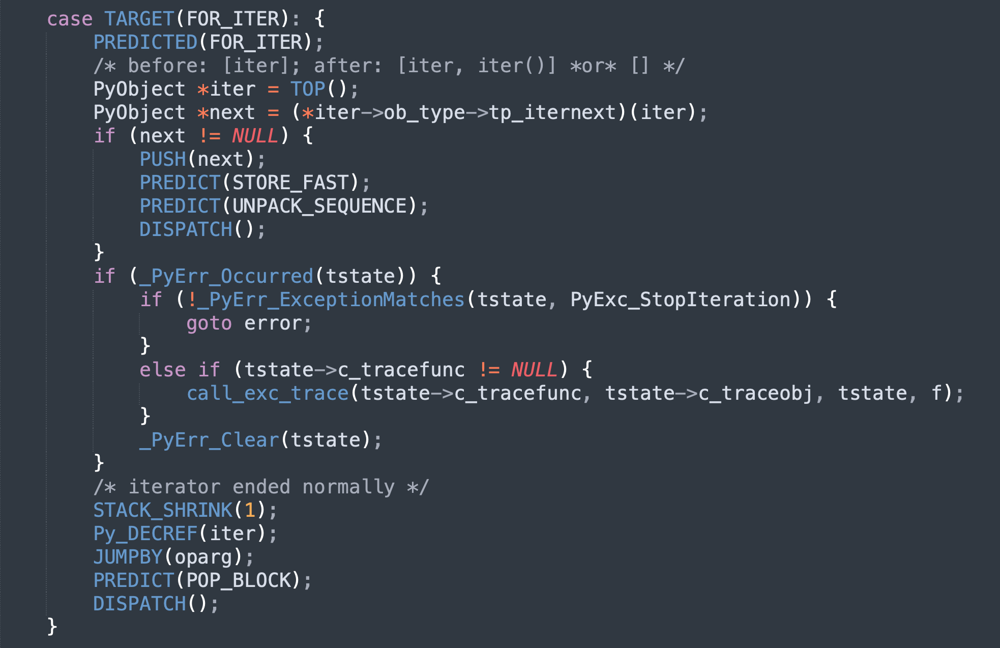
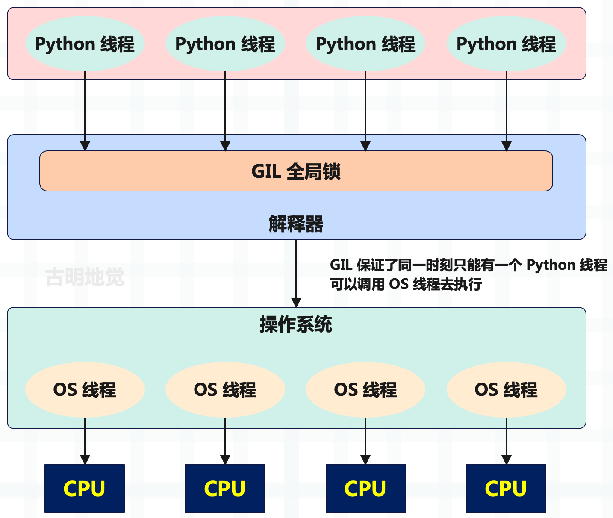
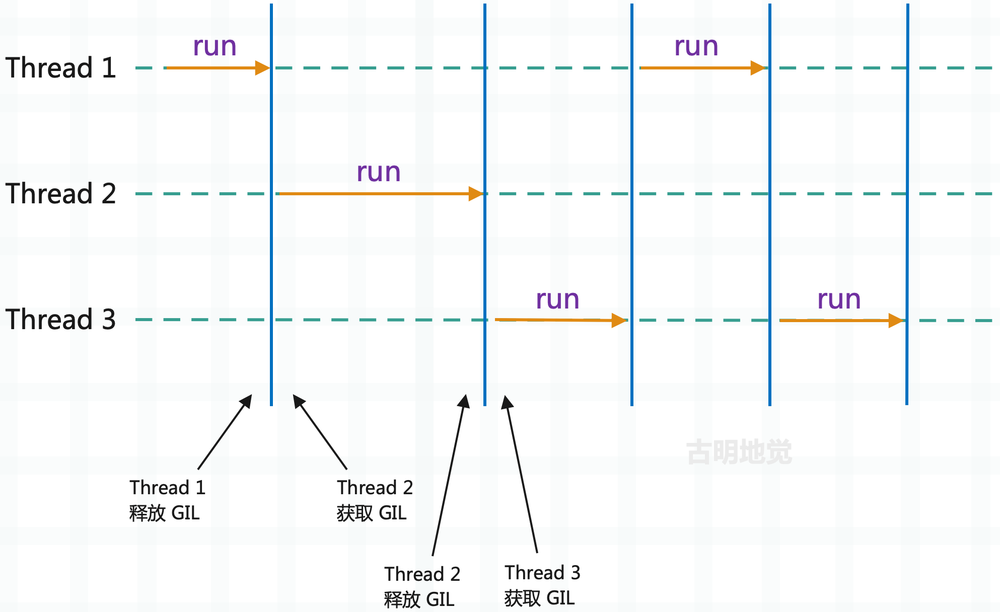
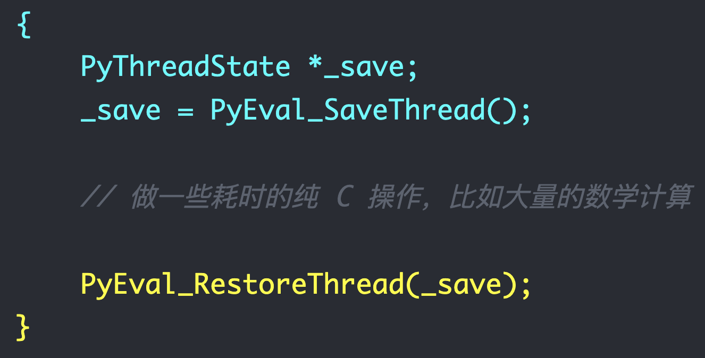

## 楔子

这次我们来说一下 Python 的多线程，上篇文章提到了 Python 线程是对 OS 线程的一个封装，并提供了相应的线程状态对象 PyThreadState，来记录 OS 线程的一些状态信息。

那什么是多线程呢？首先线程是操作系统调度 CPU 工作的最小单元，进程则是操作系统资源分配的最小单元，线程是需要依赖于进程的，并且每一个进程内部至少有一个线程，这个线程我们称之为主线程。然后主线程可以创建子线程，而一个进程中如果有多个线程在工作，我们就称之为多线程。

开发一个多线程应用程序是很常见的事情，很多语言都支持多线程，有的是原生支持，有的是通过库来支持。而 Python 毫无疑问也支持多线程，并且它是通过标准库 threading 实现的。

当然标准库 threading 底层依赖了 \_thread，而 \_thread 是一个用 C 实现的库，位于 Modules/\_threadmodule.c 中。还记得这个 Modules 目录是做什么的吗？它也是 CPython 源码的一部分，里面存放的都是一些用 C 实现、并且对性能要求较为苛刻的库，编译之后就内嵌在解释器里面了。

另外提到多线程，总会让人想到 GIL（global interpreter lock）这个万恶之源，我们后面会详细介绍。目前我们知道 Python 多线程是不能利用多核的，因为虚拟机使用一个全局解释器锁（GIL）来控制线程对程序的执行，这个结果就使得无论你的 CPU 有多少核，但是同时被线程调度的 CPU 只有一个。不过底层是怎么做的呢？我们下面就来分析一下。

## GIL 与线程调度

如果讨论基于线程的并⾏，那么全局解释器锁（GIL）是⼀个绕不开的话题。我们知道 GIL 是⼀个施加在解释器之上的互斥锁，⽤于防⽌本机多个线程同时执⾏字节码。换句话说 ，GIL 确保解释器在程序执⾏期间，同⼀时刻只会使⽤操作系统的⼀个线程。不管你的 CPU 是多少核，以及你开了多少个线程，同⼀时刻只会使⽤操作系统的⼀个线程、去调度⼀个 CPU。⽽且 GIL 不仅影响 Python 代码，也会影响 Python/C API。

⾸先我们来分析⼀下为什么会有 GIL 这个东⻄存在？举个例⼦：

~~~Python
import dis

dis.dis("del obj")
"""
 0 DELETE_NAME              0 (obj)
 2 LOAD_CONST               0 (None)
 4 RETURN_VALUE
"""
~~~

当使⽤ del 删除⼀个变量的时候，对应的指令是 DELETE_NAME，这条指令做的事情⾮常简单：通过宏 Py_DECREF 将对象的引⽤计数减 1，并且判断减少之后其引⽤计数是否为 0，如果为 0 就进⾏回收。伪代码如下:

~~~C
--obj->ob_refcnt
if (obj -> ob_refcnt == 0){
    销毁obj
}
~~~

所以总共是两步：第⼀步先将对象的引⽤计数减 1；第⼆步判断引⽤计数是否为 0，为 0 则进⾏销毁。那么问题来了，假设有两个线程 A 和 B，内部都引⽤了某个变量 obj，此时 obj 指向的对象的引⽤计数为 2，然后让两个线程都执⾏ del obj 这⾏代码。

其中 A 线程先执⾏，A 线程在执⾏完 `--obj -> ob_refcnt` 之后，会将对象的引⽤计数减⼀，但不幸的是，这个时候调度机制将 A 挂起了，唤醒了 B。⽽ B 也执⾏ del obj，但它⽐较幸运，将两步⼀块执⾏完了。⽽由于之前 A 已经将引⽤计数减 1，所以 B 再减 1 之后会发现对象的引⽤计数为 0，从⽽执⾏了对象的销毁动作（tp_dealloc），内存被释放。

然后 A ⼜被唤醒了，此时开始执⾏第⼆个步骤，但由于 `obj->ob_refcnt` 已经被减少到 0，所以条件满⾜，那么 A 依旧会对 obj 指向的对象进⾏释放。但问题是这个对象所占的内存已经被释放了，所以 obj 此时就成了悬空指针。如果再对 obj 指向的对象进⾏释放，最终会引发什么后果，只有天知道，这也是臭名昭著的⼆次释放。

关键来了，所以 CPython 引⼊了 GIL，GIL 是解释器层⾯上的⼀把超级⼤锁，它是字节码级别的互斥锁。作⽤就是：在同时⼀刻，只让⼀个线程执⾏字节码，并且保证每⼀条字节码在执⾏的时候都不会被打断。

因此由于 GIL 的存在，会使得线程只有把当前的某条字节码指令执⾏完毕之后才有可能发⽣调度。所以⽆论是 A 还是 B，线程调度时，要么发⽣在 DELETE_NAME 这条指令执⾏之前，要么发⽣在 DELETE_NAME 这条指令执⾏完毕之后，但是不存在指令（不仅是 DELETE_NAME，⽽是所有指令）执⾏到⼀半的时候发⽣调度。

所以 GIL 才被称之为是字节码级别的互斥锁，它保护每条字节码指令只有在执⾏完毕之后才会发⽣线程调度，或者说线程切换。

回到上⾯那个 del obj 的例⼦当中，由于引⼊了 GIL，所以就不存在我们之前说的：在 A 将引⽤计数减⼀之后，挂起 A、唤醒 B 这⼀过程。因为 A 已经开始了 DELETE_NAME 这条指令的执⾏，⽽在没执⾏完之前是不会发⽣线程调度的，所以此时不会出现悬空指针的问题。

因此 Python 的⼀条字节码指令会对应多⾏ C 代码，这其中可能会涉及很多个 C 函数的调⽤，我们举个例⼦：

这是 FOR_ITER 指令，Python 的 for 循环对应的就是这条指令。可以看到⾥⾯的逻辑⾮常多，当然也涉及了多个函数调⽤，⽽且函数内部⼜会调⽤其它的函数。如果没有 GIL，那么这些逻辑在执⾏的时候，任何⼀处都可能被打断，发⽣线程调度。

但是有了 GIL 就不同了，它是施加在字节码层⾯上的互斥锁，保证每次只有⼀个线程执⾏字节码指令。并且不允许指令执⾏到⼀半时发⽣调度，因此 GIL 就保证了每条指令内部的 C 逻辑整体都是原⼦的。⽽如果没有 GIL，那么即使是简单的引⽤计数，在计算上都有可能出问题。事实上，GIL 最初的⽬的就是为了解决引⽤计数的安全性问题。

因此 GIL 对于 Python 对象的内存管理来说是不可或缺的，但是还有⼀点需要注意，GIL 和 Python 语⾔本身没有什么关系，它只是官⽅在实现 CPython 时，为了⽅便管理内存所引⼊的⼀个实现。⽽其它种类的 Python 解释器则不⼀定需要 GIL，⽐如 JPython。

## GIL 有没有可能被移除

那么 CPython 中的 GIL 将来是否会被移除呢？因为对于现在的多核 CPU 来说，GIL ⽆疑是进⾏了限制。关于能否移除 GIL，就我本⼈来看短时间内不可能（针对 CPython），这都⼏⼗年了，能移除早就移除了。事实上在 Python 诞⽣没多久，就有⼈发现了这⼀诡异之处，因为当时的⼈发现使⽤多线程在计算上居然没有任何的性能提升，反⽽还⽐单线程慢了⼀点。

⽽ Python 的官⽅⼈员回复的是：不要使⽤多线程，去使⽤多进程。此时站在上帝视⻆的我们知道，因为 GIL 的存在使得同⼀时刻只有⼀个核被使⽤，所以对于纯计算的代码来说，理论上多线程和单线程是没有区别的。但由于多线程涉及上下⽂的切换，会有⼀些额外开销，反⽽还慢⼀些。

因此在得知 GIL 的存在之后，有两位勇⼠站了出来表示要移除 GIL，当时 Python 还是 1.5 的版本，⾮常古⽼了。当他们在去掉 GIL 之后，发现多线程的效率相⽐之前确实提升了，但是单线程的效率只有原来的⼀半，这显然是不能接受的。因为把 GIL 去掉了，就意味着需要更细粒度的锁来解决共享数据的安全问题，这就会导致⼤量的加锁、解锁。⽽加锁、解锁对于操作系统来说是⼀个⽐较重量级的操作，所以 GIL 的移除是极其困难的。

另外还有⼀个关键，就是当 GIL 被移除之后，会使得扩展模块的编写难度⼤⼤增加。因为 GIL 保护的不仅仅是解释器，还有 Python/C API。像很多现有的 C 扩展，在很⼤程度上都依赖 GIL 提供的解决⽅案，如果要移除 GIL，就需要重新解决这些库的线程安全问题。

⽐如我们熟知的 numpy，numpy 的速度之所以这么快，就是因为底层是 C 写的，然后封装成 Python 的扩展模块。⽽其它的库，像 pandas、scipy、sklearn 都是在 numpy 之上开发的，如果把 GIL 移除了，那么这些库就都不能⽤了。还有深度学习，像 tensorflow、pytorch 等框架所使⽤的底层算法也都不是 Python 编写的，⽽是 C 和 C++，Python 只是起到了⼀个包装器的作⽤。Python 在深度学习领域很⽕，主要是它可以和 C ⽆缝结合，如果 GIL 被移除，那么这些框架也没法⽤了。

因此在 2024 年的今天，⽣态如此成熟的 Python，⼏乎是不可能摆脱 GIL 了。否则这些知名的科学计算相关的库就要重新洗牌了，可想⽽知这是⼀个什么样的⼯作量。

补充：这⾥我说 GIL ⽆法被移除其实有⼀些过于绝对，如果在移除 GIL 之后能够保证以下三点，那么 GIL 的移除就是成功的。

+ GIL 移除之后不能影响单线程的运⾏速度；
+ GIL 移除之后不能影响 IO 密集场景下的多线程运⾏速度；
+ GIL 移除之后不能破坏现有的 C 扩展；

如果这三点能够保证的话，那么 GIL 是可以被移除的，⽽只要有⼀点⽆法保证，那么就⽆法移除 GIL。⽽关于移除 GIL 的尝试，也从来都没有停⽌，但⽆⼀例外都失败了，原因也都是因为在移除 GIL 之后会有性能问题、以及要改变很多的 C API。

## 图解 GIL

Python 启动⼀个线程，底层会启动⼀个 C 线程，最终启动⼀个操作系统的线程。所以 Python 的线程实际上是封装了 C 的线程，进⽽封装了 OS 线程，⼀个 Python 线程对应⼀个 OS 线程。

实际执⾏的肯定是 OS 线程，⽽ OS 线程 Python 解释器是没有权限控制的，它能控制的只有 Python 线程。假设有 4 个 Python 线程，那么肯定对应 4 个 OS 线程，但是解释器每次只让⼀个 Python 线程调⽤ OS 线程去执⾏，其它的线程只能⼲等着，只有当前的 Python 线程将 GIL 释放了，其它的某个线程在拿到 GIL 时，才可以调⽤相应的 OS 线程去执⾏。

总结⼀下就是，没有拿到 GIL 的 Python 线程，对应的 OS 线程会处于休眠状态。拿到 GIL 的 Python 线程，对应的 OS 线程会从休眠状态被唤醒。

所以 Python 线程是调⽤ C 的线程、进⽽调⽤操作系统的 OS 线程，⽽ OS 线程在执⾏过程中解释器是控制不了的。因为解释器的控制范围只有 Python 线程，它⽆权⼲预 C 的线程、更⽆权⼲预 OS 线程。

再次强调：GIL 并不是 Python 语⾔的特性，它是 CPython 开发⼈员为了⽅便内存管理才加上去的。只不过解释器我们⼤部分⽤的都是 CPython，所以很多⼈认为 GIL 是 Python 语⾔本身的⼀个特性，但其实不是的。

Python 是⼀⻔语⾔，⽽ CPython 是对使⽤ Python 语⾔编写的源代码进⾏解释执⾏的⼀个解释器。⽽解释器不⽌ CPython ⼀种，还有 JPython，但 JPython 就没有 GIL。因此 Python 语⾔本身是和 GIL ⽆关的，只不过我们平时在说 Python 的 GIL 的时候，指的都是 CPython ⾥⾯的 GIL，这⼀点要注意。

所以就类似于上图，⼀个线程执⾏⼀会⼉，另⼀个线程执⾏⼀会⼉，⾄于线程怎么切换、什么时候切换，我们后⾯会说。

对于 Python ⽽⾔，解释执⾏字节码是其核⼼所在，所以通过 GIL 来互斥不同线程执⾏字节码。如果⼀个线程想要执⾏，就必须拿到 GIL，⽽⼀旦拿到 GIL，其它线程就⽆法执⾏了，如果想执⾏，那么只能等 GIL 释放、被⾃⼰获取之后才可以。并且我们说 GIL 保护的不仅仅是 Python 解释器，还有 Python 的 C API，在使⽤ C/C++ 和 Python 混合开发，涉及到原⽣线程和 Python 线程相互合作时，也需要通过 GIL 进⾏互斥。

那么问题来了，有了 GIL，在编写多线程代码的时候是不是就意味着不需要加锁了呢？

答案显然不是的，因为 GIL 保护的是每条字节码不会被打断，⽽很多代码都是⼀⾏对应多条字节码，所以每⾏代码是可以被打断的。⽐如：a = a + 1 这样⼀条语句，它对应 4 条字节码：LOAD_NAME、LOAD_CONST、BINARY_ADD、STORE_NAME。

假设此时 a = 8，两个线程 A 和 B 同时执⾏ a = a + 1，线程 A 执⾏的时候已经将 a 和 1 压⼊运⾏时栈，栈⾥⾯的 a 指向的是 8。但还没有执⾏ BINARY_ADD 的时候，发⽣线程切换，轮到线程 B 执⾏，此时 B 得到的 a 显然还是指向 8，因为线程 A 还没有对变量 a 做加法操作。然后 B ⽐较幸运，它⼀次性将这 4 条字节码全部执⾏完了，所以 a 会指向 9。

然后线程调度再切换回 A，此时会执⾏ BINARY_ADD，不过注意：栈⾥⾯的 a ⽬前指向的还是 8，因此加完之后是 9。所以问题就出现了，本来 a 应该指向10，但是却指向 9，就是因为在执⾏的时候发⽣了线程调度。

所以我们在编写多线程代码的时候还是需要加锁的，GIL 只是保证每条字节码执⾏的时候不会被打断，但是⼀⾏代码往往对应多条字节码，所以我们会通过 threading.Lock() 再加上⼀把锁。这样即便发⽣了线程调度，但由于在 Python 的层⾯上⼜加了⼀把锁，别的线程依旧⽆法执⾏，这样就保证了数据的安全。

## GIL 何时被释放

那么问题来了，GIL 啥时候会被释放呢？关于这⼀点，Python 有⼀个⾃⼰的调度机制：

+ 当遇⻅ IO 阻塞的时候会释放，因为 IO 阻塞是不耗费 CPU 的，所以此时虚拟机会把该线程的锁释放；
+ 即便是耗费 CPU 的运算，也不会⼀直执⾏，会在执⾏⼀⼩段时间之后释放锁，为了保证其它线程都有机会执⾏，就类似于 CPU 时间⽚轮转的⽅式；

调度机制虽然简单，但是这背后还隐藏着两个问题：

+ 在何时挂起线程，选择处于等待状态的下⼀个线程？
+ 在众多处于等待状态的候选线程中，选择激活哪⼀个线程？

在 Python 的多线程机制中，这两个问题分别是由不同的层次解决的。对于何时进⾏线程调度的问题，是由 Python ⾃身决定的。思考⼀下操作系统是如何进⾏进程切换的，当⼀个进程运⾏了⼀段时间之后，发⽣了时钟中断，操作系统响应时钟，并开始进⾏进程的调度。

同样，Python 也是模拟了这样的时钟中断，来激活线程的调度。解释器内部维护着⼀个数值，这个数值就是 Python 内部的时钟，在 Python2 中如果⼀个线程执⾏的字节码指令数达到了这个值，那么会进⾏线程切换，并且这个值在 Python3 中仍然存在。

~~~Python
import sys

# 默认执⾏ 100 条字节码之后，启动线程调度机制，进⾏切换
print(sys.getcheckinterval())  # 100

# 但是在 Python3 中，改成了时间间隔
# 表示⼀个线程在执⾏ 0.005s 之后进⾏切换
print(sys.getswitchinterval())  # 0.005
# 上⾯的⽅法我们都可以⼿动设置
# sys.setcheckinterval(N) # sys.setswitchinterval(N)
~~~

sys.getcheckinterval 和 sys.setcheckinterval 在 Python3.8 的时候已经废弃了，因为线程发⽣调度不再取决于执⾏的字节码条数，⽽是时间间隔。

除了执⾏时间之外，还有就是之前说的遇⻅ IO 阻塞的时候会进⾏切换，所以多线程在 IO 密集型的场景下还是很有⽤处的。说实话如果 IO 都不会⾃动切换的话，那么 Python 的多线程才是真的没有⽤。

然后⼀个问题就是，Python 在切换的时候会从等待的线程中选择哪⼀个呢？很简单，Python 直接借⽤了底层操作系统提供的调度机制来决定下⼀个获取 GIL 的线程究竟是谁。

所以⽬前为⽌可以得到如下结论：

+ GIL 对于 Python 对象的内存管理来说是不可或缺的；
+ GIL 和 Python 语⾔本身没有什么关系，它只是 CPython 为了⽅便管理内存所引⼊的⼀个实现，只不过 CPython 是使⽤最为⼴泛的⼀种 Python 解释器，我们默认指的就是它。但是别的 Python 解释器则不⼀定需要 GIL，⽐如 JPython；

关于 GIL 到底是个什么东⻄（底层就是⼀个结构体实例），以及为什么要有 GIL，我们已经清楚了。那么重点来了，我们能不能⼿动释放 GIL 呢？

在 Python ⾥⾯不可以，但在 C ⾥⾯是可以的。因为 GIL 是为了解决 Python 的内存管理⽽引⼊的，但如果是那些不需要和 Python 代码⼀起⼯作的纯 C 代码，那么是可以在没有 GIL 的情况下运⾏的。

因为 GIL 是字节码级别的互斥锁，显然这是在解释执⾏字节码的时候所施加的。⽽且不仅是 GIL，还有 Python 的动态性，都是在解释字节码的时候动态赋予的。⽽ C 代码经过编译之后直接就是⼆进制码了，所以它相当于绕过了解释执⾏这⼀步，因此也就失去了相应的动态性（换来的是速度的提升）。那么同理，既然能绕过解释执⾏这⼀步，那么就意味着也能绕过 GIL 的限制，因为 GIL 也是在解释执⾏字节码的时候施加的。

因此当我们在 C 中创建了不绑定任何 Python 对象的 C 级结构时，也就是在处理 C-Only 部分时，可以将全局解释器锁给释放掉。换句话说，我们可以使⽤ C 绕过 GIL，实现基于线程的并⾏。

注意：GIL 是为了保护 Python 对象的内存管理⽽设置的，如果我们要释放 GIL，那么⼀定⼀定⼀定不能和 Python 对象发⽣任何的交互，必须是纯 C 的数据结构。

## GIL 在 C 的层⾯要如何释放

⾸先必须澄清⼀点，GIL 只有在多线程的情况下才会出现，如果是单线程，那么 CPython 是不会创建 GIL 的。⽽⼀旦我们启动了多线程，那么 GIL 就被创建了。线程如果想安全地访问 Python 对象，就必须要持有全局解释器锁（GIL），如果没有这个锁，那么多线程基本上算是废了，即便是最简单的操作都有可能发⽣问题。例如两个线程同时引⽤了⼀个对象，那么这个对象的引⽤计数应该增加 2，但可能出现只增加 1 的情况。

因此存在⼀个铁打不动的规则：单线程除外，如果是多线程，只有获得了 GIL 的线程才能操作 Python 对象或者调⽤ Python / C API。⽽为了保证每个线程都能有机会执⾏，解释器有着⾃⼰的⼀套规则，可以定期迫使线程释放 GIL，让其它线程也有机会执⾏，因为线程都是抢占式的。但当出现了 IO 阻塞，会⽴即强制释放。

那么问题来了，如果在 C 里面有一段 Python 无关的逻辑，那么这段逻辑完全可以并行执行，此时便可主动释放 GIL，该怎么做呢？用大白话解释就是：

以上在编写扩展模块的时候⾮常常⽤，因此 Python 底层提供了两个宏：

~~~C
// 从名字上来看，直译就是开始允许多线程（并⾏执⾏）
// 这⼀步就是释放 GIL，表示这 GIL 不要也罢
Py_BEGIN_ALLOW_THREADS
 
/* 做⼀些耗时的纯 C 操作，当然 IO 操作也是如此
   ⽽我们使⽤这两个宏很明显是为了耗时的 C 操作 */ 
// 执⾏完毕之后，如果要和 Python 对象进⾏交互
// 那么必须要再度获取 GIL，相当于结束多线程的并⾏执⾏
Py_END_ALLOW_THREADS
 
// 除了上⾯这两个宏之外，还可以使⽤下⾯这两个宏，效果是⼀样的
// Py_UNBLOCK_THREADS、Py_BLOCK_THREADS 
~~~

我们来看⼀下这两个宏在底层是怎么定义的？

~~~C
// Include/ceval.h
#define Py_BEGIN_ALLOW_THREADS { \
                        PyThreadState *_save; \
                        _save = PyEval_SaveThread();
#define Py_END_ALLOW_THREADS    PyEval_RestoreThread(_save); \
                 }
~~~

所以，如果将这两个宏展开的话，那么就是下⾯这个样⼦。

浅蓝⾊的部分就是 Py_BEGIN_ALLOW_THREADS，⻩⾊的部分则是 Py_END_ALLOW_THREADS，它们组成了⼀个新的代码块，我们的纯 C 逻辑也会写在⾥⾯。很明显，这两者必须同时出现，如果只出现⼀个，那么编译时就会出现语法错误，因为⼤括号没有成对出现。

+ 所以 Py_BEGIN_ALLOW_THREADS 宏会打开⼀个新的代码块（⼤括号的左半部分），并定义⼀个隐藏的局部变量；
+ Py_END_ALLOW_THREADS 宏则是关闭这个代码块（⼤括号的右半部分）。

如果 Python 编译为不⽀持线程的版本（⼏乎没⻅过），它们定义为空。如果⽀持线程，那么代码块会进⾏展开，⽽展开的结果就是上图展示的样⼦。

~~~C
{
    PyThreadState *_save;
    _save = PyEval_SaveThread();
    // ... ...
    PyEval_RestoreThread(_save);
}
~~~

我们也可以使⽤更低级的 API 来实现这⼀点：

~~~c
{
    PyThreadState *_save;
    _save = PyThreadState_Swap(NULL); 
    PyEval_ReleaseLock();
    // ... ...
    PyEval_AcquireLock(); 
    PyThreadState_Swap(_save);
}
~~~

当然低级的 API 会有⼀些微妙的差异，因为锁操作不⼀定保持变量的⼀致性，⽽ PyEval_RestoreThread 可以对这个变量进⾏保存和恢复。同样，如果是不⽀持线程的解释器，那么 PyEval_SaveThread 和 PyEval_RestoreThread 就会不操作锁，然后让 PyEval_ReleaseLock 和 PyEval_AcquireLock 不可⽤，这就使得不⽀持线程的解释器可以动态加载⽀持线程的扩展。

如果不是很理解没有关系，我们梳理⼀下整个过程。⾸先有⼀个全局变量，它保存了当前活跃线程的线程状态对象（指针），这⾥的活跃线程显然就是获取到 GIL 的线程。换句话说，这个关键的全局变量保存的是谁的状态对象，那么获取到 GIL 的活跃线程就是谁。

然后是释放 GIL：

~~~C
{
    PyThreadState *_save;
    // PyThreadState_Swap(NULL) 会将保存线程状态对象指针的全局变量设置为 NULL
    // 也就是不让全局变量再保存⾃身的线程状态对象，因为要释放 GIL 了
    // 并且该函数设置的时候，还会返回之前保存的线程状态对象（显然对应当前线程）
    // 这⾥⽤局部变量 _save 保存起来
    _save = PyThreadState_Swap(NULL);

    // 释放锁，⽽锁⼀旦释放，就会⽴刻被其它线程获取
    // 其它线程在获取之后，还会将⾃身的线程状态对象设置给那个关键的全局变量
    // 设置的⽅式依旧是通过 PyThreadState_Swap 函数
    PyEval_ReleaseLock(); 
  
    // ... 当前线程在释放锁之后，就可以和其它线程并⾏执⾏了 ...
    // ... 但当前线程执⾏的操作，⼀定是不涉及 Python/C API 的纯 C 操作 ... 
  
    // 当 C 级操作执⾏完毕之后，需要使⽤ Python/C API 了，那么显然要再度获取锁
    // 此处会等待获取全局锁 
    PyEval_AcquireLock();
    // ⼀旦获取到锁，还要将⾃身的线程状态对象设置给专⻔负责保存的全局变量 
    PyThreadState_Swap(_save);
}
~~~

所以过程就是这个样⼦，简化⼀下就是五个步骤，⽤⼤⽩话解释就是：

+ 通过 PyThreadState_Swap 获取当前活跃线程的线程状态对象，同时将保存线程状态对象的全局变量设置为 NULL；
+ 释放全局锁；
+ 做⼀些需要并⾏的纯 C 操作；
+ 获取全局锁；
+ 调⽤ PyThreadState_Swap 再将全局变量设置为⾃身的线程状态对象；

以上就是全局解释器锁的释放逻辑，它⽤于保护当前的线程状态对象。但需要注意的是，1 和 2 两个步骤不能颠倒，当然 4 和 5 也是如此。也就是说，我们必须在拿到当前线程状态对象并⽤局部变量保存之后，才能释放锁（因为另⼀个线程会获取锁，全局变量会保存新的线程状态对象）。同理在重新获取锁时，锁必须要先获取，然后才能恢复线程状态对象（将其设置给全局变量）。

## 小结

到目前为止，我们算是以高维的视角理解了什么是 GIL，以及线程切换又是怎么一回事。那么下一篇文章，我们就从源代码的角度，来分析 GIL 到底是如何实现的。

------

&nbsp;

**欢迎大家关注我的公众号：古明地觉的编程教室。**

**如果觉得文章对你有所帮助，也可以请作者吃个馒头，Thanks♪(･ω･)ﾉ。**

