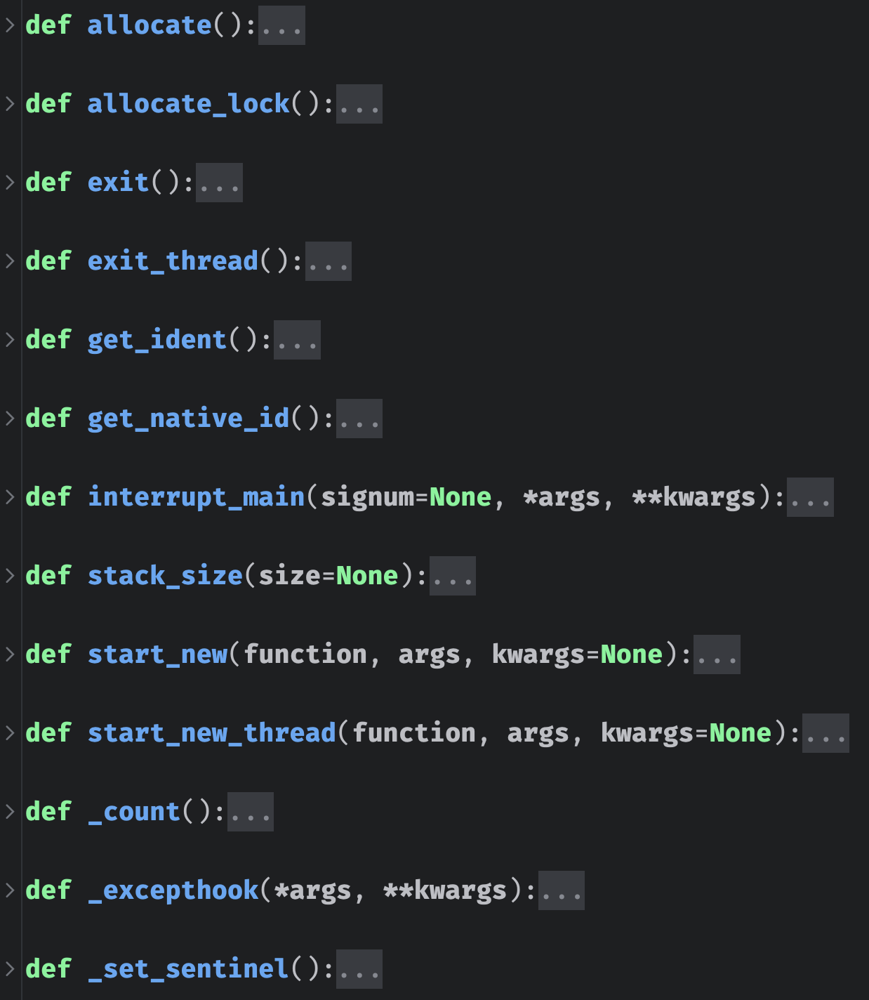
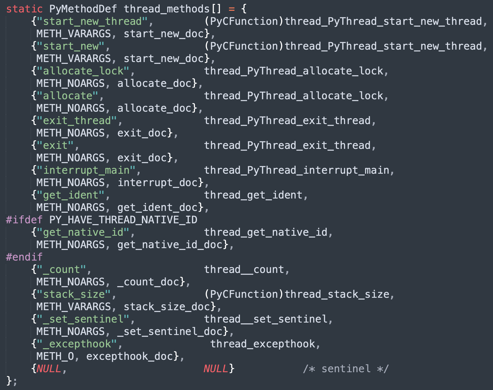
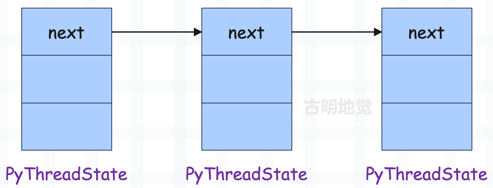
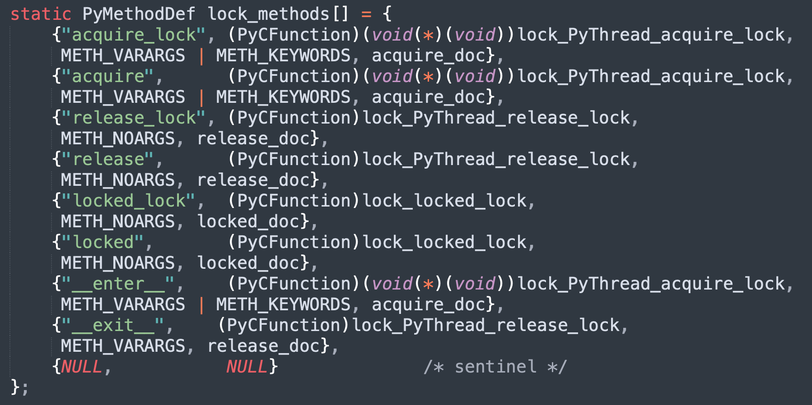

## 楔子

上一篇文章我们从宏观的角度了解了什么是 GIL，以及线程调度是怎么一回事，那么接下来就从源码的角度，来分析 GIL 的实现原理以及整个 Python 线程的生命周期。

## 初识 \_thread 模块

我们在创建多线程的时候会使用 threading 这个标准库，这个库以一个 py 文件的形式存在，不过它依赖于 _thread 模块，来看一下。

\_thread 是真正用来创建线程的模块，这个模块由 C 编写，内嵌在解释器里面。我们可以 import 导入，但是在 Python 安装目录里面则是看不到的。像这种底层由 C 编写、内嵌在解释器里面的模块，以及那些无法使用文本打开的 pyd 文件，PyCharm 都会给你做一个抽象，并且把注释写好。

记得之前说过 Python 源码中的 Modules 目录，这个目录里面存放了大量使用 C 编写的模块，它们在编译完 Python 之后就内嵌在解释器里面了。而这些模块都是针对那些性能要求比较高的，而要求不高的则由 Python 语言编写，存放在 Lib 目录下。

像我们平时调用 random、collections、threading，其实它们背后会调用 C 实现的 \_random、\_collections、\_thread。再比如我们使用的 re 模块，真正用来做正则匹配的逻辑实际上位于 Modules/\_sre.c 里面。

而 \_thread 的底层实现是在 Modules/_threadmodule.c 中，我们来看看它都提供了哪些接口。

显然 PyCharm 抽象出来的 \_thread.py，和底层的这些接口是一样的。而创建一个线程会调用 start_new_thread，在底层对应 thread_PyThread_start_new_thread。

## 线程的创建

当我们使用 threading 模块创建一个线程的时候，threading 会调用 _thread 模块的 start_new_thread 来创建。而它对应 thread_PyThread_start_new_thread，下面我们就来看看这个函数。

~~~C
// Modules/_threadmodule.c
static PyObject *
thread_PyThread_start_new_thread(PyObject *self, PyObject *fargs)
{
    PyObject *func, *args, *keyw = NULL;
    struct bootstate *boot;
    unsigned long ident;
    // thread.Thread() 里面一般传递 target、args、kwargs
    if (!PyArg_UnpackTuple(fargs, "start_new_thread", 2, 3,
                           &func, &args, &keyw))
        return NULL;
    // target 必须可调用
    if (!PyCallable_Check(func)) {
        PyErr_SetString(PyExc_TypeError,
                        "first arg must be callable");
        return NULL;
    }
    // args 是个元组
    if (!PyTuple_Check(args)) {
        PyErr_SetString(PyExc_TypeError,
                        "2nd arg must be a tuple");
        return NULL;
    }
    // kwargs 是个字典
    if (keyw != NULL && !PyDict_Check(keyw)) {
        PyErr_SetString(PyExc_TypeError,
                        "optional 3rd arg must be a dictionary");
        return NULL;
    }
    // 创建 bootstate 结构体实例
    /*
    struct bootstate {
        PyInterpreterState *interp;
        PyObject *func;
        PyObject *args;
        PyObject *keyw;
        PyThreadState *tstate;
    };
    */
    boot = PyMem_NEW(struct bootstate, 1);
    if (boot == NULL)
        return PyErr_NoMemory();
    // 获取进程状态对象、函数、args、kwargs
    boot->interp = _PyInterpreterState_Get();
    boot->func = func;
    boot->args = args;
    boot->keyw = keyw;
    boot->tstate = _PyThreadState_Prealloc(boot->interp);
    if (boot->tstate == NULL) {
        PyMem_DEL(boot);
        return PyErr_NoMemory();
    }
    Py_INCREF(func);
    Py_INCREF(args);
    Py_XINCREF(keyw);
    // 初始化多线程环境，记住这一步
    PyEval_InitThreads();
    // 创建子线程，返回 id
    ident = PyThread_start_new_thread(t_bootstrap, (void*) boot);
    if (ident == PYTHREAD_INVALID_THREAD_ID) {
        PyErr_SetString(ThreadError, "can't start new thread");
        Py_DECREF(func);
        Py_DECREF(args);
        Py_XDECREF(keyw);
        PyThreadState_Clear(boot->tstate);
        PyMem_DEL(boot);
        return NULL;
    }
    return PyLong_FromUnsignedLong(ident);
}
~~~

在这个函数中，我们看到虚拟机通过三个主要的动作来完成线程的创建。

+ 创建并初始化 struct bootstate 结构体实例 boot，在 boot 中会保存一些相关信息；
+ 初始化 Python 的多线程环境；
+ 以 boot 为参数，创建子线程，子线程也会对应操作系统的原生线程；

在源码中有这么一行：`boot->interp = _PyInterpreterState_Get()`，说明 boost 保存了 PyInterpreterState 对象，这个对象中携带了 Python 的模块对象池（module pool）等全局信息，而所有的 thread 都可以使用这些全局信息。

然后我们还看到了多线程环境的初始化动作，从这里可以看出，在开启多线程之前，支持多线程的数据结构、以及 GIL 都还没有创建。因为对多线程的支持是需要代价的，如果上来就激活了多线程，但是程序却只有一个主线程，那么 Python 仍然会执行所谓的线程调度机制，只不过调度完了还是它自己，所以这无异于在做无用功。因此 Python 将开启多线程的权利交给了程序员，自己在启动的时候是单线程，既然是单线程，自然就不存在线程调度了，当然也没有 GIL。

而一旦调用了 threading.Thread(...).start()，底层对应 \_thread.start_new_thread()，则代表明确地指示虚拟机要创建新的线程。这个时候虚拟机就知道自己该创建与多线程相关的东西了，比如数据结构、环境、以及那个至关重要的 GIL。

## 建立多线程环境

多线程环境的建立，说的直白一点，主要就是创建 GIL。我们已经知道了 GIL 对 Python 多线程机制的重要意义，但这个 GIL 是如何实现的呢？这是一个比较有趣的问题，下面就来看看 GIL 长什么样子。

~~~c
// include/internal/pycore_pystate.h
struct _ceval_runtime_state {
    // 递归的最大深度，可以通过 sys.getrecursionlimit() 查看 
    int recursion_limit;
    // 是否对线程进行追踪/调试
    int tracing_possible;
    // 原子整型变量，表示执行是否被中断
    // 当需要中断 Python 代码执行时（比如响应信号或 GIL 请求）会设置这个标志
    _Py_atomic_int eval_breaker;
    // 是否被要求放弃 GIL
    _Py_atomic_int gil_drop_request;
    // 保存待处理的调用，比如一些信号处理函数、回调等
    struct _pending_calls pending;
    // 表示是否有待处理的信号，用于检测是否有外部事件（如定时器、用户中断等）需要处理
    _Py_atomic_int signals_pending;
    // GIL 相关，我们看到 GIL 就是一个 struct _gil_runtime_state 结构体实例
    struct _gil_runtime_state gil;
};
~~~

所以 GIL 在 Python 的底层就是一个 \_gil_runtime_state 结构体实例，来看看这个结构体长什么样子。

~~~C
// Python/ceval_gil.h
#define DEFAULT_INTERVAL 5000

// Include/internal/pycore_gil.h
struct _gil_runtime_state {
    // 一个线程拥有 GIL 的间隔，默认是 5000 微妙
    // 也就是调用 sys.getswitchinterval() 得到的 0.005 
    unsigned long interval;
    // 最后一个持有 GIL 的 PyThreadState
    // 这有助于我们知道在释放 GIL 后是否还有其它线程被调度
    _Py_atomic_address last_holder;
    // GIL 的当前状态
    // 1 表示已锁定，即 GIL 已被某个线程获取
    // 0 表示未锁定，即 GIL 已被释放，可以去获取了
    // -1 表示未初始化
    _Py_atomic_int locked;
    // 记录 GIL 发生切换的总次数，用于统计和诊断目的
    unsigned long switch_number;
    // cond 和 mutex 两者需要搭配使用
    // 想获取 GIL 的线程在 cond 上等待，mutex 保护结构体中的共享变量
    PyCOND_T cond;
    PyMUTEX_T mutex;
#ifdef FORCE_SWITCHING  // 在强制切换模式下使用
    // 在 "GIL 等待线程" 被调度并获取 GIL 之前，会迫使 "GIL 释放线程" 一直处于等待状态 
    // 这样可以确保 GIL 确实转移到了其它线程，防止同一个线程反复获得 GIL
    PyCOND_T switch_cond;
    PyMUTEX_T switch_mutex;
#endif
};
~~~

所以我们看到 GIL 就是 \_gil_runtime_state 结构体实例，而该结构体又内嵌在结构体 \_ceval_runtime_state 里面。

GIL 有一个 locked 字段用于判断 GIL 有没有被获取，这个 locked 字段可以看成是一个布尔变量，其访问受到 mutex 字段保护，是否改变则取决于 cond 字段。在持有 GIL 的线程中，主循环（_PyEval_EvalFrameDefault）必须能通过另一个线程来按需释放 GIL。

而在创建多线程的时候，首先需要调用 PyEval_InitThreads 进行初始化，那么接下来就来看看它的具体逻辑。

~~~C
// Python/ceval.c
void
PyEval_InitThreads(void)
{
    // 获取运行时状态对象
    _PyRuntimeState *runtime = &_PyRuntime;
    // 拿到 ceval, 它是 struct _ceval_runtime_state 类型
    // 而 GIL 对应的字段就内嵌在里面
    struct _ceval_runtime_state *ceval = &runtime->ceval;
    // 获取 GIL
    struct _gil_runtime_state *gil = &ceval->gil;
    // 如果 GIL 已经创建，那么直接返回
    if (gil_created(gil)) {
        return;
    }
    // 线程初始化
    PyThread_init_thread();
    // 创建 GIL
    create_gil(gil);
    // 获取线程状态对象
    PyThreadState *tstate = _PyRuntimeState_GetThreadState(runtime);
    // GIL 创建了，那么就要拿到这个 GIL
    take_gil(ceval, tstate);
    struct _pending_calls *pending = &ceval->pending;
    // 如果拿到 GIL 了，其它线程就不能获取了，那么不好意思这个时候要加锁
    pending->lock = PyThread_allocate_lock();
    if (pending->lock == NULL) {
        Py_FatalError("Can't initialize threads for pending calls");
    }
}
~~~

关于 GIL 有四个比较重要的函数，分别如下：

+ gil_created：GIL 是否已被创建；
+ create_gil：创建 GIL；
+ take_gil：获取创建的 GIL；
+ drop_gil：释放持有的 GIL；

~~~C
// Python/ceval_gil.h

// 检测 GIL 是否已创建
static int gil_created(struct _gil_runtime_state *gil)
{
    return (_Py_atomic_load_explicit(&gil->locked, _Py_memory_order_acquire) >= 0);
}

// 创建 GIL
static void create_gil(struct _gil_runtime_state *gil)
{
    // 初始化互斥锁和条件变量
    MUTEX_INIT(gil->mutex);
#ifdef FORCE_SWITCHING
    MUTEX_INIT(gil->switch_mutex);
#endif
    COND_INIT(gil->cond);
#ifdef FORCE_SWITCHING
    COND_INIT(gil->switch_cond);
#endif
    // 初始化其它字段
    _Py_atomic_store_relaxed(&gil->last_holder, 0);
    _Py_ANNOTATE_RWLOCK_CREATE(&gil->locked);
    _Py_atomic_store_explicit(&gil->locked, 0, _Py_memory_order_release);
}

// 获取 GIL 
static void
take_gil(struct _ceval_runtime_state *ceval, PyThreadState *tstate)
{
    if (tstate == NULL) {
        Py_FatalError("take_gil: NULL tstate");
    }
    struct _gil_runtime_state *gil = &ceval->gil;
    int err = errno;  // 保存当前的错误码
    MUTEX_LOCK(gil->mutex);  // 获取互斥锁
    // 判断 GIL 是否被释放，如果被释放（或者说未被锁定），那么直接跳转到_ready
    if (!_Py_atomic_load_relaxed(&gil->locked)) {
        goto _ready;
    }
    // 走到这里说明 GIL 没有被释放，还被某个线程所占有
    // 那么会阻塞在这里，一直请求获取 GIL，直到 GIL 被释放，while 条件为假，结束循环
    while (_Py_atomic_load_relaxed(&gil->locked)) {
        int timed_out = 0;
        unsigned long saved_switchnum;
        saved_switchnum = gil->switch_number;
        // 计算等待间隔（最小为 1 微秒）
        unsigned long interval = (gil->interval >= 1 ? gil->interval : 1);
        // 等待指定时间
        COND_TIMED_WAIT(gil->cond, gil->mutex, interval, timed_out);
        // 如果等待超时，GIL 仍然没有释放，并且没有发生切换
        if (timed_out &&
            _Py_atomic_load_relaxed(&gil->locked) &&
            gil->switch_number == saved_switchnum)
        {
            // 请求当前 GIL 持有者释放 GIL，也就是将 ceval->gil_drop_request 设置为 1
            SET_GIL_DROP_REQUEST(ceval);
        }
    }
_ready:
    // ...
    /* We now hold the GIL */
    // GIL 一次只能被一个线程获取，因此获取到 GIL 的时候，要进行独占
    // 于是会通过 _Py_atomic_store_relaxed 对其再次上锁
    _Py_atomic_store_relaxed(&gil->locked, 1);
    _Py_ANNOTATE_RWLOCK_ACQUIRED(&gil->locked, /*is_write=*/1);
    // ...
}

// 释放 GIL
static void
drop_gil(struct _ceval_runtime_state *ceval, PyThreadState *tstate)
{
    struct _gil_runtime_state *gil = &ceval->gil;
    // 如果要释放 GIL，那么 GIL 此刻一定处于锁定状态，或者说未被释放
    // 因为不能对已经释放的 GIL 二次释放
    if (!_Py_atomic_load_relaxed(&gil->locked)) {
        Py_FatalError("drop_gil: GIL is not locked");
    }

    // 更新最后的持有者信息
    if (tstate != NULL) {
        // 处理子解释器的情况：线程可能在执行时通过 PyThreadState_Swap() 发生切换
        // 更新最后持有者以确保切换后正常工作
        _Py_atomic_store_relaxed(&gil->last_holder, (uintptr_t)tstate);
    }
    
    // 释放 GIL
    MUTEX_LOCK(gil->mutex);
    _Py_ANNOTATE_RWLOCK_RELEASED(&gil->locked, /*is_write=*/1);
    _Py_atomic_store_relaxed(&gil->locked, 0);  // 标记 GIL 为未锁定
    COND_SIGNAL(gil->cond);                     // 通知等待的线程
    MUTEX_UNLOCK(gil->mutex);
    
    // 强制切换处理
#ifdef FORCE_SWITCHING
    if (_Py_atomic_load_relaxed(&ceval->gil_drop_request) && tstate != NULL) {
        MUTEX_LOCK(gil->switch_mutex);
        // 检查是否真的发生了线程切换
        if (((PyThreadState*)_Py_atomic_load_relaxed(&gil->last_holder)) == tstate)
        {
            RESET_GIL_DROP_REQUEST(ceval);
            // 等待其它线程获取 GIL
            COND_WAIT(gil->switch_cond, gil->switch_mutex);
        }
        MUTEX_UNLOCK(gil->switch_mutex);
    }
#endif
}
~~~

Python 线程在获取 GIL 的时候会调用 take_gil 函数，在里面会检查当前 GIL 是否可用。而其中的 locked 字段就是指示当前 GIL 是否可用，如果这个值为 0，则代表可用，那么获取之后就必须要将 GIL 的 locked 字段设置为 1，表示当前 GIL 已被占用。而当该线程释放 GIL 的时候，也一定要将 locked 字段设置为 0，这样才能被其它线程使用，所以官方把 GIL 的 locked 字段说成是布尔类型也不是没有道理的。

另外，由于获取到 GIL，就将 locked 字段更新为 1，并且获取 GIL 之前，也会先检测 locked 字段是否为 1。这就说明，GIL 每次只能被一个线程获取，而一旦被某个线程获取，那么其它线程会因 locked 字段为 1，而阻塞在 while 循环处。

等持有 GIL 的线程释放 GIL 之后，会通知所有在等待 GIL 的线程。但是会选择哪一个线程呢？之前说了，这个时候 Python 会直接借用操作系统的调度机制随机选择一个。

## 线程状态对象的保护机制

线程状态对象中都保存着当前正在执行的栈帧对象、线程 id 等信息，因为这些信息是需要被线程访问的。但是要考虑到安全问题，比如线程 A 访问线程状态对象，但是里面存储的却是线程 B 的 id，这样的话就完蛋了。

因此 Python 内部必须有一套机制，这套机制与操作系统管理进程的机制非常类似。在线程切换的时候，会保存当前线程的上下文，并且还能够进行恢复。而在 Python 内部，会维护一个变量（上一篇文章提到过），负责保存当前活动线程所对应的线程状态对象。当 Python 调度线程时，会将新的被激活线程所对应的线程状态对象赋给这个变量，总之它始终保存活动线程的状态对象。

但是这样就引入了一个问题：Python 在调度线程时，如何获得被激活线程对应的状态对象呢？其实 Python 内部会通过一个链表来管理所有的线程状态对象，当需要寻找一个线程对应的状态对象时，就会遍历这个链表。

另外对这个状态对象链表的访问，不必在 GIL 的保护下进行，因为 Python 会专门创建一个独立的锁，专职对这个链表进行保护，而且这个锁的创建是在 Python 初始化的时候就完成的。

## 从 GIL 到字节码

我们知道线程状态对象是通过 PyThreadState_New 函数创建的：

~~~C
// Python/pystate.c
PyThreadState *
PyThreadState_New(PyInterpreterState *interp)
{
    return new_threadstate(interp, 1);
}

static PyThreadState *
new_threadstate(PyInterpreterState *interp, int init)
{
    _PyRuntimeState *runtime = &_PyRuntime;
    // 创建线程状态对象
    PyThreadState *tstate = (PyThreadState *)PyMem_RawMalloc(sizeof(PyThreadState));
    if (tstate == NULL) {
        return NULL;
    }
    // 用于获取当前线程的 frame
    if (_PyThreadState_GetFrame == NULL) {
        _PyThreadState_GetFrame = threadstate_getframe;
    }
    // 下面是线程的相关属性
    tstate->interp = interp;

    tstate->frame = NULL;
    tstate->recursion_depth = 0;
    tstate->overflowed = 0;
    tstate->recursion_critical = 0;
    tstate->stackcheck_counter = 0;
    tstate->tracing = 0;
    tstate->use_tracing = 0;
    tstate->gilstate_counter = 0;
    tstate->async_exc = NULL;
    tstate->thread_id = PyThread_get_thread_ident();

    tstate->dict = NULL;

    tstate->curexc_type = NULL;
    tstate->curexc_value = NULL;
    tstate->curexc_traceback = NULL;

    tstate->exc_state.exc_type = NULL;
    tstate->exc_state.exc_value = NULL;
    tstate->exc_state.exc_traceback = NULL;
    tstate->exc_state.previous_item = NULL;
    tstate->exc_info = &tstate->exc_state;

    tstate->c_profilefunc = NULL;
    tstate->c_tracefunc = NULL;
    tstate->c_profileobj = NULL;
    tstate->c_traceobj = NULL;

    tstate->trash_delete_nesting = 0;
    tstate->trash_delete_later = NULL;
    tstate->on_delete = NULL;
    tstate->on_delete_data = NULL;

    tstate->coroutine_origin_tracking_depth = 0;

    tstate->async_gen_firstiter = NULL;
    tstate->async_gen_finalizer = NULL;

    tstate->context = NULL;
    tstate->context_ver = 1;
    
    // 注意这个 _PyThreadState_Init
    // 它便负责将线程对应的线程状态对象，放入到刚才说的那个"线程状态对象链表"中
    if (init) {
        _PyThreadState_Init(runtime, tstate);
    }

    HEAD_LOCK(runtime);
    tstate->id = ++interp->tstate_next_unique_id;
    tstate->prev = NULL;
    tstate->next = interp->tstate_head;
    if (tstate->next)
        tstate->next->prev = tstate;
    interp->tstate_head = tstate;
    HEAD_UNLOCK(runtime);

    return tstate;
}
~~~

这里有一个特别需要注意的地方，就是当前活动的 Python 线程不一定获得了 GIL。比如主线程获得了 GIL ，但是子线程还没有申请 GIL，那么操作系统也不会将其挂起。由于主线程和子线程都对应操作系统的原生线程，所以操作系统是可能在主线程和子线程之间切换的，因为操作系统级别的线程调度和 Python 级别的线程调度是不同的。

而当所有的线程都完成了初始化动作之后，操作系统的线程调度和 Python 的线程调度才会统一。那时 Python 的线程调度会迫使当前活动线程释放 GIL，而这一操作会触发操作系统内核用于管理线程调度的对象，进而触发操作系统对线程的调度。

所以我们说，Python 对线程的调度是交给操作系统的，它使用的是操作系统内核的线程调度机制，当操作系统随机选择一个 OS 线程的时候，Python 就会根据这个 OS 线程去线程状态对象链表中找到对应的线程状态对象，并赋值给那个保存当前活动线程的状态对象的变量。从而获取 GIL，执行字节码。

在执行一段时间之后，该线程会被强迫释放 GIL，然后操作系统再次调度，选择一个线程。而 Python 也会再次获取对应的线程状态对象，然后获取 GIL，执行一段时间字节码。而执行一段时间后，同样又会被被强迫释放 GIL，然后操作系统同样继续随机选择，依次往复······。

> 不过这里有一个问题，线程是如何得知自己被要求释放 GIL 呢？还记得 gil_drop_request 这个字段吗？线程在执行字节码之前，会检测这个字段的值是否为 1，如果为 1，那么就知道自己要释放 GIL 了。

显然，当子线程还没有获取 GIL 的时候，一切相安无事。然而一旦 PyThreadState_New 之后，多线程机制初始化完成，那么子线程就开始争夺话语权了。

~~~c
// Modules/_threadmodule.c
static void
t_bootstrap(void *boot_raw)
{
    struct bootstate *boot = (struct bootstate *) boot_raw;
    PyThreadState *tstate;
    PyObject *res;
    // 获取线程状态对象
    tstate = boot->tstate;
    // 拿到线程id
    tstate->thread_id = PyThread_get_thread_ident();
    _PyThreadState_Init(&_PyRuntime, tstate);
    // 很重要，一会儿说
    PyEval_AcquireThread(tstate);
    // 进程内部的线程数量加 1
    tstate->interp->num_threads++;
    // 启动子线程，执行函数
    res = PyObject_Call(boot->func, boot->args, boot->keyw);
    if (res == NULL) {
        if (PyErr_ExceptionMatches(PyExc_SystemExit))
            /* SystemExit is ignored silently */
            PyErr_Clear();
        else {
            _PyErr_WriteUnraisableMsg("in thread started by", boot->func);
        }
    }
    else {
        Py_DECREF(res);
    }
    Py_DECREF(boot->func);
    Py_DECREF(boot->args);
    Py_XDECREF(boot->keyw);
    PyMem_DEL(boot_raw);
    tstate->interp->num_threads--;
    PyThreadState_Clear(tstate);
    PyThreadState_DeleteCurrent();
    PyThread_exit_thread();
}
~~~

这里面有一个 PyEval_AcquireThread ，来看一下它长什么样子。

~~~C
// Python/ceval.c
void
PyEval_AcquireThread(PyThreadState *tstate)
{
    if (tstate == NULL) {
        Py_FatalError("PyEval_AcquireThread: NULL new thread state");
    }

    _PyRuntimeState *runtime = &_PyRuntime;
    struct _ceval_runtime_state *ceval = &runtime->ceval;

    /* Check someone has called PyEval_InitThreads() to create the lock */
    assert(gil_created(&ceval->gil));
    take_gil(ceval, tstate);
    exit_thread_if_finalizing(runtime, tstate);
    if (_PyThreadState_Swap(&runtime->gilstate, tstate) != NULL) {
        Py_FatalError("PyEval_AcquireThread: non-NULL old thread state");
    }
}
~~~

可以看到在里面子线程进行了最后的冲刺，并通过 take_gil 函数争取 GIL。但由于 GIL 现在被主线程持有，所以子线程会发现自己获取不到，于是将自己挂起。而操作系统没办法靠自己的力量将其唤醒，只能等待 Python 的线程调度机制强迫主线程放弃 GIL、被子线程获取，然后触发操作系统内核的线程调度之后，子线程才会被唤醒。

然而当子线程被唤醒时，主线程却又陷入了苦苦的等待当中，同样等待着解释器强迫子线程放弃 GIL 的那一刻，假设我们这里只有一个主线程和一个子线程。

另外当子线程被线程调度机制唤醒之后，它所做的第一件事就是通过 PyThreadState_Swap 将维护当前线程状态对象的变量设置为其自身的状态对象，就如同操作系统进程的上下文环境恢复一样。这个 PyThreadState_Swap 我们就不展开说了，我们只需要知道是干什么的就行。

子线程获取了 GIL 之后，还不算成功，因为它还没有进入帧评估函数，于是子线程将回到 t_bootstrap，并进入 PyObject_Call ，从这里一路往前，最终调用帧评估函数（_PyEval_EvalFrameDefault） ，此时才算是成功。

而当进入帧评估函数的那一刻，子线程就和主线程一样，完全受 Python 线程调度机制控制了。

## Python 的线程调度

当主线程和子线程都进入了帧评估函数时，Python 线程之间的切换就完全由 Python 线程调度机制掌控了，而调度机制肯定是在帧评估函数里面的。因为线程是在执行字节码的时候切换的，那么肯定是在 _PyEval_EvalFrameDefault 里面。

当然啦，之前在介绍帧评估函数的时候，其实就已经把这里的内容给说了，我们再回顾一遍。

~~~C
PyObject* _Py_HOT_FUNCTION
_PyEval_EvalFrameDefault(PyFrameObject *f, int throwflag)
{
    // ...
main_loop:
    // 大大的 for 循环，会遍历字节码指令集，处理每一条指令
    for (;;) {
        // ...
        // 检测是否有待处理的中断（比如信号、GIL 释放请求等）
        if (_Py_atomic_load_relaxed(eval_breaker)) {
            opcode = _Py_OPCODE(*next_instr);
            /* 如果指令是以下之一，那么忽略中断，直接跳到 fast_next_opcode 标签进行处理
             *     SETUP_FINALLY：try / finally 语句的开始
             *     SETUP_WITH：with 语句的开始
             *     BEFORE_ASYNC_WITH：async with 语句的开始
             *     YIELD_FROM：yield from 表达式
             */
            // 这种设计主要是为了确保在某些关键操作（如资源管理、异常处理、异步操作）的开始阶段不被中断信号打断
            // 从而保证这些操作的正确性和可靠性，进而保证 Python 程序的稳定性和可预测性
            if (opcode == SETUP_FINALLY ||
                opcode == SETUP_WITH ||
                opcode == BEFORE_ASYNC_WITH ||
                opcode == YIELD_FROM) {
                goto fast_next_opcode;
            }
            // 使用原子操作检查是否有待处理的信号
            // 如果有待处理的信号，那么调用 handle_signals 函数处理它们
            // 这个机制允许 Python 程序响应外部事件和系统信号，同时保证执行的正确性
            if (_Py_atomic_load_relaxed(&ceval->signals_pending)) {
                if (handle_signals(runtime) != 0) {
                    goto error;
                }
            }
            // 通过原子操作检查是否有待处理的调用需要执行，calls_to_do 是一个计数器，表示待处理的调用的数量
            // 如果有待处理的调用，那么执行 make_pending_calls 函数
            // pending calls 主要用于垃圾回收（GC）、异步 IO 回调、定时器事件等
            // 这个机制是 Python 运行时系统的重要组成部分，允许虚拟机在主循环中处理各种异步任务和周期性任务
            // 确保各种后台任务能够得到及时处理，并且不需要使用额外的线程和复杂的调度机制
            if (_Py_atomic_load_relaxed(&ceval->pending.calls_to_do)) {
                if (make_pending_calls(runtime) != 0) {
                    goto error;
                }
            }
            // 通过原子操作检查 gil_drop_request 是否为 1，即是否有释放 GIL 的请求
            // 如果有，那么该线程就要释放 GIL，否则还可以继续执行字节码
            if (_Py_atomic_load_relaxed(&ceval->gil_drop_request)) {
                // 将当前线程状态设置为 NULL，因为要发生切换了
                if (_PyThreadState_Swap(&runtime->gilstate, NULL) != tstate) {
                    Py_FatalError("ceval: tstate mix-up");
                }
                // 释放 GIL，给其它线程一个机会，不能让某一个线程一直霸占着
                // 如果开启了多线程，那么当释放 GIL 的那一刻，就会被其它线程获取
                drop_gil(ceval, tstate);
                // GIL 释放之后，还要再次获取，但 GIL 已经被其它线程拿走了
                // 所以会触发操作系统内核的线程调度机制，进入阻塞状态，等待 GIL 再度回到自己手中
                // 因此不难发现，如果有 n 个线程，那么其中的 n - 1 个会陷入阻塞，等待获取 GIL
                // 而一旦持有 GIL 的线程执行了 drop_gil 函数，将 GIL 释放了
                // 那么这 n - 1 个线程当中就会有一个线程拿到 GIL 并解除阻塞，然后开始执行字节码
                // 至于释放 GIL 的线程，则会尝试再次获取 GIL，但会因为获取不到而陷入阻塞（已经被其它线程拿走了）
                take_gil(ceval, tstate);
                // 检查是否需要快速退出线程（比如在解释器关闭时）
                exit_thread_if_finalizing(runtime, tstate);
                // 到这里说明 take_gil 返回了（即阻塞状态解除），也意味着拿到了 GIL，那么要恢复线程状态
                if (_PyThreadState_Swap(&runtime->gilstate, tstate) != NULL) {
                    Py_FatalError("ceval: orphan tstate");
                }
            }
            // 检测线程状态中是否存在异步的异常
            if (tstate->async_exc != NULL) {
                PyObject *exc = tstate->async_exc;
                tstate->async_exc = NULL;
                UNSIGNAL_ASYNC_EXC(ceval);
                _PyErr_SetNone(tstate, exc);
                Py_DECREF(exc);
                goto error;
            }
        }

    // ...
}
~~~

所以相信现在应该明白，为什么 GIL 被称为是字节码层面上的互斥锁了。因为虚拟机就是以字节码为核心一条一条执行的，也就是说字节码是虚拟机执行的基本单元，但线程在执行字节码之前要先判断 gil_drop_request 是否为 1，也就是自己还能不能继续执行字节码指令。

如果不能执行，那么该线程就调用 drop_gil 函数将 GIL 释放掉（还会将那个维护线程状态对象的变量设置为 NULL），然后调用 take_gil 再次获取 GIL，等待下一次被调度。但是当该线程调用 drop_gil 之后，早已阻塞在 take_gil 处的等待线程会有一个获取到 GIL（并且会将那个变量设置为自身对应的线程状态对象）。而等到该线程再调用 take_gil 时，GIL 已被别的线程获取，那么该线程就会成为等待线程中新的一员。

也正因为如此，Python 才无法利用多核，因为 GIL 的存在使得每次只能有一个线程去执行字节码，而字节码又是执行的基本单元。并且还可以看出，每条字节码执行的时候不会被打断，因为一旦开始了字节码的执行，那么就必须等到当前的字节码指令执行完毕、进入下一次循环时才有可能释放 GIL。所以线程切换要么发生在字节码执行之前，要么发生在字节码执行之后，不会存在字节码执行到一半时被打断。

另外，释放 GIL 并不是立刻就让活跃线程停下来，因为活跃线程此时正在执行字节码指令，而字节码在执行的过程中不允许被打断。其实释放 GIL 的本质是线程调度机制发现活跃线程的执行时间达到 0.05 秒，于是将其 gil_drop_request 设置为 1。这样等到活跃线程将当前的字节码指令执行完毕、进入下一次循环时，看到 gil_drop_request 为 1、调用 drop_gil 之后，才会真正释放 GIL（将 locked 字段设置为 0）。

就这样通过 GIL 的释放、获取，每个线程都执行一会，依次往复。于是，Python 中无法利用多核的多线程机制，就这么实现了。

最后再补充一下，当一个 Python 线程在失去 GIL 时，它对应的 OS 线程依旧是活跃线程（此时会存在一个短暂的并行时间）。然后继续申请 GIL，但是 GIL 已被其它线程持有，于是触发操作系统的线程调度机制，将线程进行休眠。所以我们发现，线程释放 GIL 之后并不是马上就被挂起的，而是在释放完之后重新申请 GIL、但发现申请不到的时候才被挂起。

而当它再次申请到 GIL 时，那么又会触发操作系统的线程调度机制，将休眠的 OS 线程唤醒。然后遍历线程状态对象链表，找到对应的线程状态对象，并交给变量进行保存。

**线程调度之阻塞调度**

上面的线程调度被称为标准调度，标准调度是 Python 的调度机制掌控的，每个线程都是相当公平的，它适用于 CPU 密集型。

但如果仅仅只有标准调度的话，那么可以说 Python 的多线程没有任何意义，但为什么又有很多场合适合使用多线程呢？就是因为调度方式除了标准调度之外，还存在阻塞调度。

阻塞调度是指，当某个线程遇到 IO 阻塞时，会主动释放 GIL，让其它线程执行，因为 IO 是不耗费 CPU 的。比如 time.sleep，或者从网络上请求数据等等，这些都是 IO 阻塞，那么会发生线程调度。当阻塞的线程可以执行了，比如 sleep 结束、请求的数据成功返回，那么再切换回来。除了这一种情况之外，还有一种情况，也会导致线程不得不挂起，那就是 input 函数等待用户输入，这个时候也不得不释放 GIL。

> 阻塞调度，是借助操作系统实现的。

## 子线程的销毁

创建一个子线程的时候，往往是执行一个函数，或者重写一个类继承自 threading.Thread。而当一个子线程执行结束之后，Python 肯定要把对应的子线程销毁，当然销毁主线程和销毁子线程是不同的。销毁主线程必须要销毁 Python 的运行时环境，因为销毁主线程就意味着程序执行完毕了，而子线程的销毁则不需要这些动作，因此我们只看子线程的销毁。

通过前面的分析我们知道，线程的主体框架是在 t_bootstrap 中：

~~~C
// Modules/_threadmodule.c

static void
t_bootstrap(void *boot_raw)
{
    // ...
    // 进程内部的线程数加 1
    tstate->interp->num_threads++;
    // 子线程执行
    res = PyObject_Call(boot->func, boot->args, boot->keyw);
    if (res == NULL) {
        if (PyErr_ExceptionMatches(PyExc_SystemExit))
            /* SystemExit is ignored silently */
            PyErr_Clear();
        else {
            _PyErr_WriteUnraisableMsg("in thread started by", boot->func);
        }
    }
    else {
        Py_DECREF(res);
    }
    // 执行完毕后要进行销毁
    Py_DECREF(boot->func);
    Py_DECREF(boot->args);
    Py_XDECREF(boot->keyw);
    // 释放内存
    PyMem_DEL(boot_raw);
    // 进程内部的线程数减 1
    tstate->interp->num_threads--;
    // 清理当前线程对应的线程状态对象
    PyThreadState_Clear(tstate);
    // 释放 GIL
    PyThreadState_DeleteCurrent();
    PyThread_exit_thread();
}
~~~

过程很简单，首先会释放内存，删除当前的线程状态对象，然后释放 GIL。不过这只是完成了绝大部分的销毁工作，而剩下的收尾工作就依赖于对应的操作系统了，当然这跟我们也就没关系了。

## Python 线程的用户级互斥与同步

在 GIL 的控制之下，线程之间对 Python 提供的 C API 访问都是互斥的，并且在字节码执行的过程中不会被打断，这可以看做是 Python 内核级的互斥。但是这种互斥不是我们能够控制的，内核级通过 GIL 的互斥保护了内核共享资源，比如 del obj，它对应的指令是 DELETE_NAME，这个是不会被打断的。

但是像 n = n + 1 这种一行代码对应多条字节码，是可以被打断的，因为 GIL 是字节码层面的互斥锁，不是代码层面的互斥锁。如果在执行到一半的时候，碰巧 GIL 释放了，比如执行完 n + 1，但还没有赋值给 n，那么也会出岔子。所以我们还需要一种互斥，也就是用户级互斥。

实现用户级互斥的一种方法就是加锁，我们来看看 Python 提供的锁。

这些方法我们肯定都见过，acquire 表示上锁、release 表示解锁。假设有两个线程 A 和 B，线程 A 先执行了 lock.acquire()，然后继续执行后面的代码。

这个时候依旧会进行线程调度，等到线程 B 执行的时候，也遇到了 lock.acquire()，那么不好意思线程 B 就只能在这里等着了。没错，是轮到线程 B 执行了，但由于我们在用户级层面上又设置了一把锁，而这把锁已经被线程 A 获取了。那么即使切换到线程 B，但只要 A 还没有 lock.release()，B 也只能卡在 lock.acquire() 上面。因为 A 先拿到了锁，那么只要 A 不释放，B 就拿不到锁。

所以 GIL 是内核层面上的锁，我们使用 Python 开发时是控制不了的，把握不住，并且它提供的是以字节码为粒度的保护。而 threading.Lock 是用户层面上的锁，它提供的是以代码为粒度的保护，什么时候释放也完全由我们来控制，并且可以保护的代码数量没有限制。也就是说，在 lock.acquire() 和 lock.release() 之间写多少行代码都是可以的，而 GIL 每次只能保护一条字节码。

一句话，用户级互斥就是即便你拿到了 GIL，也无法执行。

## 小结

以上就是 Python 的线程，以及 GIL 的实现原理。现在是不是对 GIL 有一个清晰的认识了呢？其实 GIL 没有什么神秘的，非常简单，就是一把字节码层面上的互斥锁。

而且通过 GIL，我们也知道了为什么 Python 不能利用多核。另外这里再提一个框架叫 Dpark，是模仿 Spark 的架构设计的，但由于 Python 多线程利用不了多核，于是将多线程改成了多进程。但根据测试，Dpark 的表现还不如 Hadoop 的 MapReduce，所以 Python 的性能劣势抵消了 Spark 架构上带来的优势。 

当然啦，Python 慢归慢，但是凭借着语法灵活、和 C 的完美兼容，以及丰富的第三方库，依旧走出了自己的社会主义道路，在编程语言排行榜上一直独领风骚。

----

&nbsp;

**欢迎大家关注我的公众号：古明地觉的编程教室。**

**如果觉得文章对你有所帮助，也可以请作者吃个馒头，Thanks♪(･ω･)ﾉ。**

