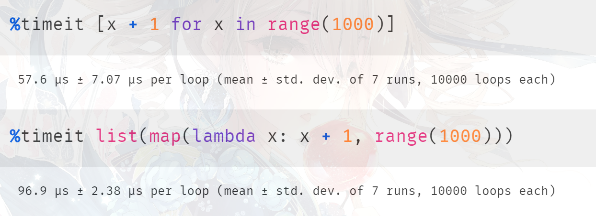
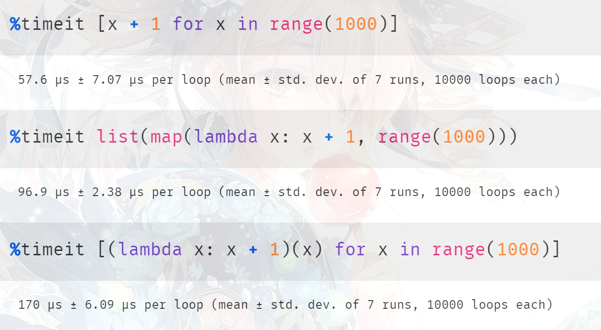
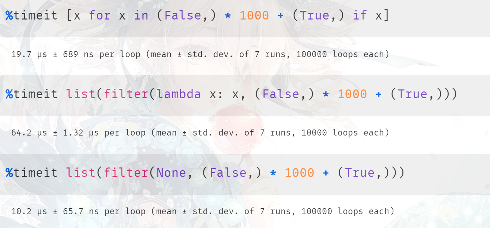

## 楔子

在程序开发中，map、filter、zip 可以说是非常常见了，下面来从源码的角度分析一下它们的实现原理。首先需要说明的是，这几个不是函数，而是类。

## map

map 是将一个序列中的每个元素都作用于同一个函数（类、方法也可以），当然，我们知道调用 map 的时候并没有马上执行，而是返回一个 map 对象。既然是对象，那么底层必有相关的定义。

~~~C
// Python/bltinmodule.c
typedef struct {
    PyObject_HEAD
    PyObject *iters;
    PyObject *func;
} mapobject;
~~~

解释一下里面的字段含义：

- PyObject_HEAD：见过很多次了，它是任何对象都会有的头部信息。包含一个引用计数 ob_refcnt，和一个指向类型对象的指针 ob_type；
- iters：一个指向 PyTupleObject 的指针。以 <font color="blue">map(lambda x: x + 1, [1, 2, 3])</font> 为例，那么这里的 iters 就相当于是 <font color="blue">([1, 2, 3].\_\_iter\_\_(),)</font>。至于为什么，分析源码的时候就知道了；
- func：显然就是函数指针了，PyFunctionObject \*；

通过底层的结构体定义，我们也可以得知在调用 map 时并没有真正的执行，对于函数和可迭代对象，只是维护了两个指针去指向它。而一个 PyObject 占用 16 字节，再加上两个 8 字节的指针总共 32 字节。因此在 64 位机器上，任何一个 map 对象所占的大小都是 32 字节。

~~~Python
numbers = list(range(100000))
strings = ["abc", "def"]

# 都占 32 字节
print(map(lambda x: x * 3, numbers).__sizeof__())  # 32
print(map(lambda x: x * 3, strings).__sizeof__())  # 32
~~~

再来看看 map 的用法，Python 中的 map 不仅可以作用于一个序列，还可以作用于任意多个序列。

```Python
# x 就是列表里面的每一个元组
# x => (1, 2, 3)
# x => (4, 5, 6)
# x => (7, 8, 9)
m1 = map(
    lambda x: x[0] + x[1] + x[2],
    [(1, 2, 3), (4, 5, 6), (7, 8, 9)]
)
print(list(m1))  # [6, 15, 24]


# map 还可以接收任意多个可迭代对象
# (x, y, z) => (1, 4, 7)
# (x, y, z) => (2, 5, 8)
# (x, y, z) => (3, 6, 9)
m2 = map(
    lambda x, y, z: x + y + z,
    [1, 2, 3], [4, 5, 6], [7, 8, 9]
)
print(list(m2))  # [12, 15, 18]
# 所以底层结构体中的 iters 在这里就相当于
# ([1, 2, 3].__iter__(), [4, 5, 6].__iter__(), [7, 8, 9].__iter__())


# 我们说 map 的第一个参数是函数，后面可以接收任意多个可迭代对象
# 但是注意：可迭代对象的数量 和 函数的参数个数 一定要匹配
m3 = map(
    lambda x, y, z: str(x) + y + z,
    [1, 2, 3], ["a", "b", "c"], "abc"
)
print(list(m3))  # ['1aa', '2bb', '3cc']


# 但是可迭代对象之间的元素个数不要求相等，会以最短的为准
m3 = map(
    lambda x, y, z: str(x) + y + z,
    [1, 2, 3], ["a", "b", "c"], "ab"
)
print(list(m3))  # ['1aa', '2bb']


# 当然也支持更加复杂的形式
# (x, y) => ((1, 2), 3)
# (x, y) => ((2, 3), 4)
m5 = map(
    lambda x, y: x[0] + x[1] + y,
    [(1, 2), (2, 3)], [3, 4]
)
print(list(m5))  # [6, 9]
```

所以 map 会将后面所有可迭代对象中的每一个元素按照顺序依次取出，然后传递到函数中，因此<font color="blue">函数的参数个数</font>和<font color="blue">可迭代对象的个数</font>一定要相等。

那么 map 对象在底层是如何创建的呢？很简单，因为 map 是一个类，那么调用的时候一定会执行里面的 \_\_new\_\_ 方法。

~~~C
// Python/bltinmodule.c
static PyObject *
map_new(PyTypeObject *type, PyObject *args, PyObject *kwds)
{
    PyObject *it, *iters, *func;
    mapobject *lz;
    Py_ssize_t numargs, i;
    // map 对象在底层对应的是 mapobject
    // map 类本身在底层对应的则是 PyMap_Type
    // _PyArg_NoKeywords 表示检验是否没有传递关键字参数
    // 如果没传递，那么结果为真，传递了，结果为假
    if (type == &PyMap_Type && !_PyArg_NoKeywords("map", kwds))
        // 可以看到 map 不接收关键字参数，如果传递了，那么会报如下错误
        // TypeError: map() takes no keyword arguments
        return NULL;
  
    // args 指向一个 PyTupleObject，位置参数都在这里面
    // 包含了 1 个函数，以及 numargs - 1 个可迭代对象，显然 args 的长度至少为 2
    numargs = PyTuple_Size(args);
    // 如果 args 的长度小于 2，抛出 TypeError
    if (numargs < 2) {
        PyErr_SetString(PyExc_TypeError,
           "map() must have at least two arguments.");
        return NULL;
    }
    // 申请一个元组，容量为 numargs - 1
    // 用于存放传递的所有可迭代对象对应的迭代器
    iters = PyTuple_New(numargs-1);
    if (iters == NULL)
        return NULL;
    
    // 依次循环
    for (i=1 ; i<numargs ; i++) {
        // 获取索引为 i 的可迭代对象，调用 __iter__，然后拿到对应的迭代器
        it = PyObject_GetIter(PyTuple_GET_ITEM(args, i));
        // 为 NULL 表示获取失败，说明遍历出的不是可迭代对象
        // 但是 iters 这个元组已经申请了，所以减少其引用计数，将其销毁
        if (it == NULL) {
            Py_DECREF(iters);
            return NULL;
        }
        // 将对应的迭代器设置在元组 iters 中
        PyTuple_SET_ITEM(iters, i-1, it);
    }

    // 调用 PyMap_Type 的 tp_alloc，为其实例对象申请空间
    lz = (mapobject *)type->tp_alloc(type, 0);
    // 为 NULL 表示申请失败，减少 iters 的引用计数
    if (lz == NULL) {
        Py_DECREF(iters);
        return NULL;
    }
    // 将 iters 赋值给 lz->iters
    lz->iters = iters;
    // 获取第一个参数，也就是函数
    func = PyTuple_GET_ITEM(args, 0);
    // 增加引用计数，因为该函数作为参数传递给 map 了
    Py_INCREF(func);
    // 将 func 赋值给 lz->func
    lz->func = func;
    // 转成泛型指针 PyObject *，然后返回
    return (PyObject *)lz;
}
~~~

所以我们看到 map_new 做的工作很简单，就是实例化一个 map 对象，然后对内部的字段进行赋值。我们用 Python 来模拟一下上述过程：

~~~Python
class MyMap:

    def __new__(cls, *args, **kwargs):
        if kwargs:
            raise TypeError("MyMap 不接收关键字参数")
        numargs = len(args)
        if numargs < 2:
            raise TypeError("MyMap 至少接收两个参数")

        # 元组内部的元素不可以改变，所以这里使用列表来模拟
        # 创建一个长度为 numargs - 1 的列表，元素都是 None，模拟 C 中的 NULL
        iters = [None] * (numargs - 1)
        i = 1
        while i < numargs:  # 逐步循环
            it = iter(args[i])  # 获取可迭代对象，得到其迭代器
            iters[i - 1] = it  # 设置在 iters 中
            i += 1

        # 为实例对象申请空间
        instance = object.__new__(cls)
        # 设置字段
        instance.iters = iters
        instance.func = args[0]
        # 返回实例对象
        return instance


m = MyMap(lambda x, y: x + y, [1, 2, 3], [11, 22, 33])
print(m)  # <__main__.MyMap object at 0x7fa5dadcfc10>
print(m.func)  # <function <lambda> at 0x7fa5dae36550>
print(m.func(2, 3))  # 5
print(
    m.iters
)  # [<list_iterator object at 0x7fa5dadcfc40>, <list_iterator object at 0x7fa5dadcf7c0>]
print([list(it) for it in m.iters])  # [[1, 2, 3], [11, 22, 33]]
~~~

我们看到非常简单，另外这里没有设置构造函数 \_\_init\_\_，这是因为 map 内部没有 \_\_init\_\_，它的成员字段都是在 \_\_new\_\_ 里面设置的。

~~~Python
# map 的 __init__ 实际上就是 object 的 __init__
print(map.__init__ is object.__init__)  # True
~~~

调用 map 只是得到一个 map 对象，整个过程并没有进行任何的计算。如果要计算的话，我们可以调用 \_\_next\_\_、或者使用 for 循环等等。

~~~Python
m = map(lambda x: x + 1, [1, 2, 3, 4, 5])
print([i for i in m])  # [2, 3, 4, 5, 6]

# for 循环的背后本质上会调用迭代器的 __next__
# map 对象也是一个迭代器
m = map(lambda x: int(x) + 1, "12345")
while True:
    try:
        print(m.__next__())
    except StopIteration:
        break
"""
2
3
4
5
6
"""
~~~

当然上面都不是最好的方式，如果只是单纯地将元素迭代出来，而不做任何处理的话，那么交给 tuple、list、set 等类型对象才是最佳的方式，像 tuple(m)、list(m)、set(m) 等等。

所以如果你是 [x for x in it] 这种做法的话，那么更建议你使用 list(it)，效率会更高，因为它用的是 C 中的 for 循环。当然不管是哪种做法，底层都是一个不断调用 \_\_next\_\_、逐步迭代的过程。

下面我们来看看 map 底层是怎么做的？

~~~C
static PyObject *
map_next(mapobject *lz)
{
    // small_stack 是一个 C 的栈数组，里面存放 PyObject *
    // 显然它用来存放 map 中所有可迭代对象迭代出来的元素
    // 而这个 _PY_FASTCALL_SMALL_STACK 是一个宏
    // 定义在 Include/cpython/abstract.h 中，值为 5
    // 如果函数参数的个数小于等于 5 的话，便可申请在栈中
    // 之所以将其设置成 5，是为了不滥用 C 的栈，从而减少栈溢出的风险
    PyObject *small_stack[_PY_FASTCALL_SMALL_STACK];
    // 二级指针，指向 small_stack 数组的首元素，所以是 PyObject **
    PyObject **stack;
    Py_ssize_t niters, nargs, i;
    // 函数调用的返回值
    PyObject *result = NULL;
    // 获取 iters 的长度，也就是迭代器的数量，当然同时也是调用函数时的参数数量
    niters = PyTuple_GET_SIZE(lz->iters);
    // 如果小于等于 5，那么获取这些迭代器中的元素之后
    // 直接使用在 C 栈里面申请的数组进行存储
    if (niters <= (Py_ssize_t)Py_ARRAY_LENGTH(small_stack)) {
        stack = small_stack;
    }
    else {
        // 如果超过了 5，那么不好意思，只能在堆区重新申请了
        stack = PyMem_Malloc(niters * sizeof(stack[0]));
        // 返回 NULL 表示申请失败，说明没有内存了，于是报错
        if (stack == NULL) {
            PyErr_NoMemory();
            return NULL;
        }
    }
    
    // 走到这里说明一切顺利，那么下面就开始迭代了
    nargs = 0;
    // 依次遍历，得到每一个迭代器
    for (i=0; i < niters; i++) {
        // 获取索引为 i 对应的迭代器
        PyObject *it = PyTuple_GET_ITEM(lz->iters, i);
        // 拿到 __next__，进行调用
        PyObject *val = Py_TYPE(it)->tp_iternext(it);
        // 如果 val 为 NULL，说明有一个迭代器迭代结束了，或者出错了
        // 那么直接跳转到 exit 标签
        if (val == NULL) {
            goto exit;
        }
        // 将 val 设置在数组索引为 i 的位置，然后进行下一轮循环
        // 也就是获取下一个迭代器中的元素
        stack[i] = val;
        // 如果可迭代对象的个数小于 5，比如 3，那么 stack 会申请在栈区
        // 但是在栈区申请的话，stack 的长度固定为 5，此时后两个元素是无效的
        // 所以要通过变量 nargs 记录有效参数的个数
        nargs++;
    }
    /*
    以 map(func, [1, 2, 3], ["xx", "yy", "zz"], [11, 22, 33]) 为例
    那么 lz -> iters 就是 ([1, 2, 3].__iter__(), 
                          ["xx", "yy", "zz"].__iter__(),
                          [11, 22, 33].__iter__())

    第一次迭代，for 循环结束时，stack 指向数组 [1, "xx", 11]
    第二次迭代，for 循环结束时，stack 指向数组 [2, "yy", 22]
    第三次迭代，for 循环结束时，stack 指向数组 [3, "zz", 33]
    */
    // 进行调用，lz->func 就是函数，stack 指向函数的首个参数，nargs 就是参数个数
    result = _PyObject_FastCall(lz->func, stack, nargs);

exit:
    // 调用完毕之后，将 stack 里面指针指向的对象的引用计数减 1
    for (i=0; i < nargs; i++) {
        Py_DECREF(stack[i]);
    }
    // 如果 stack != small_stack，说明该 stack 是在堆区申请的，要释放
    if (stack != small_stack) {
        PyMem_Free(stack);
    }
    // 返回 result
    return result;
}
~~~

我们用 Python 举例说明：

~~~Python
m = map(
    lambda x, y, z: str(x) + y + str(z),
    [1, 2, 3], ["xx", "yy", "zz"], [11, 22, 33]

)

# 第一次迭代，stack 指向 [1, "xx", 11]
print(m.__next__())  # 1xx11

# 第二次迭代，stack 指向 [2, "yy", 22]
print(m.__next__())  # 2yy22

# 第三次迭代，stack 指向 [3, "zz", 33]
print(m.__next__())  # 3zz33
~~~

以上就是 map 的用法。

## filter

然后是 filter 的实现原理，看完了 map 之后，再看 filter 就简单多了。

~~~python
lst = [1, 2, 3, 4, 5]

print(
    list(filter(lambda x: x % 2 != 0, lst))
)  # [1, 3, 5]
~~~

filter 接收两个参数，第一个是函数（类、方法），第二个是可迭代对象。然后当我们迭代的时候，会将可迭代对象中的每一个元素都传入到函数中，如果返回的结果为真，则该元素保留，为假则丢弃。

另外第一个参数除了可以是可调用对象之外，它还可以是 None。

~~~Python
lst = ["古明地觉", "", [], 123, 0, {}, [1]]

# 会自动选择结果为真的元素
print(list(filter(None, lst)))  # ['古明地觉', 123, [1]]
~~~

至于为什么，一会看 filter 的实现就清楚了。首先来看看 filter 对象的底层结构：

~~~C
typedef struct {
    PyObject_HEAD
    PyObject *func;
    PyObject *it;
} filterobject;
~~~

我们看到和 map 对象是一致的，没有什么区别。因为 map、filter 都不会立刻调用，而是返回一个相应的对象。

~~~C
static PyObject *
filter_new(PyTypeObject *type, PyObject *args, PyObject *kwds)
{
    // 函数和可迭代对象
    PyObject *func, *seq;
    // 可迭代对象的迭代器
    PyObject *it;
    // 返回值，filter 对象（指针）
    filterobject *lz;
    // filter 也不接收关键字参数
    if (type == &PyFilter_Type && !_PyArg_NoKeywords("filter", kwds))
        return NULL;
    // 只接收两个参数
    if (!PyArg_UnpackTuple(args, "filter", 2, 2, &func, &seq))
        return NULL;

    // 获取 seq 对应的迭代器
    it = PyObject_GetIter(seq);
    if (it == NULL)
        return NULL;

    // 为 filter 对象申请空间
    lz = (filterobject *)type->tp_alloc(type, 0);
    if (lz == NULL) {
        Py_DECREF(it);
        return NULL;
    }
    // 增加函数的引用计数
    Py_INCREF(func);
    // 初始化字段
    lz->func = func;
    lz->it = it;
    // 返回泛型指针
    return (PyObject *)lz;
}
~~~

和 map 是类似的，因为本质上它们做的事情都是差不多的，下面看看迭代过程。

~~~c
static PyObject *
filter_next(filterobject *lz)
{
    // 从迭代器中迭代出来的每一个元素
    PyObject *item;
    // 迭代器
    PyObject *it = lz->it;
    // 是否为真，1 表示真、0 表示假
    long ok;
    // 指针，用于保存 __next__
    PyObject *(*iternext)(PyObject *);
    // 如果 func == None 或者 func == bool，那么 checktrue 为真
    // 后续会走单独的方法，所以给 func 传递一个 None 是完全合法的
    int checktrue = lz->func == Py_None || lz->func == (PyObject *)&PyBool_Type;
    // 迭代器的 __next__ 方法
    iternext = *Py_TYPE(it)->tp_iternext;
    // 无限循环
    for (;;) {
        // 迭代出的元素
        item = iternext(it);
        if (item == NULL)
            return NULL;
        // 如果 checkture，或者说如果 func == None || func == bool
        if (checktrue) {
            // 那么直接走 PyObject_IsTrue，判断 item 是否为真
            ok = PyObject_IsTrue(item);
        } else {
            PyObject *good;
            // 否则的话，调用我们传递的 func
            good = PyObject_CallFunctionObjArgs(lz->func, item, NULL);
            if (good == NULL) {
                Py_DECREF(item);
                return NULL;
            }
            // 判断返回值 good 是否为真
            ok = PyObject_IsTrue(good);
            // 减少其引用计数，因为它不被外界所使用
            Py_DECREF(good);
        }
        // 如果 ok 大于 0，说明 func(item) 的结果为真，那么将 item 返回
        if (ok > 0)
            return item;
        // 同时减少其引用计数
        Py_DECREF(item);
        // 小于 0 的话，表示 PyObject_IsTrue 调用失败了，返回 -1
        // 但这种情况基本不会发生，除非解释器本身出 bug 了
        if (ok < 0)
            return NULL;
        // 否则说明 ok 等于 0，item 为假
        // 那么进行下一轮循环，直到找到一个为真的元素
    }
}
~~~

我们用 Python 测试一下：

~~~Python
f = filter(None, [None, "", (), False, 123])
# 会从可迭代对象里面找到一个为真的元素并返回
# 但只有最后一个元素为真，所以返回 123
print(f.__next__())  # 123


# 这里所有的元素全部为假，于是第一次迭代就会抛异常
f = filter(None, [None, "", (), False])
try:
    print(f.__next__())
except StopIteration:
    print("迭代结束")  # 迭代结束
~~~

所以看到这里你还觉得 Python 神秘吗，从源代码的层面我们看的非常流畅，只要你有一定的 C 语言基础即可。还是那句话，尽管我们不可能写一个解释器，因为背后涉及的东西太多了，但至少我们在看的过程中，很清楚底层到底在做什么。而且这背后的实现，如果让你设计一个方案的话，那么相信你也一样可以做到。

## zip

最后看看 zip，它的中文意思是拉链，很形象，就是将多个可迭代对象的元素按照顺序依次组合起来。

~~~Python
print(
    list(zip([1, 2, 3], [11, 22, 33], [111, 222, 333]))
)  # [(1, 11, 111), (2, 22, 222), (3, 33, 333)]

# 其实 zip 完全可以用 map 实现
print(
    list(map(lambda x, y, z: (x, y, z), [1, 2, 3], [11, 22, 33], [111, 222, 333]))
)  # [(1, 11, 111), (2, 22, 222), (3, 33, 333)]

print(
    list(map(lambda *args: args, [1, 2, 3], [11, 22, 33], [111, 222, 333]))
)  # [(1, 11, 111), (2, 22, 222), (3, 33, 333)]
~~~

所以 zip 的底层实现同样很简单，我们来看一下：

~~~C
typedef struct {
    PyObject_HEAD
    Py_ssize_t tuplesize;
    PyObject *ittuple;
    PyObject *result;
} zipobject;
~~~

以上便是 zip 对象的底层定义，这些字段的含义暂时先不讨论，它们会体现在 zip_new 方法中，我们到时候再说。

目前根据结构体里面的字段，可以得出一个 zipobject 实例占 40 字节，16 + 8 + 8 + 8，那么结果是不是这样呢？我们来试一下就知道了。

~~~Python
z1 = zip([1, 2, 3], [11, 22, 33])
z2 = zip([1, 2, 3, 4], [11, 22, 33, 44])
z3 = zip([1, 2, 3], [11, 22, 33], [111, 222, 333])

print(z1.__sizeof__())  # 40
print(z2.__sizeof__())  # 40
print(z3.__sizeof__())  # 40
~~~

分析的没有错，任何一个 zip 对象所占的大小都是 40 字节。所以在计算内存大小的时候，有人会好奇这到底是怎么计算的，其实就是根据底层的结构体进行计算的。

下面看看 zip 对象是如何被实例化的。

~~~C
static PyObject *
zip_new(PyTypeObject *type, PyObject *args, PyObject *kwds)
{
    zipobject *lz;         // 指向创建的 zip 对象
    Py_ssize_t i;          // 循环变量 
    PyObject *ittuple;     // 所有可迭代对象的迭代器组成的元组
    PyObject *result;      // 代码中有体现
    Py_ssize_t tuplesize;  // 可迭代对象的数量

    // zip 同样不需要关键字参数，但是在 3.10 的时候将会提供一个关键字参数 strict
    // 如果为 True，表示可迭代对象之间的长度必须相等, 否则报错
    // strict 如果为 False，则和目前是等价的，会自动以短的为准
    if (type == &PyZip_Type && !_PyArg_NoKeywords("zip", kwds))
        return NULL;

    assert(PyTuple_Check(args));
    // 获取可迭代对象的数量
    tuplesize = PyTuple_GET_SIZE(args);

    // 申请一个元组，长度为 tuplesize，用于存放可迭代对象对应的迭代器
    ittuple = PyTuple_New(tuplesize);
    if (ittuple == NULL)
        return NULL;
    // 然后依次遍历
    for (i=0; i < tuplesize; ++i) {
        // 获取传递的可迭代对象
        PyObject *item = PyTuple_GET_ITEM(args, i);
        // 通过 PyObject_GetIter 获取对应的迭代器
        PyObject *it = PyObject_GetIter(item);
        if (it == NULL) {
            Py_DECREF(ittuple);
            return NULL;
        }
        // 设置在 ittuple 中
        PyTuple_SET_ITEM(ittuple, i, it);
    }

    // 这里又申请一个元组 result，长度也为 tuplesize
    result = PyTuple_New(tuplesize);
    if (result == NULL) {
        Py_DECREF(ittuple);
        return NULL;
    }
    // 然后将内部的所有元素都设置为 None
    for (i=0 ; i < tuplesize ; i++) {
        Py_INCREF(Py_None);
        PyTuple_SET_ITEM(result, i, Py_None);
    }

    // 申请一个 zip 对象
    lz = (zipobject *)type->tp_alloc(type, 0);
    if (lz == NULL) {
        Py_DECREF(ittuple);
        Py_DECREF(result);
        return NULL;
    }
    // 初始化字段
    lz->ittuple = ittuple;
    lz->tuplesize = tuplesize;
    lz->result = result;
    // 转成泛型指针 PyObject * 之后返回
    return (PyObject *)lz;
}
~~~

再来看看 zip 对象的定义：

```C
typedef struct {
    PyObject_HEAD
    Py_ssize_t tuplesize;
    PyObject *ittuple;
    PyObject *result;
} zipobject;
```

如果以 zip([1, 2, 3], [11, 22, 33], [111, 222, 333]) 为例的话，那么：

- tuplesize 为 3。
- ittuple 为 ([1, 2, 3].\_\_iter\_\_(), [11, 22, 33].\_\_iter\_\_(), [111, 222, 333].\_\_iter\_\_())。
- result 为 (None, None, None)。

所以目前来说，其它的很好理解，唯独这个 result 让人有点懵，搞不懂它是干什么的（不用想肯定是每次迭代得到的值）。不过既然有这个字段，那就说明它肯定有用武之地，而派上用场的地方显然是在迭代的时候。

~~~C
static PyObject *
zip_next(zipobject *lz)
{
    // 循环变量
    Py_ssize_t i;
    // 可迭代对象的数量，或者说迭代器的数量
    Py_ssize_t tuplesize = lz->tuplesize;
    // (None, None, ....)
    PyObject *result = lz->result;
    // 每一个迭代器 
    PyObject *it;
    // 代码中体现
    PyObject *item;
    PyObject *olditem;
  
    // 如果 tuplesize == 0, 直接返回
    if (tuplesize == 0)
        return NULL;
    // 如果 result 的引用计数为 1，证明该元组的空间已经被申请了
    if (Py_REFCNT(result) == 1) {
        // 要作为返回值返回，所以引用计数加 1
        Py_INCREF(result);
        // 遍历
        for (i=0 ; i < tuplesize ; i++) {
            // 依次获取每一个迭代器
            it = PyTuple_GET_ITEM(lz->ittuple, i);
            // 迭代出相应的元素
            item = (*Py_TYPE(it)->tp_iternext)(it);
            // 如果出现了 NULL，证明迭代结束了，会直接停止
            // 所以会以元素最少的可迭代对象（迭代器）为准
            if (item == NULL) {
                Py_DECREF(result);
                return NULL;
            }
            // 设置在 result 里面
            // 但是要先获取 result 中原来的元素，并将其引用计数减 1
            // 因为元组不再持有对它的引用
            olditem = PyTuple_GET_ITEM(result, i);
            PyTuple_SET_ITEM(result, i, item);
            Py_DECREF(olditem);
        }
        if (!_PyObject_GC_IS_TRACKED(result)) {
            _PyObject_GC_TRACK(result);
        }
    } else {
        // 否则重新申请一个元组，以下逻辑是类似的
        result = PyTuple_New(tuplesize);
        if (result == NULL)
            return NULL;
        for (i=0 ; i < tuplesize ; i++) {
            it = PyTuple_GET_ITEM(lz->ittuple, i);
            item = (*Py_TYPE(it)->tp_iternext)(it);
            if (item == NULL) {
                Py_DECREF(result);
                return NULL;
            }
            PyTuple_SET_ITEM(result, i, item);
        }
    }
    // 返回元组 result
    return result;
}
~~~

因为 zip 对象每次迭代出来的是一个元组，所以 result 是一个元组。如果 zip 接收了 3 个可迭代对象，那么每次迭代出来的元组会包含 3 个元素。

~~~Python
z = zip([1, 2, 3], [11, 22, 33])
print(z.__next__())  # (1, 11)

# 即使只有一个可迭代对象，依旧是一个元组
# 因为底层返回的 result 就是一个元组
z = zip([1, 2, 3])
print(z.__next__())  # (1,)

# 可迭代对象的嵌套也是一样的规律
# 直接把里面的列表看成一个标量即可
z = zip([[1, 2, 3], [11, 22, 33]])
print(z.__next__())  # ([1, 2, 3],)
~~~

以上就是 zip 的用法。

## map、filter 和列表解析式的区别

其实在使用 map、filter 的时候，我们完全可以使用列表解析来实现。比如：

~~~Python
lst = [1, 2, 3, 4]

print([str(_) for _ in lst])  # ['1', '2', '3', '4']
print(list(map(str, lst)))  # ['1', '2', '3', '4']
~~~

这两者之间实际上是没有什么太大区别的，都是将 lst 中的元素一个一个迭代出来、然后调用 str 、返回结果。只不过先有的 map、filter，后有的列表解析式，但 map、filter 依旧保留了下来。

如果非要找出区别话，就是列表解析使用的是 Python 的 for 循环，而调用 map 使用的是 C 的 for 循环。从这个角度来说，使用 map 的效率会更高一些。


所以后者的效率稍微更高一些，因为列表解析用的是 Python 的 for 循环，list(map(func, iter)) 用的是 C 的 for 循环。

但是注意：如果是下面这种做法的话，会得到相反的结果。



我们看到 map 变慢了，其实原因很简单，后者多了一层匿名函数的调用，所以速度变慢了。如果列表解析也是函数调用的话：



会发现速度更慢了，当然这种做法完全是吃饱了撑的。之所以说这些，是想说明在同等条件下，list(map) 这种形式是要比列表解析快的。当然在工作中，这两者都可以使用，这点效率上的差别其实不用太在意，如果真的到了需要在乎这点差别的时候，那么你应该考虑的是换一门更有效率的静态语言。

filter 和列表解析之间的差别，也是如此。因为 map 和 filter 用的都是 C 的循环，所以都会比列表解析快一点。


对于过滤含有 1000 个 False 和 1 个 True 的元组，它们的结果都是一样的，但是谁的效率更高呢？首先第一种方式肯定比第二种方式快，因为第二种方式涉及到函数的调用。但是第三种方式，我们知道它在底层会走单独的分支，所以再加上之前的结论，我们认为第三种方式是最快的。



结果也确实是我们分析的这样，另外在底层 None 和 bool 都会走相同的分支，所以这里将 None 换成 bool 也是可以的。虽然 bool 是一个类，但是通过 filter_next 函数我们知道，底层不会进行调用，也是直接使用 PyObject_IsTrue，可以将 None 换成 bool 看看结果如何，应该是差不多的。


当然啦，还是那句话，工作中用哪种方式都可以。

## 小结

以上我们就从源码的角度介绍了 map、filter、zip 三个内置类，它们在工作中绝对会出现。

并且 map、filter 也可以使用列表解析替代，如果逻辑简单的话，比如获取为真的元素，那么通过 <font color="blue">list(filter(None, data))</font> 实现即可，效率更高，因为它走的是 C 的循环。

但如果执行的逻辑比较复杂，那么对于 map、filter 而言就要写匿名函数。比如获取大于 3 的元素，那么就需要使用 <font color="blue">list(filter(lambda x: x > 3, data))</font> 这种形式了。而我们说它的效率此时是不如列表解析  <font color="blue">[x for x in lst if x > 3]</font> 的，因为前者多了一层函数调用。

但是在工作中，这两种方式都是可以的，使用哪一种就看个人喜好。到此我们发现，如果排除那一点点效率上的差异，那么有列表解析式就完全足够了，因为列表解析式可以同时实现 map、filter 的功能，而且表达上也更加地直观。只不过是 map、filter 先出现，然后才有的列表解析式，但是前者依旧被保留了下来。

当然 map、filter 返回的是一个可迭代对象，它不会立即计算，可以节省资源。只不过这个功能，我们也可以通过生成器表达式来实现。

------

&nbsp;

**欢迎大家关注我的公众号：古明地觉的编程教室。**


**如果觉得文章对你有所帮助，也可以请作者吃个馒头，Thanks♪(･ω･)ﾉ。**

