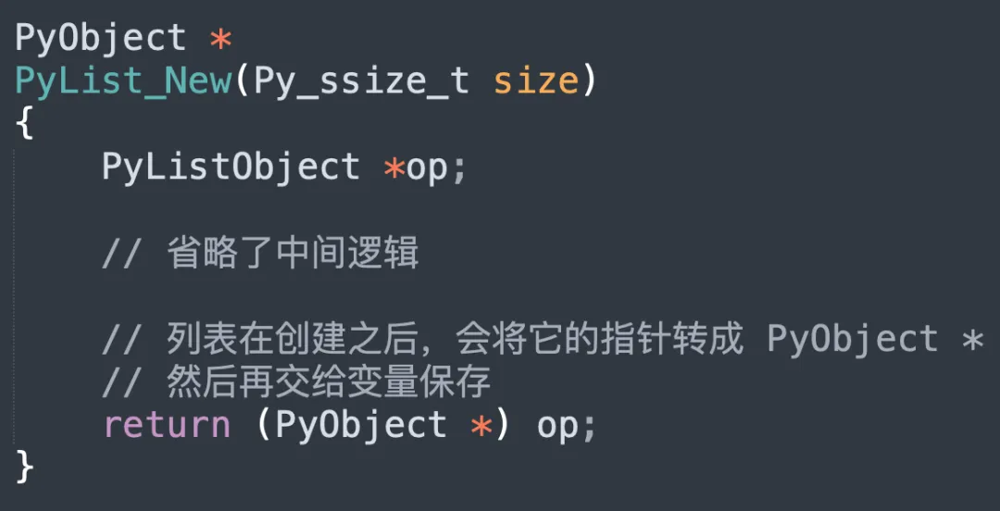

之前我们提到了泛型 API，这类 API 的特点是可以处理任意类型的对象，举个例子。

~~~C
// 返回对象的长度
PyObject_Size
// 返回对象的某个属性的值
PyObject_GetAttr
// 返回对象的哈希值
PyObject_Hash
// 将对象转成字符串后返回
PyObject_Str
~~~

对应到 Python 代码中，就是下面这个样子。

~~~python
# PyObject_Size
print(len("古明地觉"))
print(len([1, 2, 3]))
"""
4
3
"""

# PyObject_GetAttr
print(getattr("古明地觉", "lower"))
print(getattr([1, 2, 3], "append"))
print(getattr({}, "update"))
"""
<built-in method lower of str object at 0x7f081aa7e920>
<built-in method append of list object at 0x7f081adc1100>
<built-in method update of dict object at 0x7f081aa8fd80>
"""

# PyObject_Hash
print(hash("古明地觉"))
print(hash(2.71))
print(hash(123))
"""
8152506393378233203
1637148536541722626
123
"""

# PyObject_Str
print(str("古明地觉"))
print(str(object()))
"""
古明地觉
<object object at 0x7fdfa0209d10>
"""
~~~

这些 API 能处理任意类型的对象，这究竟是怎么办到的？要想搞清楚这一点，还是要从 PyObject 入手。

我们知道对象在 C 看来就是一个结构体实例，并且结构体嵌套了 PyObject。

~~~python
# 创建一个浮点数，让变量 var 指向它
var = 2.71
# 创建一个列表，让变量 var 指向它
var = [1, 2, 3]
~~~

浮点数对应的结构体是 PyFloatObject，列表对应的结构体是 PyListObject，变量 var 是指向对象的指针。那么问题来了，凭啥一个变量可以指向不同类型的对象呢？或者说变量和容器里面为什么可以保存不同对象的指针呢？

原因在前面的文章中解释的很详细了，因为对象的指针会统一转成 PyObject \* 之后再交给变量保存，以创建列表为例。

当然创建浮点数也是同理，因此变量和容器里的元素本质上就是一个泛型指针 PyObject *。而对象的指针在交给变量保存的时候，也都会先转成 PyObject *，因为不管什么对象，它底层的结构体都嵌套了 PyObject。正是因为这个设计，变量才能指向任意的对象。

所以 Python 变量相当于一个便利贴，可以贴在任意对象上。

不过问题来了，由于对象的指针会统一转成 PyObject \* 之后再交给变量保存，那么变量怎么知道自己指向的是哪种类型的对象呢？相信你肯定知道答案：通过 ob_type 字段。

对象对应的结构体可以有很多个字段，比如 PyListObject，但变量能看到的只有前两个字段。至于之后的字段是什么，则取决于对象的类型。

所以变量会先通过 ob_type 字段获取对象的类型，如果 ob_type 字段的值为 &PyList_Type，那么变量指向的就是 PyListObject。如果 ob_type 字段的值为 &PyFloat_Type，那么变量指向的就是 PyFloatObject，其它类型同理。当得到了对象的类型，那么再转成相应的指针即可，假设 ob_type 是 &PyList_Type，那么变量会再转成 PyListObject \*，这样就可以操作列表的其它字段了。

所以我们再总结一下：

变量和容器里的元素只能保存相同的指针类型，而不同类型的对象，其底层的结构体是不同的。但这些结构体无一例外都嵌套了 PyObject，因此它们的指针会统一转成 PyObject \* 之后再交给变量保存。

然后变量在操作对象时，会先通过 ob_type 判断对象的类型，假如是 &PyList_Type，那么会再转成 PyListObject *，其它类型同理。我们以获取列表元素为例：

相信你已经知道为什么泛型 API 可以处理任意类型的对象了，我们再以 PyObject_GetAttr 为例，它内部会调用类型对象的 tp_getattro。

~~~C
// Objects/object.c

// 等价于 getattr(v, name)
PyObject *
PyObject_GetAttr(PyObject *v, PyObject *name)
{   
    // 获取对象 v 的类型对象
    PyTypeObject *tp = Py_TYPE(v);
    // 属性名称必须是字符串
    if (!PyUnicode_Check(name)) {
        PyErr_Format(PyExc_TypeError,
                     "attribute name must be string, not '%.200s'",
                     name->ob_type->tp_name);
        return NULL;
    }
    // 如果类型对象实现了 tp_getattro，那么进行调用
    // 等价于 Python 中的 type(v).__getattr__(v, name)
    if (tp->tp_getattro != NULL)
        return (*tp->tp_getattro)(v, name);
    // 否则会退化为 tp_getattr，它要求属性名称必须是 C 字符串
    // 不过 tp_getattr 已经废弃，应该使用 tp_getattro
    if (tp->tp_getattr != NULL) {
        const char *name_str = PyUnicode_AsUTF8(name);
        if (name_str == NULL)
            return NULL;
        return (*tp->tp_getattr)(v, (char *)name_str);
    }
    // 否则说明对象 v 没有该属性
    PyErr_Format(PyExc_AttributeError,
                 "'%.50s' object has no attribute '%U'",
                 tp->tp_name, name);
    return NULL;
}
~~~

函数先通过 ob_type 找到对象的类型，然后通过类型对象的 tp_getattro 调用对应的属性查找函数。所以对象的类型不同，PyObject_GetAttr 调用的属性查找函数也不同，而这就是泛型 API 能处理任意对象的秘密。

我们再以 Python 代码为例：

~~~Python
class A:

    def __getattr__(self, item):
        return f"class：A，item：{item}"

class B:

    def __getattr__(self, item):
        return f"class：B，item：{item}"

a = A()
b = B()
print(getattr(a, "some_attr"))
print(getattr(b, "some_attr"))
"""
class：A，item：some_attr
class：B，item：some_attr
"""
# 以上等价于
print(type(a).__getattr__(a, "some_attr"))
print(type(b).__getattr__(b, "some_attr"))
"""
class：A，item：some_attr
class：B，item：some_attr
"""
~~~

在 Python 里的表现和源码是一致的，我们再举个 iter 的例子：

~~~Python
data = [1, 2, 3]
print(iter(data))
print(type(data).__iter__(data))
"""
<list_iterator object at 0x7fb8200f29a0>
<list_iterator object at 0x7fb8200f29a0>
"""
~~~

如果一个对象支持创建迭代器，那么它的类型对象一定实现了 \_\_iter\_\_，通过 type(data) 可以获取到类型对象，然后再将 data 作为参数调用 \_\_iter\_\_ 即可。

所以通过 ob_type 字段，这些泛型 API 实现了类似多态的效果，一个函数，多种实现。

------

&nbsp;

**欢迎大家关注我的公众号：古明地觉的编程教室。**

**如果觉得文章对你有所帮助，也可以请作者吃个馒头，Thanks♪(･ω･)ﾉ。**

