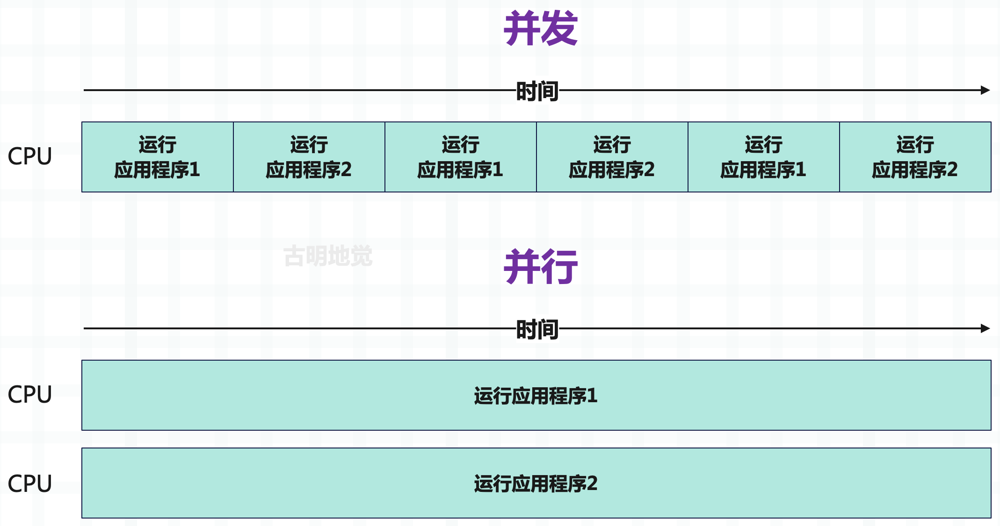
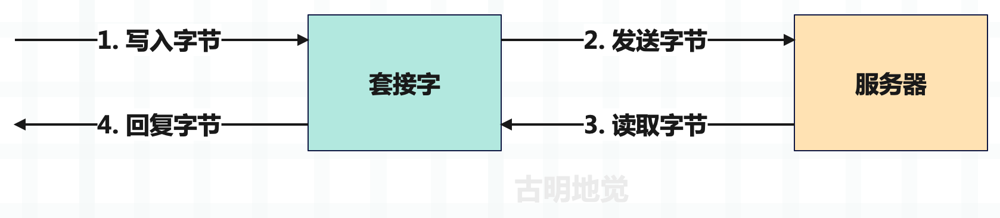
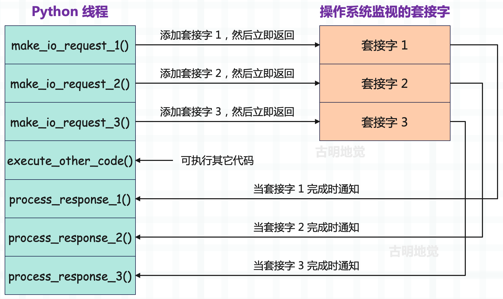
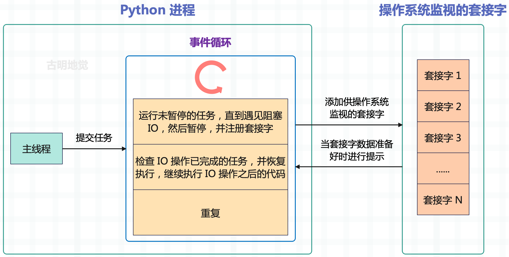
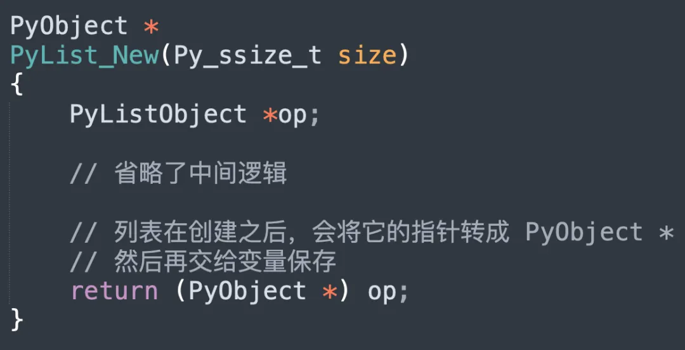

## 楔子

上一篇文章我们介绍了协程，明白了为什么要有协程，以及协程的实现原理。当然协程的出现也不是一蹴而就的，它同样有一个演进的过程。而提到 Python 的协程，那么必然绕不过标准库 asyncio，它最初是在 Python3.4 中引入的，作为除多进程和多线程之外，处理这些高并发工作负载的另一种方式。

那么接下来我们将用几篇文章来介绍 asyncio，同时学习 Python 的协程。

## 什么是 asyncio？

许多应用程序，尤其是在当今的 Web 领域，严重依赖 IO 操作，比如下载网页的内容、和微服务进行通信、查询数据库等。而 IO 会阻塞应用程序，那么当有大量的 IO 请求时，会导致严重的性能问题。假设现在要下载 100 个网页，每个网页的下载时间是 1 秒，那么程序就需要 100 秒才能完成，显然我们无法接受这种情况。

解决这个问题的方案之一是引入并发，而并发意味着允许同时处理多个任务，所以下载这 100 个网页理论上只需要 1 秒就可以完成。而提到并发 IO，必然绕不开 asyncio，它是 Python3.4 中引入的标准库，允许使用异步编程模型运行代码，这让我们可以一次处理多个 IO 操作，同时仍然允许应用程序保持对外界的响应。

也就是说，特定的长时间运行的任务可以在后台运行，与主应用程序分开。系统可以自由地执行不依赖于该任务的其它工作，一旦长时间运行的任务完成，那么程序会收到它已经完成的通知，以便对结果进行处理。

另外，虽然 asyncio 这个名字可能会让我们认为这个库只适用于 IO 操作，但其实它也可以和多进程、多线程相互配合来处理其它类型的操作。这意味着这个库不仅适用于基于 IO 的并发，还可以用于 CPU 密集型代码。为了更好地理解 asyncio 可以帮助我们处理何种类型的工作负载，以及哪种并发模型最适合，下面介绍一下 IO 密集型和 CPU 密集型操作之间的差异。

## IO 密集型和 CPU 密集型

将一个操作称为 IO 密集型或 CPU 密集型时，指的是阻止该操作运行更快的限制因素。这意味着，如果提高操作所绑定的对象的性能，该操作将在更短时间内完成。

在 CPU 密集型操作的情况下，如果 CPU 更强大，它将更快地完成任务，例如将其时钟速度从 2GHz 提高到 3GHz。在 IO 密集型操作的情况下，如果 IO 设备能在更短的时间内处理更多数据，程序将变得更快，这可通过 ISP 增加网络带宽或升级到更快的网卡来实现。

CPU 密集型操作通常是 Python 中的计算和处理代码，例如对数组进行求和，或者循环遍历字典的内容。在 IO 密集型操作中，大部分时间将花在等待网络或其它 IO 设备上，例如向 Web 服务器发出请求或从机器的硬盘驱动器读取文件。

~~~Python
import httpx

res = httpx.get("http://www.baidu.com")  # IO 密集型（web 请求）

items = res.headers.items()

headers = [f"{key}: {val}" for key, val in items]  # CPU 密集型（响应处理）

formatted_headers = "\n".join(headers)  # CPU 密集型（字符串连接）

with open("headers.txt", "w", encoding="utf-8") as f:
    f.write(formatted_headers)  # IO 密集型（磁盘写入）
~~~

IO 密集型和 CPU 密集型操作通常并存，我们首先发出一个 IO 密集型请求来下载 http://www.baidu.com 的内容。一旦得到响应，将执行一个 CPU 密集型循环来格式化响应头，并将它们转成一个由换行符分隔的字符串。然后打开一个文件，并将字符串写入该文件，这也是一个 IO 密集型操作。

异步 IO 允许在执行 IO 操作时暂停特定程序的执行，可在后台等待初始 IO 完成时运行其它代码。这允许同时执行许多 IO 操作，从而潜在地加快应用程序的运行速度。

## 了解并发、并行和多任务处理

<font color="darkblue">**并发**</font>

当我们说两个任务并发时，是指它们在一个时间段内同时执行。例如一个面包师要烘焙两种不同的蛋糕，要烘焙这些蛋糕，需要预热烤箱。根据烤箱和烘焙温度的不同，预热可能需要几十分钟，但不需要等烤箱完成预热后才开始其它工作，比如把面粉、糖和鸡蛋混合在一起。在烤箱预热过程中可以做其它工作，直到烤箱发出提示音，告诉我们它已经预热完成了。

此外也不需要限制自己在完成第一个蛋糕之后才开始做第二个蛋糕。比如做蛋糕面糊，将其放进搅拌机，当第一团面糊搅拌完毕，就开始准备第二团面糊。在这个模型中，同时在不同的任务之间切换，这种任务之间的切换（烤箱加热时做其它事情，在两个不同的蛋糕之间切换）是并发行为。

<font color="darkblue">**并行**</font>

当我们说两个任务并行时，是指它们在同一个时间点同时执行。回到蛋糕烘焙示例，假设有第二个面包师的帮助，这种情况下，第一个面包师可以制作第 1 个蛋糕，而第二个面包师同时制作第 2 个蛋糕。两个人同时制作属于并行运行，因为有两个不同的任务同时运行。

一句话总结并发和并行之间的区别：

+ 并发：有多个任务在运行，但在特定的时间点，只有一个任务在运行；
+ 并行：有多个任务在运行，但在特定的时间点，仍然有多个任务同时运行；

回到操作系统和应用程序，想象有两个应用程序在运行。在只有并发的系统中，可以在这些应用程序之间切换，先让一个应用程序运行一会儿，然后再让另一个应用程序运行一会儿。如果切换的速度足够快，就会出现两件事同时发生的现象（或者说是假象）。但在一个并行的系统中，两个应用程序同时运行，系统同时全力运行两个任务，而不是在两个任务之间来回切换。

并发和并行的概念相似，并且经常容易混淆，一定要对它们之间的区别有清楚的认识。



并发关注的是彼此独立发生的多个任务，可以在只有一个内核的 CPU 上实现并发，因为该操作将采用抢占式多任务的方式在任务之间切换。然而并行意味着必须同时执行两个或多个任务，如果想实现，那么必须要具备多个 CPU 核心。

<font color="darkblue">**什么是多任务**</font>

多任务处理在当今世界无处不在，人们一边做早餐一边看电视，一边接电话一边等水烧开来泡茶。甚至在旅行途中，人们也可以多任务处理，例如在搭乘飞机时读自己喜欢的书。本节讨论两种主要的多任务处理：抢占式多任务处理和协同多任务处理。

+ 抢占式多任务处理：在这个模型中，由操作系统决定如何通过一个称为时间片的过程，在当前正在执行的任务之间切换。当操作系统在任务之间切换时，我们称之为抢占。这种机制如何在后台工作取决于操作系统本身，它主要是通过使用多个线程或多个进程来实现的。
+ 协同多任务处理：在这个模型中，不依赖操作系统来决定何时在当前正在执行的任务之间切换，而是在应用程序中显式地编写代码，来让其它任务先运行。应用程序中的任务会在它们协同的模型中运行，会主动发生切换："暂停我的任务一段时间，让其它任务先执行"。

asyncio 使用协同多任务来实现并发性，当应用程序达到可以等待一段时间以返回结果的时间点时，在代码中显式地标记它，并让其它代码执行。一旦标记的任务完成，应用程序就"醒来"并继续执行该任务。这是一种并发形式，因为可同时启动多个任务，但重要的是，这不是并行模式，因为它们不会同时执行代码。

## 单线程并发

提到并发我们首先会想到开启多个线程，但有了 asyncio 之后，就可以在一个进程和一个线程的范围内完成这一切。因为我们利用了这样一个事实：在系统级别，IO 操作可以并发完成。为了更好地理解这一点，我们需要研究套接字是如何工作的，特别是非阻塞套接字是如何工作的。

套接字（socket）是通过网络发送和接收数据的低级抽象，是在服务器之间传输数据的基础，套接字支持两种主要操作：发送字节和接收字节。我们将字节写入套接字，然后将其发送到一个远程地址，通常是某种类型的服务器。一旦发送了这些字节，就等待服务器将其响应写回套接字，然后读取结果。

套接字是一个低级概念，如果你把它们看作邮箱，就很容易理解了。你可以把信放在邮箱里，然后邮差拿起信，并递送到收件人的邮箱。收件人打开邮箱，打开信，然后读取内容并回信。在这个类比中，可以将信里面的文字看作是要发送的数据，将信件放入邮箱的操作看作是将字节写入套接字，将打开邮箱读取信件的操作看作是从套接字读取字节，将信件载体看作互联网上的传输机制（将数据路由到正确地址）。

在前面看到的从 baidu.com 获取内容的例子中，会打开一个连接到 baidu.com 服务器的套接字。然后编写一个请求来获取该套接字的内容，并等待服务器返回结果。



套接字在默认情况下是阻塞的，这意味着等待服务器返回数据时，会暂停应用程序或阻塞它，直到获得数据并进行读取。因此表现就是应用程序会停止运行任何其它任务，直到从服务器获取数据、发生错误或出现超时。

在操作系统级别，不需要使用阻塞，套接字可在非阻塞模式下运行。在非阻塞模式下，当我们向套接字写入字节时，可以直接触发，而不必在意写入或读取操作，应用程序可以继续执行其它任务。之后可以让操作系统告知：我们收到了字节，并开始处理它。这使得应用程序可在等待字节返回的同时做其它事情，不再阻塞和等待数据的返回，从而让程序响应更迅速，并让操作系统通知何时有数据可供操作。

在后台，这是由几个不同的事件通知系统执行的，具体取决于运行的操作系统。asyncio 已经足够抽象，可在不同的通知系统之间切换，这取决于操作系统具体支持哪一个。以下是特定操作系统使用的事件通知系统：

- kqueue：FreeBSD 和 macOS
- epoll：Linux
- IOCP：Windows

这些系统会跟踪非阻塞套接字，并在准备好让我们做某事时通知我们。这个通知系统是 asyncio 实现并发的基础，在 asyncio 的并发模型中，只有一个线程在特定时间执行 Python 代码。当遇到 IO 操作时，将它交给操作系统的事件通知系统来跟踪它，之后 Python 线程就可以继续自由执行其它代码，或者为操作系统添加更多的非阻塞套接字。IO 操作完成时，唤醒正在等待结果的任务，然后继续运行该 IO 操作之后的代码。下图通过几个单独的操作来可视化这个流程，每个操作都依赖于一个套接字。



发出的非阻塞 IO 请求会立即返回，并告诉 OS 监视套接字中的数据，这允许 execute_other_code() 可以立刻执行，而不是等待 IO 请求完成。等到 IO 请求真正完成时，会收到通知，然后应用程序再去处理即可。

但这里又产生了一个问题，在跟踪的过程中如何区分哪些是正在等待 IO 的任务，哪些是作为常规 Python 代码运行的任务呢？答案在于一个被称为事件循环的构造。

## 事件循环的工作原理

事件循环是每个 asyncio 应用程序的核心，事件循环是许多系统中相当常见的设计模式，并且已经存在了相当长的一段时间。如果你曾在浏览器中使用 JavaScript 发送异步 Web 请求，那么你已经在事件循环上创建了一个任务。再比如 Windows GUI 应用程序在幕后使用所谓的消息循环作为处理键盘输入等事件的主要机制，同时允许 UI 进行绘制。

最基本的事件循环非常简单，创建一个包含事件或消息的队列，然后启动循环，在消息进入队列时一次处理一条消息。在 Python 中，一个基本的事件循环可能看起来像下面这样：

```Python
from collections import deque

messages = deque()

while True:
    if messages:
        message = messages.pop()
        process_message(message)
```

只不过在 asyncio 中，事件循环处理的不是消息，而是任务。任务是协程的包装器，协程可以在遇到 IO 密集型操作时暂停执行，并让事件循环运行其它不等待 IO 操作完成的任务。

创建一个事件循环时，会创建一个空的任务队列，然后将任务添加到要运行的队列中。事件循环的每次迭代都会检查需要运行的任务，并一次运行一个，直到任务遇到 IO 操作。然后将任务暂停，指示操作系统监视相应的套接字以完成 IO，并寻找下一个要运行的任务。在事件循环的每次迭代中，会检查是否有 IO 操作已完成的任务，如果有则唤醒，并让它们继续运行。



主线程将任务提交给事件循环，此后事件循环可以运行它们。

为说明这一点，我们假设有三个任务，每个任务都发出一个异步 Web 请求。想象一下，这些任务有一些代码负责完成一些 CPU 密集型的准备工作，然后它们发出 Web 请求（IO 密集型），之后又是一些 CPU 密集型的后处理代码。现在同时将这些任务提交给事件循环，在伪代码中，可以这样写。

~~~Python
async def make_request():
    cpu_bound_setup()
    await io_bound_web_request()
    cpu_bound_postprocess()
    
task_one = event_loop.create_task(make_request())
task_two = event_loop.create_task(make_request())
task_three = event_loop.create_task(make_request())
~~~

三个任务都以 CPU 密集型工作开始，并且使用单线程，因此只有第一个任务开始执行代码，其它两个任务则在等待。一旦任务 1 中的 CPU 密集型设置工作完成，则会遇到一个 IO 密集型操作，然后暂停自己："我正在等待 IO，由于 IO 是操作系统负责的，并且不耗费 CPU，所以我要将执行权交出去，此时其它任何等待运行的任务都可以运行。"

> 当任务遇见 IO 阻塞的时候，会将执行权交给事件循环，事件循环再去找其它可以运行的任务。

一旦发生这种情况，任务 2 就可以开始执行了，任务 2 同样会先执行其 CPU 密集型代码，然后暂停等待 IO。此时任务 1 和任务 2 在同时等待它们的网络请求完成，由于任务 1 和任务 2 都暂停等待 IO，于是开始运行任务 3。任务 3 同样也会暂停以等待其 IO 完成，此时三个任务都处于 IO 等待状态。

然后某一时刻任务 1 的 Web 请求完成了，那么操作系统的事件通知系统会提醒此 IO 已完成（IO 操作不耗费 CPU，只要 IO 操作发起，剩下的交给操作系统。这时候线程可以去执行其它任务，当 IO 完成之后操作系统会自动通知），可以在任务 2 和任务 3 都在等待 IO 时，继续执行任务 1。

> 如果 CPU 密集型代码的耗时忽略不计，IO 密集型代码需要 2 秒钟，那么这三个任务执行完毕也只需要 2 秒钟，因为三个 web 请求是同时发出的。如果是同步代码，那么在返回响应之前，CPU 做不了其它事情，必须等到响应返回之后，才能发送下一个请求，那么整个过程就需要 6 秒钟的时间。



当任务一执行 cpu_bound_setup 的时候，任务二和任务三只能处于等待状态。当任务一进入 IO 的时候，任务二也开始执行 cpu_bound_setup，此时任务一和任务三需要处于等待状态。但对于任务一来说，由于它当前正处于 IO，CPU 给它也没法执行，不过也正因为它处于 IO（要 CPU 也没用），才将 CPU 交出去。

当任务二执行完 cpu_bound_setup 进入 IO 的时候，任务三开始执行 cpu_bound_setup，执行完之后进入 IO。

可以看到整个过程 CPU 没有处于空闲状态，在任务阻塞的时候立刻切换到其它任务上执行。然后当任务一、任务二、任务三都处于 IO 阻塞时，由于已经没有准备就绪的任务了，那么此时 CPU 就只能处于空闲了。接下来的某一时刻，任务一的 IO 结束了，操作系统会通知程序，然后执行任务一的 cpu_bound_postprocess。

所以任务之间等待 IO 的重叠部分是 asyncio 真正节省时间的地方。

## 小结

1）CPU 密集型的工作主要使用计算机处理器，而 IO 密集型的工作主要使用网络或其它输入/输出设备。asyncio 可以让 IO 密集型工作并发执行，并且通过和进程、线程搭配，也提供了可以让 CPU 密集型工作并发执行的 API。

2）进程是操作系统资源分配的基本单元，线程是操作系统调度操作 CPU 的基本单元。

3）在使用非阻塞套接字时，可指示操作系统告诉我们何时有数据传入，而不是在等待数据传入时停止应用程序。这是允许 asyncio 仅使用单个线程实现并发的部分原因。

4）事件循环是 asyncio 应用程序的核心，事件循环会一直运行下去，寻找 CPU 密集型任务，同时暂停正在等待 IO 的任务。注意：这里的暂停，不是说任务就完全处于静止状态了，而是指不需要在该任务上浪费 CPU 了。因为 IO 操作一旦发起，就由操作系统接管，程序可以去执行其它任务了，但 IO 操作的过程是不会中断的，因为它不耗费 CPU。而当 IO 操作完成后，会收到操作系统通知，然后可以再切换回该任务，继续执行该任务剩余的 CPU 密集型代码。这样就保证了 CPU 的利用率，其实说白了核心就一句话：在任务陷入 IO 阻塞的时候，不要傻傻地等待，而是去执行其它的任务。

> 比如你同时和三个女孩聊天，当给某个女孩发出消息之后，不要一直处于等待状态，而是继续给别的女孩发消息。当女孩回你消息之后，你再切换回来，继续发。

因此操作系统提供的非阻塞 IO + IO 多路复用，是事件循环的核心。

-------

&nbsp;

**欢迎大家关注我的公众号：古明地觉的编程教室。**


**如果觉得文章对你有所帮助，也可以请作者吃个馒头，Thanks♪(･ω･)ﾉ。**

