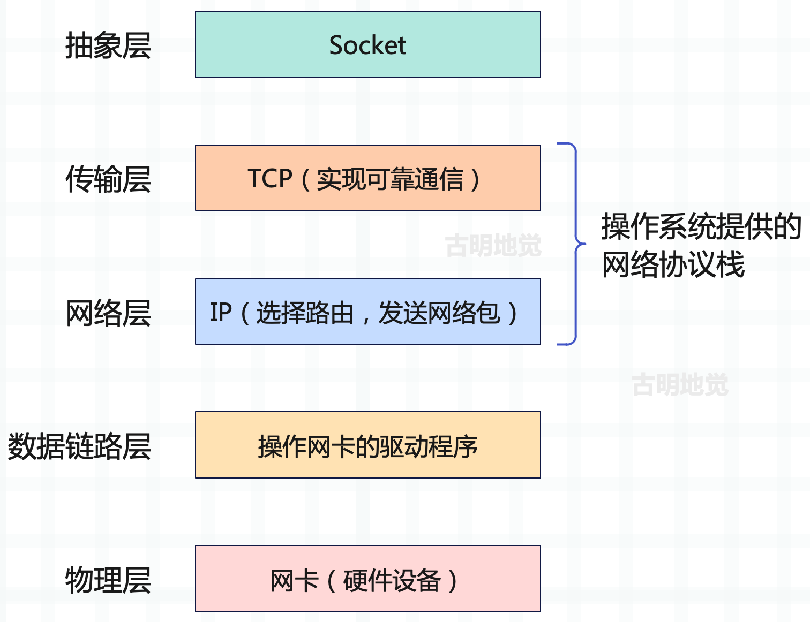
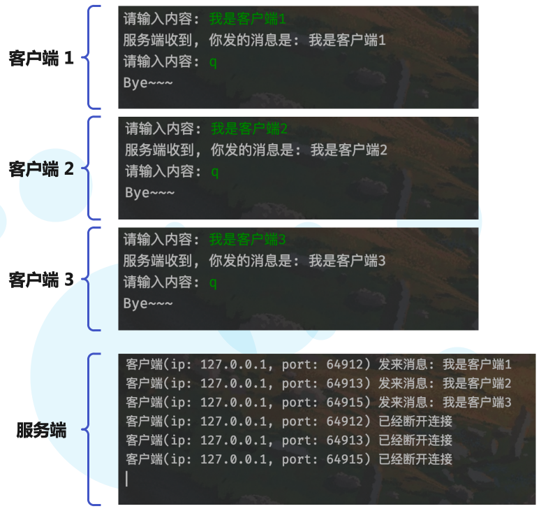
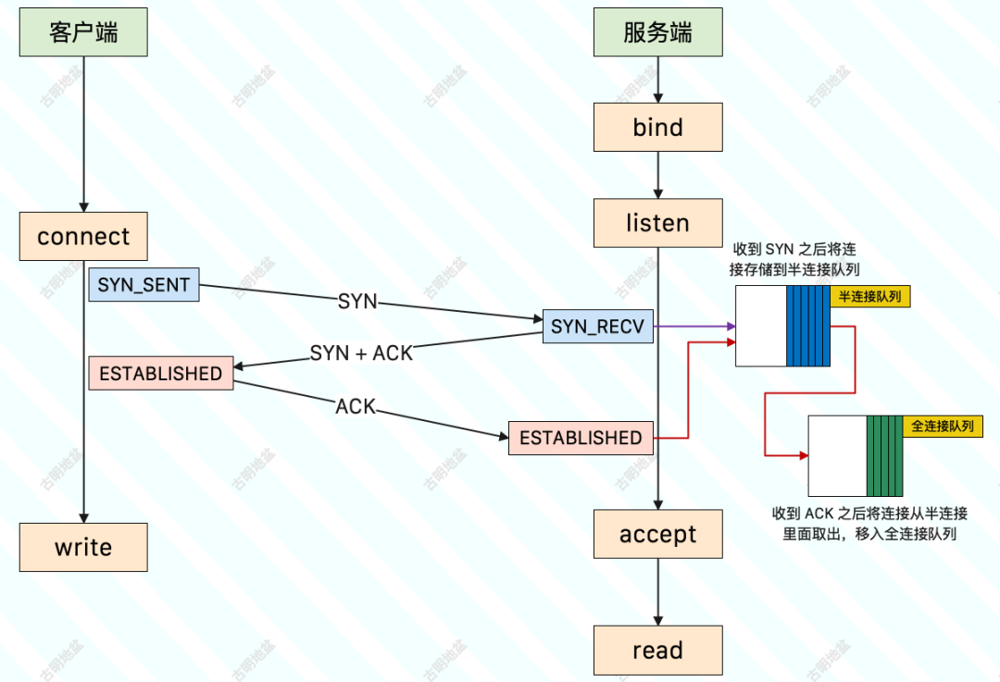
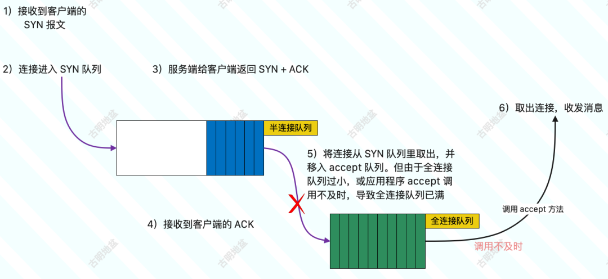
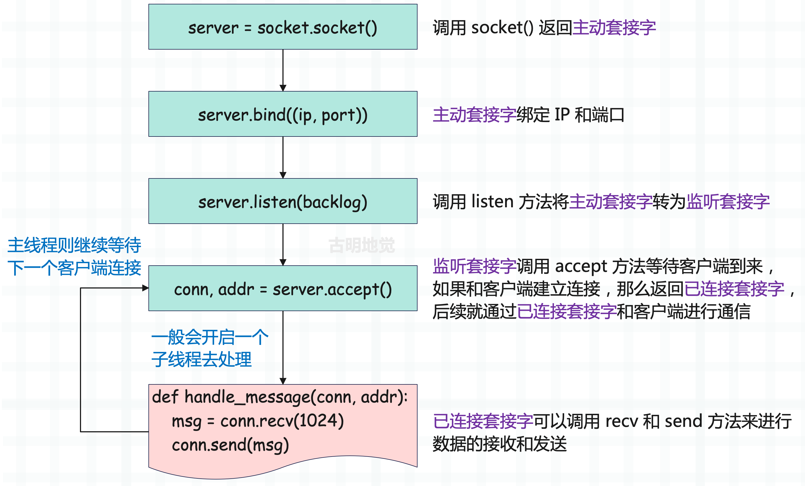
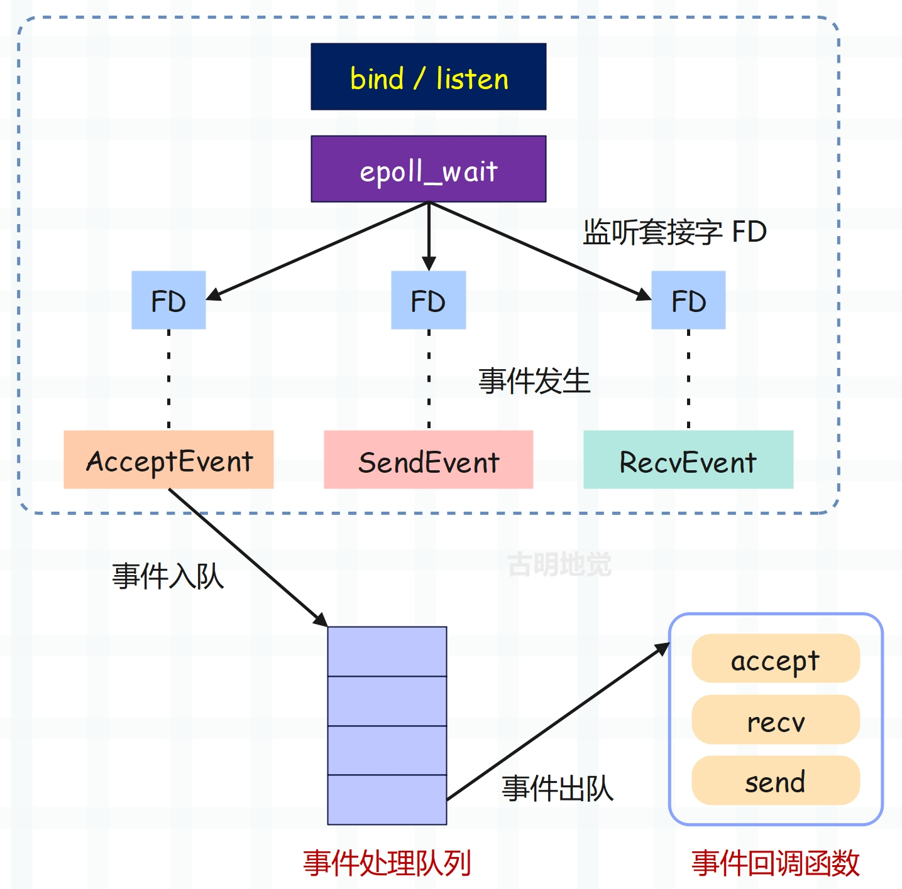
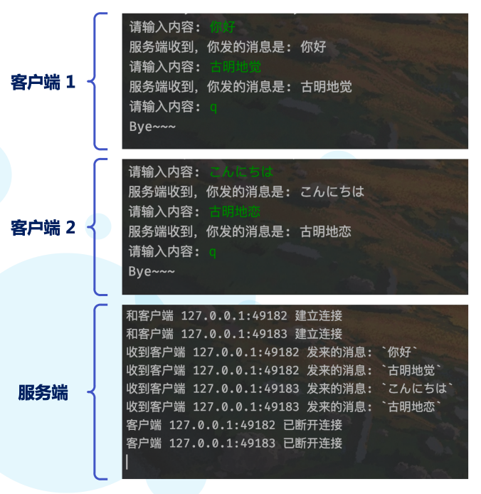

## 楔子

我们前面介绍了协程、任务和事件循环，研究了如何同时运行长耗时的操作，并探索了一些可以优化这些操作的 asyncio API。然而到目前为止，我们只是用 asyncio.sleep 函数模拟长时间的操作，显然这是不够的，接下来将使用一些真实的阻塞操作来演示如何创建一个可同时处理多个用户请求的服务器。

既然要处理用户请求，那就必须了解什么是套接字。

## 使用阻塞套接字

套接字听起来稍微有点陌生，但如果说 Socket 你是不是就熟悉了呢？Socket 是对 TCP/IP 协议栈的一个封装，可以让我们更方便地使用 TCP/IP 协议，而不用关注背后的原理。像我们经常使用的 Web 框架，本质上就是一个 Socket。

> Socket 是操作系统对 TCP/IP 网络协议栈的封装，并提供了一系列的接口，我们通过这些接口可以实现网络通信，而不用关注网络协议的具体细节。



按照现有的网络模型，Socket 并不属于其中的任何一层，但我们可以简单地将 Socket 理解为传输层之上的抽象层，负责连接应用层和传输层。Socket 提供了大量的 API，基于这些 API 我们可以非常方便地使用网络协议栈，在不同主机间进行网络通信。

> Linux 一切皆文件，Socket 也不例外，它被称为套接字文件，在使用上和普通文件是类似的。

Socket 是什么我们已经知道了，下面来看看如何使用 Socket 进行编程。


整个过程如下：

- 服务端初始化 socket，此时会得到「主动套接字」；
- 服务端调用 bind，将套接字绑定在某个 IP 和端口上；
- 服务端调用 listen 进行监听，此时「主动套接字」会变成「监听套接字」；
- 服务端调用 accept，等待客户端连接，此时服务端会阻塞在这里（调用的是阻塞的 API）；
- 客户端同样初始化 socket，得到主动套接字；
- 客户端调用主动套接字的 connect，向服务器端发起连接请求，如果连接成功，后续客户端就用这个主动套接字进行数据的传输；
- 当客户端来连接时，那么服务端的 accept 将不再阻塞，并返回「已连接套接字」，后续服务端便用这个已连接套接字和客户端进行数据传输；
- 如果客户端断开连接，那么服务端读取数据的时候就会出现 EOF，知道客户端断开连接了。待数据处理完毕后，服务端也要调用 close 来关闭连接；

我们使用 Python 来演示一下这个过程，首先是服务端：

~~~python
import socket

# socket.socket() 会返回一个「主动套接字」
server = socket.socket(
    # 表示使用 IPv4，如果是 socket.AF_INET6，则表示使用 IPv6
    socket.AF_INET,
    # 表示建立 TCP 连接，如果是 socket.SOCK_DGRAM，则表示建立 UDP 连接
    socket.SOCK_STREAM
)
# 当然这两个参数也可以不传，因为默认就是它们

# 设置套接字属性，这里让端口释放后立刻就能再次使用
server.setsockopt(socket.SOL_SOCKET, socket.SO_REUSEADDR, True)

# 将「主动套接字」绑定在某个 IP 和端口上
server.bind(("localhost", 12345))
# 监听，此时「主动套接字」会变成「监听套接字」
# 里面的参数表示 backlog，代表的含义后面说
server.listen(5)

# 调用 accept，等待客户端连接，此时会阻塞在这里
# 如果客户端连接到来，那么会返回「已连接套接字」，也就是这里的 conn
# 至于 addr 则是一个元组，保存了客户端连接的信息（IP 和端口）
conn, addr = server.accept()

# 下面通过「已连接套接字」conn 和客户端进行消息的收发
# 收消息使用 recv、发消息使用 send，和 read、write 本质是一样的
while True:
    msg = conn.recv(1024)
    # 当客户端断开连接时，msg 会收到一个空字节串
    if not msg:
        print("客户端已经断开连接")
        conn.close()
        break
    print("客户端发来消息:", msg.decode("utf-8"))
    # 然后我们加点内容之后，再给客户端发过去
    conn.send("服务端收到, 你发的消息是: ".encode("utf-8") + msg)
~~~

接下来编写客户端：

```Python
import socket

# 返回主动套接字
client = socket.socket(socket.AF_INET,
                       socket.SOCK_STREAM)
# 连接服务端
client.connect(("localhost", 12345))
while True:
    # 发送消息
    data = input("请输入内容: ")
    if data.strip().lower() in ("q", "quit", "exit"):
        client.close()
        print("Bye~~~")
        break
    client.send(data.encode("utf-8"))
    print(client.recv(1024).decode("utf-8"))
```

启动服务端和客户端进行测试：


还是比较简单的，当然我们这里的服务端每次只能和一个客户端通信，如果想服务多个客户端的话，那么需要为已连接套接字单独开一个线程和客户端进行通信，然后主线程继续执行 accept 等待下一个客户端。

下面来编写一下多线程的版本，这里只需要编写服务端即可，客户端代码不变。

```Python
import socket
import threading

server = socket.socket()
server.setsockopt(socket.SOL_SOCKET, socket.SO_REUSEADDR, True)
server.bind(("localhost", 12345))
server.listen(5)

def handle_message(conn, addr):
    while True:
        msg = conn.recv(1024)
        if not msg:
            print(f"客户端(ip: {addr[0]}, port: {addr[1]}) 已经断开连接")
            conn.close()
            break
        print(f"客户端(ip: {addr[0]}, port: {addr[1]}) 发来消息:",
              msg.decode("utf-8"))
        conn.send("服务端收到, 你发的消息是: ".encode("utf-8") + msg)

while True:
    conn, addr = server.accept()
    threading.Thread(
        target=handle_message, args=(conn, addr)
    ).start()
```

代码很简单，就是把已连接套接字和客户端的通信逻辑写在了单独的函数中，每来一个客户端，服务端都会启动一个新的线程去执行该函数，然后继续监听，等待下一个客户端连接到来。

然后客户端代码不变，我们启动三个客户端去和服务端通信，看看结果如何。



结果一切正常，当然我们这里的代码比较简单，就是普通的消息收发。你也可以实现一个更复杂的功能，比如文件下载器，把服务端当成网盘，支持客户端上传和下载文件，并不难。

### socketserver

另外 Python 标准库还提供了一个模块叫 socketserver，它是 socket 的更高级封装，可以简化服务端的代码逻辑。并且 socketserver 的内部会自动使用多线程，服务多个客户端。

```Python
import socketserver

# 自定义一个类，必须继承 BaseRequestHandler
class ServiceHandler(socketserver.BaseRequestHandler):
    """
    内部提供了三个重要属性
        self.request: 已连接套接字 conn
        self.client_address: 客户端信息 addr
        self.server: 服务端实例（稍后会创建它）

    然后我们必须要实现 handle 方法，处理客户端连接时会自动调用
    此外还有两个方法，分别是 setup 和 finish，实不实现均可
    """

    def setup(self) -> None:
        """在执行 handle 之前调用，用于提前做一些连接相关的设置"""

    def finish(self) -> None:
        """在执行 handle 之后调用，用于资源释放等等"""
        self.request.close()

    def handle(self) -> None:
        """
        处理客户端连接，这里的 self.request 就相当于之前的 conn
        """
        client_ip, client_port = self.client_address
        while True:
            msg = self.request.recv(1024)
            if not msg:
                print(f"客户端(ip: {client_ip}, port: {client_port}) 已经断开连接")
                self.request.close()
                break
            print(f"客户端(ip: {client_ip}, port: {client_port}) 发来消息:",
                  msg.decode("utf-8"))
            self.request.send("服务端收到, 你发的消息是: ".encode("utf-8") + msg)


# 绑定 IP 和端口，以及用于处理的 Handler
# 这里的 ThreadingTCPServer 实例就是 ServiceHandler 里面的 self.server
server = socketserver.ThreadingTCPServer(
    ("localhost", 12346),
    ServiceHandler
)
# 开启无限循环，监听连接
server.serve_forever()
# 如果关闭监听，那么调用 server.shutdown()
```

可以测试一下，结果没有问题。并且当前支持多个客户端连接，每来一个客户端就会实例化一个 ServiceHandler，并开启多线程执行 handle 方法，与客户端通信。

以上我们就简单提了一下 socketserver，了解一下即可。

### listen 方法的意义？

在创建完 socket 之后，我们调用了 listent 方法，该方法接收一个 backlog 参数。

```Python
server = socket.socket()
...
server.listen(5)
```

那么该方法的意义是什么呢？我们调用时传的数字 5 又有什么作用呢？根据上面的 socket 流程图，我们可以得知在三次握手的时候，Linux 内核会维护两个队列：

- 半连接队列，也称 SYN 队列；
- 全连接队列，也称 Accept 队列；

服务端收到客户端发起的 SYN 请求后，内核会把该连接存储到<font color="blue">半连接队列</font>，并向客户端响应 SYN+ACK。接着客户端会回复 ACK，服务端收到后，内核会从半连接队列里面将连接取出，然后添加到<font color="blue">全连接队列</font>，等待进程调用 accept 函数时把连接取出来。



所以整个过程如下：

- 1）客户端发送 SYN 报文；
- 2）服务端将连接插入到半连接队列；
- 3）服务端向客户端返回 SYN + ACK；
- 4）客户端收到之后再向服务端返回 ACK；
- 5）服务端将连接从半连接队列中取出，移入全连接队列；
- 6）进程调用 accept 函数，从全连接队列中取出已完成连接建立的 socket 连接；

因此半连接队列（SYN 队列）用来存储 SYN_RECV 状态、未完成建立的连接；全连接队列（Accept 队列）用来存储 ESTABLISH 状态、已完成建立的连接。

而我们也可以很容易得出结论，客户端返回成功是在第二次握手之后，服务端 accept 成功是在三次握手之后，因为调用 accept 就相当于从全连接队列中取出连接和客户端进行通信。

那么如何查看 SYN 队列和 Accept 队列的大小呢？

- net.ipv4.tcp_max_syn_backlog：查看半连接队列的长度；
- net.core.somaxconn：查看全连接队列的长度；


Linux 一切皆文件，如果想要修改队列大小的话，直接修改相应的文件即可。当然准确来说：

- max(64, tcp_max_syn_backlog) 才是半连接队列的长度；
- min(backlog, somaxconn) 才是全连接队列的长度，这里的 backlog 就是我们编写 socket 代码时，在 listen 方法里面指定的值。我们之前指定了 5，那么全连接队列的长度就是 5；

但是在服务端并发处理大量请求时，如果 TCP Accpet 队列过小，或者应用程序调用 accept 方法不及时，就会造成 Accpet 队列已满。这时后续的连接就会被丢弃，从而导致服务端并发量上不去。



以上就是 listen 方法存在的意义，它接收一个 backlog 参数。如果觉得服务端支持的并发量不够，那么可以增大 backlog 的值。

## 使用非阻塞套接字

先回顾一下阻塞的 socket 模型：



在 listen() 这一步，会将主动套接字转化为监听套接字，但此时的监听套接字的类型是阻塞的。阻塞类型的监听套接字在调用 accept() 方法时，如果没有客户端来连接的话，就会一直处于阻塞状态，那么此时主线程就没法干其它事情了。所以我们应该设置为非阻塞，而非阻塞的监听套接字在调用 accept() 时，如果没有客户端来连接，那么主线程不会傻傻地等待，而是会直接返回，然后去做其它事情。

类似的，在创建已连接套接字的时候默认也是阻塞的，阻塞类型的已连接套接字在调用 send() 和 recv() 时也会处于阻塞状态。比如当客户端一直不发数据的时候，已连接套接字就会一直阻塞在 recv() 这一步。如果是非阻塞类型的已连接套接字，那么当调用 recv() 但却收不到数据时，也不会处于阻塞状态，同样可以直接返回去做其它事情。

```Python
import socket

server = socket.socket()
server.bind(("localhost", 12345))
# 调用 setblocking 方法，传入 False
# 表示将监听套接字和已连接套接字的类型设置为非阻塞
server.setblocking(False)
server.listen(5)

while True:
    try:
        # 非阻塞的监听套接字调用 accept() 时
        # 如果发现没有客户端连接，则会立刻抛出 BlockingIOError
        # 因此这里写了个死循环
        conn, addr = server.accept()
    except BlockingIOError:
        pass
    else:
        break

while True:
    try:
        # 同理，非阻塞的已连接套接字在调用 recv() 时
        # 如果发现客户端没有发数据，那么同样会报错
        msg = conn.recv(1024)
    except BlockingIOError:
        pass
    else:
        print(msg.decode("utf-8"))
        conn.send(b"data from server")
```

很明显，虽然上面的代码在运行的时候正常，但存在两个问题：

+ 虽然 accept() 不阻塞了，在没有客户端连接时主线程可以去做其它事情，但如果后续有客户端连接，主线程要如何得知呢？因此必须要有一种机制，能够继续在监听套接字上等待后续连接请求，并在请求到来时通知主线程。我们上面的做法是写了一个死循环，但很明显这是没有意义的，这种做法还不如使用阻塞的套接字。
+ send() / recv() 不阻塞了，相当于 I/O 读写流程不再是阻塞的，读写方法都会瞬间完成并返回，也就是说它会采用能读多少就读多少、能写多少就写多少的策略来执行 I/O 操作，这显然更符合我们对性能的追求。


但对于非阻塞套接字而言，会面临一个问题，那就是当我们执行读取操作时，有可能只读了一部分数据，剩余的数据客户端还没发过来，那么这些数据何时可读呢？同理写数据也是这种情况，当缓冲区满了，而我们的数据还没有写完，那么剩下的数据又何时可写呢？因此同样要有一种机制，能够在主线程做别的事情的时候继续监听已连接套接字，并且在有数据可读写的时候通知主线程。

这样才能保证主线程既不会像基本 IO 模型一样，一直在阻塞点等待，也不会无法处理实际到达的客户端连接请求和可读写的数据，而上面所提到的机制便是 I/O 多路复用。

## I/O 多路复用

I/O 多路复用机制是指一个线程处理多个 IO 流，也就是我们经常听到的 select/poll/epoll，而 Linux 默认采用的是 epoll。

简单来说，在只运行单线程的情况下，该机制允许内核中同时存在多个监听套接字和已连接套接字（套接字必须是非阻塞的）。内核会一直监听这些套接字上的连接请求和数据请求，一旦有请求到达就会交给主线程处理，这样就实现了一个线程处理多个 IO 流的效果。



上图就是基于多路复用的 IO 模型，我们以 epoll 为例。图中的 FD 是套接字，可以是监听套接字、也可以是已连接套接字，程序会通过 epoll 机制来让内核帮忙监听这些套接字。而此时主线程不会阻塞在某一个特定的套接字上，也就是说不会阻塞在某一个特定的客户端请求处理上。因此基于 epoll，服务端可以同时和多个客户端建立连接并处理请求，从而提升并发性。

但为了在请求到达时能够通知主线程，epoll 提供了基于事件的回调机制，即针对不同事件的发生，调用相应的处理函数。

那回调机制是怎么工作的呢？以上图为例，首先 epoll 一旦监测到 FD 上有请求到达，就会触发相应的事件。这些事件会被放进一个队列中，主线程对该事件队列不断进行处理，这样一来就无需一直轮询是否有请求发生，从而避免资源的浪费。

而在对事件队列中的事件进行处理时，会调用相应的处理函数，这就实现了基于事件的回调。因为主线程一直在对事件队列进行处理，所以能及时响应客户端请求，提升服务的响应性能。

比如连接请求和数据读取请求分别对应 Accept 事件和 Recv 事件，主线程分别对这两个事件注册 accept 和 recv 回调函数。当 Linux 内核监听到有连接请求或数据读取请求时，就会触发 Accept 事件或 Recv 事件，然后通知主线程执行 accept 函数或 recv 函数。

> 不好理解的话，举个通俗易懂的例子。小明要去怡红院，去找小红、小花和小翠，于是他问老鸨，这些姑娘来了没有啊，老鸨说没有。过一会儿小明又来问，这些姑娘来了没有啊，老鸨说没有。然后小明又问，这个过程就是在不断地轮询。最后老鸨无奈了，问小明：你要找这些姑娘做什么，等她们来了我通知你，不用一直问。
>
> 在这个例子中，小明相当于主线程，小红、小花和小翠就相当于套接字，老鸨相当于 epoll，负责监听这些套接字，并且可以同时监听很多个。如果她们来怡红院了，就说明套接字有事件发生了，老鸨就会通知小明，谁谁谁已经来了，你赶快做你想做的事情吧（相当于执行事件处理函数）。
>
> 比如小红来了，送她一只口红；小花来了，送她一朵玫瑰；小翠来了，送她一条手链。针对不同的事件执行相应的处理函数，而整个过程小明不需要一直轮询，它完全可以去做别的事情，当套接字有事件发生时，epoll 会通知他。

所以通过将非阻塞 I/O 和 I/O 多路复用技术搭配使用，在非阻塞 I/O 事件发生时，调用对应事件的处理函数，这种方式极大地提高了程序的健壮性和稳定性，是 Linux 系统高性能网络编程的首选。

然后我们就来看看如何在 Python 里面使用 IO 多路复用，而且 IO 多路复用有多种，最常见的就是 select、poll 和 epoll，而它们之间又有什么区别呢？下面来一点一点介绍。

## 多路复用之 select

Python 有一个 select 模块，它内部有一个 select 函数，对应 select IO 多路复用。进程指定内核监听哪些文件描述符，当没有文件描述符事件发生时，进程被阻塞。当一个或多个文件描述符事件发生时，进程被唤醒。

```Python
import select

"""
select 函数接收四个参数
    rlist：一个列表，监听那些可读的 socket
    wlist：一个列表，监听那些可写的 socket
    xlist：一个列表，监听那些出错的 socket
    timeout：超时时间
"""
select.select()
```

这里需要特别指出的是，Linux 一切皆文件，套接字也不例外。每一个套接字（文件）都有一个文件描述符（非负整数），用来标识唯一的套接字。如果用 C 实现多路复用，那么会以文件描述符作为参数，有了文件描述符，函数就能找到对应的套接字，进而进行监听、读写等操作。

但在 Python 里面，则是直接使用套接字本身作为参数，而不是使用文件描述符。当然啦，Python 的 select 也是封装了底层的 select。然后我们来看一下如何使用 select。

~~~Python
import socket
import select
from queue import Queue
from typing import Dict

server = socket.socket()
server.bind(("localhost", 12345))
server.setsockopt(socket.SOL_SOCKET, socket.SO_REUSEADDR, True)
# 必须设置为非阻塞，IO 多路复用要搭配非阻塞套接字
server.setblocking(False)
server.listen(5)

# 以上我们就创建了监听套接字，它负责监听是否有客户端连接
# 所以当事件发生时，属于可读事件，代表客户端连接过来了
# 因此 server 应该放在 rlist 里面
rlist = [server]
wlist = []
xlist = rlist
# 因为可以监听多个套接字，所以 rlist、wlist、xlist 都是列表
# 但在初始状态下，select 只需要监听一个套接字（server）即可

message_queues: Dict[socket.socket, Queue] = {}

while True:
    # 开启 select 监听，返回三个元素
    # readable：   rlist 中发生可读事件的 socket
    # writeable：  wlist 中发生可写事件的 socket
    # exceptional：xlist 中发生异常的 socket
    readable, writeable, exceptional = select.select(rlist, wlist, xlist)

    # 遍历 readable
    for r in readable:
        # 如果 r is server，则代表监听套接字有事件发生，显然是客户端连接来了
        if r is server:
            # 监听套接字是非阻塞的，那么已连接套接字默认也是非阻塞的
            # 当然你也可以调用 conn.setblocking(False) 显式地设置一下
            conn, addr = server.accept()
            print(f"和客户端 {addr[0]}:{addr[1]} 建立连接")
            # 将已连接套接字添加到 rlist 中，让它也被 select 监听
            # 当客户端发消息时，它会进入活跃状态，有事件发生
            # 然后被 select 监测到，放到 readable 中，这样遍历的时候就可以处理它了
            rlist.append(conn)
            # 由于客户端连接之后要发消息，那么我们是不是要将消息保存起来呢？
            message_queues[conn] = Queue()  # 负责保存后续客户端发的消息
        else:
            # 如果 r is not server，则代表是已连接套接字有事件发生
            # 说明是某个客户端发送消息了，我们要处理它
            data = r.recv(1024)
            if data:
                # 这里的 r 就是活跃的已连接套接字
                # 调用它的 getpeername 方法，也可以获取到客户端连接的 ip 和 端口
                addr = r.getpeername()
                print(f"收到客户端 {addr[0]}:{addr[1]} 发来的消息:",
                      f"`{data.decode('utf-8')}`")
                # message_queues 保存了所有的已连接套接字
                # 每一个套接字都对应一个队列，找到该活跃套接字对应的队列
                message_queues[r].put(data)  # 将消息放进去

                # 消息放进去了，服务端是不是也要回复呢？显然这属于可写事件
                # 我们还要将 r 放到 wlist 中，这样 select 就会监测到
                if r not in wlist:
                    wlist.append(r)
            else:
                # 走到这里说明 data 为假，说明客户端断开连接了，发来一个 b''
                addr = r.getpeername()
                print(f"客户端 {addr[0]}:{addr[1]} 已断开连接")
                # 将套接字从 rlist、wlist 当中移除
                # 客户端都断开连接了，那么 select 也就不需要再监听了
                rlist.remove(r)
                if r in wlist:
                    wlist.remove(r)
                # 对了，还要将它从 message_queues 里面移除
                message_queues.pop(r)
                r.close()  # 关闭套接字连接

    # 以上是遍历可读事件，可读事件可以发生在监听套接字上面（和客户端建立连接）
    # 也可以发生在已连接套接字上面（客户端发信息了）
    # 如果没有事件发生或者处理完毕，那么接下来就要遍历可写事件
    # 而可写事件一定发生在已连接套接字上面（要回消息给客户端）
    for w in writeable:
        message_queue = message_queues[w]
        # 一开始队列里面肯定是有消息的，因为我们手动往里面放了一条
        # 但如果队列为空，说明服务端已经回复过了，那么要将该套接字从 wlist 里面移除
        # 让它变为非活跃状态，不再满足可写
        # 等到下一次客户端发消息时，再将它添加到 wlist 中，让它变得可写
        if message_queue.empty():
            wlist.remove(w)
            continue
        # 获取消息
        data = message_queue.get()
        # 发送给客户端
        w.send("服务端收到，你发的消息是: ".encode("utf-8") + data)

    # 然后遍历 xlist，如果在跟某个客户端通信的过程中，出现了错误
    # 那么将套接字从 rlist、wlist、xlist、message_queue 当中都删除
    # 然后再关闭套接字连接
    for x in exceptional:
        addr = x.getpeername()
        print(f"和客户端 {addr[0]}:{addr[1]} 通信出现错误")
        rlist.remove(x)
        if x in wlist:
            wlist.remove(x)
        message_queues.pop(x)
        x.close()
~~~

客户端代码还和之前一样，保持不变，然后来测试一下：



代码应该不难理解，但我们调用 select 背后都发生了什么呢？

+ 上下文从用户态进入内核态，把要监听的文件描述符从用户空间拷贝到内核空间；
+ 内核通过文件描述符找到所有的套接字，然后遍历，查看套接字是否有对应的事件发生；
+ 如果没发生，那么让进程阻塞，当到达规定的超时时间（通过 select 函数的第四个参数指定，不设置则一直阻塞），再将进程唤醒。然后再次进行遍历，直到有事件发生（设备驱动产生中断）。这些都由内核帮我们完成；
+ 当事件发生时，对套接字进行遍历，找到那些发生事件的套接字并返回，就是我们代码中的 readable、writeable、exceptional；
+ 程序对这些活跃的套接字进行处理；

上面的五个步骤就完成了一次 select 监听流程，但很明显我们要一直监听，所以写一个死循环。当 select 监听结束时，立刻开启下一轮 select 监听，因为服务是要不断运行的。

因此通过以上几个步骤不难看出，select 有两个致命的缺陷：

+ 每一次监听都要将所有的文件描述符拷贝到内核态，如果描述符非常多的话，这种拷贝会很耗时；
+ 当事件发生时，还要将所有的文件描述符都遍历一次，才能找到那些有事件发生的套接字。如果描述符非常多，遍历也需要时间；
+ 然后 select 多路复用其实还有一个缺陷，就是它最多同时监听 1024 个文件描述符。

所以 select 多路复用有三个缺陷，因此在工作中我们很少用它。

## 多路复用之 poll

第二个要介绍的多路复用是 poll，相比 select，它的最大改进就是取消了最多同时监听 1024 个文件描述符这一限制，但其它的两个缺陷却没有得到改善。

> 多路复用，Windows 只支持 select，macOS 支持 select、poll，而 Linux 则是 select、poll 和 epoll 都支持。

下面先来简单看一下 poll，它在 select 模块里面是一个类。

~~~python
import select
from select import POLLIN, POLLOUT, POLLERR, POLLHUP

# select.poll 是一个类
# 我们实例化一个 poll 对象
poll = select.poll()

# 给指定的套接字绑定事件
# 第一个参数可以是描述符，也可以是套接字
# 第二个参数是要绑定的事件
# POLLIN：可读事件（rlist）
# POLLOUT：可写事件（wlist）
# POLLERR：出现异常（xlist）
# POLLHUP：连接中断
poll.register(..., POLLIN | POLLERR)

# 取消某个套接字的事件绑定
poll.unregister(...)
~~~

有了 select 的经验，poll 应该不难理解，我们将上面使用 select 的服务端代码，用 poll 重写一下。

~~~Python
import socket
import select
from select import POLLIN, POLLOUT, POLLERR, POLLHUP
from typing import Dict
from queue import Queue

server = socket.socket()
server.bind(("localhost", 12345))
server.setsockopt(socket.SOL_SOCKET,
                  socket.SO_REUSEADDR, True)
server.setblocking(False)
server.listen(5)

# 描述符到套接字的映射
fd2sk = {server.fileno(): server}
# 保存套接字接收到的客户端发来的消息
message_queues: Dict[int, Queue] = {}

# 实例化一个 poll 对象
poll = select.poll()
# 首先要对 server 进行注册，正如我们使用 select.select 时，要先将 server 放在 rlist 里面
# 然后事件为可读，不过由于可能发生错误，因此事件类型为 POLLIN | POLLERR
poll.register(server, POLLIN | POLLERR)

# 开启无限循环
while True:
    # poll 方法接收一个 timeout，不传则表示不设置超时
    # 它和 select.select 的第四个参数的含义相同
    # 当有事件发生时，会返回相应的文件描述符和事件
    events = poll.poll() # 正式开启监听
    # 进行遍历
    for fd, event in events:
        # 说明是监听套接字活跃了
        if fd == server.fileno():
            conn, addr = fd2sk[fd].accept()
            print(f"和客户端 {addr[0]}:{addr[1]} 建立连接")
            # 对 conn 进行注册，下一轮循环的时候也会对它进行监听
            # 这里可以传文件描述符、也可以传套接字
            # 如果传套接字，那么会自动调用 fileno 获取描述符
            poll.register(conn, POLLIN | POLLHUP | POLLERR)
            # 维护文件描述符到套接字的映射
            fd2sk[conn.fileno()] = conn
            # 为每个文件描述符维护一个队列，用于保存客户端发来的消息
            message_queues[conn.fileno()] = Queue()

        # 否则说明是已连接套接字有事件发生
        # 那么事件是可读还是可写呢？显然要通过 event 判断
        elif event & POLLIN:  # 可读
            data = fd2sk[fd].recv(1024)
            if data:  # 有数据
                addr = fd2sk[fd].getpeername()
                print(f"收到客户端 {addr[0]}:{addr[1]} 发来的消息:",
                      f"`{data.decode('utf-8')}`")
                # 客户端发消息，服务端也要回消息，因此要给它注册一个可写事件
                poll.register(fd, POLLOUT | POLLHUP | POLLERR)
                # 然后将消息保存起来
                message_queues[fd].put(data)
            else:  # 客户端断开连接
                addr = fd2sk[fd].getpeername()
                print(f"客户端 {addr[0]}:{addr[1]} 已断开连接")
                # 取消监听，会将所有事件全部取消
                poll.unregister(fd)
                # 关闭连接
                fd2sk[fd].close()
                # 从字典中移除
                fd2sk.pop(fd)
        elif event & POLLOUT:  # 已连接套接字可写
            message_queue = message_queues[fd]
            if message_queue.empty():
                # 队列为空，说明消息已经发出去了
                # 那么套接字就不再可写了，因此要取消监听
                # 等到下一次客户端发消息时，再变得可写
                poll.unregister(fd)
                # 但 unregister 会取消所有事件的监听
                # 因此还要重新注册可读事件，不然后续客户端发消息时，就无法处理了
                poll.register(fd, POLLIN | POLLHUP | POLLERR)
            else:
                data = message_queue.get()
                fd2sk[fd].send(
                    "服务端收到，你发的消息是: ".encode("utf-8") + data
                )
        elif event & POLLERR:  # 发生错误
            addr = fd2sk[fd].getpeername()
            print(f"和客户端 {addr[0]}:{addr[1]} 通信出现错误")
            poll.unregister(fd)
            fd2sk[fd].close()
            message_queues.pop(fd)
~~~

这里使用 poll 多路复用实现的服务端，和上面使用 select 多路复用实现的服务端，在效果上一模一样，可以测试一下。不过从使用上讲，poll 的话要方便一些。

然后是性能问题，poll 相比 select，只是改善了支持的最大描述符的数量，因此这两种多路复用基本都不用。于是 Linux 内核在 2.4 的时候引入了 epoll，它是 IO 多路复用的终极形态，我们来看一下。

## 多路复用之 epoll

通过非阻塞 IO 和 IO 多路复用，单线程的服务端可以同时和多个客户端通信。我们给每个套接字绑定好相应的事件，然后让内核帮忙监听这些套接字，一旦有事件发生就及时通知。目前使用的多路复用是 select 和 poll，但这两种多路复用存在性能问题。

+ 每一次监听都要将文件描述符拷贝到内核空间，当描述符很多的时候，就会很耗时。那么有没有一种机制，只需要拷贝一次就好了呢？后续就交给内核来维护。虽然要交给内核，导致拷贝无法避免，但能不能不要每次都拷贝。
+ 当有套接字活跃的时候，select 和 poll 会被唤醒，但它们醒来之后只知道有套接字活跃了，却不知道是哪些套接字活跃，只能挨个遍历所有的套接字。所以有没有一种机制，负责告知活跃的套接字呢？

为了解决上面两个问题，Linux 引入了 epoll，这也是我们的重点。不过关于 epoll 的原理一会再说，先来看看如何在 Python 里面使用 epoll。

> 在使用上，epoll 和 poll 高度相似。

我们将之前的服务端代码，使用 epoll 重写一下。

~~~Python
import select
import socket
from queue import Queue
from select import (
    # epoll 和 poll 的用法相似
    # 把事件换成 epoll 的事件即可
    EPOLLIN,
    EPOLLOUT,
    EPOLLERR,
    EPOLLHUP
)
from typing import Dict

server = socket.socket()
server.bind(("localhost", 12345))
server.setsockopt(socket.SOL_SOCKET, socket.SO_REUSEADDR, True)
server.setblocking(False)
server.listen(5)

fd2sk = {server.fileno(): server}
message_queues: Dict[int, Queue] = {}

# 实例化一个 epoll 对象
epoll = select.epoll()
# 给 server 注册读事件
epoll.register(server, EPOLLIN | EPOLLERR)

while True:
    # 仍然是调用 poll 方法，开始轮询
    events = epoll.poll()
    for fd, event in events:
        if fd == server.fileno():
            conn, addr = fd2sk[fd].accept()
            print(f"和客户端 {addr[0]}:{addr[1]} 建立连接")
            # 给已连接套接字注册读事件
            # 第一个参数可以传文件描述符、也可以传套接字
            epoll.register(conn, EPOLLIN | EPOLLHUP | EPOLLERR)
            fd2sk[conn.fileno()] = conn
            message_queues[conn.fileno()] = Queue()

        elif event & EPOLLIN:  # 可读
            data = fd2sk[fd].recv(1024)
            if data:  # 有数据
                addr = fd2sk[fd].getpeername()
                print(f"收到客户端 {addr[0]}:{addr[1]} 发来的消息:",
                      f"`{data.decode('utf-8')}`")
                # 客户端发消息了，那么套接字要回复消息，因此满足可写
                # 但是和 poll 不同，epoll 只能给一个套接字注册一次
                # 而之前已经注册过一次了（已连接套接字创建时，注册了读事件）
                # 因此再注册就会报错，因为不能连续注册
                # 所以我们需要将 fd 上的事件取消掉，然后重新注册
                epoll.unregister(fd)
                # 重新注册，此时要同时注册读事件和写事件
                epoll.register(fd, EPOLLIN | EPOLLOUT | EPOLLHUP | EPOLLERR)
                message_queues[fd].put(data)
            else:
                # 客户端断开连接了
                addr = fd2sk[fd].getpeername()
                print(f"客户端 {addr[0]}:{addr[1]} 已断开连接")
                epoll.unregister(fd)
                fd2sk[fd].close()
                fd2sk.pop(fd)
                
        elif event & EPOLLOUT:  # 可写
            message_queue = message_queues[fd]
            if message_queue.empty():
                # 队列是空的，说明消息已经发走了，那么应该取消写事件
                # 做法也很简单：先将事件全部取消，然后重新注册读事件
                # 但也可以通过 modify 方法，直接修改事件类型
                epoll.modify(fd, EPOLLIN | EPOLLHUP | EPOLLERR)
            else:
                data = message_queue.get()
                fd2sk[fd].send(
                    "服务端收到，你发的消息是: ".encode("utf-8") + data
                )
        elif event & EPOLLERR:
            addr = fd2sk[fd].getpeername()
            print(f"和客户端 {addr[0]}:{addr[1]} 通信出现错误")
            epoll.unregister(fd)
            fd2sk[fd].close()
            message_queues.pop(fd)
~~~

代码和 poll 高度相似，但它的性能要比 select 和 poll 高很多。经过测试，epoll 在监听 10 个描述符的时候，耗时大概 0.4 秒，而 poll 耗时大概 0.6 秒，两者差别不是很大。但如果监听 10000 个描述符，那么 epoll 耗时大概 0.7 秒，而 poll 的耗时要 990 秒。所以 epoll 的性能是碾压 select 和 poll 的，那么 epoll 的内部用了哪些黑魔法呢？我们来介绍一下。

首先必须要说明的是，Python select 模块里面的 epoll 实际上是封装了底层操作系统的 epoll，但是让使用变得更简单了，当然 select 和 poll 也是同理。所以接下来我们分析的是，操作系统提供的 epoll。

关于 epoll，操作系统提供了三个 API，分别是 epoll_create，epoll_ctl 和 epoll_wait。

### epoll_create

调用 epoll_create 即可创建一个 epoll 实例，函数原型如下：

```C
int epoll_create(int size);
```

该函数返回一个整型，也就是文件描述符，通过描述符可以找到相应的 epoll 实例。而 Python 在调用 select.epoll() 的时候，底层也会调用 epoll_create，只不过 Python 会封装成一个 epoll 对象再返回，我们直接操作内部的方法即可。

> 正如打开文件一样，底层在打开文件的时候也是返回一个描述符，而 Python 则是封装成一个文件对象再返回。调用文件对象的方法，来操作文件，因为 Python 是面向对象的语言。

函数的 size 参数，在一开始的 epoll_create 实现中，是用来告知期望内核监控的文件描述符的数量，然后内核使用该信息来初始化数据结构。但在新的实现中，这个参数不再被需要，因为内核可以动态分配需要的数据结构。我们在使用的时候，将 size 设置成一个大于 0 的整数就可以了。

### epoll_ctl

在创建完 epoll 实例之后，可以通过调用 epoll_ctl 往这个 epoll 实例增加或删除监控的事件。函数 epll_ctl 原型如下：

```C
int epoll_ctl(int epfd, int op, int fd, 
              struct epoll_event *event);
```

第一个参数 epfd 是 epoll 实例的描述符，也就是 epoll_create 的返回值。

第二个参数表示注册事件、还是取消注册的事件，它有三个选项可供选择：

- EPOLL_CTL_ADD： 给 epoll 实例注册事件；
- EPOLL_CTL_DEL：取消给 epoll 实例注册的事件；
- EPOLL_CTL_MOD： 修改给 epoll 实例注册的事件；

第三个参数表示套接字对应的文件描述符。

第四个参数表示注册的事件类型，有以下几种：

- EPOLLIN：读事件；
- EPOLLOUT：写事件；
- EPOLLERR：出现错误；
- EPOLLHUP：连接关闭；
- EPOLLET：触发方式为边缘触发，默认为水平触发（一会解释）；

所以该函数就等价于，Python 中 epoll 对象的 register 和 unregister 方法。

### epoll_wait

该函数相当于 Python 里面 epoll 对象的 poll 方法，调用之后即可开启监听。

```C
int epoll_wait(int epfd, struct epoll_event *events, 
               int maxevents, int timeout);
```

这种类型的 C 函数，一般返回的都是整型，用来表示成功还是失败。至于真正意义上的返回值，则在调用之前先声明好，然后将指针传进去，函数在内部修改指针指向的值。

所以这里的第二个参数，就相当于 Python 里面 poll 方法返回的 events，里面包含了套接字的描述符和发生的事件。至于第一个参数，就是 epoll 实例的描述符。第三个参数表示 epoll 可以处理的最大事件数量。第四个参数则表示超时时间，不设置的话会一直等待，直到有事件发生。如果设置了，那么当抵达超时时间，无论有没有事件都会立即返回，然后进入下一轮循环，重新开启监听。

### epoll 为什么高效？

说完了 epoll 的相关 API，接着我们来聊一聊它为什么高效？

首先是描述符的查找，我们在给某个描述符对应的套接字增加、删除和修改事件的时候，epoll 肯定要找到指定的描述符，那么 epoll 使用什么数据结构来管理这些描述符呢？答案是红黑树，这是一个非常高效的数据结构，操作元素的时间复杂度为 O(logN)，C++ 的 map 也是基于红黑树实现的。

然后再来看看 select 的三个缺点，epoll 是如何改善的，还记得 select 函数的三个缺点吗？

- 每次调用 select.select() 或者 poll.poll() 的时候，都要将描述符从用户空间拷贝到内核空间，当描述符非常多时开销会很大；
- 当有事件发生时，需要遍历所有的描述符，一个一个检测，才能知道是哪些套接字有事件发生。在描述符非常多时，开销同样很大；
- select 支持的文件描述符太少了，默认是 1024；

首先第三个缺点不用多说，epoll 采用红黑树管理描述符，所以它能支持的描述符的数量非常多，就看操作系统能打开多少文件了。

然后是第一个缺点，epoll 在给套接字注册事件、也就是调用 epoll_ctl 的时候就会将其描述符拷贝到内核空间中，而不是等到监听的时候再拷贝。这样的话，每个描述符只需要拷贝一次即可。

最后是第二个缺点，epoll 是通过回调解决的。在给套接字注册事件时，还会为它绑定一个回调函数。当有事件发生时，就会调用该回调函数，将对应的描述符放在一个专门的就绪队列（由双向链表实现）里面，然后唤醒 epoll。

所以就绪队列里面的描述符对应的套接字都是活跃的，不在就绪队列里面则不活跃，也就是没有事件发生，这样就不用遍历了。内核只需要将就绪队列里的描述符返回即可，并且这个过程还使用了 mmap，省略了拷贝的开销。

> Linux 一切皆文件，套接字也不例外，而文件支持很多操作，比如我们熟知的 read, write, fsync, close 等等。但除了这些还有一个 poll 操作，它负责自定制事件的监听逻辑，事件发生时，将描述符添加到就绪队列这一逻辑就由 poll 操作实现。
>
> 所以 epoll 管理的描述符对应的文件必须支持 poll 操作，如果文件没有实现，那么它就无法被 epoll 管理。支持 poll 操作的最常见的文件种类就是套接字，而像我们平常使用的文件系统则是不支持的。

因此基于 epoll，单线程也能实现高并发，Redis 和 Nginx 已经证明了这一点。

### 水平触发和边缘触发

epoll 的工作模式有两种，分别是 LT 和 ET。

- LT（level trigger）：水平触发，当 epoll_wait 检测到描述符有事件发生，并将事件通知给应用程序时，应用程序可以不立即处理该事件。下次调用 epoll_wait 时，会再次响应并通知事件。
- ET（edge trigger）：边缘触发，当 epoll_wait 检测到描述符有事件发生，并将事件通知给应用程序时，应用程序必须立即处理该事件。如果不处理，下次调用 epoll_wait 时，就不会再通知了。

LT 是默认模式，但 ET 模式在很大程度上减少了事件被重复触发的次数，因此效率要比 LT 模式高。

## selectors：select 模块的封装

操作系统有高效的 API，可以让我们观察套接字的数据传入和其它内置事件，虽然实际 API 依赖于操作系统提供的多路复用（kqueue、epoll） ，但所有的这些 IO 通知系统都以类似的方式运行。我们提供一个想要监视事件的套接字列表，而不必时刻检查每个套接字是否有数据，操作系统会明确地告诉我们套接字何时包含数据。

因为这是在硬件级别实现的，所以在监视期间使用的 CPU 资源非常低，从而可以有效地使用资源。这些通知系统是 asyncio 实现并发的核心，了解它是如何工作的，可以让我们了解 asyncio 的底层机制。

> asyncio 的核心是事件循环，而事件循环本质上就是对操作系统提供的 IO 多路复用（通知系统）的一个封装。

但不同的系统提供的多路复用是不同的，于是便有了 selectors 模块，它是对 select 模块的一个封装。selectors 公开了一个名为 BaseSelector 的抽象基类，它对每个事件通知系统都有多个实现，此外它还包含一个 DefaultSelector 类，该类会自动选择对系统最有效的实现。

我们还是将之前的 server 端，重写一下。

~~~Python
import socket
from queue import Queue
# selectors 里面提供了多种"多路复用器"
# 除了 select、poll、epoll 之外，还有 kqueue，这个是针对 BSD 平台的
try:
    from selectors import (
        SelectSelector,
        PollSelector,
        EpollSelector,
        KqueueSelector
    )
except ImportError:
    pass
# 由于种类比较多，所以提供了 DefaultSelector
# 会根据当前的系统种类，自动选择一个合适的多路复用器
from selectors import (
    DefaultSelector,
    EVENT_READ,  # 读事件
    EVENT_WRITE,  # 写事件
)

server = socket.socket()
server.bind(("localhost", 12345))
server.setsockopt(socket.SOL_SOCKET,
                  socket.SO_REUSEADDR, True)
server.setblocking(False)
server.listen(5)

message_queues = {}
# 实例化一个多路复用器
sel = DefaultSelector()

def accept(server: socket.socket):
    """和客户端建立连接"""
    conn, addr = server.accept()
    print(f"和客户端 {addr[0]}:{addr[1]} 建立连接")
    # 一旦建立连接，那么就要接收客户端消息
    # 所以我们要绑定事件，register 方法接收三个参数
    # 参数一：传一个套接字即可
    # 参数二：事件类型，这里是读事件
    # 参数三：事件发生时，执行的回调函数
    sel.register(conn, EVENT_READ, recv)
    # 表示当 conn 可读时，就去执行 recv 函数
    message_queues[conn] = Queue()

def recv(conn: socket.socket):
    """接收客户端数据"""
    data = conn.recv(1024)
    addr = conn.getpeername()
    if data:  # 有数据
        print(f"收到客户端 {addr[0]}:{addr[1]} 发来的消息:",
              f"`{data.decode('utf-8')}`")
        # 收到数据了，那么要给客户端回复，所以要绑定可写事件
        # 当事件发生时，执行 send 函数
        sel.modify(conn, EVENT_READ | EVENT_WRITE, send)
        message_queues[conn].put(data)
    else:
        print(f"客户端 {addr[0]}:{addr[1]} 已断开连接")
        conn.close()
        # 取消监听
        sel.unregister(conn)
        message_queues.pop(conn)

def send(conn: socket.socket):
    """给客户端发送数据"""
    message_queue = message_queues[conn]
    if message_queue.empty():
        # 队列为空说明已经发送过了，将事件改成可读
        # 继续监听客户端发来的消息
        sel.modify(conn, EVENT_READ, recv)
    else:
        data = message_queue.get()
        conn.send(
            "服务端收到，你发的消息是: ".encode("utf-8") + data
        )

# 给监听套接字注册可读事件
# 当有客户端连接，去执行 accept 函数
sel.register(server, EVENT_READ, accept)
# 在 accept 函数里面创建已连接套接字 conn
# 然后给 conn 绑定可读事件，当客户端发消息时，去执行 recv 函数
# 在 recv 函数里面给套接字绑定可写事件，然后去执行 send 函数

while True:
    # 内部会根据操作系统，选择一个合适的多路复用
    events = sel.select()
    # key 是一个 namedtuple
    # 内部有如下字段：'fileobj', 'fd', 'events', 'data'
    # key.fd 是套接字的文件描述符
    # key.fileobj 是套接字本身
    # key.data 是给套接字绑定的回调
    # key.event 是事件
    for key, mask in events:
        # 事件发生时，获取回调，然后调用
        # 回调显然就是这里的 accept、recv、send
        callback = key.data 
        callback(key.fileobj) 
~~~

通过 selectors 模块我们将服务端重新实现了，效果和之前是一样的。整个过程就是给 socket 绑定一个事件 + 回调，当事件发生时会告知我们，但是调用回调不是内核自动完成的，而是由我们手动完成的。"非阻塞 + 回调 + 基于 IO 多路复用的事件循环"，所有框架基本都是这个套路。

需要说明的是，这种写法的性能非常高，Redis 和 Nginx 都是基于这种方式实现了高并发，但它和我们传统的同步代码的写法大相径庭。如果是同步代码，那么会先建立连接、然后接收数据、再发送数据，这显然更符合我们人类的思维，逻辑自上而下，非常自然。

但是多路复用加回调的方式，就让人很不适应，我们在建立完连接之后，不能直接收数据，必须将接收数据的逻辑放在一个单独的函数（方法）中，然后再将这个函数以回调的方式注册进去。同理，在接收完数据之后，也不能立刻发送，同样要将发送数据的逻辑放在一个单独的函数中，然后再以回调的方式注册进去。

**所以好端端的自上而下的逻辑，因为回调而被分割的四分五裂，这种代码在编写和维护的时候是非常痛苦的。**

还是之前提到的问题，回调可能会层层嵌套，容易陷入回调地狱，如果某一个回调执行出错了怎么办？代码的可读性差导致不好排查，即便排查到了也难处理。

另外，如果多个回调需要共享一个变量该怎么办？因为回调是通过事件循环调用的，在注册回调的时候很难把变量传过去。简单的做法是把该变量设置为全局变量，或者说多个回调都是某个类的实例的方法，然后把共享的变量作为一个属性绑定在 self 上面。但当逻辑复杂时，就很容易导致全局变量满天飞的问题。

所以这种模式就使得开发人员在编写业务逻辑的同时，还要关注并发细节。

因此使用回调的方式编写异步化代码，虽然并发量能上去，但是对开发者很不友好；而使用同步的方式编写同步代码，虽然很容易理解，可并发量却又上不去。那么问题来了，有没有一种办法，能够让我们在享受异步化带来的高并发的同时，又能以同步的方式去编写代码呢？也就是我们能不能<font color="blue">以同步的方式去编写异步化的代码</font>呢？

答案是可以的，使用「协程」便可以办到，协程在这种模式的基础之上又批了一层外衣，兼顾了开发效率与运行效率。

## 在 asyncio 中使用套接字

asyncio 的事件循环提供了处理套接字的一些方法，我们主要会用到三个：sock_accept、sock_recv、sock_sendall。这些方法类似于前面使用的套接字方法，但不同之处在于，它们接收套接字作为参数并返回协程，我们可以等待协程，直到有数据可供操作。

先来看一下 sock_accept，它类似于 server.accept。

```Python
conn，add = await loop.sock_accept(sock)
```

sock_recv 和 sock_sendall 的调用方式与 sock_accept 类似，它们接收一个套接字，然后等待结果。

+ sock_recv 接收一个套接字并陷入阻塞，直到套接字有可以处理的字节；
+ sock_sendall 接收一个套接字和要发送的数据，同样会陷入阻塞，直到要发送给套接字的所有数据都发送完毕，成功时返回 None。

```Python
data = await loop.sock_recv(sock)
await loop.sock_sendall(socket, data)
```

下面我们就基于 asyncio 设计一个回显服务器。

~~~Python
import asyncio
import socket

async def echo(conn: socket.socket):
    loop = asyncio.get_running_loop()
    try:
        # 无限循环等待来自客户端连接的数据
        while data := await loop.sock_recv(conn, 1024):
            # 收到数据之后再将其发送给客户端
            # 为了区别，我们发送的时候在结尾加一个 b"~"
            await loop.sock_sendall(conn, data + b"~")
    finally:
        conn.close()

async def listen_for_conn(server: socket.socket):
    loop = asyncio.get_running_loop()
    while True:
        conn, addr = await loop.sock_accept(server)
        conn.setblocking(False)
        print(f"收到客户端 {addr} 的连接")
        # 每当获得连接时，创建一个任务来监听客户端的数据
        asyncio.create_task(echo(conn))

async def main():
    server = socket.socket()
    server.setsockopt(socket.SOL_SOCKET, socket.SO_REUSEADDR, True)
    server.setblocking(False)
    server.bind(("localhost", 12345))
    server.listen()

    await listen_for_conn(server)

asyncio.run(main())
~~~

代码非常简单，我们可以创建多个 socket 连接本地的 12345 端口，服务端能够并发处理。

最后再补充一下关于信号的知识，比如我们想在应用程序关闭时对剩余任务进行清理该怎么办？或者说我们希望在程序关闭时，等现有的传输任务完成之后再关闭，而这需要用到信号的功能。

信号是 UNIX 操作系统中的一个概念，用于异步通知进程，告知发生在操作系统级别的事件。你可能对某些信号很熟悉，例如一个常见的信号是 SIGINT（信号中断的缩写），当你按 CTRL+C 终止命令行应用程序时会触发此事件。在 Python 中，可通过捕获 KeyboardInterrupt 异常来处理这个问题。另一个常见的信号是 SIGTERM（信号终止的缩写），当我们在特定进程上运行 kill 命令停止执行时，就会触发这种情况。

为实现自定义关闭逻辑，我们在应用程序中为 SIGINT 信号实现监听器，当收到信号时，取消未完成的任务。

~~~Python
import asyncio
import signal

def cancel_tasks():
    print("捕获到信号 SIGINT")
    # all_tasks 接收一个事件循环
    # 如果在协程里面调用，那么不需要传，默认使用当前所在的事件循环
    unfinished_tasks = asyncio.all_tasks()
    print(f"要取消 {len(unfinished_tasks)} 个任务")
    for t in unfinished_tasks:
        t.cancel()

async def main():
    # 这里可以用 get_running_loop，也可以用 get_event_loop
    # 因为 get_event_loop 内部也会先调用 get_running_loop
    # 如果事件循环已存在，那么直接返回，否则创建一个新的
    # 不过建议在协程里面直接使用 get_running_loop 即可
    loop = asyncio.get_event_loop()
    # 添加信号处理事件
    loop.add_signal_handler(signal.SIGINT, cancel_tasks)
    await asyncio.sleep(10)

asyncio.run(main())
~~~

运行这个应用程序后，如果在 10 秒内按下 CTRL+C，那么会看到 "捕获到信号 SIGINT" 被输出显示，然后是我们正在取消任务的消息。之后还会看到从 asyncio.run(main()) 处抛出的 CancelledError，因为 asyncio.run 里面会 <font color="blue">await main()</font> 直到执行完毕，但我们已经取消了该任务，所以在 await 处会抛出 CancelledError。

## 小结

在本篇文章中，我们介绍了阻塞和非阻塞套接字，并更深入地探索了异步事件循环。

- 如果使用阻塞套接字创建应用程序，那么阻塞套接字将在等待数据时停止整个线程。这阻止了并发实现，因为一次只能从一个客户端获取数据；
- 使用非阻塞套接字构建应用程序，这些套接字总是会立即返回，而结果有两种：要么已经准备好了数据，要么因为没有数据而出现异常。这些套接字可以实现并发，因为它们的方法从不阻塞，会立即返回；
- 使用 selectors 模块有效监听套接字上的事件，通过这个模块可以注册想要跟踪的套接字，并告诉我们非阻塞套接字何时准备好数据。注册感兴趣的套接字，并且进行无限循环，一旦套接字有数据可用于操作，就执行我们指定的代码；
- 使用 asyncio 的事件循环方法来构建具有非阻塞套接字的应用程序，这些方法接收一个套接字并返回一个协程，然后可在 await 表达式中使用它。这将暂停父协程，直到套接字带有数据。事件循环就是基于 IO 多路复用做的一个封装，而 IO 多路复用能够实现的前提之一就是：套接字必须是非阻塞的；

------

&nbsp;

**欢迎大家关注我的公众号：古明地觉的编程教室。**


**如果觉得文章对你有所帮助，也可以请作者吃个馒头，Thanks♪(･ω･)ﾉ。**


