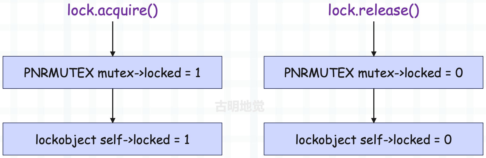

## 楔子

使用多线程和多进程编写应用程序时，需要考虑非原子操作时的竞态条件，因为即使是并发增加整数这样简单的操作也可能导致微妙的、难以重现的 bug。而 asyncio 是单线程的，这是否意味着我们就可以不必考虑竞争条件呢？事实证明，事情并非那么简单。

虽然 asyncio 的单线程特性消除了多线程或多进程应用程序中可能出现的某些并发错误，但并未完全消除，因此 asyncio 也提供了相应的同步原语（synchronization primitives）帮助我们防止单线程并发模型特有的错误。

## 了解单线程并发错误

当处理在不同进程和线程之间共享的数据时，我们不得不考虑竞态条件。这是因为数据被一个线程修改时，也可能被另一个线程读取，从而导致状态不一致，引起数据损坏。这种损坏部分是由于某些操作是非原子性的，这意味着虽然它们看起来像一个操作，但其实它们在后台包含多个独立的操作。就比如整型变量进行自增，首先读取当前值，然后将其递增，最后再重新分配给变量，而这为其它线程和进程提供了足够的机会来获取处于不一致状态的数据。

但在单线程并发模型中，避免了由非原子性操作引起的竞态条件。因为在 asyncio 的单线程模型中，只会有一个线程在给定时间执行 Python 代码，并且遇见非阻塞 IO 之前不会切换。这意味着，即使一个操作是非原子性的，也将始终运行直到完成，而不会让其他协程读取不一致的状态信息。

为证明这一点，我们创建一个计数器，并启动多个任务，同时修改计数器。

~~~Python
import asyncio

counter: int = 0

async def increment():
    global counter
    await asyncio.sleep(0.01)
    counter += 1

async def main():
    global counter
    for _ in range(100):
        tasks = [asyncio.create_task(increment()) for _ in range(100)]
        await asyncio.gather(*tasks)
        assert counter == 100
        # 将 counter 重置为 0，重新开始循环
        counter = 0

asyncio.run(main())
~~~

在代码中创建了一个协程函数，它负责将全局计数器加 1，然后添加 1 毫秒的延迟来模拟慢速操作。在主协程中，创建了 100 个任务来递增计数器，然后通过 gather 并发执行。之后断言计数器可得到期望的值，因为我们运行了 100 个增量任务，所以它应该总是 100。运行这段程序，没有任何报错，所以最终 counter 的值总是 100。这说明虽然递增一个整数是非原子性操作，但对于单线程的 asyncio 来说没有任何影响。而如果运行多个线程而不是协程，应该会看到断言在执行的某个时刻失败。

那么这是否意味着已经通过单线程并发模型找到了一种完全避免竞态条件的方法呢？不幸的是，情况并非如此。虽然避免了单个非原子性操作可能导致的错误竞态条件，但以错误顺序执行的多个操作是可能导致其它问题的。

~~~Python
import asyncio

counter: int = 0

async def increment():
    global counter
    temp_counter = counter
    temp_counter += 1
    await asyncio.sleep(0.01)
    counter = temp_counter

async def main():
    global counter
    for _ in range(100):
        tasks = [asyncio.create_task(increment()) for _ in range(100)]
        await asyncio.gather(*tasks)
        assert counter == 100
        # 将 counter 重置为 0，重新开始循环
        counter = 0

asyncio.run(main())
~~~

协程不是直接递增计数器，而是首先将其读入一个临时变量，然后将临时计数器加 1。通过 await asyncio.sleep 来模拟一个缓慢的操作，暂停协程，然后才将它重新分配回全局计数器变量。运行上述代码，你应该会立即看到执行失败，出现断言错误，并且计数器只会被设置为 1。

每个协程首先读取计数器的值 0，将其存储给临时变量，临时变量自增 1，然后进入休眠状态。因为 temp_counter 是临时变量，所以每个任务里面的 temp_counter 都是 1，然后一旦休眠完成，再将其赋值给 counter。这意味着尽管运行了 100 个协程来增加计数器，但计数器永远只会是 1。注意，如果你删除 await 表达式，那么代码就是正确的，因为内部没有出现非阻塞 IO，每个任务都会一口气执行完，然后再执行下一个任务。

诚然，上面是一个简单化且有些不切实际的例子，为了更好地了解何时会发生这种情况，让我们创建一个稍微复杂一点的竞态条件。

~~~Python
import asyncio

class MockSocket:

    def __init__(self):
        self.socket_closed = False

    async def send(self, msg: str):
        # 模拟向客户端缓慢发送消息
        if self.socket_closed:
            raise Exception("socket 已关闭")
        print(f"准备向客户端发送消息: {msg}")
        await asyncio.sleep(1)
        print(f"成功向客户端发送消息: {msg}")

    def close(self):
        self.socket_closed = True

usernames_to_sockets = {"satori": MockSocket(), "koishi": MockSocket(),
                         "marisa": MockSocket(), "scarlet": MockSocket()}

async def user_disconnect(username: str):
    # 断开用户连接，并将其从应用程序内存中删掉
    print(f"{username} 断开连接")
    socket = usernames_to_sockets.pop(username)
    socket.close()

async def message_all_users():
    # 同时向所有用户发送消息
    print(f"创建消息发送任务")
    messages = [socket.send(f"Hello {username}") for username, socket in usernames_to_sockets.items()]
    await asyncio.gather(*messages)

async def main():
    await asyncio.gather(message_all_users(), user_disconnect("marisa"))

asyncio.run(main())
"""
创建消息发送任务
marisa 断开连接
准备向客户端发送消息: Hello satori
准备向客户端发送消息: Hello koishi
准备向客户端发送消息: Hello scarlet
Traceback (most recent call last):
  ......
    raise Exception("socket 已关闭")
Exception: socket 已关闭
"""
~~~

我们实现了一个向连接的用户发送消息的套接字（MockSocket），每来一个用户就创建一个套接字，并用一个字典保存用户名到对应套接字的映射。当用户断开连接时，运行一个回调 user_disconnect，将用户从字典中删除并关闭套接字。

然后并发运行 message_all_users() 和 user_disconnect("marisa") 两个协程，可以理解为服务端创建了 4 个任务，准备向每个用户发消息。然后 "marisa" 用户断开连接，于是我们关闭给 "marisa" 用户发送消息的套接字，并将其从 usernames_to_sockets 字典中删除。完成后，message_all_users 恢复执行，并开始发送消息，但由于 "marisa" 的套接字已关闭，所以结果会看到一个异常，不会收到我们发送的消息。

这些是你在单线程并发模型中容易看到的错误类型，使用 await 到达一个挂起点，另一个协程运行并修改一些共享状态；当第一个协程通过意外的方式恢复时，就会发生修改冲突。多线程并发性 bug 和单线程并发性 bug 之间的关键区别在于，多线程应用程序中，在修改可变状态的任何地方都有可能出现竞态条件。而单线程并发模型中，只有遇到等待点（await point）才可能出现意料之外的结果。

> 注意：asyncio 属于单线程，严格意义上讲，出现的错误并不能称之为竞态条件。一个变量在被修改到一半时，又被另一个线程读取了，这导致第一个线程所做的修改可能会被覆盖掉，这叫做竞态条件。但 asyncio 中是不存在这种情况的，因为 asyncio 默认是单线程，如果没有遇见 await，那么它会将某个任务一次性全部执行完。
>
> 所以 asyncio 如果出现问题，那么一定是逻辑没有执行完，就通过 await 发生切换了。比如在上述代码的 message_all_users 中创建了 4 个套接字，准备给客户端发消息，但在发送之前发生了切换。而切换之后，在另一个任务中将套接字给关掉了，所以再切回来的时候，发送消息就会失败。
>
> 但这不属于竞态条件，这属于逻辑没按照顺序执行导致的问题。不过和竞态条件类似，都属于并发错误。

既然已经理解了单线程模型中的并发错误类型，那么让我们看看 asyncio 提供的同步原语，除了要学习用法之外，还要看底层是怎么实现的。另外 asyncio 提供的同步原语是针对协程的，threading 模块也提供了针对线程的同步原语，这两者我们都会介绍。

## 锁

什么是锁呢？如果程序中某个部分在并发操作时会出现意想不到的结果（比如操作一个共享的数据结构），那么该部分就需要通过锁保护起来，而被锁保护起来的部分叫做临界区。线程在进入临界区之前必须先获取锁，然后才能操作共享资源。而锁一旦被获取，那么其它线程再尝试获取锁，就会陷入阻塞，直到锁被释放。


通过锁，可以确保同一时刻只能有一个线程操作共享资源，从而很好地解决资源竞争问题。这里的锁指的是互斥锁，也被称为排它锁。而在 Python 里面，锁可以通过 asyncio 和 threading 模块来创建，这两个模块都提供了锁，一个是协程锁，一个是线程锁。

~~~Python
import asyncio
import threading

lock1 = asyncio.Lock()
lock2 = threading.Lock()
~~~

当我们对类 Lock 实例化，便可以得到锁，然后锁有两个常用方法。

- acquire()：获取锁；
- release()：释放锁；

### 协程锁

之前在介绍 Future 和 Task 时说过，Future 对象可以看作是一个容器，它保存了在未来某个时刻才会出现的结果。如果 Future 对象里面还没有结果集，那么它就处于未完成状态，否则处于已完成状态。

~~~Python
import asyncio

future = asyncio.Future()
# 是否完成
print(future.done())  # False
# 因为 future 此时还没有结果集，所以是未完成状态（PENDING）
# 设置结果集
future.set_result("1 + 1")
# 由于设置了结果集，所以变成已完成状态（FINISHED）
print(future.done())  # True
# 获取结果
print(future.result())  # 1 + 1
~~~

问题来了，如何在 future 完成时立刻拿到结果呢？总不能一直调用 done 方法轮询吧。

很简单，我们可以对 future 使用 await 表达式，如果 future 内部还没有结果集，那么 await 会处于阻塞状态，否则不会阻塞，并且还会将值取出来。

~~~python
import asyncio

async def delay(future, seconds):
    await asyncio.sleep(seconds)
    print("给 future 设置结果集")
    future.set_result(666)

async def main():
    # 创建一个 future
    future = asyncio.Future()
    loop = asyncio.get_running_loop()
    # 创建一个任务，扔到事件循环
    loop.create_task(delay(future, 3))
    print("await future 会陷入阻塞，因为它内部还没有结果集")
    # 该表达式会返回 666，因为给 future 设置的结果是 666
    await future
    print(f"3 秒后结束阻塞，因为 delay 协程内部给 future 设置了结果集")

asyncio.run(main())
"""
await future 会陷入阻塞，因为它内部还没有结果集
给 future 设置结果集
3 秒后结束阻塞，因为 delay 协程内部给 future 设置了结果集
"""
~~~

而协程在进入事件循环时会自动创建一个 future，并将协程和 future 组合起来得到任务，而 await 一个任务等价于 await future。当协程没有执行完毕时会处于阻塞，而协程执行完毕时会将返回值设置在 future 中，然后 await 表达式会拿到里面的结果。

在实际编码中，我们一般很少手动创建 Future 对象（future），但 Future 和 asyncio 的实现密切相关，其中就包括了锁。当协程在获取锁时，如果发现锁已被获取，那么如何陷入阻塞呢？当锁被释放时，它又如何解除阻塞呢？答案就是通过 future。

假设协程 1 和协程 2 都要获取锁，它们都会调用锁的 acquire 方法。其中协程 1 先获取到，那么协程 2 就会创建一个 future 并 await。由于 future 内部还没有结果集，因此协程 2 会处于阻塞。当协程 1 释放锁时，会给协程 2 创建的 future 设置一个结果，从而让协程 2 解除阻塞、获取到锁。

我们手动实现一下锁。

~~~Python
import asyncio
from collections import deque

class Lock:

    def __init__(self):
        # 保存创建的 future
        self._waiters = deque()
        # 锁是否已被获取
        self._locked = False

    async def acquire(self):
        # 如果锁没有被获取，那么获取锁
        if not self._locked:
            self._locked = True
            return True
        # 否则说明锁已被获取，创建一个 future
        future = asyncio.Future()
        # 将它放在双端队列里面
        self._waiters.append(future)
        # 此时获取锁的协程就会陷入阻塞，等待其它协程唤醒
        await future
        # 如果解除阻塞，意味着该协程获取到锁了
        self._locked = True
        return True

    def release(self):
        # 释放锁，如果发现锁没被获取，说明对锁进行了二次释放
        if not self._locked:
            raise RuntimeError("锁没有被获取")
        # 将锁的状态改成 False，表示锁被释放了
        self._locked = False
        if len(self._waiters) == 0:
            return
        # 从双端队列 deque 的左侧弹出 future
        # 这个 future 就是某个协程在获取不到锁时创建的
        # 并通过 await future 让自身陷入阻塞状态，等待被唤醒
        future = self._waiters.popleft()
        # 拿到 future 之后，执行 future.set_result()，也就是设置结果集
        # 那么对应的协程就会解除阻塞，从而获取锁
        future.set_result(True)
        # 注意：因为 future 是从右边添加的，所以要从 deque 的左侧弹出
        # 因为先获取锁的协程要优先解除阻塞

    async def __aenter__(self):
        await self.acquire()
        return self

    async def __aexit__(self, exc_type, exc_val, exc_tb):
        self.release()
~~~

整个过程非常简单，就是在获取不到锁时，创建一个 Future 对象并 await，此时就会陷入阻塞。当然获取锁的协程可能有很多，它们创建的 future 会保存在一个双端队列里面。

而拿到锁的协程，在操作完临界区并释放锁时，会从双端队列的左侧弹出一个 future，并为其设置结果集。那么创建该 future 的协程就会解除阻塞，从而获取到锁。

因此这就是 asyncio 锁的实现方式，一点都不神秘。当然 asyncio 内部还做了一些异常检测，以及检测 future 是否已取消等等，我们这里省略了。有兴趣可以看一看 asyncio 内部锁的实现细节，整体逻辑和我们这里基本一致，并且我们这里手动实现的锁在大部分场景下和 asyncio 的锁都是等效的。

然后补充一点，你在使用 asyncio 锁的时候，一定不要以全局变量的形式创建。

```Python
import asyncio

lock = asyncio.Lock()

async def a():
    async with lock:
        print("协程 a 成功获取了锁, 并进入临界区执行操作")
        await asyncio.sleep(2)
    print("协程 a 释放了锁")

async def b():
    async with lock:
        print("协程 b 成功获取了锁, 并进入临界区执行操作")
        await asyncio.sleep(2)
    print("协程 b 释放了锁")

async def main():
    await asyncio.gather(a(), b())

asyncio.run(main())
```

如果这样做，很快会看到崩溃的发生，并报告多个事件循环的错误：RuntimeError: ..... attached to a different loop

这是 asyncio 库的一个令人困惑的地方，而且这种现象也不是锁特有的，asyncio 中的大多数对象在创建时都会提供一个可选的 loop 参数，允许你指定要运行的事件循环。

当未提供此参数时，asyncio 尝试获取当前正在运行的事件循环，如果没有，则创建一个新的事件循环。在上例中，创建锁的同时会创建一个事件循环，因为创建锁时还没有事件循环。然后 asyncio.run(main()) 会创建第二个事件循环，试图使用锁时，这两个独立的事件循环就会混合在一起导致崩溃。

这种行为比较棘手，因此在 Python 3.10 中会移除 loop 参数，这种令人困惑的行为也会消失。但在 3.10 之前，在使用全局 asyncio 变量时需要认真考虑这些情况。

### 线程锁

线程锁可以通过 threading 模块创建。

```python
import threading

lock = threading.Lock()
```

注意：Lock 并不是一个类，而是一个函数，看一下源代码。

```Python
Lock = _allocate_lock
# threading.Lock() 其实就是 _thread.allocate_lock()
_allocate_lock = _thread.allocate_lock
```

调用 _thread.allocate_lock() 时会在内部创建锁，而锁是由 _thread 模块实现的。

```Python
import threading
import _thread

lock = threading.Lock()
print(type(lock))
"""
<class '_thread.lock'>
"""
lock = _thread.allocate_lock()
print(type(lock))
"""
<class '_thread.lock'>
"""
```

所以线程锁其实是一个 _thread.lock 对象。另外再补充一下，Python 有很多的模块是由 C 实现的，因为它们和性能密切相关，编译之后会内嵌在解释器里面，举个例子：

~~~Python
import random, _random
import re, _sre
import ssl, _ssl
import io, _io
import bisect, _bisect
import heapq, _heapq
import asyncio, _asyncio
import threading, _thread
~~~

这些 C 实现的模块，名字前面一般会带有一个下滑线，它们内嵌在解释器里面，你在 Lib 目录下是找不到的。但我们不需要直接使用这些模块，解释器会提供相应的 Python 模块对其进行封装。我们只需要导入 Python 模块即可，在内部会调用具体的 C 实现，比如内置函数 open，它其实就是 io.open，而 io 里面的 open 是从 \_io 导入进来的。

~~~Python
import io
import _io

print(open is io.open is _io.open)  # True
~~~

好了，说了这么多只是想表示线程锁的具体实现不在 threading 里面，而是在 \_thread 里面。\_thread 是一个 C 实现的模块，我们需要到解释器里面才能看到具体实现。在 Modules/\_threadmodule.c 中，有一个结构体实例 Locktype，它便是 \_thread.lock 这个类的底层实现。


\_thread.lock 实例化后会得到锁，锁在底层对应的是 lockobject 结构体。

~~~C
// Modules/_threadmodule.c
typedef struct {
    // 每个对象都具备的头部信息，它包含了对象的引用计数和类型
    PyObject_HEAD
    // PyThread_type_lock 是 void * 的类型别名，所以 lock_lock 是一个 void * 类型的指针
    // 该指针指向了真正的锁，这个锁是底层操作系统提供的
    // 和协程锁不同，由于操作系统感知不到协程，因此协程锁是基于 Future 对象实现的
    // 但线程锁则是基于操作系统实现的，当 Python 代码创建锁、获取锁、解锁时
    // 会通过 lock_lock 指针将这些操作转发到具体的锁实现上
    PyThread_type_lock lock_lock;
    // 用于创建弱引用，这里不用关注
    PyObject *in_weakreflist;
    // 用于标记锁状态，把它当成 Python 的布尔值即可
    // 值为 1 表示锁已被获取（已锁定），0 表示未被获取（未锁定）。
    char locked;
} lockobject;

// Include/pythread.h
typedef void *PyThread_type_lock;
~~~

结构体应该很好理解，然后来看一下锁的具体方法，那么方法都定义在哪呢？前面说过，实例对象有哪些行为，取决于类型对象定义了哪些操作。因此锁的操作都定义在 Locktype 里面，由内部的 tp_methods 字段负责维护。

而该字段被赋值为 lock_methods，所以锁的方法都在 lock_methods 数组中。


以上就是锁能够使用的方法，我们来验证一下。

~~~python
import threading

lock = threading.Lock()

# acquire_lock 和 acquire 基本是等价的
# release_lock 和 release 也基本是等价的
# 不过我们一般都会使用 acquire 和 lock
lock.acquire_lock()  # 获取锁
lock.release_lock()  # 释放锁

lock.acquire()  # 获取锁
lock.release()  # 释放锁

# 同理 locked_lock 和 locked 也是等价的
# 表示锁是否被获取（已锁定），不过我们一般使用 locked
print(lock.locked_lock())  # False
print(lock.locked())  # False
lock.acquire()
print(lock.locked_lock())  # True
print(lock.locked())  # True
lock.release()

# 还提供了上下文管理，等价于 lock.acquire + lock.release
with lock:
    pass
~~~

好，接下来我们看看 acquire 方法，也就是锁是怎么获取的。

~~~c
static PyObject *
lock_PyThread_acquire_lock(lockobject *self, PyObject *args, PyObject *kwds)
{
    _PyTime_t timeout;  // 超时时间
    // 一个枚举，表示锁状态，有三个可选值
    // PY_LOCK_FAILURE：表示因为锁已被持有，而获取失败
    // PY_LOCK_ACQUIRED：表示锁可用，并成功获取锁
    // PY_LOCK_INTR：表示获取锁的操作被中断，比如抵达超时时间
    PyLockStatus r;
    // 参数解析，该方法接收一个 timeout 参数
    if (lock_acquire_parse_args(args, kwds, &timeout) < 0)
        return NULL;
    // 获取锁，并指定一个超时时间，不传则表示没有超时时间
    // 那么在获取不到锁时，会无限等待
    r = acquire_timed(self->lock_lock, timeout);
    // 如果返回的状态为 PY_LOCK_INTR，说明达到超时时间
    // 因此获取锁的操作被中断，并且会抛出异常
    if (r == PY_LOCK_INTR) {
        return NULL;
    }
    // 如果返回的状态为 PY_LOCK_ACQUIRED，表示锁获取成功
    // 将锁的 locked 字段设置为 1，表示锁已被获取
    if (r == PY_LOCK_ACQUIRED)
        self->locked = 1;
    // 如果以上两种状态都不是，那么说明获取失败了
    // 将 r == PY_LOCK_ACQUIRED 转成布尔值返回
    // 获取成功返回 True，获取失败返回 False
    return PyBool_FromLong(r == PY_LOCK_ACQUIRED);
}
~~~

整个过程仍然很简单，因此我们看到协程锁和线程锁的实现是类似的，它们都有一个 locked 字段用于表示锁是否已被获取。

只不过协程锁是基于 Future 对象实现的，当 await future 陷入阻塞时，表示锁已被其它协程获取。当解除阻塞时，代表锁被释放了，自己获取到锁。而线程锁是基于操作系统实现的，它本质上是对操作系统提供的锁做了一个封装。Python 线程在获取锁时，底层会获取操作系统的锁。

那么操作系统的锁是怎么获取的呢？在源码中使用的是 acquire_time 函数，它接收一个指针和一个超时时间。该指针便是 lockobject 的 lock_lock 字段，类型是 void \*，它指向了操作系统提供的锁实现。


acquire_time 函数做了一些参数处理后，又调用了 PyThread_acquire_lock_timed  函数，显然获取锁的逻辑位于该函数里面。PyThread_acquire_lock_timed 函数在不同平台有着不同的实现，因为不同操作系统的锁实现是不是一样的，所以源码中使用 void \*。


我们以 Windows 系统为例：

~~~C
// Python/thread_nt.h

// 虽然不同系统的函数实现不一样，但参数是一致的
/* aLock：void * 指针，指向操作系统提供的锁；
 * microseconds：等待锁的时间，以微妙为单位。如果值是负数，表示无限等待，直到获取锁；
 * intr_flag：如果设置为 1，那么当等待过程中出现了信号中断时，函数会提前返回；*/
PyLockStatus
PyThread_acquire_lock_timed(PyThread_type_lock aLock,
                            PY_TIMEOUT_T microseconds, int intr_flag)
{
    PyLockStatus success;
    PY_TIMEOUT_T milliseconds;
    // 如果 microseconds >= 0，将微妙转成毫秒
    if (microseconds >= 0) {
        milliseconds = microseconds / 1000;
        if (microseconds % 1000 > 0)
            ++milliseconds;
        if (milliseconds > PY_DWORD_MAX) {
            Py_FatalError("Timeout larger than PY_TIMEOUT_MAX");
        }
    }
    // 否则无限等待
    else {
        milliseconds = INFINITE;
    }

    dprintf(("%lu: PyThread_acquire_lock_timed(%p, %lld) called\n",
             PyThread_get_thread_ident(), aLock, microseconds));
    // 调用 EnterNonRecursiveMutex 获取锁
    if (aLock && EnterNonRecursiveMutex((PNRMUTEX)aLock,
                                        (DWORD)milliseconds) == WAIT_OBJECT_0) {
        success = PY_LOCK_ACQUIRED;
    }
    else {
        success = PY_LOCK_FAILURE;
    }

    dprintf(("%lu: PyThread_acquire_lock(%p, %lld) -> %d\n",
             PyThread_get_thread_ident(), aLock, microseconds, success));

    return success;
}
~~~

源码中又调用了 EnterNonRecursiveMutex 函数，该函数是真正获取锁的逻辑，参数 aLock 指向了操作系统的互斥锁。前面说过，不同系统有着不同的锁实现，所以具体使用时需要转换，在 Windows 系统上，它被转成了 PNRMUTEX。

~~~C
// Python/thread_nt.h
typedef struct _NRMUTEX
{   
    // 对操作系统互斥锁的封装
    PyMUTEX_T cs;
    // 对条件变量的封装，用于线程间的同步
    // 允许线程在条件不满足时等待，条件满足时由其它线程通知等待的线程
    // 条件变量一般和互斥锁一起使用，避免竞争条件和死锁
    PyCOND_T cv;
    // 标记互斥锁是否已被获取，1 表示已被获取，0 表示未被获取
    int locked;
} NRMUTEX;
typedef NRMUTEX *PNRMUTEX;
~~~

所以 lockobject 的 lock_lock 指针指向的其实依旧不是 OS 互斥锁，而是一个结构体实例，结构体内部的 cs 字段封装的才是 OS 互斥锁。


lockobject 是线程锁，也就是 Python 代码中使用的锁的底层实现，而 NRMUTEX 则是封装了操作系统提供的互斥锁。注意这里面的两个 locked，它们都用于标记锁是否已被获取。

最后来看看 EnterNonRecursiveMutex 函数的具体逻辑。

~~~C
// Python/thread_nt.h
DWORD
EnterNonRecursiveMutex(PNRMUTEX mutex, DWORD milliseconds)
{
    DWORD result = WAIT_OBJECT_0;
    // 对 OS 互斥锁进行锁定，用于保护共享数据，如果锁定失败直接返回
    if (PyMUTEX_LOCK(&mutex->cs))
        return WAIT_FAILED;
    // 如果锁定成功，那么将 locked 字段设置为 1，表示互斥锁被获取
    // 但如果发现 locked 已经为 1 了，则说明已有别的线程将 locked 修改为 1
    // 那么当前线程就要等待，直到 locked 不为 1（锁被释放）
    if (milliseconds == INFINITE) {
        // 无限等待
        while (mutex->locked) {
            if (PyCOND_WAIT(&mutex->cv, &mutex->cs)) {
                result = WAIT_FAILED;
                break;
            }
        }
    } else if (milliseconds != 0) {
        // 有时间限制的等待
        ULONGLONG now, target = GetTickCount64() + milliseconds;
        while (mutex->locked) {
            if (PyCOND_TIMEDWAIT(&mutex->cv, &mutex->cs, (long long)milliseconds*1000) < 0) {
                result = WAIT_FAILED;
                break;
            }
            now = GetTickCount64();
            if (target <= now)
                break;
            milliseconds = (DWORD)(target-now);
        }
    }
    // 在被唤醒之后，说明当前线程获取互斥锁成功，于是将 locked 改成 1
    if (!mutex->locked) {
        mutex->locked = 1;
        result = WAIT_OBJECT_0;
    } else if (result == WAIT_OBJECT_0)
        result = WAIT_TIMEOUT;
    // 这里必须将操作系统的锁释放掉，因为对于外界的线程而言
    // 锁是否被获取（锁定），取决于 locked 字段是否为 1
    PyMUTEX_UNLOCK(&mutex->cs);
    return result;
}
~~~

代码逻辑有一些让人疑惑的地方，下面解释一下。Python 里面调用 lock.acquire() 方法时，表示要获取线程锁，但获取线程锁之前，要先获取 OS 互斥锁，如果获取不到，那么压根不允许进入临界区。

但解释器在互斥锁的基础上又封装了一层，如果获取到了互斥锁，还要将 locked 字段修改为 1。因为从代码逻辑上讲，无论是线程锁还是互斥锁，只有当它们内部的 locked 字段为 1 时，才算是获取了锁。所以将互斥锁的 locked 字段修改为 1 之后，后续还要将线程锁的 locked 字段修改为 1，这样才算是获取了线程锁。

到这里估计可能有人会产生一个疑问，为啥函数在一开始要获取系统的互斥锁，最后又释放掉，这岂不是多此一举？

~~~C
    if (PyMUTEX_LOCK(&mutex->cs))
        return WAIT_FAILED;
    //...
    PyMUTEX_UNLOCK(&mutex->cs);
~~~

直接检测 locked 字段是否等于 1 不就行了吗？其实原因有三个：

- 保护共享状态：操作系统的互斥锁 `mutex-> cs` 用于保护共享状态 `mutex -> locked` 的读写，在多线程环境中，任何对共享状态的访问都要同步，以防止竞态条件；
- 条件变量的同步：在使用条件变量 `mutex -> cv` 时，通常需要结合互斥锁使用，条件变量的等待和通知需要在互斥锁的保护下进行，以保证操作的原子性；
- 避免忙等待：如果只使用 `mutex -> locked` 进行检查，可能会陷入忙等待，即不断地检查锁状态而占用 CPU 资源。使用互斥锁和条件变量可以让线程在等待时被挂起，从而更有效地利用 CPU；

所以解释器为 OS 互斥锁引入了一个自定义的锁状态 locked，OS 互斥锁提供了对 locked 的基本保护，因为多个线程都要修改它。而自定义的锁状态 locked 则用于实现同步逻辑，如果 locked 为 1，我们就认为锁被获取了，locked 为 0，锁就没有被获取。

协程锁和线程锁都是如此，所谓的获取锁、释放锁都是在修改 locked 字段的值。只不过在等待的时候，协程锁使用的是 Future 对象，而线程锁使用的是操作系统提供的互斥锁和条件变量。

所以上面代码中的 PyMUTEX_LOCK 通过之后，还要检测 locked 字段是否等于 1，代码片段如下。

```c
        while (mutex->locked) {
            if (PyCOND_WAIT(&mutex->cv, &mutex->cs)) {
                result = WAIT_FAILED;
                break;
            }
        //...
```

如果 locked 是 1，说明互斥锁已经被获取了，当前线程要进行等待，直到 locked 字段的值为 0。当其它线程释放锁时，会将 locked 字段修改为 0，并通过条件变量唤醒当前线程。该线程醒来后检测到 locked 为 0，就知道互斥锁已被释放，自己可以获取了，于是再将 locked 字段修改为 1。

说完了线程锁的获取，再来看看线程锁的释放，所谓释放，其实就是将 locked 字段修改为 0 而已。

~~~C
// Python/_threadmodule.c
static PyObject *
lock_PyThread_release_lock(lockobject *self, PyObject *Py_UNUSED(ignored))
{
    /* Sanity check: the lock must be locked */
    if (!self->locked) {
        PyErr_SetString(ThreadError, "release unlocked lock");
        return NULL;
    }
    // 释放互斥锁，在内部会将 locked 字段设置为 0
    PyThread_release_lock(self->lock_lock);
    self->locked = 0;  // 将 locked 字段设置为 0，释放线程锁
    Py_RETURN_NONE;
}
~~~

释放互斥锁的逻辑最终会调用如下函数：

~~~C
// Python/thread_nt.h
BOOL
LeaveNonRecursiveMutex(PNRMUTEX mutex)
{
    BOOL result;
    if (PyMUTEX_LOCK(&mutex->cs))
        return FALSE;
    // 将 locked 设置为 0
    mutex->locked = 0;
    /* condvar APIs return 0 on success. We need to return TRUE on success. */
    result = !PyCOND_SIGNAL(&mutex->cv);
    PyMUTEX_UNLOCK(&mutex->cs);
    return result;
}
~~~

修改 locked 是不安全的，需要加锁保护。所以 OS 互斥锁就是为了保护 locked 变量的修改，再配合条件变量实现阻塞等待以及自动唤醒，但从代码逻辑上讲，将 locked 字段设置为 0，才算是真正释放了锁。

这部分逻辑稍微有点绕，总之记住一个重点：所谓的锁，它的核心就是结构体的一个字段，这里是 locked。如果字段的值为 1，表示锁被获取了，字段的值为 0，表示锁没有被获取。

- 而获取锁，本质上就是将 locked 字段修改为 1；
- 而释放锁，本质上就是将 locked 字段修改为 0；

当锁没有被获取时，那么线程在获取锁和释放锁时的逻辑可以简化为如下：



但实际情况会有多个线程一起竞争锁，因此为了保护这个共享字段，以及实现阻塞等待和自动唤醒，解释器使用了操作系统的互斥锁和条件变量。

## 信号量

说完了锁，再来说说信号量。锁负责保证同一时刻只能有一个协程去操作临界区，而信号量在创建时会接收一个初始值 value，可以保证同一时刻最多有 value 个协程去操作临界区。

因此可以把锁看成是初始值 value 等于 1 的信号量，它在源码中的实现和锁基本是类似的，我们也手动实现一下（这里只看协程信号量）。

~~~Python
import asyncio
from collections import deque

class Semaphore:

    def __init__(self, value=1):
        self._waiters = deque()
        # 可以把 self._value 看成是令牌的数量
        # 每当一个协程进入临界区，令牌数减 1，离开临界区，令牌数加 1
        # 如果 self._value 小于等于 0，说明令牌用光了，此时就不允许进入临界区
        self._value = value

    @property
    def locked(self):
        return self._value <= 0

    async def acquire(self):
        # 如果 self._value > 0，说明可以进入临界区
        if not self.locked:
            self._value -= 1  # self._value 要减 1
            return True
        # 如果 self._value <= 0，说明此时不能进去临界区，必须等待某个协程从临界区出来
        # 那么和锁一样，也是创建一个 future 并放在双端队列里面
        future = asyncio.Future()
        self._waiters.append(future)
        # 此时获取信号量的协程会陷入阻塞
        await future
        # 解除阻塞，意味着该协程获取到信号量了
        self._value -= 1
        return True

    def release(self):
        # 释放信号量，说白了就是将 self._value 加 1
        self._value += 1
        if len(self._waiters) == 0:
            return
        future = self._waiters.popleft()
        future.set_result(True)

    async def __aenter__(self):
        await self.acquire()
        return self

    async def __aexit__(self, exc_type, exc_val, exc_tb):
        self.release()
~~~

信号量和锁的实现方式是一样的，锁可以看成是 value 为 1 的信号量。当协程进入临界区，value 的值会减少 1，离开临界区 value 的值会增加 1。如果 value 为 0，那么后续协程就不允许进入临界区了，必须等到某个协程从临界区出来。

说到这，再来补充一个有界信号量，因为信号量有一个问题。

~~~Python
import asyncio
from asyncio import Semaphore
import time

async def bar(sem: Semaphore):
    async with sem:
        await asyncio.sleep(3)

async def main():
    # 每次允许两个协程进入临界区
    sem = Semaphore(2)
    # 创建 4 个任务
    task = [asyncio.create_task(bar(sem)) for _ in range(4)]
    # 直接对 sem 执行 release
    sem.release()
    sem.release()
    await asyncio.gather(*task)

start = time.perf_counter()
asyncio.run(main())
end = time.perf_counter()
print(f"总耗时: {end - start}")
"""
总耗时: 3.003426834
"""
~~~

创建了 4 个任务，每次只允许两个协程进入临界区，因此总耗时应该是 6 秒才对。但问题是我们创建完信号量之后，调用了两次 release 方法，将内部的 value 值增加了 2，此时信号量就变成了同时允许 4 个协程进入临界区。

因此和锁不一样，锁一旦被释放，就不能再二次释放。而信号量被释放，其实就是将内部的 value 加 1，并且不会对内部的 value 进行检测。

~~~Python
import asyncio
from asyncio import Semaphore

async def main():
    sem = Semaphore(2)
    print(f"before value: {sem._value}")
    for _ in range(100):
        sem.release()
    print(f"after value: {sem._value}")

asyncio.run(main())
"""
before value: 2
after value: 102
"""
~~~

不过这个问题基本很少发生，当然也可以使用 async with 语句，这样获取和释放一定是成对出现的。而有界信号量在信号量的基础上做了一层检测，如果在 release 的时候发现 value 已经达到了初始值，那么会报错。


有界信号量会将初始值 value 单独保存起来，如果释放时发现 value 大于等于初始值，那么报错。但是注意：有界信号量依旧可以多次 release，不过我们基本不会这么干，因为获取和释放应该是成对出现的。

## 队列

队列是一种特殊的线性表，具有先进先出（FIFO）的特性，这意味着元素的入队顺序和出队顺序是一致的。


而 Python 也提供了队列，分别是协程队列和线程队列。

~~~python
import asyncio
import queue

# 协程队列
coroutine_queue = asyncio.Queue()
# 线程队列
threading_queue = queue.Queue()
~~~

如果你的程序基于 asyncio，那么应该使用协程队列，如果你的程序采用了多线程，那么应该使用线程队列。

### 协程队列

协程队列的具体实现由 asyncio 提供，以下是它的基本用法。

```Python
import asyncio

async def main():
    # 创建队列时可以指定能够存储的最大元素个数
    # 不指定则没有容量限制
    queue = asyncio.Queue(maxsize=20)
    # 返回容量
    print(queue.maxsize)  # 20

    # 添加元素，如果队列满了会阻塞，直到有剩余空间
    await queue.put(111)
    # 添加元素，如果队列满了会抛异常
    # 因为不需要阻塞等待，所以 put_nowait 不是协程函数
    queue.put_nowait(222)
    # 队列是否已满
    print(queue.full())  # False

    # 返回队列内部的元素个数
    print(queue.qsize())  # 2

    # 从队列中获取元素，如果队列为空，会阻塞，直到队列中有可用元素
    print(await queue.get())  # 111

    # 从队列中获取元素，如果队列为空，会抛异常
    # 因为不需要阻塞等待，所以 put_nowait 不是协程函数
    print(queue.get_nowait())  # 222

    # 队列是否为空
    print(queue.empty())  # True

asyncio.run(main())
```

所以协程队列的 API 很简单，我们再罗列一下：

+ <font color="blue">queue = asyncio.Queue()</font>，创建一个队列。
+ <font color="blue">queue.maxsize</font>，返回队列的容量。
+ <font color="blue">queue.qsize()</font>，返回队列中的元素个数。
+ <font color="blue">queue.full()</font>，队列是否已满。
+ <font color="blue">queue.empty()</font>，队列是否为空。
+ <font color="blue">await queue.put(item)</font>，往队列中添加元素，队列满了会阻塞。
+ <font color="blue">queue.put_nowait(item)</font>，往队列中添加元素，队列满了会抛异常。
+ <font color="blue">await queue.get()</font>，从队列中取出元素，队列为空会阻塞。
+ <font color="blue">queue.get_nowait()</font>，从队列中取出元素，队列为空会抛异常。

然后协程队列还有两个 API，需要单独说明，分别是 task_done() 和 join()。

首先在协程队列内部有一个 \_unfinished_tasks 属性，初始值为 0，每当往队列添加一个元素时，该属性的值就会自增 1。但是从队列取出元素时，该属性不会自动减 1，需要手动调用 task_done() 方法。所以 \_unfinished_tasks 记录了队列中有多少个任务数据需要处理，每来一个自动加 1，但取走一个不会自动减 1，而是需要 task_done 来实现。

然后 join() 的作用是，当 \_unfinished_tasks 不为 0 的时候，await queue.join() 会阻塞，直到为 0。

~~~python
import asyncio

async def consumer(queue, n):
    print(f"consumer{n} 开始消费")
    await asyncio.sleep(3)
    await queue.get()
    # 获取数据后，调用 task_done
    queue.task_done()
    print(f"consumer{n} 消费完毕")

async def main():
    queue = asyncio.Queue()
    await queue.put(123)
    await queue.put(456)
    await queue.put(789)
    # 队列里面有三个数据，开启三个消费者去消费
    await asyncio.gather(
        consumer(queue, 1),
        consumer(queue, 2),
        consumer(queue, 3),
    )
    # 这里会陷入阻塞，直到 _unfinished_tasks 变为 0
    await queue.join()
    print("main 解除阻塞")


asyncio.run(main())
"""
consumer1 开始消费
consumer2 开始消费
consumer3 开始消费
consumer1 消费完毕
consumer2 消费完毕
consumer3 消费完毕
main 解除阻塞
"""
~~~

还是比较简单的，然后我们来看一下协程队列的具体实现细节。


协程队列内部有一个 \_queue 属性，它是一个双端队列，负责保存具体的元素。因为要保证两端的操作都是高效的，所以采用双端队列实现。

然后是 \_getters 和 \_putters 两个属性，它们是做什么的呢？首先在队列满了的时候，协程往队列添加元素时会陷入阻塞，等到队列有剩余空间时会解除阻塞。同理，在队列为空时，协程从队列获取元素时会陷入阻塞，等到队列有可用元素时会解除阻塞。那么这个阻塞等待，以及自动唤醒并解除阻塞是怎么实现的呢？在介绍锁和信号量的时候，我们分析过整个实现过程，协程队列与之类似。

假设协程从队列获取元素，但是队列为空，于是会创建一个 Future 对象，并保存起来，而保存的地方就是 \_getters，它也是双端队列。然后 await future 会陷入阻塞，当其它协程往队列中添加元素时，会将 \_getters 里面的 future 弹出，设置结果集，此时 await future 的协程就会解除阻塞，因为队列有可用元素了。

同理，协程往队列添加元素也是如此，如果队列满了，同样创建一个 Future 对象，并保存起来，而保存的地方就是 \_putters。然后 await future，陷入阻塞，当其它协程从队列中取出元素，会将 \_putters 里面的 future 弹出，设置结果集。因此 await future 的协程就会解除阻塞，因为队列有可用空间了。


三个内部调用的方法，\_get 方法负责从队列的头部弹出元素，\_put 方法负责从队列的尾部追加元素，比较简单。然后是 \_wakeup_next 方法，它负责唤醒阻塞的协程。参数 waiters 要么是 \_getters，要么是 \_putters，从里面弹出一个 future，设置结果集，让对应的协程解除阻塞。


以上几个方法都比较简单，接下来重点来了，我们看看元素是怎么放入和获取的。

~~~Python
    def put_nowait(self, item):
        """Put an item into the queue without blocking.

        If no free slot is immediately available, raise QueueFull.
        """
        if self.full():
            raise QueueFull
        self._put(item)
        self._unfinished_tasks += 1
        self._finished.clear()
        self._wakeup_next(self._getters)
        
    def get_nowait(self):
        """Remove and return an item from the queue.

        Return an item if one is immediately available, else raise QueueEmpty.
        """
        if self.empty():
            raise QueueEmpty
        item = self._get()
        self._wakeup_next(self._putters)
        return item        
~~~

put_nowait 负责往队列添加元素，如果添加时发现队列已满，那么抛出异常。如果未满，则调用 \_put 方法往 \_queue 里面添加元素，因为元素的实际存储是由 self.\_queue 这个双端队列负责的。添加完毕后，将 \_unfinished_task 加 1。最后从 \_getters 里面弹出 future，设置结果集，让因获取不到元素而陷入阻塞的协程解除阻塞（同时会将添加的元素取走）。

get_nowait 的逻辑也很简单，如果队列为空，直接抛异常。如果不为空，则调用 _get 方法从队列中弹出元素。最后从 _putters 里面弹出 future，设置结果集，让因队列已满、无法添加元素而陷入阻塞的协程解除阻塞（同时会将元素添加进队列）。

无论是 put_nowait 还是 get_nowait，在调用时都不会阻塞，因此队列还提供了阻塞的 put 和 get 方法。

~~~Python
    async def put(self, item):
        while self.full():  # 如果队列已满
            putter = self._get_loop().create_future()  # 创建一个 future
            self._putters.append(putter)  # 添加到 self._putters 中
            try:
                # await 陷入阻塞，直到别的协程从队列中取走元素
                # 然后弹出该 future 并设置结果集
                await putter
            except:
                putter.cancel()  # Just in case putter is not done yet.
                try:
                    # Clean self._putters from canceled putters.
                    self._putters.remove(putter)
                except ValueError:
                    # The putter could be removed from self._putters by a
                    # previous get_nowait call.
                    pass
                if not self.full() and not putter.cancelled():
                    # We were woken up by get_nowait(), but can't take
                    # the call.  Wake up the next in line.
                    self._wakeup_next(self._putters)
                raise
        # 说明队列有可用空间了，直接调用 put_nowait 方法
        return self.put_nowait(item)


    async def get(self):
        while self.empty():  # 如果队列为空
            getter = self._get_loop().create_future()  # 创建一个 future
            self._getters.append(getter)  # 添加到 self,_getters 中
            try:
                # await 陷入阻塞，直到别的协程往队列中添加元素
                # 然后弹出该 future 并设置结果集
                await getter
            except:
                getter.cancel()  # Just in case getter is not done yet.
                try:
                    # Clean self._getters from canceled getters.
                    self._getters.remove(getter)
                except ValueError:
                    # The getter could be removed from self._getters by a
                    # previous put_nowait call.
                    pass
                if not self.empty() and not getter.cancelled():
                    # We were woken up by put_nowait(), but can't take
                    # the call.  Wake up the next in line.
                    self._wakeup_next(self._getters)
                raise
        # 说明队列有可用元素了，直接调用 get_nowait 方法                
        return self.get_nowait()
~~~

比较简单，还是没什么难度的，最后再来看看 task_done 和 join 两个方法。

~~~Python
    def task_done(self):
        if self._unfinished_tasks <= 0:
            raise ValueError('task_done() called too many times')
        self._unfinished_tasks -= 1
        if self._unfinished_tasks == 0:
            self._finished.set()
            
    async def join(self):
        if self._unfinished_tasks > 0:
            await self._finished.wait()            
~~~

协程队列里面使用了 asyncio.Event，它表示事件，我们稍后说。如果事件对象没有调用 set 方法设置标志位，那么调用 wait 方法时会陷入阻塞。当事件对象调用 set 方法时，wait 会解除阻塞。所以协程队列的 join 方法的逻辑就是，当 _unfinished_tasks 大于 0 时，调用事件对象的 wait 方法陷入阻塞。

而 task_done 方法的作用就是将 \_unfinished_tasks 减 1，当它的值属性为 0 时，调用事件对象的 set 方法，让 join 解除阻塞。

以上就是整个协程队列的实现细节，具体的元素存储是由 collections.deque 来承载的。并在队列已满或者为空时，通过 Future 对象来实现阻塞等待和自动唤醒。

另外除了先进先出队列之外，还有先进后出队列，一般称为 LIFO 队列，它的效果类似于栈。

~~~Python
class LifoQueue(Queue):

    def _init(self, maxsize):
        self._queue = []

    def _put(self, item):
        self._queue.append(item)

    def _get(self):
        return self._queue.pop()
~~~

这个没什么好说的，因为是先进后出，所以添加和弹出都在同一端，直接使用列表实现即可。并且由于 LifoQueue 继承 Queue，所以它的 API 和普通的协程队列是一样的。

除了先进先出队列，还有一个优先队列。

~~~Python
class PriorityQueue(Queue):

    def _init(self, maxsize):
        self._queue = []

    def _put(self, item, heappush=heapq.heappush):
        heappush(self._queue, item)

    def _get(self, heappop=heapq.heappop):
        return heappop(self._queue)
~~~

它的 API 和普通的协程队列也是一致的，只不过优先队列在添加元素时，需要指定一个优先级：<font color="blue">(优先级, 元素)</font>，优先级的值越低，表示优先级越高。然后在内部，会按照优先级的高低，维护一个小根堆，堆顶元素便是优先级最高的元素。

这几个队列具体使用哪一种，则取决于具体的业务场景。

### 线程队列

说完了协程队列，再来看看线程队列，它们的 API 是类似的，但实现细节则不同。因为操作系统感知不到协程，所以协程队列的阻塞等待是基于 Future 实现的，而线程队列的阻塞等待是基于条件变量（和互斥锁）实现的。

还是先来看看线程队列的一些 API，和协程队列是类似的。

~~~Python
from queue import Queue

# 可以指定一个 maxsize 参数，表示队列的容量
# 默认为 0，表示队列的容量无限
queue = Queue(maxsize=20)

# 查看容量
print(queue.maxsize)  # 20

# 查看队列的元素个数
print(queue.qsize())  # 0

# 判断队列是否已满
print(queue.full())  # False

# 判断队列是否为空
print(queue.empty())  # True

# 往队列中添加元素，block 参数表示是否阻塞，默认为 True，当队列已满时，线程会阻塞
# timeout 表示超时时间，默认为 None，表示会无限等待
# 当然也可以给 timeout 传一个具体的值，如果在规定时间内，没有将元素放入队列，那么抛异常
queue.put(123, block=True, timeout=None)
# 也是往队列中添加元素，但是当队列已满时，会直接抛异常
# put_nowait(item) 本质上就是 put(item, block=False)
queue.put_nowait(456)

# 从队列中取出元素，同样可以传递 block 和 timeout 参数
# block 默认为 True，当队列为空时会陷入阻塞，timeout 默认为 None，表示会无限等待
print(queue.get(block=True, timeout=None))  # 123

# 也是从队列中取出元素，但是当队列为空时，会直接抛异常
# get_nowait() 本质上就是 get(block=False)
print(queue.get_nowait())  # 456

print(queue.unfinished_tasks)  # 2

# task_done()，将 unfinished_tasks 属性的值减 1
queue.task_done()
queue.task_done()
print(queue.unfinished_tasks)  # 0

# join()，当 unfinished_tasks 不为 0 时，陷入阻塞
queue.join()
~~~

线程队列的具体使用我们已经知道了，下面来看看它的具体实现。

~~~python
class Queue:

    def __init__(self, maxsize=0):
        self.maxsize = maxsize
        self._init(maxsize)

        # 互斥锁，当队列发生变化时，必须持有互斥锁
        # 所有需要获取互斥锁的方法在返回前都必须释放它
        self.mutex = threading.Lock()
        # 互斥锁在以下三种条件变量（threading.Condition 对象）之间共享
        # 因此获取和释放这些条件变量也相当于获取和释放互斥锁
        
        # 往队列中添加元素时，要通知条件变量 not_empty
        # 这样等待获取元素的线程就会被通知到，从而解除阻塞
        self.not_empty = threading.Condition(self.mutex)

        # 从队列中弹出元素时，要通知条件变量 not_full
        # 这样等待添加元素的线程就会被通知到，从而解除阻塞
        self.not_full = threading.Condition(self.mutex)

        # 当 unfinished_task 属性的值为 0 时，要通知条件变量 all_tasks_done
        # 这样执行 join 方法的线程就会被通知到，从而解除阻塞
        self.all_tasks_done = threading.Condition(self.mutex)
        self.unfinished_tasks = 0

    def _init(self, maxsize):
        self.queue = deque()        
~~~

线程队列的内部依旧使用双端队列进行元素存储，并且还使用了一个互斥锁和三个条件变量。

为了保证数据的一致性和线程安全，当队列在多线程环境中被修改（比如添加或删除元素）时，需要使用互斥锁。任何需要修改队列的操作都必须在获取到互斥锁之后进行，以防止多个线程同时对队列进行修改，否则会导致数据不一致或其它错误。同时，一旦对队列的修改完成，必须立即释放互斥锁，以便其它线程可以访问队列。

然后是 not_empty 条件变量，当一个新元素被添加到队列时，应该向 not_empty 发送一个信号。这个动作会通知那些想从队列中获取元素，但因队列为空而陷入阻塞的线程，现在队列中已经有了新的元素，它们可以继续执行获取元素的操作。

接下来是 not_full 条件变量，当从队列中取走一个元素时，应该向 not_full 发送一个信号。这个动作通知那些想往队列添加元素，但因队列已满而陷入阻塞的线程，现在队列中已经有了可用空间，它们可以继续执行添加元素的操作。

最后是 all_tasks_done 条件变量，当处理的任务全部完成，即计数器 unfinished_task 为 0 时，应该向 all_tasks_done 发送一个信号。这个动作会通知那些执行了 join() 方法而陷入阻塞的线程，它们可以继续往下执行了。

~~~Python
    def qsize(self):
        with self.mutex:
            return self._qsize()

    def empty(self):
        with self.mutex:
            return not self._qsize()

    def full(self):
        with self.mutex:
            return 0 < self.maxsize <= self._qsize()
          
    def _qsize(self):
        return len(self.queue)          
~~~

因为线程队列采用了双端队列存储元素，所以双端队列的长度就是线程队列的元素个数。如果元素个数为 0，那么队列就是空；如果容量大于 0，并且小于等于元素个数，那么队列就满了。此外我们看到在执行这些操作时，必须要在互斥锁的保护下进行。

~~~Python
    def put_nowait(self, item):
        return self.put(item, block=False)

    def get_nowait(self):
        return self.get(block=False)
~~~

前面说了，put_nowait 和 get_nowait 本质上就是调用了 put 和 get，所以我们的重点是 put 和 get 两个方法。

~~~Python
    def _put(self, item):
        self.queue.append(item)
      
    def put(self, item, block=True, timeout=None):
        # 条件变量支持 with 语句，在内部会自动获取锁
        with self.not_full:
            # 如果指定了具体的容量，并且设置了非阻塞，以及元素个数达到了指定的容量
            # 那么直接抛异常
            if self.maxsize > 0:
                if not block:
                    if self._qsize() >= self.maxsize:
                        raise Full
                # 否则说明 block 为 True，如果元素个数达到了指定的容量
                # 那么调用条件变量的 wait 方法进行等待，直到队列有可用空间
                elif timeout is None:
                    while self._qsize() >= self.maxsize:
                        self.not_full.wait()
                # 超时时间必须大于等于 0
                elif timeout < 0:
                    raise ValueError("'timeout' must be a non-negative number")
                else:  # 否则说明 block 为 True，并且也指定了具体的超时时间
                    endtime = time() + timeout
                    # 如果规定时间内，元素还没有放入到队列中，那么抛出异常，表示队列已满
                    while self._qsize() >= self.maxsize:
                        remaining = endtime - time()
                        if remaining <= 0.0:
                            raise Full
                        self.not_full.wait(remaining)
            # 到此，说明队列有可用空间，那么将元素添加进去
            self._put(item)
            # unfinished_tasks 属性的值加 1
            self.unfinished_tasks += 1
            # 给条件变量 not_empty 发一个信号，表示队列有元素了
            # 那些因获取不到条件变量而陷入阻塞的线程可以解除阻塞了
            self.not_empty.notify()      
~~~

以上就是 put 方法的底层实现，不难理解。说完了 put，再来看看 get。

~~~Python
    def _get(self):
        return self.queue.popleft()
    
    def get(self, block=True, timeout=None):
        with self.not_empty:
            if not block:  # 如果 block 为 False，并且队列为空，那么抛异常
                if not self._qsize():
                    raise Empty
            elif timeout is None:  # 说明 block 为 True，并且没有超时时间
                # 当队列为空时，调用条件变量的 wait 方法进入等待
                # 那么问题来了，什么时候解除阻塞呢
                while not self._qsize():
                    # 还记得 put 方法里面添加完元素后，做了一件什么事吗？
                    # 没错，就是调用了 self.not_empty.notify()，它会发送一个信号
                    # 让 self.not_empty.wait() 解除阻塞，因为队列有可用元素了
                    self.not_empty.wait()
            elif timeout < 0:  # 超时时间必须大于等于 0
                raise ValueError("'timeout' must be a non-negative number")
            else:
                # 如果规定时间内，还没有从队列中获取到元素
                # 那么抛异常，表示队列为空，没有可用元素
                endtime = time() + timeout
                while not self._qsize():
                    remaining = endtime - time()
                    if remaining <= 0.0:
                        raise Empty
                    self.not_empty.wait(remaining)
            # 到此，说明队列有可用元素，那么将元素取出
            item = self._get()
            # put 方法在添加元素后，会通知 not_empty 有可用元素
            # 那么同理，get 方法在获取元素后，也会通知 not_full，表示队列有可用空间了
            # 让 self.not_full.wait() 解除阻塞
            self.not_full.notify()
            # 返回队列元素
            return item
~~~

最后是 task_done 和 join 方法，看看它们的内部逻辑。

~~~Python
    def task_done(self):
        with self.all_tasks_done:
            unfinished = self.unfinished_tasks - 1
            if unfinished <= 0:
                if unfinished < 0:
                    raise ValueError('task_done() called too many times')
                self.all_tasks_done.notify_all()
            self.unfinished_tasks = unfinished

    def join(self):
        with self.all_tasks_done:
            while self.unfinished_tasks:
                self.all_tasks_done.wait()
~~~

调用 join 方法，当 unfinished_task 大于 0 时，会陷入阻塞。调用 task_done 方法，会将未完成任务数减 1，如果为 0，那么唤醒阻塞等待的线程。需要注意的是，唤醒调用的方法不是 notify，而是 notify_all。对于添加元素和获取元素，每次显然只能唤醒一个线程，此时调用 notify。而 unfinished_task 为 0 时，应该要唤醒所有等待的线程，因此要调用 notify_all。

最后线程队列也有相应的 PriorityQueue 和 LifoQueue，它们的用法、实现和协程里面的这两个队列是一样的。

以上便是协程队列和线程队列的具体用法和实现原理，它们本质上都是基于双端队列实现具体的元素存储，并且在队列已满和队列为空时，可以阻塞等待。只不过协程队列是通过 Future 对象实现的，而线程队列是通过条件变量实现的。

因为队列比较重要，所以我们把协程队列和进程队列都介绍了一遍，当然除了协程队列和线程队列，还有进程队列，但进程队列要复杂的多。因此关于进程队列的实现细节，我们以后专门花篇幅去介绍。

## Event

说完了锁、信号量、队列之后，再来说一说 asyncio 的事件（Event 对象），它负责多任务之间的同步。由于事件用的频率没那么高，这里我们就只介绍协程 Event，在看队列的时候，我们注意到队列的 join 方法内部使用了 Event。

Event 对象内部维护了一个标志，初始时为 False，如果调用 event.set()，可以将它设置为 True， 调用 event.clear() 可以重置为 False。然后 Event 对象还有一个 wait() 方法，如果内部的标志为 False，那么调用该方法会阻塞。而当标志被设置为 True（通过 set 方法）时，所有任务会解除阻塞并继续执行。

因此 Event 对象（事件）常用于多任务之间的协调和同步，例如一个任务在等待某个事件发生，而另一个任务在发生时将标志设置为 True，以此来通知正在等待的任务。

### 协程 Event

协程 Event 由 asyncio 模块提供。

~~~Python
import asyncio
from asyncio import Event

async def task(event: Event):
    # 如果 event 内部的标志位是 False，会陷入阻塞
    print(f"陷入阻塞，因为标志位 = {event.is_set()}")
    await event.wait()
    print(f"解除阻塞，因为标志位 = {event.is_set()}")

async def main():
    event = Event()
    # 任务开始执行
    asyncio.create_task(task(event))
    await asyncio.sleep(3)
    # task 内部的 event.wait() 会陷入阻塞
    # 3 秒将标志设置为 True
    print("将 event 内部的标志位设置为 True")
    event.set()

asyncio.run(main())
"""
陷入阻塞，因为标志位 = False
将 event 内部的标志位设置为 True
解除阻塞，因为标志位 = True
"""
~~~

非常简单，当调用 event.wait() 时，如果标志是 True，那么相当于绿灯，直接通过；如果标志是 False，那么相当于红灯，需要等待。

默认情况下是红灯，通过 event.set() 可以设置为绿灯，也可以通过 event.clear() 重置为红灯。调用 is_set() 方法可以判断当前是红灯还是绿灯，True 为绿灯，False 为红灯。

然后再来看看它的源码实现：

~~~python
class Event:

    def __init__(self, *, loop=mixins._marker):
        super().__init__(loop=loop)
        self._waiters = collections.deque()
        self._value = False
~~~

当标志位是 False，协程调用 wait 方法会陷入阻塞，那么阻塞要如何实现呢？没错，还是要通过 Future 对象。所以 Future 对象和 asyncio 的实现紧密相关，协程里面的阻塞等待都是基于 Future 实现的。

而 \_waiters 负责保存协程内部创建的 Future 对象，\_value 则表示标志位。

~~~Python
    def is_set(self):
        # 查看标志位
        return self._value

    def clear(self):
        # 将标志位设置为 False
        self._value = False

    async def wait(self):
        # 如果调用时发现标志位是 True，那么说明是绿灯，直接通过
        if self._value:
            return True
        # 否则说明是红灯，于是创建一个 Future 对象，并添加到 _waiters 中
        fut = self._get_loop().create_future()
        self._waiters.append(fut)
        try:
            # 然后 await 它，从而陷入阻塞
            await fut
            return True
        finally:
            self._waiters.remove(fut)

    def set(self):
        # 如果标志位是 False，将其设置为 True
        # 然后将 _waiters 里面的 future 依次弹出，设置结果集，让 await fut 的协程解除阻塞
        if not self._value:
            self._value = True
            for fut in self._waiters:
                if not fut.done():
                    fut.set_result(True)            
~~~

整个过程没有任何难度，非常简单。

### 线程 Event

线程 Event 也很简单，它是由 threading 模块提供的。

~~~Python
import time
import threading
from threading import Event

def task():
    # 如果 event 内部的标志位是 False，会陷入阻塞
    print(f"陷入阻塞，因为标志位 = {event.is_set()}")
    event.wait()
    print(f"解除阻塞，因为标志位 = {event.is_set()}")

def main():
    time.sleep(3)
    print("将 event 内部的标志位设置为 True")
    event.set()

event = Event()
t1 = threading.Thread(target=task)
t2 = threading.Thread(target=main)
t1.start()
t2.start()
"""
陷入阻塞，因为标志位 = False
将 event 内部的标志位设置为 True
解除阻塞，因为标志位 = True
"""
~~~

用法和协程 Event 几乎没什么区别，然后看一下它的内部实现。

~~~Python
class Event:

    def __init__(self):
        # 条件对象，所以事件对象其实是基于条件对象的一个封装
        self._cond = Condition(Lock())
        # 标志位，初始为 False
        self._flag = False

    def is_set(self):
        # 标志位是否被设置
        return self._flag

    isSet = is_set

    def set(self):
        # 修改共享变量时需要加锁保护
        with self._cond:
            # 设置标志位，并唤醒所有阻塞线程
            self._flag = True
            self._cond.notify_all()

    def clear(self):
        # 将标志位设置为 False
        with self._cond:
            self._flag = False

    def wait(self, timeout=None):
        # 阻塞等待，但支持超时时间
        with self._cond:
            signaled = self._flag
            if not signaled:
                signaled = self._cond.wait(timeout)
            return signaled
~~~

非常简单，Event 内部是基于 Condition 实现的。

## 小结

以上我们就分析了常见的同步原语。

**锁（Lock）**

+ 本质是互斥机制，一次只允许一个线程访问共享资源。
+ 适合用于保护简单的共享数据访问。
+ 最基本也最常用的同步原语。
+ 要注意避免死锁问题。

**信号量（Semaphore）**

+ 可以控制同时访问特定资源的线程数量。
+ 比锁更灵活,因为可以允许多个线程并发访问。
+ 适合用于限制资源池的并发访问。
+ 常用于控制资源的使用数量（如连接池、线程池）。

**队列（Queue）**

+ 提供了线程安全的FIFO数据结构。
+ 内置了必要的锁机制,使用起来更简单安全。
+ 特别适合生产者-消费者模式。
+ 可用于线程间的数据传递和任务分发。

**事件（Event）**

+ 用于线程间的通知机制。
+ 一个线程等待信号,另一个线程发送信号。
+ 适合用于简单的线程协调和状态同步。
+ 常用于启动信号、停止信号等场景。

-----

&nbsp;

**欢迎大家关注我的公众号：古明地觉的编程教室。**


**如果觉得文章对你有所帮助，也可以请作者吃个馒头，Thanks♪(･ω･)ﾉ。**

