## 楔子

作为开发者，我们会经历很多工具、框架和语言，但是这些东西无论怎么变，底层逻辑都是不变的。所以今天我们就回头重新思考编程中那些耳熟能详却又似懂非懂的基础概念，搞清楚底层逻辑。而代码中最基本的概念是变量和值，而存放它们的地方是内存，所以我们就从内存开始。

说到内存，很多人其实并没有搞懂什么时候数据应该放在栈上，什么时候应该在堆上，直到工作中实际出现问题了，才意识到数据的存放方式居然会严重影响并发安全，无奈回头重新补基础，时间精力的耗费都很大。那么下面就以 C 语言的可执行文件为例，来探讨一下内存模型，以及变量的值究竟是放在栈上还是放在堆上。

## 可执行文件的内存模型

首先 C 源文件被编译成可执行程序总共需要四步，假设源文件叫 main.c：

- 1）预处理：gcc -E main.c -o main.i，根据 C 源文件得到预处理之后的文件。这一步只是对 main.c 进行了预处理，比如宏定义展开、头文件展开、条件编译等等，同时将代码中的注释删除，注意：这一步并不会检查语法；
- 2）编译：gcc -S main.i -o main.s，将预处理后的文件进行编译、生成汇编文件，这一步会进行语法检测、变量的内存分配等等；
- 3）汇编：gcc -c main.s -o main.o，根据汇编文件生成目标文件；
- 4）链接：gcc main.o -o main.exe，程序是需要依赖各种库的，可以是静态库也可以是动态库，因此需要将目标文件和其引用的库链接在一起，最终才能构成可执行的二进制文件；

所以从 C 源文件到可执行文件会经历以上几步，不过我们一般都会将这几步组合起来，整体称之为编译。比如我们常说，将某个源文件编译成可执行程序。

而对于一个可执行程序而言，还没有运行之前，也就是程序还没有加载到内存之前，可执行程序内部就已经分好了三个区域，分别是：代码区（text）、初始化数据区（data）、未初始化数据区（bss）。

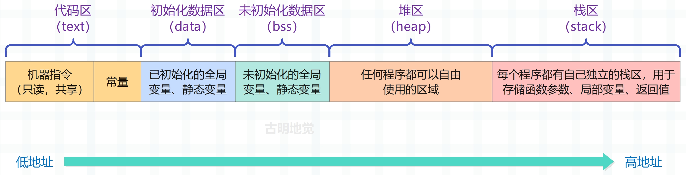

**代码区（text）**：负责存放 CPU 执行的机器指令。通常代码区是可共享的（即另外的执行程序可以调用它），可共享的目的是对于频繁被执行的程序，只需要在内存中存储一份代码区的内容即可。并且代码区通常是只读的，只读的原因是既然可以被其它程序读取，那么就还要保证它不会被其它程序篡改。此外，代码区还负责存放常量，常量在程序运行期间也不能修改，例如字符串常量 "hello world"、数组的名字等。

**初始化数据区（data）**：该区域包含了在程序中明确被初始化的全局变量，以及被初始化的静态变量（包括全局静态变量和局部静态变量）。

**未初始化数据区（bss）**：该区域存储的是未初始化的全局变量和未初始化的静态变量，而未初始化数据区的数据在程序开始执行前会被内核初始化为 0 或者 nil。

> 初始化数据区和未初始化数据区统称为静态区或全局区，而静态区的内存和整个程序具有相同的生命周期，也就是说，静态区的内存会等到程序全部结束之后才释放。

以上这几个区域是固定的，程序还没运行的时候就已经划分好了。但是当运行可执行程序的时候，系统会把程序加载到内存中，然后除了上面说的几个区域之外，还会额外增加两个区域：堆区、栈区。

**堆区（heap）**：堆是一个大容器，主要用于动态内存分配，它的容量要远大于栈，但没有栈那样先进后出的顺序。根据语言的不同，如果是 C 、C艹 等语言，堆区内存由程序猿手动释放，如果程序猿不释放，那么程序结束时会由操作系统回收。但是这并不代表使用 C、C++ 语言编程就可以不管堆区内存了，如果你的程序占用内存过大并且不及时释放的话，很有可能造成内存溢出。而像 Go、Python、Java 等语言都带有垃圾回收机制，你尽管使用，内存管理由对应的编译器或解释器来做即可。虽然垃圾回收机制会占用额外的资源，但也将程序猿从内存管理的繁忙工作中解放了出来。

**栈区（stack）**：栈是一种先入后出的数据结构（非常高效），由操作系统自动分配释放，存放函数的参数值、返回值、局部变量等等。在程序运行过程中实时加载和释放，因此局部变量的生命周期为相应的栈空间从申请到释放的这段时间。

## text、data、bss 解析

光用文字解释的话还不够直观，下面我们就来举几个栗子，分析一下这几个区。

### 代码区（text）

首先是代码区：

~~~C
#include <stdio.h>

void main() {
    // 定义一个 char * 类型的指针，存放字符串常量 "hello cruel world" 的首地址
    // 注意：此时的字符串是存在 "代码区" 当中的，因为它是一个字符串常量
    char *s = "hello cruel world";
    printf("%p, %s\n", s, s);
    
    // 同样，在代码区创建一个新的字符串，然后让 s 指向新字符串的首元素
    s = "hello beautiful world";
    printf("%p, %s\n", s, s);
}
~~~

我们编译执行一下：

打印的结果是没有问题的，而且编译之后这些字符串就是可执行文件的一部分了，在执行的时候直接拿来用即可，没有动态申请这一步。我们可以看一下它内部区域的大小信息：

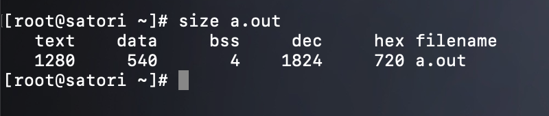

我们看到结果显示了代码区（text）、初始化数据区（data）、未初始化数据区（bss）的大小信息，说明这些区域在生成可执行文件的时候就已经确定好了。

~~~C
#include <stdio.h>

void main() {
    char *s = "hello cruel world...";
    printf("%p, %s\n", s, s);
    
    s = "hello beautiful world...";
    printf("%p, %s\n", s, s);
}
~~~

修改源文件，给每个常量字符串各自增加三个字符，然后重新生成可执行文件并查看大小信息。

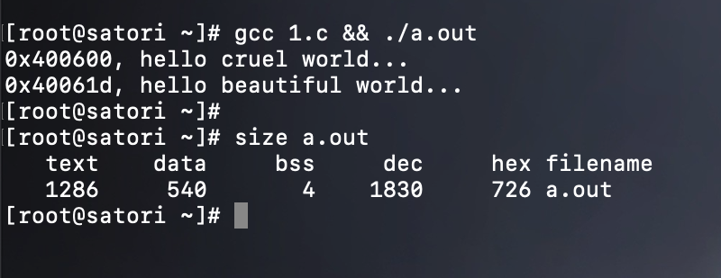

可以看到代码区（text）的大小变成了 1286，因为两个常量字符串加起来相比之前多了 6 个字符，所以这完全符合我们的预期。

然后再看一下地址，之前第一个常量字符串的地址是 0x400600，现在也是，说明分配的地址是相同的。但是之前第二个常量字符串的地址是 0x40061a，现在变成了 0x40061d，如果将两者转成 10 进制相减的话，结果相差 3。相信原因很好想，因为相比之前，第一个常量字符串多了 3 字节，那么第二个常量字符串的地址相比之前自然就要往后移 3 个字节，这一切都是符合预期的。

因为我们只修改了字符串常量，所以只会影响 text，而 data 和 bss 则不受影响，整体还是很好理解的。然后我们还说代码区中的常量是不能修改的，因为在编译之后它们就已经是可执行文件的一部分了，然后在读取的时候只需一条指令即可，效率非常高。并且和静态区（data、bss）一样，这些常量也和执行时的可执行文件具有相同的生命周期。

~~~C
#include <stdio.h>

void main() {
    char *s = "hello cruel world";
    s[0] = 'H';
    printf("%p, %s\n", s, s);
}
~~~

我们尝试修改常量字符串的第一个元素，将其改为 'H'，看看会有什么后果。

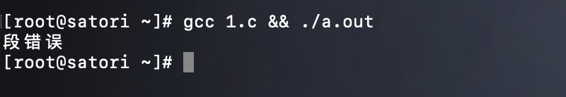

直接段错误了，因为常量不允许修改。另外根据 size 命令可以得出常量是存在代码区当中的，不过有时我们更喜欢将存放常量的区域单独称为常量区。但很明显，常量区也是代码区的一部分。

但如果我们就是想修改字符串该怎么办呢？答案是如果想修改，就不要将其放在常量区（代码区），而是将其放在栈区。

~~~C
#include <stdio.h>

void main() {
    // 这里我们将 char *s 改成了 char s[]，那么这两者有什么区别呢？
    // char *s = "abc" 相当于声明了一个字符串常量 "abc"，它是放在常量区当中的，然后让指针 s 指向这个常量
    // char s[] = "abc" 等价于 char s[] = {'a', 'b', 'c', '\0'}，此时的 "abc" 是放在栈区的，因为此时的 s 是一个局部数组
    // 所以要注意声明数组和声明指针的区别
    char s[] = "hello cruel world";
    printf("%p, %s\n", s, s);
    // 将 s[0] 进行修改
    s[0] = 'H';
    printf("%p, %s\n", s, s);
}
~~~

再来测试一下：

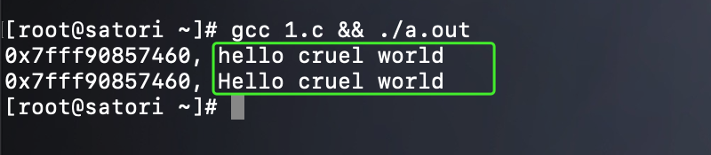

显然数组声明完之后，地址是固定的，同时内部元素是可修改的，因此我们成功将首字母 'h' 改成了 'H'。此外 char \*s 和 char s[] 还有一个显著的区别，就是当作为返回值的时候。

~~~C
#include <stdio.h>

char *test1() {
    char *s = "hello cruel world";
    return s;
}

char *test2() {
    char s[] = "hello cruel world";
    return s;
}

void main() {
    printf("%s\n", test1());
    printf("%s\n", test2());    
}
~~~

对于 test1 而言，代码是没有任何问题的，但是 test2 就不行了。原因是 test2 里面的字符串是存放在栈区的，函数结束之后就被销毁了，所以我们直接返回一个局部数组是不行的；而 test1 里面的字符串存放在常量区当中，在整个可执行文件执行结束之前都可以使用，所以返回它的指针没有任何问题。

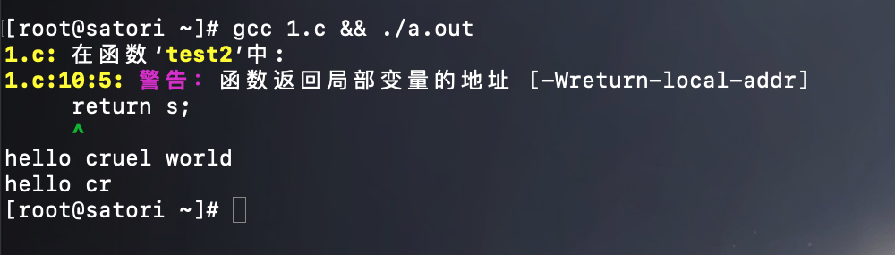

打印结果告诉我们不应该返回局部变量的地址，那么如何解决呢？很简单，将数组变成静态数组即可。

### 初始化数据区（data）

初始化数据区（data）负责存储已初始化的全局变量和静态变量，它也是和可执行文件具有相同的生命周期，在程序执行结束之前我们都可以使用它。

~~~C
#include <stdio.h>

char *test1() {
    char *s = "hello cruel world";
    return s;
}

char *test2() {
    // 此时的 s 就是一个静态数组，里面的元素会放在初始化数据区当中，而不会放在栈区
    static char s[] = "hello cruel world";
    return s;
}

void main() {
    printf("%s\n", test1());
    printf("%s\n", test2());    
}
~~~

此时再来执行，看看有没有问题：

正常输出，没有任何警告⚠️。除了静态局部变量，还有静态全局变量、全局变量，它们都是放在初始化数据区当中的。

~~~C
#include <stdio.h>

static int a = 123;  // 静态全局变量
int b = 234;         // 全局变量

int *test() {
    // 静态局部变量
    static int c = 345;
    c++;
    // 返回静态局部变量的地址没有任何问题，因为函数结束之后不会被销毁
    return &c;
}

void main() {
    printf("%d %d\n", a, b);
    
    for (int i=0; i < 5; i++) {
        int *p = test();
        printf("%p %d\n", p, *p);
    }
}
~~~

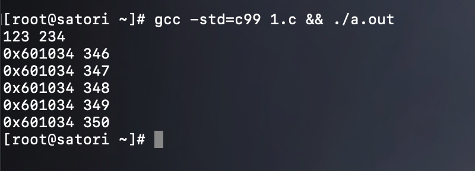

注意：静态变量只会初始化一次，所以我们调用了 5 次 test，但是变量 c 只会初始化一次，因为它是静态的。

那么问题来了，如果我们想要获取一个局部变量的地址，那么除了将变量声明为静态变量之外，还有没有其它的方法呢？因为静态变量会伴随着程序一直存在，但有时我们希望用完之后就将它回收掉，避免内存占用，这个时候就可以在堆区为变量申请内存。

因为栈上的内存会随着函数的调用完毕而被释放，但堆则不会，它需要程序猿手动释放，我们以 Go 为例：

~~~GO
package main

import "fmt"

func test() *int {
    var a int = 123
    return &a
}

func main() {
    var a *int = test()
    fmt.Println("*a =", *a)  // *a = 123
}
~~~

类似的逻辑如果放在 C 里面显然是有问题的，因为在 test 里面返回了局部变量的地址，但在 Go 里面为什么是正常的呢？原因就是 Go 编译器会进行逃逸分析，如果返回了变量的地址，就意味着该变量对应的值要被外界访问，那么 Go 编译器会在堆区为该变量分配内存。但是在 C 里面，我们需要手动实现这一点。

~~~C
#include <stdio.h>
#include <stdlib.h>

int *test() {
    // 在堆区分配 int 大小的内存，然后返回它的指针
    int *a = (int *)malloc(sizeof(int));
    *a = 123;
    return a;
}

void main() {
    int *a = test();
    printf("%d\n", *a);
    // 用完之后释放掉，否则可能造成内存泄漏
    if (a != NULL) 
        free(a);
}
~~~

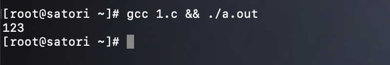

此时也是可以正常运行的，因此当返回一个局部变量的地址的时候，除了将其声明为静态变量之外，还可以通过 malloc 在堆区为其分配内存。只不过和栈不同，堆区的内存不会自动回收，需要我们调用 free 手动回收。但在 Go 里面我们貌似没有进行 free 之类的操作，原因是 Go 是一门带有 GC 的语言，它会自动进行垃圾回收，找出堆上不会被使用的内存，然后将其释放掉。

因此虽然 Go 也是静态编译型语言，但因为带有 GC，导致它的性能不如 C/C++/Rust 这类语言。但 Go 语法简单、天生擅长并发编程，仍然是值得我们学习的。

> 这里我们就得出了一个结论：如果一个局部变量的地址要返回给外界，那么它的值要申请在堆上。

### 未初始化数据区（bss）

最后是未初始化数据区 bss，它是负责存储未初始化全局变量、未初始化静态变量。

~~~c
#include <stdio.h>

static int a;
static int b = 123;

void main() {
    static int c;
    static int d = 345;
    printf("%d %d %d %d\n", a, b, c, d);
}
~~~

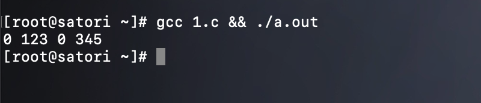

变量 a、c 存储在 bss 中，变量 b、d 存储在 data 中，并且 bss 中的变量会被初始化为 0 或 nil。

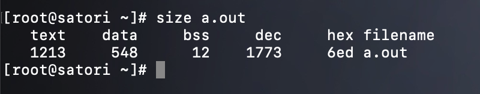

观察可执行文件，发现 data 的大小为 548、bss 的大小为 12。然后我们修改代码，将变量 b、d 的值给删掉，也就是只声明、不赋初始值，那么此时 a、b、c、d 就都会存在 bss 中。而一个 int 占 4 字节，那么将变量 b、d 修改之后重新编译，新生成的可执行文件的 data 区的大小相比之前就会少 8 个字节，bss 区的大小会多 8 个字节，我们看看是不是这样。

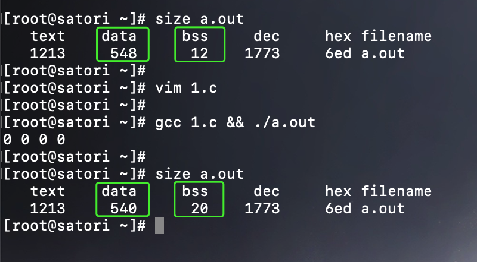

和我们分析的是一样的。

以上就是可执行文件中，代码区（text）、初始化数据区（data）、未初始化数据区（bss）的区别与作用，但显然还没有完。因为我们的重头戏还没有说（也不知道是谁的头这么重哈），就是栈区和堆区。

## 栈区

栈是程序运行的基础，每当一个函数被调用时，一块连续的内存就会在栈顶被分配出来，供函数执行使用，这块内存被称为栈帧（stack frame），或者简称为帧。我们以一个简单的函数调用为例：

~~~c
#include <stdio.h>

int hello() {
    return world();
}

int world() {
    return 666;
}

void main() {
    printf("%d\n", hello());  // 666
}
~~~

这段程序非常简单，但是这背后的函数调用栈是怎么一回事呢？我们来解释一下。

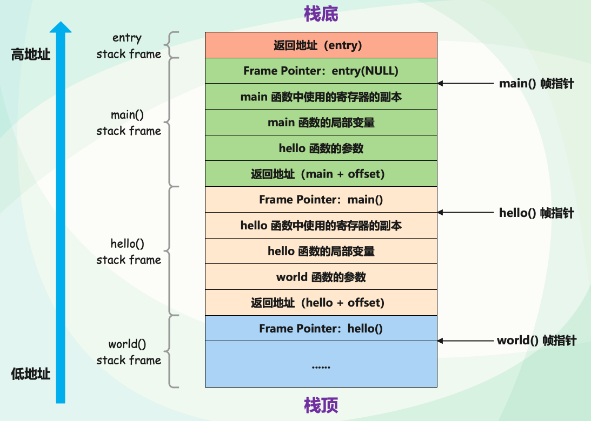

首先栈是自顶向下增长的，也就是从栈顶到栈底的地址是逐渐增大的，一个程序的调用栈的最底部，除去入口对应的栈帧之外，就是 main 函数对应的栈帧。而随着函数一层层调用，栈帧也会一层层地被创建，比如 main 函数里面调用了 hello 函数，那么就会在 main 函数对应的栈帧之上为 hello 函数创建栈帧（并保存当前 main 函数执行的上下文），然后将执行的控制权交给 hello 函数的栈帧。

然后在 hello 函数内部又调用了 world 函数，那么就又会在 hello 函数的栈帧之上为 world 函数创建栈帧（并保存当前 hello 函数执行的上下文），然后将执行的控制权交给 world 函数对应的栈帧。而调用结束之后，栈帧又会一层层地被销毁，并释放对应的内存。比如 world 函数调用完毕之后，就会将 world 函数对应的栈帧销毁，然后回到上一个调用者（hello 函数）对应的栈帧中，恢复其之前执行的上下文，并赋予执行的控制权。

所以整个过程就像递归一样，一层层创建，一层层返回，但如果栈帧创建的过多，那么有可能会造成栈溢出。因为调用栈的大小是有阈值的，一旦当前程序的调用栈超出了系统允许的最大栈空间，就会无法创建新的帧来运行下一个要执行的函数，从而发生栈溢出，这时程序会被系统终止，产生崩溃信息。比如递归函数没有妥善终止，那么一个递归函数会不断调用自己，而每次调用都会形成一个新的帧，最终导致栈溢出。

而在调用的过程中，一个新的帧会分配足够的空间来存储寄存器的上下文。在函数里使用到的通用寄存器会在栈上保存一个副本，当这个函数调用结束，通过副本，可以恢复出原本的寄存器的上下文，就像什么都没有经历一样。此外，函数所需要使用到的局部变量，也都会在帧分配的时候被预留出来。

那么问题来了，当一个函数运行时，怎么确定究竟需要多大的帧呢？

这要归功于编译器，在编译并优化代码的时候，一个函数就是一个最小的编译单元。在这个函数里，编译器得知道要用到哪些寄存器、栈上要放哪些局部变量，而这些都要在编译时确定。所以编译器就需要明确每个局部变量的大小，以便于预留空间。

> 这里我们就又得出了一个结论：在编译时，如果局部变量的大小不确定、或者大小可以改变，那么它的值就无法安全地放在栈上，应该要放在堆上。也就是在堆上为变量分配内存，并且还要在栈上分配一个指针，引用堆上的内存。

### 数据放在栈上的问题

首先栈上的数据在传递时永远都是拷贝一份，但栈上的内存分配是非常高效的，和堆是天壤之别。只需要改动栈指针（stack pointer），就可以预留相应的空间；把栈指针改动回来，预留的空间又会被释放掉。空间的申请和释放只是动动寄存器，不涉及额外计算、不涉及系统调用，因而效率很高。并且栈还是由操作系统自动维护的，根本不需要我们关心。

而在 Go 里面，很多朋友喜欢返回指针，即使数据不需要被共享。这么做的原因是认为拷贝指针比拷贝值更有效率，因为指针的大小相对较小一些。但事实真的如此吗？答案是不一定，因为如果拷贝值的话，那么复制是在栈上完成的，而我们说栈的效率极高。要是返回指针的话，那么当发生内存逃逸时，就会将变量的值从栈上分配改为堆上分配，这个过程反而会消耗更多的资源。

所以理论上说，我们应该把变量的值分配到栈上，这样可以达到更好的运行速度。但是实际工作中，我们却又避免这么做，这又是为什么呢？原因就是栈空间是有限的，分配过大的栈内存容易导致栈溢出。

> 所以我们又得到了一个结论：当变量的值占用内存过大时，那么优先在堆上分配。

因此变量的值究竟分配在栈上还是分配是在堆上，结论如下：

- 1）如果一个函数返回了局部变量的指针，那么要在堆上为其分配内存；
- 2）如果在编译时，局部变量的大小不确定、或者大小可以改变，那么它的值就无法安全地放在栈上，所以此时也要在堆上为其分配内存；
- 3）如果变量的值过大，那么优先在堆上为其分配内存；

## 堆区

栈的效率虽然很高，不用我们维护，但它的局限性也显而易见，就是它要求变量的大小必须明确、固定。而当我们需要动态大小的内存时，只能使用堆，比如我们要实现可变长度的数组，那么必须分配在堆上，否则无法扩容。而堆上分配内存时，一般都会预留一些空间，这是最佳实践。

在堆上分配内存除了可以让大小动态化，还可以让生命周期动态化。我们说过，函数调用结束之后，那么函数对应的栈帧会被回收，同时相关变量对应的内存也会被回收。所以栈上内存的生命周期是不受开发者控制的，并且局限在当前调用栈。而堆则不同，堆上分配出来的每一块内存都需要显式地释放，这就使得堆内存有更加灵活的生命周期，可以在不同的调用栈之间共享数据。因为数据只要我们不回收，那么就始终就驻留在堆上，并且何时回收也是由我们来决定的。

因此当内存动态可变的时候，我们会在堆上分配。当然啦，堆内存是负责具体存储数据的，然后还要在栈上分配一个指针，它引用堆区的内存。我们以 Rust 的 String 为例：

~~~RUST
fn main() {  
    let s1 = String::from("hello"); 
    let s2 = s1; 
}
~~~

此时 s1 内存布局如下：

String 实际上由 3 部分组成：指向字符串的指针（ptr）、长度（len）、容量（capacity），这部分的数据存储在了栈中，即图中的左半部分。然后 ptr 指向了字符串存储在堆上的文本内容，也就是图中的右半部分。

但下面又把 s1 赋值给了 s2，于是会把 s1 拷贝一份给 s2，因为 s1 和 s2 都是栈上的数据，所以会直接拷贝一份。因为栈上的数据拷贝的效率非常高，和堆根本不在一个层次，并且也不需要我们来维护。只不过大小固定，不能动态变化，毕竟速度摆在那里。

但需要注意的是，这里的拷贝仅仅是针对栈上的数据，字符串里面的 ptr 指向的存储在堆区的文本并没有拷贝。

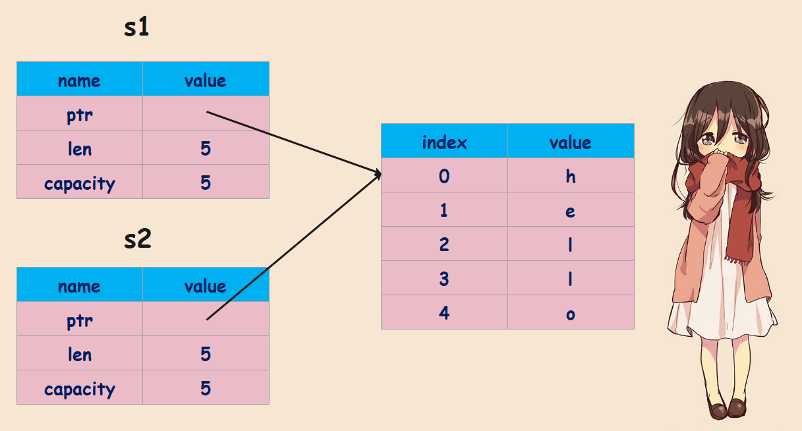

这么做完全可以理解，因为在堆上拷贝数据的效率远不如栈，所以不能像栈那样直接将数据拷贝一份。而且存在堆上的数据也可能会比较大，这样的话拷贝就更加消耗资源了。对于任何一门语言来说，默认情况下，堆区的数据都不会自动拷贝。如果非要拷贝，只能手动拷贝。

但是这里就产生了一个问题，上面的 s1 和 s2 都引用了同一份堆内存，那这份堆内存要何时回收呢？

对于 Python 而言，申请在堆上的内存都有一个引用计数，每当有一个指针引用它，引用计数就会加 1。当引用计数为 0 时，堆内存就被回收。

而对于 Rust 而言则不是这样，首先 Rust 是一个没有 GC 的语言，并且还能保证内存安全，那么对于当前这个例子它是怎么做的呢？很简单，Rust 内部提出了一个所有权的概念，在这里你可以把所有权简单理解为操作堆内存的权限。一开始 s1 是持有所有权的，但是在 s1 赋值给 s2 之后，所有权就发生了转移。也就是说 s1 不再具有操作堆内存的权利，所有权被转移到了 s2 上面，如果使用 s1 就会报错。

所以 Rust 是保证每块堆内存同时只能被一个变量所持有，因此堆内存是否释放，就看持有所有权的变量是否还存活。

### 数据放在堆上的问题

堆是非常灵活的，然而堆内存的这种灵活性也给内存管理带来很多挑战。如果手工管理堆内存的话，那么堆内存分配后忘记释放，就会造成内存泄漏。一旦有内存泄漏，程序运行得越久，就越吃内存，最终会因为占满内存而被操作系统终止运行。

如果堆上内存被多个线程的调用栈引用，该内存的改动要特别小心，需要加锁以独占访问，来避免潜在的问题。比如一个线程在访问某一个指针，但另一个线程将该指针指向的内存释放了，此时就可能出现访问悬空指针的情况，轻则程序崩溃，重则隐含安全隐患。根据微软安全反应中心（MSRC）的研究，这是第二大内存安全问题。

除此之外还有堆越界（heap out of bounds），比如程序在堆区申请的内存只能容纳 5 个 int，但是我们尝试操作第 6 个 int，此时就会引发堆越界，而堆越界是第一大内存安全问题。

### 垃圾回收机制是如何解决的？

很多语言带有垃圾回收机制，它们是如何解决堆内存回收的问题呢？

> ‍垃圾回收针对的是堆内存，因为栈内存由操作系统维护，不需要我们关心。

首先无论何种垃圾回收机制，一般都分为两个阶段：垃圾检测和垃圾回收。

垃圾检测是从已经分配的堆内存中区别出可回收和不可回收的内存，而垃圾回收则是使操作系统重新掌握垃圾检测阶段所标识出来的可回收内存块。所以垃圾回收，并不是说直接把这块内存的数据清空了，而是将使用权重新交给了操作系统，不会自己霸占了。

那么，常见的垃圾回收算法都有哪些呢？

- 引用计数法（reference count）：记录对象的被引用次数，引用计数降为 0 时回收；
- 标记-清除法（mark-sweep）：从根集合触发，遍历所有能访问到的对象并对其进行标记，然后将未被标记的对象清除；
- 停止-复制法（stop-copy）：将内存划分为大小相同的内存块，一块用完后启用另一块、并将存活的对象拷贝过去，原来那块则整体被回收；
- 分代回收法（generational-collection）：根据对象的存活时间将对象分为若干代，并按照不同代的特征采用最合适的回收策略；

以 Java 为首的一系列编程语言，采用了标记-清除法。这种方式通过定期标记（mark）找出不再被引用的对象，然后将其清除（sweep）掉，来自动管理内存，减轻开发者的负担，因此该方法也被称为追踪式垃圾回收（Tracing GC）。而 Objective-C 和 Swift 则走了另一条路，也就是引用计数（reference count）法。在编译时，它为每个函数插入 retain/release 语句来自动维护堆上对象的引用计数，当引用计数为零的时候，就通过 release 语句释放对象。

从效率上来讲，标记清除在内存分配和释放上无需额外操作，而引用计数法则添加了额外的代码来处理引用计数，所以标记-清除法的效率更高，吞吐量（throughout）更大。

但标记-清除法释放内存的时机是不确定的，并且是定期批量操作，因此在释放内存时会引发 STW（Stop The World），从而导致某些时刻延迟（latency）较高。我们使用 Android 手机偶尔感觉卡顿，就是这个原因，出现卡顿说明此时内部正在进行垃圾回收。但引用计数法是当对象的引用计数为 0 时就立即回收，所以相当于将垃圾回收的开销分摊在了整个运行时，因此使用 IOS 手机时始终会感觉很丝滑，不会出现卡顿。

所以尽管标记清除法在分配和释放内存的效率和吞吐量上比引用计数法要高，但因为偶尔的高延迟，导致被感知的性能较差。

### 栈与堆总结

我们上面已经介绍了栈和堆，这里再总结一下。

栈和堆都是代码在运行时可以使用的内存空间，不过它们通常以不同的结构组织而成。栈会以我们放入值时的顺序来存储它们，并以相反的顺序将值取出，这也就是所谓的后进先出（Last In First Out，LIFO）策略。

你可以把栈上的操作想象成堆放盘子：当你需要放置盘子时，你只能将它们放置在最上面，而当你需要取出盘子时，你也只能从最上面取出。换句话说，你没有办法从中间或底部插入、移除盘子。用术语来讲，添加数据这一操作被称作入栈，移除数据则被称作出栈。所有存储在栈中的数据都必须拥有一个已知且固定的大小，对于那些在编译期无法确定大小的数据，只能将它们存储在堆中（在栈上是不安全的）。

而堆空间的管理较为松散：当你希望将数据放入堆中时，你就可以请求特定大小的空间。操作系统会根据你的请求在堆中找到一块足够大的可用空间，将它标记为已使用，并把指向这片空间的指针返回。这一过程就是所谓的堆分配，它也常常被简称为分配，至于将值压入栈中则不叫分配。由于指针的大小是固定的，且可以在编译期确定（64位系统固定 8 字节），所以会将指针存储在栈中，也就是栈区的指针指向堆区的数据。

可以想象一下到餐厅聚餐，当你到达餐厅表明自己需要的座位数后，服务员会找到一张足够大的空桌子，并将你们领过去入座。即便这时有小伙伴来迟了，他们也可以通过询问你们就座的位置来找到你们。

向栈上压入数据要远比在堆上进行分配更有效率，因为如果是堆的话，操作系统还要搜索新数据的存储位置，需要额外开销；但栈不用，对于栈而言这个位置永远处于栈的顶端。除此之外，操作系统在堆上分配空间时还必须首先找到足够放下对应数据的空间，并进行某些记录，来协调随后的其余分配操作。

访问数据也是同理，由于指针存在栈上，数据存在堆上，所以要通过指针存储的地址来访问数据。而这会多一步指针跳转的环节，因此访问堆上的数据要慢于访问栈上的数据。一般来说，现代处理器在进行计算的过程中，由于缓存的缘故，指令在内存中跳转的次数越多，性能就越差。

继续使用上面的餐厅来作类比，假设现在同时有许多桌的顾客正在等待服务员的处理。那么最高效的处理方式自然是报完一张桌子所有的订单之后再接着服务下一张桌子的顾客。而一旦服务员每次在单个桌子前只处理单个订单，那么他就不得不浪费较多的时间往返于不同的桌子之间。出于同样的原因，处理器操作排布紧密的数据（比如在栈上）要比操作排布稀疏的数据（比如在堆上）有效率得多。另外，分配命令本身也可能消耗不少时钟周期。

所以 Python 为什么这么慢，就是因为它所有的对象都分配在堆上，即使是栈帧，也是分配在堆上的，虽然名字里面带了一个栈字。这也是 Python 效率低下的原因之一，至于另一个原因则是无法在编译期间确定类型，因为 Python 的变量只是一个指针，执行任何操作，都需要先通过 ob_type 判断指向的对象的类型是什么。

为此，Python 不得不大量使用缓存技术，在对象被销毁时不释放内存，而是缓存起来留着下次备用。但即便如此，依旧架不住效率低。

## 小结

以上我们就分析了可执行文件的内存模型，以及栈和堆的特点。

对于存入栈上的值，它的大小不能变化、以及在编译期就需要确定。并且栈上存储的变量的生命周期局限在当前调用栈的作用域内，无法跨调用栈引用。

堆可以存入大小未知或者动态伸缩的数据类型，堆上数据的生命周期从分配后开始，一直到释放时才结束，因此堆上的变量允许在多个调用栈之间引用。但也导致堆变量的管理非常复杂，手工管理会引发很多内存安全性问题，而自动管理，无论垃圾回收算法采用的是哪一种，都有性能损耗和其它问题。

> 所以才有了 Rust。

一句话对比总结就是：栈上存放的数据是静态的，固定大小，固定生命周期；堆上存放的数据是动态的，不固定大小，不固定生命周期。

### 思考题

1）如果有一个数据结构需要在多个线程中访问，可以把它放在栈上吗？为什么？

在多线程场景下，每个线程的生命周期是不固定的，无法在编译期得知谁先结束谁后结束，所以不能把属于线程 A 调用栈上的内存共享给线程 B，因为 A 可能先于 B 结束，因此这时应该使用堆内存。

但是有个例外，如果我们能保证结束的顺序是确定的，那么可以共享，比如 scoped thread。

2）可以使用指针引用栈上的某个变量吗？如果可以，是在什么情况下呢？

显然是可以的，比如在函数中创建一个局部变量，然后再用一个指针指向它。

~~~c
int test() {
    int a = 123;
    int *p = &a;  // 引用栈上的变量
    return 0;
}
~~~

只要指针的生命周期小于等于引用源就行，但如果指针的生命周期大于引用源，那么就不行了。比如上面的代码不能将 p 返回，否则的话，函数结束后 a 会被销毁，但 p 还在，所以会出现悬空指针的情况，因为此时指针 p 的生命周期超过了引用源 a。

**本文参考自：**

- 极客时间，陈天《Rust 编程第一课》
- 《Rust 权威指南》

------

&nbsp;

**欢迎大家关注我的公众号：古明地觉的编程教室。**

**如果觉得文章对你有所帮助，也可以请作者吃个馒头，Thanks♪(･ω･)ﾉ。**

