## 楔子

内存管理，对于 Python 这样的动态语言来说是非常重要的一部分，它在很大程度上决定了 Python 的执行效率。因为 Python 在运行的过程中会创建和销毁大量的对象，这些都涉及内存的管理，因此精湛的内存管理技术是确保内存使用效率的关键。

## 内存管理架构

Python 的内存管理机制是分层次的，可以认为有 6 层：-2，-1，0，1，2，3。

~~~
    Object-specific allocators
    _____   ______   ______       ________
   [ int ] [ dict ] [ list ] ... [ string ]       Python core         |
+3 | <----- Object-specific memory -----> | <-- Non-object memory --> |
    _______________________________       |                           |
   [   Python's object allocator   ]      |                           |
+2 | ####### Object memory ####### | <------ Internal buffers ------> |
    ______________________________________________________________    |
   [          Python's raw memory allocator (PyMem_ API)          ]   |
+1 | <----- Python memory (under PyMem manager's control) ------> |   |
    __________________________________________________________________
   [    Underlying general-purpose allocator (ex: C library malloc)   ]
 0 | <------ Virtual memory allocated for the python process -------> |
   =========================================================================
    _______________________________________________________________________
   [                OS-specific Virtual Memory Manager (VMM)               ]
-1 | <--- Kernel dynamic storage allocation & management (page-based) ---> |
    __________________________________   __________________________________
   [                                  ] [                                  ]
-2 | <-- Physical memory: ROM/RAM --> | | <-- Secondary storage (swap) --> |
~~~

每一层的作用如下：

+ 第 3层：特定对象内存分配器，用于对象的缓存池，为对象的内存分配提供优化。
+ 第 2 层：Python 对象分配器，通过实现内存池机制，提升小对象的分配效率。
+ 第 1 层：Python 原始内存分配器，提供了 PyMem_Malloc / PyMem_RawMalloc 等 API，这些 API 封装了 C 的 malloc，用于申请内存。
+ 第 0 层：通用内存分配器，即 C 的 malloc 函数，该函数则是封装了操作系统内存分配相关的系统调用。
+ 第 -1 层：操作系统虚拟内存管理器（VMM），负责页面管理和动态存储分配，以及将虚拟内存映射到物理内存。
+ 第 -2 层：物理内存层，管理 RAM / ROM 以及交换空间（swap）。

显然 -2 和 -1 层是由操作系统负责的，Python 无权干预。而第 0 层是由 C 负责，Python 同样无权干预。而第 1、2、3 层才是属于 Python 自己的内存管理，我们来详细解释一下。

**第 1 层：基于第 0 层的"通用内存分配器"包装而成。**

这一层并没有在第 0 层上加入太多的动作，其目的仅仅是为 Python 提供统一的 raw memory 管理接口。这么做的原因是，虽然不同的操作系统都提供了 ANSI C 标准定义的内存管理接口，但在某些特殊情况下，不同的操作系统有着不同的行为。

比如调用 malloc(0)，有的操作系统会返回 NULL，表示申请失败；有的操作系统会返回一个貌似正常的指针，但这个指针指向的内存并不是有效的。为了最广泛的可移植性，Python 必须保证相同的语义一定代表着相同的运行时行为，为了处理这些与平台相关的内存分配行为，Python 必须要在 C 的内存分配接口之上再提供一层包装。

在 Python 中，第一层的实现就是一组以 PyMem\_\* 为前缀的函数簇，下面来看一下。

~~~C
// Include/pymem.h
PyAPI_FUNC(void *) PyMem_Malloc(size_t size);
PyAPI_FUNC(void *) PyMem_Realloc(void *ptr, size_t new_size);
PyAPI_FUNC(void) PyMem_Free(void *ptr);

#define PyMem_MALLOC(n)         PyMem_Malloc(n)
#define PyMem_REALLOC(p, n)     PyMem_Realloc(p, n)
#define PyMem_FREE(p)           PyMem_Free(p)

// Objects/obmalloc.c
void *
PyMem_Malloc(size_t size)
{
    if (size > (size_t)PY_SSIZE_T_MAX)
        return NULL;
    return _PyMem.malloc(_PyMem.ctx, size);
}

void *
PyMem_Calloc(size_t nelem, size_t elsize)
{
    if (elsize != 0 && nelem > (size_t)PY_SSIZE_T_MAX / elsize)
        return NULL;
    return _PyMem.calloc(_PyMem.ctx, nelem, elsize);
}

void
PyMem_Free(void *ptr)
{
    _PyMem.free(_PyMem.ctx, ptr);
}
~~~

我们看到在第一层，Python 提供了类似于 C 的 malloc、realloc、free 函数的语义。比如 PyMem_Malloc 负责分配内存，首先会检测申请的内存大小，如果超过了 PY_SSIZE_T_MAX 则直接返回 NULL，否则调用 \_PyMem.malloc 申请内存。这个 _PyMem.malloc 和 C 的库函数 malloc 几乎没啥区别，但是会对特殊值进行一些处理。

到目前为止，仅仅是分配了 raw memory 而已。当然在第一层，Python 还提供了面向对象中类型对象的内存分配器。

~~~C
// Include/pymem.h
#define PyMem_New(type, n) \
  ( ((size_t)(n) > PY_SSIZE_T_MAX / sizeof(type)) ? NULL :      \
        ( (type *) PyMem_Malloc((n) * sizeof(type)) ) )
#define PyMem_NEW(type, n) \
  ( ((size_t)(n) > PY_SSIZE_T_MAX / sizeof(type)) ? NULL :      \
        ( (type *) PyMem_MALLOC((n) * sizeof(type)) ) )

#define PyMem_Resize(p, type, n) \
  ( (p) = ((size_t)(n) > PY_SSIZE_T_MAX / sizeof(type)) ? NULL :        \
        (type *) PyMem_Realloc((p), (n) * sizeof(type)) )
#define PyMem_RESIZE(p, type, n) \
  ( (p) = ((size_t)(n) > PY_SSIZE_T_MAX / sizeof(type)) ? NULL :        \
        (type *) PyMem_REALLOC((p), (n) * sizeof(type)) )
~~~

很明显，在 PyMem_Malloc 中需要程序员自行提供申请的空间大小。然而在 PyMem_New 中，只需要提供类型和数量，Python 会自动侦测其所需的内存空间大小。

**第 2 层：在第 1 层提供的通用 PyMem\_\* 接口的基础上，实现统一的对象内存分配（tp_alloc）。**

第 1 层所提供的内存管理接口的功能是非常有限的，如果创建一个 PyLongObject 对象，还需要做很多额外的工作，比如设置对象的类型参数、初始化对象的引用计数值等等。

因此为了简化 Python 自身的开发，Python 在第 1 层的基础上抽象出了第 2 层内存管理接口。在这一层，是一组以 PyObject\_\* 为前缀的函数簇，主要提供了创建对象的接口。这一套函数簇又被称为 Pymalloc 机制，因此在第 2 层的内存管理机制上，Python 对于一些内置对象构建了更高抽象层次的内存管理策略。

**第 3 层：为特定对象服务。**

这一层主要是用于对象的缓存机制，比如：小整数对象池，浮点数缓存池等等。

那么问题来了，Python 的 GC 是隐藏在哪一层呢？不用想，肯定是第二层，也是在 Python 的内存管理中发挥巨大作用的一层，我们后面也会基于第二层进行剖析。

## 为什么要有内存池

在 Python 中，很多时候申请的内存都是小块的内存，这些小块的内存在申请后很快又被释放，并且这些内存的申请并不是为了创建对象，所以并没有对象一级的缓存机制。这就意味着 Python 在运行期间需要大量地执行底层的 malloc 和 free 操作，导致操作系统在用户态和内核态之间进行切换，这将严重影响效率。

所以为了提高执行效率，Python 引入了内存池机制，用于管理对小块内存的申请和释放，并且提供了 pymalloc_alloc，pymalloc_realloc，pymalloc_free 三个接口。可以认为 Python 会向操作系统预申请一部分内存，专门用于那些占用内存小的对象，这就是所谓的内存池机制。

另外要注意这里的内存池和前面介绍对象时提到的缓存池不同，缓存池可以理解为是数组或者链表，目的是在对象不用的时候缓存起来，需要的时候再拿来用。也就是说，对象自始至终对象都存在于内存当中。而内存池是用来申请和释放内存的，一申请，对象就横空出世了；一释放，对象就会归于湮灭。

而整个内存池也可以视为一个层次结构，从下至上分别是：block、pool、arena。当然内存池只是一个概念上的东西，表示 Python 对小块内存分配和释放行为的内存管理机制。

## block

在最底层，block 是一个确定大小的内存块。并且 block 有很多种，不同种类的 block 拥有不同的内存大小。为了在当前主流的 32 位平台和 64 位平台都能获得最佳性能，所有 block 的大小都是 8 字节对齐的。

~~~C
// Objects/obmalloc.c
#define ALIGNMENT              8
~~~

那么问题来了，为什么会有这么多种类的 block 呢？答案是为了优化内存使用，避免内存碎片。

如果申请的内存小于等于 512 字节，会从内存池中分配一个相应规格的 block 给它。但如果申请的内存超过了 512 字节，那么会将申请内存的请求转交给第一层的内存管理机制，即 PyMem 函数簇来处理（进而调用 malloc）。所以从内存池中申请的内存大小是有上限的，只有不超过 512 字节的对象才会使用内存池，如果超过了这个值还是要经过操作系统临时申请的。

- 1 ~ 512：由专门的内存池负责分配；
- 512 以上：临时从系统堆上申请；

~~~C
// Objects/obmalloc.c
#define SMALL_REQUEST_THRESHOLD 512
// SMALL_REQUEST_THRESHOLD 为 512，ALIGNMENT 为 8
// 所以 NB_SMALL_SIZE_CLASSES 等于 64
#define NB_SMALL_SIZE_CLASSES   (SMALL_REQUEST_THRESHOLD / ALIGNMENT)
~~~

那么 block 有多少种呢？其实 NB_SMALL_SIZE_CLASSES 这个宏已经告诉我们了，总共 64 种。咦，当大小不超过 512 字节时，会从内存池中获取一个 block，那么 block 不应该有 512 种吗？很明显不是的，因为某个规格的 block 如果使用频率很低，用完一次之后就再也不用了怎么办？所以这会造成内存浪费。

因此 Python 的做法是以 8 字节为基准，将 block 划分为 64 种，即 8 字节 block、16 字节 block、24 字节 block，···、512 字节 block。

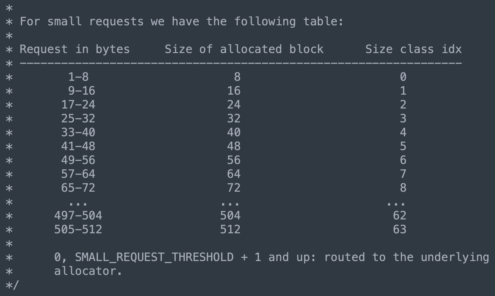

- 里面的 Size class idx 指的就是 block 的种类，总共 64 种，分别用 0 ~ 63 表示；
- 里面的 Size of allocated block 指定的就是 block 对应的大小；

当然 Python 也提供了一个宏，来描述这两者的关系，事实上我们也能看出来。

~~~C
// Objects/obmalloc.c
#define ALIGNMENT_SHIFT         3
#define INDEX2SIZE(I) (((uint)(I) + 1) << ALIGNMENT_SHIFT)
~~~

索引为 0 的话，就是 1 << 3，显然结果为 8。索引为 1 的话，就是 2 << 3，显然结果为16，以此类推。因此当申请一个 44 字节的内存时，pymalloc_alloc 会从内存池中划分一个 48 字节的 block 给我们。

另外在 Python 底层，block 其实只是一个概念，源码中没有与之对应的实体存在。和对象不同，对象在源码中有对应的 PyObject，但这里的 block 仅仅是概念上的东西，我们知道它具有一定大小的内存，但它并不与 Python 源码里面的某个结构相对应。不过 Python 提供了一个管理 block 的东西，也就是下面要介绍的 pool。

## pool

内存池由多个内存页组成，这里的 pool 便可理解为内存页，然后每个内存页又划分为多个具有相同规格的内存块（block）。因此一组 block 的集合就是一个 pool，换句话说，一个 pool 管理着一堆具有固定大小的内存块（block），而一个 pool 的大小通常为一个系统内存页，也就是 4kb。

~~~C
// Objects/obmalloc.c
#define SYSTEM_PAGE_SIZE        (4 * 1024)
#define SYSTEM_PAGE_SIZE_MASK   (SYSTEM_PAGE_SIZE - 1)
#define POOL_SIZE               SYSTEM_PAGE_SIZE        /* must be 2^N */
#define POOL_SIZE_MASK          SYSTEM_PAGE_SIZE_MASK
~~~

SYSTEM_PAGE_SIZE 指的是内存页大小，至于它下面的 MASK 负责将取模运算优化成按位与运算。然后 POOL_SIZE 和内存页大小相等，因此可以把 pool 理解成内存页。

虽然 Python 没有为 block 提供对应的结构，但是提供了和 pool 相关的结构，因为 Python 是将内存页看成由一个个内存块（block）组成的池子（pool），我们来看看 pool 的结构。

~~~c
// Objects/obmalloc.c
struct pool_header {
    // 当前 pool 里面已经分配出去的 block 的数量 
    union { block *_padding;
            uint count; } ref;
    // 指向第一个可用的 block
    block *freeblock;
    // 底层会有多个 pool，而多个 pool 之间也会形成一个链表 
    // 所以 nextpool 字段会指向下一个 pool 
    struct pool_header *nextpool;
    // 指向上一个 pool
    struct pool_header *prevpool;
    // 该 pool 所属的 arena 在数组中的索引，关于什么是 arena，后面会说
    uint arenaindex;
    // 每个 pool 都维护了一组相同规格的 block
    // 而 szindex 指的就是 block 的 Size class idx 
    // 如果 szindex 为 2，那么管理的每个 block 的大小就是 24
    uint szidx;
    // 下一个可用 block 的偏移量
    uint nextoffset;
    // 最后一个 block 的偏移量
    uint maxnextoffset;
};
~~~

一个 pool 管理着一组相同规格的 block，也就是说，一个 pool 可以管理 8 字节的 block，可以管理 16 字节的 block 等等。但同一个 pool 不可能同时既管理 8 字节 block、又管理 16 字节 block，每个 pool 里面的 block 的内存大小一定是相同的。至于 pool 管理的 block 究竟是多大，则通过 szidx 字段体现。

然后是里面的 nextpool 和 prevpool，它们指向的 pool 和当前 pool 一定具有相同的 szindex。换句话说，如果一个 pool 管理的 block 是 24 字节，那么它的 nextpool 字段和 prevpool 字段指向的 pool 管理的 block 一定也是 24 字节。

前面说了，一个 pool 的大小是 4KB，但从当前的这个 pool 的结构体来看，用鼻子想也知道吃不完 4KB 的内存，事实上这个结构体只占 48 字节。所以这个结构体叫做 struct pool_header，它仅仅是一个 pool 的头部，除去这个 pool_header，剩下的就是所有 block 占用的内存。

我们以 16 字节（szidx=1）的 block 为例，看看 Python 如何将一块 4KB 的内存改造成管理 16 字节 block 的 pool。

~~~C
// Objects/obmalloc.c
typedef uint8_t block;
typedef struct pool_header *poolp;
#define POOL_OVERHEAD   _Py_SIZE_ROUND_UP(sizeof(struct pool_header), ALIGNMENT)

// 当申请的内存不超过 512 字节，会从内存池中申请，此时由 pymalloc_alloc 负责
// 当申请的内存超过了 512 字节，会从系统堆上申请，此时由 PyMem_Malloc 负责
// 因为我们是要探究内存池，所以 pymalloc_alloc 函数是重中之重，它包含了全部细节
static void*
pymalloc_alloc(void *ctx, size_t nbytes)
{
    block *bp;  // 指向内存块
    poolp pool;  // 指向 struct pool_header
    poolp next;  // 指向 struct pool_header
    uint size;  // pool 的 Size class idx

// 这段代码不用关注，它的逻辑是如果编译时启用了 Valgrind 支持
// 并且程序运行在 Valgrind 下，那么禁用 Python 的内存池
#ifdef WITH_VALGRIND
    if (UNLIKELY(running_on_valgrind == -1)) {
        running_on_valgrind = RUNNING_ON_VALGRIND;
    }
    
    if (UNLIKELY(running_on_valgrind)) {
        return NULL;
    }
#endif
    
    // 如果申请的内存大小为 0，那么深情失败
    if (nbytes == 0) {
        return NULL;
    }
    // 如果申请的内存大小超过了 512 字节，那么申请失败
    if (nbytes > SMALL_REQUEST_THRESHOLD) {
        return NULL;
    }

    // 根据申请的内存大小计算对应 block 的规格
    size = (uint)(nbytes - 1) >> ALIGNMENT_SHIFT;
    // usedpools 是一个长度为 64 数组，负责管理 64 条双向链表，具体细节之后说
    // 总之通过 usedpools[size + size] 拿到了相应的 pool
    pool = usedpools[size + size];
    // 如果 pool == pool->nextpool，说明没有可用 pool
    // 那么要创建新的 pool，然后插入到链表中，并使用新的 pool 进行内存分配
    // 如果 pool != pool->nextpool，说明当前的 pool 可用
    // 至于背后的细节，等后续介绍 usedpools 之后再说
    if (pool != pool->nextpool) {
        // ...
        // 到这里说明获取了一个可用 pool，显然它之前就已经申请好了
        // 这部分逻辑后续再聊，我们要观察 pool 如何创建的
    }

    // 到这里说明没有找到管理符合规格的 block 的可用 pool，那么要新创建一个
    // 以下是 arena 相关的逻辑，这里先省略掉
    // ...
    // 正如 block 的上一级是 pool，而 pool 同样有自己的上级 arena
    // 关于 arena，同样后续再说
    init_pool:  // 到这里 pool 指向了一块 4K 的内存，由 48 字节的 pool_header 加一堆 block 组成
        next = usedpools[size + size]; /* == prev */
        // 将新 pool 插入到双向链表
        pool->nextpool = next;
        pool->prevpool = next;
        next->nextpool = pool;
        next->prevpool = pool;
        // 因为创建一个新的 pool，一定伴随着 block 的申请
        // 所以第一个 block 一定会被使用，因此要将已使用的 block 数量设置为 1
        pool->ref.count = 1;
        // pool 之前存储的 block 的规格，和当前申请的 block 的规格恰好相等
        if (pool->szidx == size) {
            bp = pool->freeblock;
            assert(bp != NULL);
            pool->freeblock = *(block **)bp;
            goto success;
        }
        // 否则说明不相等，那么要重新对 pool 初始化
        pool->szidx = size;
        // 基于 Size class idx 计算 block 的大小
        size = INDEX2SIZE(size);
        // POOL_OVERHEAD 就是 pool_header 的大小
        // 指针 pool 向后偏移 POOL_OVERHEAD 个字节，显然会指向第一个 block
        bp = (block *)pool + POOL_OVERHEAD;
        // nextoffset 表示下一个可用 block 的偏移量，注意这里的"下一个可用"
        // 首先 pool 里的 freeblock 字段指向第一个可用的 block
        // 而对于新创建的内存页来说，第一个可用的 block 就是第二个 block
        // 那么下一个可用的 block 指的就是第三个 block
        // 所以 nextoffset 应该等于 POOL_OVERHEAD 加上两个 block 的大小
        pool->nextoffset = POOL_OVERHEAD + (size << 1);
        // maxnextoffset 表示最后一个 block 的内存偏移量
        // 显然它等于 POOL_SIZE（4096）减去一个内存块的大小
        pool->maxnextoffset = POOL_SIZE - size;
        // 指向第二个内存块，所以是 bp + size
        pool->freeblock = bp + size;
        *(block **)(pool->freeblock) = NULL;
        goto success;
    }
    // ...
    // arena 相关，暂时先跳过

success:
    assert(bp != NULL);
    // 将 block 返回，对于一个刚初始化的 pool 来说，返回的就是第一个 block
    // 然后 pool 的 freeblock 指向第二个 block，nextoffset 保存第三个 block 的偏移量
    return (void *)bp;

failed:
    return NULL;
}
~~~

再来简单描述一下，首先是里面的 freeblock，它指向第一块可用的 block。由于新内存页（pool）总是伴随内存的申请触发，所以第一个 block 一定会被分配出去（不可用），第二个 block 才是可用的。而 bp 指向 pool 中的第一块 block，那么 freeblock 显然就等于 bp + size。

从 ref.count 也可以看出端倪，它记录了当前已经被分配的 block 的数量，但初始化的时候不是 0，而是 1，也证明了这一点。而 freeblock 指向第一个可用的 block，所以它在源码中被设置成了 bp + size，也就是第二个 block。

然后是 nextoffset 字段，它表示下一个可用 block 的偏移量。对于新创建的内存页来说，第一个可用的 block 是第二个 block，那么下一个可用的 block 指的就是第三个 block。所以它应该等于 POOL_OVERHEAD 加上两个 block 的大小，因此在源码中被设置成了 48 + (size << 1)。

> 因此这里的下一个可用，容易让人产生歧义，我们可以认为它记录的是第二个可用 block 的偏移量。

最后是 maxnextoffset，它表示最后一个 block 的内存偏移量，显然它等于 POOL_SIZE 减去一个内存块的大小。

因此通过 freeblock 能拿到第一个可用 block，至于剩余的可用 block 由于还没有人用，暂时先不管，只是通过 nextoffset 和 maxnextoffset 记录了第二个可用 block 和最后一个可用 block 相对于 pool 头部的偏移量。

最终改造成 pool 之后的 4kb 内存如图所示：

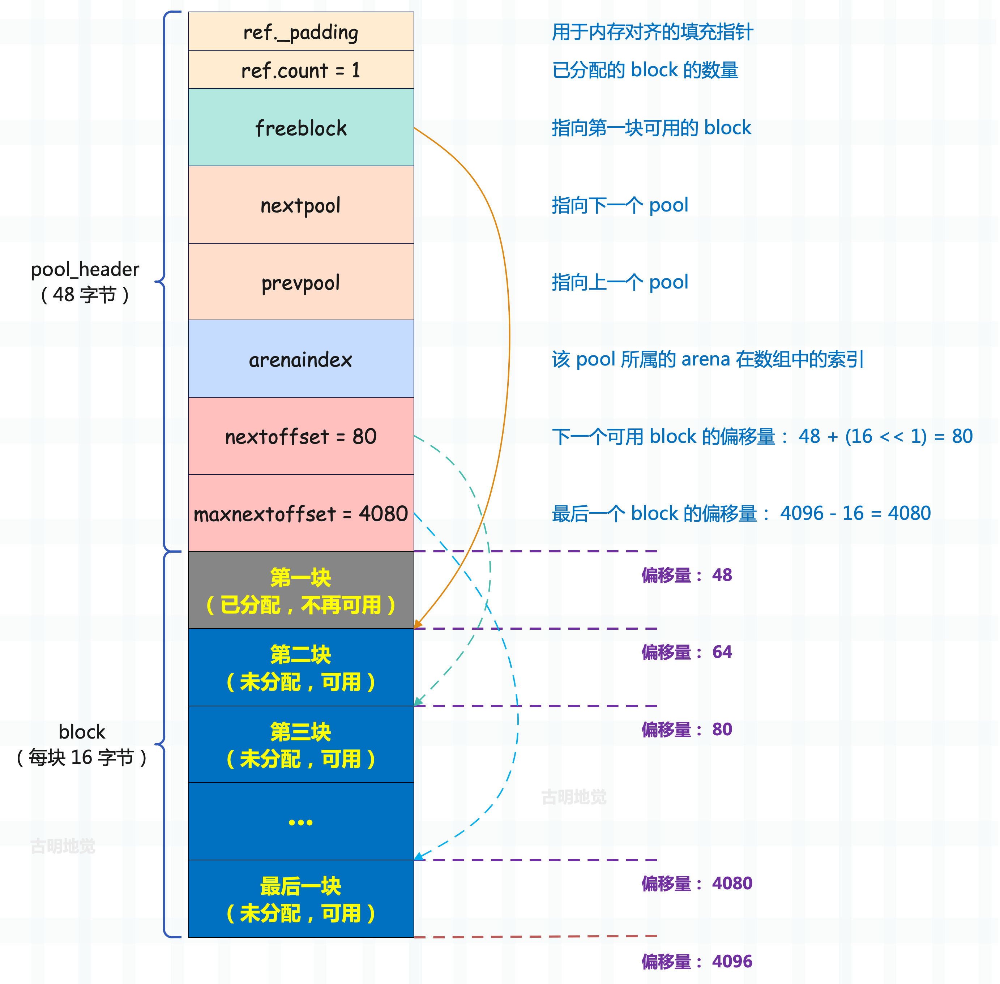

里面的实线箭头是指针，虚线箭头则是偏移位置的形象表示。

在了解完初始化之后的 pool 的结构之后，再来看看 Python 在申请 block 时，pool_header 中的各个字段是怎么变动的。假设我们再申请 1 个 16 字节的内存块：

~~~C
static void*
pymalloc_alloc(void *ctx, size_t nbytes)
{
    // ...
    // 还记得这行代码吗？如果 pool != pool->nextpool，说明当前的 pool 可用
    // 因为刚才已经创建完了 pool 了，所以当再次获取 block 时，这里的 if 条件成立
    if (pool != pool->nextpool) {
        // pool 中已分配的 block 数自增 1
        ++pool->ref.count;
        // freeblock 指向第一块可用的 block
        bp = pool->freeblock;
        assert(bp != NULL);
        // 这行代码是做什么的，我们稍后说，目前先不管它
        if ((pool->freeblock = *(block **)bp) != NULL) {
            goto success;
        }

        // 由于 freeblock 本身就指向可用的 block
        // 因此当再次申请 16 字节的 block 时，返回 freeblock 即可
        // 但还要修改 freeblock，让它指向下一块可用的 block
        // 分配之前，第一块可用 block 是第二块 block，被 freeblock 指向
        // 分配之后，第二块 block 就不可用了
        // 所以 freeblock 要指向第三块 block（作为新的第一块可用 block）
        // 那怎么才能获取下一块可用的 block 呢？
        if (pool->nextoffset <= pool->maxnextoffset) {
            // 显然要依赖于 nextoffset，它保存的正是下一块可用 block 的偏移量（分配前的第三块）
            // 所以 pool + nextoffset 就是下一块可用 block 的偏移量了
            // 将它赋值给freeblock即可
            pool->freeblock = (block*)pool +
                              pool->nextoffset;
            // 同理，nextoffset 也要向前移动一个 block 的距离
            // 因为分配之后，第三块 block 成为了第一块可用 block
            // 那么下一个可用 block 就应该是第四块 block
            pool->nextoffset += INDEX2SIZE(size);
            // 不断重复这个过程，即可对所有的 block 进行遍历
            // 而 maxnextoffset 指明了该 pool 中最后一个可用 block 的偏移量
            // 当 pool->nextoffset > pool->maxnextoffset
            // 也就是上面的 if 条件不满足时，就说明遍历完 pool 中所有的 block 了
            *(block **)(pool->freeblock) = NULL;
            goto success;
        }

        /* Pool is full, unlink from used pools. */
        next = pool->nextpool;
        pool = pool->prevpool;
        next->prevpool = pool;
        pool->nextpool = next;
        goto success;
    }
  
    // ...
}  
~~~

所以当我们再申请 1 个 16 字节的内存块时，pool 的结构图就变成了这样。

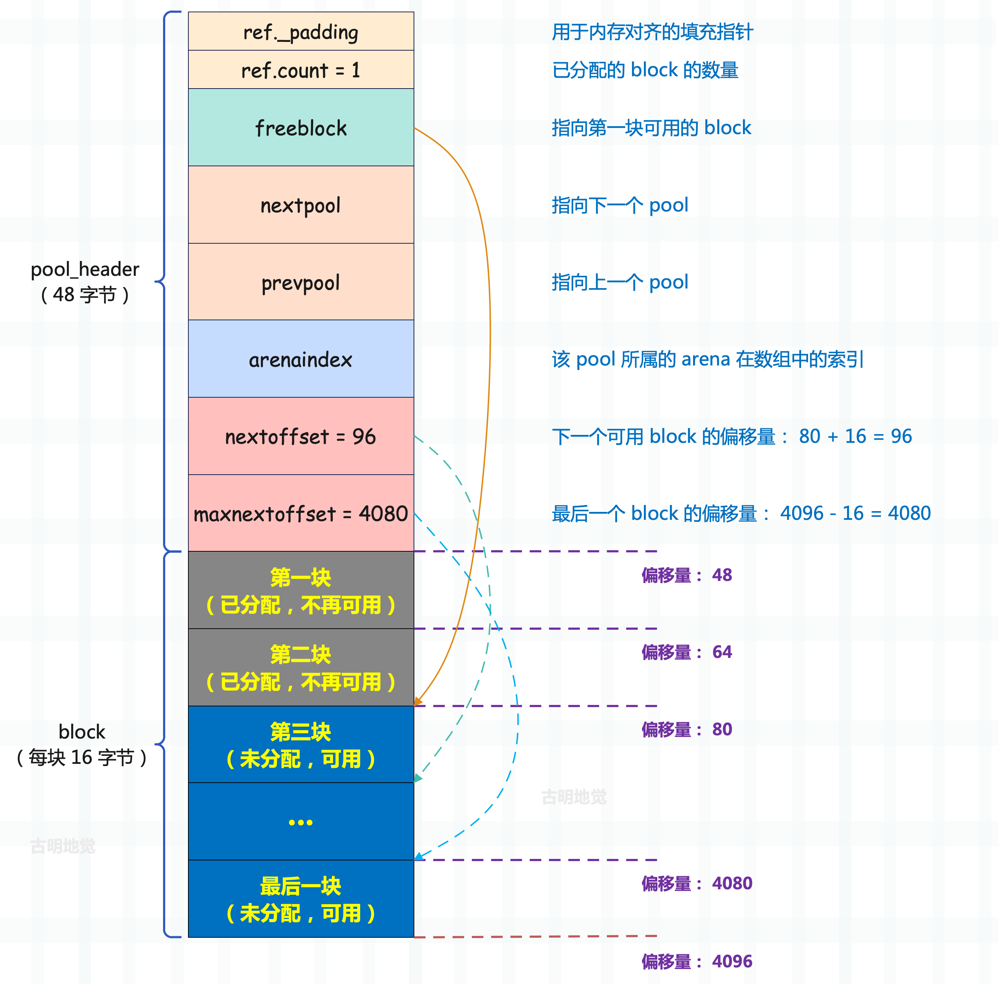

freeblock 指向了第三块 block，当然它仍是第一块可用 block。nextoffset 表示下一块可用 block 的偏移量，显然下一块的可用 block 在分配之后就变成了第四块，因此是 96。至于 maxnextoffset 仍然是 4080，它是不变的。

随着内存分配的请求不断发起，可用的内存块（block）也将不断地分配出去。而 freeblock 则是不断指向新的第一个可用内存块，当然 nextoffset 也在不断前进、偏移量每次增加内存块的大小，也就是保存新的下一个可用内存块的偏移量，直到所有的空闲内存块被消耗完。

所以，申请、前进、申请、前进，一直重复着相同的动作，整个过程非常自然，也很容易理解。但 pool 的大小是固定的，这就使得一个 pool 只能满足 (POOL_SIZE - 48) / size 次对 block 的申请，这就存在一个问题。我们知道内存块不可能一直被使用，肯定有释放的那一天。假设分配了两个内存块，理论上讲下一次应该申请第三个内存块，但某一时刻第一个内存块被释放了，那么下一次申请的时候，是申请第一个内存块、还是第三个内存块呢？

显然为了 pool 的使用效率，最好分配第一个 block。因此可以想象，一旦 Python 运转起来，内存的释放动作将导致 pool 中出现大量的离散可用 block。而 Python 为了知道哪些 block 是被使用之后再次释放（离散可用）的，必须建立一种机制，将这些离散可用的 block 组合起来，再次使用。这个机制就是 block 链表，这个链表的关键就在 pool_header 里面的 freeblock 字段身上。

再来回顾一下 pool_header 的定义：

~~~C
// Objects/obmalloc.c
struct pool_header {
    union { block *_padding;
            uint count; } ref;
    // 指向第一块可用的 block
    // 或者说指向可用 block 链表中的第一块 block
    block *freeblock;
    struct pool_header *nextpool;
    struct pool_header *prevpool;
    uint arenaindex;
    uint szidx;
    uint nextoffset;
    uint maxnextoffset;
};
~~~

当 pool 初始化完后之后，freeblock 指向了一个有效的地址，也就是可以分配出去的 block 的地址。然而奇特的是，当 Python 设置了 freeblock 时，还设置了 \*freeblock。这个动作看似诡异，然而我们马上就能看到设置 \*freeblock 的动作正是建立离散可用 block 链表的关键所在。

目前我们看到的 freeblock 只是在机械地前进，因为它在等待一个特殊的时刻。在这个特殊的时刻，你会发现 freeblock 开始成为一个苏醒的精灵，在这 4kb 的内存上灵活地舞动，而这个特殊的时刻就是一个 block 被释放的时刻。

~~~C
// Objects/obmalloc.c

// 将地址 P 向下对齐到 POOL_SIZE 的整数倍，比如 POOL_SIZE 是 4096，即 4K
// 那么 POOL_ADDR(4156) 就是 4096，POOL_ADDR(8234) 就是 8192
#define POOL_ADDR(P) ((poolp)_Py_ALIGN_DOWN((P), POOL_SIZE))
/*
内存布局：
4096  [pool header][block1][block2][block3]...  8192
      |            |
      pool起始     某个 block 的地址（比如 4356）
*/      
// 之所以需要这个宏，是为了给定一个 block 的地址，能找到它所属的 pool 的起始地址
// 因为 pool 总是按 POOL_SIZE 对齐的

static int
pymalloc_free(void *ctx, void *p)
{
    poolp pool;
    block *lastfree;
    poolp next, prev;
    uint size;

    assert(p != NULL);

#ifdef WITH_VALGRIND
    if (UNLIKELY(running_on_valgrind > 0)) {
        return 0;
    }
#endif
    // 获取 block 所属的 pool
    pool = POOL_ADDR(p);
    if (!address_in_range(p, pool)) {
        return 0;
    }
    
    assert(pool->ref.count > 0);
    // 将 pool->freeblock 赋值给 p
    *(block **)p = lastfree = pool->freeblock;
    pool->freeblock = (block *)p;
    // ...
}
~~~

在释放 block 时，神秘的 freeblock 惊鸿一瞥，显然覆盖在 freeblock 身上的那层面纱就要被揭开了。假设这时候 Python 释放的是 block 1，那么 block 1 被设置成了当前 freeblock 的值，然后 freeblock 的值被更新了，指向了 block 1 的首地址。就是这两个步骤，一个 block 被插入到了离散可用的 block 链表中。

简单点，说人话就是：原来 freeblock 指向 block 3，而 block 1 在被释放之后就变成了 block 1 指向 block 3，而 freeblock 则指向了 block 1，此时就形成了一个 block 链表，里面的每一个块都指向下一个可用的块。这时再回过头来看一下 pymalloc_alloc 函数，里面有一行代码刚才没有解释：

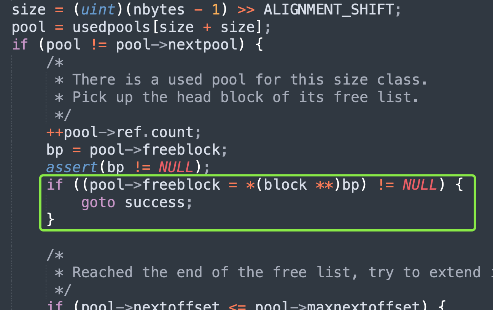

首先 bp 表示当前可用的 block，但在返回它之前，还要将 freeblock 设置为新的第一个可用 block。如果 bp 是申请之后又被回收的 block，那么 \*(block \*\*)bp 就是离散可用 block 链表中的下一个可用 block，即新的可用 block。因此当 \*(block \*\*)bp 不为空时，那么直接返回当前 block，即 bp，并且此时返回的 block 一定是申请之后又被回收的 block。

如果始终没有 block 被回收，或者说离散可用 block 链表中的 block 都用完了，那么这个 if 不会成立，而是继续向下执行，从 pool 的未使用空间中获取 block。通过这种方式可以优先复用已回收的内存，减少内存碎片，并提高内存使用效率。

所以在第一个 block 释放之后，pool 的结构图变化如下：

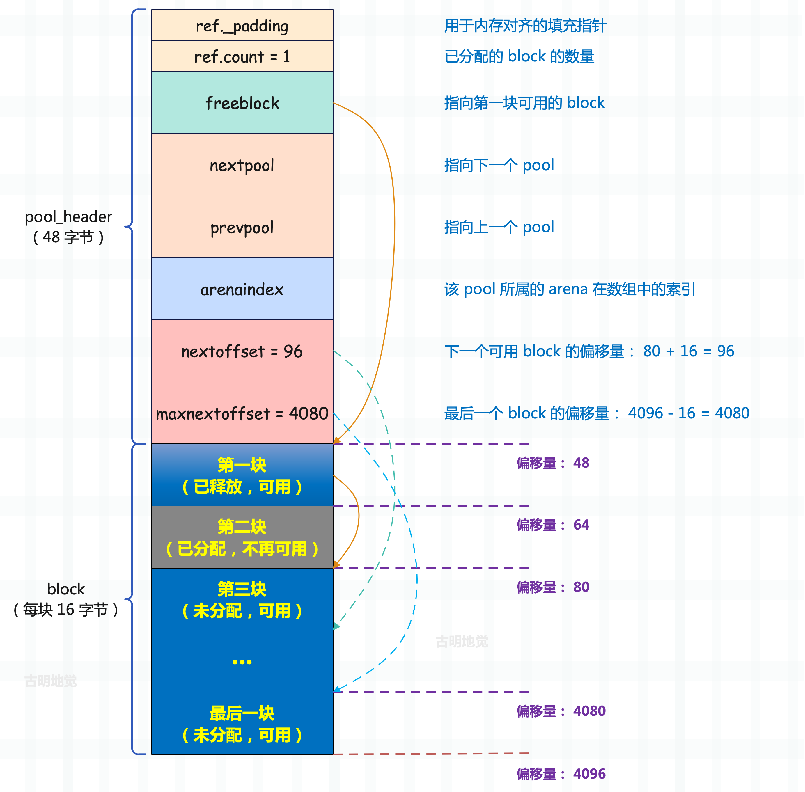

后续再分配内存的时候，会返回第一个 block，由于它保存了第三个 block 的地址，所以返回之前还会让 freeblock 指向第三个 block。到此这条实现方式非常奇特的 block 链表就被我们挖掘出来了，从 freeblock 开始，我们可以很容易地以 freeblock = \*freeblock 的方式遍历这条链表。而当发现 *freeblock 为 NULL 时，则表明到达了该链表（可用的 block 链表）的尾部了，那么下次就需要从 pool 的未使用空间中申请新的 block 了。

逻辑还是很好理解的，因此我们可以得出，一个 pool 在其声明周期内，可以处于以下三种状态：

+ empty：所有内存块（block）均可用，ref.count == 0。
+ used：内存块部分可用，ref.count != 0 && freeblock != NULL。
+ full：内存块均不可用，freeblock == NULL。

值得一提的是 empty 状态，此时内存块全部都是可用的，而可用有两种情况，第一种是从未被使用过，第二种是使用完之后又被释放了。而我们知道内存页一旦创建，第一个块肯定会分配出去，所以 empty 状态的内存页，至少有一个块是分配之后又被释放了的。当然不管怎么样，此时它们都是可用的。

然后再来考虑一个新的问题，在上面的代码中可以看到，如果离散可用的 block 链表中不存在可用的 block 时，会从 pool 中申请。而这是有条件的，必须满足：nextoffset <= maxnextoffset。但如果连这个条件都不成立了呢？说明 pool 中已经没有可用的 block 了，因为 pool 是有大小限制的。

那这个时候如果想再申请一个 block 要怎么做呢？答案很简单，再来一个 pool，然后从新的 pool 里面申请不就好了。

所以 block 组合起来可以成为一个 pool，那么同理多个 pool 也是可以组合起来的，而多个 pool 组合起来会得到什么呢。我们说内存池是分层次的，从下至上分别是：block、pool、arena，显然多个 pool 组合起来，就是 arena。

## arena

arena 是对多个 pool 聚合之后的结果，pool 的大小默认是 4kb，那么同样 arena 的大小也有一个默认值。

~~~c
// Objects/obmalloc.c
#define ARENA_SIZE              (256 << 10)     /* 256KB */
~~~

显然一个 arena 的大小默认是 256 kb，也就是 64 个 pool 的大小，我们来看看 arena 的底层结构体定义。

~~~C
// Objects/obmalloc.c
struct arena_object {
    // 通过 malloc 分配的内存区域的首地址，用于存储 pool 集合
    uintptr_t address;

    // address 按照 4KB 对齐之后的地址，即 pool 集合中第一个 pool 的首地址
    // 如果 address 本身恰好就是 4KB 对齐的，那么这两个字段的值就是一样的
    // 否则 pool_address 会大于 address，差值就是对齐的偏移量
    block* pool_address;

    // 该 arena 中可用 pool 的数量，包括空闲的 pool 和从未被分配过的 pool
    uint nfreepools;

    // 该 arena 中所有 pool 的数量，不管 pool 是否可用
    uint ntotalpools;

    // 在介绍 pool 的时候说过，pool 之间也会形成一个链表
    // 而这里的 freepools 会指向第一个可用 pool
    struct pool_header* freepools;

    // 从名字上也能看出这两这个字段是干啥的
    // nextarena 指向下一个 arena，prevarena 指向上一个 arena
    struct arena_object* nextarena;
    struct arena_object* prevarena;
};
~~~

一个概念上的 arena 在源码中对应一个 arena_object 结构体实例，确切的说，arena_object 实例仅仅是 arena 的一部分，就像 pool_header 仅仅是 pool 的一部分一样。

一个完整的 pool 包括一个 pool_header 实例和透过这个 pool_header 实例管理的 block 集合，同理一个完整的 arena 也包括一个 arena_object 实例和透过这个 arena_object 实例管理的 pool 集合。

### 未使用的 arena 和可用的 arena

在 arena_object 结构体的定义中，我们看到了 nextarena 和 prevarena，这似乎意味着会有一个或多个 arena 构成的链表。呃，这种猜测实际上只对了一半，实际上确实会存在多个 arena_object 构成的集合，但是这个集合不构成链表，而是一个数组。

数组的首地址由全局变量 arenas 来维护，这个数组就是 Python 中通用小块内存的内存池，所以现在我们算是知道这个内存池究竟是啥了。另一方面，nextarea 和 prevarena 也确实是用来连接 arena_object 组成链表的，咦，不是已经构成数组了吗？为啥又要来一个链表。

首先 arena 负责管理一组 pool 集合，pool 负责管理一组 block 集合，所以 arena_object 的实现看上去和 pool_header 有点类似。但实际上，arena_object 管理的内存（pool 使用）和 pool_header 管理的内存（block 使用）有一点细微的差别。

+ pool_header 和其管理的内存是连在一起的，整体是一块连续的内存。
+ arena_object 和其管理的内存则是分离的。

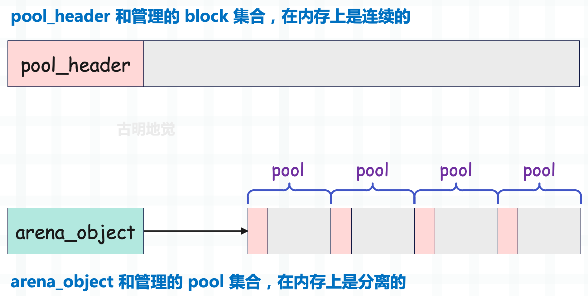

乍一看，貌似没啥区别，不过一个是连着的，一个是分开的。但是这背后隐藏了一个事实：当 pool_header 被申请时，它所管理的 block 的内存一定也被申请了；但是当 arena_object 被申请时，它所管理的 pool 集合的内存则没有被申请，此时 arena_object 的 address 字段为 0。

之后 arena_object 和 pool 集合会在某一时刻建立联系，所谓建立联系，其实就是为 pool 集合申请内存空间，然后让 address 字段保存这片空间的起始地址。

当一个 arena 的 arena_object 没有与 pool 集合建立联系的时候，这时的 arena 就处于未使用状态；一旦建立了联系，这时 arena 就变成了可用状态。这两种状态，都会分别对应一个 arena 链表。

+ 对于未使用的 arena，会通过 nextarena 链接成一个单向链表，prevarena 在这种情况下不使用。
+ 对于可用的 arena（关联的 pool 集合中至少有一个可用 pool），会通过 nextarena 和 prevarena 链接成一个双向链表，这个链表按照 nfreepools 的值递增排序。
+ 如果和 arena 关联的 pool 集合都不可用，此时两个指针无意义。

未使用的 arena 链表的表头是 unused_arena_objects，多个 arena_object 之间通过 nextarena 连接，并且是一个单向的链表；而可用的 arena 链表的表头是 usable_arenas，多个 arena_object 之间通过 nextarena、prevarena 连接，是一个双向链表。

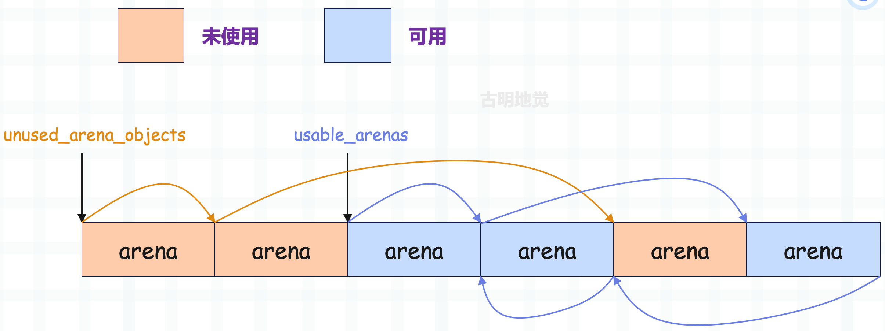

当然啦，arena 指的是 arena_object 和管理的一组 pool 集合，所以图中应该是 arena_object，不应该是 arena。不过为了避免图像太长，就用 arena 代替了，我们理解就好。

总结一下就是：arena 的 arena_object 是通过数组进行组织的，这个数组（arenas）就是所谓的内存池。然后 arena 又分为未使用和可用，未使用的 arena 里面的 arena_object 会用单向链表组织起来，可用的 arena 里面的 arena_object 会用双向链表组织起来。

### 申请 arena

在运行期间，虚拟机使用 new_arena 函数来创建一个arena_object，我们来看看它是如何被创建的。

~~~C
// arenas，指向 arena_object 数组的首元素
static struct arena_object* arenas = NULL;
// arena 数组中一共有多少个 arena_object
static uint maxarenas = 0;
// 指向未使用的 arena 链表的头结点
static struct arena_object* unused_arena_objects = NULL;
// 指向可用的 arena 链表的头结点
static struct arena_object* usable_arenas = NULL;
// 初始时需要申请的 arena_object 的个数
#define INITIAL_ARENA_OBJECTS 16

static struct arena_object*
new_arena(void)
{
    // 指向 arena_object 实例
    struct arena_object* arenaobj;
    // address 指向申请的内存空间，这片空间用于存储 pool 集合
    // 但 address 不一定是 4KB 对齐的，所以计算 address & POOL_SIZE_MASK 得到 excess
    // 那么 POOL_SIZE - excess 便是 address 距离下一个 4KB 对齐还差多少字节
    // 而 address + POOL_SIZE - excess 显然就是 pool_address
    uint excess;
    void *address;
    // 调试标志，-1 表示未初始化
    static int debug_stats = -1;
    // 检查环境变量来决定是否输出调试信息
    if (debug_stats == -1) {
        const char *opt = Py_GETENV("PYTHONMALLOCSTATS");
        debug_stats = (opt != NULL && *opt != '\0');
    }
    if (debug_stats)
        _PyObject_DebugMallocStats(stderr);
    
    // 如果未使用的 arena 链表为空
    if (unused_arena_objects == NULL) {
        uint i;
        uint numarenas;
        size_t nbytes;
        // 计算要申请的 arena 数量，如果 maxarenas 不为 0，那么翻倍扩容
        // 如果 maxarenas 为 0，说明第一次申请，那么默认申请 16 个
        numarenas = maxarenas ? maxarenas << 1 : INITIAL_ARENA_OBJECTS;
        // maxarenas 的类型是 uint，说明最多申请 2 ** 32 - 1 个 arena
        // 如果 numarenas <= maxarenas，说明发生了溢出
        if (numarenas <= maxarenas)
            return NULL;                /* overflow */
        // 在 32 位系统上的额外溢出检查
#if SIZEOF_SIZE_T <= SIZEOF_INT
        if (numarenas > SIZE_MAX / sizeof(*arenas))
            return NULL;                /* overflow */
#endif
        // 计算需要的总字节数并重新分配内存
        nbytes = numarenas * sizeof(*arenas);
        // arenaobj 指向了包含 numarenas 个 arena_object 实例的数组的首元素
        arenaobj = (struct arena_object *)PyMem_RawRealloc(arenas, nbytes);
        if (arenaobj == NULL)
            return NULL;
        // 赋值给 arenas
        // 这个 arenas 数组就是我们说的内存池，它里面包含了 N 个 arena_object
        // 每个 arena_object 的 address 会关联一片用于存储 pool 的内存区域
        arenas = arenaobj;
        
        assert(usable_arenas == NULL);
        assert(unused_arena_objects == NULL);

        // 初始化新的 arena_objects 并将它们链接起来
        for (i = maxarenas; i < numarenas; ++i) {
            // 标记为未关联，即当前的每个 arena_object 尚未关联对应的内存区域
            arenas[i].address = 0;
            // 未使用的 arena 之间会通过 nextarena 字段组成一个单向链表
            // 所以这些 arena 对应的 arena_object 不仅在一个数组中，它们之间还构成了一个链表 
            arenas[i].nextarena = i < numarenas - 1 ?
                                   &arenas[i+1] : NULL;
        }

        // 让 unused_arena_objects 指向未使用 arena 链表的头结点
        unused_arena_objects = &arenas[maxarenas];
        // 更新 arena 数组的实际元素个数，显然第一次申请的话，maxarenas 为 16
        // 如果后续未使用 arena 用完了，那么会再次申请，然后 maxarenas 会变成 32
        // 至于 unused_arena_objects 则会 &arenas[16]，因为它始终指向未使用 arena 链表的头结点
        maxarenas = numarenas;
    }

    // 到这里说明未使用 arena 链表不为空
    assert(unused_arena_objects != NULL);
    // 那么从未使用 arena 链表的头部取出一个 arena，或者说 arena_object，我们理解就好
    arenaobj = unused_arena_objects;
    // 取出之后，还要更新 unused_arena_objects，让它指向链表中下一个未使用 arena 的 arena_object
    unused_arena_objects = arenaobj->nextarena;
    // 对于未使用 arena，它还没有关联到某片内存区域，所以 address 一定是 0
    assert(arenaobj->address == 0);
    // 申请内存空间，大小为 256KB，用于存储 pool 集合
    address = _PyObject_Arena.alloc(_PyObject_Arena.ctx, ARENA_SIZE);
    // 如果 address 为 NULL，说明分配失败，那么将 arena_object 放回未使用列表
    if (address == NULL) {
        arenaobj->nextarena = unused_arena_objects;
        unused_arena_objects = arenaobj;
        return NULL;
    }
    // 保存分配的内存地址
    arenaobj->address = (uintptr_t)address;
    // 更新统计信息
    ++narenas_currently_allocated;
    ++ntimes_arena_allocated;
    if (narenas_currently_allocated > narenas_highwater)
        narenas_highwater = narenas_currently_allocated;
    // 设置属性
    // freepools 初始为 NULL
    arenaobj->freepools = NULL;
    // 先将 arenaobj->address 赋值为 arenaobj->pool_address
    arenaobj->pool_address = (block*)arenaobj->address;
    // 对于未使用 arena，它在申请空间之后，里面的所有 pool 都是可用的
    // 所以空闲 pool 的数量为 MAX_POOLS_IN_ARENA，即 64
    // #define MAX_POOLS_IN_ARENA  (ARENA_SIZE / POOL_SIZE)
    arenaobj->nfreepools = MAX_POOLS_IN_ARENA;
    // 将 address 按照 4KB 对齐，这里的 excess 是距离上一个 4KB 对齐的偏移量
    /*
       上一个 4KB 对齐        address        下一个 4KB 对齐
    */
    // 但很明显我们不能要上一个 4KB 对齐的地址，因为 address 是内存区域的首地址
    // 如果是上一个 4KB 对齐，那么就越界了，所以应该要下一个 4KB 对齐的地址
    excess = (uint)(arenaobj->address & POOL_SIZE_MASK);
    // 虽然 address 指向的内存区域是 256KB，能容纳 64 个 pool
    // 但 address 按照 4KB 对齐之后的地址，才是用于存储 pool 集合的首地址
    if (excess != 0) {
        // 如果 excess != 0，说明为了 4KB 对齐，需要向后跳 POOL_SIZE - excess 个字节
        // 这样留给 pool 集合的空间就会小于 256KB，因此可用 pool 的数量要减 1
        --arenaobj->nfreepools;  // 此时能存储的 pool 的数量是 63
        // pool_address 应该等于 address + POOL_SIZE - excess
        // 这才是用于 pool 集合的首地址
        arenaobj->pool_address += POOL_SIZE - excess;
    }
    // 如果 excess == 0，那么不用做额外处理
    // nfreepools 就是 64，pool_address 就是 address
  
    // 初始状态下 ntotalpools 等于 nfreepools
    arenaobj->ntotalpools = arenaobj->nfreepools;
    
    // 返回 arenaobj，即未使用 arena 链表中的首个 arena_object
    // 当然一旦返回，它的状态就变成了可用
    return arenaobj;
}
~~~

我们再描述一下上面代码所做的事情，Python 首先会检查未使用 arena 链表中是否还有未使用的 arena，检查的结果将决定后续的动作。

如果未使用 arena 链表中还存在未使用的 arena，那么会从头取走一个 arena，准确的说是 arena_object。接着调整未使用 arena 链表，让它和抽取的 arena_object 断绝一切联系。

然后 Python 申请了一块 256kb 大小的内存，并将内存的首地址赋给了取出来的 arena_object 的 address，显然这块 256kb 的内存就是 pool 的容身之处，这时候 arena_object 就已经和 pool 集合建立联系了。既然建立了联系，那么这个 arena 已经具备了成为可用的条件，该 arena 和未使用 arena 链表便脱离了关系，就等着被可用 arena 链表接收了，不过什么时候接收呢？先别急。

随后 Python 设置了一些 arena 用于维护 pool 集合的信息，需要注意的是，Python 将申请到的 256kb 内存进行了处理，主要是放弃了一些内存，并将可使用的内存边界（pool_address）调整到了与系统页对齐。

接着通过 `arenaobj->freepools = NULL` 将 freepools 设置为NULL，这不奇怪，基于对 freeblock 的了解，我们知道要等到释放一个 pool 时，这个 freepools 才会有用。最后我们看到，pool 集合占用的 256kb 内存在进行边界对齐后，实际是交给 pool_address 来维护的。

以上是未使用 arena 链表中还存在未使用 arena 的情况，但如果 unused_arena_objects 为 NULL，则表明目前系统中已经没有未使用的 arena 了，那么首先会扩大系统的 arenas 数组（内存池）。Python 在内部通过一个 maxarenas 变量维护了数组的元素个数，然后将待申请的 arena_object 的个数设置为 maxarenas 的 2 倍，当然首次初始化的时候因为 maxarenas 为 0，所以会申请 16 个。

在获得了新的 maxarenas 后，Python 会检查它是否溢出，即是否超过了 uint 的最大值。如果检查顺利通过，Python 会通过 realloc 扩大 arenas 指向的数组，并对新申请的 arena_object 进行设置，特别是那个不起眼的 address，要将新申请的 address 一律设置为 0。因为 address 负责标识 arena 是处于未使用状态还是可用状态，一旦 arena（内部的 arena_object）和 pool 集合建立了联系，这个 address 就变成了非 0。

## 内存池

先来回顾一个宏：

~~~C
#define SMALL_REQUEST_THRESHOLD 512
~~~

显然它是小块内存与大块内存的分界点，也就是说，当申请的内存不超过 512 个字节，pymalloc_alloc 会在内存池中申请内存；而当申请的内存超过了 512 字节，那么 pymalloc_alloc 将退化为 PyMem_Malloc，通过操作系统来申请内存。当然，通过修改 Python 源代码我们可以改变这个值，从而改变 Python 的默认内存管理行为。

虽然我们上面花了不少笔墨介绍 arena，同时也看到 arena 是 Python 小块内存池的最上层结构，其实所有 arena_object（和它关联的内存）的集合就是小块内存池（arenas）。然而在实际的使用中，Python 并不直接与 arena 打交道，当申请内存时，最基本的操作单元并不是 arena，而是 pool。估计有人到这里懵了，别急，慢慢来。

举个例子，当我们申请一个 28 字节的内存时，内部会在内存池中寻找一块能够满足需求的 pool，从中取出一个 block 返回，而不会去寻找 arena，这实际上是由 pool 和 arena 的属性决定的。在 Python中，pool 是一个有 size 概念的内存管理抽象体，一个  pool 中的 block 总是有确定的大小，这个 pool 总是和某个 Size class idx 对应。

而 arena 是没有 size 概念的内存管理抽象体，它内部会管理一个 pool 集合，也就是一组 pool。每一个 pool 里面所有 block 的规模都是相同的，但是不同 pool 里面的 block 的规模可以不同。

这就意味着，一个 arena 在某个时刻，其内部的所有 pool 的 szidx 可能都是相同的，也就是这些 pool 管理的都是同一种规格的 block，比如 32 字节。而到了另一个时刻，由于系统需要，这个 arena 被重新划分，其内部的所有 pool 管理的 block 可能又都变成 64 字节了。甚至一半的 pool 管理的是 32 字节 block，另一半的 pool 管理 64 字节 block，当然还有更多可能。

因为没有 size 的概念，这就决定了在进行内存分配和销毁时，所有的动作都是在 pool 上完成的。

> 一个 arena，并不要求 poo l集合中所有 pool 管理的 block 都必须一样，可以有管理 16 字节 block 的 pool，也可以有管理 32 字节 block 的 pool 等等。但是同一个 pool，里面的 block一定都是一样的。

对了， 一个 arena 可以管理一组 pool，那么对于 pool 而言，它怎么知道自己是隶属于哪一个 arena 呢？很简单，还记得 pool_header 里面的 arenaindex 字段吗？该字段负责维护 pool 隶属的 arena（或者说 arena_object）在数组中的索引。

此外内存池中的 pool 不仅仅是一个有 size 概念的内存管理抽象体，更进一步的，它还是一个有状态的内存管理抽象体。正如我们之前说的，一个 pool 在 Python 运行的任何一个时刻，总是处于以下三种状态中的一种：

**empty 状态**

pool 中所有的 block 都未被使用，处于这个状态的 pool 的集合通过其 pool_header 的 nextpool 字段构成一个链表，这个链表的表头就是 arena_object 里的 freepools 字段。另外，虽然不同 szidx 的 pool 会管理不同的规格的 block，但不管什么样的 pool，只要处于 empty 状态，都会被加入到这个链表中。

**used 状态**

pool 中至少有一个 block 已经被使用，并且至少有一个 block 未被使用，这种类型的 pool 会通过内部的 prevpool 字段和 nextpool 字段组成一个双向链表。但是注意，和 empty 状态的 pool 不同，used 状态的 pool 组成的双向链表有 64 条。

也就是说，对于 used 状态的 pool 而言，每条链表上面的 pool 的种类是相同的（szidx 一样），管理的都是同一种规格的 block。而不同 szidx 的 pool，则位于不同的双向链表中。而这 64 条双向链表会由一个名为 usedpools 的数组进行管理。

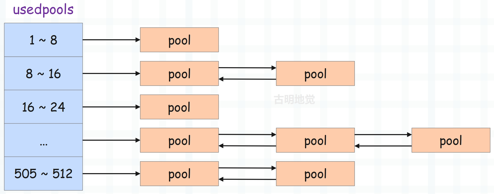

**full 状态**

pool 中所有的 block 都已经被使用，此时 Python 会将它闲置在一旁。因为 full 状态的 pool 是各自独立的，没有像其它状态的 pool 一样，连接成一个链表。

### used 状态的 pool 组成的双向链表

对于 used 状态的 pool 会组成一个双向链表，而这样的链表有 64 条，并且这 64 条双向链表会放在一个名为 usedpools 的数组中。关于这个数组一会再说，我们先以其中的一条链表为例，看看它的结构。

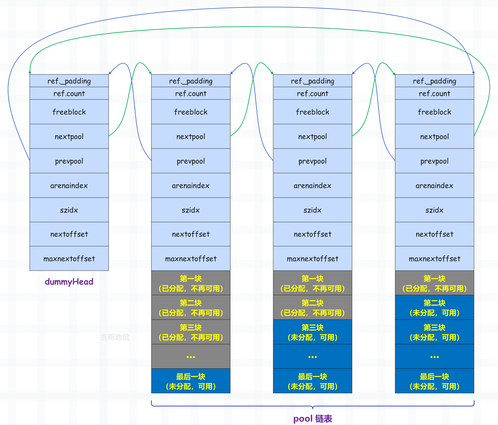

同一个双向链表中所有 pool 的 szidx 都是一样的，它们管理的都是同一种规格的 block，并且越靠后，可用的内存块（block）就越多。另外为了简化链表处理逻辑，Python 引入了一个 dummyHead，也就是虚拟头结点，如果这个链表为空，那么 dummyHead 的 nextpool 和 prevpool 都指向它自己。

既然是 dummyHead，说明它只是为了方便链表的维护，并不实际管理内存块，所以它只有一个 pool_header。但即便如此，仍然存在着内存浪费，因为 pool_header 内部有很多字段，可对于维护链表而言，只需要用 nextpool 和 prevpool 两个字段就够了。这两个字段总共 16 字节，而一个完整的 pool_header 是 48 字节，所以给 dummyHead 分配一个完整的 pool_header 会浪费 32 字节的内存。一条链表会浪费 32 字节，而这样的链表有 64 条，所以总共会浪费 2048 字节、也就是 2kb 的内存。

因此 Python 官方为了不让这样的事情发生，在分配的时候真的就只分配了 16 字节，并且把它当成是一个完整的 pool_header 来用。但问题是一个 pool_header 实例是 48 字节，只分配 16 字节也不够啊，Python 是怎么把 16 字节当成 48 字节来用的呢？

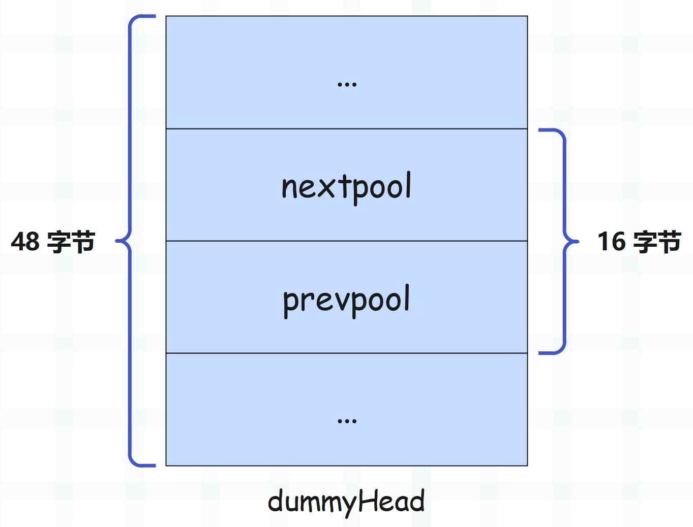

非常简单，分配的 16 字节不够的话，再借 32 字节不就行了吗。因此将 nextpool 和 prevpool 字段前后的空间都当做是 pool_header 的一部分，这样就能够得到一个完整的 pool_header 结构体实例。虽然这个实例是非法的，因为实际上这两个字段前后的空间不属于 pool_header，但这并不妨碍在精神层面上 YY 一下，就假装是自己的（相当于借用），因为除了 nextpool 和 prevpool 之外，其它部分的内存根本不会访问到。

所以我们上面画的那张双向链表的图，里面的 dummyHead 是不对的，真正存在的只有 nextpool 和 prevpool 两个字段，至于这两个字段前后的空间到底存了什么内容，在介绍 usedpools 时再聊。

现在假设来了一个内存分配请求，那么会使用链表的头结点分配内存块，如果可用的内存块都分配完了，即 pool 从 used 变成 full，那么就将它从链表中剔除。

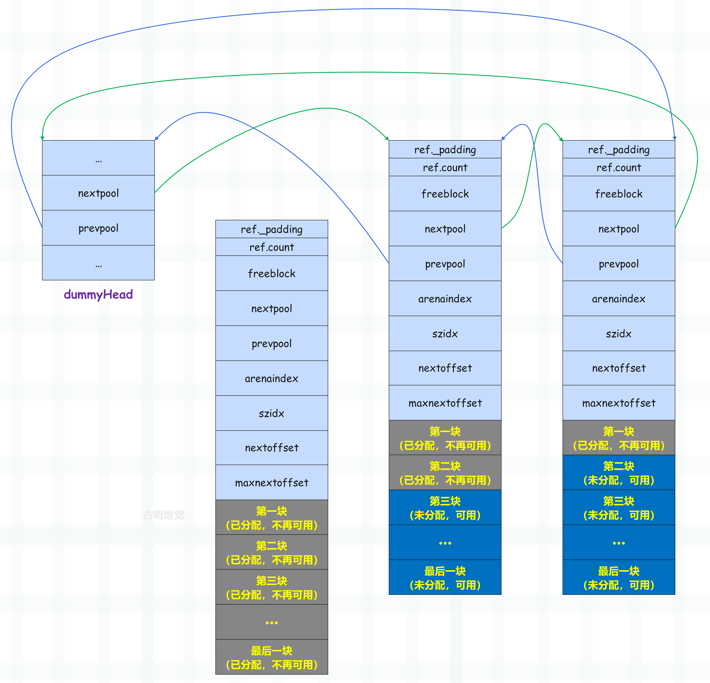

但如果 full 状态的 pool 的某个内存块释放了，即 pool 变成了 used 态，那么 Python 还会将它重新插入到双向链表的头部。为什么是插入到头部呢？前面说了，pool 链表中越是靠后的 pool，其内部可用的内存块（block）就越多，所以对于一个刚从 full 变成 used 的 pool 要插入到链表的头部，确保它后续会被优先使用。

如果一个 pool 里面所有的 block 都变得可用，那么这个 pool 的状态就从 used 变成了 empty，此时依旧会将它从链表中移除。因为每次获取内存块时，都会从链表的头部的 pool 开始获取，当 pool 从 full 变成 used 时也会插入到链表的头部，因此链表中越是靠后的 pool，可用的内存块就越多，越有可能变成 empty。

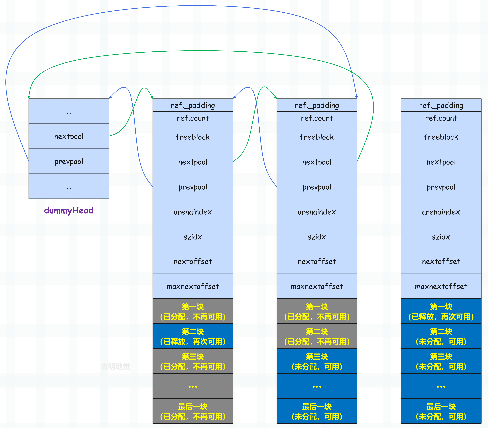

当 pool 变成 empty 时，Python 会将它从可用 pool 链表中移除，然后加入到 freepools 链表中，或者直接归还给操作系统。

### 64 个可用 pool 链表组成的数组

Python 内存块有 64 种，而每种规格的多个内存块都需要用一个可用 pool 链表来维护，那么显然会有 64 种 pool 链表。

那么如何组织这么多 pool 链表呢？最直接的办法就是分配一个长度为 64 的数组，这个数组就是上面提到的 usedpools，它里面存储了 64 个 pool 双向链表的 dummyHead。但我们知道这个 dummyHead 并不是一个正常的 pool_header，而是 nextpool 和 prevpool 两个字段、再加上前后各 16 字节的内存假装出来的 pool_header。

那么问题来了，每个 dummyHead 只能访问 nextpool 和 prevpool 两个字段，至于它前后的内存只是假装是自己的，实际上并不属于自己。那属于谁呢？很明显，因为每个 dummyHead 只分配了 16 字节的内存，用于 nextpool 和 prevpool，要想把自己当成 48 字节的 pool_header，那么只能借助它的上一个 dummyHead 和下一个 dummyHead。也正因为如此，Python 才能从这个 usedpools 数组中扣掉 2k 的内存。

而 usedpools 数组则维护着所有处于 used 状态的 pool 双向链表（的 dummyHead），当申请内存时，Python 就会通过 usedpools 寻找到一个可用的 pool（处于used状态），从中分配一个 block。那么这个数组长什么样子呢？

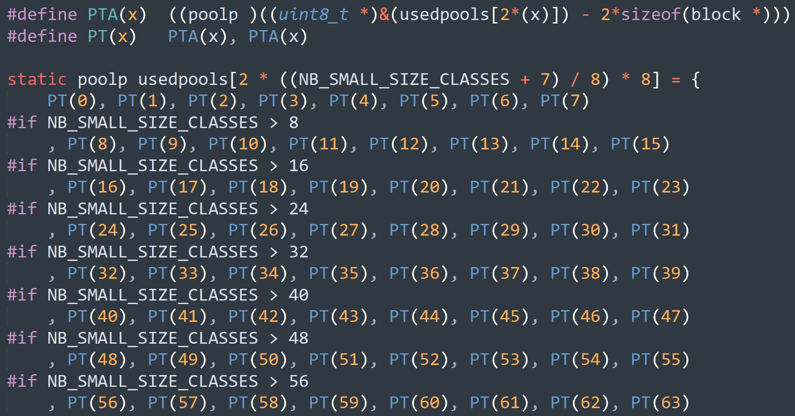

可能有人感觉这个数组看起来有点怪异，别急，我们画一张图就清晰了。

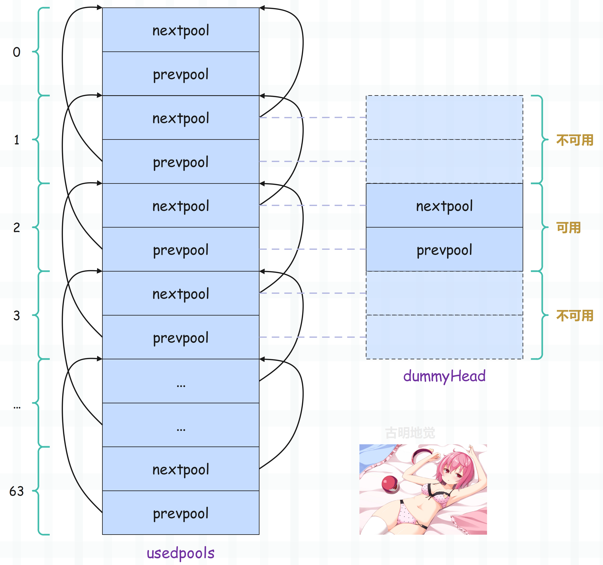

因此更准确的说，数组里面存储的其实是一组组的 nextpool 和 prevpool。当我们想获取第二个 dummyHead，那么就获取第二组的 nextpool 和 prevpool 即可。但别忘了，此时只有 16 字节，而 dummyHead 要想伪装成 pool_header 还差 32 字节。而差的这 32 字节，就由第一组和第三组的 nextpool 和 prevpool 来承载，只不过它们不能访问。

> 因此 usedpools 里面实际上有 128 个元素，但如果把 nextpool 和 prevpool 整体看成是一个 dummyHead（少了 32 字节）的话，那么逻辑上还是维护了 64 条双向链表。

但是在查找的时候有一个小 trick，再看一下上图，里面的每一个 nextpool 和 prevpool 都指向了上一个 nextpool。考虑一下当申请 18 字节的情形，由于 18 字节对应的 block 是 24 字节，所以 Size class idx 是 2，或者说对应的 pool 的 szidx 是 2，那么显然要获取 usedpools 中 szidx 为 2 的 pool 链表对应的 dummyHead，而 Python 会返回 usedpools[2+2]。同理，如果要获取 szidx 为 N 的 pool 链表对应的 dummyHead，那么会返回 usedpools[N+N] 。

我们继续以 szidx 为 2 的 pool 为例，对于这样的 pool，会返回 usedpools[4]，注意：虽然 usedpools 在逻辑上维护了 64 条链表，但它内部实际上有 128 个元素。然后 usedpools[4] 和 usedpools[5] 分别对应 dummyHead 的 nextpool 和 prevpool，但如果想要当成 pool_header 来操作，它还需要向上借 16 字节、向下借 16 字节，所以会将 usedpools[2]、usedpools[3]、usedpools[4]、usedpools[5]、usedpools[6]、usedpools[7] 这 48 字节整体看作一个 pool_header。

因此如果要当作 pool_header 来操作的话，那么内存地址是从 usedpools[2] 开始的，只是能操作的内存只有中间的 16 字节，即  usedpools[2]、usedpools[3]，当然也只需要操作这 16 字节。然后关键来了，从图中可以看到，usedpools[4] 的值正是指向 usedpools[2] 的地址。

所以这个设计就很巧妙，主要也和 pool_header 结构体有关。

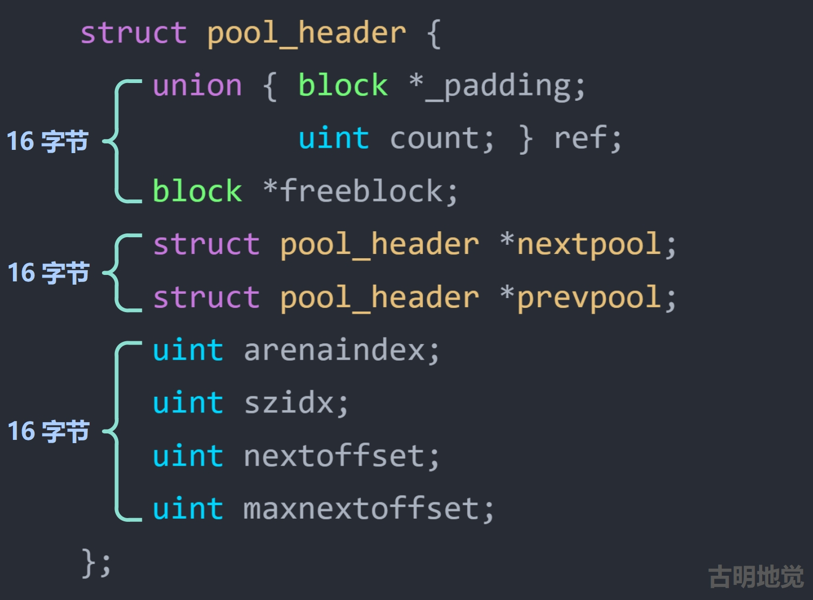

在 pool_header 中，nextpool 和 prevpool 加起来是 16 字节，而它们之前的字段和之后的字段加起来仍都是 16 字节，所以 nextpool 向上偏移 16 个字节之后正好是对应 pool_header 的起始位置。

因此 Python 的做法不是向上借 32 字节，也不会是向下借 32 字节，而是向上借 16 字节、向下借 16 字节，就是因为这种做法和 pool_header 结构体本身是完美契合的。以后再分配 block 的时候，只需要通过 `usedpools[szidx + szidx]->nextpool` 便可快速地从众多的 pool 中寻找到一个最适合当前内存需求的 pool，并从中分配一块block。当然，也可以很方便地将一个 pool 加入到 usedpools 中。

